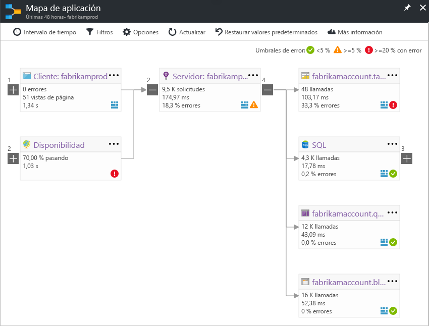

# Mapa de aplicación en Application Insights
En [Azure Application Insights](app-insights-overview.md), asignación de aplicación no es un aspecto visual de las relaciones de dependencia de Hola de los componentes de aplicación. Cada componente muestra KPI como toohelp de carga, el rendimiento, errores y alertas, detectar cualquier componente que se produce un error o problema de rendimiento. Puede hacer clic en a través de cualquier componente toomore obtener diagnósticos, tales como eventos de Application Insights. Si su aplicación usa los servicios de Azure, también puede hacer clic a través de diagnósticos de tooAzure, como las recomendaciones del Asistente de la base de datos de SQL.

Al igual que otros gráficos, puede anclar un toohello de asignación de aplicación panel de Azure, donde es totalmente funcional. 

## Asignación de la aplicación hello abierto
Hola abrir mapa de hoja de información general de hello para la aplicación:

mapa de Hello muestra:

* Pruebas de disponibilidad
* Componente de cliente (que se supervisan con hello SDK de JavaScript)
* Componente del lado servidor
* Dependencias de los componentes de cliente y servidor de Hola

Puede expandir y contraer los grupos de vínculos de dependencia:

Si tiene un gran número de dependencias de un tipo (SQL, HTTP, etc.), aparecen agrupadas. 

## Detección de problemas
Cada nodo tiene indicadores de rendimiento pertinentes, como las velocidades de carga y rendimiento, error de Hola para ese componente. 

Los iconos de advertencia resaltan los posibles problemas. Una advertencia naranja significa que hay errores en las solicitudes, las vistas de página o las llamadas de dependencia. Rojo significa un porcentaje de error superior al 5 %. Si desea tooadjust estos umbrales, abra Opciones.

También se muestran las alertas activas: 

Si usa SQL Azure, hay un icono que se muestra cuando hay recomendaciones sobre cómo mejorar el rendimiento. 

Haga clic en cualquier icono tooget más detalles:

## Recorrido por los diagnósticos mediante clic
Cada uno de los nodos de hello en el mapa de hello ofrece destino click-through para diagnósticos. Opciones de Hello varían según el tipo hello del nodo de Hola.

Para los componentes que se hospedan en Azure, las opciones de hello incluyen toothem de vínculos directos.

## Filtros e intervalo de tiempo
De forma predeterminada, mapa de hello resume todos los datos de hello disponibles para hello elegido el intervalo de tiempo. Pero puede filtrar nombres de las operaciones determinadas tooinclude o dependencias.

* Nombre de la operación: incluye vistas de página y tipos de solicitud del lado servidor. Con esta opción, Hola mapa muestra Hola KPI en el nodo de cliente/servidor hello para las operaciones de hello seleccionado solo. Muestra las dependencias de hello llamadas en el contexto de Hola de esas operaciones específicas.
* Nombre de base de dependencia: Esto incluye dependencias de explorador de AJAX de Hola y de servidor. Si informe de telemetría de dependencia personalizada con hello TrackDependency API, también aparecen aquí. Puede seleccionar tooshow de dependencias de hello en el mapa de Hola. Actualmente esta selección no filtra las solicitudes del servidor de Hola o vistas de página del lado cliente de Hola.

## Guardado de los filtros
filtros de hello toosave ha aplicado, Hola pin filtra vista en una [panel](app-insights-dashboards.md).

## Panel de errores
Al hacer clic en un nodo del mapa de hello, un panel de error se muestra en el lado derecho de hello resumir los errores de ese nodo. Los errores se agrupan en primer lugar por identificador de operación y, luego, por identificador de problema.

Al hacer clic en un error, le toohello instancia más reciente de ese error.

## Estado de los recursos
Para algunos tipos de recursos, estado de los recursos se muestra en la parte superior de hello del panel de errores de Hola. Por ejemplo, al hacer clic en un nodo de SQL se mostrará de estado de base de datos de Hola y las alertas que se ha activado.

Puede hacer clic en hello recurso nombre tooview estándar información general sobre las métricas para ese recurso.

## Mapas de la aplicación del sistema completo

*Se requiere la versión 2.3 o posterior del SDK*

Si la aplicación tiene varios componentes: por ejemplo, un servicio back-end además toohello web app -, a continuación, se puede mostrar usarlas en mapa de una aplicación integrada.

asignación de aplicación Hola busca los nodos de servidor siguiendo las llamadas de la dependencia HTTP entre los servidores con hello que Application Insights SDK instalado. Se supone que cada recurso de Application Insights toocontain un servidor.

### Mapa de aplicación de varios roles (versión preliminar)

característica de asignación de aplicación de varios roles de vista previa de Hello le permite toouse Hola aplicación asigna con varios servidores de envío de datos toohello mismo recurso de Application Insights / clave de instrumentación. Servidores de asignación de hello están segmentados por propiedad de cloud_RoleName hello en los elementos de telemetría. Establecer *asignación de la aplicación de varios roles* demasiado*en* de Hola tooenable de hoja de las vistas previas, esta configuración.

Este enfoque puede ser deseable en una aplicación de servicios de micro o en otros escenarios donde desea toocorrelate eventos a través de varios servidores dentro de un único recurso de Application Insights.

## Vídeo

> [!VIDEO https://channel9.msdn.com/events/Connect/2016/112/player] 

## Comentarios
Proporcione sus comentarios a través de la opción de comentarios de portal de Hola.

## Pasos siguientes

* [Portal de Azure](https://portal.azure.com)
