# Información general de Application Insights para DevOpsOverview of Application Insights for DevOps

Con [Application Insights](app-insights-overview.md) puede averiguar rápidamente cómo está funcionando su aplicación y cómo se está usando cuando está activa.With [Application Insights](app-insights-overview.md), you can quickly find out how your app is performing and being used when it's live. Si hay un problema, le permite conocer, ayuda a evaluar el impacto de Hola y ayuda a determinar la causa de Hola.If there's a problem, it lets you know about it, helps you assess hello impact, and helps you determine hello cause.

A continuación se muestra una cuenta de un equipo que desarrolla aplicaciones web:Here's an account from a team that develops web applications:

* *"Hace un par de días implementamos una revisión 'secundaria'. No ejecutar un paso de prueba amplia, pero lamentablemente se combina los algún cambio inesperado en la carga de hello, provocando incompatibilidad entre la parte delantera de Hola y back-ends. Inmediatamente, excepciones de servidor aumentaron, que se desencadena la alerta y se estábamos conocen la existencia de la situación de Hola. Unos pocos clics inmediatamente en el portal de Application Insights hello, que obtuvimos suficiente información de toonarrow de pilas de llamadas de excepción problema Hola. Se revierte inmediatamente y limita los daños de Hola. Application Insights ha realizado esta parte de hello devops ciclo muy sencilla y útil."**"A couple of days ago, we deployed a 'minor' hotfix. We didn't run a broad test pass, but unfortunately some unexpected change got merged into hello payload, causing incompatibility between hello front and back ends. Immediately, server exceptions surged, our alert fired, and we were made aware of hello situation. A few clicks away on hello Application Insights portal, we got enough information from exception callstacks toonarrow down hello problem. We rolled back immediately and limited hello damage. Application Insights has made this part of hello devops cycle very easy and actionable."*

En este artículo se siga un equipo en el banco de Fabrikam que desarrolla Hola online de banca toosee de sistema (OBS) cómo Application Insights tooquickly responder toocustomers y realizar actualizaciones.In this article we follow a team in Fabrikam Bank that develops hello online banking system (OBS) toosee how they use Application Insights tooquickly respond toocustomers and make updates.  

equipo de Hello trabaja en un ciclo de DevOps representado en hello siguiente ilustración:hello team works on a DevOps cycle depicted in hello following illustration:

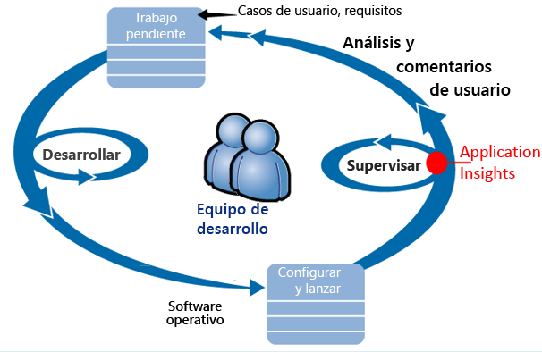

Los requisitos son la fuente del trabajo pendiente de desarrollo (lista de tareas).Requirements feed into their development backlog (task list). En resumen funcionan sprints, que a menudo entregar software que funciona - normalmente en forma de Hola de mejoras y extensiones de aplicación existente toohello.They work in short sprints, which often deliver working software - usually in hello form of improvements and extensions toohello existing application. aplicación de Hello en vivo se actualiza frecuentemente con nuevas características.hello live app is frequently updated with new features. Mientras está activa, el equipo de Hola supervisa para rendimiento y el uso con la Ayuda de Hola de Application Insights.While it's live, hello team monitors it for performance and usage with hello help of Application Insights. Estos datos de APM se retroalimentan en su trabajo pendiente de desarrollo.This APM data feeds back into their development backlog.

equipo de Hello utiliza toomonitor de aplicación web en directo Application Insights hello estrechamente para:hello team uses Application Insights toomonitor hello live web application closely for:

* Rendimiento.Performance. Desean toounderstand cómo tiempos de respuesta varían según el número de solicitudes; ¿cuánto se sirven CPU, red, discos y otros recursos; y dónde están los cuellos de botella de Hola.They want toounderstand how response times vary with request count; how much CPU, network, disk, and other resources are being used; and where hello bottlenecks are.
* Errores.Failures. Si hay excepciones o errores de solicitud, o si un contador de rendimiento queda fuera del intervalo se encuentra cómodo, Hola equipo necesidades tooknow rápidamente para que pueda tomar la acción.If there are exceptions or failed requests, or if a performance counter goes outside its comfortable range, hello team needs tooknow rapidly so that they can take action.
* Uso.Usage. Siempre que se publique una nueva característica, equipo de hello desee tooknow toowhat extensión se usa y, si los usuarios tienen dificultades con él.Whenever a new feature is released, hello team want tooknow toowhat extent it is used, and whether users have any difficulties with it.

Este artículo nos centraremos en la parte de comentarios de Hola del ciclo de hello:Let's focus on hello feedback part of hello cycle:

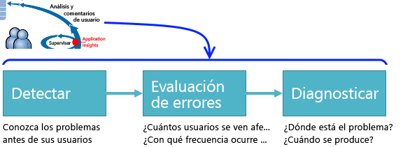

## Detección de disponibilidad insuficienteDetect poor availability
Marcela Markova es un desarrollador senior en el equipo OBS hello y toma Hola responsable de supervisar el rendimiento en línea.Marcela Markova is a senior developer on hello OBS team, and takes hello lead on monitoring online performance. Configura varias [pruebas de disponibilidad](app-insights-monitor-web-app-availability.md):She sets up several [availability tests](app-insights-monitor-web-app-availability.md):

* Una prueba de direcciones URL de la página de aterrizaje principal de hello para la aplicación hello, http://fabrikambank.com/onlinebanking/.A single-URL test for hello main landing page for hello app, http://fabrikambank.com/onlinebanking/. Establece los criterios de código HTTP 200 y el texto 'Welcome!'.She sets criteria of HTTP code 200 and text 'Welcome!'. Si se produce un error en esta prueba, hay algo no funciona bien con la red de Hola o servidores de Hola o puede ser un problema de implementación.If this test fails, there's something seriously wrong with hello network or hello servers, or maybe a deployment issue. (O alguien ha cambiado Hola bienvenida!(Or someone has changed hello Welcome! mensaje en la página Hola sin advertencia su conocidos).message on hello page without letting her know.)
* Una prueba de varios paso más profunda, que inicia una sesión y obtiene una lista de cuentas actuales, y donde se comprueban algunos detalles importantes en cada página.A deeper multi-step test, which logs in and gets a current account listing, checking a few key details on each page. Esta prueba comprueba que esa base de datos de cuentas de hello vínculo toohello funciona.This test verifies that hello link toohello accounts database is working. Marcela usa un identificador de cliente ficticio: se mantienen algunos de ellos con fines de prueba.She uses a fictitious customer id: a few of them are maintained for test purposes.

Con estas pruebas configurar, Marcela esté seguro de que ese equipo Hola sabrá rápidamente sobre cualquier interrupción.With these tests set up, Marcela is confident that hello team will quickly know about any outage.  

Errores se muestran como puntos rojos en gráfico de prueba de hello web:Failures show up as red dots on hello web test chart:

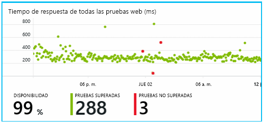

Pero lo más importante es que una alerta sobre cualquier error se envían por correo electrónico toohello equipo de desarrollo.But more importantly, an alert about any failure is emailed toohello development team. De esa manera, saberlo antes de que prácticamente todos los clientes de Hola.In that way, they know about it before nearly all hello customers.

## Supervisión del rendimientoMonitor Performance
En la página de información general de hello en Application Insights, hay un gráfico que muestra una variedad de [mediciones clave](app-insights-web-monitor-performance.md).On hello overview page in Application Insights, there's a chart that shows a variety of [key metrics](app-insights-web-monitor-performance.md).

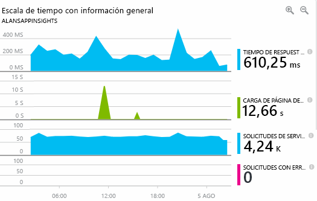

El tiempo de carga de la página del explorador se obtiene de la telemetría enviada directamente desde las páginas web.Browser page load time is derived from telemetry sent directly from web pages. Tiempo de respuesta de servidor, número de solicitudes de servidor y número de solicitudes con error son todos, medidos en el servidor web de Hola y envía información de tooApplication desde allí.Server response time, server request count, and failed request count are all measured in hello web server and sent tooApplication Insights from there.

Marcela es ligeramente interesarán gráfico de respuesta del servidor de Hola.Marcela is slightly concerned with hello server response graph. Este gráfico muestra el tiempo medio de hello entre cuando servidor hello recibe una solicitud HTTP de explorador del usuario y, cuando devuelve la respuesta Hola.This graph shows hello average time between when hello server receives an HTTP request from a user's browser, and when it returns hello response. No es inusual toosee una variación en este gráfico, tal y como se carga en el sistema de hello varía.It isn't unusual toosee a variation in this chart, as load on hello system varies. Pero en este caso, parece que hay toobe una correlación entre los pequeño se eleva Hola recuento de las solicitudes y grande aumenta en el tiempo de respuesta de Hola.But in this case, there seems toobe a correlation between small rises in hello count of requests, and big rises in hello response time. Podría indicar que el sistema de hello funciona solo en sus límites.That could indicate that hello system is operating just at its limits.

Abre los gráficos de servidores de hello:She opens hello Servers charts:

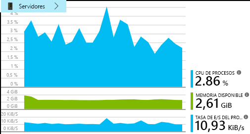

No parece que hay toobe ningún inicio de sesión de limitación de recursos, por lo que quizá Hola resaltes en los gráficos de respuesta del servidor de hello son simplemente una coincidencia.There seems toobe no sign of resource limitation there, so maybe hello bumps in hello server response charts are just a coincidence.

## Establecer alertas toomeet objetivosSet alerts toomeet goals
Sin embargo, le gustaría que tookeep un ojo en tiempos de respuesta de Hola.Nevertheless, she'd like tookeep an eye on hello response times. Si salen demasiado altos, que desea tooknow sobre él inmediatamente.If they go too high, she wants tooknow about it immediately.

Así que establece una [alerta](app-insights-metrics-explorer.md) para conocer los tiempos de respuesta que superen el umbral habitual.So she sets an [alert](app-insights-metrics-explorer.md), for response times greater than a typical threshold. Esto le da la seguridad de que obtendrá información si los tiempos de respuesta son lentos.This gives her confidence that she'll know about it if response times are slow.

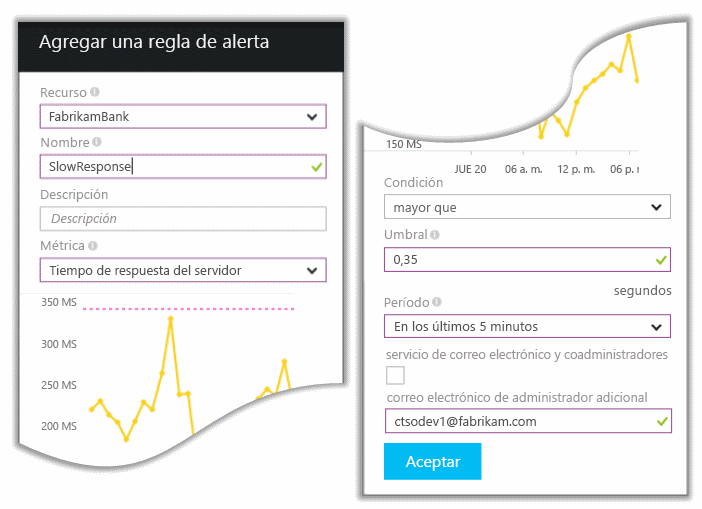

Las alertas se pueden establecer según una amplia variedad de métricas.Alerts can be set on a wide variety of other metrics. Por ejemplo, puede recibir mensajes de correo electrónico si se vuelve alto número de excepción de Hola o memoria disponible de hello entra baja, o si se produce un pico en las solicitudes de cliente.For example, you can receive emails if hello exception count becomes high, or hello available memory goes low, or if there is a peak in client requests.

## Mantenerse informado con las alertas de detección inteligenteStay informed with Smart Detection Alerts
El día siguiente, llega una alerta de Application Insights por correo electrónico.Next day, an alert email does arrive from Application Insights. Pero, al que lo abre, busca no es alerta de tiempo de respuesta de Hola que ha configurado.But when she opens it, she finds it isn't hello response time alert that she set. En lugar de eso, le indica que se ha producido un aumento repentino de las solicitudes con error; es decir, las solicitudes que han devuelto 500 códigos de error o más.Instead, it tells her there's been a sudden rise in failed requests - that is, requests that have returned failure codes of 500 or more.

Las solicitudes con error son que los usuarios han visto un error - normalmente tras una excepción que se produce en el código de hello.Failed requests are where users have seen an error - typically following an exception thrown in hello code. Quizás verán un mensaje que dice "Lo sentimos, no pudimos actualizar sus datos ahora"Maybe they see a message saying "Sorry we couldn't update your details right now." O bien, en el peor de errores absoluto, un volcado de la pila aparece en pantalla del usuario de hello, por cortesía de servidor web de Hola.Or, at absolute embarrassing worst, a stack dump appears on hello user's screen, courtesy of hello web server.

Esta alerta es una sorpresa, porque hello última vez que examinando, hello de solicitudes con error fue encouragingly bajo recuento.This alert is a surprise, because hello last time she looked at it, hello failed request count was encouragingly low. Un pequeño número de errores es toobe esperado en un servidor ocupado.A small number of failures is toobe expected in a busy server.

También era un poco de una sorpresa por ella porque incluso no tiene tooconfigure esta alerta.It was also a bit of a surprise for her because she didn't have tooconfigure this alert. Application Insights incluyen Detección inteligente.Application Insights include Smart Detection. Ajusta automáticamente el patrón de error habitual de la aplicación tooyour y errores "se acostumbra a" en una página concreta o bajo una carga elevada o las métricas de tooother vinculado.It automatically adjusts tooyour app's usual failure pattern, and "gets used to" failures on a particular page, or under high load, or linked tooother metrics. Genera una alarma de hello solo si hay un aumento por encima de lo que incluye tooexpect.It raises hello alarm only if there's a rise above what it comes tooexpect.

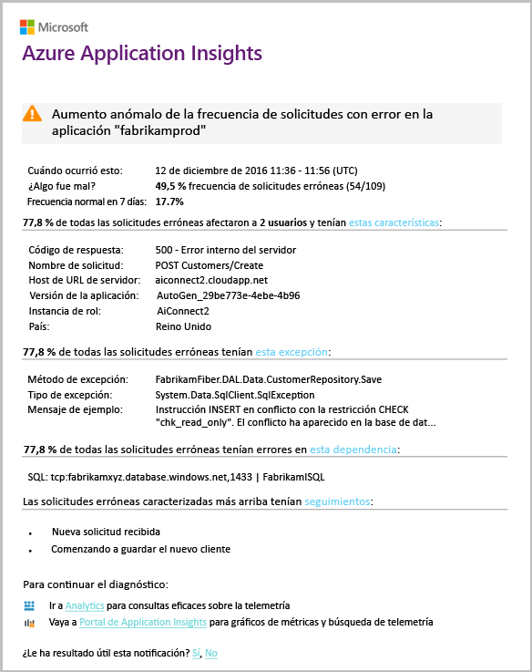

Se trata de un correo electrónico muy útil.This is a very useful email. No solo genera una alarma.It doesn't just raise an alarm. Esto consigue una gran cantidad de evaluación de errores de Hola y el trabajo de diagnóstico, demasiado.It does a lot of hello triage and diagnostic work, too.

Muestra cuántos clientes se ven afectados y en qué páginas web u operaciones.It shows how many customers are affected, and which web pages or operations. Marcela puede decidir si necesita trabajar en el objeto como un simulacro de todo equipo tooget hello, o si puede omitirla hasta que la semana próxima.Marcela can decide whether she needs tooget hello whole team working on this as a fire drill, or whether it can be ignored until next week.

correo electrónico de Hello también muestra que se ha producido una excepción determinada y - aún más interesante - ese error Hola está asociado a la base de datos de errores de llamadas tooa determinada.hello email also shows that a particular exception occurred, and - even more interesting - that hello failure is associated with failed calls tooa particular database. Esto explica por qué error Hola parecía repentinamente incluso aunque el equipo del Marcela no ha implementado recientemente las actualizaciones.This explains why hello fault suddenly appeared even though Marcela's team has not deployed any updates recently.

Marcella hace ping líder de Hola de equipo de base de datos de hello basándose en este correo electrónico.Marcella pings hello leader of hello database team based on this email. Ella se entera de que libere una revisión en hello último media hora; y no es posible que se haya producido un cambio de esquema secundaria...She learns that they released a hot fix in hello past half hour; and Oops, maybe there might have been a minor schema change....

Por lo tanto problema hello es en hello forma toobeing fijo, incluso antes de investigación de registros y dentro de 15 minutos de la misma que se deriven.So hello problem is on hello way toobeing fixed, even before investigating logs, and within 15 minutes of it arising. Sin embargo, Marcela hace clic en el vínculo de hello tooopen Application Insights.However, Marcela clicks hello link tooopen Application Insights. Se abre directamente en una solicitud con error y, puede ver la base de datos de error al llamar a en la lista asociada de Hola de llamadas de dependencia.It opens straight onto a failed request, and she can see the failed database call in hello associated list of dependency calls.

## Detectar excepcionesDetect exceptions
Con un poco de la instalación, [excepciones](app-insights-asp-net-exceptions.md) son tooApplication notificado visión automáticamente.With a little bit of setup, [exceptions](app-insights-asp-net-exceptions.md) are reported tooApplication Insights automatically. También se pueden capturar explícitamente mediante la inserción de llamadas demasiado[TrackException()](app-insights-api-custom-events-metrics.md#trackexception) en código de hello:They can also be captured explicitly by inserting calls too[TrackException()](app-insights-api-custom-events-metrics.md#trackexception) into hello code:  

    var telemetry = new TelemetryClient();
    ...
    try
    { ...
    }
    catch (Exception ex)
    {
       // Set up some properties:
       var properties = new Dictionary <string, string>
         {{"Game", currentGame.Name}};

       var measurements = new Dictionary <string, double>
         {{"Users", currentGame.Users.Count}};

       // Send hello exception telemetry:
       telemetry.TrackException(ex, properties, measurements);
    }

equipo de Fabrikam Bank Hola ha evolucionado práctica Hola de siempre enviar telemetría produce una excepción, a menos que haya una recuperación obvia.hello Fabrikam Bank team has evolved hello practice of always sending telemetry on an exception, unless there's an obvious recovery.  

De hecho, es incluso más amplio que el que su estrategia: enviar telemetría en todos los casos donde el cliente de hello es frustrado en lo que deseaban toodo, si corresponde tooan excepción en el código de hello o no.In fact, their strategy is even broader than that: They send telemetry in every case where hello customer is frustrated in what they wanted toodo, whether it corresponds tooan exception in hello code or not. Por ejemplo, si sistema de transferencia bancaria entre externa Hola devuelve un mensaje "no se puede completar esta transacción" por algún motivo operativa (ningún error de cliente hello), a continuación, hacen un seguimiento de ese evento.For example, if hello external inter-bank transfer system returns a "can't complete this transaction" message for some operational reason (no fault of hello customer) then they track that event.

    var successCode = AttemptTransfer(transferAmount, ...);
    if (successCode < 0)
    {
       var properties = new Dictionary <string, string>
            {{ "Code", returnCode, ... }};
       var measurements = new Dictionary <string, double>
         {{"Value", transferAmount}};
       telemetry.TrackEvent("transfer failed", properties, measurements);
    }

TrackException es tooreport usado excepciones porque envía una copia de la pila de Hola.TrackException is used tooreport exceptions because it sends a copy of hello stack. TrackEvent es tooreport usado otros eventos.TrackEvent is used tooreport other events. Puede vincular cualquier propiedad que podría resultar útil en el diagnóstico.You can attach any properties that might be useful in diagnosis.

Excepciones y eventos aparecen en hello [búsqueda diagnóstico](app-insights-diagnostic-search.md) hoja.Exceptions and events show up in hello [Diagnostic Search](app-insights-diagnostic-search.md) blade. Puede profundizar en ellos propiedades adicionales de toosee hello y seguimiento de pila.You can drill into them toosee hello additional properties and stack trace.

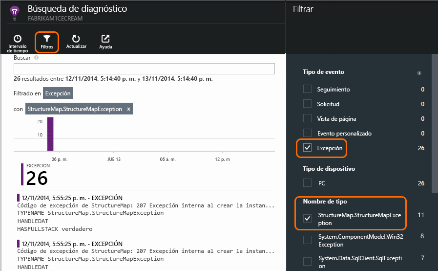

## Supervisar de forma proactivaMonitor proactively
Marcela no se sienta de brazos cruzados a esperar las alertas.Marcela doesn't just sit around waiting for alerts. Poco después de cada nueva implementación, echa un vistazo a [tiempos de respuesta](app-insights-web-monitor-performance.md) : ambos Hola figura general y recuentos de tabla Hola de solicitudes más lentas, así como la excepción.Soon after every redeployment, she takes a look at [response times](app-insights-web-monitor-performance.md) - both hello overall figure and hello table of slowest requests, as well as exception counts.  

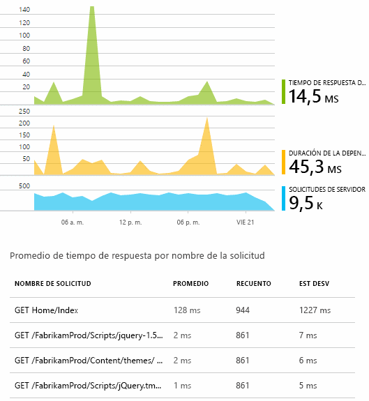

Puede evaluar el efecto de rendimiento de Hola de cada implementación normalmente comparar cada semana con hello última.She can assess hello performance effect of every deployment, typically comparing each week with hello last. Si hay un aumento repentino, genera con desarrolladores de hello relevante.If there's a sudden worsening, she raises that with hello relevant developers.

## Problemas de evaluación de erroresTriage issues
Evaluación de prioridades: evaluar la gravedad de Hola y el alcance de un problema - es Hola primer paso después de la detección.Triage - assessing hello severity and extent of a problem - is hello first step after detection. ¿Debemos llamamos out equipo Hola a medianoche?Should we call out hello team at midnight? ¿O bien, puede dejarse hasta Hola siguiente cómoda intervalo sin trabajo pendiente de hello?Or can it be left until hello next convenient gap in hello backlog? Hay algunas cuestiones importantes en la evaluación de errores.There are some key questions in triage.

¿Con qué frecuencia está sucediendo? gráficos de Hello en la hoja de información general de hello proporcionan algún problema de tooa de perspectiva.How often is it happening? hello charts on hello Overview blade give some perspective tooa problem. Por ejemplo, Fabrikam aplicación Hola genera alertas de prueba web cuatro una noche.For example, hello Fabrikam application generated four web test alerts one night. Examinar el gráfico de Hola de mañana Hola, equipo Hola percibirá que había hecho algunos puntos rojos, si sigue la mayoría de las pruebas de hello estuviera verde.Looking at hello chart in hello morning, hello team could see that there were indeed some red dots, though still most of hello tests were green. Obtención de detalles de gráfico de disponibilidad de hello, resultaba evidente que todos estos problemas intermitentes proceden de ubicación de una prueba.Drilling into hello availability chart, it was clear that all of these intermittent problems were from one test location. Se trataba obviamente de un problema de red que afectaba a una sola ruta, y es probable que se aclarara por sí solo.This was obviously a network issue affecting only one route, and would most likely clear itself.  

Por el contrario, un aumento significativo y estable en el gráfico de Hola de recuentos de excepción o tiempos de respuesta Obviamente, es algo toopanic sobre.By contrast, a dramatic and stable rise in hello graph of exception counts or response times is obviously something toopanic about.

Una táctica de evaluación de errores útil es probarlo usted mismo.A useful triage tactic is Try It Yourself. Si experimenta Hola mismo problema, sabrá que es real.If you run into hello same problem, you know it's real.

¿Qué fracción de usuarios se ven afectados? tooobtain una respuesta aproximada, divida la tasa de error de Hola por recuento de sesiones de Hola.What fraction of users are affected? tooobtain a rough answer, divide hello failure rate by hello session count.

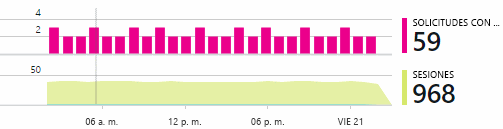

Cuando hay lentitud, comparar tabla Hola de solicitudes más lentas responde con frecuencia de uso de Hola de cada página.When there are slow responses, compare hello table of slowest-responding requests with hello usage frequency of each page.

¿Qué importancia tiene escenario Hola bloqueado?How important is hello blocked scenario? ¿Se trata de un problema funcional que bloquea un caso de usuario determinado?, ¿tiene mucha importancia?If this is a functional problem blocking a particular user story, does it matter much? Si los clientes no pueden pagar sus facturas, esto es grave; si no pueden cambiar sus preferencias de color de pantalla, quizás pueda esperar.If customers can't pay their bills, this is serious; if they can't change their screen color preferences, maybe it can wait. Hola detalles del evento de Hola o la excepción o identidad de Hola de página lenta hello, indica que los clientes están teniendo problemas.hello detail of hello event or exception, or hello identity of hello slow page, tells you where customers are having trouble.

## Diagnosticar problemasDiagnose issues
Un diagnóstico más detallado no es bastante Hola igual a la depuración.Diagnosis isn't quite hello same as debugging. Antes de iniciar el seguimiento a través del código de hello, debe tener una idea aproximada de por qué, cuándo y dónde se está produciendo el problema de Hola.Before you start tracing through hello code, you should have a rough idea of why, where and when hello issue is occurring.

**¿Al ocurrir?**  vista histórica de hello proporciona gráficos de evento y una métrica de hello resulta fácil toocorrelate efectos con las causas posibles.**When does it happen?** hello historical view provided by hello event and metric charts makes it easy toocorrelate effects with possible causes. Si hay subidas intermitentes en las tasas de tiempo o de una excepción de respuesta, busque en el número de solicitudes de hello: si alcanza el máximo en hello mismo tiempo, a continuación, parece que un problema de recursos.If there are intermittent peaks in response time or exception rates, look at hello request count: if it peaks at hello same time, then it looks like a resource problem. ¿Necesita tooassign más CPU o memoria?Do you need tooassign more CPU or memory? ¿O es una dependencia que no puede administrar la carga de hello?Or is it a dependency that can't manage hello load?

**¿Somos nosotros?****Is it us?**  Si tiene una disminución repentina en el rendimiento de un determinado tipo de solicitud - por ejemplo cuando Hola cliente espera un extracto de cuenta: no hay una posibilidad podría ser un subsistema externo en lugar de la aplicación web.If you have a sudden drop in performance of a particular type of request - for example when hello customer wants an account statement - then there's a possibility it might be an external subsystem rather than your web application. En el Explorador de métricas, seleccione la tasa de error de dependencia de Hola y las tasas de duración de la dependencia y comparar sus historiales sobre hello más allá de algunas horas o días, y ha detectado un problema de Hola.In Metrics Explorer, select hello Dependency Failure rate and Dependency Duration rates and compare their histories over hello past few hours or days with hello problem you detected. Si se correlación de cambios, un subsistema externo podría ser tooblame.If there are correlating changes, then an external subsystem might be tooblame.  

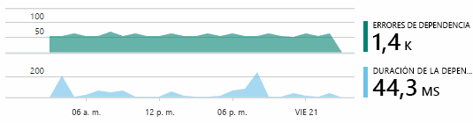

Algunos problemas de dependencia lenta son problemas de ubicación geográfica.Some slow dependency issues are geolocation problems. Fabrikam Bank usa máquinas virtuales de Azure, y descubrieron que habían ubicado sin darse cuenta el servidor web y el servidor de cuentas en distintos países.Fabrikam Bank uses Azure virtual machines, and discovered that they had inadvertently located their web server and account server in different countries. Migrando uno de ellos, se obtuvo una mejora considerable.A dramatic improvement was brought about by migrating one of them.

**¿Qué hicimos?****What did we do?** Si el problema de hello no parece toobe una dependencia, y si no estaba siempre existe, puede deberse a un cambio reciente.If hello issue doesn't appear toobe in a dependency, and if it wasn't always there, it's probably caused by a recent change. Hello perspectiva histórica proporciona gráficos de métricas y eventos de hello resulta fácil toocorrelate los cambios repentinos con las implementaciones.hello historical perspective provided by hello metric and event charts makes it easy toocorrelate any sudden changes with deployments. Que limita la búsqueda de hello para el problema de Hola.That narrows down hello search for hello problem.

**¿Qué está ocurriendo?****What's going on?** Algunos problemas se producen sólo en raras ocasiones y pueden ser difícil tootrack hacia abajo probando sin conexión.Some problems occur only rarely and can be difficult tootrack down by testing offline. Error de tootry toocapture Hola todo podemos hacer es cuando se produce en vivo.All we can do is tootry toocapture hello bug when it occurs live. Puede inspeccionar los volcados de pila hello en los informes de excepción.You can inspect hello stack dumps in exception reports. Además, puede escribir llamadas de seguimiento con su plataforma de registro favorita o con TrackTrace() o TrackEvent().In addition, you can write tracing calls, either with your favorite logging framework or with TrackTrace() or TrackEvent().  

Fabrikam tenía un problema intermitente con las transferencias entre cuentas, pero solo con determinados tipos de cuenta.Fabrikam had an intermittent problem with inter-account transfers, but only with certain account types. toounderstand mejor lo que estaba sucediendo, insertan llamadas TrackTrace() en determinados puntos clave en el código de hello, asociar el tipo de cuenta de hello como una llamada a tooeach de propiedad.toounderstand better what was happening, they inserted TrackTrace() calls at key points in hello code, attaching hello account type as a property tooeach call. Que hizo fácil toofilter out únicamente los seguimientos en la búsqueda de diagnóstico.That made it easy toofilter out just those traces in Diagnostic Search. También asocian valores de parámetro como llamadas de seguimiento de toohello de propiedades y las medidas.They also attached parameter values as properties and measures toohello trace calls.

## Responder toodiscovered problemasRespond toodiscovered issues
Una vez que se ha diagnosticado problema hello, puede realizar un toofix plan lo.Once you've diagnosed hello issue, you can make a plan toofix it. Tal vez necesite tooroll volver cambios recientes o quizás se puede seguir adelante y corregirlo.Maybe you need tooroll back a recent change, or maybe you can just go ahead and fix it. Una vez que se realiza la corrección de hello, Application Insights indica si se realizó correctamente.Once hello fix is done, Application Insights tells you whether you succeeded.  

Equipo de desarrollo de Fabrikam Bank tomar una medida de tooperformance enfoque estructurada más de lo que solían toobefore recurrían Application Insights.Fabrikam Bank's development team take a more structured approach tooperformance measurement than they used toobefore they used Application Insights.

* Objetivos de rendimiento en cuanto a medidas específicas establecen en la página de información general de Application Insights de Hola.They set performance targets in terms of specific measures in hello Application Insights overview page.
* Diseñar las medidas de rendimiento en la aplicación hello desde el principio de hello, como las métricas de Hola que miden el progreso de usuario a través de 'Embudos'.They design performance measures into hello application from hello start, such as hello metrics that measure user progress through 'funnels.'  

## Supervisar la actividad del usuarioMonitor user activity
Cuando el tiempo de respuesta es una buena coherencia y hay pocas excepciones, puede mover equipo de desarrollo de hello en toousability.When response time is consistently good and there are few exceptions, hello dev team can move on toousability. Puede pensar en cómo tooimprove Hola experiencia del usuario y cómo tooencourage más hello de tooachieve usuarios deseado objetivos.They can think about how tooimprove hello users' experience, and how tooencourage more users tooachieve hello desired goals.

Visión de la aplicación también puede ser usado toolearn hacer lo que los usuarios con una aplicación.Application Insights can also be used toolearn what users do with an app. Una vez que se ejecuta sin problemas, equipo de hello gustaría tooknow qué características están hello más popular, lo que, como usuarios o que tienen dificultades con, y la frecuencia con que vuelvan.Once it's running smoothly, hello team would like tooknow which features are hello most popular, what users like or have difficulty with, and how often they come back. Eso ayudará a establecer prioridades en su próximo trabajo.That will help them prioritize their upcoming work. Y puede planear correcto de hello toomeasure de cada característica como parte del ciclo de desarrollo de Hola.And they can plan toomeasure hello success of each feature as part of hello development cycle. 

Por ejemplo, un viaje de usuario típico a través del sitio web de hello tiene un claro "embudo".For example, a typical user journey through hello web site has a clear "funnel." Muchos clientes recurren a velocidades de Hola de diferentes tipos de préstamo.Many customers look at hello rates of different types of loan. Un número más pequeño vaya toofill en forma de expresión de código delimitada de Hola.A smaller number go on toofill in hello quotation form. De aquellos usuarios que tengan una cita, algunos continúe y retire préstamo Hola.Of those who get a quotation, a few go ahead and take out hello loan.

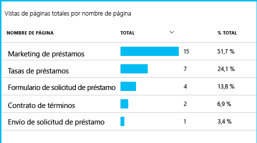

Teniendo en cuenta que quitan Hola números mayores de clientes, business Hola puede elaborar cómo tooget más usuarios a través de la parte inferior de toohello de Hola de embudo.By considering where hello greatest numbers of customers drop out, hello business can work out how tooget more users through toohello bottom of hello funnel. En algunos casos, podría haber un error (UX) de la experiencia del usuario: por ejemplo, el botón 'siguiente' hello es toofind de disco duro o instrucciones de hello no son evidentes.In some cases, there might be a user experience (UX) failure - for example, hello 'next' button is hard toofind, or hello instructions aren't obvious. Lo más probable, hay más significativos motivos empresariales para incompletas: quizás son demasiado altas tasas de préstamos de Hola.More likely, there are more significant business reasons for drop-outs: maybe hello loan rates are too high.

Cualesquiera motivos hello, datos de hello ayudan Hola equipo a averiguar lo que hacen los usuarios.Whatever hello reasons, hello data helps hello team work out what users are doing. Seguimiento más llamadas pueden ser inserta toowork más detalles.More tracking calls can be inserted toowork out more detail. TrackEvent() puede ser usado toocount ninguna acción del usuario, de detalle de Hola de clics de botón individual, logros toosignificant como buenos resultados un préstamo.TrackEvent() can be used toocount any user actions, from hello fine detail of individual button clicks, toosignificant achievements such as paying off a loan.

equipo de Hello está obteniendo toohaving usa información acerca de la actividad de usuario.hello team is getting used toohaving information about user activity. En la actualidad, cada vez que diseñan una nueva característica, calculan cómo obtendrán comentarios de su uso.Nowadays, whenever they design a new feature, they work out how they will get feedback about its usage. Diseñan llamadas de seguimiento en función de Hola desde el principio de Hola.They design tracking calls into hello feature from hello start. Usan características de hello comentarios tooimprove hello en cada ciclo de desarrollo.They use hello feedback tooimprove hello feature in each development cycle.

[Más información sobre el seguimiento del uso](app-insights-usage-overview.md).[Read more about tracking usage](app-insights-usage-overview.md).

## Aplicar ciclo de hello DevOpsApply hello DevOps cycle
Así es cómo un uso de equipo Application Insights individuales no solo toofix emite, pero tooimprove su ciclo de vida de desarrollo.So that's how one team use Application Insights not just toofix individual issues, but tooimprove their development lifecycle. Espero que les haya dado algunas ideas sobre cómo Application Insights puede ayudarle con la administración del rendimiento de sus propias aplicaciones.I hope it has given you some ideas about how Application Insights can help you with application performance management in your own applications.

## VídeoVideo

> [!VIDEO https://channel9.msdn.com/events/Connect/2016/112/player]

## Pasos siguientesNext steps
Puede comenzar a trabajar de varias maneras, dependiendo de las características de saludo de la aplicación.You can get started in several ways, depending on hello characteristics of your application. Seleccione lo que más le convenga:Pick what suits you best:

* [Aplicación web ASP.NETASP.NET web application](app-insights-asp-net.md)
* [Aplicación web de JavaJava web application](app-insights-java-get-started.md)
* [Aplicación web de Node.jsNode.js web application](app-insights-nodejs.md)
* Aplicaciones ya implementadas hospedadas en [IIS](app-insights-monitor-web-app-availability.md), [J2EE](app-insights-java-live.md) o [Azure](app-insights-azure.md).Already deployed apps, hosted on [IIS](app-insights-monitor-web-app-availability.md), [J2EE](app-insights-java-live.md), or [Azure](app-insights-azure.md).
* [Páginas Web](app-insights-javascript.md) -aplicación de una sola página o una página web normal - utilizarse por sí mismo o en tooany de adición de opciones de servidor hello.[Web pages](app-insights-javascript.md) - Single Page App or ordinary web page - use this on its own or in addition tooany of hello server options.
* [Pruebas de disponibilidad](app-insights-monitor-web-app-availability.md) tootest Hola de la aplicación desde internet público.[Availability tests](app-insights-monitor-web-app-availability.md) tootest your app from hello public internet.
