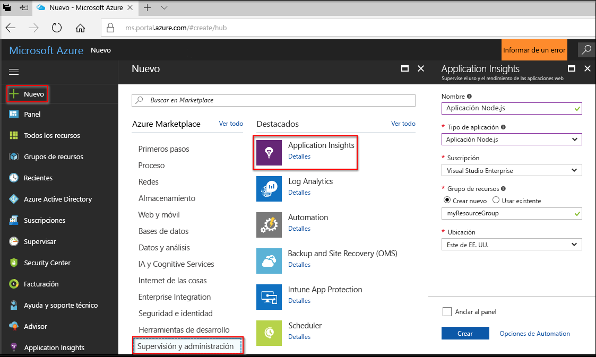
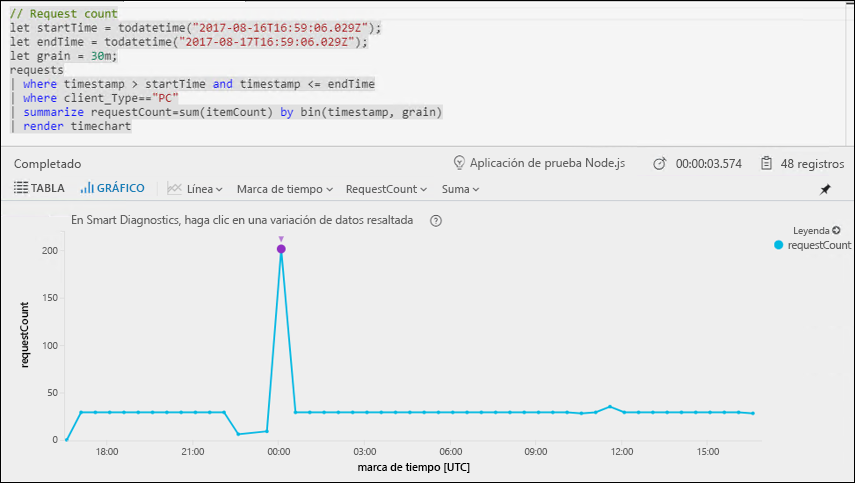
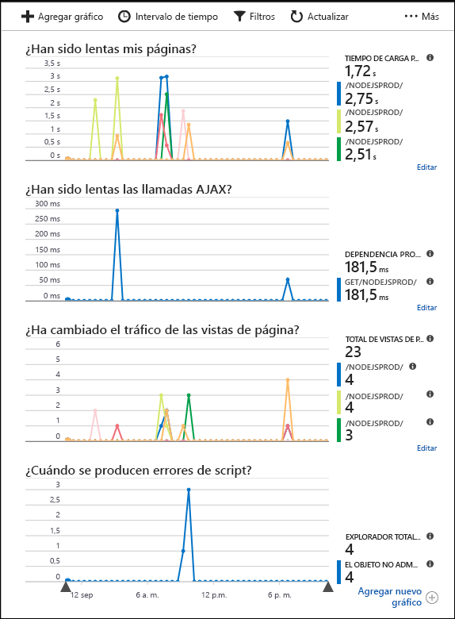

# <a name="start-monitoring-your-nodejs-web-application"></a>Inicio de la supervisión de la aplicación web Node.js

Con Azure Application Insights puede supervisar fácilmente la disponibilidad, el rendimiento y el uso de su aplicación web. También puede identificar rápidamente y diagnosticar errores en la aplicación sin tener que esperar a que un usuario informe de ellos. Con la versión 0.20 del SDK y posteriores, puede supervisar los paquetes externos comunes, como MongoDB, MySQL y Redis.

Esta guía de inicio rápido le ayudará a agregar la versión 0.22 del SDK de Application Insights a una aplicación web Node.js existente.

## <a name="prerequisites"></a>Requisitos previos

Para completar esta guía de inicio rápido:

- Necesitará una suscripción de Azure y una aplicación web Node.js existente.

Si no tiene una aplicación web Node.js, puede crear una siguiendo la [guía de creación de una aplicación web Node.js](https://docs.microsoft.com/azure/app-service/app-service-web-get-started-nodejs).
 
Si no tiene una suscripción a Azure, cree una cuenta [gratuita](https://azure.microsoft.com/free/) antes de empezar.

## <a name="log-in-to-the-azure-portal"></a>Iniciar sesión en Azure Portal

Inicie sesión en [Azure Portal](https://portal.azure.com/).

## <a name="enable-application-insights"></a>Habilitación de Application Insights

Application Insights recopila datos de telemetría desde cualquier aplicación conectada a Internet, independientemente de si se está ejecutando localmente o en la nube. Siga estos pasos para empezar a ver los datos.

1. Seleccione **Nuevo** > **Supervisión y administración** > **Application Insights**.

   

   Aparecerá un cuadro de configuración, use la tabla siguiente para rellenar los campos de entrada.

    | Settings        | Valor           | Descripción  |
   | ------------- |:-------------|:-----|
   | **Name**      | Nombre único global | Nombre que identifica la aplicación que se está supervisando |
   | **Tipo de aplicación** | Aplicación Node.js | Tipo de aplicación que se está supervisando |
   | **Grupo de recursos**     | myResourceGroup      | Nombre para el nuevo grupo de recursos que hospedará los datos de Application Insights |
   | **Ubicación** | Este de EE. UU. | Elija una ubicación cerca de usted o de donde se hospeda la aplicación |

2. Haga clic en **Crear**.

## <a name="configure-app-insights-sdk"></a>Configuración del SDK de Application Insights

1. Seleccione **Introducción** > **Información esencial** > copie la **clave de instrumentación** de la aplicación.

   

2. Agregue el SDK de Application Insights para Node.js a la aplicación. Desde la carpeta raíz de la aplicación, ejecute:

   ```bash
   npm install applicationinsights --save
   ```

3. Edite el primer archivo .js de la aplicación y agregue las dos líneas siguientes a la parte superior del script. Si usa la [aplicación de inicio rápido de Node.js](https://docs.microsoft.com/azure/app-service/app-service-web-get-started-nodejs), se modificará el archivo index.js. Reemplace &lt;instrumentation_key&gt; con la clave de instrumentación de la aplicación. 

   ```JavaScript
   const appInsights = require('applicationinsights');
   appInsights.setup('<instrumentation_key>').start();
   ```

4. Reinicie la aplicación.

> [!NOTE]
> Los datos tardan unos 3-5 minutos en empezar a aparecer en el portal. Si se trata de una aplicación de prueba de poco tráfico, tenga en cuenta que la mayoría de las métricas se capturan solo cuando hay solicitudes u operaciones activas.

## <a name="start-monitoring-in-the-azure-portal"></a>Inicio de la supervisión en Azure Portal

1. Ahora puede volver a abrir la página **Introducción** de Application Insights en Azure Portal; para ello, de donde recuperó la clave de instrumentación, para ver los detalles de la aplicación en ejecución.

   

2. Haga clic en **Mapa de la aplicación** para un diseño visual de las relaciones de dependencia entre los componentes de la aplicación. Cada componente muestra KPI como la carga, el rendimiento, errores y alertas.

   

3. Haga clic en el icono **Análisis de aplicaciones** .  Se abrirá **Application Insights Analytics**, que proporciona un lenguaje de consulta completo para analizar todos los datos recopilados por Application Insights. En este caso, se genera una consulta que representa el número de solicitudes en un gráfico. Puede escribir sus propias consultas para analizar otros datos.

   

4. Vuelva a la página **Introducción** y examine el **Escala de tiempo con información general de Estado**.  Este panel proporciona estadísticas sobre el estado de aplicación, incluido el número de solicitudes entrantes, la duración de las solicitudes y los errores que se producen. 

   

   Para habilitar el gráfico **Tiempo de carga de la vista de página** que se rellenará con los datos de **Telemetría del lado cliente**, agregue este script para cada página de las que desee realizar el seguimiento:

   ```HTML
   <!-- 
   To collect end-user usage analytics about your application, 
   insert the following script into each page you want to track.
   Place this code immediately before the closing </head> tag,
   and before any other scripts. Your first data will appear 
   automatically in just a few seconds.
   -->
   <script type="text/javascript">
     var appInsights=window.appInsights||function(config){
       function i(config){t[config]=function(){var i=arguments;t.queue.push(function(){t[config].apply(t,i)})}}var t={config:config},u=document,e=window,o="script",s="AuthenticatedUserContext",h="start",c="stop",l="Track",a=l+"Event",v=l+"Page",y=u.createElement(o),r,f;y.src=config.url||"https://az416426.vo.msecnd.net/scripts/a/ai.0.js";u.getElementsByTagName(o)[0].parentNode.appendChild(y);try{t.cookie=u.cookie}catch(p){}for(t.queue=[],t.version="1.0",r=["Event","Exception","Metric","PageView","Trace","Dependency"];r.length;)i("track"+r.pop());return i("set"+s),i("clear"+s),i(h+a),i(c+a),i(h+v),i(c+v),i("flush"),config.disableExceptionTracking||(r="onerror",i("_"+r),f=e[r],e[r]=function(config,i,u,e,o){var s=f&&f(config,i,u,e,o);return s!==!0&&t["_"+r](config,i,u,e,o),s}),t
       }({
           instrumentationKey:"<insert instrumentation key>"
       });
       
       window.appInsights=appInsights;
       appInsights.trackPageView();
   </script>
   ```

5. Haga clic en **Explorador** debajo del encabezado **Investigar**. Aquí encontrará las métricas relacionadas con el rendimiento de las páginas de la aplicación. Puede hacer clic en **Agregar nuevo gráfico** para crear vistas personalizadas adicionales o seleccionar **Editar** para modificar los tipos de gráfico existentes, el alto, la paleta de colores, las agrupaciones o las métricas.

   

Para más información sobre la supervisión de Node.js, visite la [documentación adicional de Node.js con Application Insights](app-insights-nodejs.md).

## <a name="clean-up-resources"></a>Limpieza de recursos

Si tiene previsto seguir trabajando con las siguientes guías de inicio rápido o tutoriales, no elimine los recursos creados en esta guía de inicio rápido. Si no tiene previsto continuar, siga estos pasos para eliminar todos los recursos creados por esta guía de inicio rápido en Azure Portal.

1. En el menú izquierdo de Azure Portal, haga clic en **Grupos de recursos** y en **myResourceGroup**.
2. En la página del grupo de recursos, haga clic en **Eliminar**, escriba **myResourceGroup** en el cuadro de texto y haga clic en **Eliminar**.

## <a name="next-steps"></a>Pasos siguientes

> [!div class="nextstepaction"]
> [Búsqueda y diagnóstico de problemas de rendimiento](https://docs.microsoft.com/azure/application-insights/app-insights-analytics)
