# ¿Qué es Application Insights?What is Application Insights?
Application Insights es un servicio de Application Performance Management (APM) extensible para desarrolladores web en varias plataformas.Application Insights is an extensible Application Performance Management (APM) service for web developers on multiple platforms. Usar toomonitor la aplicación web en directo.Use it toomonitor your live web application. Se detectarán automáticamente las anomalías de rendimiento.It will automatically detect performance anomalies. Incluye análisis eficaces herramientas toohelp que diagnosticar problemas y toounderstand lleva a cabo lo que los usuarios con la aplicación.It includes powerful analytics tools toohelp you diagnose issues and toounderstand what users actually do with your app.  Se ha diseñado toohelp continuamente mejorar el rendimiento y facilidad de uso.It's designed toohelp you continuously improve  performance and usability. Funciona para las aplicaciones en una amplia variedad de plataformas como. NET, Node.js y J2EE, hospedado en local o en la nube de Hola.It works for apps on a wide variety of platforms including .NET, Node.js and J2EE, hosted on-premises or in hello cloud. Se integra con el proceso de devOps y tiene puntos de conexión tooa gran variedad de herramientas de desarrollo.It  integrates with your devOps process, and has connection points tooa variety of development tools.

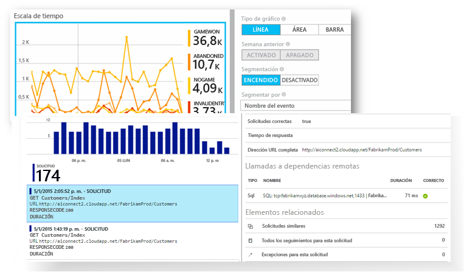

[Eche un vistazo a la animación de introducción de hello](https://www.youtube.com/watch?v=fX2NtGrh-Y0).[Take a look at hello intro animation](https://www.youtube.com/watch?v=fX2NtGrh-Y0).

## ¿Cómo funciona Application Insights?How does Application Insights work?
Instalar un paquete pequeño instrumentación en la aplicación y configurar un recurso de Application Insights en el portal de Microsoft Azure Hola.You install a small instrumentation package in your application, and set up an Application Insights resource in hello Microsoft Azure portal. instrumentación de Hello supervisa la aplicación y envía el portal de toohello de datos de telemetría.hello instrumentation monitors your app and sends telemetry data toohello portal. (aplicación hello puede ejecutar desde cualquier lugar; no tiene toobe hospedado en Azure.)(hello application can run anywhere - it doesn't have toobe hosted in Azure.)

Puede instrumentar la aplicación de servicio web de hello no solo, sino también todos los componentes de fondo y Hola JavaScript en páginas web de Hola por sí mismos.You can instrument not only hello web service application, but also any background components, and hello JavaScript in hello web pages themselves. 

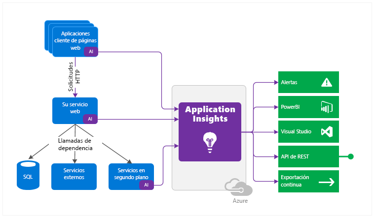

Además, puede insertar telemetría de los entornos de host de hello como contadores de rendimiento, diagnósticos de Azure o registros de Docker.In addition, you can pull in telemetry from hello host environments such as performance counters, Azure diagnostics, or Docker logs. También puede configurar las pruebas web que envían periódicamente solicitudes sintéticas tooyour servicio de web.You can also set up web tests that periodically send synthetic requests tooyour web service.

Todas estas secuencias de telemetría se integran en Hola portal de Azure, donde puede aplicar eficaz analíticos y datos sin procesar de toohello de herramientas de búsqueda.All these telemetry streams are integrated in hello Azure portal, where you can apply powerful analytic and search tools toohello raw data.

### ¿Qué es la sobrecarga de hello?What's hello overhead?
impacto de Hello en el rendimiento de la aplicación es muy pequeña.hello impact on your app's performance is very small. Las llamadas de seguimiento no suponen ningún tipo de bloqueo y se agrupan por lotes y se envían en un subproceso aparte.Tracking calls are non-blocking, and are batched and sent in a separate thread.

## ¿Qué supervisa Application Insights?What does Application Insights monitor?

Application Insights está dirigido al equipo de desarrollo de hello, toohelp comprender el rendimiento de la aplicación y cómo se usa.Application Insights is aimed at hello development team, toohelp you understand how your app is performing and how it's being used. Supervisa:It monitors:

* **Tasas de solicitud, tiempos de respuesta y tasas de error** - Averigüe qué páginas que son las más conocidas, en qué momento del día y dónde están los usuarios.**Request rates, response times, and failure rates** - Find out which pages are most popular, at what times of day, and where your users are. Vea qué páginas presentan mejor rendimiento.See which pages perform best. Si los tiempos de respuesta y las tasas de error aumentan cuando hay más solicitudes, quizás tiene un problema de recursos.If your response times and failure rates go high when there are more requests, then perhaps you have a resourcing problem. 
* **Tasas de dependencia, tiempos de respuesta y tasa de error** - Averigüe si los servicios externos le ralentizan.**Dependency rates, response times, and failure rates** - Find out whether external services are slowing you down.
* **Excepciones** : analizar Hola agregado las estadísticas, o seleccionar instancias concretas y profundizar en seguimiento de la pila de Hola y las solicitudes relacionadas.**Exceptions** - Analyse hello aggregated statistics, or pick specific instances and drill into hello stack trace and related requests. Se notifican tanto las excepciones de servidor como las de explorador.Both server and browser exceptions are reported.
* **Vistas de página y rendimiento de carga** - Notificados por los exploradores de los usuarios.**Page views and load performance** - reported by your users' browsers.
* **Llamadas AJAX** desde páginas web - Tasas, tiempos de respuesta y tasas de error.**AJAX calls** from web pages - rates, response times, and failure rates.
* **Número de usuarios y sesiones**.**User and session counts**.
* **Contadores de rendimiento** de las máquinas de servidor de Windows o Linux, como CPU, memoria y uso de la red.**Performance counters** from your Windows or Linux server machines, such as CPU, memory, and network usage. 
* **Diagnóstico de host** de Docker o Azure.**Host diagnostics** from Docker or Azure. 
* **Registros de seguimiento de diagnóstico** de la aplicación - De esta forma puede correlacionar eventos de seguimiento con las solicitudes.**Diagnostic trace logs** from your app - so that you can correlate trace events with requests.
* **Eventos personalizados y las métricas** que ha escrito en código de cliente o servidor de hello, tootrack eventos empresariales como elementos venden o juegos ganadas.**Custom events and metrics** that you write yourself in hello client or server code, tootrack business events such as items sold or games won.

## ¿Dónde veo la telemetría?Where do I see my telemetry?

Hay de muchas maneras tooexplore los datos.There are plenty of ways tooexplore your data. Consulte estos artículos:Check out these articles:

|  |  |
| --- | --- |
| [**Detección inteligente y alertas manuales****Smart detection and manual alerts**](app-insights-proactive-diagnostics.md) Alertas automáticas adaptan patrones normal de la aplicación tooyour de telemetría y se desencadena cuando hay algún fuera patrón habitual de Hola.Automatic alerts adapt tooyour app's normal patterns of telemetry and trigger when there's something outside hello usual pattern. También puede [establecer alertas](app-insights-alerts.md) sobre niveles concretos de métricas estándares o personalizadas.You can also [set alerts](app-insights-alerts.md) on particular levels of custom or standard metrics. |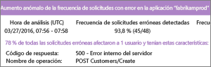 |
| [**Mapa de aplicación****Application map**](app-insights-app-map.md) componentes de saludo de la aplicación, con alertas y las métricas clave.hello components of your app, with key metrics and alerts. |  |
| [**Generador de perfiles****Profiler**](app-insights-profiler.md) Inspeccionar los perfiles de ejecución de Hola de solicitudes muestreadas.Inspect hello execution profiles of sampled requests. |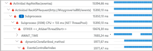 |
| [**Análisis de uso****Usage analysis**](app-insights-usage-overview.md) Analice la segmentación y la retención de usuarios.Analyze user segmentation and retention.| |
| [**Búsqueda de diagnóstico para datos de instancia****Diagnostic search for instance data**](app-insights-diagnostic-search.md) Busque y filtre eventos como solicitudes, excepciones, llamadas de dependencia, seguimientos de registro y vistas de páginas.Search and filter events such as requests, exceptions, dependency calls, log traces, and page views.  |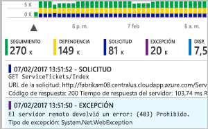 |
| [**Explorador de métricas para datos agregados****Metrics Explorer for aggregated data**](app-insights-metrics-explorer.md) Explore, filtre y segmente datos agregados, como los índices de solicitudes, errores y excepciones; los tiempos de respuesta y los tiempos de carga de página.Explore, filter, and segment aggregated data such as rates of requests, failures, and exceptions; response times, page load times. | |
| [**Paneles****Dashboards**](app-insights-dashboards.md#dashboards) Combine datos de varios recursos y compártalos con otros.Mash up data from multiple resources and share with others. Ideal para aplicaciones de varios componentes y para su presentación continua en la sala de reuniones de Hola.Great for multi-component applications, and for continuous display in hello team room. | |
| [**Secuencia de métricas en directo****Live Metrics Stream**](app-insights-live-stream.md) Cuando se implementa una nueva compilación, vea estos toomake de indicadores de rendimiento en tiempo casi real seguro de que todo funciona según lo previsto.When you deploy a new build, watch these near-real-time performance indicators toomake sure everything works as expected. |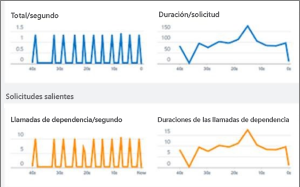 |
| [**Análisis****Analytics**](app-insights-analytics.md) Responda preguntas complejas acerca del uso y el rendimiento de su aplicación mediante este eficaz lenguaje de consulta.Answer tough questions about your app's performance and usage by using this powerful query language. |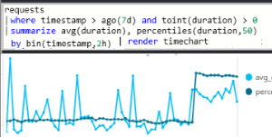 |
| [**Visual Studio****Visual Studio**](app-insights-visual-studio.md) Ver datos de rendimiento en el código de hello.See performance data in hello code. Vaya toocode de seguimientos de pila.Go toocode from stack traces.|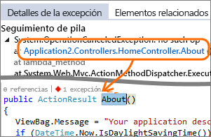 |
| [**Depurador de instantáneas****Snapshot debugger**](app-insights-snapshot-debugger.md) Depure instantáneas muestreadas desde operaciones en directo, con valores de parámetro.Debug snapshots sampled from live operations, with parameter values.|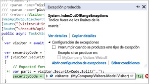 |
| [**Power BI****Power BI**](app-insights-export-power-bi.md) Integre métricas de uso con otra inteligencia empresarial.Integrate usage metrics with other business intelligence.| 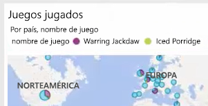|
| [**API DE REST****REST API**](https://dev.applicationinsights.io/) Escribir código toorun consultas sobre las métricas y los datos sin procesar.Write code toorun queries over your metrics and raw data.|  |
| [**Exportación continua****Continuous export**](app-insights-export-telemetry.md) Exportación masiva de datos sin procesar toostorage tan pronto como llegan.Bulk export of raw data toostorage as soon as it arrives. |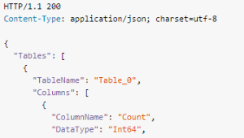 |

## ¿Cómo uso Application Insights?How do I use Application Insights?

### SupervisiónMonitor
Instale Application Insights en la aplicación web, configure las [pruebas web de disponibilidad](app-insights-monitor-web-app-availability.md) y:Install Application Insights in your app, set up [availability web tests](app-insights-monitor-web-app-availability.md), and:

* Configurar un [panel](app-insights-dashboards.md) para su tookeep de salón de equipo un ojo de carga, la capacidad de respuesta y rendimiento de Hola de sus dependencias, página cargas y llamadas de AJAX.Set up a [dashboard](app-insights-dashboards.md) for your team room tookeep an eye on load, responsiveness, and hello performance of your dependencies, page loads, and AJAX calls.
* Detectar que son más lentas de Hola y de la mayoría de las solicitudes de error.Discover which are hello slowest and most failing requests.
* Inspección [secuencia en directo](app-insights-live-stream.md) cuando se implementa una nueva versión, tooknow inmediatamente sobre una degradación.Watch [Live Stream](app-insights-live-stream.md) when you deploy a new release, tooknow immediately about any degradation.

### Detección y diagnósticoDetect, Diagnose
Cuando reciba una alerta o detecte un problema:When you receive an alert or discover a problem:

* Evalúe cuántos usuarios se ven afectados.Assess how many users are affected.
* Correlacione los errores con las excepciones, las llamadas de dependencia y los seguimientos.Correlate failures with exceptions, dependency calls and traces.
* Examine el generador de perfiles, las instantáneas, los volcados de pila y los registros de seguimiento.Examine profiler, snapshots, stack dumps, and trace logs.

### Compilación, medición y aprendizajeBuild, Measure, Learn
[Medir la efectividad de hello](app-insights-usage-overview.md) de cada característica nueva que se implementa.[Measure hello effectiveness](app-insights-usage-overview.md) of each new feature that you deploy.

* Planear toomeasure cómo utilizan los clientes UX nueva o funciones de negocio.Plan toomeasure how customers use new UX or business features.
* Escriba datos de telemetría personalizados en el código.Write custom telemetry into your code.
* Ciclo de desarrollo siguiente Hola base en la evidencia de disco duro de la telemetría.Base hello next development cycle on hard evidence from your telemetry.

## Primeros pasosGet started
Visión de la aplicación es uno de los muchos servicios hospedados en Microsoft Azure y telemetría es enviado para su análisis y presentación de Hola.Application Insights is one of hello many services hosted within Microsoft Azure, and telemetry is sent there for analysis and presentation. Por lo que antes de hacer nada más, necesitará una suscripción demasiado[Microsoft Azure](http://azure.com).So before you do anything else, you'll need a subscription too[Microsoft Azure](http://azure.com). Es libre toosign y si elige Hola básica [plan de precios](https://azure.microsoft.com/pricing/details/application-insights/) de Application Insights, no hay cargo alguno hasta que la aplicación ha crecido toohave sustancial uso.It's free toosign up, and if you choose hello basic [pricing plan](https://azure.microsoft.com/pricing/details/application-insights/) of Application Insights, there's no charge until your application has grown toohave substantial usage. Si su organización ya tiene una suscripción, podría agregar su tooit de cuenta de Microsoft.If your organization already has a subscription, they could add your Microsoft account tooit.

Hay varias maneras de tooget iniciado.There are several ways tooget started. Comience con la que más se ajuste a sus necesidades.Begin with whichever works best for you. Puede agregar otros hello más tarde.You can add hello others later.

* **En tiempo de ejecución: instrumentar la aplicación web en el servidor de Hola.****At run time: instrument your web app on hello server.** Evita que cualquier código de toohello de actualización.Avoids any update toohello code. Necesita el servidor de tooyour de acceso de administrador.You need admin access tooyour server.
  * [**IIS local o en una máquina virtual****IIS on-premises or on a VM**](app-insights-monitor-performance-live-website-now.md)
  * [**Máquina virtual o aplicación web de Azure****Azure web app or VM**](app-insights-monitor-performance-live-website-now.md)
  * [**J2EE****J2EE**](app-insights-java-live.md)
* **En tiempo de desarrollo: agregar código de tooyour Application Insights.****At development time: add Application Insights tooyour code.** Le permite toowrite telemetría y tooinstrument back-end y escritorio aplicaciones personalizadas.Allows you toowrite custom telemetry and tooinstrument back-end and desktop apps.
  * [Visual Studio](app-insights-asp-net.md) 2013, actualización 2 o superior.[Visual Studio](app-insights-asp-net.md) 2013 update 2 or later.
  * Java en [Eclipse](app-insights-java-eclipse.md) u [otras herramientas](app-insights-java-get-started.md)Java in [Eclipse](app-insights-java-eclipse.md) or [other tools](app-insights-java-get-started.md)
  * [Node.jsNode.js](app-insights-nodejs.md)
  * [Otras plataformasOther platforms](app-insights-platforms.md)
* **[Instrumente sus páginas web](app-insights-javascript.md)** para la vista de la página, AJAX y otros datos de telemetría del lado cliente.**[Instrument your web pages](app-insights-javascript.md)** for page view, AJAX and other client-side telemetry.
* **[Pruebas de disponibilidad](app-insights-monitor-web-app-availability.md)** : haga ping a su sitio web de manera regular desde nuestros servidores.**[Availability tests](app-insights-monitor-web-app-availability.md)** - ping your website regularly from our servers.

## Pasos siguientesNext steps
Comience en el tiempo de ejecución con:Get started at runtime with:

* [Servidor IISIIS server](app-insights-monitor-performance-live-website-now.md)
* [Servidor de J2EEJ2EE server](app-insights-java-live.md)

Comience en el tiempo de desarrollo con:Get started at development time with:

* [ASP.NETASP.NET](app-insights-asp-net.md)
* [JavaJava](app-insights-java-get-started.md)
* [Node.jsNode.js](app-insights-nodejs.md)

## Soporte y comentariosSupport and feedback
* Preguntas y problemas:Questions and Issues:
  * [Solución de problemas][qna][Troubleshooting][qna]
  * [Foro de MSDNMSDN Forum](https://social.msdn.microsoft.com/Forums/vstudio/home?forum=ApplicationInsights)
  * [StackoverflowStackOverflow](http://stackoverflow.com/questions/tagged/ms-application-insights)
* Sus sugerencias:Your suggestions:
  * [UserVoiceUserVoice](https://visualstudio.uservoice.com/forums/357324)
* Blog:Blog:
  * [Blog de Application InsightsApplication Insights blog](https://azure.microsoft.com/blog/tag/application-insights)

## VídeosVideos

[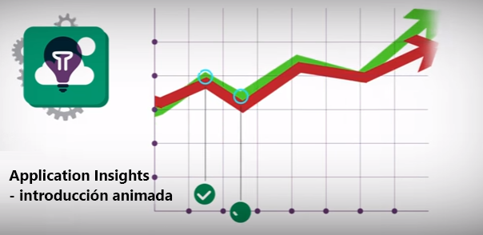](https://www.youtube.com/watch?v=fX2NtGrh-Y0)

> [!VIDEO https://channel9.msdn.com/events/Connect/2016/100/player] 

<!--Link references-->

[android]: https://github.com/Microsoft/ApplicationInsights-Android
[azure]: ../insights-perf-analytics.md
[client]: app-insights-javascript.md
[desktop]: app-insights-windows-desktop.md
[detect]: app-insights-detect-triage-diagnose.md
[greenbrown]: app-insights-asp-net.md
[ios]: https://github.com/Microsoft/ApplicationInsights-iOS
[java]: app-insights-java-get-started.md
[knowUsers]: app-insights-web-track-usage.md
[platforms]: app-insights-platforms.md
[portal]: http://portal.azure.com/
[qna]: app-insights-troubleshoot-faq.md
[redfield]: app-insights-monitor-performance-live-website-now.md
