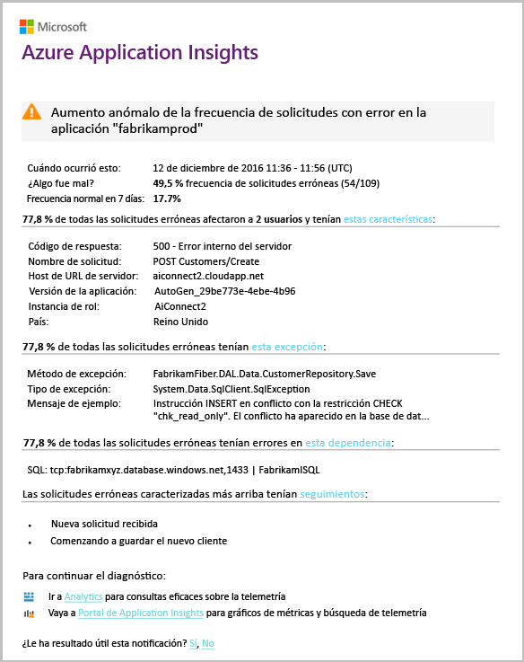

# Detección inteligente: anomalías de error
[Application Insights](app-insights-overview.md) notifica automáticamente al usuario en casi en tiempo real si la aplicación web experimenta un aumento anormal de tasa de Hola de solicitudes con error. Detecta un aumento inusual de velocidad de Hola de llamadas de dependencia que se notifican como no superado o las solicitudes HTTP. En el caso de las solicitudes, las solicitudes con error suelen ser aquellas con códigos de respuesta de 400 o superiores. toohelp de evaluación de errores y diagnosticar el problema de hello, un análisis de las características de Hola de errores de Hola y telemetría relacionado se proporciona en la notificación de Hola. También hay portal de Application Insights toohello de vínculos para continuar el diagnóstico. Hello característica no necesita ninguna configuración ni la configuración, ya que usa el aprendizaje automático de tasa de error normal de Hola de algoritmos toopredict.

Esta característica funciona para las aplicaciones de web de Java y ASP.NET, hospedadas en nube de Hola o en sus servidores. También funciona para cualquier aplicación que genere telemetría de solicitudes o de dependencia, por ejemplo, si tiene un rol de trabajo que llama a [TrackRequest()](app-insights-api-custom-events-metrics.md#trackrequest) o a [TrackDependency()](app-insights-api-custom-events-metrics.md#trackdependency).

Después de configurar [Application Insights para su proyecto](app-insights-overview.md), y siempre que la aplicación genera una determinada cantidad mínima de telemetría, inteligente detección de anomalías de error tiene 24 horas toolearn Hola el comportamiento normal de la aplicación, antes de que se activa y puede enviar alertas.

Esta es una alerta de ejemplo.

> [!NOTE]
> De forma predeterminada, obtendrá un correo de formato más corto que este ejemplo. Pero puede [formato detallado de conmutador toothis](#configure-alerts).
>
>

Observe que le indica:

* tasa de error de Hello en comparación con los comportamientos de la aplicación toonormal.
* ¿Cuántos usuarios se ven afectados: para que sepan cuánto tooworry.
* Un patrón de características asociado a errores de Hola. En este ejemplo encontrará un código de respuesta, un nombre de solicitud (operación) y una versión de aplicación concretos. Que indica inmediatamente donde toostart mirando en el código. Otras posibilidades pueden ser un sistema operativo cliente o explorador específicos.
* excepción de Hello, seguimientos del registro y de errores de dependencia (bases de datos u otros componentes externos) que aparecen toobe asociado con hello caracterizan errores.
* Se vincula directamente toorelevant búsquedas de telemetría de hello en Application Insights.

## Ventajas de la detección inteligente
Las [alertas de métricas](app-insights-alerts.md) normales le comunican que puede haber un problema. Pero detección inteligente comienza a trabajar de diagnóstico de Hola para usted, realizar un gran número de análisis de hello en caso contrario, deberá toodo usted mismo. Se produce un error Hola quedará bien empaquetado, que ayudan a tooget rápidamente toohello raíz del problema de Hola.

## Cómo funciona
Detección inteligente supervisa telemetría Hola recibido desde la aplicación y en las tasas de error de hello determinado. Esta regla cuenta el número de Hola de solicitudes para qué hello `Successful request` propiedad es false, y número de Hola de dependencia llama para qué hello `Successful call` propiedad es false. Para las solicitudes, de forma predeterminada, `Successful request == (resultCode < 400)` (a menos que haya escrito un código personalizado demasiado[filtro](app-insights-api-filtering-sampling.md#filtering) o generar sus propios [TrackRequest](app-insights-api-custom-events-metrics.md#trackrequest) llamadas). 

El rendimiento de una aplicación tiene un patrón típico de comportamiento. Algunas solicitudes o llamadas de dependencia será toofailure más susceptibles a los otros; y hello tasa de error general puede subir medida que aumenta la carga. Detección inteligente utiliza estas anomalías de toofind de aprendizaje automático.

Como telemetría entra en Application Insights desde la aplicación web, detección inteligente compara comportamiento actual de hello con patrones de hello vistos a lo largo de hello últimos días. Si se observa un incremento anómalo de la tasa de errores en comparación con el rendimiento previo, se desencadena un análisis.

Cuando se desencadena un análisis, servicio de hello realiza un análisis de clúster en solicitudes con error hello, tootry tooidentify un patrón de valores que caracterizan a los errores de Hola. En el ejemplo de Hola anterior, análisis de hello ha detectado que la mayoría de los errores es acerca de un código de resultado específico, el nombre de la solicitud, el host de la dirección URL del servidor y la instancia de rol. Por el contrario, análisis de hello ha detectado que la propiedad del sistema operativo cliente Hola se distribuye en varios valores y por lo tanto, no se muestra.

Cuando el servicio se ha instrumentado con estas llamadas de telemetría, analizador de hello busca una excepción y un error de dependencia que se asocian a solicitudes de clúster Hola que ha identificado, junto con un ejemplo de los registros de seguimiento asociados a esos solicitudes.

análisis de Hello resultante se envían tooyou como alerta, a menos que se haya configurado no.

Al igual que hello [alertas que ha configurado manualmente](app-insights-alerts.md), puede inspeccionar el estado de Hola de alerta de Hola y configurarlo en la hoja de alertas de Hola de su recurso de Application Insights. Pero a diferencia de otras alertas, no necesita tooset o configurar la detección inteligente. Si lo desea, puede deshabilitarla o cambiar sus direcciones de correo electrónico de destino.

## Configurar alertas
Puede deshabilitar la detección inteligente, cambiar destinatarios de correo electrónico de hello, crear un webhook o participar en toomore detallada mensajes de alerta.

Abra la página de alertas de Hola. Anomalías de error se incluye junto con todas las alertas que ha configurado manualmente y puede ver si está actualmente en estado de alerta de Hola.

Haga clic en tooconfigure de alerta de Hola.

Observe que puede deshabilitar la detección inteligente, pero no puede eliminarla (ni crear otra).

#### Alertas detalladas
Si selecciona "Obtener un diagnóstico más detallado" correo electrónico de hello contendrá más información de diagnóstico. A veces le problema de hello toodiagnose capaz de datos de hello en correo electrónico de hello únicamente.

Hay un pequeño riesgo de que Hola alerta más detallada podría contener información confidencial, ya que incluye mensajes de excepción y seguimiento. Sin embargo, esto solo podría ocurrir si el código permitiera información confidencial en esos mensajes.

## Clasificación y diagnóstico de una alerta
Una alerta indica que se ha detectado un aumento anormal de velocidad de solicitudes con error de Hola. Es probable que haya algún problema con la aplicación o con su entorno.

De porcentaje de Hola de las solicitudes y número de usuarios afectados, puede decidir cómo urgentes problema hello es. En el ejemplo de Hola anterior, la tasa de error Hola de 22.5% compara con una velocidad normal de % 1, indica que está ocurriendo algo mal. En Hola otra parte, sólo 11 usuarios se vieron afectados. Si se tratase de la aplicación, sería capaz de tooassess la importancia que es.

En muchos casos, será capaz de toodiagnose problema de hello rápidamente desde el nombre de la solicitud de hello, excepción, datos de error y el seguimiento de dependencia proporcionados.

Hay algunas otras pistas. Por ejemplo, tasa de error de dependencia de hello en este ejemplo se Hola igual que Hola tasa de excepciones (89.3%). Esto sugiere que surge excepción Hola directamente desde el error de dependencia de hello - ofrecerle una idea clara de where toostart mirando en el código.

tooinvestigate Además, Hola vínculos en cada sección le permitirán recta tooa [página de búsqueda](app-insights-diagnostic-search.md) filtran las solicitudes de toohello relevantes, excepción, dependencia o seguimientos. O bien puede abrir hello [portal de Azure](https://portal.azure.com), navegar toohello recurso de Application Insights para su aplicación y abra la hoja de errores de Hola.

En este ejemplo, si hace clic en vínculo hello 'ver detalles de errores de dependencia' abre una hoja de búsqueda de Application Insights Hola. Se muestra la instrucción SQL de Hola que tiene un ejemplo de causa raíz de Hola: valores NULL se proporcionaron en los campos obligatorios y no superó la validación durante Hola operación de guardar.

## Revisar las alertas recientes

Haga clic en **detección inteligente** alerta más reciente de tooget toohello:

## ¿Cuál es la diferencia de Hola...
La detección inteligente de anomalías de errores complementa otras características similares pero distintas de Application Insights.

* Las [alertas de métricas](app-insights-alerts.md) las configura el usuario y pueden supervisar una amplia variedad de métricas, como el uso de la CPU, la velocidad máxima de las solicitudes, los tiempos de carga de las páginas, etc. Puede usar toowarn que, por ejemplo, si necesita tooadd más recursos. Por el contrario, inteligente detección de anomalías de error cubre un toonotify pequeño intervalo de métricas críticas (actualmente sólo solicitudes con error frecuencia), diseñado también en casi tiempo real forma una vez aumenta significativamente la velocidad de solicitudes con error de la aplicación web en comparación con la aplicación tooweb comportamiento normal.

    Detección inteligente ajusta automáticamente su umbral en condiciones de tooprevailing de respuesta.

    Detección inteligente comienza a trabajar de diagnóstico de Hola para usted.
* [Detección de anomalías de rendimiento de Smart](app-insights-proactive-performance-diagnostics.md) también utiliza máquina patrones poco habituales de inteligencia toodiscover en las métricas y no se requiere ninguna configuración por parte del usuario. Pero a diferencia de detección inteligente de anomalías de error, propósito Hola de detección inteligente de anomalías de rendimiento es toofind segmentos de su colector de uso que puede proporcionarse mal, por ejemplo, por páginas específicas de un tipo específico del explorador. Hola se lleva a cabo análisis diariamente, y si no se encuentra ningún resultado, es probable que toobe mucho menos urgente que una alerta. En cambio, hello en busca de anomalías de error se lleva a cabo análisis continuamente en telemetría entrante y se le notificará en minutos si las tasas de error de servidor son mayores de lo esperado.

## Si recibe una alerta de detección inteligente
*¿Por qué he recibido esta alerta?*

* Hemos detectado un aumento anormal de velocidad en comparación con las solicitudes con error toohello base normal de hello anterior período. Después del análisis de errores de Hola y telemetría asociado, creemos que hay un problema que se debe buscar en.

*¿Notificación de hello significa que definitivamente tengo un problema?*

* Intentamos tooalert en una degradación o interrupción de la aplicación, pero solo se pueden comprender perfectamente semántica de Hola y el impacto de hello en aplicación hello o los usuarios.

*¿Entonces están mirando mis datos?*

* No. servicio de Hello es completamente automático. Solo se reciben las notificaciones de Hola. Sus datos son [privados](app-insights-data-retention-privacy.md).

*¿Tengo que toosubscribe toothis alerta?*

* No. Todas las aplicaciones que envía solicitud telemetría tiene la regla de alerta de detección inteligente de Hola.

*¿Puedo cancelar la suscripción o recibir notificaciones de hello enviadas a toomy compañeros en su lugar?*

* Sí, las reglas de alerta, haga clic en tooconfigure de regla de detección inteligente de Hola. Puede deshabilitar la alerta de Hola o cambiar a los destinatarios de alerta de Hola.

*He perdido el correo electrónico de Hola. ¿Dónde puedo encontrar las notificaciones de hello en el portal de hello?*

* En los registros de actividad de Hola. En Azure, abra recursos de Application Insights de hello para la aplicación, a continuación, seleccionar registros de actividad.

*Algunas de las alertas de hello aproximadamente son problemas conocidos y no deben tooreceive ellos.*

* Tenemos pendiente la incorporación de la supresión de alertas.

## Pasos siguientes
Estas herramientas de diagnóstico le ayudarán a inspeccionar telemetría Hola desde su aplicación:

* [Explorador de métricas](app-insights-metrics-explorer.md)
* [Explorador de búsqueda](app-insights-diagnostic-search.md)
* [Analytics: Lenguaje de consulta eficaz](app-insights-analytics-tour.md)

Las detecciones inteligentes son completamente automáticas. ¿Pero quizás le gustaría tooset algunas alertas más?

* [Alertas de métricas configuradas manualmente](app-insights-alerts.md)
* [Pruebas web de disponibilidad](app-insights-monitor-web-app-availability.md)
