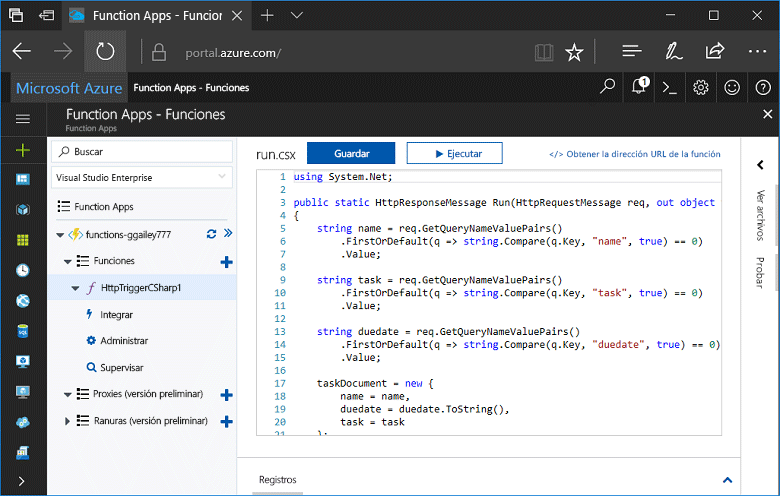
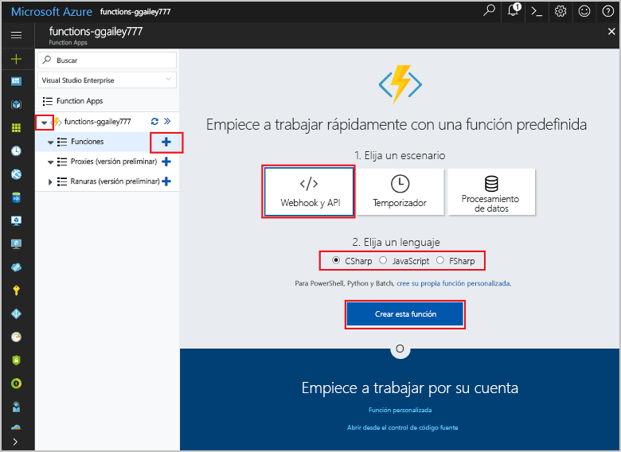
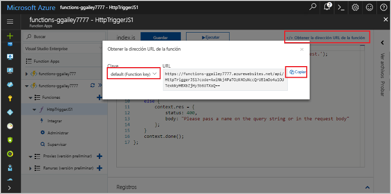
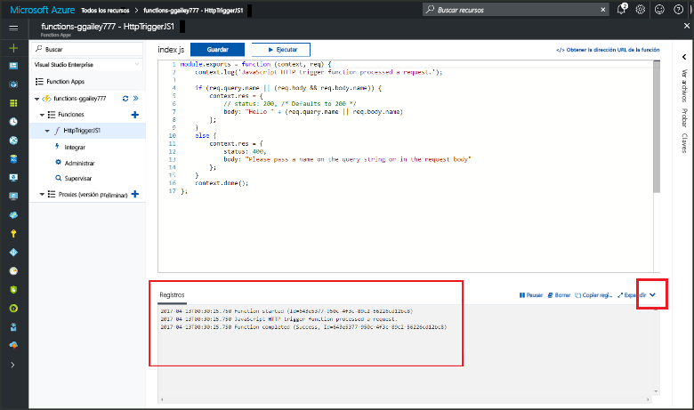

# Creación de su primera función en Azure PortalCreate your first function in the Azure portal

Azure Functions permite ejecutar el código en un entorno sin servidor sin necesidad de crear una máquina virtual o publicar una aplicación web.Azure Functions lets you execute your code in a serverless environment without having to first create a VM or publish a web application. En este tema, aprenderá a usar Functions para crear una función "Hola mundo" en Azure Portal.In this topic, learn how to use Functions to create a "hello world" function in the Azure portal.

[!INCLUDE [quickstarts-free-trial-note](../../includes/quickstarts-free-trial-note.md)]

## Inicie sesión en Azure.Log in to Azure

Inicie sesión en [Azure Portal](https://portal.azure.com/).Log in to the [Azure portal](https://portal.azure.com/).

## Creación de una aplicación de funciónCreate a function app

Debe tener una Function App para hospedar la ejecución de las funciones.You must have a function app to host the execution of your functions. Una Function App permite agrupar funciones como una unidad lógica para facilitar la administración, la implementación y el uso compartido de recursos.A function app lets you group functions as a logic unit for easier management, deployment, and sharing of resources. 

[!INCLUDE [Create function app Azure portal](../../includes/functions-create-function-app-portal.md)]

[!INCLUDE [functions-portal-favorite-function-apps](../../includes/functions-portal-favorite-function-apps.md)]

Después, cree una función en la nueva Function App.Next, you create a function in the new function app.

## Crear una función desencadenada por HTTPCreate an HTTP triggered function

1. Expanda la nueva Function App y haga clic en el botón **+** situado junto a **Funciones**.Expand your new function app, then click the **+** button next to **Functions**.

2.  En la página **Get started quickly** (Empiece a trabajar rápidamente), seleccione **Webhook y API**, **Elija un lenguaje** para la función y haga clic en **Crear esta función**.In the **Get started quickly** page, select **WebHook + API**, **Choose a language** for your function, and click **Create this function**. 
   
    

Se crea una función en el lenguaje elegido mediante la plantilla para una función desencadenada por HTTP.A function is created in your chosen language using the template for an HTTP triggered function. Puede ejecutar la función nueva mediante el envío de una solicitud HTTP.You can run the new function by sending an HTTP request.

## Prueba de la funciónTest the function

1. En la nueva función, haga clic en **</> Get función URL** (</> Obtener URL de función), seleccione **default (Function key)** [predeterminada (tecla de función)] y, después, haga clic en **Copiar**.In your new function, click **</> Get function URL**, select **default (Function key)**, and then click **Copy**. 

    

2. Pegue la dirección URL de la función en la barra de direcciones de su explorador.Paste the function URL into your browser's address bar. Anexe la cadena de consulta `&name=<yourname>` a esta dirección URL y presione la tecla `Enter` en el teclado para ejecutar la solicitud.Append the query string `&name=<yourname>` to this URL and press the `Enter` key on your keyboard to execute the request. A continuación, se muestra un ejemplo de la respuesta devuelta por la función en el navegador Edge:The following is an example of the response returned by the function in the Edge browser:

    

    La dirección URL de la solicitud incluye una clave que, de forma predeterminada, es necesaria para tener acceso a la función a través de HTTP.The request URL includes a key that is required, by default, to access your function over HTTP.   

3. Cuando se ejecuta la función, se escribe información de seguimiento en los registros.When your function runs, trace information is written to the logs. Para ver el resultado del seguimiento de la ejecución anterior, vuelva a la función en el portal y haga clic en la flecha hacia arriba que encontrará en la parte inferior de la pantalla para expandir **Registros**.To see the trace output from the previous execution, return to your function in the portal and click the up arrow at the bottom of the screen to expand **Logs**. 

   

## Limpieza de recursosClean up resources

[!INCLUDE [Clean up resources](../../includes/functions-quickstart-cleanup.md)]

## Pasos siguientesNext steps

Ha creado una Function App con una función simple desencadenada por HTTP.You have created a function app with a simple HTTP triggered function.  

[!INCLUDE [Next steps note](../../includes/functions-quickstart-next-steps.md)]

Para obtener más información, vea [Enlaces HTTP y webhook en Azure Functions](functions-bindings-http-webhook.md).For more information, see [Azure Functions HTTP and webhook bindings](functions-bindings-http-webhook.md).

