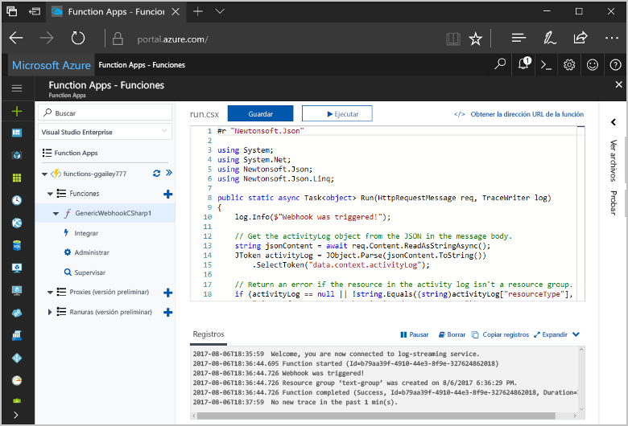
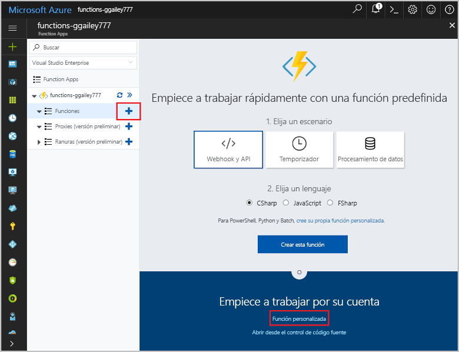
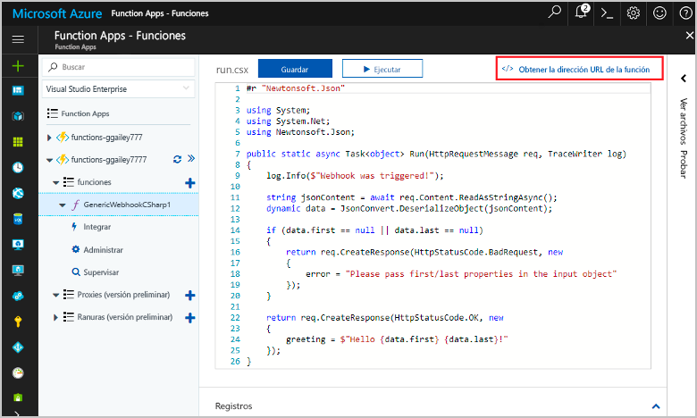
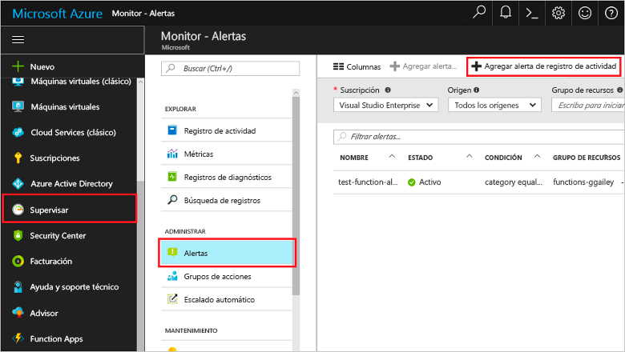
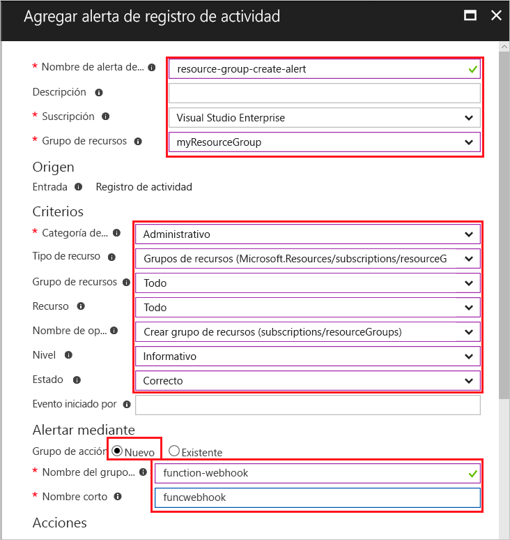
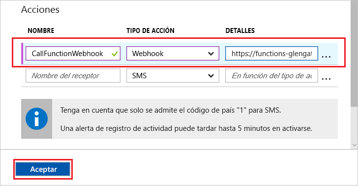
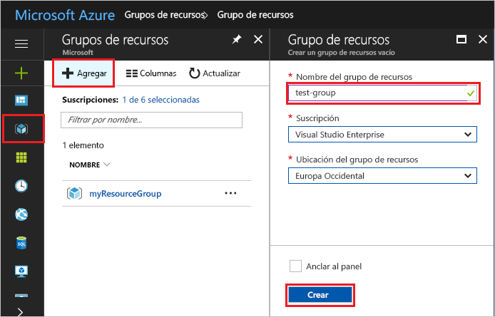
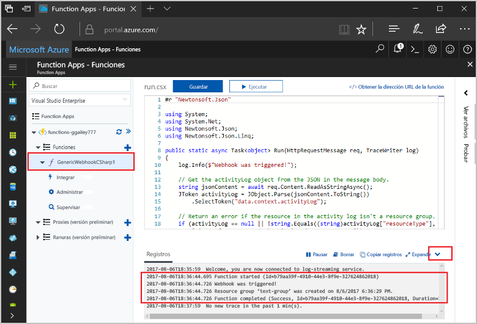

# <a name="create-a-function-triggered-by-a-generic-webhook"></a><span data-ttu-id="ffe73-103">Creación de una función desencadenada por un webhook genérico</span><span class="sxs-lookup"><span data-stu-id="ffe73-103">Create a function triggered by a generic webhook</span></span>

<span data-ttu-id="ffe73-104">Las funciones de Azure permite ejecutar el código en un entorno sin servidor sin necesidad de toofirst crear una máquina virtual o publicar una aplicación web.</span><span class="sxs-lookup"><span data-stu-id="ffe73-104">Azure Functions lets you execute your code in a serverless environment without having toofirst create a VM or publish a web application.</span></span> <span data-ttu-id="ffe73-105">Por ejemplo, puede configurar un toobe función desencadenada una alerta generada por el Monitor de Azure.</span><span class="sxs-lookup"><span data-stu-id="ffe73-105">For example, you can configure a function toobe triggered by an alert raised by Azure Monitor.</span></span> <span data-ttu-id="ffe73-106">Este tema muestra cómo el código C# tooexecute cuando un grupo de recursos está agregado tooyour suscripción.</span><span class="sxs-lookup"><span data-stu-id="ffe73-106">This topic shows you how tooexecute C# code when a resource group is added tooyour subscription.</span></span>   



## <a name="prerequisites"></a><span data-ttu-id="ffe73-108">Requisitos previos</span><span class="sxs-lookup"><span data-stu-id="ffe73-108">Prerequisites</span></span> 

<span data-ttu-id="ffe73-109">toocomplete este tutorial:</span><span class="sxs-lookup"><span data-stu-id="ffe73-109">toocomplete this tutorial:</span></span>

+ <span data-ttu-id="ffe73-110">Si no tiene una suscripción a Azure, cree una [cuenta gratuita](https://azure.microsoft.com/free/?WT.mc_id=A261C142F) antes de empezar.</span><span class="sxs-lookup"><span data-stu-id="ffe73-110">If you don't have an Azure subscription, create a [free account](https://azure.microsoft.com/free/?WT.mc_id=A261C142F) before you begin.</span></span>

[!INCLUDE [functions-portal-favorite-function-apps](../../includes/functions-portal-favorite-function-apps.md)]

## <a name="create-an-azure-function-app"></a><span data-ttu-id="ffe73-111">Creación de una Function App de Azure</span><span class="sxs-lookup"><span data-stu-id="ffe73-111">Create an Azure Function app</span></span>

[!INCLUDE [Create function app Azure portal](../../includes/functions-create-function-app-portal.md)]

<span data-ttu-id="ffe73-112">A continuación, cree una función en la aplicación de hello nueva función.</span><span class="sxs-lookup"><span data-stu-id="ffe73-112">Next, you create a function in hello new function app.</span></span>

## <span data-ttu-id="ffe73-113"><a name="create-function"></a>Creación de una función desencadenada mediante un webhook genérico</span><span class="sxs-lookup"><span data-stu-id="ffe73-113"><a name="create-function"></a>Create a generic webhook triggered function</span></span>

1. <span data-ttu-id="ffe73-114">Expanda la aplicación de la función y haga clic en hello  **+**  aparece al lado demasiado**funciones**.</span><span class="sxs-lookup"><span data-stu-id="ffe73-114">Expand your function app and click hello **+** button next too**Functions**.</span></span> <span data-ttu-id="ffe73-115">Si esta función es hello primera de ellas en la aplicación de la función, seleccione **función personalizada**.</span><span class="sxs-lookup"><span data-stu-id="ffe73-115">If this function is hello first one in your function app, select **Custom function**.</span></span> <span data-ttu-id="ffe73-116">Esto muestra el conjunto completo de Hola de plantillas de función.</span><span class="sxs-lookup"><span data-stu-id="ffe73-116">This displays hello complete set of function templates.</span></span>

    

2. <span data-ttu-id="ffe73-118">Seleccione hello **WebHook genérico - C#** plantilla.</span><span class="sxs-lookup"><span data-stu-id="ffe73-118">Select hello **Generic WebHook - C#** template.</span></span> <span data-ttu-id="ffe73-119">Escriba un nombre para la función de C# y, después, seleccione **Crear**.</span><span class="sxs-lookup"><span data-stu-id="ffe73-119">Type a name for your C# function, then select **Create**.</span></span>

      

2. <span data-ttu-id="ffe73-121">En la nueva función, haga clic en **<> / Get función URL**, a continuación, copiar y guardar el valor de Hola.</span><span class="sxs-lookup"><span data-stu-id="ffe73-121">In your new function, click **</> Get function URL**, then copy and save hello value.</span></span> <span data-ttu-id="ffe73-122">Utilice este webhook de hello tooconfigure de valor.</span><span class="sxs-lookup"><span data-stu-id="ffe73-122">You use this value tooconfigure hello webhook.</span></span> 

    
         
<span data-ttu-id="ffe73-124">Después, cree un punto de conexión de webhook en una alerta de registro de actividad en Azure Monitor.</span><span class="sxs-lookup"><span data-stu-id="ffe73-124">Next, you create a webhook endpoint in an activity log alert in Azure Monitor.</span></span> 

## <a name="create-an-activity-log-alert"></a><span data-ttu-id="ffe73-125">Creación de una alerta de registro de actividad</span><span class="sxs-lookup"><span data-stu-id="ffe73-125">Create an activity log alert</span></span>

1. <span data-ttu-id="ffe73-126">En el portal de Azure de Hola, vaya toohello **Monitor** servicio, seleccione **alertas**y haga clic en **Agregar alerta de registro de actividad**.</span><span class="sxs-lookup"><span data-stu-id="ffe73-126">In hello Azure portal, navigate toohello **Monitor** service, select **Alerts**, and click **Add activity log alert**.</span></span>   

    

2. <span data-ttu-id="ffe73-128">Usar la configuración de hello como se especifica en la tabla de hello:</span><span class="sxs-lookup"><span data-stu-id="ffe73-128">Use hello settings as specified in hello table:</span></span>

    

    | <span data-ttu-id="ffe73-130">Configuración</span><span class="sxs-lookup"><span data-stu-id="ffe73-130">Setting</span></span>      |  <span data-ttu-id="ffe73-131">Valor sugerido</span><span class="sxs-lookup"><span data-stu-id="ffe73-131">Suggested value</span></span>   | <span data-ttu-id="ffe73-132">Descripción</span><span class="sxs-lookup"><span data-stu-id="ffe73-132">Description</span></span>                              |
    | ------------ |  ------- | -------------------------------------------------- |
    | <span data-ttu-id="ffe73-133">**Nombre de alerta de registro de actividad**</span><span class="sxs-lookup"><span data-stu-id="ffe73-133">**Activity log alert name**</span></span> | <span data-ttu-id="ffe73-134">resource-group-create-alert</span><span class="sxs-lookup"><span data-stu-id="ffe73-134">resource-group-create-alert</span></span> | <span data-ttu-id="ffe73-135">Nombre de alerta de registro de actividad de Hola.</span><span class="sxs-lookup"><span data-stu-id="ffe73-135">Name of hello activity log alert.</span></span> |
    | <span data-ttu-id="ffe73-136">**Suscripción**</span><span class="sxs-lookup"><span data-stu-id="ffe73-136">**Subscription**</span></span> | <span data-ttu-id="ffe73-137">Su suscripción</span><span class="sxs-lookup"><span data-stu-id="ffe73-137">Your subscription</span></span> | <span data-ttu-id="ffe73-138">suscripción de Hola que estás usando para este tutorial.</span><span class="sxs-lookup"><span data-stu-id="ffe73-138">hello subscription you are using for this tutorial.</span></span> | 
    |  <span data-ttu-id="ffe73-139">**Grupo de recursos**</span><span class="sxs-lookup"><span data-stu-id="ffe73-139">**Resource Group**</span></span> | <span data-ttu-id="ffe73-140">myResourceGroup</span><span class="sxs-lookup"><span data-stu-id="ffe73-140">myResourceGroup</span></span> | <span data-ttu-id="ffe73-141">grupo de recursos de Hello alertar a los recursos Hola se implementa en.</span><span class="sxs-lookup"><span data-stu-id="ffe73-141">hello resource group that hello alert resources are deployed to.</span></span> <span data-ttu-id="ffe73-142">Usar Hola mismo grupo de recursos a medida que la aplicación de la función hace tooclean más fácil de después de completar el tutorial de Hola.</span><span class="sxs-lookup"><span data-stu-id="ffe73-142">Using hello same resource group as your function app makes it easier tooclean up after you complete hello tutorial.</span></span> |
    | <span data-ttu-id="ffe73-143">**Categoría de eventos**</span><span class="sxs-lookup"><span data-stu-id="ffe73-143">**Event category**</span></span> | <span data-ttu-id="ffe73-144">Administrativo</span><span class="sxs-lookup"><span data-stu-id="ffe73-144">Administrative</span></span> | <span data-ttu-id="ffe73-145">Esta categoría incluye los cambios realizados tooAzure recursos.</span><span class="sxs-lookup"><span data-stu-id="ffe73-145">This category includes changes made tooAzure resources.</span></span>  |
    | <span data-ttu-id="ffe73-146">**Tipo de recurso**</span><span class="sxs-lookup"><span data-stu-id="ffe73-146">**Resource type**</span></span> | <span data-ttu-id="ffe73-147">Grupos de recursos</span><span class="sxs-lookup"><span data-stu-id="ffe73-147">Resource groups</span></span> | <span data-ttu-id="ffe73-148">Filtra las actividades de grupo de tooresource alertas.</span><span class="sxs-lookup"><span data-stu-id="ffe73-148">Filters alerts tooresource group activities.</span></span> |
    | <span data-ttu-id="ffe73-149">**Grupo de recursos**</span><span class="sxs-lookup"><span data-stu-id="ffe73-149">**Resource Group**</span></span><br/><span data-ttu-id="ffe73-150">y **recurso**</span><span class="sxs-lookup"><span data-stu-id="ffe73-150">and **Resource**</span></span> | <span data-ttu-id="ffe73-151">Todo</span><span class="sxs-lookup"><span data-stu-id="ffe73-151">All</span></span> | <span data-ttu-id="ffe73-152">Supervisa todos los recursos.</span><span class="sxs-lookup"><span data-stu-id="ffe73-152">Monitor all resources.</span></span> |
    | <span data-ttu-id="ffe73-153">**Nombre de la operación**</span><span class="sxs-lookup"><span data-stu-id="ffe73-153">**Operation name**</span></span> | <span data-ttu-id="ffe73-154">Crear grupo de recursos</span><span class="sxs-lookup"><span data-stu-id="ffe73-154">Create Resource Group</span></span> | <span data-ttu-id="ffe73-155">Filtra las operaciones de toocreate de alertas.</span><span class="sxs-lookup"><span data-stu-id="ffe73-155">Filters alerts toocreate operations.</span></span> |
    | <span data-ttu-id="ffe73-156">**Level**</span><span class="sxs-lookup"><span data-stu-id="ffe73-156">**Level**</span></span> | <span data-ttu-id="ffe73-157">Informativo</span><span class="sxs-lookup"><span data-stu-id="ffe73-157">Informational</span></span> | <span data-ttu-id="ffe73-158">Incluye las alertas de nivel informativo.</span><span class="sxs-lookup"><span data-stu-id="ffe73-158">Include informational level alerts.</span></span> | 
    | <span data-ttu-id="ffe73-159">**Estado**</span><span class="sxs-lookup"><span data-stu-id="ffe73-159">**Status**</span></span> | <span data-ttu-id="ffe73-160">Correcto</span><span class="sxs-lookup"><span data-stu-id="ffe73-160">Succeeded</span></span> | <span data-ttu-id="ffe73-161">Tooactions de alertas de filtros que se han completado correctamente.</span><span class="sxs-lookup"><span data-stu-id="ffe73-161">Filters alerts tooactions that have completed successfully.</span></span> |
    | <span data-ttu-id="ffe73-162">**Grupo de acción**</span><span class="sxs-lookup"><span data-stu-id="ffe73-162">**Action group**</span></span> | <span data-ttu-id="ffe73-163">Nuevo</span><span class="sxs-lookup"><span data-stu-id="ffe73-163">New</span></span> | <span data-ttu-id="ffe73-164">Crear un nuevo grupo de acción, que define la toma de la acción de hello cuando se genera una alerta.</span><span class="sxs-lookup"><span data-stu-id="ffe73-164">Create a new action group, which defines hello action takes when an alert is raised.</span></span> |
    | <span data-ttu-id="ffe73-165">**Nombre del grupo de acción**</span><span class="sxs-lookup"><span data-stu-id="ffe73-165">**Action group name**</span></span> | <span data-ttu-id="ffe73-166">function-webhook</span><span class="sxs-lookup"><span data-stu-id="ffe73-166">function-webhook</span></span> | <span data-ttu-id="ffe73-167">Un grupo de acciones de nombre tooidentify Hola.</span><span class="sxs-lookup"><span data-stu-id="ffe73-167">A name tooidentify hello action group.</span></span>  | 
    | <span data-ttu-id="ffe73-168">**Nombre corto**</span><span class="sxs-lookup"><span data-stu-id="ffe73-168">**Short name**</span></span> | <span data-ttu-id="ffe73-169">funcwebhook</span><span class="sxs-lookup"><span data-stu-id="ffe73-169">funcwebhook</span></span> | <span data-ttu-id="ffe73-170">Un nombre corto para el grupo de acciones de Hola.</span><span class="sxs-lookup"><span data-stu-id="ffe73-170">A short name for hello action group.</span></span> |  

3. <span data-ttu-id="ffe73-171">En **acciones**, agregar una acción mediante la configuración de hello como se especifica en la tabla de hello:</span><span class="sxs-lookup"><span data-stu-id="ffe73-171">In **Actions**, add an action using hello settings as specified in hello table:</span></span> 

    

    | <span data-ttu-id="ffe73-173">Configuración</span><span class="sxs-lookup"><span data-stu-id="ffe73-173">Setting</span></span>      |  <span data-ttu-id="ffe73-174">Valor sugerido</span><span class="sxs-lookup"><span data-stu-id="ffe73-174">Suggested value</span></span>   | <span data-ttu-id="ffe73-175">Descripción</span><span class="sxs-lookup"><span data-stu-id="ffe73-175">Description</span></span>                              |
    | ------------ |  ------- | -------------------------------------------------- |
    | <span data-ttu-id="ffe73-176">**Name**</span><span class="sxs-lookup"><span data-stu-id="ffe73-176">**Name**</span></span> | <span data-ttu-id="ffe73-177">CallFunctionWebhook</span><span class="sxs-lookup"><span data-stu-id="ffe73-177">CallFunctionWebhook</span></span> | <span data-ttu-id="ffe73-178">Un nombre para la acción de Hola.</span><span class="sxs-lookup"><span data-stu-id="ffe73-178">A name for hello action.</span></span> |
    | <span data-ttu-id="ffe73-179">**Tipo de acción**</span><span class="sxs-lookup"><span data-stu-id="ffe73-179">**Action type**</span></span> | <span data-ttu-id="ffe73-180">webhook</span><span class="sxs-lookup"><span data-stu-id="ffe73-180">Webhook</span></span> | <span data-ttu-id="ffe73-181">alerta de toohello de respuesta de Hello es que se llama a una dirección URL del Webhook.</span><span class="sxs-lookup"><span data-stu-id="ffe73-181">hello response toohello alert is that a Webhook URL is called.</span></span> |
    | <span data-ttu-id="ffe73-182">**Detalles**</span><span class="sxs-lookup"><span data-stu-id="ffe73-182">**Details**</span></span> | <span data-ttu-id="ffe73-183">Dirección URL de la función</span><span class="sxs-lookup"><span data-stu-id="ffe73-183">Function URL</span></span> | <span data-ttu-id="ffe73-184">Pegue en la dirección URL del webhook Hola de función hello que copió anteriormente.</span><span class="sxs-lookup"><span data-stu-id="ffe73-184">Paste in hello webhook URL of hello function that you copied earlier.</span></span> |<span data-ttu-id="ffe73-185">v</span><span class="sxs-lookup"><span data-stu-id="ffe73-185">v</span></span>

4. <span data-ttu-id="ffe73-186">Haga clic en **Aceptar** grupo de alerta y la acción de hello toocreate.</span><span class="sxs-lookup"><span data-stu-id="ffe73-186">Click **OK** toocreate hello alert and action group.</span></span>  

<span data-ttu-id="ffe73-187">Hola webhook ahora se llama cuando se crea un grupo de recursos en su suscripción.</span><span class="sxs-lookup"><span data-stu-id="ffe73-187">hello webhook is now called when a resource group is created in your subscription.</span></span> <span data-ttu-id="ffe73-188">A continuación, actualizar código de hello en su Hola de toohandle datos de registro JSON en el cuerpo de saludo de solicitud de Hola de función.</span><span class="sxs-lookup"><span data-stu-id="ffe73-188">Next, you update hello code in your function toohandle hello JSON log data in hello body of hello request.</span></span>   

## <a name="update-hello-function-code"></a><span data-ttu-id="ffe73-189">Actualizar código de función de Hola</span><span class="sxs-lookup"><span data-stu-id="ffe73-189">Update hello function code</span></span>

1. <span data-ttu-id="ffe73-190">Navegar por la aplicación de función tooyour atrás en el portal de Hola y expanda la función.</span><span class="sxs-lookup"><span data-stu-id="ffe73-190">Navigate back tooyour function app in hello portal, and expand your function.</span></span> 

2. <span data-ttu-id="ffe73-191">Reemplace el código de script de Hola C# en función de hello en el portal de hello con hello siguiente código:</span><span class="sxs-lookup"><span data-stu-id="ffe73-191">Replace hello C# script code in hello function in hello portal with hello following code:</span></span>

    ```csharp
    #r "Newtonsoft.Json"
    
    using System;
    using System.Net;
    using Newtonsoft.Json;
    using Newtonsoft.Json.Linq;
    
    public static async Task<object> Run(HttpRequestMessage req, TraceWriter log)
    {
        log.Info($"Webhook was triggered!");
    
        // Get hello activityLog object from hello JSON in hello message body.
        string jsonContent = await req.Content.ReadAsStringAsync();
        JToken activityLog = JObject.Parse(jsonContent.ToString())
            .SelectToken("data.context.activityLog");
    
        // Return an error if hello resource in hello activity log isn't a resource group. 
        if (activityLog == null || !string.Equals((string)activityLog["resourceType"], 
            "Microsoft.Resources/subscriptions/resourcegroups"))
        {
            log.Error("An error occured");
            return req.CreateResponse(HttpStatusCode.BadRequest, new
            {
                error = "Unexpected message payload or wrong alert received."
            });
        }
    
        // Write information about hello created resource group toohello streaming log.
        log.Info(string.Format("Resource group '{0}' was {1} on {2}.",
            (string)activityLog["resourceGroupName"],
            ((string)activityLog["subStatus"]).ToLower(), 
            (DateTime)activityLog["submissionTimestamp"]));
    
        return req.CreateResponse(HttpStatusCode.OK);    
    }
    ```

<span data-ttu-id="ffe73-192">Ahora puede probar la función hello mediante la creación de un nuevo grupo de recursos en su suscripción.</span><span class="sxs-lookup"><span data-stu-id="ffe73-192">Now you can test hello function by creating a new resource group in your subscription.</span></span>

## <a name="test-hello-function"></a><span data-ttu-id="ffe73-193">Probar función hello</span><span class="sxs-lookup"><span data-stu-id="ffe73-193">Test hello function</span></span>

1. <span data-ttu-id="ffe73-194">Haga clic en el icono de grupo de recursos de hello en izquierda Hola de hello portal de Azure, seleccione **+ agregar**, escriba un **nombre del grupo de recursos**y seleccione **crear** toocreate un grupo de recursos vacío.</span><span class="sxs-lookup"><span data-stu-id="ffe73-194">Click hello resource group icon in hello left of hello Azure portal, select **+ Add**, type a **Resource group name**, and select **Create** toocreate an empty resource group.</span></span>
    
    

2. <span data-ttu-id="ffe73-196">Función tooyour volver y expanda hello **registros** ventana.</span><span class="sxs-lookup"><span data-stu-id="ffe73-196">Go back tooyour function and expand hello **Logs** window.</span></span> <span data-ttu-id="ffe73-197">Una vez creado el grupo de recursos de hello, desencadenadores de alerta de registro de actividad Hola Hola webhook y se ejecuta la función hello.</span><span class="sxs-lookup"><span data-stu-id="ffe73-197">After hello resource group is created, hello activity log alert triggers hello webhook and hello function executes.</span></span> <span data-ttu-id="ffe73-198">Verá que el nombre de Hola de nuevo grupo de recursos Hola escrito toohello registros.</span><span class="sxs-lookup"><span data-stu-id="ffe73-198">You see hello name of hello new resource group written toohello logs.</span></span>  

    

3. <span data-ttu-id="ffe73-200">(Opcional) Volver atrás y eliminar el grupo de recursos de Hola que ha creado.</span><span class="sxs-lookup"><span data-stu-id="ffe73-200">(Optional) Go back and delete hello resource group that you created.</span></span> <span data-ttu-id="ffe73-201">Tenga en cuenta que esta actividad no desencadenará la función hello.</span><span class="sxs-lookup"><span data-stu-id="ffe73-201">Note that this activity doesn't trigger hello function.</span></span> <span data-ttu-id="ffe73-202">Esto es porque delete operaciones se filtran por alerta de Hola.</span><span class="sxs-lookup"><span data-stu-id="ffe73-202">This is because delete operations are filtered out by hello alert.</span></span> 

## <a name="clean-up-resources"></a><span data-ttu-id="ffe73-203">Limpieza de recursos</span><span class="sxs-lookup"><span data-stu-id="ffe73-203">Clean up resources</span></span>

[!INCLUDE [Next steps note](../../includes/functions-quickstart-cleanup.md)]

## <a name="next-steps"></a><span data-ttu-id="ffe73-204">Pasos siguientes</span><span class="sxs-lookup"><span data-stu-id="ffe73-204">Next steps</span></span>

<span data-ttu-id="ffe73-205">Ha creado una función que se ejecuta cuando se recibe una solicitud de un webhook genérico.</span><span class="sxs-lookup"><span data-stu-id="ffe73-205">You have created a function that runs when a request is received from a generic webhook.</span></span> 

[!INCLUDE [Next steps note](../../includes/functions-quickstart-next-steps.md)]

<span data-ttu-id="ffe73-206">Para más información sobre los desencadenadores de webhook, consulte [Enlaces HTTP y webhook en Azure Functions](functions-bindings-http-webhook.md).</span><span class="sxs-lookup"><span data-stu-id="ffe73-206">For more information about webhook triggers, see [Azure Functions HTTP and webhook bindings](functions-bindings-http-webhook.md).</span></span> <span data-ttu-id="ffe73-207">toolearn más sobre el desarrollo de las funciones de C#, vea [referencia del programador de C# de funciones de Azure script](functions-reference-csharp.md).</span><span class="sxs-lookup"><span data-stu-id="ffe73-207">toolearn more about developing functions in C#, see [Azure Functions C# script developer reference](functions-reference-csharp.md).</span></span>

