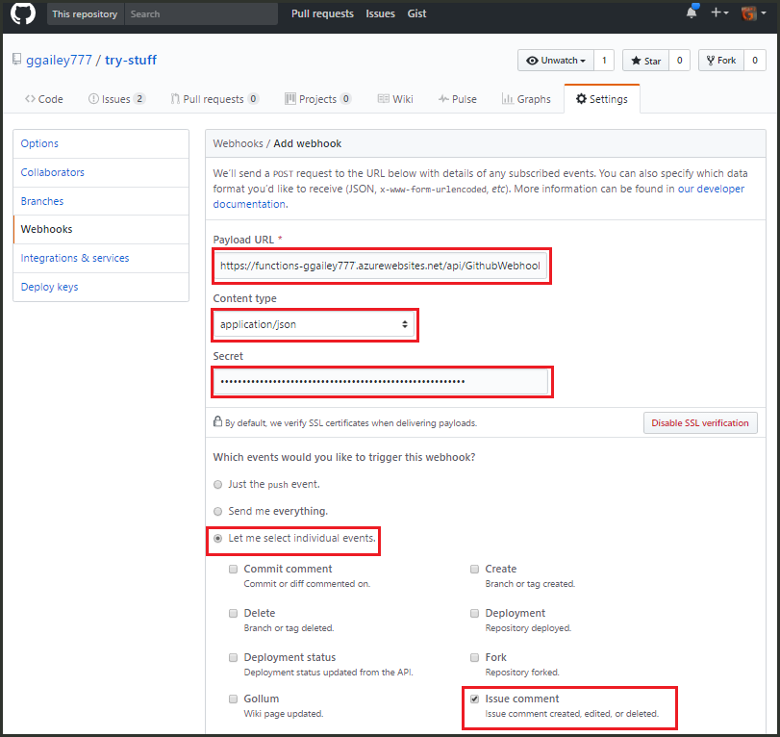
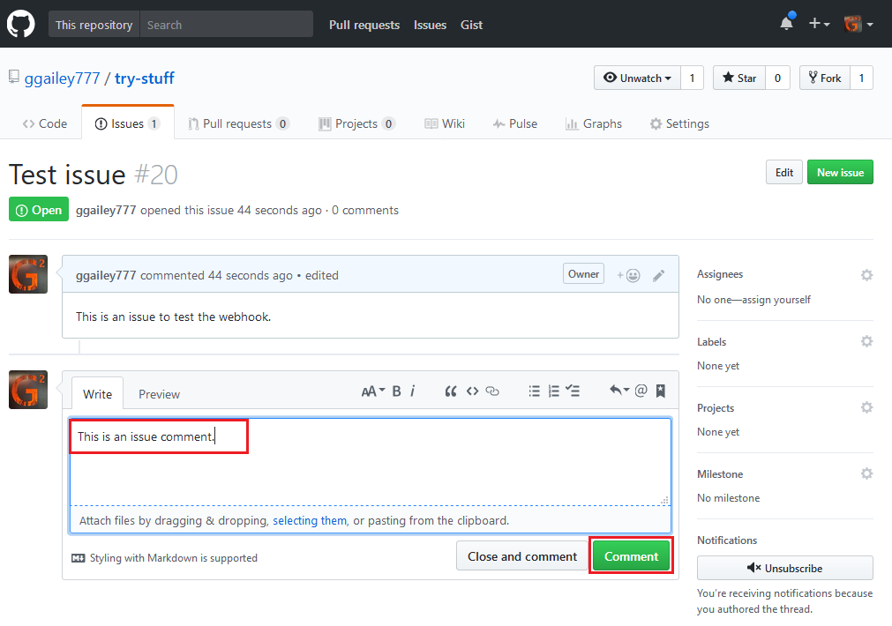

# Creación de una función desencadenada por Webhook de GitHub

Obtenga información acerca de cómo toocreate una función que se desencadena por una solicitud de webhook HTTP con una carga específica de GitHub.

## Requisitos previos

+ Una cuenta de GitHub con un proyecto como mínimo.
+ Una suscripción de Azure. Si no tiene una, cree una [cuenta gratuita](https://azure.microsoft.com/free/?WT.mc_id=A261C142F) antes de empezar.

[!INCLUDE [functions-portal-favorite-function-apps](../../includes/functions-portal-favorite-function-apps.md)]

## Creación de una Function App de Azure

[!INCLUDE [Create function app Azure portal](../../includes/functions-create-function-app-portal.md)]

A continuación, cree una función en la aplicación de hello nueva función.

## Crear una función desencadenada de webhook de GitHub

1. Expanda la aplicación de la función y haga clic en hello  **+**  aparece al lado demasiado**funciones**. Si se trata de la primera función en la aplicación de la función de hello, seleccione **función personalizada**. Esto muestra el conjunto completo de Hola de plantillas de función.

    

2. Seleccione hello **GitHub WebHook** plantilla para el idioma que desee. Asigne un **nombre a la función** y seleccione **Crear**.

      

3. En la nueva función, haga clic en **<> / Get función URL**, a continuación, copiar y guardar los valores de hello. Hola lo mismo para **<> / GitHub obtener secreto**. Use estos webhook de hello valores tooconfigure en GitHub.

    

A continuación, va a crear un webhook en el repositorio de GitHub.

## Configurar hello webhook

1. En GitHub, vaya repositorio tooa perteneciente al usuario. También puede utilizar los repositorios bifurcados. Si necesita toofork un repositorio, use <https://github.com/Azure-Samples/functions-quickstart>.

1. Haga clic en **Configuración**, después en **Webhooks** y, finalmente, en **Agregar Webhook**.

    

1. Usar la configuración de acuerdo con lo especificado en la tabla de Hola, a continuación, haga clic en **agregar webhook**.

    

| Configuración | Valor sugerido | Descripción |
|---|---|---|
| **Dirección URL de carga** | Valor copiado | Usar valor Hola devuelto por **<> / Get función URL**. |
| **Secreto**   | Valor copiado | Usar valor Hola devuelto por **<> / GitHub obtener secreto**. |
| **Tipo de contenido** | application/json | función Hello espera una carga JSON. |
| Desencadenadores de eventos | Dejarme seleccionar eventos individuales | Sólo queremos tootrigger en los eventos de comentario del problema.  |
| | Comentario de problema |  |

Ahora, Hola webhook es tootrigger configurado la función cuando se agrega un nuevo comentario de problema.

## Probar función hello

1. En el repositorio de GitHub, abra hello **problemas** ficha en una nueva ventana del explorador.

1. En la ventana nueva hello, haga clic en **problema nuevo**, escriba un título y, a continuación, haga clic en **Enviar nuevo problema**.

1. Problema de hello, escriba un comentario y haga clic en **comentario**.

    

1. Retroceda toohello portal y ver los registros de Hola. Debería ver una entrada de seguimiento con el texto del comentario nuevo Hola.

     

## Limpieza de recursos

[!INCLUDE [Next steps note](../../includes/functions-quickstart-cleanup.md)]

## Pasos siguientes

Ha creado una función que se ejecuta cuando se recibe una solicitud de un webhook de GitHub.

[!INCLUDE [Next steps note](../../includes/functions-quickstart-next-steps.md)]

Para más información sobre los desencadenadores de webhook, consulte [Enlaces HTTP y webhook en Azure Functions](functions-bindings-http-webhook.md).
