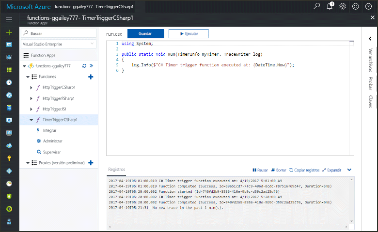
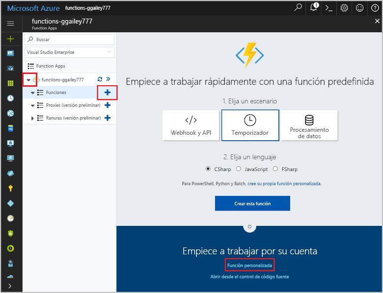
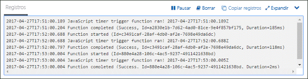
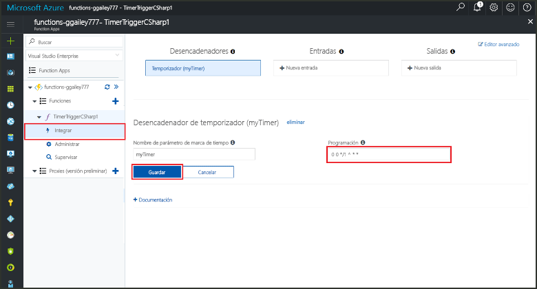

# Cree una función en Azure que se desencadena mediante un temporizadorCreate a function in Azure that is triggered by a timer

Obtenga información acerca de cómo toouse funciones de Azure toocreate una función que se ejecuta según una programación que usted defina.Learn how toouse Azure Functions toocreate a function that runs based a schedule that you define.

## Requisitos previosPrerequisites

toocomplete este tutorial:toocomplete this tutorial:

+ Si no tiene una suscripción a Azure, cree una [cuenta gratuita](https://azure.microsoft.com/free/?WT.mc_id=A261C142F) antes de empezar.If you don't have an Azure subscription, create a [free account](https://azure.microsoft.com/free/?WT.mc_id=A261C142F) before you begin.

[!INCLUDE [functions-portal-favorite-function-apps](../../includes/functions-portal-favorite-function-apps.md)]

## Creación de una Function App de AzureCreate an Azure Function app

[!INCLUDE [Create function app Azure portal](../../includes/functions-create-function-app-portal.md)]

A continuación, cree una función en la aplicación de hello nueva función.Next, you create a function in hello new function app.

## Creación de una función desencadenada por un temporizadorCreate a timer triggered function

1. Expanda la aplicación de la función y haga clic en hello  **+**  aparece al lado demasiado**funciones**.Expand your function app and click hello **+** button next too**Functions**. Si se trata de la primera función en la aplicación de la función de hello, seleccione **función personalizada**.If this is hello first function in your function app, select **Custom function**. Esto muestra el conjunto completo de Hola de plantillas de función.This displays hello complete set of function templates.

    

2. Seleccione hello **TimerTrigger** plantilla para el idioma que desee.Select hello **TimerTrigger** template for your desired language. A continuación, use configuración de hello como se especifica en la tabla de hello:Then use hello settings as specified in hello table:

    

    | ConfiguraciónSetting | Valor sugeridoSuggested value | DescripciónDescription |
    |---|---|---|
    | **Asigne un nombre a la función****Name your function** | TimerTriggerCSharp1TimerTriggerCSharp1 | Define el nombre de saludo de la función de temporizador desencadenada.Defines hello name of your timer triggered function. |
    | **[Programación](http://en.wikipedia.org/wiki/Cron#CRON_expression)****[Schedule](http://en.wikipedia.org/wiki/Cron#CRON_expression)** | 0 \*/1 \* \* \* \*0 \*/1 \* \* \* \* | Un campo de seis [expresión CRON](http://en.wikipedia.org/wiki/Cron#CRON_expression) que programa la función toorun cada minuto.A six field [CRON expression](http://en.wikipedia.org/wiki/Cron#CRON_expression) that schedules your function toorun every minute. |

2. Haga clic en **Crear**.Click **Create**. Se crea una función en el lenguaje elegido que se ejecuta cada minuto.A function is created in your chosen language that runs every minute.

3. Ver la información de seguimiento escrito registros toohello para comprobar la ejecución.Verify execution by viewing trace information written toohello logs.

    

Ahora, puede cambiar la programación de la función de Hola para que se ejecute con menos frecuencia, por ejemplo, una vez cada hora.Now, you can change hello function's schedule so that it runs less often, such as once every hour. 

## Programación de temporizador de actualización HolaUpdate hello timer schedule

1. Expanda la función y haga clic en **Integrar**.Expand your function and click **Integrate**. Esto es donde definir la entrada y salida enlaces para la función y establecer programación Hola.This is where you define input and output bindings for your function and also set hello schedule. 

2. Escriba el nuevo valor de **Programación** `0 0 */1 * * *` y, después, haga clic en **Guardar**.Enter a new **Schedule** value of `0 0 */1 * * *`, and then click **Save**.  

Ahora tiene una función que se ejecuta una vez cada hora.You now have a function that runs once every hour. 

## Limpieza de recursosClean up resources

[!INCLUDE [Next steps note](../../includes/functions-quickstart-cleanup.md)]

## Pasos siguientesNext steps

Ha creado una función que se ejecuta según una programación.You have created a function that runs based on a schedule.

[!INCLUDE [Next steps note](../../includes/functions-quickstart-next-steps.md)]

Para obtener más información sobre los desencadenadores de temporizador, vea [Programación de la ejecución de código con Azure Functions](functions-bindings-timer.md).For more information timer triggers, see [Schedule code execution with Azure Functions](functions-bindings-timer.md).