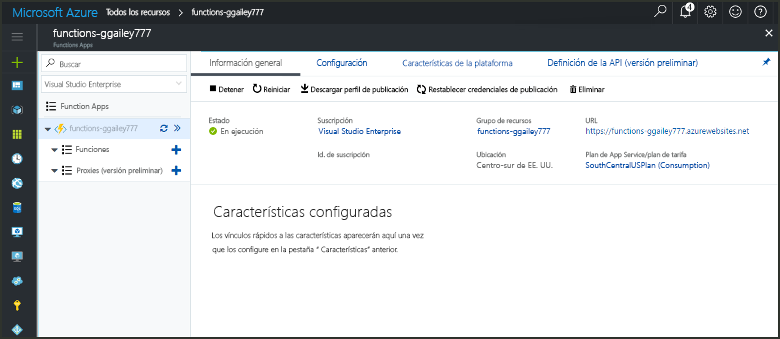

# Cree una función en Azure que se desencadena mediante un temporizadorCreate a function in Azure that is triggered by a timer

Obtenga información sobre cómo usar Azure Functions para crear una función que se ejecuta según la programación que usted defina.Learn how to use Azure Functions to create a function that runs based a schedule that you define.

## Requisitos previosPrerequisites

Para completar este tutorial:To complete this tutorial:

+ Si no tiene una suscripción a Azure, cree una [cuenta gratuita](https://azure.microsoft.com/free/?WT.mc_id=A261C142F) antes de empezar.If you don't have an Azure subscription, create a [free account](https://azure.microsoft.com/free/?WT.mc_id=A261C142F) before you begin.

[!INCLUDE [functions-portal-favorite-function-apps](../../includes/functions-portal-favorite-function-apps.md)]

## Creación de una Function App de AzureCreate an Azure Function app

[!INCLUDE [Create function app Azure portal](../../includes/functions-create-function-app-portal.md)]

Después, cree una función en la nueva Function App.Next, you create a function in the new function app.

## Creación de una función desencadenada por un temporizadorCreate a timer triggered function

1. Expanda su instancia de Function App y haga clic en el botón **+**, que se encuentra junto a **Functions**.Expand your function app and click the **+** button next to **Functions**. Si se trata de la primera función de Function App, seleccione **Función personalizada**.If this is the first function in your function app, select **Custom function**. Se muestra el conjunto completo de plantillas de funciones.This displays the complete set of function templates.

    

2. Seleccione la plantilla **TimerTrigger** del idioma que desee.Select the **TimerTrigger** template for your desired language. Luego, use la configuración que se especifica en la tabla:Then use the settings as specified in the table:

    

    | ConfiguraciónSetting | Valor sugeridoSuggested value | DescripciónDescription |
    |---|---|---|
    | **Asigne un nombre a la función****Name your function** | TimerTriggerCSharp1TimerTriggerCSharp1 | Define el nombre de la función desencadenada por el temporizador.Defines the name of your timer triggered function. |
    | **[Programación](http://en.wikipedia.org/wiki/Cron#CRON_expression)****[Schedule](http://en.wikipedia.org/wiki/Cron#CRON_expression)** | 0 \*/1 \* \* \* \*0 \*/1 \* \* \* \* | [Expresión CRON](http://en.wikipedia.org/wiki/Cron#CRON_expression) de seis campos que programa la función para que se ejecute cada minuto.A six field [CRON expression](http://en.wikipedia.org/wiki/Cron#CRON_expression) that schedules your function to run every minute. |

2. Haga clic en **Crear**.Click **Create**. Se crea una función en el lenguaje elegido que se ejecuta cada minuto.A function is created in your chosen language that runs every minute.

3. Vea la información de seguimiento que se escribe en los registros para comprobar la ejecución.Verify execution by viewing trace information written to the logs.

    

Ahora puede cambiar la programación de la función para que se ejecute con menos frecuencia, por ejemplo, una vez cada hora.Now, you can change the function's schedule so that it runs less often, such as once every hour. 

## Actualizar la programación del temporizadorUpdate the timer schedule

1. Expanda la función y haga clic en **Integrar**.Expand your function and click **Integrate**. Aquí es donde se definen los enlaces de entrada y salida de la función y se establece la programación.This is where you define input and output bindings for your function and also set the schedule. 

2. Escriba el nuevo valor de **Programación** `0 0 */1 * * *` y, después, haga clic en **Guardar**.Enter a new **Schedule** value of `0 0 */1 * * *`, and then click **Save**.  

Ahora tiene una función que se ejecuta una vez cada hora.You now have a function that runs once every hour. 

## Limpieza de recursosClean up resources

[!INCLUDE [Next steps note](../../includes/functions-quickstart-cleanup.md)]

## Pasos siguientesNext steps

Ha creado una función que se ejecuta según una programación.You have created a function that runs based on a schedule.

[!INCLUDE [Next steps note](../../includes/functions-quickstart-next-steps.md)]

Para obtener más información sobre los desencadenadores de temporizador, vea [Programación de la ejecución de código con Azure Functions](functions-bindings-timer.md).For more information timer triggers, see [Schedule code execution with Azure Functions](functions-bindings-timer.md).