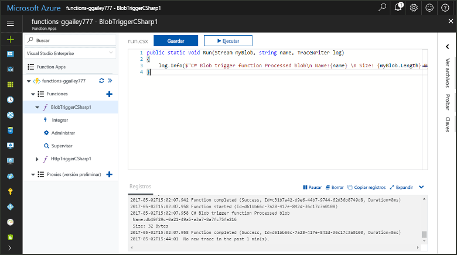
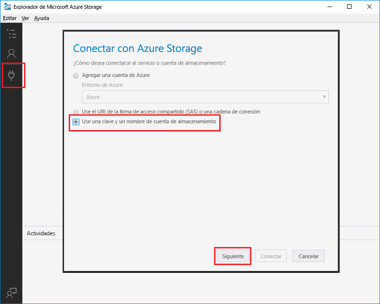
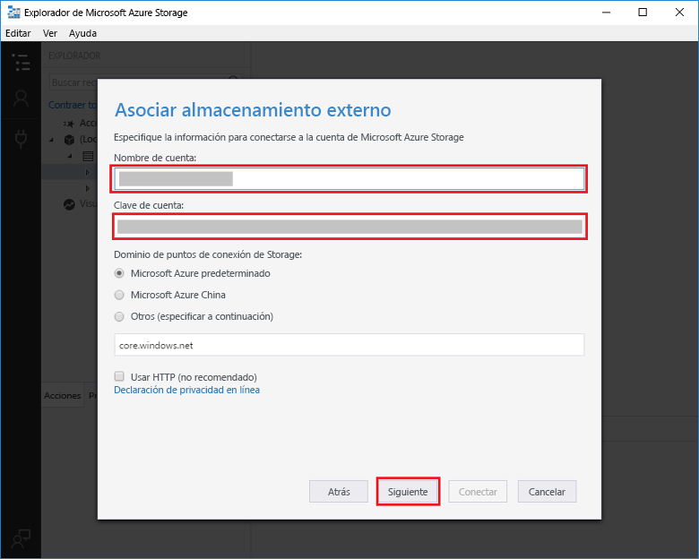
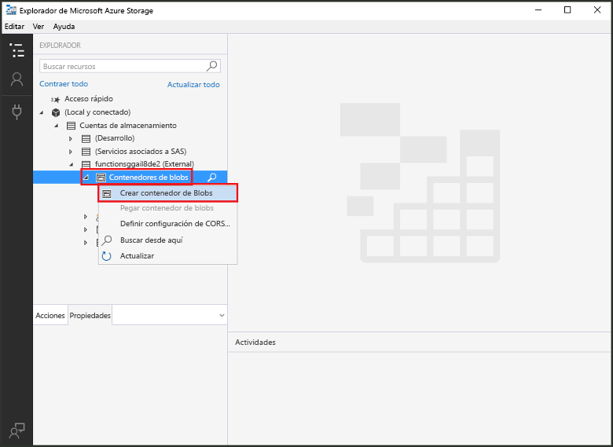
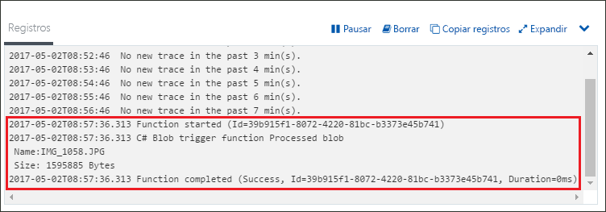

# Crear una función desencadenada por Azure Blob StorageCreate a function triggered by Azure Blob storage

Obtenga información acerca de cómo toocreate una función que se desencadena cuando los archivos están cargados tooor actualizado en el almacenamiento de blobs de Azure.Learn how toocreate a function triggered when files are uploaded tooor updated in Azure Blob storage.

## Requisitos previosPrerequisites

+ Descargue e instale hello [Microsoft Azure Storage Explorer](http://storageexplorer.com/).Download and install hello [Microsoft Azure Storage Explorer](http://storageexplorer.com/).
+ Una suscripción de Azure.An Azure subscription. Si no tiene una, cree una [cuenta gratuita](https://azure.microsoft.com/free/?WT.mc_id=A261C142F) antes de empezar.If you don't have one, create a [free account](https://azure.microsoft.com/free/?WT.mc_id=A261C142F) before you begin.

[!INCLUDE [functions-portal-favorite-function-apps](../../includes/functions-portal-favorite-function-apps.md)]

## Creación de una Function App de AzureCreate an Azure Function app

[!INCLUDE [Create function app Azure portal](../../includes/functions-create-function-app-portal.md)]

A continuación, cree una función en la aplicación de hello nueva función.Next, you create a function in hello new function app.

## Creación de una función desencadenada por Blob StorageCreate a Blob storage triggered function

1. Expanda la aplicación de la función y haga clic en hello  **+**  aparece al lado demasiado**funciones**.Expand your function app and click hello **+** button next too**Functions**. Si se trata de la primera función en la aplicación de la función de hello, seleccione **función personalizada**.If this is hello first function in your function app, select **Custom function**. Esto muestra el conjunto completo de Hola de plantillas de función.This displays hello complete set of function templates.

    

2. Seleccione hello **BlobTrigger** plantilla de idioma que desee y usar la configuración como se especifica en la tabla de Hola Hola.Select hello **BlobTrigger** template for your desired language, and use hello settings as specified in hello table.

    

    | ConfiguraciónSetting | Valor sugeridoSuggested value | DescripciónDescription |
    |---|---|---|
    | **Ruta de acceso****Path**   | mycontainer/{name}mycontainer/{name}    | Ubicación de Blob Storage que se está supervisando.Location in Blob storage being monitored. nombre de archivo de Hola de blob de Hola se pasa en el enlace de hello como hello _nombre_ parámetro.hello file name of hello blob is passed in hello binding as hello _name_ parameter.  |
    | **Conexión de la cuenta de almacenamiento****Storage account connection** | AzureWebJobStorageAzureWebJobStorage | Puede usar la conexión de la cuenta de almacenamiento Hola ya está en uso por la aplicación de la función o cree uno nuevo.You can use hello storage account connection already being used by your function app, or create a new one.  |
    | **Asigne un nombre a la función****Name your function** | Único en la Function AppUnique in your function app | Nombre de la función desencadenada por este blob.Name of this blob triggered function. |

3. Haga clic en **crear** toocreate la función.Click **Create** toocreate your function.

A continuación, conectarse a tooyour cuenta de almacenamiento de Azure y crear hello **mycontainer** contenedor.Next, you connect tooyour Azure Storage account and create hello **mycontainer** container.

## Crear contenedor de HolaCreate hello container

1. En la función, haga clic en **Integrar**, expanda **Documentación** y copie los dos valores de **Nombre de cuenta** y **Clave de cuenta**.In your function, click **Integrate**, expand **Documentation**, and copy both **Account name** and **Account key**. Use estas cuentas de almacenamiento de credenciales tooconnect toohello.You use these credentials tooconnect toohello storage account. Si ya se ha conectado la cuenta de almacenamiento, omitir toostep 4.If you have already connected your storage account, skip toostep 4.

    

1. Ejecute hello [Microsoft Azure Storage Explorer](http://storageexplorer.com/) de herramientas, haga clic en hello conectarse icono de hello izquierda, elija **utilizar un nombre de la cuenta de almacenamiento y la clave**y haga clic en **siguiente**.Run hello [Microsoft Azure Storage Explorer](http://storageexplorer.com/) tool, click hello connect icon on hello left, choose **Use a storage account name and key**, and click **Next**.

    

1. Escriba Hola **nombre-cuenta** y **clave de cuenta** del paso 1, haga clic en **siguiente** y, a continuación, **conectar**.Enter hello **Account name** and **Account key** from step 1, click **Next** and then **Connect**. 

    

1. Expanda Hola adjunta cuenta de almacenamiento, haga clic en **contenedores de blobs**, haga clic en **crear contenedor de blob**, tipo `mycontainer`, y, a continuación, presione ENTRAR.Expand hello attached storage account, right-click **Blob containers**, click **Create blob container**, type `mycontainer`, and then press enter.

    

Ahora que tiene un contenedor de blobs, puede probar función hello mediante la carga de un contenedor de toohello de archivo.Now that you have a blob container, you can test hello function by uploading a file toohello container.

## Probar función helloTest hello function

1. Nuevo en hello portal de Azure, examinar tooyour función expanda hello **registros** final Hola de página de Hola y asegúrese de que dicho registro de transmisión por secuencias no está en pausa.Back in hello Azure portal, browse tooyour function expand hello **Logs** at hello bottom of hello page and make sure that log streaming isn't paused.

1. En el Explorador de almacenamiento, expanda la cuenta de almacenamiento, **Contenedores de blobs** y **mycontainer**.In Storage Explorer, expand your storage account, **Blob containers**, and **mycontainer**. Haga clic en **Cargar** y en **Cargar archivos…**Click **Upload** and then **Upload files...**.

    

1. Hola **cargar archivos** diálogo cuadro, haga clic en hello **archivos** campo.In hello **Upload files** dialog box, click hello **Files** field. Examinar el archivo tooa en el equipo local, como un archivo de imagen, selecciónelo y haga clic en **abiertos** y, a continuación, **cargar**.Browse tooa file on your local computer, such as an image file, select it and click **Open** and then **Upload**.

1. Volver atrás tooyour función registros y compruebe que se ha leído el blob Hola.Go back tooyour function logs and verify that hello blob has been read.

   

    >[!NOTE]
    > Cuando se ejecuta la aplicación de la función en el plan de consumo de hello predeterminado, puede haber un retraso de seguridad tooseveral minutos entre blob que se agregaron o actualizaron de Hola y Hola función va a desencadenar.When your function app runs in hello default Consumption plan, there may be a delay of up tooseveral minutes between hello blob being added or updated and hello function being triggered. Si necesita una latencia baja en las funciones desencadenadas por el blob, considere la posibilidad de ejecutar la Function App en un plan de App Service.If you need low latency in your blob triggered functions, consider running your function app in an App Service plan.

## Limpieza de recursosClean up resources

[!INCLUDE [Next steps note](../../includes/functions-quickstart-cleanup.md)]

## Pasos siguientesNext steps

Ha creado una función que se ejecuta cuando un blob se agrega tooor actualizado en el almacenamiento de blobs.You have created a function that runs when a blob is added tooor updated in Blob storage. 

[!INCLUDE [Next steps note](../../includes/functions-quickstart-next-steps.md)]

Para obtener más información sobre los desencadenadores de Blob Storage, vea [Enlaces de Blob Storage en Azure Functions](functions-bindings-storage-blob.md).For more information about Blob storage triggers, see [Azure Functions Blob storage bindings](functions-bindings-storage-blob.md).
