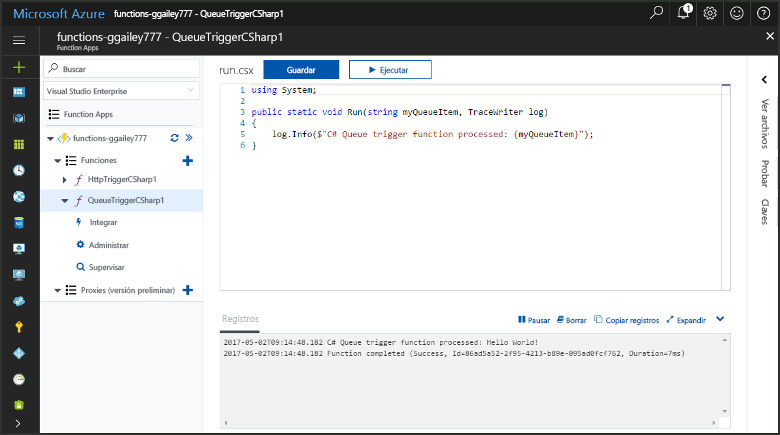
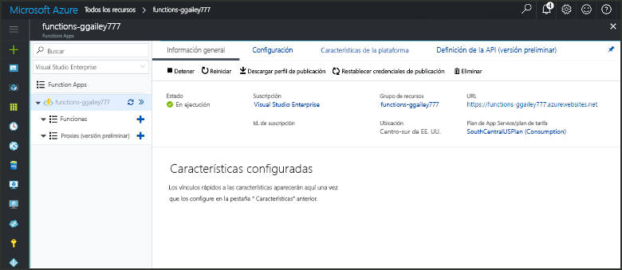
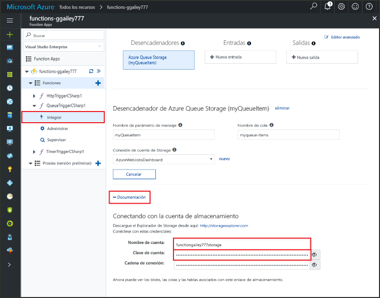
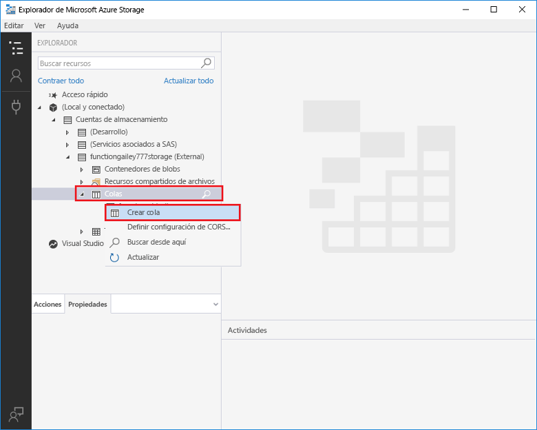
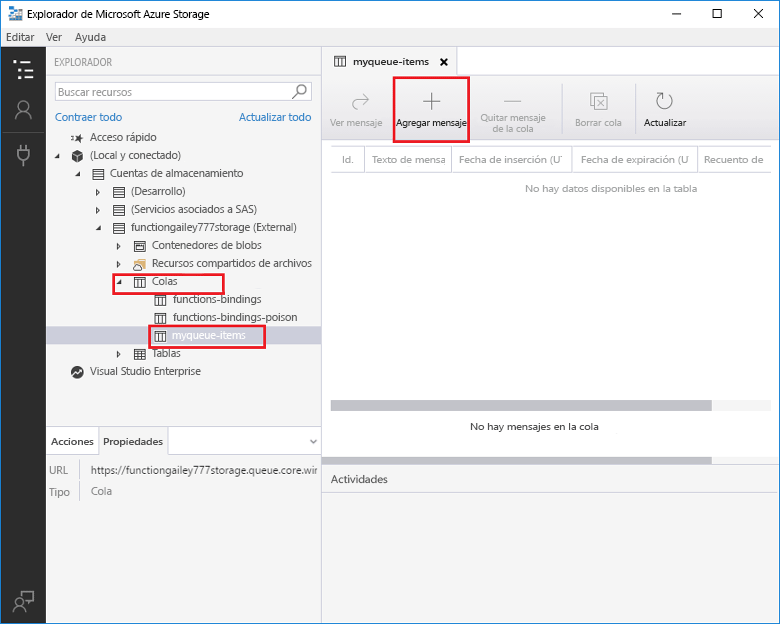
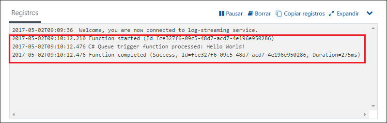

# Crear una función desencadenada por Azure Queue StorageCreate a function triggered by Azure Queue storage

Obtenga información sobre cómo crear una función que se desencadena cuando se envían mensajes a una cola de Azure Storage.Learn how to create a function triggered when messages are submitted to an Azure Storage queue.

## Requisitos previosPrerequisites

- Descargue e instale el [Explorador de Microsoft Azure Storage](http://storageexplorer.com/).Download and install the [Microsoft Azure Storage Explorer](http://storageexplorer.com/).

- Una suscripción de Azure.An Azure subscription. Si no tiene una, cree una [cuenta gratuita](https://azure.microsoft.com/free/?WT.mc_id=A261C142F) antes de empezar.If you don't have one, create a [free account](https://azure.microsoft.com/free/?WT.mc_id=A261C142F) before you begin.

[!INCLUDE [functions-portal-favorite-function-apps](../../includes/functions-portal-favorite-function-apps.md)]

## Creación de una Function App de AzureCreate an Azure Function app

[!INCLUDE [Create function app Azure portal](../../includes/functions-create-function-app-portal.md)]

Después, cree una función en la nueva Function App.Next, you create a function in the new function app.

## Creación de una función desencadenada por el servicio QueueCreate a Queue triggered function

1. Expanda su instancia de Function App y haga clic en el botón **+**, que se encuentra junto a **Functions**.Expand your function app and click the **+** button next to **Functions**. Si se trata de la primera función de Function App, seleccione **Función personalizada**.If this is the first function in your function app, select **Custom function**. Se muestra el conjunto completo de plantillas de funciones.This displays the complete set of function templates.

    

2. Seleccione la plantilla **QueueTrigger** de idioma que desee y use la configuración que se especifica en la tabla.Select the **QueueTrigger** template for your desired language, and  use the settings as specified in the table.

    
    
    | ConfiguraciónSetting | Valor sugeridoSuggested value | DescripciónDescription |
    |---|---|---|
    | **Nombre de la cola****Queue name**   | myqueue-itemsmyqueue-items    | Nombre de la cola a la que se va a conectar en la cuenta de almacenamiento.Name of the queue to connect to in your Storage account. |
    | **Conexión de cuenta de Storage****Storage account connection** | AzureWebJobStorageAzureWebJobStorage | Puede usar la conexión de cuenta de almacenamiento que ya usa la Function App o crear una.You can use the storage account connection already being used by your function app, or create a new one.  |
    | **Asigne un nombre a la función****Name your function** | Único en la Function AppUnique in your function app | Nombre de la función desencadenada por la cola.Name of this queue triggered function. |

3. Haga clic en **Crear** para crear la función.Click **Create** to create your function.

Después, conéctese a su cuenta de Azure Storage y cree la cola de almacenamiento **myqueue-items**.Next, you connect to your Azure Storage account and create the **myqueue-items** storage queue.

## Creación de la colaCreate the queue

1. En la función, haga clic en **Integrar**, expanda **Documentación** y copie los dos valores de **Nombre de cuenta** y **Clave de cuenta**.In your function, click **Integrate**, expand **Documentation**, and copy both **Account name** and **Account key**. Use estas credenciales para conectarse a la cuenta de almacenamiento.You use these credentials to connect to the storage account. Si ya se ha conectado a la cuenta de almacenamiento, vaya al paso 4.If you have already connected your storage account, skip to step 4.

    vv

1. Ejecute la herramienta [Explorador de Microsoft Azure Storage](http://storageexplorer.com/), haga clic en el icono de conexión situado a la izquierda, seleccione **Use a storage account name and key** (Usar el nombre y la clave de una cuenta de almacenamiento) y haga clic en **Siguiente**.Run the [Microsoft Azure Storage Explorer](http://storageexplorer.com/) tool, click the connect icon on the left, choose **Use a storage account name and key**, and click **Next**.

    

1. Escriba los valores de **Nombre de cuenta** y **Clave de cuenta** del paso 1, haga clic en **Siguiente** y, después, en **Conectar**.Enter the **Account name** and **Account key** from step 1, click **Next** and then **Connect**.

    

1. Expanda la cuenta de almacenamiento asociada, haga clic con el botón derecho en **Colas**, haga clic en **Crear cola**, escriba `myqueue-items` y, después, presione ENTRAR.Expand the attached storage account, right-click **Queues**, click **Create queue**, type `myqueue-items`, and then press enter.

    

Ahora que tiene una cola de almacenamiento, puede probar la función. Para ello, agregue un mensaje a la cola.Now that you have a storage queue, you can test the function by adding a message to the queue.

## Prueba de la funciónTest the function

1. De nuevo en Azure Portal, vaya a la función. Expanda **Registros** en la parte inferior de la página y asegúrese de que el streaming de registros no está en pausa.Back in the Azure portal, browse to your function expand the **Logs** at the bottom of the page and make sure that log streaming isn't paused.

1. En el Explorador de almacenamiento, expanda la cuenta de almacenamiento, **Colas** y **myqueue-items** y, después, haga clic en **Agregar mensaje**.In Storage Explorer, expand your storage account, **Queues**, and **myqueue-items**, then click **Add message**.

    

1. Escriba su mensaje "Hola mundo"Type your "Hello World!" en **Texto del mensaje** y haga clic en **Aceptar**.message in **Message text** and click **OK**.

1. Espere unos segundos y, después, vuelva a los registros de función para comprobar que se ha leído el mensaje nuevo de la cola.Wait for a few seconds, then go back to your function logs and verify that the new message has been read from the queue.

    

1. En el Explorador de almacenamiento, haga clic en **Actualizar** y compruebe que el mensaje se ha procesado y ya no está en la cola.Back in Storage Explorer, click **Refresh** and verify that the message has been processed and is no longer in the queue.

## Limpieza de recursosClean up resources

[!INCLUDE [Next steps note](../../includes/functions-quickstart-cleanup.md)]

## Pasos siguientesNext steps

Ha creado una función que se ejecuta cuando se agrega un mensaje a una cola de almacenamiento.You have created a function that runs when a message is added to a storage queue.

[!INCLUDE [Next steps note](../../includes/functions-quickstart-next-steps.md)]

Para obtener más información sobre los desencadenadores de Queue Storage, vea [Enlaces de colas de Storage en Azure Functions](functions-bindings-storage-queue.md).For more information about Queue storage triggers, see [Azure Functions Storage queue bindings](functions-bindings-storage-queue.md).