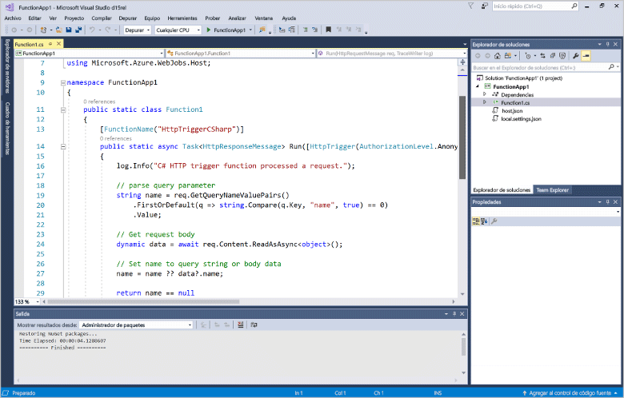
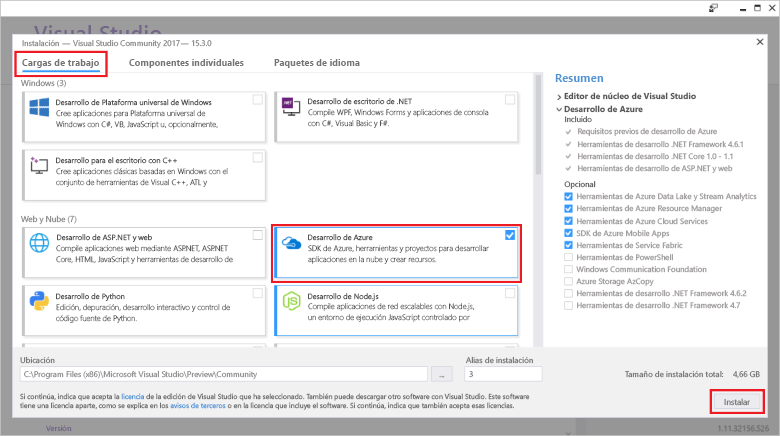
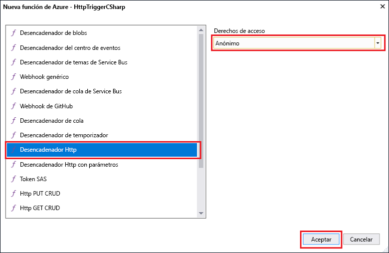

# Creación de la primera función mediante Visual Studio

Las funciones de Azure permite ejecutar el código en un entorno sin servidor sin necesidad de toofirst crear una máquina virtual o publicar una aplicación web.

En este tema, aprenderá cómo toouse Hola 2017 de Visual Studio tools para toocreate de las funciones de Azure y probar una función de "Hola a todos" localmente. A continuación, publicará tooAzure de código de función de Hola. Estas herramientas están disponibles como parte de la carga de trabajo de desarrollo de Azure de hello en Visual Studio 2017 versión 15.3, o una versión posterior.

## Requisitos previos

toocomplete este tutorial, programa de instalación:

* [Visual Studio 2017 versión 15.3](https://www.visualstudio.com/vs/preview/), incluidos hello **desarrollo Azure** carga de trabajo.

    
    
    >[!NOTE]  
    Después de instalar o actualizar tooVisual Studio 2017 versión 15.3, también tendrá que herramientas de toomanually actualización Hola 2017 de Visual Studio para las funciones de Azure. Puede actualizar herramientas Hola de hello **herramientas** menú situado bajo **extensiones y actualizaciones...**   >  **Actualizaciones** > **Visual Studio Marketplace** > **herramientas de trabajos de las funciones de Azure y Web**  >  **Actualización**. 

[!INCLUDE [quickstarts-free-trial-note](../../includes/quickstarts-free-trial-note.md)] 

## Creación de un proyecto de Azure Functions en Visual Studio

[!INCLUDE [Create a project using hello Azure Functions template](../../includes/functions-vstools-create.md)]

Ahora que ha creado el proyecto de hello, puede crear la primera función.

## Crear función hello

1. En el **Explorador de soluciones**, haga clic con el botón derecho en el nodo del proyecto y seleccione **Agregar** > **Nuevo elemento**. Seleccione **Función de Azure** y haga clic en **Agregar**.

2. Seleccione **HttpTrigger**, escriba un **nombre de función**, seleccione **Anónimo** en **Derechos de acceso**y haga clic en **Crear**. función Hello creada se tiene acceso con una solicitud HTTP desde cualquier cliente. 

    

    Un archivo de código se agrega el proyecto tooyour que contiene una clase que implementa el código de función. Este código se basa en una plantilla, que recibe un valor de nombre y lo transmite de nuevo. Hola **FunctionName** atributo establece el nombre de hello de la función. Hola **HttpTrigger** atributo indica el mensaje de Hola que desencadena la función hello. 

    

Ahora que ha creado una función desencadenada por HTTP, puede probarla en el equipo local.

## Probar función hello localmente

Azure Functions Core Tools le permite ejecutar un proyecto de Azure Functions en el equipo de desarrollo local. Son solicitada tooinstall estas herramientas Hola la primera vez que inicie una función de Visual Studio.  

1. tootest su función, presione F5. Si se le solicita, Aceptar solicitud Hola de toodownload de Visual Studio e instalar herramientas de núcleo de las funciones de Azure (CLI).  También deberá tooenable una excepción de firewall para que las herramientas de hello pueden administrar las solicitudes HTTP.

2. Copiar dirección URL de saludo de la función de tiempo de ejecución de funciones de Azure Hola de salida.  

    

3. Pegue la URL de Hola de solicitud HTTP de hello en barra de direcciones de su explorador. Anexar la cadena de consulta de hello `&name=<yourname>` toothis URL y ejecutar la solicitud de saludo. siguiente Hello muestra respuesta hello en hello explorador toohello local GET solicitud devuelto por la función hello: 

    

4. toostop depuración, haga clic en hello **detener** botón de barra de herramientas de Visual Studio Hola.

Una vez que haya comprobado que función hello se ejecuta correctamente en el equipo local, es hora toopublish Hola proyecto tooAzure.

## Publicar Hola proyecto tooAzure

Debe tener una aplicación de función en la suscripción de Azure para poder publicar el proyecto. Las aplicaciones de función se pueden crear directamente desde Visual Studio.

[!INCLUDE [Publish hello project tooAzure](../../includes/functions-vstools-publish.md)]

## Prueba de una función en Azure

1. Copiar dirección URL base de Hola de aplicación de la función de hello desde la página de perfil de publicación de Hola. Reemplace hello `localhost:port` parte de la dirección URL de Hola que utilizó al probar la función hello localmente con la dirección URL base nueva Hola. Al igual que antes, asegúrese de cadena de consulta de hello tooappend seguro `&name=<yourname>` toothis URL y ejecutar la solicitud de saludo.

    dirección URL de Hola que llama el HTTP desencadena función es similar al siguiente:

        http://<functionappname>.azurewebsites.net/api/<functionname>?name=<yourname> 

2. Pegue esta nueva dirección URL de solicitud de hello HTTP en la barra de direcciones del explorador. siguiente Hello muestra respuesta hello en hello explorador toohello remoto GET solicitud devuelto por la función hello: 

    
 
## Pasos siguientes

Ha usado la aplicación de función de Visual Studio toocreate C# con una función simple de HTTP que se desencadena. 

+ toolearn cómo tooconfigure su toosupport proyecto otros tipos de desencadenadores y enlaces, vea hello [configurar proyectos de hello para el desarrollo local](functions-develop-vs.md#configure-the-project-for-local-development) sección [funciones de Azure Tools para Visual Studio](functions-develop-vs.md).
+ toolearn más información acerca de probarlo y depuración con herramientas de hello Azure funciones principales, vea [código y probar las funciones de Azure localmente](functions-run-local.md). 
+ toolearn más sobre el desarrollo de las funciones como bibliotecas de clases. NET, vea [bibliotecas de clases de .NET usando con funciones de Azure](functions-dotnet-class-library.md). 

