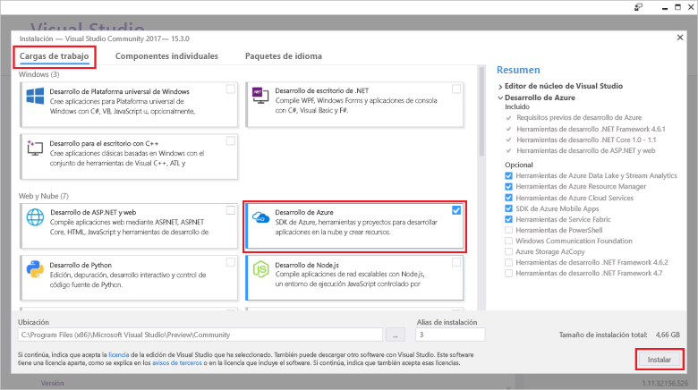

# <a name="azure-functions-tools-for-visual-studio"></a><span data-ttu-id="b3720-103">Herramientas de Azure Functions para Visual Studio</span><span class="sxs-lookup"><span data-stu-id="b3720-103">Azure Functions Tools for Visual Studio</span></span>  

<span data-ttu-id="b3720-104">Herramientas de funciones de Azure para Visual Studio de 2017 es una extensión de Visual Studio que le permite desarrollar, probar e implementar tooAzure de funciones de C#.</span><span class="sxs-lookup"><span data-stu-id="b3720-104">Azure Functions Tools for Visual Studio 2017 is an extension for Visual Studio that lets you develop, test, and deploy C# functions tooAzure.</span></span> <span data-ttu-id="b3720-105">Si se trata de la primera experiencia con las funciones de Azure, se puede obtener más información en [un tooAzure Introducción funciones](functions-overview.md).</span><span class="sxs-lookup"><span data-stu-id="b3720-105">If this is your first experience with Azure Functions, you can learn more at [An introduction tooAzure Functions](functions-overview.md).</span></span>

<span data-ttu-id="b3720-106">Hola herramientas de funciones de Azure proporciona Hola siguientes ventajas:</span><span class="sxs-lookup"><span data-stu-id="b3720-106">hello Azure Functions Tools provides hello following benefits:</span></span> 

* <span data-ttu-id="b3720-107">Editar, compilar y ejecutar funciones en el equipo de desarrollo local.</span><span class="sxs-lookup"><span data-stu-id="b3720-107">Edit, build, and run functions on your local development computer.</span></span> 
* <span data-ttu-id="b3720-108">Publicar las funciones de Azure directamente proyecto tooAzure.</span><span class="sxs-lookup"><span data-stu-id="b3720-108">Publish your Azure Functions project directly tooAzure.</span></span> 
* <span data-ttu-id="b3720-109">Usar enlaces de función de trabajos Web atributos toodeclare directamente en código de C# en lugar de mantener un function.json independiente para las definiciones de enlace de Hola.</span><span class="sxs-lookup"><span data-stu-id="b3720-109">Use WebJobs attributes toodeclare function bindings directly in hello C# code instead of maintaining a separate function.json for binding definitions.</span></span>
* <span data-ttu-id="b3720-110">Desarrollar e implementar funciones de C# compiladas previamente.</span><span class="sxs-lookup"><span data-stu-id="b3720-110">Develop and deploy pre-compiled C# functions.</span></span> <span data-ttu-id="b3720-111">Las funciones compiladas previamente proporcionan un mejor rendimiento de arranque en frío que las funciones basadas en scripts de C#.</span><span class="sxs-lookup"><span data-stu-id="b3720-111">Pre-complied functions provide a better cold-start performance than C# script-based functions.</span></span> 
* <span data-ttu-id="b3720-112">Código de las funciones de C# al tiempo que tiene todas las ventajas de Hola de desarrollo de Visual Studio.</span><span class="sxs-lookup"><span data-stu-id="b3720-112">Code your functions in C# while having all of hello benefits of Visual Studio development.</span></span> 

<span data-ttu-id="b3720-113">Este tema muestra cómo toouse hello las funciones de Azure Tools para Visual Studio de 2017 toodevelop sus funciones en C#.</span><span class="sxs-lookup"><span data-stu-id="b3720-113">This topic shows you how toouse hello Azure Functions Tools for Visual Studio 2017 toodevelop your functions in C#.</span></span> <span data-ttu-id="b3720-114">También aprenderá cómo toopublish su tooAzure de proyecto como un ensamblado. NET.</span><span class="sxs-lookup"><span data-stu-id="b3720-114">You also learn how toopublish your project tooAzure as a .NET assembly.</span></span>

## <a name="prerequisites"></a><span data-ttu-id="b3720-115">Requisitos previos</span><span class="sxs-lookup"><span data-stu-id="b3720-115">Prerequisites</span></span>

<span data-ttu-id="b3720-116">Herramientas de funciones de Azure se incluye en la carga de trabajo de desarrollo de Azure de Hola de [Visual Studio 2017 versión 15.3](https://www.visualstudio.com/vs/), o una versión posterior.</span><span class="sxs-lookup"><span data-stu-id="b3720-116">Azure Functions Tools is included in hello Azure development workload of [Visual Studio 2017 version 15.3](https://www.visualstudio.com/vs/), or a later version.</span></span> <span data-ttu-id="b3720-117">Asegúrese de incluir hello **desarrollo Azure** carga de trabajo en la instalación de la versión 15.3 2017 de Visual Studio:</span><span class="sxs-lookup"><span data-stu-id="b3720-117">Make sure you include hello **Azure development** workload in your Visual Studio 2017 version 15.3 installation:</span></span>



<span data-ttu-id="b3720-119">toocreate e implementar funciones, también deberá:</span><span class="sxs-lookup"><span data-stu-id="b3720-119">toocreate and deploy functions, you also need:</span></span>

* <span data-ttu-id="b3720-120">Una suscripción de Azure activa.</span><span class="sxs-lookup"><span data-stu-id="b3720-120">An active Azure subscription.</span></span> <span data-ttu-id="b3720-121">Si no tiene una suscripción de Azure, hay disponibles [cuentas gratis](https://azure.microsoft.com/free/?WT.mc_id=A261C142F).</span><span class="sxs-lookup"><span data-stu-id="b3720-121">If you don't have an Azure subscription, [free accounts](https://azure.microsoft.com/free/?WT.mc_id=A261C142F) are available.</span></span>

* <span data-ttu-id="b3720-122">Una cuenta de almacenamiento de Azure.</span><span class="sxs-lookup"><span data-stu-id="b3720-122">An Azure Storage account.</span></span> <span data-ttu-id="b3720-123">toocreate una cuenta de almacenamiento, consulte [crear una cuenta de almacenamiento](../storage/common/storage-create-storage-account.md#create-a-storage-account).</span><span class="sxs-lookup"><span data-stu-id="b3720-123">toocreate a storage account, see [Create a storage account](../storage/common/storage-create-storage-account.md#create-a-storage-account).</span></span>  
## <a name="create-an-azure-functions-project"></a><span data-ttu-id="b3720-124">Creación de un proyecto de Azure Functions</span><span class="sxs-lookup"><span data-stu-id="b3720-124">Create an Azure Functions project</span></span> 

[!INCLUDE [Create a project using hello Azure Functions](../../includes/functions-vstools-create.md)]


## <a name="configure-hello-project-for-local-development"></a><span data-ttu-id="b3720-125">Configurar proyecto hello para el desarrollo local</span><span class="sxs-lookup"><span data-stu-id="b3720-125">Configure hello project for local development</span></span>

<span data-ttu-id="b3720-126">Cuando crea un nuevo proyecto mediante la plantilla de funciones de Azure de hello, obtendrá un proyecto vacío en C# que contiene Hola siguientes archivos:</span><span class="sxs-lookup"><span data-stu-id="b3720-126">When you create a new project using hello Azure Functions template, you get an empty C# project that contains hello following files:</span></span>

* <span data-ttu-id="b3720-127">**host.JSON**: le permite configurar Hola host de funciones.</span><span class="sxs-lookup"><span data-stu-id="b3720-127">**host.json**: Lets you configure hello Functions host.</span></span> <span data-ttu-id="b3720-128">Esta configuración se aplica tanto cuando se ejecuta localmente como en Azure.</span><span class="sxs-lookup"><span data-stu-id="b3720-128">These settings apply both when running locally and in Azure.</span></span> <span data-ttu-id="b3720-129">Para más información, consulte el artículo de referencia sobre [host.json](https://github.com/Azure/azure-webjobs-sdk-script/wiki/host.json).</span><span class="sxs-lookup"><span data-stu-id="b3720-129">For more information, see [host.json](https://github.com/Azure/azure-webjobs-sdk-script/wiki/host.json) reference article.</span></span>
    
* <span data-ttu-id="b3720-130">**local.settings.json**: mantiene la configuración que se usa cuando se ejecutan localmente las funciones.</span><span class="sxs-lookup"><span data-stu-id="b3720-130">**local.settings.json**: Maintains settings used when running functions locally.</span></span> <span data-ttu-id="b3720-131">Esta configuración no se usa Azure, que se usan en hello [herramientas básicas de las funciones de Azure](functions-run-local.md).</span><span class="sxs-lookup"><span data-stu-id="b3720-131">These settings are not used by Azure, they are used by hello [Azure Functions Core Tools](functions-run-local.md).</span></span> <span data-ttu-id="b3720-132">Use esta configuración de toospecify de archivo, como las cadenas de conexión tooother Azure servicios.</span><span class="sxs-lookup"><span data-stu-id="b3720-132">Use this file toospecify settings, such as connection strings tooother Azure services.</span></span> <span data-ttu-id="b3720-133">Agregar un nuevo toohello clave **valores** matriz para cada conexión requerido por las funciones en el proyecto.</span><span class="sxs-lookup"><span data-stu-id="b3720-133">Add a new key toohello **Values** array for each connection required by functions in your project.</span></span> <span data-ttu-id="b3720-134">Para obtener más información, consulte [archivo de configuración Local](functions-run-local.md#local-settings-file) de tema de hello herramientas básicas de las funciones de Azure.</span><span class="sxs-lookup"><span data-stu-id="b3720-134">For more information, see [Local settings file](functions-run-local.md#local-settings-file) in hello Azure Functions Core Tools topic.</span></span>

<span data-ttu-id="b3720-135">en tiempo de ejecución de funciones de Hello usa una cuenta de almacenamiento de Azure internamente.</span><span class="sxs-lookup"><span data-stu-id="b3720-135">hello Functions runtime uses an Azure Storage account internally.</span></span> <span data-ttu-id="b3720-136">Todo desencadenador tipos distintos de HTTP y webhooks, deben configurarse hello **Values.AzureWebJobsStorage** clave de cadena de conexión en la cuenta de almacenamiento de Azure de tooa válido.</span><span class="sxs-lookup"><span data-stu-id="b3720-136">For all trigger types other than HTTP and webhooks, you must set hello **Values.AzureWebJobsStorage** key tooa valid Azure Storage account connection string.</span></span>

[!INCLUDE [Note toonot use local storage](../../includes/functions-local-settings-note.md)]

 <span data-ttu-id="b3720-137">cadena de conexión de cuenta de almacenamiento de tooset hello:</span><span class="sxs-lookup"><span data-stu-id="b3720-137">tooset hello storage account connection string:</span></span>

1. <span data-ttu-id="b3720-138">En Visual Studio, abra **Explorer nube**, expanda **cuenta de almacenamiento** > **la cuenta de almacenamiento**, a continuación, seleccione **propiedades**copia hello y **cadena de conexión principal** valor.</span><span class="sxs-lookup"><span data-stu-id="b3720-138">In Visual Studio, open **Cloud Explorer**, expand **Storage Account** > **Your Storage Account**, then select **Properties** and copy hello **Primary Connection String** value.</span></span>   

2. <span data-ttu-id="b3720-139">En el proyecto, abrir el archivo de proyecto de hello local.settings.json y establecer valor de Hola de hello **AzureWebJobsStorage** clave de cadena de conexión de toohello que ha copiado.</span><span class="sxs-lookup"><span data-stu-id="b3720-139">In your project, open hello local.settings.json project file and set hello value of hello **AzureWebJobsStorage** key toohello connection string you copied.</span></span>

3. <span data-ttu-id="b3720-140">Repita Hola anterior paso tooadd claves únicas toohello **valores** matriz para cualquier otra conexión requeridos por las funciones.</span><span class="sxs-lookup"><span data-stu-id="b3720-140">Repeat hello previous step tooadd unique keys toohello **Values** array for any other connections required by your functions.</span></span>  

## <a name="create-a-function"></a><span data-ttu-id="b3720-141">Creación de una función</span><span class="sxs-lookup"><span data-stu-id="b3720-141">Create a function</span></span>

<span data-ttu-id="b3720-142">En las funciones compiladas previamente, se definen los enlaces de hello utilizados por la función hello aplicando los atributos en el código de hello.</span><span class="sxs-lookup"><span data-stu-id="b3720-142">In pre-compiled functions, hello bindings used by hello function are defined by applying attributes in hello code.</span></span> <span data-ttu-id="b3720-143">Cuando usas hello las funciones de Azure Tools toocreate las funciones de plantillas de hello proporcionado, estos atributos se aplican automáticamente.</span><span class="sxs-lookup"><span data-stu-id="b3720-143">When you use hello Azure Functions Tools toocreate your functions from hello provided templates, these attributes are applied for you.</span></span> 

1. <span data-ttu-id="b3720-144">En el **Explorador de soluciones**, haga clic con el botón derecho en el nodo del proyecto y seleccione **Agregar** > **Nuevo elemento**.</span><span class="sxs-lookup"><span data-stu-id="b3720-144">In **Solution Explorer**, right-click on your project node and select **Add** > **New Item**.</span></span> <span data-ttu-id="b3720-145">Seleccione **función Azure**, escriba un **nombre** clase hello y haga clic en **agregar**.</span><span class="sxs-lookup"><span data-stu-id="b3720-145">Select **Azure Function**, type a **Name** for hello class, and click **Add**.</span></span>

2. <span data-ttu-id="b3720-146">Elija el desencadenador, definir propiedades de enlace de Hola y haga clic en **crear**.</span><span class="sxs-lookup"><span data-stu-id="b3720-146">Choose your trigger, set hello binding properties, and click **Create**.</span></span> <span data-ttu-id="b3720-147">Hello en el ejemplo siguiente se muestra hello configuración cuando crea un almacenamiento de cola activa la función.</span><span class="sxs-lookup"><span data-stu-id="b3720-147">hello following example shows hello settings when creating a Queue storage triggered function.</span></span> 

    
    
    <span data-ttu-id="b3720-148">Una clave de cadena de conexión denominada **QueueStorage** se proporciona, que se define en el archivo de hello local.settings.json.</span><span class="sxs-lookup"><span data-stu-id="b3720-148">A connection string key named **QueueStorage** is supplied, which is defined in hello local.settings.json file.</span></span> 
 
3. <span data-ttu-id="b3720-149">Examinar Hola recién agregado la clase.</span><span class="sxs-lookup"><span data-stu-id="b3720-149">Examine hello newly added class.</span></span> <span data-ttu-id="b3720-150">Vea una variable static **ejecutar** método, que tiene el atributo hello **FunctionName** atributo.</span><span class="sxs-lookup"><span data-stu-id="b3720-150">You see a static **Run** method, that is attributed with hello **FunctionName** attribute.</span></span> <span data-ttu-id="b3720-151">Este atributo indica que el método de hello es punto de entrada de hello para la función hello.</span><span class="sxs-lookup"><span data-stu-id="b3720-151">This attribute indicates that hello method is hello entry point for hello function.</span></span> 

    <span data-ttu-id="b3720-152">Por ejemplo, hello después de la clase de C# representa una función básica de almacenamiento que se desencadena de cola:</span><span class="sxs-lookup"><span data-stu-id="b3720-152">For example, hello following C# class represents a basic Queue storage triggered function:</span></span>

    ````csharp
    using System;
    using Microsoft.Azure.WebJobs;
    using Microsoft.Azure.WebJobs.Host;
    
    namespace FunctionApp1
    {
        public static class Function1
        {
            [FunctionName("QueueTriggerCSharp")]        
            public static void Run([QueueTrigger("myqueue-items", Connection = "QueueStorage")]string myQueueItem, TraceWriter log)
            {
                log.Info($"C# Queue trigger function processed: {myQueueItem}");
            }
        }
    } 
    ````
 
    <span data-ttu-id="b3720-153">Un atributo específico de enlace es el método de punto de entrada de toohello tooeach aplicado enlace parámetro especificado.</span><span class="sxs-lookup"><span data-stu-id="b3720-153">A binding-specific attribute is applied tooeach binding parameter supplied toohello entry point method.</span></span> <span data-ttu-id="b3720-154">atributo de Hello toma la información de enlace de hello como parámetros.</span><span class="sxs-lookup"><span data-stu-id="b3720-154">hello attribute takes hello binding information as parameters.</span></span> <span data-ttu-id="b3720-155">En el ejemplo anterior de hello, Hola primer parámetro tiene un **QueueTrigger** atributo aplicado, que indica la función de la cola activada.</span><span class="sxs-lookup"><span data-stu-id="b3720-155">In hello previous example, hello first parameter has a **QueueTrigger** attribute applied, indicating queue triggered function.</span></span> <span data-ttu-id="b3720-156">nombre de la cola de Hola y el nombre de configuración de cadena de conexión se pasan como parámetros.</span><span class="sxs-lookup"><span data-stu-id="b3720-156">hello queue name and connection string setting name are passed as parameters.</span></span>  

## <a name="testing-functions"></a><span data-ttu-id="b3720-157">Funciones de prueba</span><span class="sxs-lookup"><span data-stu-id="b3720-157">Testing functions</span></span>

<span data-ttu-id="b3720-158">Azure Functions Core Tools le permite ejecutar un proyecto de Azure Functions en el equipo de desarrollo local.</span><span class="sxs-lookup"><span data-stu-id="b3720-158">Azure Functions Core Tools lets you run Azure Functions project on your local development computer.</span></span> <span data-ttu-id="b3720-159">Son solicitada tooinstall estas herramientas Hola la primera vez que inicie una función de Visual Studio.</span><span class="sxs-lookup"><span data-stu-id="b3720-159">You are prompted tooinstall these tools hello first time you start a function from Visual Studio.</span></span>  

<span data-ttu-id="b3720-160">tootest su función, presione F5.</span><span class="sxs-lookup"><span data-stu-id="b3720-160">tootest your function, press F5.</span></span> <span data-ttu-id="b3720-161">Si se le solicita, Aceptar solicitud Hola de toodownload de Visual Studio e instalar herramientas de núcleo de las funciones de Azure (CLI).</span><span class="sxs-lookup"><span data-stu-id="b3720-161">If prompted, accept hello request from Visual Studio toodownload and install Azure Functions Core (CLI) tools.</span></span>  <span data-ttu-id="b3720-162">También deberá tooenable una excepción de firewall para que las herramientas de hello pueden administrar las solicitudes HTTP.</span><span class="sxs-lookup"><span data-stu-id="b3720-162">You may also need tooenable a firewall exception so that hello tools can handle HTTP requests.</span></span>

<span data-ttu-id="b3720-163">Con proyecto Hola que se ejecuta, puede probar el código de modo que probaría función implementada.</span><span class="sxs-lookup"><span data-stu-id="b3720-163">With hello project running, you can test your code as you would test deployed function.</span></span> <span data-ttu-id="b3720-164">Para más información, consulte [Estrategias para probar el código en Azure Functions](functions-test-a-function.md).</span><span class="sxs-lookup"><span data-stu-id="b3720-164">For more information, see [Strategies for testing your code in Azure Functions](functions-test-a-function.md).</span></span> <span data-ttu-id="b3720-165">Cuando se ejecuta en modo de depuración, los puntos de interrupción se alcanzan en Visual Studio tal como se esperaba.</span><span class="sxs-lookup"><span data-stu-id="b3720-165">When running in debug mode, breakpoints are hit in Visual Studio as expected.</span></span> 

<span data-ttu-id="b3720-166">Para obtener un ejemplo de cómo tootest una cola desencadenó la función, vea hello [tutorial de inicio rápido de función de cola activada](functions-create-storage-queue-triggered-function.md#test-the-function).</span><span class="sxs-lookup"><span data-stu-id="b3720-166">For an example of how tootest a queue triggered function, see hello [queue triggered function quickstart tutorial](functions-create-storage-queue-triggered-function.md#test-the-function).</span></span>  

<span data-ttu-id="b3720-167">toolearn más sobre el uso de herramientas de hello Azure funciones principales, vea [código y probar las funciones de Azure localmente](functions-run-local.md).</span><span class="sxs-lookup"><span data-stu-id="b3720-167">toolearn more about using hello Azure Functions Core Tools, see [Code and test Azure functions locally](functions-run-local.md).</span></span>

## <a name="publish-tooazure"></a><span data-ttu-id="b3720-168">Publicar tooAzure</span><span class="sxs-lookup"><span data-stu-id="b3720-168">Publish tooAzure</span></span>

[!INCLUDE [Publish hello project tooAzure](../../includes/functions-vstools-publish.md)]

>[!NOTE]  
><span data-ttu-id="b3720-169">Cualquier configuración que agregó en hello local.settings.json debe también agregará toohello función aplicación en Azure.</span><span class="sxs-lookup"><span data-stu-id="b3720-169">Any settings you added in hello local.settings.json must be also added toohello function app in Azure.</span></span> <span data-ttu-id="b3720-170">Esta configuración no se agrega automáticamente.</span><span class="sxs-lookup"><span data-stu-id="b3720-170">These settings are not added automatically.</span></span> <span data-ttu-id="b3720-171">Puede agregar la configuración necesaria tooyour función aplicación de una de estas maneras:</span><span class="sxs-lookup"><span data-stu-id="b3720-171">You can add required settings tooyour function app in one of these ways:</span></span>
>
>* <span data-ttu-id="b3720-172">[Uso de Hola portal de Azure](functions-how-to-use-azure-function-app-settings.md#settings).</span><span class="sxs-lookup"><span data-stu-id="b3720-172">[Using hello Azure portal](functions-how-to-use-azure-function-app-settings.md#settings).</span></span>
>* <span data-ttu-id="b3720-173">[Con hello `--publish-local-settings` opción de publicación en hello Azure funciones principales herramientas](functions-run-local.md#publish).</span><span class="sxs-lookup"><span data-stu-id="b3720-173">[Using hello `--publish-local-settings` publish option in hello Azure Functions Core Tools](functions-run-local.md#publish).</span></span>
>* <span data-ttu-id="b3720-174">[Uso de Hola CLI de Azure](/cli/azure/functionapp/config/appsettings#set).</span><span class="sxs-lookup"><span data-stu-id="b3720-174">[Using hello Azure CLI](/cli/azure/functionapp/config/appsettings#set).</span></span> 

## <a name="next-steps"></a><span data-ttu-id="b3720-175">Pasos siguientes</span><span class="sxs-lookup"><span data-stu-id="b3720-175">Next steps</span></span>

<span data-ttu-id="b3720-176">Para obtener más información acerca de las herramientas de funciones de Azure, vea Hola comunes sección de preguntas frecuentes de hello [Visual Studio Tools de 2017 para las funciones de Azure](https://blogs.msdn.microsoft.com/webdev/2017/05/10/azure-function-tools-for-visual-studio-2017/) entrada de blog.</span><span class="sxs-lookup"><span data-stu-id="b3720-176">For more information about Azure Functions Tools, see hello Common Questions section of hello [Visual Studio 2017 Tools for Azure Functions](https://blogs.msdn.microsoft.com/webdev/2017/05/10/azure-function-tools-for-visual-studio-2017/) blog post.</span></span>

<span data-ttu-id="b3720-177">toolearn más información sobre herramientas de hello Azure funciones principales, vea [código y probar las funciones de Azure localmente](functions-run-local.md).</span><span class="sxs-lookup"><span data-stu-id="b3720-177">toolearn more about hello Azure Functions Core Tools, see [Code and test Azure functions locally](functions-run-local.md).</span></span>  
<span data-ttu-id="b3720-178">toolearn más sobre el desarrollo de las funciones como bibliotecas de clases. NET, vea [bibliotecas de clases de .NET usando con funciones de Azure](functions-dotnet-class-library.md).</span><span class="sxs-lookup"><span data-stu-id="b3720-178">toolearn more about developing functions as .NET class libraries, see [Using .NET class libraries with Azure Functions](functions-dotnet-class-library.md).</span></span> <span data-ttu-id="b3720-179">En este tema también proporciona ejemplos de cómo toouse atributos toodeclare Hola diversos tipos de enlaces admitidos por las funciones de Azure.</span><span class="sxs-lookup"><span data-stu-id="b3720-179">This topic also provides examples of how toouse attributes toodeclare hello various types of bindings supported by Azure Functions.</span></span>    
