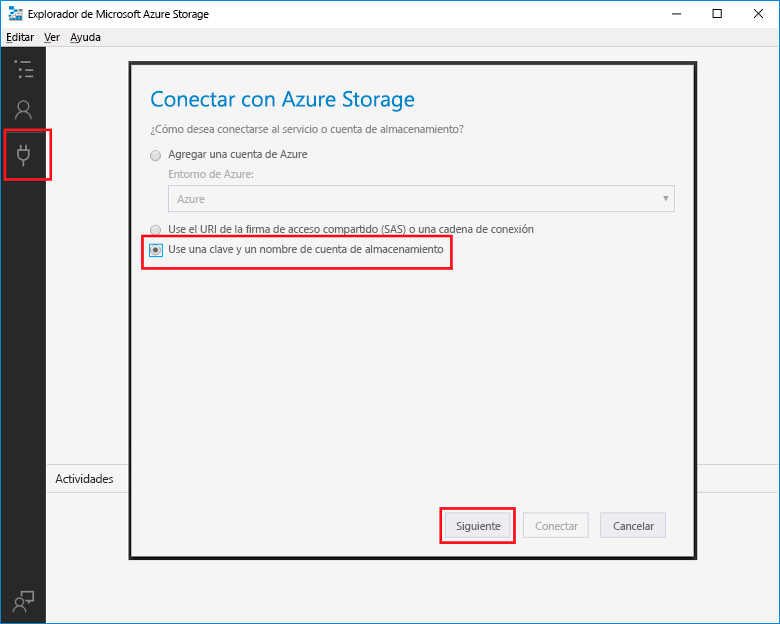

# <a name="add-messages-to-an-azure-storage-queue-using-functions"></a><span data-ttu-id="958a5-103">Agregar mensajes a una cola de Azure Storage con Functions</span><span class="sxs-lookup"><span data-stu-id="958a5-103">Add messages to an Azure Storage queue using Functions</span></span>

<span data-ttu-id="958a5-104">En Azure Functions, los enlaces de entrada y salida proporcionan una manera declarativa de conectarse a los datos de servicio externos desde su función.</span><span class="sxs-lookup"><span data-stu-id="958a5-104">In Azure Functions, input and output bindings provide a declarative way to connect to external service data from your function.</span></span> <span data-ttu-id="958a5-105">En este tema, obtendrá información sobre cómo actualizar una función existente agregando un enlace de salida que envía mensajes a Azure Queue Storage.</span><span class="sxs-lookup"><span data-stu-id="958a5-105">In this topic, learn how to update an existing function by adding an output binding that sends messages to Azure Queue storage.</span></span>  


## <a name="prerequisites"></a><span data-ttu-id="958a5-107">Requisitos previos</span><span class="sxs-lookup"><span data-stu-id="958a5-107">Prerequisites</span></span> 

[!INCLUDE [Previous topics](../../includes/functions-quickstart-previous-topics.md)]

* <span data-ttu-id="958a5-108">Instale el [Explorador de Microsoft Azure Storage](http://storageexplorer.com/).</span><span class="sxs-lookup"><span data-stu-id="958a5-108">Install the [Microsoft Azure Storage Explorer](http://storageexplorer.com/).</span></span>

## <span data-ttu-id="958a5-109"><a name="add-binding"></a>Agregar un enlace de salida</span><span class="sxs-lookup"><span data-stu-id="958a5-109"><a name="add-binding"></a>Add an output binding</span></span>
 
1. <span data-ttu-id="958a5-110">Expanda su Function App y su función.</span><span class="sxs-lookup"><span data-stu-id="958a5-110">Expand both your function app and your function.</span></span>

2. <span data-ttu-id="958a5-111">Seleccione sucesivamente **Integrar**, **+ Nueva salida**, **Azure Queue Storage** y **Seleccionar**.</span><span class="sxs-lookup"><span data-stu-id="958a5-111">Select **Integrate** and **+ New output**, then choose **Azure Queue storage** and choose **Select**.</span></span>
    
    

3. <span data-ttu-id="958a5-113">Use la configuración que se especifica en la tabla:</span><span class="sxs-lookup"><span data-stu-id="958a5-113">Use the settings as specified in the table:</span></span> 

    

    | <span data-ttu-id="958a5-115">Configuración</span><span class="sxs-lookup"><span data-stu-id="958a5-115">Setting</span></span>      |  <span data-ttu-id="958a5-116">Valor sugerido</span><span class="sxs-lookup"><span data-stu-id="958a5-116">Suggested value</span></span>   | <span data-ttu-id="958a5-117">Descripción</span><span class="sxs-lookup"><span data-stu-id="958a5-117">Description</span></span>                              |
    | ------------ |  ------- | -------------------------------------------------- |
    | <span data-ttu-id="958a5-118">**Nombre de la cola**</span><span class="sxs-lookup"><span data-stu-id="958a5-118">**Queue name**</span></span>   | <span data-ttu-id="958a5-119">myqueue-items</span><span class="sxs-lookup"><span data-stu-id="958a5-119">myqueue-items</span></span>    | <span data-ttu-id="958a5-120">El nombre de la cola a la que se va a conectar en la cuenta de almacenamiento.</span><span class="sxs-lookup"><span data-stu-id="958a5-120">The name of the queue to connect to in your Storage account.</span></span> |
    | <span data-ttu-id="958a5-121">**Conexión de la cuenta de almacenamiento**</span><span class="sxs-lookup"><span data-stu-id="958a5-121">**Storage account connection**</span></span> | <span data-ttu-id="958a5-122">AzureWebJobStorage</span><span class="sxs-lookup"><span data-stu-id="958a5-122">AzureWebJobStorage</span></span> | <span data-ttu-id="958a5-123">Puede usar la conexión de cuenta de almacenamiento que ya usa la Function App o crear una nueva.</span><span class="sxs-lookup"><span data-stu-id="958a5-123">You can use the storage account connection already being used by your function app, or create a new one.</span></span>  |
    | <span data-ttu-id="958a5-124">**Nombre del parámetro de mensaje**</span><span class="sxs-lookup"><span data-stu-id="958a5-124">**Message parameter name**</span></span> | <span data-ttu-id="958a5-125">outputQueueItem</span><span class="sxs-lookup"><span data-stu-id="958a5-125">outputQueueItem</span></span> | <span data-ttu-id="958a5-126">El nombre del parámetro del enlace de salida.</span><span class="sxs-lookup"><span data-stu-id="958a5-126">The name of the output binding parameter.</span></span> | 

4. <span data-ttu-id="958a5-127">Haga clic en **Guardar** para agregar el enlace.</span><span class="sxs-lookup"><span data-stu-id="958a5-127">Click **Save** to add the binding.</span></span>
 
<span data-ttu-id="958a5-128">Ahora que tiene definido un enlace de salida, necesita actualizar el código que va a usar el enlace para agregar mensajes a una cola.</span><span class="sxs-lookup"><span data-stu-id="958a5-128">Now that you have an output binding defined, you need to update the code to use the binding to add messages to a queue.</span></span>  

## <a name="update-the-function-code"></a><span data-ttu-id="958a5-129">Actualizar el código de la función</span><span class="sxs-lookup"><span data-stu-id="958a5-129">Update the function code</span></span>

1. <span data-ttu-id="958a5-130">Seleccione la función para mostrar su código en el editor.</span><span class="sxs-lookup"><span data-stu-id="958a5-130">Select your function to display the function code in the editor.</span></span> 

2. <span data-ttu-id="958a5-131">Para una función de C#, actualice la definición de función de la manera siguiente para agregar el parámetro de enlace de almacenamiento **outputQueueItem**.</span><span class="sxs-lookup"><span data-stu-id="958a5-131">For a C# function, update your function definition as follows to add the **outputQueueItem** storage binding parameter.</span></span> <span data-ttu-id="958a5-132">Omita este paso para una función de JavaScript.</span><span class="sxs-lookup"><span data-stu-id="958a5-132">Skip this step for a JavaScript function.</span></span>

    ```cs   
    public static async Task<HttpResponseMessage> Run(HttpRequestMessage req, 
        ICollector<string> outputQueueItem, TraceWriter log)
    {
        ....
    }
    ```

3. <span data-ttu-id="958a5-133">Agregue el siguiente código a la función justo antes de que se devuelva el método.</span><span class="sxs-lookup"><span data-stu-id="958a5-133">Add the following code to the function just before the method returns.</span></span> <span data-ttu-id="958a5-134">Use el fragmento de código adecuado para el lenguaje de su función.</span><span class="sxs-lookup"><span data-stu-id="958a5-134">Use the appropriate snippet for the language of your function.</span></span>

    ```javascript
    context.bindings.outputQueueItem = "Name passed to the function: " + 
                (req.query.name || req.body.name);
    ```

    ```cs
    outputQueueItem.Add("Name passed to the function: " + name);     
    ```

4. <span data-ttu-id="958a5-135">Seleccione **Guardar** para guardar los cambios.</span><span class="sxs-lookup"><span data-stu-id="958a5-135">Select **Save** to save changes.</span></span>

<span data-ttu-id="958a5-136">El valor que se ha pasado al desencadenador HTTP se incluye en un mensaje agregado a la cola.</span><span class="sxs-lookup"><span data-stu-id="958a5-136">The value passed to the HTTP trigger is included in a message added to the queue.</span></span>
 
## <a name="test-the-function"></a><span data-ttu-id="958a5-137">Prueba de la función</span><span class="sxs-lookup"><span data-stu-id="958a5-137">Test the function</span></span> 

1. <span data-ttu-id="958a5-138">Después de que se guarden los cambios del código, seleccione **Ejecutar**.</span><span class="sxs-lookup"><span data-stu-id="958a5-138">After the code changes are saved, select **Run**.</span></span> 

    

2. <span data-ttu-id="958a5-140">Compruebe los registros para asegurarse de que la función se ha realizado correctamente.</span><span class="sxs-lookup"><span data-stu-id="958a5-140">Check the logs to make sure that the function succeeded.</span></span> <span data-ttu-id="958a5-141">Se crea una nueva cola denominada **outqueue** en su cuenta de almacenamiento mediante el entorno de ejecución de las funciones cuando el enlace de salida se usa por primera vez.</span><span class="sxs-lookup"><span data-stu-id="958a5-141">A new queue named **outqueue** is created in your Storage account by the Functions runtime when the output binding is first used.</span></span>

<span data-ttu-id="958a5-142">Después, puede conectarse a su cuenta de almacenamiento para comprobar la cola nueva y el mensaje que ha agregado en esta.</span><span class="sxs-lookup"><span data-stu-id="958a5-142">Next, you can connect to your storage account to verify the new queue and the message you added to it.</span></span> 

## <a name="connect-to-the-queue"></a><span data-ttu-id="958a5-143">Conectarse a la cola</span><span class="sxs-lookup"><span data-stu-id="958a5-143">Connect to the queue</span></span>

<span data-ttu-id="958a5-144">Omita los tres primeros pasos si ya ha instalado el Explorador de almacenamiento y lo ha conectado a su cuenta de almacenamiento.</span><span class="sxs-lookup"><span data-stu-id="958a5-144">Skip the first three steps if you have already installed Storage Explorer and connected it to your storage account.</span></span>    

1. <span data-ttu-id="958a5-145">En su función, elija **Integrar** y en el nuevo enlace de salida de **Azure Queue Storage**. Después, expanda **Documentación**.</span><span class="sxs-lookup"><span data-stu-id="958a5-145">In your function, choose **Integrate** and the new **Azure Queue storage** output binding, then expand **Documentation**.</span></span> <span data-ttu-id="958a5-146">Copie el **Nombre de cuenta** y la **Clave de cuenta**.</span><span class="sxs-lookup"><span data-stu-id="958a5-146">Copy both **Account name** and **Account key**.</span></span> <span data-ttu-id="958a5-147">Use estas credenciales para conectarse a la cuenta de almacenamiento.</span><span class="sxs-lookup"><span data-stu-id="958a5-147">You use these credentials to connect to the storage account.</span></span>
 
    

2. <span data-ttu-id="958a5-149">Ejecute la herramienta [Explorador de Microsoft Azure Storage](http://storageexplorer.com/), seleccione el icono de conexión situado a la izquierda, elija **Use a storage account name and key** (Usar el nombre y la clave de una cuenta de almacenamiento) y seleccione **Siguiente**.</span><span class="sxs-lookup"><span data-stu-id="958a5-149">Run the [Microsoft Azure Storage Explorer](http://storageexplorer.com/) tool, select the connect icon on the left, choose **Use a storage account name and key**, and select **Next**.</span></span>

    
    
3. <span data-ttu-id="958a5-151">Pegue los valores de **Nombre de cuenta** y **Clave de cuenta** del paso 1 en sus campos correspondientes y seleccione **Siguiente** y **Conectar**.</span><span class="sxs-lookup"><span data-stu-id="958a5-151">Paste the **Account name** and **Account key** from step 1 into their corresponding fields, then select **Next**, and **Connect**.</span></span> 
  
    

4. <span data-ttu-id="958a5-153">Expanda la cuenta de almacenamiento adjunta, expanda **Colas** y compruebe que existe una cola denominada **myqueue-items**.</span><span class="sxs-lookup"><span data-stu-id="958a5-153">Expand the attached storage account, expand **Queues** and verify that a queue named **myqueue-items** exists.</span></span> <span data-ttu-id="958a5-154">También debe ver ya un mensaje en la cola.</span><span class="sxs-lookup"><span data-stu-id="958a5-154">You should also see a message already in the queue.</span></span>  
 
    
 

## <a name="clean-up-resources"></a><span data-ttu-id="958a5-156">Limpieza de recursos</span><span class="sxs-lookup"><span data-stu-id="958a5-156">Clean up resources</span></span>

[!INCLUDE [Next steps note](../../includes/functions-quickstart-cleanup.md)]

## <a name="next-steps"></a><span data-ttu-id="958a5-157">Pasos siguientes</span><span class="sxs-lookup"><span data-stu-id="958a5-157">Next steps</span></span>

<span data-ttu-id="958a5-158">Ha agregado un enlace de salida a una función existente.</span><span class="sxs-lookup"><span data-stu-id="958a5-158">You have added an output binding to an existing function.</span></span> 

[!INCLUDE [Next steps note](../../includes/functions-quickstart-next-steps.md)]

<span data-ttu-id="958a5-159">Para obtener más información sobre los enlaces a Queue Storage, vea [Enlaces de cola de Storage en Azure Functions](functions-bindings-storage-queue.md).</span><span class="sxs-lookup"><span data-stu-id="958a5-159">For more information about binding to Queue storage, see [Azure Functions Storage queue bindings](functions-bindings-storage-queue.md).</span></span> 


