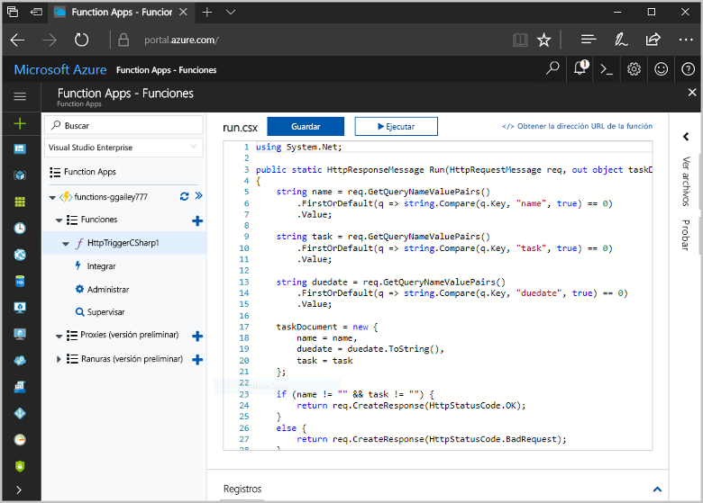
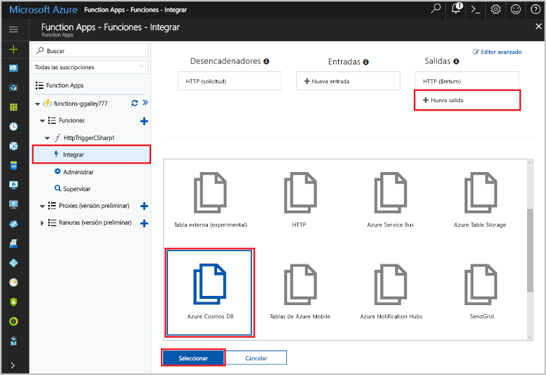
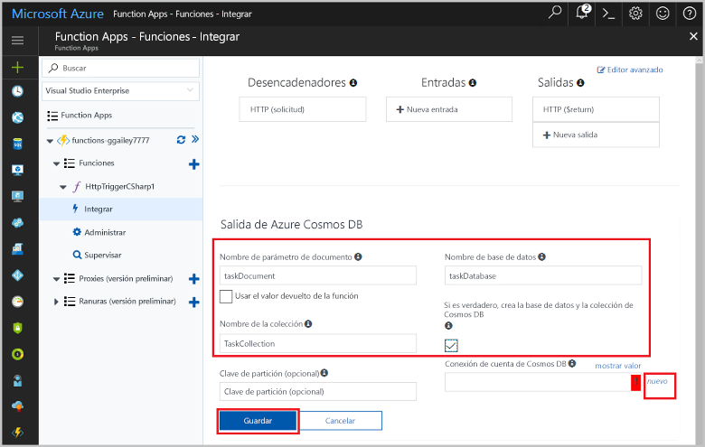
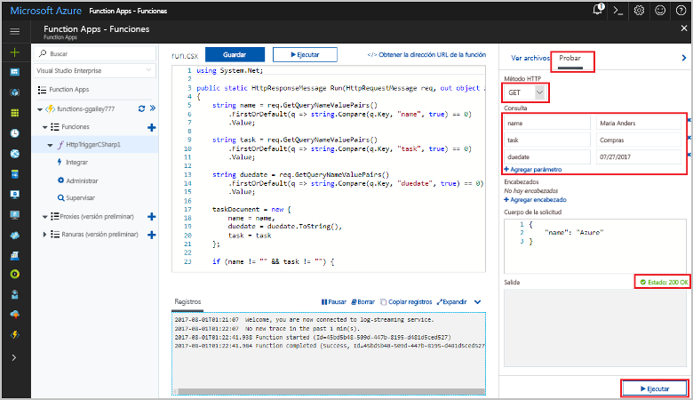
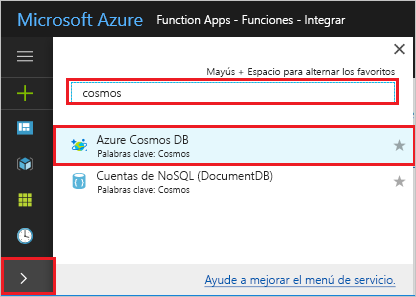
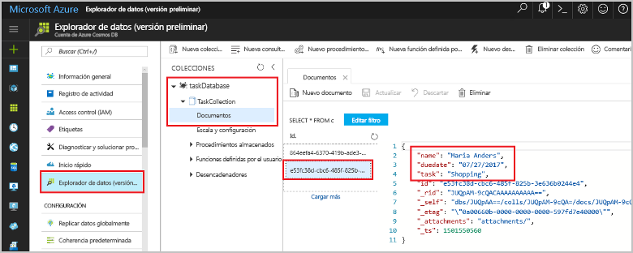

# <a name="store-unstructured-data-using-azure-functions-and-cosmos-db"></a><span data-ttu-id="1cd63-104">Almacenamiento de datos no estructurados mediante Azure Functions y Cosmos DB</span><span class="sxs-lookup"><span data-stu-id="1cd63-104">Store unstructured data using Azure Functions and Cosmos DB</span></span>

<span data-ttu-id="1cd63-105">[Base de datos de Azure Cosmos](https://azure.microsoft.com/services/cosmos-db/) es una excelente manera toostore no estructurado y datos JSON.</span><span class="sxs-lookup"><span data-stu-id="1cd63-105">[Azure Cosmos DB](https://azure.microsoft.com/services/cosmos-db/) is a great way toostore unstructured and JSON data.</span></span> <span data-ttu-id="1cd63-106">En combinación con Azure Functions, Cosmos DB facilita y agiliza el almacenamiento de datos con mucho menos código que el necesario para almacenar datos en una base de datos relacional.</span><span class="sxs-lookup"><span data-stu-id="1cd63-106">Combined with Azure Functions, Cosmos DB makes storing data quick and easy with much less code than required for storing data in a relational database.</span></span>

<span data-ttu-id="1cd63-107">En las funciones de Azure, los enlaces de entrada y salidos proporcionan una manera declarativa tooconnect tooexternal servicio de datos de la función.</span><span class="sxs-lookup"><span data-stu-id="1cd63-107">In Azure Functions, input and output bindings provide a declarative way tooconnect tooexternal service data from your function.</span></span> <span data-ttu-id="1cd63-108">En este tema, aprenderá cómo tooupdate una existente C# función tooadd un enlace de salida que almacena los datos no estructurados en un documento de la base de datos de Cosmos.</span><span class="sxs-lookup"><span data-stu-id="1cd63-108">In this topic, learn how tooupdate an existing C# function tooadd an output binding that stores unstructured data in a Cosmos DB document.</span></span> 



## <a name="prerequisites"></a><span data-ttu-id="1cd63-110">Requisitos previos</span><span class="sxs-lookup"><span data-stu-id="1cd63-110">Prerequisites</span></span>

<span data-ttu-id="1cd63-111">toocomplete este tutorial:</span><span class="sxs-lookup"><span data-stu-id="1cd63-111">toocomplete this tutorial:</span></span>

[!INCLUDE [Previous quickstart note](../../includes/functions-quickstart-previous-topics.md)]

## <a name="add-an-output-binding"></a><span data-ttu-id="1cd63-112">Adición de un enlace de salida</span><span class="sxs-lookup"><span data-stu-id="1cd63-112">Add an output binding</span></span>

1. <span data-ttu-id="1cd63-113">Expanda su Function App y su función.</span><span class="sxs-lookup"><span data-stu-id="1cd63-113">Expand both your function app and your function.</span></span>

1. <span data-ttu-id="1cd63-114">Seleccione **integrar** y **+ nueva salida**, que se encuentra en hello parte superior derecha de la página de Hola.</span><span class="sxs-lookup"><span data-stu-id="1cd63-114">Select **Integrate** and **+ New Output**, which is at hello top right of hello page.</span></span> <span data-ttu-id="1cd63-115">Elija **Azure Cosmos DB** y haga clic en **Seleccionar**.</span><span class="sxs-lookup"><span data-stu-id="1cd63-115">Choose **Azure Cosmos DB**, and click **Select**.</span></span>

    

3. <span data-ttu-id="1cd63-117">Hola de uso **salida de la base de datos de Azure Cosmos** configuración como se especifica en la tabla de hello:</span><span class="sxs-lookup"><span data-stu-id="1cd63-117">Use hello **Azure Cosmos DB output** settings as specified in hello table:</span></span> 

    

    | <span data-ttu-id="1cd63-119">Configuración</span><span class="sxs-lookup"><span data-stu-id="1cd63-119">Setting</span></span>      | <span data-ttu-id="1cd63-120">Valor sugerido</span><span class="sxs-lookup"><span data-stu-id="1cd63-120">Suggested value</span></span>  | <span data-ttu-id="1cd63-121">Descripción</span><span class="sxs-lookup"><span data-stu-id="1cd63-121">Description</span></span>                                |
    | ------------ | ---------------- | ------------------------------------------ |
    | <span data-ttu-id="1cd63-122">**Nombre del parámetro de documento**</span><span class="sxs-lookup"><span data-stu-id="1cd63-122">**Document parameter name**</span></span> | <span data-ttu-id="1cd63-123">taskDocument</span><span class="sxs-lookup"><span data-stu-id="1cd63-123">taskDocument</span></span> | <span data-ttu-id="1cd63-124">Nombre que hace referencia el objeto de base de datos de Cosmos toohello en el código.</span><span class="sxs-lookup"><span data-stu-id="1cd63-124">Name that refers toohello Cosmos DB object in code.</span></span> |
    | <span data-ttu-id="1cd63-125">**Nombre de la base de datos**</span><span class="sxs-lookup"><span data-stu-id="1cd63-125">**Database name**</span></span> | <span data-ttu-id="1cd63-126">taskDatabase</span><span class="sxs-lookup"><span data-stu-id="1cd63-126">taskDatabase</span></span> | <span data-ttu-id="1cd63-127">Nombre de base de datos toosave documentos.</span><span class="sxs-lookup"><span data-stu-id="1cd63-127">Name of database toosave documents.</span></span> |
    | <span data-ttu-id="1cd63-128">**Nombre de colección**</span><span class="sxs-lookup"><span data-stu-id="1cd63-128">**Collection name**</span></span> | <span data-ttu-id="1cd63-129">TaskCollection</span><span class="sxs-lookup"><span data-stu-id="1cd63-129">TaskCollection</span></span> | <span data-ttu-id="1cd63-130">Nombre de colección de bases de datos de Cosmos DB.</span><span class="sxs-lookup"><span data-stu-id="1cd63-130">Name of collection of Cosmos DB databases.</span></span> |
    | <span data-ttu-id="1cd63-131">**Si es true, crea la colección y base de datos de base de datos de Cosmos Hola**</span><span class="sxs-lookup"><span data-stu-id="1cd63-131">**If true, creates hello Cosmos DB database and collection**</span></span> | <span data-ttu-id="1cd63-132">Activado</span><span class="sxs-lookup"><span data-stu-id="1cd63-132">Checked</span></span> | <span data-ttu-id="1cd63-133">colección de Hello no ya existen, por lo que cree.</span><span class="sxs-lookup"><span data-stu-id="1cd63-133">hello collection doesn't already exist, so create it.</span></span> |

4. <span data-ttu-id="1cd63-134">Seleccione **New** toohello siguiente **conexión a BD de Cosmos documento** etiqueta y elija **+ crear nuevo**.</span><span class="sxs-lookup"><span data-stu-id="1cd63-134">Select **New** next toohello **Cosmos DB document connection** label, and select **+ Create new**.</span></span> 

5. <span data-ttu-id="1cd63-135">Hola de uso **nueva cuenta** configuración como se especifica en la tabla de hello:</span><span class="sxs-lookup"><span data-stu-id="1cd63-135">Use hello **New account** settings as specified in hello table:</span></span> 

    

    | <span data-ttu-id="1cd63-137">Configuración</span><span class="sxs-lookup"><span data-stu-id="1cd63-137">Setting</span></span>      | <span data-ttu-id="1cd63-138">Valor sugerido</span><span class="sxs-lookup"><span data-stu-id="1cd63-138">Suggested value</span></span>  | <span data-ttu-id="1cd63-139">Descripción</span><span class="sxs-lookup"><span data-stu-id="1cd63-139">Description</span></span>                                |
    | ------------ | ---------------- | ------------------------------------------ |
    | <span data-ttu-id="1cd63-140">**Id**</span><span class="sxs-lookup"><span data-stu-id="1cd63-140">**ID**</span></span> | <span data-ttu-id="1cd63-141">Nombre de base de datos</span><span class="sxs-lookup"><span data-stu-id="1cd63-141">Name of database</span></span> | <span data-ttu-id="1cd63-142">Identificador único para la base de datos de base de datos de Cosmos Hola</span><span class="sxs-lookup"><span data-stu-id="1cd63-142">Unique ID for hello Cosmos DB database</span></span>  |
    | <span data-ttu-id="1cd63-143">**API**</span><span class="sxs-lookup"><span data-stu-id="1cd63-143">**API**</span></span> | <span data-ttu-id="1cd63-144">SQL (DocumentDB)</span><span class="sxs-lookup"><span data-stu-id="1cd63-144">SQL (DocumentDB)</span></span> | <span data-ttu-id="1cd63-145">Seleccione la API de bases de datos del documento de Hola.</span><span class="sxs-lookup"><span data-stu-id="1cd63-145">Select hello document database API.</span></span>  |
    | <span data-ttu-id="1cd63-146">**Suscripción**</span><span class="sxs-lookup"><span data-stu-id="1cd63-146">**Subscription**</span></span> | <span data-ttu-id="1cd63-147">Suscripción de Azure</span><span class="sxs-lookup"><span data-stu-id="1cd63-147">Azure Subscription</span></span> | <span data-ttu-id="1cd63-148">Suscripción de Azure</span><span class="sxs-lookup"><span data-stu-id="1cd63-148">Azure Subscription</span></span>  |
    | <span data-ttu-id="1cd63-149">**Grupo de recursos**</span><span class="sxs-lookup"><span data-stu-id="1cd63-149">**Resource Group**</span></span> | <span data-ttu-id="1cd63-150">myResourceGroup</span><span class="sxs-lookup"><span data-stu-id="1cd63-150">myResourceGroup</span></span> |  <span data-ttu-id="1cd63-151">Utilice Hola grupo de recursos existente que contiene la aplicación de la función.</span><span class="sxs-lookup"><span data-stu-id="1cd63-151">Use hello existing resource group that contains your function app.</span></span> |
    | <span data-ttu-id="1cd63-152">**Ubicación**</span><span class="sxs-lookup"><span data-stu-id="1cd63-152">**Location**</span></span>  | <span data-ttu-id="1cd63-153">WestEurope</span><span class="sxs-lookup"><span data-stu-id="1cd63-153">WestEurope</span></span> | <span data-ttu-id="1cd63-154">Seleccione la aplicación de la función de un lugar próximo tooeither o tooother aplicaciones que usan Hola documentos almacenados.</span><span class="sxs-lookup"><span data-stu-id="1cd63-154">Select a location near tooeither your function app or tooother apps that use hello stored documents.</span></span>  |

6. <span data-ttu-id="1cd63-155">Haga clic en **Aceptar** base de datos de toocreate Hola.</span><span class="sxs-lookup"><span data-stu-id="1cd63-155">Click **OK** toocreate hello database.</span></span> <span data-ttu-id="1cd63-156">Puede tardar unos base de datos de Hola de toocreate minutos.</span><span class="sxs-lookup"><span data-stu-id="1cd63-156">It may take a few minutes toocreate hello database.</span></span> <span data-ttu-id="1cd63-157">Después de crea la base de datos de hello, cadena de conexión de base de datos de Hola se almacena como una configuración de aplicación de la función.</span><span class="sxs-lookup"><span data-stu-id="1cd63-157">After hello database is created, hello database connection string is stored as a function app setting.</span></span> <span data-ttu-id="1cd63-158">nombre de Hola de esta configuración de la aplicación se inserta en **conexión de la cuenta de base de datos de Cosmos**.</span><span class="sxs-lookup"><span data-stu-id="1cd63-158">hello name of this app setting is inserted in **Cosmos DB account connection**.</span></span> 
 
8. <span data-ttu-id="1cd63-159">Después de establece la cadena de conexión de hello, seleccione **guardar** enlace de hello toocreate.</span><span class="sxs-lookup"><span data-stu-id="1cd63-159">After hello connection string is set, select **Save** toocreate hello binding.</span></span>

## <a name="update-hello-function-code"></a><span data-ttu-id="1cd63-160">Actualizar código de función de Hola</span><span class="sxs-lookup"><span data-stu-id="1cd63-160">Update hello function code</span></span>

<span data-ttu-id="1cd63-161">Reemplace Hola existente C# código de la función con el siguiente código de hello:</span><span class="sxs-lookup"><span data-stu-id="1cd63-161">Replace hello existing C# function code with hello following code:</span></span>

```csharp
using System.Net;

public static HttpResponseMessage Run(HttpRequestMessage req, out object taskDocument, TraceWriter log)
{
    string name = req.GetQueryNameValuePairs()
        .FirstOrDefault(q => string.Compare(q.Key, "name", true) == 0)
        .Value;

    string task = req.GetQueryNameValuePairs()
        .FirstOrDefault(q => string.Compare(q.Key, "task", true) == 0)
        .Value;

    string duedate = req.GetQueryNameValuePairs()
        .FirstOrDefault(q => string.Compare(q.Key, "duedate", true) == 0)
        .Value;

    taskDocument = new {
        name = name,
        duedate = duedate.ToString(),
        task = task
    };

    if (name != "" && task != "") {
        return req.CreateResponse(HttpStatusCode.OK);
    }
    else {
        return req.CreateResponse(HttpStatusCode.BadRequest);
    }
}

```
<span data-ttu-id="1cd63-162">Este ejemplo de código lee las cadenas de consulta de hello solicitud HTTP y les asigna toofields Hola `taskDocument` objeto.</span><span class="sxs-lookup"><span data-stu-id="1cd63-162">This code sample reads hello HTTP Request query strings and assigns them toofields in hello `taskDocument` object.</span></span> <span data-ttu-id="1cd63-163">Hola `taskDocument` enlace envía datos de objeto de Hola desde este toobe de parámetro de enlace en base de datos de documento enlazado Hola.</span><span class="sxs-lookup"><span data-stu-id="1cd63-163">hello `taskDocument` binding sends hello object data from this binding parameter toobe stored in hello bound document database.</span></span> <span data-ttu-id="1cd63-164">Hola crear base de datos Hola primera vez que se ejecuta la función hello.</span><span class="sxs-lookup"><span data-stu-id="1cd63-164">hello database is created hello first time hello function runs.</span></span>

## <a name="test-hello-function-and-database"></a><span data-ttu-id="1cd63-165">Función de prueba hello y base de datos</span><span class="sxs-lookup"><span data-stu-id="1cd63-165">Test hello function and database</span></span>

1. <span data-ttu-id="1cd63-166">Expanda la ventana derecha de Hola y seleccione **prueba**.</span><span class="sxs-lookup"><span data-stu-id="1cd63-166">Expand hello right window and select **Test**.</span></span> <span data-ttu-id="1cd63-167">En **consulta**, haga clic en **+ Agregar parámetro** y agregue Hola después de la cadena de consulta de parámetros toohello:</span><span class="sxs-lookup"><span data-stu-id="1cd63-167">Under **Query**, click **+ Add parameter** and add hello following parameters toohello query string:</span></span>

    + `name`
    + `task`
    + `duedate`

2. <span data-ttu-id="1cd63-168">Haga clic en **Ejecutar** y compruebe que se devuelve un estado 200.</span><span class="sxs-lookup"><span data-stu-id="1cd63-168">Click **Run** and verify that a 200 status is returned.</span></span>

    

1. <span data-ttu-id="1cd63-170">En hello parte izquierda de hello portal de Azure, expanda la barra de iconos de hello, tipo `cosmos` Hola buscar el campo y, a continuación, seleccione **base de datos de Azure Cosmos**.</span><span class="sxs-lookup"><span data-stu-id="1cd63-170">On hello left side of hello Azure portal, expand hello icon bar, type `cosmos` in hello search field, and select **Azure Cosmos DB**.</span></span>

    

2. <span data-ttu-id="1cd63-172">A continuación, seleccione la base de datos de hello seleccione creado, **Explorador de datos**.</span><span class="sxs-lookup"><span data-stu-id="1cd63-172">Select hello database you created, then select **Data Explorer**.</span></span> <span data-ttu-id="1cd63-173">Expanda hello **colecciones** nodos, seleccione Nuevo documento de Hola y confirmar ese documento hello contiene los valores de cadena de consulta, junto con algunos metadatos adicionales.</span><span class="sxs-lookup"><span data-stu-id="1cd63-173">Expand hello **Collections** nodes, select hello new document, and confirm that hello document contains your query string values, along with some additional metadata.</span></span> 

    

<span data-ttu-id="1cd63-175">Ha agregado correctamente un desencadenador HTTP de tooyour de enlace que almacena los datos no estructurados en una base de datos de la base de datos de Cosmos.</span><span class="sxs-lookup"><span data-stu-id="1cd63-175">You have successfully added a binding tooyour HTTP trigger that stores unstructured data in a Cosmos DB database.</span></span>

[!INCLUDE [Clean-up section](../../includes/clean-up-section-portal.md)]

## <a name="next-steps"></a><span data-ttu-id="1cd63-176">Pasos siguientes</span><span class="sxs-lookup"><span data-stu-id="1cd63-176">Next steps</span></span>

[!INCLUDE [functions-quickstart-next-steps](../../includes/functions-quickstart-next-steps.md)]

<span data-ttu-id="1cd63-177">Para obtener más información acerca de la base de datos de enlace tooa Cosmos DB, vea [enlaces de base de datos de Azure funciones Cosmos](functions-bindings-documentdb.md).</span><span class="sxs-lookup"><span data-stu-id="1cd63-177">For more information about binding tooa Cosmos DB database, see [Azure Functions Cosmos DB bindings](functions-bindings-documentdb.md).</span></span>
