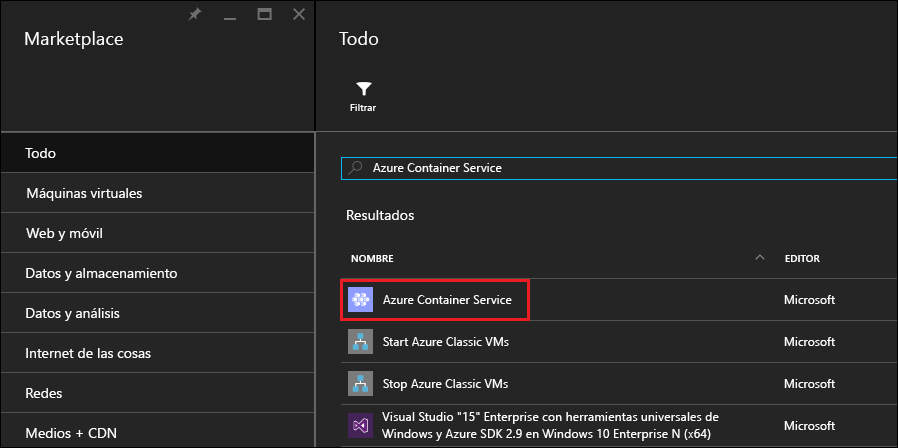
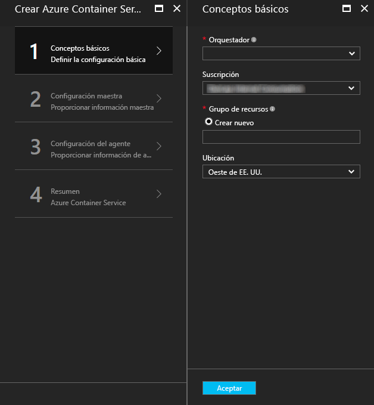
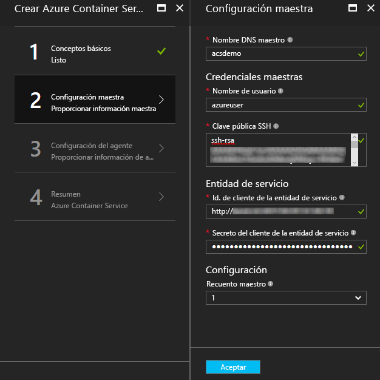
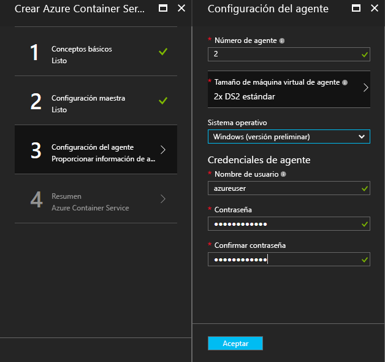
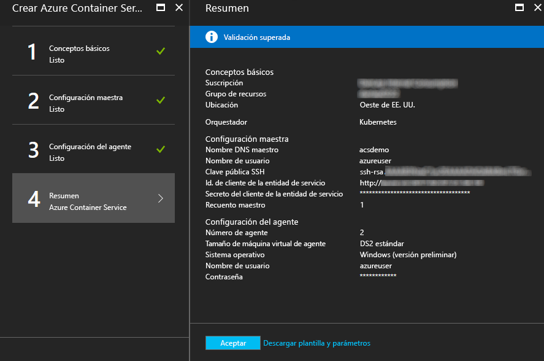
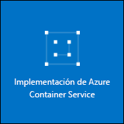

# <a name="deploy-a-docker-container-hosting-solution-using-hello-azure-portal"></a>Implementar un contenedor de Docker con hello Azure portal de solución de hospedaje


El servicio Contenedor de Azure proporciona una rápida implementación de agrupación en clústeres de contenedor de código abierto y soluciones de orquestación populares. Este documento le guía a través de la implementación de un clúster de servicio de contenedor de Azure mediante Hola portal de Azure o una plantilla de inicio rápido de Azure Resource Manager. 

También puede implementar un clúster de servicio de contenedor de Azure mediante el uso de hello [CLI de Azure 2.0](container-service-create-acs-cluster-cli.md) u Hola API de servicio de contenedor de Azure.

Para más información, consulte [Presentación de Azure Container Service](../container-service-intro.md).


## <a name="prerequisites"></a>Requisitos previos

* **Suscripción a Azure:** si no tiene una, suscríbase para una obtener una [evaluación gratuita](http://azure.microsoft.com/pricing/free-trial/?WT.mc_id=AA4C1C935). En un clúster más grande, considere la posibilidad de una suscripción de pago por uso u otras opciones de compra.

    > [!NOTE]
    > El uso de la suscripción de Azure y [cuotas de recursos](../../azure-subscription-service-limits.md), como las cuotas de núcleos, puede limitar tamaño de Hola de implementar el clúster de Hola. toorequest un aumento de la cuota, abra un [solicitud de soporte técnico al cliente en línea](../../azure-supportability/how-to-create-azure-support-request.md) sin cargo.
    >

* **Clave pública SSH RSA**: cuando se implementa a través del portal de Hola o de plantillas de inicio rápido de Azure de hello, necesita clave pública de tooprovide hello para la autenticación con máquinas virtuales de servicio de contenedor de Azure. claves RSA de Shell seguro (SSH) toocreate, vea hello [OS X y Linux](../../virtual-machines/linux/mac-create-ssh-keys.md) o [Windows](../../virtual-machines/linux/ssh-from-windows.md) instrucciones. 

* **Id. de entidad de seguridad de cliente y el secreto del servicio** (sólo Kubernetes): para más información e instrucciones toocreate una entidad de seguridad de servicio de Azure Active Directory, vea [acerca de la entidad de seguridad de servicio de Hola para un clúster de Kubernetes](../kubernetes/container-service-kubernetes-service-principal.md).


## <a name="create-a-cluster-by-using-hello-azure-portal"></a>Crear un clúster mediante el uso de hello portal de Azure
1. Seleccione inicio de sesión en el portal de Azure, toohello **New**y busque hello Azure Marketplace para **servicio de contenedor de Azure**.

      <br />

2. Haga clic en **Azure Container Service** y luego en **Crear**.

3. En hello **Fundamentos** hoja, escriba Hola siguiente información:

    * **Orchestrator**: seleccione uno de hello contenedor orchestrators toodeploy en clúster de Hola.
        * **DC/OS**: implementa un clúster de DC/OS.
        * **Swarm**: implementa un clúster de Docker Swarm.
        * **Kubernetes**: implementa un clúster de Kubernetes.
    * **Suscripción**: seleccione una suscripción de Azure.
    * **Grupo de recursos**: escriba Hola nombre de un nuevo grupo de recursos para la implementación de Hola.
    * **Ubicación**: seleccione una región de Azure para la implementación del servicio de contenedor de Azure de Hola. Para ver la disponibilidad, consulte [Productos disponibles por región](https://azure.microsoft.com/regions/services/).
    
      <br />
    
    Haga clic en **Aceptar** cuando esté listo tooproceed.

4. En hello **maestro configuración** hoja, escriba Hola después de la configuración de nodo maestro de Linux de Hola o nodos de clúster de hello (algunas opciones de configuración son específicos tooeach orchestrator):

    * **Nombre DNS del maestro**: hello toocreate de prefijo que se usa un único completo de nombre de dominio (FQDN) para el patrón de Hola. Hola FQDN maestro tiene el formato de hello *prefijo*Admin.*ubicación*. cloudapp.azure.com.
    * **Nombre de usuario**: nombre de usuario de Hola para una cuenta en cada una de las máquinas virtuales de Linux hello en clúster de Hola.
    * **Clave pública SSH RSA**: agregar hello toobe de clave pública utilizado para la autenticación frente a máquinas virtuales Linux Hola. Es importante que esta clave no contiene saltos de línea, e incluye hello `ssh-rsa` prefijo. Hola `username@domain` postfijo es opcional. Hello clave debería parecerse al siguiente hello: **ssh-rsa AAAAB3Nz... <> …... UcyupgH azureuser@linuxvm** . 
    * **Entidad de servicio**: si ha seleccionado orchestrator Kubernetes de hello, escriba un Azure Active Directory **Id. de cliente principal de servicio** (también denominada Hola appId) y **secreto de cliente principal de servicio** (contraseña). Para obtener más información, consulte [acerca de la entidad de seguridad de servicio de Hola para un clúster de Kubernetes](../kubernetes/container-service-kubernetes-service-principal.md).
    * **Maestro de recuento**: Hola de patrones en clúster de Hola.
    * **Diagnóstico de máquina virtual**: para algunos orchestrators, puede habilitar el diagnóstico de máquina virtual de las páginas maestras Hola.

      <br />

    Haga clic en **Aceptar** cuando esté listo tooproceed.

5. En hello **configuración del agente** hoja, escriba Hola siguiente información:

    * **Número de agentes**: para el conjunto de Docker y Kubernetes, este valor es el número inicial de Hola de agentes en el conjunto de escalas de agente de Hola. Para el controlador de dominio/OS, es Hola número inicial de agentes en un conjunto de escala privada. Además, se crea un conjunto de escalado público para DC/OS, que contiene un número predeterminado de agentes. número de agentes en este conjunto de escala pública Hello se determina una por número de Hola de patrones en clúster de hello: un agente público para un patrón y los dos agentes públicos para patrones de tres o cinco.
    * **Tamaño de la máquina virtual de agente**: Hola tamaño de máquinas virtuales de hello agente.
    * **Sistema operativo**: esta opción está actualmente disponible sólo si seleccionó orchestrator Kubernetes de Hola. Elija una distribución de Linux o un toorun de sistema operativo Windows Server en los agentes de Hola. Esta configuración determina si el clúster puede ejecutar aplicaciones de contenedor de Linux o Windows. 

        > [!NOTE]
        > La compatibilidad con el contenedor de Windows está en versión preliminar para los clústeres de Kubernetes. En clústeres de DC/OS y Swarm, actualmente solo se admiten agentes de Linux en Azure Container Service.

    * **Las credenciales del agente**: si ha seleccionado el sistema operativo de Windows hello, escriba administrador **nombre de usuario** y **contraseña** para agente de hello las máquinas virtuales. 

      <br />

    Haga clic en **Aceptar** cuando esté listo tooproceed.

6. Una vez finalizada la validación del servicio, haga clic en **Aceptar**.

      <br />

7. Revise los términos de Hola. proceso de implementación de hello toostart, haga clic en **crear**.

    Si ha elegido toopin Hola implementación toohello portal de Azure, puede ver el estado de implementación de Hola.

      <br />

implementación de Hello toma toocomplete de varios minutos. A continuación, clúster de servicio de contenedor de Azure Hola está listo para su uso.


## <a name="create-a-cluster-by-using-a-quickstart-template"></a>Creación de un clúster mediante una plantilla de inicio rápido
Plantillas de inicio rápido de Azure están disponible toodeploy un clúster en el servicio de contenedor de Azure. Hola proporciona plantillas de inicio rápido pueden ser modificado tooinclude adicionales o avanzados configuración de Azure. toocreate un clúster de servicio de contenedor de Azure mediante una plantilla de inicio rápido de Azure, se necesita una suscripción a Azure. Si no dispone de ninguna, suscríbase para obtener una [evaluación gratuita](http://azure.microsoft.com/pricing/free-trial/?WT.mc_id=AA4C1C935). 

Siga estos pasos toodeploy un clúster con una plantilla y Hola CLI de Azure 2.0 (vea [instrucciones de instalación y](/cli/azure/install-az-cli2)).

> [!NOTE] 
> Si está en un sistema de Windows, puede usar toodeploy de pasos similares una plantilla con Azure PowerShell. En esta misma sección encontrará los pasos necesarios para hacerlo. También puede implementar una plantilla a través de hello [portal](../../azure-resource-manager/resource-group-template-deploy-portal.md) u otros métodos.

1. toodeploy un clúster DC/OS, Docker Swarm o Kubernetes, seleccione uno de plantillas de hello quickstart disponibles desde GitHub. Se muestra una lista parcial. Hola DC/OS y plantillas de conjunto se Hola mismo, excepto la selección de orchestrator de hello predeterminada.

    * [Plantilla de DC/OS](https://github.com/Azure/azure-quickstart-templates/tree/master/101-acs-dcos)
    * [Plantilla Swarm](https://github.com/Azure/azure-quickstart-templates/tree/master/101-acs-swarm)
    * [Plantilla de Kubernetes](https://github.com/Azure/azure-quickstart-templates/tree/master/101-acs-kubernetes)

2. Inicie sesión en tooyour cuenta de Azure (`az login`) y asegúrese de que ese Hola CLI de Azure está conectado tooyour suscripción de Azure. Puede ver suscripción predeterminada de hello mediante Hola siguiente comando:

    ```azurecli
    az account show
    ```
    
    Si tiene más de un tooset de suscripción y la necesidad de una suscripción predeterminados diferentes, ejecute `az account set --subscription` y especifique un identificador de suscripción de Hola o nombre.

3. Como práctica recomendada, utilice un nuevo grupo de recursos para la implementación de Hola. toocreate un grupo de recursos, utilice hello `az group create` comando especifica un nombre de grupo de recursos y la ubicación: 

    ```azurecli
    az group create --name "RESOURCE_GROUP" --location "LOCATION"
    ```

4. Crear una JSON archivo contenedor Hola necesaria plantilla parámetros. Archivo de parámetros de hello descarga denominado `azuredeploy.parameters.json` que acompaña a la plantilla de servicio de contenedor de Azure de hello `azuredeploy.json` en GitHub. Especifique los valores de parámetro necesarios para el clúster. 

    Por ejemplo, toouse hello [plantilla DC/OS](https://github.com/Azure/azure-quickstart-templates/tree/master/101-acs-dcos), proporcionar valores de parámetro para `dnsNamePrefix` y `sshRSAPublicKey`. Ver una descripción de hello en `azuredeploy.json` y opciones para otros parámetros.  
 

5. Crear un clúster de servicio de contenedor al pasar el archivo de parámetros de implementación de hello con hello siguiente comando, donde:

    * **RESOURCE_GROUP** es nombre Hola Hola del grupo de recursos que creó en el paso anterior de Hola.
    * **DEPLOYMENT_NAME** (opcional) es un nombre que le asigne toohello implementación.
    * **TEMPLATE_URI** es Hola ubicación del archivo de implementación de hello `azuredeploy.json`. Este identificador URI debe ser el archivo sin formato hello, no toohello puntero GitHub UI. toofind este URI, seleccione hello `azuredeploy.json` en GitHub el archivo y haga clic en hello **Raw** botón.  

    ```azurecli
    az group deployment create -g RESOURCE_GROUP -n DEPLOYMENT_NAME --template-uri TEMPLATE_URI --parameters @azuredeploy.parameters.json
    ```

    También puede proporcionar parámetros como una cadena con formato JSON en línea de comandos de Hola. Utilice un siguiente toohello similar de comando:

    ```azurecli
    az group deployment create -g RESOURCE_GROUP -n DEPLOYMENT_NAME --template-uri TEMPLATE_URI --parameters "{ \"param1\": {\"value1\"} … }"
    ```

    > [!NOTE]
    > implementación de Hello toma toocomplete de varios minutos.
    > 

### <a name="equivalent-powershell-commands"></a>Comandos de PowerShell equivalentes
Las plantillas de clúster de Azure Container Service también se pueden implementar con PowerShell. Este documento se basa en la versión 1.0 de hello [módulo Azure PowerShell](https://azure.microsoft.com/blog/azps-1-0/).

1. toodeploy un clúster DC/OS, Docker Swarm o Kubernetes, seleccione uno de plantillas de hello quickstart disponibles desde GitHub. Se muestra una lista parcial. Tenga en cuenta que Hola DC/OS y plantillas de conjunto se Hola igual, con excepción de Hola de selección de orchestrator de hello predeterminada.

    * [Plantilla de DC/OS](https://github.com/Azure/azure-quickstart-templates/tree/master/101-acs-dcos)
    * [Plantilla Swarm](https://github.com/Azure/azure-quickstart-templates/tree/master/101-acs-swarm)
    * [Plantilla de Kubernetes](https://github.com/Azure/azure-quickstart-templates/tree/master/101-acs-kubernetes)

2. Antes de crear un clúster en su suscripción de Azure, compruebe que se ha suscrito a la sesión de PowerShell en tooAzure. Puede hacerlo con hello `Get-AzureRMSubscription` comando:

    ```powershell
    Get-AzureRmSubscription
    ```

3. Si necesita toosign en tooAzure, usar hello `Login-AzureRMAccount` comando:

    ```powershell
    Login-AzureRmAccount
    ```

4. Como práctica recomendada, utilice un nuevo grupo de recursos para la implementación de Hola. toocreate un grupo de recursos, utilice hello `New-AzureRmResourceGroup` comando y especifique una región de nombre y el destino de grupo de recursos:

    ```powershell
    New-AzureRmResourceGroup -Name GROUP_NAME -Location REGION
    ```

5. Después de crear un grupo de recursos, puede crear el clúster con el siguiente comando de Hola. URI de Hola Hola deseado se especificó una plantilla con hello `-TemplateUri` parámetro. Al ejecutar este comando, PowerShell solicita los valores de los parámetros de implementación.

    ```powershell
    New-AzureRmResourceGroupDeployment -Name DEPLOYMENT_NAME -ResourceGroupName RESOURCE_GROUP_NAME -TemplateUri TEMPLATE_URI
    ```

#### <a name="provide-template-parameters"></a>Suministro de los parámetros de plantilla
Si está familiarizado con PowerShell, sabrá que puede recorrer parámetros disponibles de Hola para un cmdlet, escriba un signo menos (-) y, a continuación, presionando la tecla TAB de Hola. Esta misma funcionalidad también sirve para los parámetros que se definen en la plantilla. En cuanto escriba el nombre de la plantilla de hello, Hola cmdlet captura plantilla hello, analiza los parámetros de Hola y agrega comandos de toohello de parámetros de plantilla de hello dinámicamente. Esto facilita valores de parámetro de plantilla toospecify fácil Hola. Y, si se olvida de un valor de parámetro necesario, PowerShell le pide el valor de Hola.

Aquí es el comando completo Hola con los parámetros incluidos. Proporcionar sus propios valores para los nombres de Hola de recursos de Hola.

```powershell
New-AzureRmResourceGroupDeployment -ResourceGroupName RESOURCE_GROUP_NAME-TemplateURI TEMPLATE_URI -adminuser value1 -adminpassword value2 ....
```

## <a name="next-steps"></a>Pasos siguientes
Ahora que tiene un clúster funcionando, consulte los siguientes documentos para obtener información detallada sobre conexión y administración:

* [Conectar el clúster del servicio de contenedor de Azure tooan](../container-service-connect.md)
* [Administración de contenedores con la API de REST](container-service-mesos-marathon-rest.md)
* [Administración de contenedores con Docker Swarm](container-service-docker-swarm.md)
* [Trabajo con Azure Container Service y Kubernetes](../kubernetes/container-service-kubernetes-walkthrough.md)
