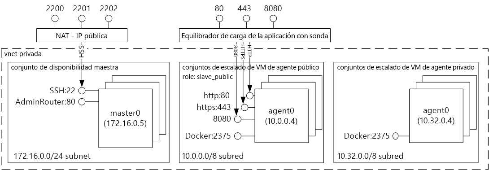
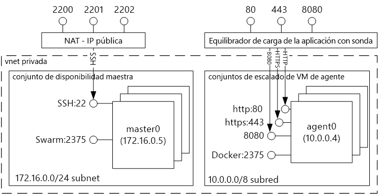
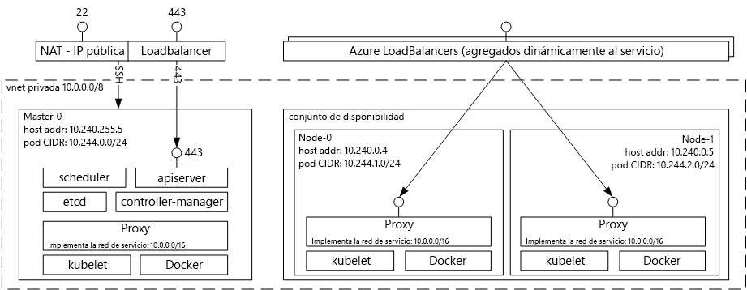

# Contenedor de tooDocker Introducción hospedar soluciones con el servicio de contenedor de Azure 
Servicio de contenedor de Azure resulta más sencillo para usted toocreate, configurar y administrar un clúster de máquinas virtuales que forman las aplicaciones preconfiguradas toorun en contenedores. Usa una configuración optimizada de herramientas de programación y orquestación de código abierto conocidas. Esto permite toouse sus conocimientos, o dibujar en un cuerpo elevado y creciente de conocimientos de la Comunidad, toodeploy y administrar aplicaciones basadas en el contenedor en Microsoft Azure.

Servicio de contenedor de Azure aprovecha hello Docker tooensure de formato de contenedor que los contenedores de la aplicación sean totalmente portables. También admite la posibilidad de maratón y DC/OS, Docker Swarm o Kubernetes para que pueda escalar estos toothousands aplicaciones de contenedores o incluso decenas de miles.

Mediante el servicio de contenedor de Azure, puede sacar partido de las características de nivel empresarial de Azure, manteniendo la portabilidad de aplicación, incluidos portabilidad en capas de orquestación de Hola.

## Uso del servicio Contenedor de Azure
Nuestro objetivo con el servicio de contenedor de Azure es tooprovide un entorno de hospedaje de contenedor mediante el uso de herramientas de código abierto y tecnologías que son populares entre los clientes hoy en día. toothis final, se exponen los puntos de conexión de la API estándar hello para el orchestrator elegido (controlador de dominio/OS, Docker Swarm o Kubernetes). Mediante el uso de estos puntos de conexión, puede aprovechar cualquier software que es capaz de hablar toothose extremos. Por ejemplo, en caso de hello de punto de conexión de Docker Swarm de hello, puede elegir la interfaz de línea de comandos de Docker (CLI) de toouse Hola. Para DC/OS, puede elegir hello DCOS CLI. Para Kubernetes, puede elegir `kubectl`.

## Creación de un clúster de Docker con el servicio Contenedor de Azure
toobegin con el servicio de contenedor de Azure, implementar un clúster de servicio de contenedor de Azure mediante el portal de hello (Hola búsqueda Marketplace para **servicio de contenedor de Azure**), mediante una plantilla de Azure Resource Manager ([Docker Swarm](https://github.com/Azure/azure-quickstart-templates/tree/master/101-acs-swarm), [DC/OS](https://github.com/Azure/azure-quickstart-templates/tree/master/101-acs-dcos), o [Kubernetes](https://github.com/Azure/azure-quickstart-templates/tree/master/101-acs-kubernetes)), o con hello [CLI de Azure 2.0](container-service-create-acs-cluster-cli.md). Hola proporciona plantillas de inicio rápido pueden ser modificado tooinclude adicionales o avanzados configuración de Azure. Para más información, consulte [Implementación de un clúster de Azure Container Service](container-service-deployment.md).

## Implementación de una aplicación
Azure Container Service permite elegir los orquestadores Docker Swarm, DC/OS o Kubernetes. El procedimiento para implementar la aplicación dependerá del orquestador que elija.

### Uso de DC/OS
Controlador de dominio/OS es un sistema operativo distribuido en función de kernel de sistemas distribuidos de hello Mesos Apache. Apache Mesos se aloja en hello Apache Software Foundation y se enumeran algunos de hello [nombres principales de TI](http://mesos.apache.org/documentation/latest/powered-by-mesos/) como usuarios y colaboradores.

DC/OS y Apache Mesos presentan una impresionante serie de características:

* Escalabilidad demostrada
* Patrón y esclavos replicados tolerantes a errores que usan Apache ZooKeeper
* Compatibilidad con los contenedores en formato Docker
* Aislamiento nativo entre las tareas con contenedores de Linux
* Programación de varios recursos (memoria, CPU, disco y puertos)
* API de Java, Python y C++ para desarrollar nuevas aplicaciones paralelas
* Una IU web para ver el estado del clúster

De forma predeterminada, DC/OS ejecutándose en el servicio de contenedor de Azure incluye plataforma de orquestación de maratón Hola para programar las cargas de trabajo. Sin embargo, Hola DC/implementación del sistema operativo de ACS incluye hello Mesosphere universo de servicios que se pueden agregar servicio tooyour. Servicios en hello universo incluyen Spark, Hadoop, Casandra y mucho más.

#### Uso de Marathon
Maratón es un sistema de control de servicios en cgroups--o, en caso de hello contenedor del servicio de Azure, con formato Docker contenedores y init de todo el clúster. Marathon proporciona una IU web desde la que puede implementar aplicaciones. Puede acceder a esta desde una dirección URL semejante a `http://DNS_PREFIX.REGION.cloudapp.azure.com`, donde DNS\_PREFIX y REGION se definen en el momento de la implementación. Por supuesto, también puede proporcionar su propio nombre DNS. Para obtener más información acerca de cómo ejecutar un contenedor mediante la interfaz de usuario de web de maratón hello, consulte [administración de contenedores de DC/OS a través de la interfaz de usuario de web de maratón hello](container-service-mesos-marathon-ui.md).

También puede utilizar las API de REST de Hola para comunicarse con maratón. Existen varias bibliotecas de cliente que están disponibles para cada herramienta. Abarcan una gran variedad de lenguajes--y, por supuesto, puede usar el protocolo HTTP de Hola en cualquier lenguaje. Muchas herramientas de DevOps conocidas también proporcionan compatibilidad con Marathon. Esto proporciona la máxima flexibilidad a su equipo de operaciones cuando trabaja con un clúster del servicio Contenedor de Azure. Para obtener más información acerca de cómo ejecutar un contenedor mediante el uso de API de REST de maratón hello, consulte [administración de contenedores de DC/OS a través de la API de REST de maratón hello](container-service-mesos-marathon-rest.md).

### Uso de Docker Swarm
Docker Swarm proporciona agrupación en clústeres nativa para Docker. Dado que sirve de Docker Swarm Hola API estándar de Docker, cualquier herramienta que ya se comunica con un demonio de Docker puede utilizar servidores de host de conjunto tootransparently escala toomultiple en servicio de contenedor de Azure.

[!INCLUDE [container-service-swarm-mode-note](../../../includes/container-service-swarm-mode-note.md)]

Herramientas compatibles para la administración de contenedores en un clúster de conjunto incluyen, pero no se limitan a, continuación de Hola:

* Dokku
* CLI de Docker y Docker Compose
* Krane
* Jenkins

### Uso de Kubernetes
Kubernetes es una conocida herramienta de orquestación de código abierto para su uso en producción. Kubernetes automatiza la implementación, el escalado y la administración de aplicaciones en contenedor. Dado que es una solución de código abierto y está controlada por la Comunidad de código abierto de hello, se ejecuta sin problemas en el servicio de contenedor de Azure y pueden ser contenedores toodeploy utilizados a escala en el servicio de contenedor de Azure.

Tiene un amplio conjunto de características que incluyen:
* Escalado horizontal
* Detección de servicio y equilibrio de carga
* Secretos y administración de configuración
* Lanzamientos y reversiones automatizados basados en API
* Recuperación automática

## Vídeos
Introducción a Azure Container Service:  

> [!VIDEO https://channel9.msdn.com/Shows/Azure-Friday/Azure-Container-Service-101/player]
>
>

Hola de creación de aplicaciones con servicio de contenedor de Azure (compilación 2016)

> [!VIDEO https://channel9.msdn.com/Events/Build/2016/B822/player]
>
>

## Pasos siguientes

Implementar un clúster de servicio de contenedor con hello [portal](container-service-deployment.md) o [CLI de Azure 2.0](container-service-create-acs-cluster-cli.md).
