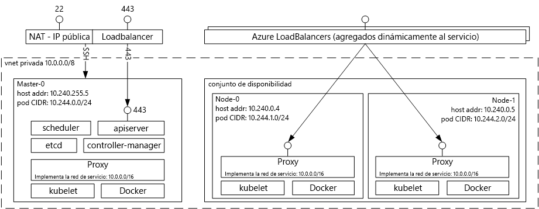

# Introducción tooAzure servicio de contenedor para KubernetesIntroduction tooAzure Container Service for Kubernetes
Servicio de contenedor de Azure para Kubernetes resulta sencillo toocreate, configurar y administrar un clúster de máquinas virtuales que forman las aplicaciones preconfiguradas toorun en contenedores.Azure Container Service for Kubernetes makes it simple toocreate, configure, and manage a cluster of virtual machines that are preconfigured toorun containerized applications. Esto permite toouse sus conocimientos, o dibujar en un cuerpo elevado y creciente de conocimientos de la Comunidad, toodeploy y administrar aplicaciones basadas en el contenedor en Microsoft Azure.This enables you toouse your existing skills, or draw upon a large and growing body of community expertise, toodeploy and manage container-based applications on Microsoft Azure.

Mediante el servicio de contenedor de Azure, puede aprovechar las ventajas del programa Hola a características de nivel empresarial de Azure, manteniendo la portabilidad de aplicación a través de Kubernetes y Hola formato de imagen de Docker.By using Azure Container Service, you can take advantage of hello enterprise-grade features of Azure, while still maintaining application portability through Kubernetes and hello Docker image format.

## Uso de Azure Container Service para KubernetesUsing Azure Container Service for Kubernetes
Nuestro objetivo con el servicio de contenedor de Azure es tooprovide un entorno de hospedaje de contenedor mediante el uso de herramientas de código abierto y tecnologías que son populares entre los clientes hoy en día.Our goal with Azure Container Service is tooprovide a container hosting environment by using open-source tools and technologies that are popular among our customers today. toothis final, se exponen los puntos de conexión de la API de Kubernetes estándar Hola.toothis end, we expose hello standard Kubernetes API endpoints. Mediante el uso de estos puntos de conexión estándar, puede aprovechar cualquier software que es capaz de comunicarse tooa Kubernetes clúster.By using these standard endpoints, you can leverage any software that is capable of talking tooa Kubernetes cluster. Por ejemplo, puede elegir [kubectl](https://kubernetes.io/docs/user-guide/kubectl-overview/), [helm](https://helm.sh/) o [draft](https://github.com/Azure/draft).For example, you might choose [kubectl](https://kubernetes.io/docs/user-guide/kubectl-overview/), [helm](https://helm.sh/), or [draft](https://github.com/Azure/draft).

## Creación de un clúster de Docker mediante Azure Container ServiceCreating a Kubernetes cluster using Azure Container Service
toobegin con el servicio de contenedor de Azure, implementar un clúster de servicio de contenedor de Azure con hello [CLI de Azure 2.0](container-service-kubernetes-walkthrough.md) o a través del portal de hello (Hola búsqueda Marketplace para **servicio de contenedor de Azure**).toobegin using Azure Container Service, deploy an Azure Container Service cluster with hello [Azure CLI 2.0](container-service-kubernetes-walkthrough.md) or via hello portal (search hello Marketplace for **Azure Container Service**). Si es un usuario avanzado que necesita más control sobre las plantillas de Azure Resource Manager de hello, puede usar código abierto de hello [motor acs](https://github.com/Azure/acs-engine) proyecto toobuild sus propio Kubernetes personalizados de clúster e implementarla a través de Hola `az` CLI.If you are an advanced user who needs more control over hello Azure Resource Manager templates, you can use hello open source [acs-engine](https://github.com/Azure/acs-engine) project toobuild your own custom Kubernetes cluster and deploy it via hello `az` CLI.

### Uso de KubernetesUsing Kubernetes
Kubernetes automatiza la implementación, el escalado y la administración de aplicaciones en contenedor.Kubernetes automates deployment, scaling, and management of containerized applications. Tiene un amplio conjunto de características que incluyen:It has a rich set of features including:
* Empaquetamiento automático en contenedoresAutomatic binpacking
* Recuperación automáticaSelf-healing
* Escalado horizontalHorizontal scaling
* Detección de servicio y equilibrio de cargaService discovery and load balancing
* Lanzamientos y reversiones automatizadosAutomated rollouts and rollbacks
* Administración de configuración y secretosSecret and configuration management
* Orquestación de almacenamientoStorage orchestration
* Ejecución por lotesBatch execution

Diagrama de la arquitectura de Kubernetes implementado a través de Azure Container Service:Architectural diagram of Kubernetes deployed via Azure Container Service:

## VídeosVideos

Compatibilidad con Kubernetes de Azure Container Services (Azure, viernes, enero de 2017):Kubernetes Support in Azure Container Services (Azure Friday, January 2017):

> [!VIDEO https://channel9.msdn.com/Shows/Azure-Friday/Kubernetes-Support-in-Azure-Container-Services/player]
>
>

Herramientas para desarrollar e implementar aplicaciones en Kubernetes (Azure OpenDev, junio de 2017):Tools for Developing and Deploying Applications on Kubernetes (Azure OpenDev, June 2017):

> [!VIDEO https://channel9.msdn.com/Events/AzureOpenDev/June2017/Tools-for-Developing-and-Deploying-Applications-on-Kubernetes/player]
>
>

## Pasos siguientesNext steps

Explorar hello [Kubernetes Quickstart](container-service-kubernetes-walkthrough.md) toobegin explorar el servicio de contenedor de Azure hoy en día.Explore hello [Kubernetes Quickstart](container-service-kubernetes-walkthrough.md) toobegin exploring Azure Container Service today.
