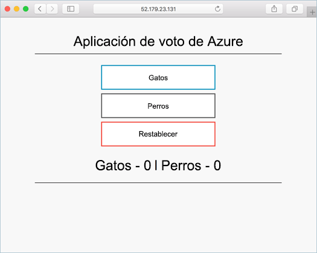

# <a name="run-applications-in-kubernetes"></a><span data-ttu-id="404b8-104">Ejecución de aplicaciones en Kubernetes</span><span class="sxs-lookup"><span data-stu-id="404b8-104">Run applications in Kubernetes</span></span>

<span data-ttu-id="404b8-105">En este tutorial, la cuarta parte de siete, se implementa una aplicación de ejemplo en un clúster de Kubernetes.</span><span class="sxs-lookup"><span data-stu-id="404b8-105">In this tutorial, part four of seven, a sample application is deployed into a Kubernetes cluster.</span></span> <span data-ttu-id="404b8-106">Los pasos completados incluyen:</span><span class="sxs-lookup"><span data-stu-id="404b8-106">Steps completed include:</span></span>

> [!div class="checklist"]
> * <span data-ttu-id="404b8-107">Descargar archivos de manifiesto de Kubernetes</span><span class="sxs-lookup"><span data-stu-id="404b8-107">Download Kubernetes manifest files</span></span>
> * <span data-ttu-id="404b8-108">Ejecución de una aplicación en Kubernetes</span><span class="sxs-lookup"><span data-stu-id="404b8-108">Run application in Kubernetes</span></span>
> * <span data-ttu-id="404b8-109">Probar la aplicación hello</span><span class="sxs-lookup"><span data-stu-id="404b8-109">Test hello application</span></span>

<span data-ttu-id="404b8-110">En los tutoriales posteriores, esta aplicación es escalar horizontalmente, actualizado, y Operations Management Suite configurado el clúster de toomonitor hello Kubernetes.</span><span class="sxs-lookup"><span data-stu-id="404b8-110">In subsequent tutorials, this application is scaled out, updated, and Operations Management Suite configured toomonitor hello Kubernetes cluster.</span></span>

<span data-ttu-id="404b8-111">Este tutorial supone un conocimiento básico de conceptos de Kubernetes, para obtener información detallada en Kubernetes vea hello [Kubernetes documentación](https://kubernetes.io/docs/home/).</span><span class="sxs-lookup"><span data-stu-id="404b8-111">This tutorial assumes a basic understanding of Kubernetes concepts, for detailed information on Kubernetes see hello [Kubernetes documentation](https://kubernetes.io/docs/home/).</span></span>

## <a name="before-you-begin"></a><span data-ttu-id="404b8-112">Antes de empezar</span><span class="sxs-lookup"><span data-stu-id="404b8-112">Before you begin</span></span>

<span data-ttu-id="404b8-113">En tutoriales anteriores, una aplicación se empaqueta en una imagen de contenedor, esta imagen es tooAzure cargado del registro de contenedor y se ha creado un clúster de Kubernetes.</span><span class="sxs-lookup"><span data-stu-id="404b8-113">In previous tutorials, an application was packaged into a container image, this image was uploaded tooAzure Container Registry, and a Kubernetes cluster was created.</span></span> <span data-ttu-id="404b8-114">Si aún no ha hecho estos pasos y desearía toofollow a lo largo, devolver demasiado[Tutorial 1: crear imágenes del contenedor](./container-service-tutorial-kubernetes-prepare-app.md).</span><span class="sxs-lookup"><span data-stu-id="404b8-114">If you have not done these steps, and would like toofollow along, return too[Tutorial 1 – Create container images](./container-service-tutorial-kubernetes-prepare-app.md).</span></span> 

<span data-ttu-id="404b8-115">Como mínimo, este tutorial requiere un clúster de Kubernetes.</span><span class="sxs-lookup"><span data-stu-id="404b8-115">At minimum, this tutorial requires a Kubernetes cluster.</span></span>

## <a name="get-manifest-file"></a><span data-ttu-id="404b8-116">Obtención del archivo de manifiesto</span><span class="sxs-lookup"><span data-stu-id="404b8-116">Get manifest file</span></span>

<span data-ttu-id="404b8-117">En este tutorial, los [objetos de Kubernetes](https://kubernetes.io/docs/concepts/overview/working-with-objects/kubernetes-objects/) se implementan mediante un manifiesto de Kubernetes.</span><span class="sxs-lookup"><span data-stu-id="404b8-117">For this tutorial, [Kubernetes objects](https://kubernetes.io/docs/concepts/overview/working-with-objects/kubernetes-objects/) are deployed using a Kubernetes manifest.</span></span> <span data-ttu-id="404b8-118">Un manifiesto de Kubernetes es un archivo con formato de YAML o JSON que contiene instrucciones de implementación y configuración del objeto de Kubernetes.</span><span class="sxs-lookup"><span data-stu-id="404b8-118">A Kubernetes manifest is a YAML or JSON formatted file containing Kubernetes object deployment and configuration instructions.</span></span>

<span data-ttu-id="404b8-119">archivo de manifiesto de aplicación Hola para este tutorial está disponible en el repositorio de aplicación de Azure voto hello, que se clonó en un tutorial anterior.</span><span class="sxs-lookup"><span data-stu-id="404b8-119">hello application manifest file for this tutorial is available in hello Azure Vote application repo, which was cloned in a previous tutorial.</span></span> <span data-ttu-id="404b8-120">Si no lo ha hecho ya, clonar el repositorio de hello con hello siguiente comando:</span><span class="sxs-lookup"><span data-stu-id="404b8-120">If you have not already done so, clone hello repo with hello following command:</span></span> 

```bash
git clone https://github.com/Azure-Samples/azure-voting-app-redis.git
```

<span data-ttu-id="404b8-121">archivo de manifiesto de Hola se encuentra en hello siguiendo el directorio del repositorio de hello clonado.</span><span class="sxs-lookup"><span data-stu-id="404b8-121">hello manifest file is found in hello following directory of hello cloned repo.</span></span>

```bash
/azure-voting-app-redis/kubernetes-manifests/azure-vote-all-in-one-redis.yml
```

## <a name="update-manifest-file"></a><span data-ttu-id="404b8-122">Actualización del archivo de manifiesto</span><span class="sxs-lookup"><span data-stu-id="404b8-122">Update manifest file</span></span>

<span data-ttu-id="404b8-123">Si utiliza imágenes del contenedor del registro de contenedor de Azure toostore hello, Hola toobe necesidades manifiesto actualizado con el nombre de hello ACR loginServer.</span><span class="sxs-lookup"><span data-stu-id="404b8-123">If using Azure Container Registry toostore hello container images, hello manifest needs toobe updated with hello ACR loginServer name.</span></span>

<span data-ttu-id="404b8-124">Obtener el nombre del servidor de inicio de sesión de hello ACR con hello [lista de acr az](/cli/azure/acr#list) comando.</span><span class="sxs-lookup"><span data-stu-id="404b8-124">Get hello ACR login server name with hello [az acr list](/cli/azure/acr#list) command.</span></span>

```azurecli-interactive
az acr list --resource-group myResourceGroup --query "[].{acrLoginServer:loginServer}" --output table
```

<span data-ttu-id="404b8-125">Hello manifiesto de ejemplo se ha creado previamente con el nombre de repositorio de *microsoft*.</span><span class="sxs-lookup"><span data-stu-id="404b8-125">hello sample manifest has been pre-created with a repository name of *microsoft*.</span></span> <span data-ttu-id="404b8-126">Abra el archivo hello con cualquier editor de texto y reemplace hello *microsoft* valor con nombre del servidor de inicio de sesión de saludo de la instancia ACR.</span><span class="sxs-lookup"><span data-stu-id="404b8-126">Open hello file with any text editor, and replace hello *microsoft* value with hello login server name of your ACR instance.</span></span>

```yaml
containers:
- name: azure-vote-front
  image: microsoft/azure-vote-front:redis-v1
```

## <a name="deploy-application"></a><span data-ttu-id="404b8-127">Implementación de la aplicación</span><span class="sxs-lookup"><span data-stu-id="404b8-127">Deploy application</span></span>

<span data-ttu-id="404b8-128">Hola de uso [kubectl crear](https://kubernetes.io/docs/user-guide/kubectl/v1.6/#create) aplicación hello de toorun de comandos.</span><span class="sxs-lookup"><span data-stu-id="404b8-128">Use hello [kubectl create](https://kubernetes.io/docs/user-guide/kubectl/v1.6/#create) command toorun hello application.</span></span> <span data-ttu-id="404b8-129">Este comando analiza hello archivo de manifiesto y crear objetos de Kubernetes de hello definido.</span><span class="sxs-lookup"><span data-stu-id="404b8-129">This command parses hello manifest file and create hello defined Kubernetes objects.</span></span>

```azurecli-interactive
kubectl create -f ./azure-voting-app-redis/kubernetes-manifests/azure-vote-all-in-one-redis.yml
```

<span data-ttu-id="404b8-130">Salida:</span><span class="sxs-lookup"><span data-stu-id="404b8-130">Output:</span></span>

```bash
deployment "azure-vote-back" created
service "azure-vote-back" created
deployment "azure-vote-front" created
service "azure-vote-front" created
```

## <a name="test-application"></a><span data-ttu-id="404b8-131">Prueba de la aplicación</span><span class="sxs-lookup"><span data-stu-id="404b8-131">Test application</span></span>

<span data-ttu-id="404b8-132">A [Kubernetes servicio](https://kubernetes.io/docs/concepts/services-networking/service/) se crea que expone Hola aplicación toohello internet.</span><span class="sxs-lookup"><span data-stu-id="404b8-132">A [Kubernetes service](https://kubernetes.io/docs/concepts/services-networking/service/) is created which exposes hello application toohello internet.</span></span> <span data-ttu-id="404b8-133">Este proceso puede tardar unos minutos.</span><span class="sxs-lookup"><span data-stu-id="404b8-133">This process can take a few minutes.</span></span> 

<span data-ttu-id="404b8-134">curso toomonitor, use hello [kubectl obtener servicio](https://review.docs.microsoft.com/en-us/azure/container-service/container-service-kubernetes-walkthrough?branch=pr-en-us-17681) comando con hello `--watch` argumento.</span><span class="sxs-lookup"><span data-stu-id="404b8-134">toomonitor progress, use hello [kubectl get service](https://review.docs.microsoft.com/en-us/azure/container-service/container-service-kubernetes-walkthrough?branch=pr-en-us-17681) command with hello `--watch` argument.</span></span>

```azurecli-interactive
kubectl get service azure-vote-front --watch
```

<span data-ttu-id="404b8-135">Inicialmente, Hola **IP externas** para hello *azure front-voto* servicio aparece como *pendiente*.</span><span class="sxs-lookup"><span data-stu-id="404b8-135">Initially, hello **EXTERNAL-IP** for hello *azure-vote-front* service appears as *pending*.</span></span> <span data-ttu-id="404b8-136">Una vez que la dirección de hello externo IP ha cambiado desde *pendiente* tooan *dirección IP*, use `CTRL-C` proceso de inspección de toostop hello kubectl.</span><span class="sxs-lookup"><span data-stu-id="404b8-136">Once hello EXTERNAL-IP address has changed from *pending* tooan *IP address*, use `CTRL-C` toostop hello kubectl watch process.</span></span>

```bash
NAME               CLUSTER-IP    EXTERNAL-IP   PORT(S)        AGE
azure-vote-front   10.0.42.158   <pending>     80:31873/TCP   1m
azure-vote-front   10.0.42.158   52.179.23.131 80:31873/TCP   2m
```

<span data-ttu-id="404b8-137">aplicación de hello toosee, dirección IP externa de examinar toohello.</span><span class="sxs-lookup"><span data-stu-id="404b8-137">toosee hello application, browse toohello external IP address.</span></span>



## <a name="next-steps"></a><span data-ttu-id="404b8-139">Pasos siguientes</span><span class="sxs-lookup"><span data-stu-id="404b8-139">Next steps</span></span>

<span data-ttu-id="404b8-140">En este tutorial, Hola aplicación de Azure voto era implementado tooan Kubernetes de servicio de contenedor de Azure clúster.</span><span class="sxs-lookup"><span data-stu-id="404b8-140">In this tutorial, hello Azure vote application was deployed tooan Azure Container Service Kubernetes cluster.</span></span> <span data-ttu-id="404b8-141">Las tareas completadas incluyen:</span><span class="sxs-lookup"><span data-stu-id="404b8-141">Tasks completed include:</span></span>  

> [!div class="checklist"]
> * <span data-ttu-id="404b8-142">Descargar archivos de manifiesto de Kubernetes</span><span class="sxs-lookup"><span data-stu-id="404b8-142">Download Kubernetes manifest files</span></span>
> * <span data-ttu-id="404b8-143">Ejecutar la aplicación hello en Kubernetes</span><span class="sxs-lookup"><span data-stu-id="404b8-143">Run hello application in Kubernetes</span></span>
> * <span data-ttu-id="404b8-144">Aplicación hello probados</span><span class="sxs-lookup"><span data-stu-id="404b8-144">Tested hello application</span></span>

<span data-ttu-id="404b8-145">Avanzar toohello toolearn de tutorial siguiente acerca de cómo escalar una aplicación de Kubernetes y el Hola Kubernetes infraestructura subyacente.</span><span class="sxs-lookup"><span data-stu-id="404b8-145">Advance toohello next tutorial toolearn about scaling both a Kubernetes application and hello underlying Kubernetes infrastructure.</span></span> 

> [!div class="nextstepaction"]
> [<span data-ttu-id="404b8-146">Escalar infraestructura y aplicación de Kubernetes</span><span class="sxs-lookup"><span data-stu-id="404b8-146">Scale Kubernetes application and infrastructure</span></span>](./container-service-tutorial-kubernetes-scale.md)