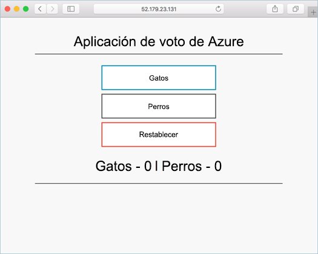

# <a name="create-container-images-toobe-used-with-azure-container-service"></a><span data-ttu-id="06bca-104">Crear contenedor imágenes toobe utilizado con el servicio de contenedor de Azure</span><span class="sxs-lookup"><span data-stu-id="06bca-104">Create container images toobe used with Azure Container Service</span></span>

<span data-ttu-id="06bca-105">En este tutorial, la primera parte de siete, se prepara una aplicación con varios contenedores para usarla en Kubernetes.</span><span class="sxs-lookup"><span data-stu-id="06bca-105">In this tutorial, part one of seven, a multi-container application is prepared for use in Kubernetes.</span></span> <span data-ttu-id="06bca-106">Los pasos completados incluyen:</span><span class="sxs-lookup"><span data-stu-id="06bca-106">Steps completed include:</span></span>  

> [!div class="checklist"]
> * <span data-ttu-id="06bca-107">La clonación de origen de la aplicación desde GitHub</span><span class="sxs-lookup"><span data-stu-id="06bca-107">Cloning application source from GitHub</span></span>  
> * <span data-ttu-id="06bca-108">Crear una imagen de contenedor de origen de la aplicación hello</span><span class="sxs-lookup"><span data-stu-id="06bca-108">Creating a container image from hello application source</span></span>
> * <span data-ttu-id="06bca-109">Probar la aplicación hello en un entorno local de Docker</span><span class="sxs-lookup"><span data-stu-id="06bca-109">Testing hello application in a local Docker environment</span></span>

<span data-ttu-id="06bca-110">Una vez completada, es accesible en el entorno de desarrollo local Hola tras la aplicación.</span><span class="sxs-lookup"><span data-stu-id="06bca-110">Once completed, hello following application is accessible in your local development environment.</span></span>



<span data-ttu-id="06bca-112">En los tutoriales posteriores, imagen de contenedor de hello es tooan cargado del registro de contenedor de Azure y, a continuación, ejecutarse en un Azure hospeda Kubernetes clúster.</span><span class="sxs-lookup"><span data-stu-id="06bca-112">In subsequent tutorials, hello container image is uploaded tooan Azure Container Registry, and then run in an Azure hosted Kubernetes cluster.</span></span>

## <a name="before-you-begin"></a><span data-ttu-id="06bca-113">Antes de empezar</span><span class="sxs-lookup"><span data-stu-id="06bca-113">Before you begin</span></span>

<span data-ttu-id="06bca-114">En este tutorial se supone que el usuario tiene un conocimiento básico de los principales conceptos de Docker, como los contenedores, las imágenes de contenedor y los comandos básicos de Docker.</span><span class="sxs-lookup"><span data-stu-id="06bca-114">This tutorial assumes a basic understanding of core Docker concepts such as containers, container images, and basic docker commands.</span></span> <span data-ttu-id="06bca-115">Si es necesario, consulte la [introducción a Docker]( https://docs.docker.com/get-started/), donde encontrará datos básicos acerca de los contenedores.</span><span class="sxs-lookup"><span data-stu-id="06bca-115">If needed, see [Get started with Docker]( https://docs.docker.com/get-started/) for a primer on container basics.</span></span> 

<span data-ttu-id="06bca-116">toocomplete este tutorial, necesitará un entorno de desarrollo de Docker.</span><span class="sxs-lookup"><span data-stu-id="06bca-116">toocomplete this tutorial, you need a Docker development environment.</span></span> <span data-ttu-id="06bca-117">Docker proporciona paquetes que permiten configurar Docker fácilmente en cualquier sistema [Mac](https://docs.docker.com/docker-for-mac/), [Windows](https://docs.docker.com/docker-for-windows/) o [Linux](https://docs.docker.com/engine/installation/#supported-platforms).</span><span class="sxs-lookup"><span data-stu-id="06bca-117">Docker provides packages that easily configure Docker on any [Mac](https://docs.docker.com/docker-for-mac/), [Windows](https://docs.docker.com/docker-for-windows/), or [Linux](https://docs.docker.com/engine/installation/#supported-platforms) system.</span></span>

## <a name="get-application-code"></a><span data-ttu-id="06bca-118">Obtención del código de la aplicación</span><span class="sxs-lookup"><span data-stu-id="06bca-118">Get application code</span></span>

<span data-ttu-id="06bca-119">aplicación de ejemplo de Hola usado en este tutorial es una aplicación básica de votación.</span><span class="sxs-lookup"><span data-stu-id="06bca-119">hello sample application used in this tutorial is a basic voting app.</span></span> <span data-ttu-id="06bca-120">aplicación Hello consta de un componente de front-end web y una instancia de Redis back-end.</span><span class="sxs-lookup"><span data-stu-id="06bca-120">hello application consists of a front-end web component and a back-end Redis instance.</span></span> <span data-ttu-id="06bca-121">componente de Hello web se empaqueta en una imagen de contenedor personalizadas.</span><span class="sxs-lookup"><span data-stu-id="06bca-121">hello web component is packaged into a custom container image.</span></span> <span data-ttu-id="06bca-122">instancia de Redis Hello usa una imagen sin modificar de Docker Hub.</span><span class="sxs-lookup"><span data-stu-id="06bca-122">hello Redis instance uses an unmodified image from Docker Hub.</span></span>  

<span data-ttu-id="06bca-123">Usar git toodownload una copia del entorno de desarrollo de hello aplicación tooyour.</span><span class="sxs-lookup"><span data-stu-id="06bca-123">Use git toodownload a copy of hello application tooyour development environment.</span></span>

```bash
git clone https://github.com/Azure-Samples/azure-voting-app-redis.git
```

<span data-ttu-id="06bca-124">Interior Hola clonado directorio es código de fuente de la aplicación hello, una Docker creada previamente crear archivo y un archivo de manifiesto de Kubernetes.</span><span class="sxs-lookup"><span data-stu-id="06bca-124">Inside hello cloned directory is hello application source code, a pre-created Docker compose file, and a Kubernetes manifest file.</span></span> <span data-ttu-id="06bca-125">Estos archivos son activos toocreate usado en todo el conjunto de tutorial de Hola.</span><span class="sxs-lookup"><span data-stu-id="06bca-125">These files are used toocreate assets throughout hello tutorial set.</span></span> 

## <a name="create-container-images"></a><span data-ttu-id="06bca-126">Creación de imágenes de contenedor</span><span class="sxs-lookup"><span data-stu-id="06bca-126">Create container images</span></span>

<span data-ttu-id="06bca-127">[Redacción de docker](https://docs.docker.com/compose/) puede ser usar tooautomate Hola compilación fuera de las imágenes del contenedor y la implementación de Hola de aplicaciones de contenedor de varios.</span><span class="sxs-lookup"><span data-stu-id="06bca-127">[Docker Compose](https://docs.docker.com/compose/) can be used tooautomate hello build out of container images and hello deployment of multi-container applications.</span></span>

<span data-ttu-id="06bca-128">Ejecutar la imagen de contenedor de hello docker compose.yml archivo toocreate hello, descarga Hola Redis imagen e iniciar aplicación hello.</span><span class="sxs-lookup"><span data-stu-id="06bca-128">Run hello docker-compose.yml file toocreate hello container image, download hello Redis image, and start hello application.</span></span>

```bash
docker-compose -f ./azure-voting-app-redis/docker-compose.yml up -d
```

<span data-ttu-id="06bca-129">Cuando haya completado, usar hello [imágenes de docker](https://docs.docker.com/engine/reference/commandline/images/) comando toosee imágenes de hello creado.</span><span class="sxs-lookup"><span data-stu-id="06bca-129">When completed, use hello [docker images](https://docs.docker.com/engine/reference/commandline/images/) command toosee hello created images.</span></span>

```bash
docker images
```

<span data-ttu-id="06bca-130">Tenga en cuenta que se han descargado o creado tres imágenes.</span><span class="sxs-lookup"><span data-stu-id="06bca-130">Notice that three images have been downloaded or created.</span></span> <span data-ttu-id="06bca-131">Hola *azure front-voto* imagen contiene aplicación hello.</span><span class="sxs-lookup"><span data-stu-id="06bca-131">hello *azure-vote-front* image contains hello application.</span></span> <span data-ttu-id="06bca-132">Se derivó de hello *nginx matraz* imagen.</span><span class="sxs-lookup"><span data-stu-id="06bca-132">It was derived from hello *nginx-flask* image.</span></span> <span data-ttu-id="06bca-133">imagen de Redis Hola se descargó de Docker Hub.</span><span class="sxs-lookup"><span data-stu-id="06bca-133">hello Redis image was downloaded from Docker Hub.</span></span>

```bash
REPOSITORY                   TAG        IMAGE ID            CREATED             SIZE
azure-vote-front             latest     9cc914e25834        40 seconds ago      694MB
redis                        latest     a1b99da73d05        7 days ago          106MB
tiangolo/uwsgi-nginx-flask   flask      788ca94b2313        9 months ago        694MB
```

<span data-ttu-id="06bca-134">Ejecute hello [docker ps](https://docs.docker.com/engine/reference/commandline/ps/) comando toosee hello contenedores en ejecución.</span><span class="sxs-lookup"><span data-stu-id="06bca-134">Run hello [docker ps](https://docs.docker.com/engine/reference/commandline/ps/) command toosee hello running containers.</span></span>

```bash
docker ps
```

<span data-ttu-id="06bca-135">Salida:</span><span class="sxs-lookup"><span data-stu-id="06bca-135">Output:</span></span>

```bash
CONTAINER ID        IMAGE             COMMAND                  CREATED             STATUS              PORTS                           NAMES
82411933e8f9        azure-vote-front  "/usr/bin/supervisord"   57 seconds ago      Up 30 seconds       443/tcp, 0.0.0.0:8080->80/tcp   azure-vote-front
b68fed4b66b6        redis             "docker-entrypoint..."   57 seconds ago      Up 30 seconds       0.0.0.0:6379->6379/tcp          azure-vote-back
```

## <a name="test-application-locally"></a><span data-ttu-id="06bca-136">Prueba local de la aplicación</span><span class="sxs-lookup"><span data-stu-id="06bca-136">Test application locally</span></span>

<span data-ttu-id="06bca-137">Examinar toohttp://localhost:8080 toosee Hola ejecutando la aplicación.</span><span class="sxs-lookup"><span data-stu-id="06bca-137">Browse toohttp://localhost:8080 toosee hello running application.</span></span>


## <a name="clean-up-resources"></a><span data-ttu-id="06bca-139">Limpieza de recursos</span><span class="sxs-lookup"><span data-stu-id="06bca-139">Clean up resources</span></span>

<span data-ttu-id="06bca-140">Ahora que se ha validado la funcionalidad de la aplicación, Hola contenedores en ejecución posible detener y quitar.</span><span class="sxs-lookup"><span data-stu-id="06bca-140">Now that application functionality has been validated, hello running containers can be stopped and removed.</span></span> <span data-ttu-id="06bca-141">No elimine las imágenes del contenedor Hola.</span><span class="sxs-lookup"><span data-stu-id="06bca-141">Do not delete hello container images.</span></span> <span data-ttu-id="06bca-142">Hola *azure front-voto* imagen es la instancia de registro de contenedor de Azure de tooan cargados en el tutorial siguiente Hola.</span><span class="sxs-lookup"><span data-stu-id="06bca-142">hello *azure-vote-front* image is uploaded tooan Azure Container Registry instance in hello next tutorial.</span></span>

<span data-ttu-id="06bca-143">Ejecute hello después hello toostop contenedores en ejecución.</span><span class="sxs-lookup"><span data-stu-id="06bca-143">Run hello following toostop hello running containers.</span></span>

```bash
docker-compose -f ./azure-voting-app-redis/docker-compose.yml stop
```

<span data-ttu-id="06bca-144">Elimine los contenedores de hello detenido con hello siguiente comando.</span><span class="sxs-lookup"><span data-stu-id="06bca-144">Delete hello stopped containers with hello following command.</span></span>

```bash
docker-compose -f ./azure-voting-app-redis/docker-compose.yml rm
```

<span data-ttu-id="06bca-145">Cuando ha finalizado, tendrá una imagen de contenedor que contiene la aplicación de Azure voto Hola.</span><span class="sxs-lookup"><span data-stu-id="06bca-145">At completion, you have a container image that contains hello Azure Vote application.</span></span>

## <a name="next-steps"></a><span data-ttu-id="06bca-146">Pasos siguientes</span><span class="sxs-lookup"><span data-stu-id="06bca-146">Next steps</span></span>

<span data-ttu-id="06bca-147">En este tutorial, se probó una aplicación y crearon imágenes del contenedor para la aplicación hello.</span><span class="sxs-lookup"><span data-stu-id="06bca-147">In this tutorial, an application was tested and container images created for hello application.</span></span> <span data-ttu-id="06bca-148">se completaron Hola pasos:</span><span class="sxs-lookup"><span data-stu-id="06bca-148">hello following steps were completed:</span></span>

> [!div class="checklist"]
> * <span data-ttu-id="06bca-149">Origen de clonación de aplicación Hola desde GitHub</span><span class="sxs-lookup"><span data-stu-id="06bca-149">Cloning hello application source from GitHub</span></span>  
> * <span data-ttu-id="06bca-150">La creación de una imagen de contenedor desde el origen de la aplicación</span><span class="sxs-lookup"><span data-stu-id="06bca-150">Created a container image from application source</span></span>
> * <span data-ttu-id="06bca-151">Aplicación de hello probada en un entorno local de Docker</span><span class="sxs-lookup"><span data-stu-id="06bca-151">Tested hello application in a local Docker environment</span></span>

<span data-ttu-id="06bca-152">Avanzar toohello toolearn de tutorial siguiente sobre el almacenamiento de imágenes del contenedor en un registro de contenedor de Azure.</span><span class="sxs-lookup"><span data-stu-id="06bca-152">Advance toohello next tutorial toolearn about storing container images in an Azure Container Registry.</span></span>

> [!div class="nextstepaction"]
> [<span data-ttu-id="06bca-153">Insertar imágenes tooAzure del registro de contenedor</span><span class="sxs-lookup"><span data-stu-id="06bca-153">Push images tooAzure Container Registry</span></span>](./container-service-tutorial-kubernetes-prepare-acr.md)
