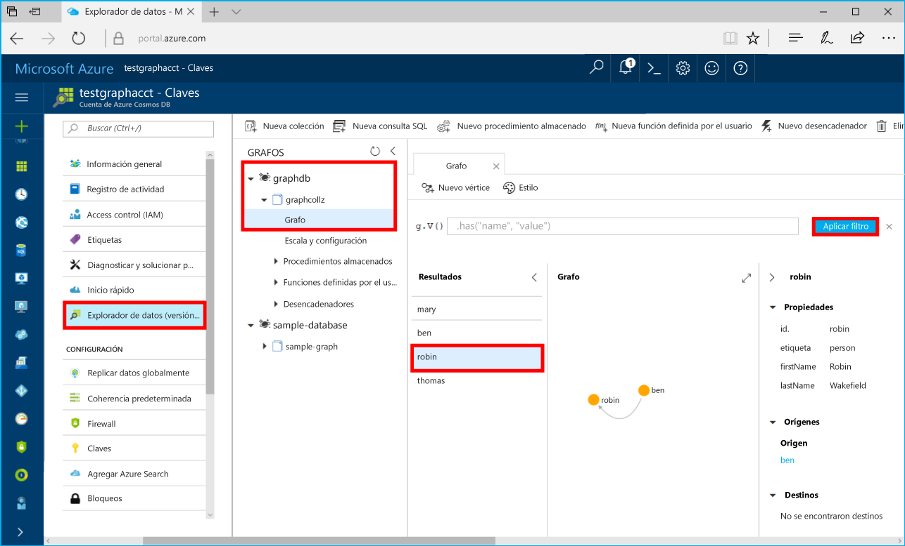

# <a name="azure-cosmos-db-build-a-net-application-using-the-graph-api"></a><span data-ttu-id="71574-103">Azure Cosmos DB: Compilar una aplicación de .NET mediante API Graph</span><span class="sxs-lookup"><span data-stu-id="71574-103">Azure Cosmos DB: Build a .NET application using the Graph API</span></span>

<span data-ttu-id="71574-104">Azure Cosmos DB es un servicio de base de datos con varios modelos y de distribución global de Microsoft.</span><span class="sxs-lookup"><span data-stu-id="71574-104">Azure Cosmos DB is Microsoft’s globally distributed multi-model database service.</span></span> <span data-ttu-id="71574-105">Puede crear rápidamente bases de datos de documentos, clave-valor y grafos y realizar consultas en ellas. Todas las bases de datos se beneficiarán de las funcionalidades de distribución global y escala horizontal en Azure Cosmos DB.</span><span class="sxs-lookup"><span data-stu-id="71574-105">You can quickly create and query document, key/value, and graph databases, all of which benefit from the global distribution and horizontal scale capabilities at the core of Azure Cosmos DB.</span></span> 

<span data-ttu-id="71574-106">En esta guía de inicio rápido se muestra cómo crear una cuenta, una base de datos y un grafo (contenedor) de Azure Cosmos DB mediante Azure Portal.</span><span class="sxs-lookup"><span data-stu-id="71574-106">This quick start demonstrates how to create an Azure Cosmos DB account, database, and graph (container) using the Azure portal.</span></span> <span data-ttu-id="71574-107">Después, compilará y ejecutará una aplicación de consola compilada en [API Graph](graph-sdk-dotnet.md) (versión preliminar).</span><span class="sxs-lookup"><span data-stu-id="71574-107">You then build and run a console app built on the [Graph API](graph-sdk-dotnet.md) (preview).</span></span>  

## <a name="prerequisites"></a><span data-ttu-id="71574-108">Requisitos previos</span><span class="sxs-lookup"><span data-stu-id="71574-108">Prerequisites</span></span>

<span data-ttu-id="71574-109">Si aún no tiene Visual Studio de 2017 instalado, puede descargar y usar la versión **gratis** de [Visual Studio 2017 Community Edition](https://www.visualstudio.com/downloads/).</span><span class="sxs-lookup"><span data-stu-id="71574-109">If you don’t already have Visual Studio 2017 installed, you can download and use the **free** [Visual Studio 2017 Community Edition](https://www.visualstudio.com/downloads/).</span></span> <span data-ttu-id="71574-110">Asegúrese de que habilita **Desarrollo de Azure** durante la instalación de Visual Studio.</span><span class="sxs-lookup"><span data-stu-id="71574-110">Make sure that you enable **Azure development** during the Visual Studio setup.</span></span>

[!INCLUDE [quickstarts-free-trial-note](../../includes/quickstarts-free-trial-note.md)]

## <a name="create-a-database-account"></a><span data-ttu-id="71574-111">Creación de una cuenta de base de datos</span><span class="sxs-lookup"><span data-stu-id="71574-111">Create a database account</span></span>

[!INCLUDE [cosmos-db-create-dbaccount-graph](../../includes/cosmos-db-create-dbaccount-graph.md)]

## <a name="add-a-graph"></a><span data-ttu-id="71574-112">Agregar un grafo</span><span class="sxs-lookup"><span data-stu-id="71574-112">Add a graph</span></span>

[!INCLUDE [cosmos-db-create-graph](../../includes/cosmos-db-create-graph.md)]

## <a name="clone-the-sample-application"></a><span data-ttu-id="71574-113">Clonación de la aplicación de ejemplo</span><span class="sxs-lookup"><span data-stu-id="71574-113">Clone the sample application</span></span>

<span data-ttu-id="71574-114">Ahora vamos a clonar una aplicación de API Graph desde GitHub, establecer la cadena de conexión y ejecutarla.</span><span class="sxs-lookup"><span data-stu-id="71574-114">Now let's clone a Graph API app from github, set the connection string, and run it.</span></span> <span data-ttu-id="71574-115">Verá lo fácil que es trabajar con datos mediante programación.</span><span class="sxs-lookup"><span data-stu-id="71574-115">You'll see how easy it is to work with data programmatically.</span></span> 

1. <span data-ttu-id="71574-116">Abra una ventana de terminal de Git, como Git Bash, y `cd` en un directorio de trabajo.</span><span class="sxs-lookup"><span data-stu-id="71574-116">Open a git terminal window, such as git bash, and `cd` to a working directory.</span></span>  

2. <span data-ttu-id="71574-117">Ejecute el comando siguiente para clonar el repositorio de ejemplo.</span><span class="sxs-lookup"><span data-stu-id="71574-117">Run the following command to clone the sample repository.</span></span> 

    ```bash
    git clone https://github.com/Azure-Samples/azure-cosmos-db-graph-dotnet-getting-started.git
    ```

3. <span data-ttu-id="71574-118">A continuación, abra Visual Studio y el archivo de solución.</span><span class="sxs-lookup"><span data-stu-id="71574-118">Then open Visual Studio and open the solution file.</span></span> 

## <a name="review-the-code"></a><span data-ttu-id="71574-119">Revisar el código</span><span class="sxs-lookup"><span data-stu-id="71574-119">Review the code</span></span>

<span data-ttu-id="71574-120">Vamos a revisar rápidamente lo que sucede en la aplicación.</span><span class="sxs-lookup"><span data-stu-id="71574-120">Let's make a quick review of what's happening in the app.</span></span> <span data-ttu-id="71574-121">Abra el archivo Program.cs y observe que estas líneas de código crean los recursos de Azure Cosmos DB.</span><span class="sxs-lookup"><span data-stu-id="71574-121">Open the Program.cs file and you'll find that these lines of code create the Azure Cosmos DB resources.</span></span> 

* <span data-ttu-id="71574-122">Se inicializa DocumentClient.</span><span class="sxs-lookup"><span data-stu-id="71574-122">The DocumentClient is initialized.</span></span> <span data-ttu-id="71574-123">En la versión preliminar, hemos agregado una API de extensión de grafos en el cliente de la base de datos de Azure Cosmos.</span><span class="sxs-lookup"><span data-stu-id="71574-123">In the preview, we added a graph extension API on the Azure Cosmos DB client.</span></span> <span data-ttu-id="71574-124">Estamos trabajando en un cliente de grafos independiente desacoplado del cliente y los recursos de la base de datos de Azure Cosmos.</span><span class="sxs-lookup"><span data-stu-id="71574-124">We are working on a standalone graph client decoupled from the Azure Cosmos DB client and resources.</span></span>

    ```csharp
    using (DocumentClient client = new DocumentClient(
        new Uri(endpoint),
        authKey,
        new ConnectionPolicy { ConnectionMode = ConnectionMode.Direct, ConnectionProtocol = Protocol.Tcp }))
    ```

* <span data-ttu-id="71574-125">Se crea una base de datos.</span><span class="sxs-lookup"><span data-stu-id="71574-125">A new database is created.</span></span>

    ```csharp
    Database database = await client.CreateDatabaseIfNotExistsAsync(new Database { Id = "graphdb" });
    ```

* <span data-ttu-id="71574-126">Se crea un grafo.</span><span class="sxs-lookup"><span data-stu-id="71574-126">A new graph is created.</span></span>

    ```csharp
    DocumentCollection graph = await client.CreateDocumentCollectionIfNotExistsAsync(
        UriFactory.CreateDatabaseUri("graphdb"),
        new DocumentCollection { Id = "graph" },
        new RequestOptions { OfferThroughput = 1000 });
    ```
* <span data-ttu-id="71574-127">Se ejecuta una serie de pasos de Gremlin mediante el método `CreateGremlinQuery`.</span><span class="sxs-lookup"><span data-stu-id="71574-127">A series of Gremlin steps are executed using the `CreateGremlinQuery` method.</span></span>

    ```csharp
    // The CreateGremlinQuery method extensions allow you to execute Gremlin queries and iterate
    // results asychronously
    IDocumentQuery<dynamic> query = client.CreateGremlinQuery<dynamic>(graph, "g.V().count()");
    while (query.HasMoreResults)
    {
        foreach (dynamic result in await query.ExecuteNextAsync())
        {
            Console.WriteLine($"\t {JsonConvert.SerializeObject(result)}");
        }
    }

    ```

## <a name="update-your-connection-string"></a><span data-ttu-id="71574-128">Actualizar la cadena de conexión</span><span class="sxs-lookup"><span data-stu-id="71574-128">Update your connection string</span></span>

<span data-ttu-id="71574-129">Ahora vuelva a Azure Portal para obtener la información de la cadena de conexión y cópiela en la aplicación.</span><span class="sxs-lookup"><span data-stu-id="71574-129">Now go back to the Azure portal to get your connection string information and copy it into the app.</span></span>

1. <span data-ttu-id="71574-130">En Visual Studio 2017, abra el archivo App.config.</span><span class="sxs-lookup"><span data-stu-id="71574-130">In Visual Studio 2017, open the App.config file.</span></span> 

2. <span data-ttu-id="71574-131">En Azure Portal, en la cuenta de Azure Cosmos DB, haga clic en **Claves** en el panel de navegación izquierdo.</span><span class="sxs-lookup"><span data-stu-id="71574-131">In the Azure portal, in your Azure Cosmos DB account, click **Keys** in the left navigation.</span></span> 

    

3. <span data-ttu-id="71574-133">Copie el valor de **Identificador URI** del portal y conviértalo en el valor de Endpoint key (Clave de punto de conexión) en App.config.</span><span class="sxs-lookup"><span data-stu-id="71574-133">Copy your **URI** value from the portal and make it the value of the Endpoint key in App.config.</span></span> <span data-ttu-id="71574-134">Puede usar el botón de copia, tal y como se muestra en la captura de pantalla anterior, para copiar el valor.</span><span class="sxs-lookup"><span data-stu-id="71574-134">You can use the copy button as shown in the preceding screenshot to copy the value.</span></span>

    `<add key="Endpoint" value="https://FILLME.documents.azure.com:443" />`

4. <span data-ttu-id="71574-135">Copie el valor de **CLAVE PRINCIPAL** del portal y conviértalo en el valor de la clave AuthKey en App.config. A continuación, guarde los cambios.</span><span class="sxs-lookup"><span data-stu-id="71574-135">Copy your **PRIMARY KEY** value from the portal, and make it the value of the AuthKey key in App.config, then save your changes.</span></span> 

    `<add key="AuthKey" value="FILLME" />`

<span data-ttu-id="71574-136">Ya ha actualizado la aplicación con toda la información que necesita para comunicarse con Azure Cosmos DB.</span><span class="sxs-lookup"><span data-stu-id="71574-136">You've now updated your app with all the info it needs to communicate with Azure Cosmos DB.</span></span> 

## <a name="run-the-console-app"></a><span data-ttu-id="71574-137">Ejecutar la aplicación de consola</span><span class="sxs-lookup"><span data-stu-id="71574-137">Run the console app</span></span>

1. <span data-ttu-id="71574-138">En Visual Studio, haga clic con el botón derecho en el proyecto **GraphGetStarted** en el **Explorador de soluciones** y, después, haga clic en **Administrar paquetes NuGet**.</span><span class="sxs-lookup"><span data-stu-id="71574-138">In Visual Studio, right-click on the **GraphGetStarted** project in **Solution Explorer** and then click **Manage NuGet Packages**.</span></span> 

2. <span data-ttu-id="71574-139">En el cuadro **Examinar** de NuGet, escriba *Microsoft.Azure.Graphs* y active la casilla **Includes prerelease** (Incluye versión preliminar).</span><span class="sxs-lookup"><span data-stu-id="71574-139">In the NuGet **Browse** box, type *Microsoft.Azure.Graphs* and check the **Includes prerelease** box.</span></span> 

3. <span data-ttu-id="71574-140">En los resultados, instale la biblioteca **Microsoft.Azure.Graphs**.</span><span class="sxs-lookup"><span data-stu-id="71574-140">From the results, install the **Microsoft.Azure.Graphs** library.</span></span> <span data-ttu-id="71574-141">De este modo se instala el paquete de la biblioteca de extensión de grafos de Azure Cosmos DB y todas las dependencias.</span><span class="sxs-lookup"><span data-stu-id="71574-141">This installs the Azure Cosmos DB graph extension library package and all dependencies.</span></span>

    <span data-ttu-id="71574-142">Si recibe un mensaje sobre cómo revisar los cambios en la solución, haga clic en **Aceptar**.</span><span class="sxs-lookup"><span data-stu-id="71574-142">If you get a message about reviewing changes to the solution, click **OK**.</span></span> <span data-ttu-id="71574-143">Si recibe un mensaje acerca de la aceptación de licencia, haga clic en **Acepto**.</span><span class="sxs-lookup"><span data-stu-id="71574-143">If you get a message about license acceptance, click **I accept**.</span></span>

4. <span data-ttu-id="71574-144">Presione Ctrl+F5 para ejecutar la aplicación.</span><span class="sxs-lookup"><span data-stu-id="71574-144">Click CTRL + F5 to run the application.</span></span>

   <span data-ttu-id="71574-145">En la ventana de la consola se muestran los vértices y los bordes que se agregan al grafo.</span><span class="sxs-lookup"><span data-stu-id="71574-145">The console window displays the vertexes and edges being added to the graph.</span></span> <span data-ttu-id="71574-146">Cuando se complete el script, presione ENTRAR dos veces para cerrar la ventana de la consola.</span><span class="sxs-lookup"><span data-stu-id="71574-146">When the script completes, press ENTER twice to close the console window.</span></span> 

## <a name="browse-using-the-data-explorer"></a><span data-ttu-id="71574-147">Examinar mediante el Explorador de datos</span><span class="sxs-lookup"><span data-stu-id="71574-147">Browse using the Data Explorer</span></span>

<span data-ttu-id="71574-148">Ahora puede volver al Explorador de datos en Azure Portal para examinar y consultar los datos del nuevo grafo.</span><span class="sxs-lookup"><span data-stu-id="71574-148">You can now go back to Data Explorer in the Azure portal and browse and query your new graph data.</span></span>

1. <span data-ttu-id="71574-149">En el Explorador de datos, la nueva base de datos aparece en el panel Grafos.</span><span class="sxs-lookup"><span data-stu-id="71574-149">In Data Explorer, the new database appears in the Graphs pane.</span></span> <span data-ttu-id="71574-150">Expanda **graphdb**, **graphcollz** y, después, haga clic en **Grafo**.</span><span class="sxs-lookup"><span data-stu-id="71574-150">Expand **graphdb**, **graphcollz**, and then click **Graph**.</span></span>

2. <span data-ttu-id="71574-151">Haga clic en el botón **Aplicar filtro** para usar la consulta predeterminada para ver todos los vértices del grafo.</span><span class="sxs-lookup"><span data-stu-id="71574-151">Click the **Apply Filter** button to use the default query to view all the verticies in the graph.</span></span> <span data-ttu-id="71574-152">Los datos generados por la aplicación de ejemplo se muestran en el panel grafos.</span><span class="sxs-lookup"><span data-stu-id="71574-152">The data generated by the sample app is displayed in the Graphs pane.</span></span>

    <span data-ttu-id="71574-153">Puede acercar o alejar el grafo, expandir el espacio de visualización del grafo, agregar vértices adicionales y mover los vértices sobre la superficie de visualización.</span><span class="sxs-lookup"><span data-stu-id="71574-153">You can zoom in and out of the graph, you can expand the graph display space, add additional verticies, and move verticies on the display surface.</span></span>

    

## <a name="review-slas-in-the-azure-portal"></a><span data-ttu-id="71574-155">Revisar los SLA en Azure Portal</span><span class="sxs-lookup"><span data-stu-id="71574-155">Review SLAs in the Azure portal</span></span>

[!INCLUDE [cosmosdb-tutorial-review-slas](../../includes/cosmos-db-tutorial-review-slas.md)]

## <a name="clean-up-resources"></a><span data-ttu-id="71574-156">Limpieza de recursos</span><span class="sxs-lookup"><span data-stu-id="71574-156">Clean up resources</span></span>

<span data-ttu-id="71574-157">Si no va a seguir usando esta aplicación, siga estos pasos para eliminar todos los recursos creados en esta guía de inicio rápido en Azure Portal:</span><span class="sxs-lookup"><span data-stu-id="71574-157">If you're not going to continue to use this app, delete all resources created by this quickstart in the Azure portal with the following steps:</span></span> 

1. <span data-ttu-id="71574-158">En el menú de la izquierda de Azure Portal, haga clic en **Grupos de recursos** y en el nombre del recurso que creó.</span><span class="sxs-lookup"><span data-stu-id="71574-158">From the left-hand menu in the Azure portal, click **Resource groups** and then click the name of the resource you created.</span></span> 
2. <span data-ttu-id="71574-159">En la página del grupo de recursos, haga clic en **Eliminar**, escriba en el cuadro de texto el nombre del recurso que quiere eliminar y haga clic en **Eliminar**.</span><span class="sxs-lookup"><span data-stu-id="71574-159">On your resource group page, click **Delete**, type the name of the resource to delete in the text box, and then click **Delete**.</span></span>

## <a name="next-steps"></a><span data-ttu-id="71574-160">Pasos siguientes</span><span class="sxs-lookup"><span data-stu-id="71574-160">Next steps</span></span>

<span data-ttu-id="71574-161">En esta guía de inicio rápido, ha obtenido información sobre cómo crear una cuenta de Azure Cosmos DB, crear un grafo mediante el Explorador de datos y ejecutar una aplicación.</span><span class="sxs-lookup"><span data-stu-id="71574-161">In this quickstart, you've learned how to create an Azure Cosmos DB account, create a graph using the Data Explorer, and run an app.</span></span> <span data-ttu-id="71574-162">Ahora puede crear consultas más complejas e implementar con Gremlin una lógica eficaz de recorrido del grafo.</span><span class="sxs-lookup"><span data-stu-id="71574-162">You can now build more complex queries and implement powerful graph traversal logic using Gremlin.</span></span> 

> [!div class="nextstepaction"]
> [<span data-ttu-id="71574-163">Consulta mediante Gremlin</span><span class="sxs-lookup"><span data-stu-id="71574-163">Query using Gremlin</span></span>](tutorial-query-graph.md)

