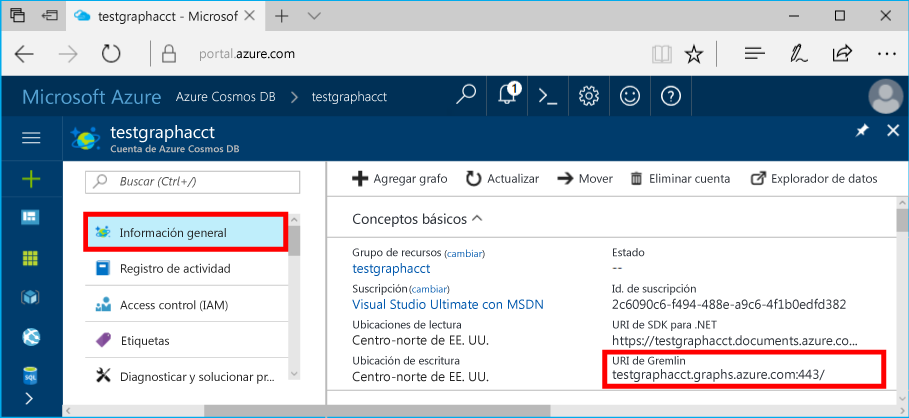
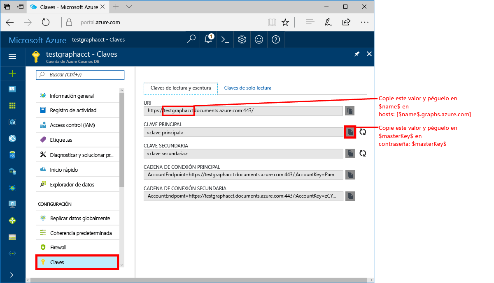
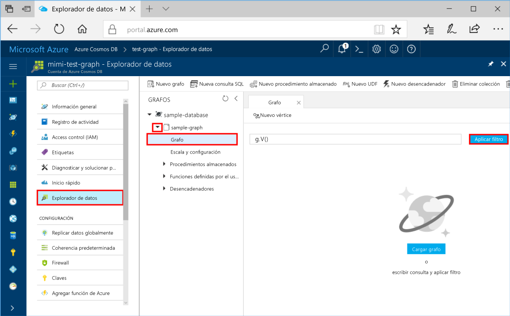
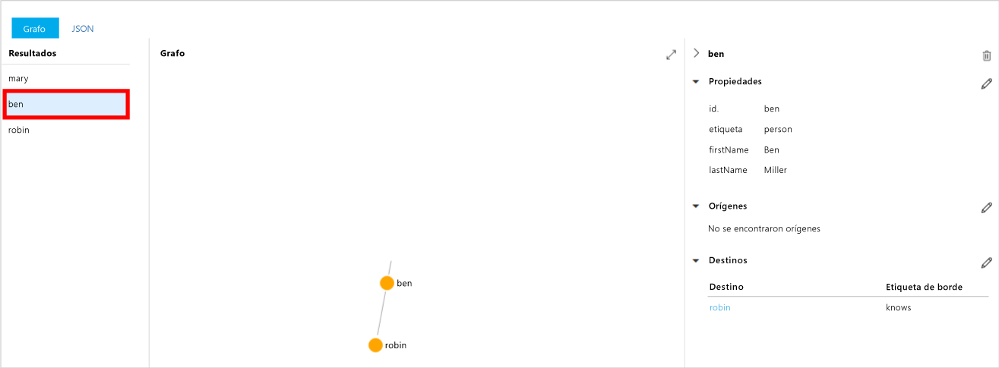
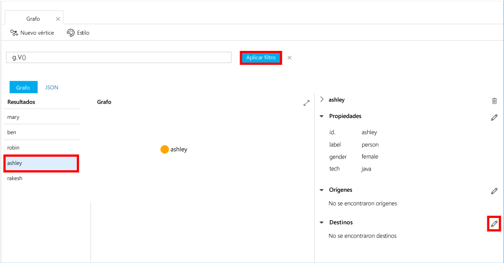
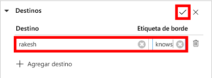
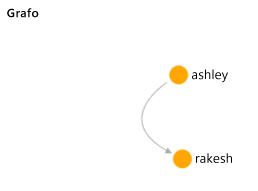

# <a name="azure-cosmos-db-create-a-graph-database-using-java-and-the-azure-portal"></a><span data-ttu-id="92abf-103">Azure Cosmos DB: creación una base de datos de grafos mediante Java y Azure Portal</span><span class="sxs-lookup"><span data-stu-id="92abf-103">Azure Cosmos DB: Create a graph database using Java and the Azure portal</span></span>

<span data-ttu-id="92abf-104">Azure Cosmos DB es un servicio de base de datos con varios modelos y de distribución global de Microsoft.</span><span class="sxs-lookup"><span data-stu-id="92abf-104">Azure Cosmos DB is Microsoft’s globally distributed multi-model database service.</span></span> <span data-ttu-id="92abf-105">Puede crear rápidamente bases de datos de documentos, clave-valor y grafos, y realizar consultas en ellas. Todas las bases de datos se beneficiarán de las funcionalidades de distribución global y escala horizontal en Azure Cosmos DB.</span><span class="sxs-lookup"><span data-stu-id="92abf-105">You can quickly create and query document, key/value, and graph databases, all of which benefit from the global distribution and horizontal scale capabilities at the core of Azure Cosmos DB.</span></span> 

<span data-ttu-id="92abf-106">Este tutorial rápido crea una base de datos de grafos mediante las herramientas de Azure Portal para Azure Cosmos DB.</span><span class="sxs-lookup"><span data-stu-id="92abf-106">This quickstart creates a graph database using the Azure portal tools for Azure Cosmos DB.</span></span> <span data-ttu-id="92abf-107">Este tutorial rápido también muestra cómo crear rápidamente una aplicación de consola Java usando una base de datos de grafos mediante el controlador [Gremlin Java](https://mvnrepository.com/artifact/org.apache.tinkerpop/gremlin-driver) de OSS.</span><span class="sxs-lookup"><span data-stu-id="92abf-107">This quickstart also shows you how to quickly create a Java console app using a graph database using the OSS [Gremlin Java](https://mvnrepository.com/artifact/org.apache.tinkerpop/gremlin-driver) driver.</span></span> <span data-ttu-id="92abf-108">Las instrucciones que se indican en este tutorial rápido se pueden seguir en cualquier sistema operativo que sea capaz de ejecutar Java.</span><span class="sxs-lookup"><span data-stu-id="92abf-108">The instructions in this quickstart can be followed on any operating system that is capable of running Java.</span></span> <span data-ttu-id="92abf-109">Con esta guía de inicio rápido se familiarizará con la creación y modificación de los recursos de grafos en la interfaz de usuario o mediante programación, lo que prefiera.</span><span class="sxs-lookup"><span data-stu-id="92abf-109">This quickstart familiarizes you with creating and modifying graph resources in either the UI or programmatically, whichever is your preference.</span></span> 

## <a name="prerequisites"></a><span data-ttu-id="92abf-110">Requisitos previos</span><span class="sxs-lookup"><span data-stu-id="92abf-110">Prerequisites</span></span>

* [<span data-ttu-id="92abf-111">Kit de desarrollo de Java (JDK) 1.7+</span><span class="sxs-lookup"><span data-stu-id="92abf-111">Java Development Kit (JDK) 1.7+</span></span>](http://www.oracle.com/technetwork/java/javase/downloads/jdk8-downloads-2133151.html)
    * <span data-ttu-id="92abf-112">En Ubuntu, ejecute `apt-get install default-jdk` para instalar el JDK.</span><span class="sxs-lookup"><span data-stu-id="92abf-112">On Ubuntu, run `apt-get install default-jdk` to install the JDK.</span></span>
    * <span data-ttu-id="92abf-113">Asegúrese de establecer la variable de entorno JAVA_HOME para que apunte a la carpeta donde está instalado el JDK.</span><span class="sxs-lookup"><span data-stu-id="92abf-113">Be sure to set the JAVA_HOME environment variable to point to the folder where the JDK is installed.</span></span>
* <span data-ttu-id="92abf-114">[Descargar](http://maven.apache.org/download.cgi) e [instalar](http://maven.apache.org/install.html) un archivo binario de [Maven](http://maven.apache.org/)</span><span class="sxs-lookup"><span data-stu-id="92abf-114">[Download](http://maven.apache.org/download.cgi) and [install](http://maven.apache.org/install.html) a [Maven](http://maven.apache.org/) binary archive</span></span>
    * <span data-ttu-id="92abf-115">En Ubuntu, puede ejecutar `apt-get install maven` para instalar Maven.</span><span class="sxs-lookup"><span data-stu-id="92abf-115">On Ubuntu, you can run `apt-get install maven` to install Maven.</span></span>
* [<span data-ttu-id="92abf-116">Git</span><span class="sxs-lookup"><span data-stu-id="92abf-116">Git</span></span>](https://www.git-scm.com/)
    * <span data-ttu-id="92abf-117">En Ubuntu, puede ejecutar `sudo apt-get install git` para instalar Git.</span><span class="sxs-lookup"><span data-stu-id="92abf-117">On Ubuntu, you can run `sudo apt-get install git` to install Git.</span></span>

[!INCLUDE [quickstarts-free-trial-note](../../includes/quickstarts-free-trial-note.md)]

## <a name="create-a-database-account"></a><span data-ttu-id="92abf-118">Creación de una cuenta de base de datos</span><span class="sxs-lookup"><span data-stu-id="92abf-118">Create a database account</span></span>

<span data-ttu-id="92abf-119">Para poder crear una base de datos de grafos, debe crear una cuenta de base de datos de Gremlin (Graph) con Azure Cosmos DB.</span><span class="sxs-lookup"><span data-stu-id="92abf-119">Before you can create a graph database, you need to create a Gremlin (Graph) database account with Azure Cosmos DB.</span></span>

[!INCLUDE [cosmos-db-create-dbaccount-graph](../../includes/cosmos-db-create-dbaccount-graph.md)]

## <a name="add-a-graph"></a><span data-ttu-id="92abf-120">Agregar un grafo</span><span class="sxs-lookup"><span data-stu-id="92abf-120">Add a graph</span></span>

<span data-ttu-id="92abf-121">Ahora puede usar la herramienta Explorador de datos en Azure Portal para crear una base de datos de grafos.</span><span class="sxs-lookup"><span data-stu-id="92abf-121">You can now use the Data Explorer tool in the Azure portal to create a graph database.</span></span> 

1. <span data-ttu-id="92abf-122">En Azure Portal, en el menú de navegación izquierdo, haga clic en **Explorador de datos (versión preliminar)**.</span><span class="sxs-lookup"><span data-stu-id="92abf-122">In the Azure portal, in the left navigation menu, click **Data Explorer (Preview)**.</span></span> 
2. <span data-ttu-id="92abf-123">En la hoja **Explorador de datos (versión preliminar)**, haga clic en **New Graph** (Nuevo grafo) y rellene la página con la información siguiente:</span><span class="sxs-lookup"><span data-stu-id="92abf-123">In the **Data Explorer (Preview)** blade, click **New Graph**, then fill in the page using the following information:</span></span>

    

    <span data-ttu-id="92abf-125">Configuración</span><span class="sxs-lookup"><span data-stu-id="92abf-125">Setting</span></span>|<span data-ttu-id="92abf-126">Valor sugerido</span><span class="sxs-lookup"><span data-stu-id="92abf-126">Suggested value</span></span>|<span data-ttu-id="92abf-127">Descripción</span><span class="sxs-lookup"><span data-stu-id="92abf-127">Description</span></span>
    ---|---|---
    <span data-ttu-id="92abf-128">Identificador de base de datos</span><span class="sxs-lookup"><span data-stu-id="92abf-128">Database ID</span></span>|<span data-ttu-id="92abf-129">sample-database</span><span class="sxs-lookup"><span data-stu-id="92abf-129">sample-database</span></span>|<span data-ttu-id="92abf-130">Identificador de la nueva base de datos.</span><span class="sxs-lookup"><span data-stu-id="92abf-130">The ID for your new database.</span></span> <span data-ttu-id="92abf-131">Los nombres de bases de datos deben tener entre 1 y 255 caracteres y no pueden contener `/ \ # ?` o un espacio al final.</span><span class="sxs-lookup"><span data-stu-id="92abf-131">Database names must be between 1 and 255 characters, and cannot contain `/ \ # ?` or a trailing space.</span></span>
    <span data-ttu-id="92abf-132">Identificador de grafo</span><span class="sxs-lookup"><span data-stu-id="92abf-132">Graph ID</span></span>|<span data-ttu-id="92abf-133">sample-graph</span><span class="sxs-lookup"><span data-stu-id="92abf-133">sample-graph</span></span>|<span data-ttu-id="92abf-134">Identificador del nuevo grafo.</span><span class="sxs-lookup"><span data-stu-id="92abf-134">The ID for your new graph.</span></span> <span data-ttu-id="92abf-135">Los nombres de grafo tienen los mismos requisitos de caracteres que los identificadores de base de datos.</span><span class="sxs-lookup"><span data-stu-id="92abf-135">Graph names have the same character requirements as database ids.</span></span>
    <span data-ttu-id="92abf-136">Capacidad de almacenamiento</span><span class="sxs-lookup"><span data-stu-id="92abf-136">Storage Capacity</span></span>| <span data-ttu-id="92abf-137">10 GB</span><span class="sxs-lookup"><span data-stu-id="92abf-137">10 GB</span></span>|<span data-ttu-id="92abf-138">Deje el valor predeterminado.</span><span class="sxs-lookup"><span data-stu-id="92abf-138">Leave the default value.</span></span> <span data-ttu-id="92abf-139">Se trata de la capacidad de almacenamiento de la base de datos.</span><span class="sxs-lookup"><span data-stu-id="92abf-139">This is the storage capacity of the database.</span></span>
    <span data-ttu-id="92abf-140">Rendimiento</span><span class="sxs-lookup"><span data-stu-id="92abf-140">Throughput</span></span>|<span data-ttu-id="92abf-141">400 RU</span><span class="sxs-lookup"><span data-stu-id="92abf-141">400 RUs</span></span>|<span data-ttu-id="92abf-142">Deje el valor predeterminado.</span><span class="sxs-lookup"><span data-stu-id="92abf-142">Leave the default value.</span></span> <span data-ttu-id="92abf-143">Se puede escalar el rendimiento más adelante si quiere reducir la latencia.</span><span class="sxs-lookup"><span data-stu-id="92abf-143">You can scale up the throughput later if you want to reduce latency.</span></span>
    <span data-ttu-id="92abf-144">Clave de partición</span><span class="sxs-lookup"><span data-stu-id="92abf-144">Partition key</span></span>|<span data-ttu-id="92abf-145">Déjelo en blanco</span><span class="sxs-lookup"><span data-stu-id="92abf-145">Leave blank</span></span>|<span data-ttu-id="92abf-146">Para este tutorial rápido, deje en blanco la clave de partición.</span><span class="sxs-lookup"><span data-stu-id="92abf-146">For the purpose of this quickstart, leave the partition key blank.</span></span>

3. <span data-ttu-id="92abf-147">Una vez que haya rellenado el formulario, haga clic en **Aceptar**.</span><span class="sxs-lookup"><span data-stu-id="92abf-147">Once the form is filled out, click **OK**.</span></span>

## <a name="clone-the-sample-application"></a><span data-ttu-id="92abf-148">Clonación de la aplicación de ejemplo</span><span class="sxs-lookup"><span data-stu-id="92abf-148">Clone the sample application</span></span>

<span data-ttu-id="92abf-149">Ahora vamos a clonar una aplicación de grafos desde GitHub, establecer la cadena de conexión y ejecutarla.</span><span class="sxs-lookup"><span data-stu-id="92abf-149">Now let's clone a graph app from github, set the connection string, and run it.</span></span> <span data-ttu-id="92abf-150">Verá lo fácil que es trabajar con datos mediante programación.</span><span class="sxs-lookup"><span data-stu-id="92abf-150">You see how easy it is to work with data programmatically.</span></span> 

1. <span data-ttu-id="92abf-151">Abra una ventana de terminal de Git, como Git Bash, y `cd` en un directorio de trabajo.</span><span class="sxs-lookup"><span data-stu-id="92abf-151">Open a git terminal window, such as git bash, and `cd` to a working directory.</span></span>  

2. <span data-ttu-id="92abf-152">Ejecute el comando siguiente para clonar el repositorio de ejemplo.</span><span class="sxs-lookup"><span data-stu-id="92abf-152">Run the following command to clone the sample repository.</span></span> 

    ```bash
    git clone https://github.com/Azure-Samples/azure-cosmos-db-graph-java-getting-started.git
    ```

## <a name="review-the-code"></a><span data-ttu-id="92abf-153">Revisar el código</span><span class="sxs-lookup"><span data-stu-id="92abf-153">Review the code</span></span>

<span data-ttu-id="92abf-154">Vamos a revisar rápidamente lo que sucede en la aplicación.</span><span class="sxs-lookup"><span data-stu-id="92abf-154">Let's make a quick review of what's happening in the app.</span></span> <span data-ttu-id="92abf-155">Abra el archivo `Program.java` en la carpeta \src\GetStarted y busque estas líneas de código.</span><span class="sxs-lookup"><span data-stu-id="92abf-155">Open the `Program.java` file from the \src\GetStarted folder and find these lines of code.</span></span> 

* <span data-ttu-id="92abf-156">El elemento `Client` de Gremlin se a partir de la configuración de `src/remote.yaml`.</span><span class="sxs-lookup"><span data-stu-id="92abf-156">The Gremlin `Client` is initialized from the configuration in `src/remote.yaml`.</span></span>

    ```java
    cluster = Cluster.build(new File("src/remote.yaml")).create();
    ...
    client = cluster.connect();
    ```

* <span data-ttu-id="92abf-157">Se ejecuta una serie de pasos de Gremlin mediante el método `client.submit`.</span><span class="sxs-lookup"><span data-stu-id="92abf-157">A series of Gremlin steps are executed using the `client.submit` method.</span></span>

    ```java
    ResultSet results = client.submit(gremlin);

    CompletableFuture<List<Result>> completableFutureResults = results.all();
    List<Result> resultList = completableFutureResults.get();

    for (Result result : resultList) {
        System.out.println(result.toString());
    }
    ```

## <a name="update-your-connection-string"></a><span data-ttu-id="92abf-158">Actualización de la cadena de conexión</span><span class="sxs-lookup"><span data-stu-id="92abf-158">Update your connection string</span></span>

1. <span data-ttu-id="92abf-159">Abra el archivo src/remote.yaml.</span><span class="sxs-lookup"><span data-stu-id="92abf-159">Open the src/remote.yaml file.</span></span> 

3. <span data-ttu-id="92abf-160">Rellene los valores de *hosts*, *nombre de usuario* y *contraseña* en el archivo src/remote.yaml.</span><span class="sxs-lookup"><span data-stu-id="92abf-160">Fill in your *hosts*, *username*, and *password* values in the src/remote.yaml file.</span></span> <span data-ttu-id="92abf-161">El resto de los valores no tienen que cambiarse.</span><span class="sxs-lookup"><span data-stu-id="92abf-161">The rest of the settings do not need to be changed.</span></span>

    <span data-ttu-id="92abf-162">Configuración</span><span class="sxs-lookup"><span data-stu-id="92abf-162">Setting</span></span>|<span data-ttu-id="92abf-163">Valor sugerido</span><span class="sxs-lookup"><span data-stu-id="92abf-163">Suggested value</span></span>|<span data-ttu-id="92abf-164">Descripción</span><span class="sxs-lookup"><span data-stu-id="92abf-164">Description</span></span>
    ---|---|---
    <span data-ttu-id="92abf-165">Hosts</span><span class="sxs-lookup"><span data-stu-id="92abf-165">Hosts</span></span>|<span data-ttu-id="92abf-166">[***.graphs.azure.com]</span><span class="sxs-lookup"><span data-stu-id="92abf-166">[***.graphs.azure.com]</span></span>|<span data-ttu-id="92abf-167">Consulte la captura de pantalla que sigue a esta tabla.</span><span class="sxs-lookup"><span data-stu-id="92abf-167">See the screenshot following this table.</span></span> <span data-ttu-id="92abf-168">Este es el valor del identificador URI de Gremlin en la página Información general de Azure Portal, entre corchetes, sin la terminación :443/.</span><span class="sxs-lookup"><span data-stu-id="92abf-168">This value is the Gremlin URI value on the Overview page of the Azure portal, in square brackets, with the trailing :443/ removed.</span></span><br><br><span data-ttu-id="92abf-169">Este valor también se puede obtener desde la pestaña Claves; para ello, use el valor del identificador URI, quite https://, sustituya documents por graphs y elimine la terminación :443 /.</span><span class="sxs-lookup"><span data-stu-id="92abf-169">This value can also be retrieved from the Keys tab, using the URI value by removing https://, changing documents to graphs, and removing the trailing :443/.</span></span>
    <span data-ttu-id="92abf-170">Nombre de usuario</span><span class="sxs-lookup"><span data-stu-id="92abf-170">Username</span></span>|<span data-ttu-id="92abf-171">/dbs/sample-database/colls/sample-graph</span><span class="sxs-lookup"><span data-stu-id="92abf-171">/dbs/sample-database/colls/sample-graph</span></span>|<span data-ttu-id="92abf-172">El recurso con la forma `/dbs/<db>/colls/<coll>` donde `<db>` es el nombre de la base de datos actual y `<coll>` es el nombre de la colección actual.</span><span class="sxs-lookup"><span data-stu-id="92abf-172">The resource of the form `/dbs/<db>/colls/<coll>` where `<db>` is your existing database name and `<coll>` is your existing collection name.</span></span>
    <span data-ttu-id="92abf-173">Password</span><span class="sxs-lookup"><span data-stu-id="92abf-173">Password</span></span>|<span data-ttu-id="92abf-174">*Su clave maestra principal*</span><span class="sxs-lookup"><span data-stu-id="92abf-174">*Your primary master key*</span></span>|<span data-ttu-id="92abf-175">Vea la segunda captura de pantalla que sigue a esta tabla.</span><span class="sxs-lookup"><span data-stu-id="92abf-175">See the second screenshot following this table.</span></span> <span data-ttu-id="92abf-176">Este valor es la clave principal, que puede obtener en la página Claves de Azure Portal, en el cuadro de texto Clave principal.</span><span class="sxs-lookup"><span data-stu-id="92abf-176">This value is your primary key, which you can retrieve from the Keys page of the Azure portal, in the Primary Key box.</span></span> <span data-ttu-id="92abf-177">Copie el valor con el botón Copiar a la derecha del cuadro.</span><span class="sxs-lookup"><span data-stu-id="92abf-177">Copy the value using the copy button on the right side of the box.</span></span>

    <span data-ttu-id="92abf-178">Para obtener el valor de Hosts, copie el valor de **URI de Gremlin** de la página **Introducción**.</span><span class="sxs-lookup"><span data-stu-id="92abf-178">For the Hosts value, copy the **Gremlin URI** value from the **Overview** page.</span></span> <span data-ttu-id="92abf-179">Si está vacía, consulte las instrucciones en la fila Hosts en la tabla anterior acerca de cómo crear el URI de Gremlin desde la hoja de claves.</span><span class="sxs-lookup"><span data-stu-id="92abf-179">If it's empty, see the instructions in the Hosts row in the preceding table about creating the Gremlin URI from the Keys blade.</span></span>
<span data-ttu-id="92abf-180"></span><span class="sxs-lookup"><span data-stu-id="92abf-180"></span></span>

    <span data-ttu-id="92abf-181">Para obtener el valor de la contraseña, copie la **Clave principal** de la página **Claves**: </span><span class="sxs-lookup"><span data-stu-id="92abf-181">For the Password value, copy the **Primary key** from the **Keys** blade: </span></span>

## <a name="run-the-console-app"></a><span data-ttu-id="92abf-182">Ejecutar la aplicación de consola</span><span class="sxs-lookup"><span data-stu-id="92abf-182">Run the console app</span></span>

1. <span data-ttu-id="92abf-183">En la ventana del terminal de git, use `cd` para cambiar a la carpeta azure-cosmos-db-graph-java-getting-started.</span><span class="sxs-lookup"><span data-stu-id="92abf-183">In the git terminal window, `cd` to the azure-cosmos-db-graph-java-getting-started folder.</span></span>

2. <span data-ttu-id="92abf-184">En la ventana del terminal de git, escriba `mvn package` para instalar los paquetes Java necesarios.</span><span class="sxs-lookup"><span data-stu-id="92abf-184">In the git terminal window, type `mvn package` to install the required Java packages.</span></span>

3. <span data-ttu-id="92abf-185">En la ventana del terminal de git, ejecute `mvn exec:java -D exec.mainClass=GetStarted.Program` para iniciar la aplicación de Java.</span><span class="sxs-lookup"><span data-stu-id="92abf-185">In the git terminal window, run `mvn exec:java -D exec.mainClass=GetStarted.Program` in the terminal window to start your Java application.</span></span>

<span data-ttu-id="92abf-186">En la ventana del terminal se muestran los vértices y los bordes que se agregan al grafo.</span><span class="sxs-lookup"><span data-stu-id="92abf-186">The terminal window displays the vertices being added to the graph.</span></span> <span data-ttu-id="92abf-187">Una vez que el programa finalice, vuelva a cambiar a Azure Portal en el Explorador de Internet.</span><span class="sxs-lookup"><span data-stu-id="92abf-187">Once the program completes, switch back to the Azure portal in your internet browser.</span></span> 

<a id="add-sample-data"></a>
## <a name="review-and-add-sample-data"></a><span data-ttu-id="92abf-188">Revise y agregue datos de ejemplo</span><span class="sxs-lookup"><span data-stu-id="92abf-188">Review and add sample data</span></span>

<span data-ttu-id="92abf-189">Ahora puede volver al Explorador de datos y ver los vértices que se agregan al grafo, y agregar puntos de datos adicionales.</span><span class="sxs-lookup"><span data-stu-id="92abf-189">You can now go back to Data Explorer and see the vertices added to the graph, and add additional data points.</span></span>

1. <span data-ttu-id="92abf-190">En el Explorador de datos, expanda el **grafo de ejemplo** de la **base de datos de ejemplo**/, haga clic en **Grafo** y, a continuación, haga clic en **Aplicar filtro**.</span><span class="sxs-lookup"><span data-stu-id="92abf-190">In Data Explorer, expand the **sample-database**/**sample-graph**, click **Graph**, and then click **Apply Filter**.</span></span> 

   

2. <span data-ttu-id="92abf-192">En la lista **Resultados**, observe los nuevos usuarios agregados al grafo.</span><span class="sxs-lookup"><span data-stu-id="92abf-192">In the **Results** list, notice the new users added to the graph.</span></span> <span data-ttu-id="92abf-193">Seleccione **ben** y observe que se ha conectado a robin.</span><span class="sxs-lookup"><span data-stu-id="92abf-193">Select **ben** and notice that he's connected to robin.</span></span> <span data-ttu-id="92abf-194">Puede mover los vértices en el explorador de grafos, acercar y alejar el grafo, y ampliar el tamaño de la superficie del explorador de grafos.</span><span class="sxs-lookup"><span data-stu-id="92abf-194">You can move the vertices around on the graph explorer, zoom in and out, and expand the size of the graph explorer surface.</span></span> 

   

3. <span data-ttu-id="92abf-196">Vamos a agregar algunos usuarios nuevos al grafo mediante el Explorador de datos.</span><span class="sxs-lookup"><span data-stu-id="92abf-196">Let's add a few new users to the graph using the Data Explorer.</span></span> <span data-ttu-id="92abf-197">Haga clic en el botón **Nuevo vértice** para agregar datos al grafo.</span><span class="sxs-lookup"><span data-stu-id="92abf-197">Click the **New Vertex** button to add data to your graph.</span></span>

   

4. <span data-ttu-id="92abf-199">Escriba una etiqueta de *persona* y, a continuación, escriba las claves y los valores siguientes para crear el primer vértice en el grafo.</span><span class="sxs-lookup"><span data-stu-id="92abf-199">Enter a label of *person* then enter the following keys and values to create the first vertex in the graph.</span></span> <span data-ttu-id="92abf-200">Tenga en cuenta que puede crear propiedades únicas para cada persona en el grafo.</span><span class="sxs-lookup"><span data-stu-id="92abf-200">Notice that you can create unique properties for each person in your graph.</span></span> <span data-ttu-id="92abf-201">Solo se requiere la clave de identificador.</span><span class="sxs-lookup"><span data-stu-id="92abf-201">Only the id key is required.</span></span>

    <span data-ttu-id="92abf-202">key</span><span class="sxs-lookup"><span data-stu-id="92abf-202">key</span></span>|<span data-ttu-id="92abf-203">value</span><span class="sxs-lookup"><span data-stu-id="92abf-203">value</span></span>|<span data-ttu-id="92abf-204">Notas</span><span class="sxs-lookup"><span data-stu-id="92abf-204">Notes</span></span>
    ----|----|----
    <span data-ttu-id="92abf-205">id</span><span class="sxs-lookup"><span data-stu-id="92abf-205">id</span></span>|<span data-ttu-id="92abf-206">ashley</span><span class="sxs-lookup"><span data-stu-id="92abf-206">ashley</span></span>|<span data-ttu-id="92abf-207">Identificador único del vértice.</span><span class="sxs-lookup"><span data-stu-id="92abf-207">The unique identifier for the vertex.</span></span> <span data-ttu-id="92abf-208">Si no se especifica un identificador, se genera uno automáticamente.</span><span class="sxs-lookup"><span data-stu-id="92abf-208">If you don't specify an id, one is generated for you.</span></span>
    <span data-ttu-id="92abf-209">gender</span><span class="sxs-lookup"><span data-stu-id="92abf-209">gender</span></span>|<span data-ttu-id="92abf-210">mujer</span><span class="sxs-lookup"><span data-stu-id="92abf-210">female</span></span>| 
    <span data-ttu-id="92abf-211">técnico</span><span class="sxs-lookup"><span data-stu-id="92abf-211">tech</span></span> | <span data-ttu-id="92abf-212">Java</span><span class="sxs-lookup"><span data-stu-id="92abf-212">java</span></span> | 

    > [!NOTE]
    > <span data-ttu-id="92abf-213">En este tutorial rápido se crea una colección sin particiones.</span><span class="sxs-lookup"><span data-stu-id="92abf-213">In this quickstart we create a non-partitioned collection.</span></span> <span data-ttu-id="92abf-214">Sin embargo, si crea una colección con particiones especificando una clave de partición durante la creación de la colección, debe incluir la clave de partición como una clave en cada nuevo vértice.</span><span class="sxs-lookup"><span data-stu-id="92abf-214">However, if you create a partitioned collection by specifying a partition key during the collection creation, then you need to include the partition key as a key in each new vertex.</span></span> 

5. <span data-ttu-id="92abf-215">Haga clic en **Aceptar**.</span><span class="sxs-lookup"><span data-stu-id="92abf-215">Click **OK**.</span></span> <span data-ttu-id="92abf-216">Puede que tenga que expandir la pantalla para ver **Aceptar** en la parte inferior de la pantalla.</span><span class="sxs-lookup"><span data-stu-id="92abf-216">You may need to expand your screen to see **OK** on the bottom of the screen.</span></span>

6. <span data-ttu-id="92abf-217">Haga clic en **Nuevo vértice** de nuevo y agregue otro usuario.</span><span class="sxs-lookup"><span data-stu-id="92abf-217">Click **New Vertex** again and add an additional new user.</span></span> <span data-ttu-id="92abf-218">Escriba una etiqueta de *persona* y, a continuación, escriba las claves y los valores siguientes:</span><span class="sxs-lookup"><span data-stu-id="92abf-218">Enter a label of *person* then enter the following keys and values:</span></span>

    <span data-ttu-id="92abf-219">key</span><span class="sxs-lookup"><span data-stu-id="92abf-219">key</span></span>|<span data-ttu-id="92abf-220">value</span><span class="sxs-lookup"><span data-stu-id="92abf-220">value</span></span>|<span data-ttu-id="92abf-221">Notas</span><span class="sxs-lookup"><span data-stu-id="92abf-221">Notes</span></span>
    ----|----|----
    <span data-ttu-id="92abf-222">id</span><span class="sxs-lookup"><span data-stu-id="92abf-222">id</span></span>|<span data-ttu-id="92abf-223">rakesh</span><span class="sxs-lookup"><span data-stu-id="92abf-223">rakesh</span></span>|<span data-ttu-id="92abf-224">Identificador único del vértice.</span><span class="sxs-lookup"><span data-stu-id="92abf-224">The unique identifier for the vertex.</span></span> <span data-ttu-id="92abf-225">Si no se especifica un identificador, se genera uno automáticamente.</span><span class="sxs-lookup"><span data-stu-id="92abf-225">If you don't specify an id, one is generated for you.</span></span>
    <span data-ttu-id="92abf-226">gender</span><span class="sxs-lookup"><span data-stu-id="92abf-226">gender</span></span>|<span data-ttu-id="92abf-227">hombre</span><span class="sxs-lookup"><span data-stu-id="92abf-227">male</span></span>| 
    <span data-ttu-id="92abf-228">centro educativo</span><span class="sxs-lookup"><span data-stu-id="92abf-228">school</span></span>|<span data-ttu-id="92abf-229">MIT</span><span class="sxs-lookup"><span data-stu-id="92abf-229">MIT</span></span>| 

7. <span data-ttu-id="92abf-230">Haga clic en **Aceptar**.</span><span class="sxs-lookup"><span data-stu-id="92abf-230">Click **OK**.</span></span> 

8. <span data-ttu-id="92abf-231">Haga clic en **Aplicar filtro** con el filtro `g.V()` predeterminado.</span><span class="sxs-lookup"><span data-stu-id="92abf-231">Click **Apply Filter** with the default `g.V()` filter.</span></span> <span data-ttu-id="92abf-232">Todos los usuarios se muestran ahora en la lista **Resultados**.</span><span class="sxs-lookup"><span data-stu-id="92abf-232">All of the users now show in the **Results** list.</span></span> <span data-ttu-id="92abf-233">Si agrega más datos, puede usar filtros para limitar los resultados.</span><span class="sxs-lookup"><span data-stu-id="92abf-233">As you add more data, you can use filters to limit your results.</span></span> <span data-ttu-id="92abf-234">De forma predeterminada, el Explorador de datos usa `g.V()` para recuperar todos los vértices de un grafo, pero puede cambiarlo a una [consulta de grafo](tutorial-query-graph.md), como `g.V().count()`, para devolver un recuento de todos los vértices del grafo en formato JSON.</span><span class="sxs-lookup"><span data-stu-id="92abf-234">By default, Data Explorer uses `g.V()` to retrieve all vertices in a graph, but you can change that to a different [graph query](tutorial-query-graph.md), such as `g.V().count()`, to return a count of all the vertices in the graph in JSON format.</span></span>

9. <span data-ttu-id="92abf-235">Ahora podemos conectar a rakesh y ashley.</span><span class="sxs-lookup"><span data-stu-id="92abf-235">Now we can connect rakesh and ashley.</span></span> <span data-ttu-id="92abf-236">Asegúrese de que **ashley** está seleccionado en la lista **Resultados** y, a continuación, haga clic en el botón para editar junto a **Destinos** en la parte inferior derecha.</span><span class="sxs-lookup"><span data-stu-id="92abf-236">Ensure **ashley** in selected in the **Results** list, then click the edit button next to **Targets** on lower right side.</span></span> <span data-ttu-id="92abf-237">Puede que tenga que ampliar la ventana para ver el área **Propiedades**.</span><span class="sxs-lookup"><span data-stu-id="92abf-237">You may need to widen your window to see the **Properties** area.</span></span>

   

10. <span data-ttu-id="92abf-239">En el cuadro **Destino**, escriba *rakesh*, en el cuadro **Edge label** (Etiqueta de borde), escriba *sabe* y, a continuación, haga clic en la casilla.</span><span class="sxs-lookup"><span data-stu-id="92abf-239">In the **Target** box type *rakesh*, and in the **Edge label** box type *knows*, and then click the check box.</span></span>

   

11. <span data-ttu-id="92abf-241">Ahora seleccione **rakesh** en la lista de resultados y compruebe que ashley y rakesh están conectados.</span><span class="sxs-lookup"><span data-stu-id="92abf-241">Now select **rakesh** from the results list and see that ashley and rakesh are connected.</span></span> 

   

    <span data-ttu-id="92abf-243">También puede usar el Explorador de datos para crear procedimientos almacenados, UDF y desencadenadores para realizar la lógica de negocios del servidor, así como escalar el rendimiento.</span><span class="sxs-lookup"><span data-stu-id="92abf-243">You can also use Data Explorer to create stored procedures, UDFs, and triggers to perform server-side business logic as well as scale throughput.</span></span> <span data-ttu-id="92abf-244">El Explorador de datos expone todo el acceso a datos mediante programación integrado que está disponible en las API, pero permite un acceso fácil a los datos de Azure Portal.</span><span class="sxs-lookup"><span data-stu-id="92abf-244">Data Explorer exposes all of the built-in programmatic data access available in the APIs, but provides easy access to your data in the Azure portal.</span></span>


## <a name="review-slas-in-the-azure-portal"></a><span data-ttu-id="92abf-245">Revisar los SLA en Azure Portal</span><span class="sxs-lookup"><span data-stu-id="92abf-245">Review SLAs in the Azure portal</span></span>

[!INCLUDE [cosmosdb-tutorial-review-slas](../../includes/cosmos-db-tutorial-review-slas.md)]

## <a name="clean-up-resources"></a><span data-ttu-id="92abf-246">Limpieza de recursos</span><span class="sxs-lookup"><span data-stu-id="92abf-246">Clean up resources</span></span>

<span data-ttu-id="92abf-247">Si no va a seguir usando esta aplicación, siga estos pasos para eliminar todos los recursos creados en esta guía de inicio rápido en Azure Portal:</span><span class="sxs-lookup"><span data-stu-id="92abf-247">If you're not going to continue to use this app, delete all resources created by this quickstart in the Azure portal with the following steps:</span></span> 

1. <span data-ttu-id="92abf-248">En el menú de la izquierda de Azure Portal, haga clic en **Grupos de recursos** y en el nombre del recurso que creó.</span><span class="sxs-lookup"><span data-stu-id="92abf-248">From the left-hand menu in the Azure portal, click **Resource groups** and then click the name of the resource you created.</span></span> 
2. <span data-ttu-id="92abf-249">En la página del grupo de recursos, haga clic en **Eliminar**, escriba en el cuadro de texto el nombre del recurso que quiere eliminar y haga clic en **Eliminar**.</span><span class="sxs-lookup"><span data-stu-id="92abf-249">On your resource group page, click **Delete**, type the name of the resource to delete in the text box, and then click **Delete**.</span></span>

## <a name="next-steps"></a><span data-ttu-id="92abf-250">Pasos siguientes</span><span class="sxs-lookup"><span data-stu-id="92abf-250">Next steps</span></span>

<span data-ttu-id="92abf-251">En esta guía de inicio rápido, ha obtenido información sobre cómo crear una cuenta de Azure Cosmos DB, crear un grafo mediante el Explorador de datos y ejecutar una aplicación.</span><span class="sxs-lookup"><span data-stu-id="92abf-251">In this quickstart, you've learned how to create an Azure Cosmos DB account, create a graph using the Data Explorer, and run an app.</span></span> <span data-ttu-id="92abf-252">Ahora puede crear consultas más complejas e implementar con Gremlin una lógica eficaz de recorrido del grafo.</span><span class="sxs-lookup"><span data-stu-id="92abf-252">You can now build more complex queries and implement powerful graph traversal logic using Gremlin.</span></span> 

> [!div class="nextstepaction"]
> [<span data-ttu-id="92abf-253">Consulta mediante Gremlin</span><span class="sxs-lookup"><span data-stu-id="92abf-253">Query using Gremlin</span></span>](tutorial-query-graph.md)

