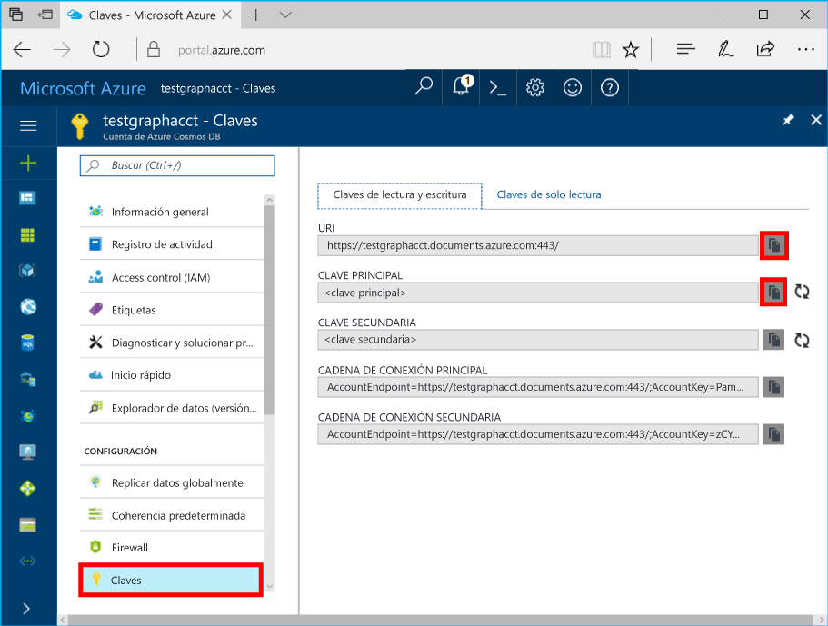

# <a name="azure-cosmos-db-build-a-nodejs-application-by-using-graph-api"></a>Azure Cosmos DB: compilación de una aplicación de Node.js mediante API Graph

Base de datos de Azure Cosmos es servicio de base de datos de varios modelos de hello globalmente distribuida de Microsoft. Puede crear y consultar documentos, clave/valor y bases de datos de gráfico, todos ellos se benefician de la distribución global de Hola y capacidades de escala horizontal en el núcleo de hello de la base de datos de Azure Cosmos rápidamente. 

Este artículo de inicio rápido muestra cómo toocreate una base de datos de Azure Cosmos cuenta para API Graph (versión preliminar), de gráfico y de base de datos a través de hello portal de Azure. A continuación, compilar y ejecutar una aplicación de consola mediante el uso de código abierto de hello [Gremlin Node.js](https://www.npmjs.com/package/gremlin-secure) controlador.  

> [!NOTE]
> módulo de npm Hello `gremlin-secure` es una versión modificada de `gremlin` módulo, compatible con SSL y SASL necesaria para conectar con base de datos de Azure Cosmos. El código fuente está disponible en [GitHub](https://github.com/CosmosDB/gremlin-javascript).
>

## <a name="prerequisites"></a>Requisitos previos

Para poder ejecutar este ejemplo, debe tener Hola siguiendo los requisitos previos:
* [Node.js](https://nodejs.org/en/) versión v0.10.29 o posterior
* [Git](http://git-scm.com/)

[!INCLUDE [quickstarts-free-trial-note](../../includes/quickstarts-free-trial-note.md)]

## <a name="create-a-database-account"></a>Creación de una cuenta de base de datos

[!INCLUDE [cosmos-db-create-dbaccount-graph](../../includes/cosmos-db-create-dbaccount-graph.md)]

## <a name="add-a-graph"></a>Agregar un grafo

[!INCLUDE [cosmos-db-create-graph](../../includes/cosmos-db-create-graph.md)]

## <a name="clone-hello-sample-application"></a>Clonar aplicación de ejemplo de Hola

Ahora vamos a clonar una API de Graph aplicación de GitHub, establezca la cadena de conexión de Hola y ejecútelo. Podrá ver lo fácil que es toowork con datos mediante programación. 

1. Abra una ventana de terminal de Git, como Git Bash y cambie (a través de `cd` comando) tooa directorio de trabajo.  

2. Ejecute hello después de repositorio de ejemplo de comando tooclone Hola. 

    ```bash
    git clone https://github.com/Azure-Samples/azure-cosmos-db-graph-nodejs-getting-started.git
    ```

3. Abra el archivo de solución de hello en Visual Studio. 

## <a name="review-hello-code"></a>Revise el código de hello

Vamos a hacer una revisión rápida de lo que sucede en la aplicación hello. Abra hello `app.js` archivo y encontrará Hola siguientes líneas de código. 

* se crea el cliente de Gremlin Hola.

    ```nodejs
    const client = Gremlin.createClient(
        443, 
        config.endpoint, 
        { 
            "session": false, 
            "ssl": true, 
            "user": `/dbs/${config.database}/colls/${config.collection}`,
            "password": config.primaryKey
        });
    ```

  Hello configuraciones están en `config.js`, lo que podemos editar Hola pasos de la sección.

* Una serie de pasos de Gremlin se ejecutan con hello `client.execute` método.

    ```nodejs
    console.log('Running Count'); 
    client.execute("g.V().count()", { }, (err, results) => {
        if (err) return console.error(err);
        console.log(JSON.stringify(results));
        console.log();
    });
    ```

## <a name="update-your-connection-string"></a>Actualizar la cadena de conexión

1. Archivo de config.js de hello abierto. 

2. En config.js, rellene la clave de config.endpoint Hola con hello **Gremlin URI** valor de hello **información general sobre** página del programa Hola a portal de Azure. 

    `config.endpoint = "GRAPHENDPOINT";`

    

   Si hello **Gremlin URI** valor está en blanco, puede generar el valor de Hola de hello **claves** página del portal de hello, con hello **URI** valor eliminación https:// y el cambio toographs de documentos.

   el punto de conexión de Hello Gremlin debe ser único nombre de host de hello sin número de puerto y protocolo de hello, como `mygraphdb.graphs.azure.com` (no `https://mygraphdb.graphs.azure.com` o `mygraphdb.graphs.azure.com:433`).

3. En config.js, rellene el valor de config.primaryKey Hola con hello **Primary Key** valor de hello **claves** página del programa Hola a portal de Azure. 

    `config.primaryKey = "PRIMARYKEY";`

   

4. Escriba el nombre de la base de datos de Hola y el nombre del gráfico (contenedor) para el valor de Hola de config.database y config.collection. 

Este es un ejemplo del aspecto que debería tener el archivo config.js completado:

```nodejs
var config = {}

// Note that this must not have HTTPS or hello port number
config.endpoint = "testgraphacct.graphs.azure.com";
config.primaryKey = "Pams6e7LEUS7LJ2Qk0fjZf3eGo65JdMWHmyn65i52w8ozPX2oxY3iP0yu05t9v1WymAHNcMwPIqNAEv3XDFsEg==";
config.database = "graphdb"
config.collection = "Persons"

module.exports = config;
```

## <a name="run-hello-console-app"></a>Ejecutar la aplicación de consola de hello

1. Abra una ventana de terminal y cambie (a través de `cd` comando) directorio de instalación de toohello de archivo package.json hello que se incluye en el proyecto de Hola.  

2. Ejecutar `npm install` tooinstall Hola necesario módulos npm, incluido `gremlin-secure`.

3. Ejecutar `node app.js` en un terminal toostart la aplicación de nodo.

## <a name="browse-with-data-explorer"></a>Examinar con el Explorador de datos

Ahora puede volver atrás tooData Explorer Hola tooview de portal de Azure, consultar, modificar y trabajar con los nuevos datos de gráfico.

En el Explorador de datos, base de datos nueva Hola aparece en hello **gráficos** panel. Expanda la base de datos de hello, seguido por la colección de hello, a continuación, haga clic en **gráfico**.

datos de Hello generados por la aplicación de ejemplo de Hola se muestran en panel siguiente de hello en hello **gráfico** ficha al hacer clic en **aplicar filtro**.

Intente completar `g.V()` con `.has('firstName', 'Thomas')` tootest filtro de Hola. Tenga en cuenta que el valor de hello distingue mayúsculas de minúsculas.

## <a name="review-slas-in-hello-azure-portal"></a>Revise los SLA de hello portal de Azure

[!INCLUDE [cosmosdb-tutorial-review-slas](../../includes/cosmos-db-tutorial-review-slas.md)]

## <a name="clean-up-your-resources"></a>Limpiar los recursos

Si no tiene previsto toocontinue usar esta aplicación, eliminar todos los recursos que ha creado en este artículo haciendo Hola siguiente: 

1. Hola portal de Azure, en el menú de navegación izquierdo de hello, haga clic en **grupos de recursos**y, a continuación, haga clic en nombre de hello del recurso de Hola que ha creado. 
2. En la página del grupo de recursos, haga clic en **eliminar**, escriba nombre Hola de hello recursos toobe eliminar y, a continuación, haga clic en **eliminar**.

## <a name="next-steps"></a>Pasos siguientes

En este artículo, ha aprendido cómo crear un gráfico mediante el Explorador de datos toocreate una cuenta de base de datos de Azure Cosmos y ejecutar una aplicación. Ahora puede usar Gremlin para implementar una lógica de recorrido del grafo eficaz y crear consultas más complejas. 

> [!div class="nextstepaction"]
> [Consulta mediante Gremlin](tutorial-query-graph.md)
