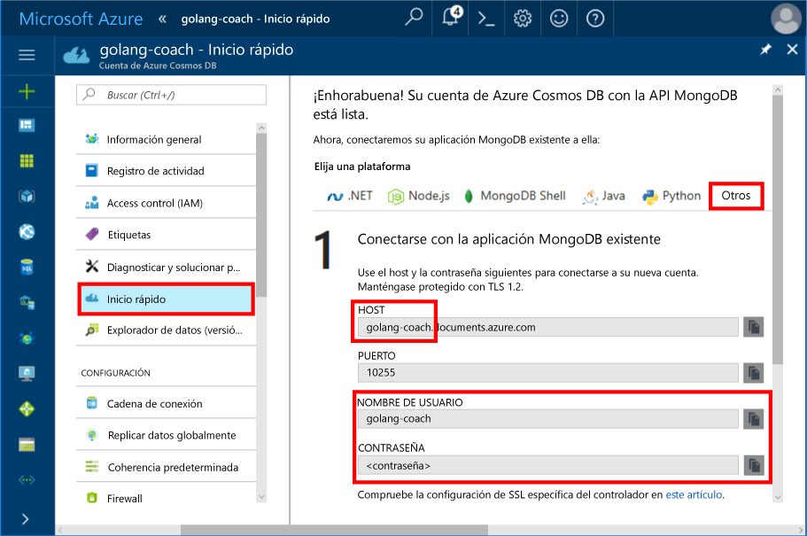
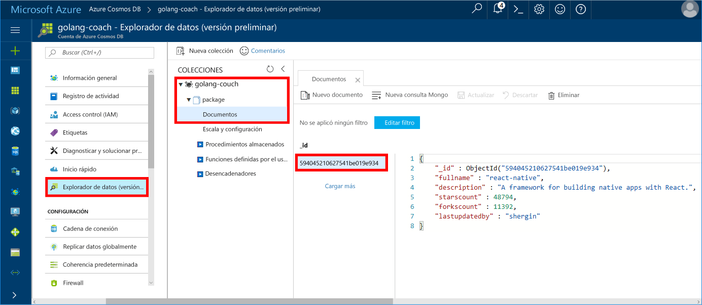

# <a name="azure-cosmos-db-build-a-mongodb-api-console-app-with-golang-and-hello-azure-portal"></a><span data-ttu-id="bf39e-103">Azure Cosmos DB: Compilar una aplicación de consola de API de MongoDB con Golang y Hola portal de Azure</span><span class="sxs-lookup"><span data-stu-id="bf39e-103">Azure Cosmos DB: Build a MongoDB API console app with Golang and hello Azure portal</span></span>

<span data-ttu-id="bf39e-104">Azure Cosmos DB es un servicio de base de datos con varios modelos y de distribución global de Microsoft.</span><span class="sxs-lookup"><span data-stu-id="bf39e-104">Azure Cosmos DB is Microsoft’s globally distributed multi-model database service.</span></span> <span data-ttu-id="bf39e-105">Puede crear y consultar documentos, clave/valor y bases de datos de gráfico, todos ellos se benefician de la distribución global de Hola y capacidades de escala horizontal en el núcleo de hello de la base de datos de Azure Cosmos rápidamente.</span><span class="sxs-lookup"><span data-stu-id="bf39e-105">You can quickly create and query document, key/value, and graph databases, all of which benefit from hello global distribution and horizontal scale capabilities at hello core of Azure Cosmos DB.</span></span>

<span data-ttu-id="bf39e-106">Este inicio rápido se muestra cómo toouse existente [MongoDB](https://docs.microsoft.com/en-us/azure/cosmos-db/mongodb-introduction) aplicación escrita en [Golang](https://golang.org/) y conéctelo tooyour base de datos de Azure Cosmos base de datos, que es compatible con conexiones de cliente de MongoDB.</span><span class="sxs-lookup"><span data-stu-id="bf39e-106">This quick-start demonstrates how toouse an existing [MongoDB](https://docs.microsoft.com/en-us/azure/cosmos-db/mongodb-introduction) app written in [Golang](https://golang.org/) and connect it tooyour Azure Cosmos DB database, which supports MongoDB client connections.</span></span>

<span data-ttu-id="bf39e-107">En otras palabras, la aplicación Golang sólo sabe que se está conectando con MongoDB APIs de base de datos de tooa.</span><span class="sxs-lookup"><span data-stu-id="bf39e-107">In other words, your Golang application only knows that it's connecting tooa database using MongoDB APIs.</span></span> <span data-ttu-id="bf39e-108">Es transparente toohello aplicación Hola a datos se almacena en la base de datos de Azure Cosmos.</span><span class="sxs-lookup"><span data-stu-id="bf39e-108">It is transparent toohello application that hello data is stored in Azure Cosmos DB.</span></span>

## <a name="prerequisites"></a><span data-ttu-id="bf39e-109">Requisitos previos</span><span class="sxs-lookup"><span data-stu-id="bf39e-109">Prerequisites</span></span>

- <span data-ttu-id="bf39e-110">Una suscripción de Azure.</span><span class="sxs-lookup"><span data-stu-id="bf39e-110">An Azure subscription.</span></span> <span data-ttu-id="bf39e-111">Si no tiene una suscripción a Azure, cree una [cuenta gratuita](https://azure.microsoft.com/free) antes de empezar.</span><span class="sxs-lookup"><span data-stu-id="bf39e-111">If you don’t have an Azure subscription, create a [free account](https://azure.microsoft.com/free) before you begin.</span></span>
- <span data-ttu-id="bf39e-112">[Vaya](https://golang.org/dl/) y un conocimiento básico de hello [vaya](https://golang.org/) language.</span><span class="sxs-lookup"><span data-stu-id="bf39e-112">[Go](https://golang.org/dl/) and a basic knowledge of hello [Go](https://golang.org/) language.</span></span>
- <span data-ttu-id="bf39e-113">Un IDE: [Gogland](https://www.jetbrains.com/go/) de Jetbrains, [Visual Studio Code](https://code.visualstudio.com/) de Microsoft o [Atom](https://atom.io/).</span><span class="sxs-lookup"><span data-stu-id="bf39e-113">An IDE — [Gogland](https://www.jetbrains.com/go/) by Jetbrains, [Visual Studio Code](https://code.visualstudio.com/) by Microsoft, or [Atom](https://atom.io/).</span></span> <span data-ttu-id="bf39e-114">En este tutorial, utilizo Goglang.</span><span class="sxs-lookup"><span data-stu-id="bf39e-114">In this tutorial, I'm using Goglang.</span></span>

<a id="create-account"></a>
## <a name="create-a-database-account"></a><span data-ttu-id="bf39e-115">Creación de una cuenta de base de datos</span><span class="sxs-lookup"><span data-stu-id="bf39e-115">Create a database account</span></span>

[!INCLUDE [cosmos-db-create-dbaccount](../../includes/cosmos-db-create-dbaccount-mongodb.md)]

## <a name="clone-hello-sample-application"></a><span data-ttu-id="bf39e-116">Clonar aplicación de ejemplo de Hola</span><span class="sxs-lookup"><span data-stu-id="bf39e-116">Clone hello sample application</span></span>

<span data-ttu-id="bf39e-117">Clonar aplicación de ejemplo de Hola e instalar paquetes de hello necesario.</span><span class="sxs-lookup"><span data-stu-id="bf39e-117">Clone hello sample application and install hello required packages.</span></span>

1. <span data-ttu-id="bf39e-118">Cree una carpeta denominada CosmosDBSample dentro de la carpeta de GOROOT\src de hello, que es C:\Go\ de forma predeterminada.</span><span class="sxs-lookup"><span data-stu-id="bf39e-118">Create a folder named CosmosDBSample inside hello GOROOT\src folder, which is C:\Go\ by default.</span></span>
2. <span data-ttu-id="bf39e-119">Ejecute hello siguiente comando con una ventana de terminal de git como repositorio de git bash tooclone Hola ejemplo en la carpeta de CosmosDBSample Hola.</span><span class="sxs-lookup"><span data-stu-id="bf39e-119">Run hello following command using a git terminal window such as git bash tooclone hello sample repository into hello CosmosDBSample folder.</span></span> 

    ```bash
    git clone https://github.com/Azure-Samples/azure-cosmos-db-mongodb-golang-getting-started.git
    ```
3.  <span data-ttu-id="bf39e-120">Ejecute hello después el paquete de comando tooget Hola mgo.</span><span class="sxs-lookup"><span data-stu-id="bf39e-120">Run hello following command tooget hello mgo package.</span></span> 

    ```
    go get gopkg.in/mgo.v2
    ```

<span data-ttu-id="bf39e-121">Hola [mgo](http://labix.org/mgo) controlador (pronunciado como *mango*) es una [MongoDB](http://www.mongodb.org/) controlador para hello [vaya lenguaje](http://golang.org/) que implementa un variado y probando selección de características en una API muy sencilla después estándares giros de Go.</span><span class="sxs-lookup"><span data-stu-id="bf39e-121">hello [mgo](http://labix.org/mgo) driver (pronounced as *mango*) is a [MongoDB](http://www.mongodb.org/) driver for hello [Go language](http://golang.org/) that implements a rich and well tested selection of features under a very simple API following standard Go idioms.</span></span>

<a id="connection-string"></a>

## <a name="update-your-connection-string"></a><span data-ttu-id="bf39e-122">Actualizar la cadena de conexión</span><span class="sxs-lookup"><span data-stu-id="bf39e-122">Update your connection string</span></span>

<span data-ttu-id="bf39e-123">Ahora vuelva atrás toohello tooget portal Azure la información de la cadena de conexión y se copia en la aplicación hello.</span><span class="sxs-lookup"><span data-stu-id="bf39e-123">Now go back toohello Azure portal tooget your connection string information and copy it into hello app.</span></span>

1. <span data-ttu-id="bf39e-124">Haga clic en **inicio rápido** en Hola menú de navegación izquierdo y, a continuación, haga clic en **otros** información de cadena de conexión tooview Hola requerido Hola aplicación Go.</span><span class="sxs-lookup"><span data-stu-id="bf39e-124">Click **Quick start** in hello left navigation menu, and then click **Other** tooview hello connection string information required by hello Go application.</span></span>

2. <span data-ttu-id="bf39e-125">En Goglang, abra el archivo de main.go de hello en el directorio de GOROOT\CosmosDBSample hello y actualice Hola siguientes líneas de código que usa la información de cadena de conexión de Hola de hello portal de Azure como se muestra en la siguiente captura de pantalla de Hola.</span><span class="sxs-lookup"><span data-stu-id="bf39e-125">In Goglang, open hello main.go file in hello GOROOT\CosmosDBSample directory and update hello following lines of code using hello connection string information from hello Azure portal as shown in hello following screenshot.</span></span> 

    <span data-ttu-id="bf39e-126">nombre de la base de datos de Hello es el prefijo de Hola de hello **Host** valor en el panel de cadena de conexión de portal de Azure Hola.</span><span class="sxs-lookup"><span data-stu-id="bf39e-126">hello Database name is hello prefix of hello **Host** value in hello Azure portal connection string pane.</span></span> <span data-ttu-id="bf39e-127">De la cuenta de hello que se muestra en la imagen de hello siguiente, nombre de la base de datos de hello es entrenador golang.</span><span class="sxs-lookup"><span data-stu-id="bf39e-127">For hello account shown in hello image below, hello Database name is golang-coach.</span></span>

    ```go
    Database: "hello prefix of hello Host value in hello Azure portal",
    Username: "hello Username in hello Azure portal",
    Password: "hello Password in hello Azure portal",
    ```

    

3. <span data-ttu-id="bf39e-129">Guarde el archivo de hello main.go.</span><span class="sxs-lookup"><span data-stu-id="bf39e-129">Save hello main.go file.</span></span>

## <a name="review-hello-code"></a><span data-ttu-id="bf39e-130">Revise el código de hello</span><span class="sxs-lookup"><span data-stu-id="bf39e-130">Review hello code</span></span>

<span data-ttu-id="bf39e-131">Vamos a hacer una revisión rápida de lo que ocurre en el archivo de hello main.go.</span><span class="sxs-lookup"><span data-stu-id="bf39e-131">Let's make a quick review of what's happening in hello main.go file.</span></span> 

### <a name="connecting-hello-go-app-tooazure-cosmos-db"></a><span data-ttu-id="bf39e-132">Conectar Hola Go aplicación tooAzure Cosmos DB</span><span class="sxs-lookup"><span data-stu-id="bf39e-132">Connecting hello Go app tooAzure Cosmos DB</span></span>

<span data-ttu-id="bf39e-133">Base de datos de Azure Cosmos admite Hola MongoDB SSL habilitado.</span><span class="sxs-lookup"><span data-stu-id="bf39e-133">Azure Cosmos DB supports hello SSL-enabled MongoDB.</span></span> <span data-ttu-id="bf39e-134">tooconnect tooan MongoDB habilitado para SSL, necesita hello toodefine **DialServer** funcionando en [mgo. DialInfo](http://gopkg.in/mgo.v2#DialInfo)y asegúrese de usar de hello [tls. *Acceso telefónico* ](http://golang.org/pkg/crypto/tls#Dial) función conexión de hello tooperform.</span><span class="sxs-lookup"><span data-stu-id="bf39e-134">tooconnect tooan SSL-enabled MongoDB, you need toodefine hello **DialServer** function in [mgo.DialInfo](http://gopkg.in/mgo.v2#DialInfo), and make use of hello [tls.*Dial*](http://golang.org/pkg/crypto/tls#Dial) function tooperform hello connection.</span></span>

<span data-ttu-id="bf39e-135">Hola siguiente fragmento de código de Golang conecta Hola aplicación vaya a la base de datos MongoDB API de Azure Cosmos.</span><span class="sxs-lookup"><span data-stu-id="bf39e-135">hello following Golang code snippet connects hello Go app with Azure Cosmos DB MongoDB API.</span></span> <span data-ttu-id="bf39e-136">Hola *DialInfo* clase contiene opciones para establecer una sesión con un clúster de MongoDB.</span><span class="sxs-lookup"><span data-stu-id="bf39e-136">hello *DialInfo* class holds options for establishing a session with a MongoDB cluster.</span></span>

```go
// DialInfo holds options for establishing a session with a MongoDB cluster.
dialInfo := &mgo.DialInfo{
    Addrs:    []string{"golang-couch.documents.azure.com:10255"}, // Get HOST + PORT
    Timeout:  60 * time.Second,
    Database: "database", // It can be anything
    Username: "username", // Username
    Password: "Azure database connect password from Azure Portal", // PASSWORD
    DialServer: func(addr *mgo.ServerAddr) (net.Conn, error) {
        return tls.Dial("tcp", addr.String(), &tls.Config{})
    },
}

// Create a session which maintains a pool of socket connections
// tooour Azure Cosmos DB MongoDB database.
session, err := mgo.DialWithInfo(dialInfo)

if err != nil {
    fmt.Printf("Can't connect toomongo, go error %v\n", err)
    os.Exit(1)
}

defer session.Close()

// SetSafe changes hello session safety mode.
// If hello safe parameter is nil, hello session is put in unsafe mode, 
// and writes become fire-and-forget,
// without error checking. hello unsafe mode is faster since operations won't hold on waiting for a confirmation.
// 
session.SetSafe(&mgo.Safe{})
```

<span data-ttu-id="bf39e-137">Hola **mgo. Dial()** método se utiliza cuando no hay ninguna conexión de SSL.</span><span class="sxs-lookup"><span data-stu-id="bf39e-137">hello **mgo.Dial()** method is used when there is no SSL connection.</span></span> <span data-ttu-id="bf39e-138">Para una conexión SSL, Hola **mgo. DialWithInfo()** método es necesario.</span><span class="sxs-lookup"><span data-stu-id="bf39e-138">For an SSL connection, hello **mgo.DialWithInfo()** method is required.</span></span>

<span data-ttu-id="bf39e-139">Una instancia de hello **{} DialWIthInfo** es objeto de sesión de hello toocreate usado.</span><span class="sxs-lookup"><span data-stu-id="bf39e-139">An instance of hello **DialWIthInfo{}** object is used toocreate hello session object.</span></span> <span data-ttu-id="bf39e-140">Una vez establecida la sesión de hello, puede tener acceso a colección Hola utilizando el siguiente fragmento de código de hello:</span><span class="sxs-lookup"><span data-stu-id="bf39e-140">Once hello session is established, you can access hello collection by using hello following code snippet:</span></span>

```go
collection := session.DB(“database”).C(“package”)
```

<a id="create-document"></a>

### <a name="create-a-document"></a><span data-ttu-id="bf39e-141">Creación de un documento</span><span class="sxs-lookup"><span data-stu-id="bf39e-141">Create a document</span></span>

```go
// Model
type Package struct {
    Id bson.ObjectId  `bson:"_id,omitempty"`
    FullName      string
    Description   string
    StarsCount    int
    ForksCount    int
    LastUpdatedBy string
}

// insert Document in collection
err = collection.Insert(&Package{
    FullName:"react",
    Description:"A framework for building native apps with React.",
    ForksCount: 11392,
    StarsCount:48794,
    LastUpdatedBy:"shergin",

})

if err != nil {
    log.Fatal("Problem inserting data: ", err)
    return
}
```

### <a name="query-or-read-a-document"></a><span data-ttu-id="bf39e-142">Realizar consultas o leer un documento</span><span class="sxs-lookup"><span data-stu-id="bf39e-142">Query or read a document</span></span>

<span data-ttu-id="bf39e-143">Azure Cosmos DB admite consultas enriquecidas en los documentos JSON que se almacenan en las colecciones.</span><span class="sxs-lookup"><span data-stu-id="bf39e-143">Azure Cosmos DB supports rich queries against JSON documents stored in each collection.</span></span> <span data-ttu-id="bf39e-144">Hello código de ejemplo siguiente muestra una consulta que se pueden ejecutar en documentos de hello en la colección.</span><span class="sxs-lookup"><span data-stu-id="bf39e-144">hello following sample code shows a query that you can run against hello documents in your collection.</span></span>

```go
// Get a Document from hello collection
result := Package{}
err = collection.Find(bson.M{"fullname": "react"}).One(&result)
if err != nil {
    log.Fatal("Error finding record: ", err)
    return
}

fmt.Println("Description:", result.Description)
```


### <a name="update-a-document"></a><span data-ttu-id="bf39e-145">Actualización de un documento</span><span class="sxs-lookup"><span data-stu-id="bf39e-145">Update a document</span></span>

```go
// Update a document
updateQuery := bson.M{"_id": result.Id}
change := bson.M{"$set": bson.M{"fullname": "react-native"}}
err = collection.Update(updateQuery, change)
if err != nil {
    log.Fatal("Error updating record: ", err)
    return
}
```

### <a name="delete-a-document"></a><span data-ttu-id="bf39e-146">Eliminar un documento</span><span class="sxs-lookup"><span data-stu-id="bf39e-146">Delete a document</span></span>

<span data-ttu-id="bf39e-147">Azure Cosmos DB admite la eliminación de documentos JSON.</span><span class="sxs-lookup"><span data-stu-id="bf39e-147">Azure Cosmos DB supports deleting JSON documents.</span></span>

```go
// Delete a document
query := bson.M{"_id": result.Id}
err = collection.Remove(query)
if err != nil {
   log.Fatal("Error deleting record: ", err)
   return
}
```
    
## <a name="run-hello-app"></a><span data-ttu-id="bf39e-148">Ejecutar aplicación hello</span><span class="sxs-lookup"><span data-stu-id="bf39e-148">Run hello app</span></span>

1. <span data-ttu-id="bf39e-149">En Goglang, asegúrese de que su GOPATH (disponible en **archivo**, **configuración**, **vaya**, **GOPATH**) incluyan la ubicación de hello en qué Hola gopkg se instaló, que es USERPROFILE\go de forma predeterminada.</span><span class="sxs-lookup"><span data-stu-id="bf39e-149">In Goglang, ensure that your GOPATH (available under **File**, **Settings**, **Go**, **GOPATH**) include hello location in which hello gopkg was installed, which is USERPROFILE\go by default.</span></span> 
2. <span data-ttu-id="bf39e-150">Comentario líneas de Hola que eliminar el documento de hello, líneas 91-96, para que puedan ver el documento de hello después de la aplicación hello en ejecución.</span><span class="sxs-lookup"><span data-stu-id="bf39e-150">Comment out hello lines that delete hello document, lines 91-96, so that you can see hello document after running hello app.</span></span>
3. <span data-ttu-id="bf39e-151">En Goglang, haga clic en **Ejecutar**y, a continuación, haga clic en **Ejecutar "Build main.go and run"**.</span><span class="sxs-lookup"><span data-stu-id="bf39e-151">In Goglang, click **Run**, and then click **Run 'Build main.go and run'**.</span></span>

    <span data-ttu-id="bf39e-152">aplicación Hello finaliza y muestra la descripción de Hola Hola del documento de creado en [crear un documento](#create-document).</span><span class="sxs-lookup"><span data-stu-id="bf39e-152">hello app finishes and displays hello description of hello document created in [Create a document](#create-document).</span></span>
    
    ```
    Description: A framework for building native apps with React.
    
    Process finished with exit code 0
    ```

    
    
## <a name="review-your-document-in-data-explorer"></a><span data-ttu-id="bf39e-154">Revisar el documento en el Explorador de datos</span><span class="sxs-lookup"><span data-stu-id="bf39e-154">Review your document in Data Explorer</span></span>

<span data-ttu-id="bf39e-155">Volver atrás toohello toosee portal Azure el documento en el Explorador de datos.</span><span class="sxs-lookup"><span data-stu-id="bf39e-155">Go back toohello Azure portal toosee your document in Data Explorer.</span></span>

1. <span data-ttu-id="bf39e-156">Haga clic en **Explorador de datos (vista previa)** en el menú de navegación izquierdo de hello, expanda **golang entrenador**, **paquete**y, a continuación, haga clic en **documentos**.</span><span class="sxs-lookup"><span data-stu-id="bf39e-156">Click **Data Explorer (Preview)** in hello left navigation menu, expand **golang-coach**, **package**, and then click **Documents**.</span></span> <span data-ttu-id="bf39e-157">Hola **documentos** , haga clic en hello \_documento de hello toodisplay de Id. en el panel derecho de Hola.</span><span class="sxs-lookup"><span data-stu-id="bf39e-157">In hello **Documents** tab, click hello \_id toodisplay hello document in hello right pane.</span></span> 

    
    
2. <span data-ttu-id="bf39e-159">Puede trabajar con el documento de hello en línea y haga clic en **actualización** toosave lo.</span><span class="sxs-lookup"><span data-stu-id="bf39e-159">You can then work with hello document inline and click **Update** toosave it.</span></span> <span data-ttu-id="bf39e-160">También puede eliminar el documento de hello, o crear nuevos documentos o las consultas.</span><span class="sxs-lookup"><span data-stu-id="bf39e-160">You can also delete hello document, or create new documents or queries.</span></span>

## <a name="review-slas-in-hello-azure-portal"></a><span data-ttu-id="bf39e-161">Revise los SLA de hello portal de Azure</span><span class="sxs-lookup"><span data-stu-id="bf39e-161">Review SLAs in hello Azure portal</span></span>

[!INCLUDE [cosmosdb-tutorial-review-slas](../../includes/cosmos-db-tutorial-review-slas.md)]

## <a name="clean-up-resources"></a><span data-ttu-id="bf39e-162">Limpieza de recursos</span><span class="sxs-lookup"><span data-stu-id="bf39e-162">Clean up resources</span></span>

<span data-ttu-id="bf39e-163">Si no va toocontinue toouse esta aplicación, eliminar todos los recursos creados por este tutorial rápido de hello portal de Azure con hello pasos:</span><span class="sxs-lookup"><span data-stu-id="bf39e-163">If you're not going toocontinue toouse this app, delete all resources created by this quickstart in hello Azure portal with hello following steps:</span></span>

1. <span data-ttu-id="bf39e-164">En el menú de la izquierda de Hola Hola portal de Azure, haga clic en **grupos de recursos** y, a continuación, haga clic en nombre de hello del recurso de Hola que creó.</span><span class="sxs-lookup"><span data-stu-id="bf39e-164">From hello left-hand menu in hello Azure portal, click **Resource groups** and then click hello name of hello resource you created.</span></span> 
2. <span data-ttu-id="bf39e-165">En la página del grupo de recursos, haga clic en **eliminar**, escriba el nombre de Hola de hello recursos toodelete en el cuadro de texto hello y, a continuación, haga clic en **eliminar**.</span><span class="sxs-lookup"><span data-stu-id="bf39e-165">On your resource group page, click **Delete**, type hello name of hello resource toodelete in hello text box, and then click **Delete**.</span></span>

## <a name="next-steps"></a><span data-ttu-id="bf39e-166">Pasos siguientes</span><span class="sxs-lookup"><span data-stu-id="bf39e-166">Next steps</span></span>

<span data-ttu-id="bf39e-167">En este tutorial, ha aprendido cómo toocreate una cuenta de base de datos de Azure Cosmos y ejecutar una aplicación Golang con Hola API para MongoDB.</span><span class="sxs-lookup"><span data-stu-id="bf39e-167">In this quickstart, you've learned how toocreate an Azure Cosmos DB account and run a Golang app using hello API for MongoDB.</span></span> <span data-ttu-id="bf39e-168">Ahora puede importar la cuenta de base de datos de Cosmos tooyour datos adicionales.</span><span class="sxs-lookup"><span data-stu-id="bf39e-168">You can now import additional data tooyour Cosmos DB account.</span></span> 

> [!div class="nextstepaction"]
> [<span data-ttu-id="bf39e-169">Importar datos en la base de datos de Azure Cosmos para hello API de MongoDB</span><span class="sxs-lookup"><span data-stu-id="bf39e-169">Import data into Azure Cosmos DB for hello MongoDB API</span></span>](mongodb-migrate.md)
