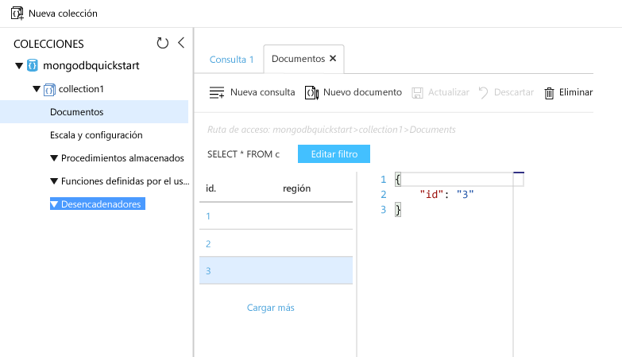

# <a name="azure-cosmos-db-migrate-an-existing-nodejs-mongodb-web-app"></a><span data-ttu-id="a8e5f-103">Azure Cosmos DB: Migrar una aplicación web MongoDB de Node.js</span><span class="sxs-lookup"><span data-stu-id="a8e5f-103">Azure Cosmos DB: Migrate an existing Node.js MongoDB web app</span></span> 

<span data-ttu-id="a8e5f-104">Azure Cosmos DB es un servicio de base de datos con varios modelos y de distribución global de Microsoft.</span><span class="sxs-lookup"><span data-stu-id="a8e5f-104">Azure Cosmos DB is Microsoft’s globally distributed multi-model database service.</span></span> <span data-ttu-id="a8e5f-105">Puede crear rápidamente bases de datos de documentos, clave-valor y grafos, y realizar consultas en ellas. Todas las bases de datos se beneficiarán de las funcionalidades de distribución global y escala horizontal en Azure Cosmos DB.</span><span class="sxs-lookup"><span data-stu-id="a8e5f-105">You can quickly create and query document, key/value, and graph databases, all of which benefit from the global distribution and horizontal scale capabilities at the core of Azure Cosmos DB.</span></span> 

<span data-ttu-id="a8e5f-106">En esta guía de inicio rápido se muestra cómo se usa una aplicación existente [MongoDB](mongodb-introduction.md) escrita en Node.js y cómo se conecta a la base de datos de Azure Cosmos DB, que es compatible con conexiones de cliente de MongoDB.</span><span class="sxs-lookup"><span data-stu-id="a8e5f-106">This quickstart demonstrates how to use an existing [MongoDB](mongodb-introduction.md) app written in Node.js and connect it to your Azure Cosmos DB database, which supports MongoDB client connections.</span></span> <span data-ttu-id="a8e5f-107">En otras palabras, la aplicación Node.js solo sabe que se está conectando a una base de datos mediante API de MongoDB.</span><span class="sxs-lookup"><span data-stu-id="a8e5f-107">In other words, your Node.js application only knows that it's connecting to a database using MongoDB APIs.</span></span> <span data-ttu-id="a8e5f-108">Para la aplicación resulta transparente que los datos se almacenan en Azure Cosmos DB.</span><span class="sxs-lookup"><span data-stu-id="a8e5f-108">It is transparent to the application that the data is stored in Azure Cosmos DB.</span></span>

<span data-ttu-id="a8e5f-109">Cuando haya terminado, tendrá una aplicación MEAN (MongoDB, Express, AngularJS y Node.js) que se ejecuta en [Azure Cosmos DB](https://azure.microsoft.com/services/cosmos-db/).</span><span class="sxs-lookup"><span data-stu-id="a8e5f-109">When you are done, you will have a MEAN application (MongoDB, Express, AngularJS, and Node.js) running on [Azure Cosmos DB](https://azure.microsoft.com/services/cosmos-db/).</span></span> 


[!INCLUDE [cloud-shell-try-it](../../includes/cloud-shell-try-it.md)]

<span data-ttu-id="a8e5f-111">Si decide instalar y usar la CLI localmente, para este tema es preciso que ejecute la CLI de Azure versión 2.0 o posterior.</span><span class="sxs-lookup"><span data-stu-id="a8e5f-111">If you choose to install and use the CLI locally, this topic requires that you are running the Azure CLI version 2.0 or later.</span></span> <span data-ttu-id="a8e5f-112">Ejecute `az --version` para encontrar la versión.</span><span class="sxs-lookup"><span data-stu-id="a8e5f-112">Run `az --version` to find the version.</span></span> <span data-ttu-id="a8e5f-113">Si necesita instalarla o actualizarla, consulte [Instalación de la CLI de Azure 2.0]( /cli/azure/install-azure-cli).</span><span class="sxs-lookup"><span data-stu-id="a8e5f-113">If you need to install or upgrade, see [Install Azure CLI 2.0]( /cli/azure/install-azure-cli).</span></span> 

## <a name="prerequisites"></a><span data-ttu-id="a8e5f-114">Requisitos previos</span><span class="sxs-lookup"><span data-stu-id="a8e5f-114">Prerequisites</span></span> 
<span data-ttu-id="a8e5f-115">Para ejecutar los comandos `npm` y `git`, además de la CLI de Azure, debería tener instalados localmente [Node.js](https://nodejs.org/) y [Git](http://www.git-scm.com/downloads).</span><span class="sxs-lookup"><span data-stu-id="a8e5f-115">In addition to Azure CLI, you need [Node.js](https://nodejs.org/) and [Git](http://www.git-scm.com/downloads) installed locally to run `npm` and `git` commands.</span></span>

<span data-ttu-id="a8e5f-116">Debe tener conocimientos prácticos de Node.js.</span><span class="sxs-lookup"><span data-stu-id="a8e5f-116">You should have working knowledge of Node.js.</span></span> <span data-ttu-id="a8e5f-117">Esta guía de inicio rápido no está pensada para ayudarle a desarrollar aplicaciones Node.js en general.</span><span class="sxs-lookup"><span data-stu-id="a8e5f-117">This quickstart is not intended to help you with developing Node.js applications in general.</span></span>

## <a name="clone-the-sample-application"></a><span data-ttu-id="a8e5f-118">Clonación de la aplicación de ejemplo</span><span class="sxs-lookup"><span data-stu-id="a8e5f-118">Clone the sample application</span></span>

<span data-ttu-id="a8e5f-119">Abra una ventana de terminal de Git, como Git Bash, y `cd` en un directorio de trabajo.</span><span class="sxs-lookup"><span data-stu-id="a8e5f-119">Open a git terminal window, such as git bash, and `cd` to a working directory.</span></span>  

<span data-ttu-id="a8e5f-120">Ejecute los comandos siguientes para clonar el repositorio de ejemplo.</span><span class="sxs-lookup"><span data-stu-id="a8e5f-120">Run the following commands to clone the sample repository.</span></span> <span data-ttu-id="a8e5f-121">Este repositorio de ejemplo contiene una aplicación [MEAN.js](http://meanjs.org/) predeterminada.</span><span class="sxs-lookup"><span data-stu-id="a8e5f-121">This sample repository contains the default [MEAN.js](http://meanjs.org/) application.</span></span> 

```bash
git clone https://github.com/prashanthmadi/mean
```

## <a name="run-the-application"></a><span data-ttu-id="a8e5f-122">Ejecución de la aplicación</span><span class="sxs-lookup"><span data-stu-id="a8e5f-122">Run the application</span></span>

<span data-ttu-id="a8e5f-123">Instale los paquetes necesarios e inicie la aplicación.</span><span class="sxs-lookup"><span data-stu-id="a8e5f-123">Install the required packages and start the application.</span></span>

```bash
cd mean
npm install
npm start
```

## <a name="log-in-to-azure"></a><span data-ttu-id="a8e5f-124">Inicie sesión en Azure.</span><span class="sxs-lookup"><span data-stu-id="a8e5f-124">Log in to Azure</span></span>

<span data-ttu-id="a8e5f-125">Si usa una CLI de Azure instalada, inicie sesión en la suscripción de Azure con el comando [az login](/cli/azure/#login) y siga las instrucciones de la pantalla.</span><span class="sxs-lookup"><span data-stu-id="a8e5f-125">If you are using an installed Azure CLI, log in to your Azure subscription with the [az login](/cli/azure/#login) command and follow the on-screen directions.</span></span> <span data-ttu-id="a8e5f-126">Puede omitir este paso si usa Azure Cloud Shell.</span><span class="sxs-lookup"><span data-stu-id="a8e5f-126">You can skip this step if you're using the Azure Cloud Shell.</span></span>

```azurecli
az login 
``` 
   
## <a name="add-the-azure-cosmos-db-module"></a><span data-ttu-id="a8e5f-127">Agregar el módulo de Azure Cosmos DB</span><span class="sxs-lookup"><span data-stu-id="a8e5f-127">Add the Azure Cosmos DB module</span></span>

<span data-ttu-id="a8e5f-128">Si va a usar una CLI de Azure instalada, ejecute el comando `az` para comprobar si el componente `cosmosdb` ya está instalado.</span><span class="sxs-lookup"><span data-stu-id="a8e5f-128">If you are using an installed Azure CLI, check to see if the `cosmosdb` component is already installed by running the `az` command.</span></span> <span data-ttu-id="a8e5f-129">Si `cosmosdb` está en la lista de comandos de referencia, continúe con el comando siguiente.</span><span class="sxs-lookup"><span data-stu-id="a8e5f-129">If `cosmosdb` is in the list of base commands, proceed to the next command.</span></span> <span data-ttu-id="a8e5f-130">Puede omitir este paso si usa Azure Cloud Shell.</span><span class="sxs-lookup"><span data-stu-id="a8e5f-130">You can skip this step if you're using the Azure Cloud Shell.</span></span>

<span data-ttu-id="a8e5f-131">Si `cosmosdb` no está en la lista de comandos de referencia, vuelva a instalar la [CLI de Azure 2.0]( /cli/azure/install-azure-cli).</span><span class="sxs-lookup"><span data-stu-id="a8e5f-131">If `cosmosdb` is not in the list of base commands, reinstall [Azure CLI 2.0]( /cli/azure/install-azure-cli).</span></span>

## <a name="create-a-resource-group"></a><span data-ttu-id="a8e5f-132">Crear un grupo de recursos</span><span class="sxs-lookup"><span data-stu-id="a8e5f-132">Create a resource group</span></span>

<span data-ttu-id="a8e5f-133">Cree un [grupo de recursos](../azure-resource-manager/resource-group-overview.md) con el comando [az group create](/cli/azure/group#create).</span><span class="sxs-lookup"><span data-stu-id="a8e5f-133">Create a [resource group](../azure-resource-manager/resource-group-overview.md) with the [az group create](/cli/azure/group#create).</span></span> <span data-ttu-id="a8e5f-134">Un grupo de recursos de Azure es un contenedor lógico en el que se implementan y se administran recursos de Azure como aplicaciones web, bases de datos y cuentas de almacenamiento.</span><span class="sxs-lookup"><span data-stu-id="a8e5f-134">An Azure resource group is a logical container into which Azure resources like web apps, databases and storage accounts are deployed and managed.</span></span> 

<span data-ttu-id="a8e5f-135">En el ejemplo siguiente se crea un grupo de recursos en la región de Europa Occidental.</span><span class="sxs-lookup"><span data-stu-id="a8e5f-135">The following example creates a resource group in the West Europe region.</span></span> <span data-ttu-id="a8e5f-136">Elija un nombre único para el grupo de recursos.</span><span class="sxs-lookup"><span data-stu-id="a8e5f-136">Choose a unique name for the resource group.</span></span>

<span data-ttu-id="a8e5f-137">Si usa Azure Cloud Shell, haga clic en **Probarlo**, siga las indicaciones de la pantalla para iniciar sesión y, a continuación, copie el comando en el símbolo del sistema.</span><span class="sxs-lookup"><span data-stu-id="a8e5f-137">If you are using Azure Cloud Shell, click **Try It**, follow the onscreen prompts to login, then copy the command into the command prompt.</span></span>

```azurecli-interactive
az group create --name myResourceGroup --location "West Europe"
```

## <a name="create-an-azure-cosmos-db-account"></a><span data-ttu-id="a8e5f-138">Creación de una cuenta de Azure Cosmos DB</span><span class="sxs-lookup"><span data-stu-id="a8e5f-138">Create an Azure Cosmos DB account</span></span>

<span data-ttu-id="a8e5f-139">Cree una cuenta de Azure Cosmos DB con el comando [az cosmosdb create](/cli/azure/cosmosdb#create).</span><span class="sxs-lookup"><span data-stu-id="a8e5f-139">Create an Azure Cosmos DB account with the [az cosmosdb create](/cli/azure/cosmosdb#create) command.</span></span>

<span data-ttu-id="a8e5f-140">En el comando siguiente, sustituya su propio nombre único de la cuenta de Azure Cosmos DB donde vea el marcador de posición `<cosmosdb-name>`.</span><span class="sxs-lookup"><span data-stu-id="a8e5f-140">In the following command, please substitute your own unique Azure Cosmos DB account name where you see the `<cosmosdb-name>` placeholder.</span></span> <span data-ttu-id="a8e5f-141">Este nombre único se usará como parte del punto de conexión de Azure Cosmos DB (`https://<cosmosdb-name>.documents.azure.com/`), por lo que debe ser único entre todas las cuentas de Azure Cosmos DB de Azure.</span><span class="sxs-lookup"><span data-stu-id="a8e5f-141">This unique name will be used as part of your Azure Cosmos DB endpoint (`https://<cosmosdb-name>.documents.azure.com/`), so the name needs to be unique across all Azure Cosmos DB accounts in Azure.</span></span> 

```azurecli-interactive
az cosmosdb create --name <cosmosdb-name> --resource-group myResourceGroup --kind MongoDB
```

<span data-ttu-id="a8e5f-142">El parámetro `--kind MongoDB` habilita las conexiones de cliente de MongoDB.</span><span class="sxs-lookup"><span data-stu-id="a8e5f-142">The `--kind MongoDB` parameter enables MongoDB client connections.</span></span>

<span data-ttu-id="a8e5f-143">Cuando se crea la cuenta de Azure Cosmos DB, la CLI de Azure muestra información similar a la del ejemplo siguiente.</span><span class="sxs-lookup"><span data-stu-id="a8e5f-143">When the Azure Cosmos DB account is created, the Azure CLI shows information similar to the following example.</span></span> 

> [!NOTE]
> <span data-ttu-id="a8e5f-144">Este ejemplo usa JSON como el formato de salida de la CLI de Azure, que es el valor predeterminado.</span><span class="sxs-lookup"><span data-stu-id="a8e5f-144">This example uses JSON as the Azure CLI output format, which is the default.</span></span> <span data-ttu-id="a8e5f-145">Para usar otro formato de salida, consulte [Formatos de salida de los comandos de la CLI de Azure 2.0](https://docs.microsoft.com/cli/azure/format-output-azure-cli).</span><span class="sxs-lookup"><span data-stu-id="a8e5f-145">To use another output format, see [Output formats for Azure CLI 2.0 commands](https://docs.microsoft.com/cli/azure/format-output-azure-cli).</span></span>

```json
{
  "databaseAccountOfferType": "Standard",
  "documentEndpoint": "https://<cosmosdb-name>.documents.azure.com:443/",
  "id": "/subscriptions/00000000-0000-0000-0000-000000000000/resourceGroups/myResourceGroup/providers/Microsoft.Document
DB/databaseAccounts/<cosmosdb-name>",
  "kind": "MongoDB",
  "location": "West Europe",
  "name": "<cosmosdb-name>",
  "readLocations": [
    {
      "documentEndpoint": "https://<cosmosdb-name>-westeurope.documents.azure.com:443/",
      "failoverPriority": 0,
      "id": "<cosmosdb-name>-westeurope",
      "locationName": "West Europe",
      "provisioningState": "Succeeded"
    }
  ],
  "resourceGroup": "myResourceGroup",
  "type": "Microsoft.DocumentDB/databaseAccounts",
  "writeLocations": [
    {
      "documentEndpoint": "https://<cosmosdb-name>-westeurope.documents.azure.com:443/",
      "failoverPriority": 0,
      "id": "<cosmosdb-name>-westeurope",
      "locationName": "West Europe",
      "provisioningState": "Succeeded"
    }
  ]
} 
```

## <a name="connect-your-nodejs-application-to-the-database"></a><span data-ttu-id="a8e5f-146">Conexión de la aplicación Node.js a la base de datos</span><span class="sxs-lookup"><span data-stu-id="a8e5f-146">Connect your Node.js application to the database</span></span>

<span data-ttu-id="a8e5f-147">En este paso, conectará la aplicación de ejemplo MEAN.js a la base de datos de Azure Cosmos DB que acaba de crear mediante una cadena de conexión de MongoDB.</span><span class="sxs-lookup"><span data-stu-id="a8e5f-147">In this step, you connect your MEAN.js sample application to an Azure Cosmos DB database you just created, using a MongoDB connection string.</span></span> 

<a name="devconfig"></a>
## <a name="configure-the-connection-string-in-your-nodejs-application"></a><span data-ttu-id="a8e5f-148">Configuración de la cadena de conexión en la aplicación Node.js</span><span class="sxs-lookup"><span data-stu-id="a8e5f-148">Configure the connection string in your Node.js application</span></span>

<span data-ttu-id="a8e5f-149">En el repositorio de MEAN.js, abra `config/env/local-development.js`.</span><span class="sxs-lookup"><span data-stu-id="a8e5f-149">In your MEAN.js repository, open `config/env/local-development.js`.</span></span>

<span data-ttu-id="a8e5f-150">Reemplace el contenido de este archivo por el código siguiente.</span><span class="sxs-lookup"><span data-stu-id="a8e5f-150">Replace the content of this file with the following code.</span></span> <span data-ttu-id="a8e5f-151">No olvide reemplazar los dos marcadores de posición `<cosmosdb-name>` con el nombre de la cuenta de Azure Cosmos DB.</span><span class="sxs-lookup"><span data-stu-id="a8e5f-151">Be sure to also replace the two `<cosmosdb-name>` placeholders with your Azure Cosmos DB account name.</span></span>

```javascript
'use strict';

module.exports = {
  db: {
    uri: 'mongodb://<cosmosdb-name>:<primary_master_key>@<cosmosdb-name>.documents.azure.com:10255/mean-dev?ssl=true&sslverifycertificate=false'
  }
};
```

## <a name="retrieve-the-key"></a><span data-ttu-id="a8e5f-152">Recuperar la clave</span><span class="sxs-lookup"><span data-stu-id="a8e5f-152">Retrieve the key</span></span>

<span data-ttu-id="a8e5f-153">Para conectarse a una base de datos de Azure Cosmos DB, necesita la clave de base de datos.</span><span class="sxs-lookup"><span data-stu-id="a8e5f-153">In order to connect to an Azure Cosmos DB database, you need the database key.</span></span> <span data-ttu-id="a8e5f-154">Use el comando [az cosmosdb list-keys](/cli/azure/cosmosdb#list-keys) para recuperar la clave principal.</span><span class="sxs-lookup"><span data-stu-id="a8e5f-154">Use the [az cosmosdb list-keys](/cli/azure/cosmosdb#list-keys) command to retrieve the primary key.</span></span>

```azurecli-interactive
az cosmosdb list-keys --name <cosmosdb-name> --resource-group myResourceGroup --query "primaryMasterKey"
```

<span data-ttu-id="a8e5f-155">La CLI de Azure genera información similar a la del ejemplo siguiente.</span><span class="sxs-lookup"><span data-stu-id="a8e5f-155">The Azure CLI outputs information similar to the following example.</span></span> 

```json
"RUayjYjixJDWG5xTqIiXjC..."
```

<span data-ttu-id="a8e5f-156">Copie el valor de `primaryMasterKey`.</span><span class="sxs-lookup"><span data-stu-id="a8e5f-156">Copy the value of `primaryMasterKey`.</span></span> <span data-ttu-id="a8e5f-157">Péguelo en la `<primary_master_key>` en `local-development.js`.</span><span class="sxs-lookup"><span data-stu-id="a8e5f-157">Paste this over the  `<primary_master_key>` in `local-development.js`.</span></span>

<span data-ttu-id="a8e5f-158">Guarde los cambios.</span><span class="sxs-lookup"><span data-stu-id="a8e5f-158">Save your changes.</span></span>

### <a name="run-the-application-again"></a><span data-ttu-id="a8e5f-159">Vuelva a ejecutar la aplicación.</span><span class="sxs-lookup"><span data-stu-id="a8e5f-159">Run the application again.</span></span>

<span data-ttu-id="a8e5f-160">Vuelva a ejecutar `npm start`.</span><span class="sxs-lookup"><span data-stu-id="a8e5f-160">Run `npm start` again.</span></span> 

```bash
npm start
```

<span data-ttu-id="a8e5f-161">Un mensaje de consola debería indicarle que el entorno de desarrollo está en funcionamiento.</span><span class="sxs-lookup"><span data-stu-id="a8e5f-161">A console message should now tell you that the development environment is up and running.</span></span> 

<span data-ttu-id="a8e5f-162">Vaya a `http://localhost:3000` en un explorador.</span><span class="sxs-lookup"><span data-stu-id="a8e5f-162">Navigate to `http://localhost:3000` in a browser.</span></span> <span data-ttu-id="a8e5f-163">Haga clic en **Registrarse** en el menú superior e intente crear dos usuarios ficticios.</span><span class="sxs-lookup"><span data-stu-id="a8e5f-163">Click **Sign Up** in the top menu and try to create two dummy users.</span></span> 

<span data-ttu-id="a8e5f-164">La aplicación de ejemplo MEAN.js almacena datos de usuario en la base de datos.</span><span class="sxs-lookup"><span data-stu-id="a8e5f-164">The MEAN.js sample application stores user data in the database.</span></span> <span data-ttu-id="a8e5f-165">Si lo logra y MEAN.js inicia la sesión automáticamente del usuario creado, significa que la conexión de Azure Cosmos DB funciona.</span><span class="sxs-lookup"><span data-stu-id="a8e5f-165">If you are successful and MEAN.js automatically signs into the created user, then your Azure Cosmos DB connection is working.</span></span> 


## <a name="view-data-in-data-explorer"></a><span data-ttu-id="a8e5f-167">Ver datos en el Explorador de datos</span><span class="sxs-lookup"><span data-stu-id="a8e5f-167">View data in Data Explorer</span></span>

<span data-ttu-id="a8e5f-168">Los datos almacenados por Azure Cosmos DB están disponibles para ver, consultar y ejecutar lógica de negocios en Azure Portal.</span><span class="sxs-lookup"><span data-stu-id="a8e5f-168">Data stored by an Azure Cosmos DB is available to view, query, and run business-logic on in the Azure portal.</span></span>

<span data-ttu-id="a8e5f-169">Para ver y consultar los datos de usuario creados en el paso anterior y trabajar con ellos, inicie sesión en [Azure Portal](https://portal.azure.com) en el explorador web.</span><span class="sxs-lookup"><span data-stu-id="a8e5f-169">To view, query, and work with the user data created in the previous step, login to the [Azure portal](https://portal.azure.com) in your web browser.</span></span>

<span data-ttu-id="a8e5f-170">En el cuadro de búsqueda superior, escriba Azure Cosmos DB.</span><span class="sxs-lookup"><span data-stu-id="a8e5f-170">In the top Search box, type Azure Cosmos DB.</span></span> <span data-ttu-id="a8e5f-171">Cuando se abra la hoja de la cuenta de Cosmos DB, seleccione su cuenta de Cosmos DB.</span><span class="sxs-lookup"><span data-stu-id="a8e5f-171">When your Cosmos DB account blade opens, select your Cosmos DB account.</span></span> <span data-ttu-id="a8e5f-172">En el panel de navegación izquierdo, haga clic en el Explorador de datos.</span><span class="sxs-lookup"><span data-stu-id="a8e5f-172">In the left navigation, click Data Explorer.</span></span> <span data-ttu-id="a8e5f-173">Expanda la colección en el panel Colecciones. Ahora puede ver los documentos de la colección, consultar los datos e incluso crear y ejecutar procedimientos almacenados, desencadenadores y UDF.</span><span class="sxs-lookup"><span data-stu-id="a8e5f-173">Expand your collection in the Collections pane, and then you can view the documents in the collection, query the data, and even create and run stored procedures, triggers, and UDFs.</span></span> 




## <a name="deploy-the-nodejs-application-to-azure"></a><span data-ttu-id="a8e5f-175">Implementación de la aplicación Node.js en Azure</span><span class="sxs-lookup"><span data-stu-id="a8e5f-175">Deploy the Node.js application to Azure</span></span>

<span data-ttu-id="a8e5f-176">En este paso, implementará la aplicación Node.js conectada a MongoDB en Azure Cosmos DB.</span><span class="sxs-lookup"><span data-stu-id="a8e5f-176">In this step, you deploy your MongoDB-connected Node.js application to Azure Cosmos DB.</span></span>

<span data-ttu-id="a8e5f-177">Probablemente habrá observado que el archivo de configuración que cambió anteriormente está pensado para el entorno de desarrollo (`/config/env/local-development.js`).</span><span class="sxs-lookup"><span data-stu-id="a8e5f-177">You may have noticed that the configuration file that you changed earlier is for the development environment (`/config/env/local-development.js`).</span></span> <span data-ttu-id="a8e5f-178">Al implementar la aplicación en App Service, se ejecutará en el entorno de producción de forma predeterminada.</span><span class="sxs-lookup"><span data-stu-id="a8e5f-178">When you deploy your application to App Service, it will run in the production environment by default.</span></span> <span data-ttu-id="a8e5f-179">Por esta razón, ahora debe realizar el mismo cambio en el archivo de configuración correspondiente.</span><span class="sxs-lookup"><span data-stu-id="a8e5f-179">So now, you need to make the same change to the respective configuration file.</span></span>

<span data-ttu-id="a8e5f-180">En el repositorio de MEAN.js, abra `config/env/production.js`.</span><span class="sxs-lookup"><span data-stu-id="a8e5f-180">In your MEAN.js repository, open `config/env/production.js`.</span></span>

<span data-ttu-id="a8e5f-181">En el objeto `db`, reemplace el valor de `uri` como se muestra en el ejemplo siguiente.</span><span class="sxs-lookup"><span data-stu-id="a8e5f-181">In the `db` object, replace the value of `uri` as show in the following example.</span></span> <span data-ttu-id="a8e5f-182">No olvide reemplazar los marcadores de posición como hizo antes.</span><span class="sxs-lookup"><span data-stu-id="a8e5f-182">Be sure to replace the placeholders as before.</span></span>

```javascript
'mongodb://<cosmosdb-name>:<primary_master_key>@<cosmosdb-name>.documents.azure.com:10255/mean?ssl=true&sslverifycertificate=false',
```

> [!NOTE] 
> <span data-ttu-id="a8e5f-183">La opción `ssl=true` es importante porque [Azure Cosmos DB necesita SSL](connect-mongodb-account.md#connection-string-requirements).</span><span class="sxs-lookup"><span data-stu-id="a8e5f-183">The `ssl=true` option is important because [Azure Cosmos DB requires SSL](connect-mongodb-account.md#connection-string-requirements).</span></span> 
>
>

<span data-ttu-id="a8e5f-184">En el terminal, confirme todos los cambios en Git.</span><span class="sxs-lookup"><span data-stu-id="a8e5f-184">In the terminal, commit all your changes into Git.</span></span> <span data-ttu-id="a8e5f-185">Puede copiar ambos comandos para ejecutarlos juntos.</span><span class="sxs-lookup"><span data-stu-id="a8e5f-185">You can copy both commands to run them together.</span></span>

```bash
git add .
git commit -m "configured MongoDB connection string"
```
## <a name="clean-up-resources"></a><span data-ttu-id="a8e5f-186">Limpieza de recursos</span><span class="sxs-lookup"><span data-stu-id="a8e5f-186">Clean up resources</span></span>

<span data-ttu-id="a8e5f-187">Si no va a seguir usando esta aplicación, siga estos pasos para eliminar todos los recursos creados en esta guía de inicio rápido en Azure Portal:</span><span class="sxs-lookup"><span data-stu-id="a8e5f-187">If you're not going to continue to use this app, delete all resources created by this quickstart in the Azure portal with the following steps:</span></span>

1. <span data-ttu-id="a8e5f-188">En el menú de la izquierda de Azure Portal, haga clic en **Grupos de recursos** y en el nombre del recurso que creó.</span><span class="sxs-lookup"><span data-stu-id="a8e5f-188">From the left-hand menu in the Azure portal, click **Resource groups** and then click the name of the resource you created.</span></span> 
2. <span data-ttu-id="a8e5f-189">En la página del grupo de recursos, haga clic en **Eliminar**, escriba en el cuadro de texto el nombre del recurso que quiere eliminar y haga clic en **Eliminar**.</span><span class="sxs-lookup"><span data-stu-id="a8e5f-189">On your resource group page, click **Delete**, type the name of the resource to delete in the text box, and then click **Delete**.</span></span>

## <a name="next-steps"></a><span data-ttu-id="a8e5f-190">Pasos siguientes</span><span class="sxs-lookup"><span data-stu-id="a8e5f-190">Next steps</span></span>

<span data-ttu-id="a8e5f-191">En esta guía de inicio rápido, ha aprendido a crear una cuenta de Azure Cosmos DB y a crear una colección de MongoDB mediante el Explorador de datos.</span><span class="sxs-lookup"><span data-stu-id="a8e5f-191">In this quickstart, you've learned how to create an Azure Cosmos DB account and create a MongoDB collection using the Data Explorer.</span></span> <span data-ttu-id="a8e5f-192">Ahora puede migrar los datos de MongoDB a Azure Cosmos DB.</span><span class="sxs-lookup"><span data-stu-id="a8e5f-192">You can now migrate your MongoDB data to Azure Cosmos DB.</span></span>  

> [!div class="nextstepaction"]
> [<span data-ttu-id="a8e5f-193">Importar datos de MongoDB en Azure Cosmos DB</span><span class="sxs-lookup"><span data-stu-id="a8e5f-193">Import MongoDB data into Azure Cosmos DB</span></span>](mongodb-migrate.md)
