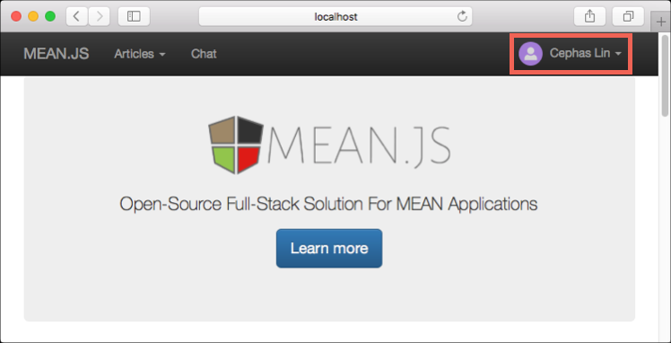

# <a name="azure-cosmos-db-migrate-an-existing-nodejs-mongodb-web-app"></a>Azure Cosmos DB: Migrar una aplicación web MongoDB de Node.js 

Azure Cosmos DB es un servicio de base de datos con varios modelos y de distribución global de Microsoft. Puede crear y consultar documentos, clave/valor y bases de datos de gráfico, todos ellos se benefician de la distribución global de Hola y capacidades de escala horizontal en el núcleo de hello de la base de datos de Azure Cosmos rápidamente. 

Este tutorial rápido muestra cómo toouse existente [MongoDB](mongodb-introduction.md) aplicación escrita en Node.js y conéctelo tooyour base de datos de Azure Cosmos base de datos, que es compatible con conexiones de cliente de MongoDB. En otras palabras, la aplicación Node.js sólo sabe que se está conectando con MongoDB APIs de base de datos de tooa. Es transparente toohello aplicación Hola a datos se almacena en la base de datos de Azure Cosmos.

Cuando haya terminado, tendrá una aplicación MEAN (MongoDB, Express, AngularJS y Node.js) que se ejecuta en [Azure Cosmos DB](https://azure.microsoft.com/services/cosmos-db/). 


[!INCLUDE [cloud-shell-try-it](../../includes/cloud-shell-try-it.md)]

Si elige tooinstall y usar hello CLI localmente, en este tema requiere que se ejecuten hello Azure CLI versión 2.0 o posterior. Ejecutar `az --version` toofind versión de Hola. Si necesita tooinstall o una actualización, consulte [instalar Azure CLI 2.0]( /cli/azure/install-azure-cli). 

## <a name="prerequisites"></a>Requisitos previos 
Además tooAzure CLI, necesitará [Node.js](https://nodejs.org/) y [Git](http://www.git-scm.com/downloads) instalado localmente toorun `npm` y `git` comandos.

Debe tener conocimientos prácticos de Node.js. Este tutorial rápido no está previsto toohelp a desarrollar aplicaciones Node.js en general.

## <a name="clone-hello-sample-application"></a>Clonar aplicación de ejemplo de Hola

Abra una ventana de terminal de git, como git bash, y `cd` tooa directorio de trabajo.  

Ejecute hello después de repositorio de ejemplo de Hola tooclone de comandos. Este repositorio de ejemplo contiene predeterminado de hello [MEAN.js](http://meanjs.org/) aplicación. 

```bash
git clone https://github.com/prashanthmadi/mean
```

## <a name="run-hello-application"></a>Ejecutar la aplicación hello

Instalar paquetes de saludo necesario e inicie la aplicación hello.

```bash
cd mean
npm install
npm start
```

## <a name="log-in-tooazure"></a>Inicie sesión en tooAzure

Si está usando una CLI de Azure instalado, inicie sesión en tooyour suscripción de Azure con hello [inicio de sesión de az](/cli/azure/#login) comando y siga hello en pantalla instrucciones. Puede omitir este paso si usa Hola Shell en la nube de Azure.

```azurecli
az login 
``` 
   
## <a name="add-hello-azure-cosmos-db-module"></a>Agregar el módulo de base de datos de Azure Cosmos Hola

Si está usando una CLI de Azure instalado, compruebe toosee si hello `cosmosdb` componente ya está instalado, ejecute hello `az` comando. Si `cosmosdb` es en lista de comandos de base de Hola, continuar toohello siguiente comando. Puede omitir este paso si usa Hola Shell en la nube de Azure.

Si `cosmosdb` no está en Hola lista de comandos de base, vuelva a instalar [CLI de Azure 2.0]( /cli/azure/install-azure-cli).

## <a name="create-a-resource-group"></a>Crear un grupo de recursos

Crear un [grupo de recursos](../azure-resource-manager/resource-group-overview.md) con hello [crear grupo az](/cli/azure/group#create). Un grupo de recursos de Azure es un contenedor lógico en el que se implementan y se administran recursos de Azure como aplicaciones web, bases de datos y cuentas de almacenamiento. 

Hello en el ejemplo siguiente se crea un grupo de recursos en la región de Europa occidental Hola. Elija un nombre único para el grupo de recursos de Hola.

Si usas el Shell de nube de Azure, haga clic en **inténtelo**, siga toologin de indicaciones en pantalla de Hola y luego copie el comando hello en el símbolo del sistema Hola.

```azurecli-interactive
az group create --name myResourceGroup --location "West Europe"
```

## <a name="create-an-azure-cosmos-db-account"></a>Creación de una cuenta de Azure Cosmos DB

Crear una cuenta de base de datos de Azure Cosmos con hello [crear az cosmosdb](/cli/azure/cosmosdb#create) comando.

Hola vuelva siguiente comando, sustituya su propio nombre de cuenta de base de datos de Azure Cosmos único donde verá hello `<cosmosdb-name>` marcador de posición. Este nombre único que se usará como parte de su punto de conexión de base de datos de Azure Cosmos (`https://<cosmosdb-name>.documents.azure.com/`), por lo que el nombre de Hola debe toobe único entre todas las cuentas de base de datos de Azure Cosmos en Azure. 

```azurecli-interactive
az cosmosdb create --name <cosmosdb-name> --resource-group myResourceGroup --kind MongoDB
```

Hola `--kind MongoDB` parámetro habilita las conexiones de cliente de MongoDB.

Cuando se crea la cuenta de base de datos de Azure Cosmos hello, Hola CLI de Azure muestra información toohello similar siguiente ejemplo. 

> [!NOTE]
> Este ejemplo usa JSON como formato de salida de hello CLI de Azure, que es el valor predeterminado de Hola. toouse otro de salida de formato, vea [formatos para los comandos de CLI de Azure 2.0 de salida](https://docs.microsoft.com/cli/azure/format-output-azure-cli).

```json
{
  "databaseAccountOfferType": "Standard",
  "documentEndpoint": "https://<cosmosdb-name>.documents.azure.com:443/",
  "id": "/subscriptions/00000000-0000-0000-0000-000000000000/resourceGroups/myResourceGroup/providers/Microsoft.Document
DB/databaseAccounts/<cosmosdb-name>",
  "kind": "MongoDB",
  "location": "West Europe",
  "name": "<cosmosdb-name>",
  "readLocations": [
    {
      "documentEndpoint": "https://<cosmosdb-name>-westeurope.documents.azure.com:443/",
      "failoverPriority": 0,
      "id": "<cosmosdb-name>-westeurope",
      "locationName": "West Europe",
      "provisioningState": "Succeeded"
    }
  ],
  "resourceGroup": "myResourceGroup",
  "type": "Microsoft.DocumentDB/databaseAccounts",
  "writeLocations": [
    {
      "documentEndpoint": "https://<cosmosdb-name>-westeurope.documents.azure.com:443/",
      "failoverPriority": 0,
      "id": "<cosmosdb-name>-westeurope",
      "locationName": "West Europe",
      "provisioningState": "Succeeded"
    }
  ]
} 
```

## <a name="connect-your-nodejs-application-toohello-database"></a>Conectarse a la base de datos de toohello de aplicación Node.js

En este paso, se conectará la MEAN.js ejemplo tooan base de datos de Azure Cosmos base de datos que acaba de crear, mediante una cadena de conexión de MongoDB. 

<a name="devconfig"></a>
## <a name="configure-hello-connection-string-in-your-nodejs-application"></a>Configurar la cadena de conexión de hello en la aplicación de Node.js

En el repositorio de MEAN.js, abra `config/env/local-development.js`.

Reemplace el contenido de Hola de este archivo con el siguiente código de hello. Asegúrese de tooalso reemplazar Hola dos `<cosmosdb-name>` marcadores de posición con el nombre de cuenta de base de datos de Azure Cosmos.

```javascript
'use strict';

module.exports = {
  db: {
    uri: 'mongodb://<cosmosdb-name>:<primary_master_key>@<cosmosdb-name>.documents.azure.com:10255/mean-dev?ssl=true&sslverifycertificate=false'
  }
};
```

## <a name="retrieve-hello-key"></a>Recuperar la clave de Hola

En orden tooconnect tooan base de datos de Azure Cosmos base de datos, se necesita la clave de base de datos de Hola. Hola de uso [az cosmosdb lista-claves](/cli/azure/cosmosdb#list-keys) clave principal de comando tooretrieve Hola.

```azurecli-interactive
az cosmosdb list-keys --name <cosmosdb-name> --resource-group myResourceGroup --query "primaryMasterKey"
```

Hola CLI de Azure genera información toohello similar siguiente ejemplo. 

```json
"RUayjYjixJDWG5xTqIiXjC..."
```

Copiar valor de Hola de `primaryMasterKey`. Esto pegar sobre hello `<primary_master_key>` en `local-development.js`.

Guarde los cambios.

### <a name="run-hello-application-again"></a>Ejecute de nuevo la aplicación de Hola.

Vuelva a ejecutar `npm start`. 

```bash
npm start
```

Un mensaje de consola ahora debe indicar a que ese entorno de desarrollo de hello está en funcionamiento. 

Navegue demasiado`http://localhost:3000` en un explorador. Haga clic en **Sign Up** en hello toocreate de menú y try superior dos ficticio a los usuarios. 

Hola MEAN.js aplicación de ejemplo almacena los datos de usuario de base de datos de Hola. Si es correcta y MEAN.js inicia sesión automáticamente en hello creó el usuario, a continuación, la conexión de base de datos de Azure Cosmos funciona. 



## <a name="view-data-in-data-explorer"></a>Ver datos en el Explorador de datos

Datos almacenados por una base de datos de Azure Cosmos están tooview disponible, consulta y ejecución de lógica de negocios en Hola portal de Azure.

tooview, consultar y trabajar con datos de usuario de hello creados en el paso anterior hello, inicio de sesión toohello [portal de Azure](https://portal.azure.com) en el explorador web.

En el cuadro de búsqueda superior hello, tipo de base de datos de Azure Cosmos. Cuando se abra la hoja de la cuenta de Cosmos DB, seleccione su cuenta de Cosmos DB. Hola barra de navegación izquierda, haga clic en el Explorador de datos. Expanda la colección en el panel colecciones de hello y, a continuación, puede ver documentos Hola de colección de hello, consultar los datos de hello e incluso crear y ejecutar procedimientos almacenados, desencadenadores y UDF. 


## <a name="deploy-hello-nodejs-application-tooazure"></a>Implementar la aplicación tooAzure de hello Node.js

En este paso, implementará su tooAzure de aplicación Node.js conectado MongoDB Cosmos DB.

Quizás haya observado es ese archivo de configuración de Hola que cambió anteriormente para el entorno de desarrollo de hello (`/config/env/local-development.js`). Al implementar el servicio de aplicación tooApp, se ejecutará en el entorno de producción de hello de forma predeterminada. Ahora, deberá toomake Hola mismo cambiar toohello archivo de configuración correspondientes.

En el repositorio de MEAN.js, abra `config/env/production.js`.

Hola `db` objeto, reemplace el valor de Hola de `uri` como presentación en el siguiente ejemplo de Hola. Ser seguro tooreplace Hola marcadores de posición como antes.

```javascript
'mongodb://<cosmosdb-name>:<primary_master_key>@<cosmosdb-name>.documents.azure.com:10255/mean?ssl=true&sslverifycertificate=false',
```

> [!NOTE] 
> Hola `ssl=true` opción es importante porque [base de datos de Azure Cosmos requiere SSL](connect-mongodb-account.md#connection-string-requirements). 
>
>

Hola terminal, confirme todos los cambios en Git. Puede copiar ambos toorun comandos ellos juntos.

```bash
git add .
git commit -m "configured MongoDB connection string"
```
## <a name="clean-up-resources"></a>Limpieza de recursos

Si no va toocontinue toouse esta aplicación, eliminar todos los recursos creados por este tutorial rápido de hello portal de Azure con hello pasos:

1. En el menú de la izquierda de Hola Hola portal de Azure, haga clic en **grupos de recursos** y, a continuación, haga clic en nombre de hello del recurso de Hola que creó. 
2. En la página del grupo de recursos, haga clic en **eliminar**, escriba el nombre de Hola de hello recursos toodelete en el cuadro de texto hello y, a continuación, haga clic en **eliminar**.

## <a name="next-steps"></a>Pasos siguientes

En este tutorial, ha aprendido cómo toocreate una base de datos de Azure Cosmos cuenta y cree una colección de MongoDB utilizando Hola Explorador de datos. Ahora puede migrar su tooAzure de datos de MongoDB Cosmos DB.  

> [!div class="nextstepaction"]
> [Importación de datos de MongoDB a Azure Cosmos DB](mongodb-migrate.md)
