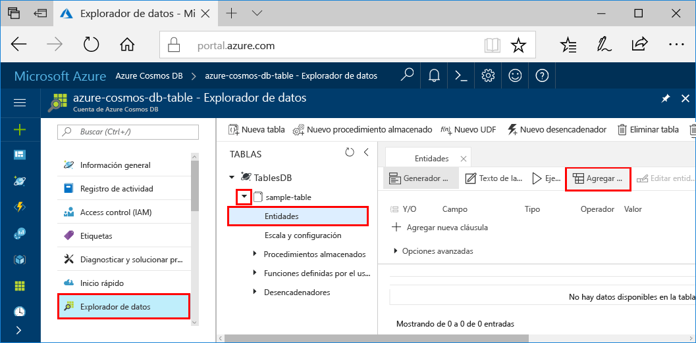

# <a name="azure-cosmos-db-build-a-net-application-using-hello-table-api"></a>Azure Cosmos DB: Crear una aplicación de .NET mediante Hola API de tabla

Azure Cosmos DB es un servicio de base de datos con varios modelos y de distribución global de Microsoft. Puede crear y consultar documentos, clave/valor y bases de datos de gráfico, todos ellos se benefician de la distribución global de Hola y capacidades de escala horizontal en el núcleo de hello de la base de datos de Azure Cosmos rápidamente. 

Este inicio rápido se muestra cómo toocreate una base de datos de Azure Cosmos cuenta y crear una tabla dentro de esa cuenta con hello portal de Azure. Necesitará, a continuación, escribir código tooinsert, actualización y eliminar las entidades así como ejecutar algunas consultas usando Hola nueva [tabla de Premium de almacenamiento de Windows Azure](https://aka.ms/premiumtablenuget) paquete NuGet (versión preliminar). Esta biblioteca tiene Hola mismas clases y firmas de método como público hello [SDK de almacenamiento de Windows Azure](https://www.nuget.org/packages/WindowsAzure.Storage), pero también tiene cuentas Hola capacidad tooconnect tooAzure Cosmos DB con hello [API de tabla](table-introduction.md) (versión preliminar). 

## <a name="prerequisites"></a>Requisitos previos

Si aún no tiene Visual Studio de 2017 instalado, puede descargar y usar hello **libre** [2017 Community Edition de Visual Studio](https://www.visualstudio.com/downloads/). Asegúrese de que habilitar **desarrollo Azure** durante la instalación de Visual Studio Hola.

[!INCLUDE [quickstarts-free-trial-note](../../includes/quickstarts-free-trial-note.md)]

## <a name="create-a-database-account"></a>Creación de una cuenta de base de datos

[!INCLUDE [cosmos-db-create-dbaccount-table](../../includes/cosmos-db-create-dbaccount-table.md)]

## <a name="add-a-table"></a>Adición de una tabla

[!INCLUDE [cosmos-db-create-table](../../includes/cosmos-db-create-table.md)]

## <a name="add-sample-data"></a>Agregar datos de ejemplo

Ahora puede agregar datos tooyour nueva tabla mediante el Explorador de datos (vista previa).

1. En el Explorador de datos, expanda **sample-table** y haga clic en **Entidades** y en **Agregar entidad**.

   
2. Ahora agregue el cuadro de valor de datos toohello PartitionKey y RowKey cuadro de valor y haga clic en **Agregar entidad**.

   
  
    Ahora puede agregar más entidades tooyour tabla, edite las entidades o consultar los datos en el Explorador de datos. Explorador de datos también es donde puede escalar el rendimiento y agregar procedimientos almacenados, funciones definidas por el usuario y tabla de tooyour de desencadenadores.

## <a name="clone-hello-sample-application"></a>Clonar aplicación de ejemplo de Hola

Ahora vamos a clonar una aplicación de la tabla de github, establezca la cadena de conexión de Hola y ejecútelo. Podrá ver lo fácil que es toowork con datos mediante programación. 

1. Abra una ventana de terminal de git, como git bash, y `cd` tooa directorio de trabajo.  

2. Ejecute hello después de repositorio de ejemplo de comando tooclone Hola. 

    ```bash
    git clone https://github.com/Azure-Samples/azure-cosmos-db-table-dotnet-getting-started.git
    ```

3. A continuación, abra el archivo de solución de hello en Visual Studio. 

## <a name="review-hello-code"></a>Revise el código de hello

Vamos a hacer una revisión rápida de lo que sucede en la aplicación hello. Archivo de hello abra Program.cs y encontrará que estas líneas de código crean Hola recursos de base de datos de Azure Cosmos. 

* Hola CloudTableClient se inicializa.

    ```csharp
    CloudStorageAccount storageAccount = CloudStorageAccount.Parse(connectionString); 
    CloudTableClient tableClient = storageAccount.CreateCloudTableClient();
    ```

* Si no existe, se crea una nueva tabla.

    ```csharp
    CloudTable table = tableClient.GetTableReference("people");
    table.CreateIfNotExists();
    ```

* Se crea un nuevo contenedor de tabla. Puede observar este tooregular muy similar de código SDK de almacenamiento de tabla de Azure. 

    ```csharp
    CustomerEntity item = new CustomerEntity()
                {
                    PartitionKey = Guid.NewGuid().ToString(),
                    RowKey = Guid.NewGuid().ToString(),
                    Email = $"{GetRandomString(6)}@contoso.com",
                    PhoneNumber = "425-555-0102",
                    Bio = GetRandomString(1000)
                };
    ```

## <a name="update-your-connection-string"></a>Actualizar la cadena de conexión

Ahora actualizaremos información hello de la cadena de conexión para que la aplicación puede comunicarse tooAzure Cosmos DB. 

1. En Visual Studio, abra el archivo app.config de hello. 

2. Hola [portal de Azure](http://portal.azure.com/), Hola base de datos de Azure Cosmos deje de menú de navegación, haga clic en **cadena de conexión**. En el nuevo panel de hello haga clic en botón Copiar de hello para la cadena de conexión de Hola. 

    

3. Pegue el valor de hello en el archivo app.config de hello como valor de Hola de hello PremiumStorageConnectionString. 

    `<add key="PremiumStorageConnectionString" 
        value="DefaultEndpointsProtocol=https;AccountName=MYSTORAGEACCOUNT;AccountKey=AUTHKEY;TableEndpoint=https://COSMOSDB.documents.azure.com" />`    

    Puede dejar hello StandardStorageConnectionString tal cual.

Ahora ha actualizado la aplicación con toda la información de hello debe toocommunicate con base de datos de Azure Cosmos. 

## <a name="run-hello-web-app"></a>Ejecutar la aplicación web de hello

1. En Visual Studio, haga doble clic en hello **PremiumTableGetStarted** proyecto **el Explorador de soluciones** y, a continuación, haga clic en **administrar paquetes de NuGet**. 

2. Hola NuGet **examinar** , escriba *WindowsAzure.Storage PremiumTable*.

3. Comprobar hello **incluir versión preliminar** cuadro. 

4. Desde los resultados de hello, instalar hello **WindowsAzure.Storage PremiumTable** biblioteca. Esto instala vista previa de hello paquete de la API de tabla de base de datos de Azure Cosmos, así como todas las dependencias. Tenga en cuenta que se trata de un paquete de NuGet diferentes que Hola paquete de almacenamiento de Windows Azure usa almacenamiento de tabla de Azure. 

5. Haga clic en CTRL + F5 aplicación hello de toorun.

    ventana de la consola de Hello muestra los datos de Hola que se agregan, recuperar, consultar, reemplazan y eliminan de la tabla de Hola. Cuando se completa el script de Hola, presione cualquier ventana de la consola de clave tooclose Hola. 
    
    

6. Si desea que las nuevas entidades de Hola de toosee en el Explorador de datos, simplemente comenta líneas 188 208 en program.cs, por lo que no se eliminan, ejecute a continuación, muestra de Hola de nuevo. 

    Ahora puede volver atrás tooData Explorer, haga clic en **actualizar**, expanda hello **personas** de tabla y haga clic en **entidades**y, a continuación, trabajar con nuevos datos. 

    

## <a name="review-slas-in-hello-azure-portal"></a>Revise los SLA de hello portal de Azure

[!INCLUDE [cosmosdb-tutorial-review-slas](../../includes/cosmos-db-tutorial-review-slas.md)]

## <a name="clean-up-resources"></a>Limpieza de recursos

Si no va toocontinue toouse esta aplicación, eliminar todos los recursos creados por este tutorial rápido de hello portal de Azure con hello pasos: 

1. En el menú de la izquierda de Hola Hola portal de Azure, haga clic en **grupos de recursos** y, a continuación, haga clic en nombre de hello del recurso de Hola que creó. 
2. En la página del grupo de recursos, haga clic en **eliminar**, escriba el nombre de Hola de hello recursos toodelete en el cuadro de texto hello y, a continuación, haga clic en **eliminar**.

## <a name="next-steps"></a>Pasos siguientes

En este tutorial, ha aprendido cómo crear una tabla mediante Hola Explorador de datos toocreate una cuenta de base de datos de Azure Cosmos y ejecutar una aplicación.  Ahora puede consultar los datos mediante Hola API de tabla.  

> [!div class="nextstepaction"]
> [Consulta con hello API de tabla](tutorial-query-table.md)

