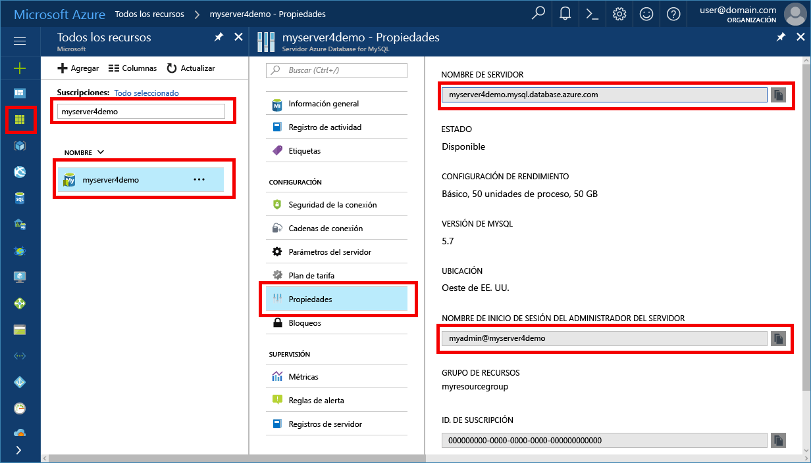

# <a name="migrate-your-mysql-database-tooazure-database-for-mysql-using-dump-and-restore"></a>Migrar su tooAzure de base de datos base de datos de MySQL para uso de volcado de memoria y la restauración de MySQL
Este artículo explica dos tooback formas comunes seguridad y restaurar bases de datos de la base de datos de Azure para MySQL
- Volcado de memoria y la restauración a partir de Hola de línea de comandos (mediante mysqldump) 
- Volcado y restauración mediante PHPMyAdmin 

## <a name="before-you-begin"></a>Antes de empezar
toostep a través de este tooguide cómo, necesita toohave:
- Conocer la [creación de una base de datos de Azure para el servidor MySQL: Azure Portal](quickstart-create-mysql-server-database-using-azure-portal.md)
- Utilidad de línea de comandos [mysqldump](https://dev.mysql.com/doc/refman/5.7/en/mysqldump.html) instalada en la máquina.
- MySQL Workbench [MySQL Workbench descargar](https://dev.mysql.com/downloads/workbench/), Toad, Navicat u otro toodo de herramienta de MySQL de terceros de volcado de memoria y restaurar los comandos.

## <a name="use-common-tools"></a>Uso de herramientas comunes
Use utilidades y herramientas comunes como MySQL Workbench, mysqldump, Toad o Navicat tooremotely conectarse y restaurar datos en la base de datos de MySQL. Use estas herramientas en el equipo cliente con un toohello tooconnect de conexión de internet base de datos de Azure para MySQL. Use una conexión cifrada SSL para aprovechar los procedimientos recomendados de seguridad; vea también la información sobre [conectividad SSL en Azure Database for MySQL](concepts-ssl-connection-security.md). No es necesario toomove Hola archivos tooany especial en la nube de volcado cuando se migra tooAzure base de datos de MySQL. 

## <a name="common-uses-for-dump-and-restore"></a>Usos habituales de volcado y restauración
Puede usar utilidades de MySQL como mysqldump y mysqlpump toodump y carga de las bases de datos en una base de datos de MySQL de Azure en varios escenarios comunes. En otros escenarios, puede usar hello [importar y exportar](concepts-migrate-import-export.md) enfocar en su lugar.

- Volcados de memoria de base de datos de uso durante la migración de base de datos completa de Hola. Esta recomendación alberga al mover una gran cantidad de datos de MySQL, o cuando desee interrumpir el servicio toominimize para sitios activos o aplicaciones. 
-  Asegúrese de que todas las tablas de base de datos de hello usan motor de almacenamiento de hello InnoDB al cargar datos en la base de datos de MySQL. Azure Database for MySQL solo admite el motor de almacenamiento InnoDB y, por tanto, no es compatible con otros alternativos. Si las tablas están configuradas con otros motores de almacenamiento, convertirlos en formato de motor de hello InnoDB antes de su migración tooAzure base de datos de MySQL.
   Por ejemplo, si tiene un WordPress o aplicación Web mediante tablas de MyISAM Hola, convertir primero esas tablas mediante la migración en formato InnoDB antes de restaurar tooAzure base de datos de MySQL. Cláusula de uso hello `ENGINE=InnoDB` tooset Hola motor utilizado al crear una nueva tabla, a continuación, transfiera datos de Hola a tabla compatible de hello antes de la restauración de Hola. 

   ```sql
   INSERT INTO innodb_table SELECT * FROM myisam_table ORDER BY primary_key_columns
   ```
- problemas de compatibilidad de cualquier tooavoid, asegúrese de hello misma versión de MySQL se utiliza en los sistemas de origen y destino de hello al volcar las bases de datos. Por ejemplo, si el servidor existente de MySQL versión 5.7, debe migrar tooAzure base de datos de MySQL configurado toorun versión 5.7. Hola `mysql_upgrade` comando no funciona en una base de datos de MySQL server y no se admite. Si necesita tooupgrade entre las versiones de MySQL, en primer lugar de volcado de memoria o exportar la base de datos de la versión inferior a una versión posterior de MySQL en su propio entorno. A continuación, ejecute `mysql_upgrade` antes de intentar la migración a una instancia de Azure Database for MySQL.

## <a name="performance-considerations"></a>Consideraciones sobre rendimiento
rendimiento de toooptimize, toman aviso de estas consideraciones al volcar grandes bases de datos:
-   Hola de uso `exclude-triggers` opción en mysqldump al volcar las bases de datos. Excluir desencadena desde archivos de volcado de los comandos de desencadenador de hello tooavoid desencadenar durante la restauración de datos de Hola. 
-   Evitar hello `single-transaction` opción en mysqldump cuando un volcado de bases de datos muy grandes. Volcado muchas tablas en una única transacción hace que el almacenamiento adicional y toobe de recursos de memoria usados durante la restauración y puede provocar retardos de rendimiento o las restricciones de recursos.
-   Inserciones de varios valores de uso cuando se carga con la sobrecarga de ejecución de SQL toominimize instrucción al volcar las bases de datos. Cuando se usan archivos de volcado generados con la utilidad mysqldump, se habilutan automáticamente las inserciones de varios valores. 
-  Hola de uso `order-by-primary` opción en mysqldump al volcar las bases de datos, para que los datos de Hola se incluye en el script en orden de clave principal.
-   Hola de uso `disable-keys` opción en mysqldump cuando un volcado de datos, restricciones de clave externa de toodisable antes de la carga. El hecho de deshabilitar las comprobaciones de clave externa favorece un aumento del rendimiento. Habilitar las restricciones de Hola y comprobar los datos de hello después de la integridad referencial de hello carga tooensure.
-   Use tablas con particiones cuando sea necesario.
-   Cargue los datos en paralelo. Evite demasiada paralelismo que podría provocar toohit un límite de recursos y supervisar los recursos con métricas de hello disponibles en hello portal de Azure. 
-   Hola de uso `defer-table-indexes` opción en mysqlpump al volcar las bases de datos, por lo que la creación de índices que se produce cuando se carguen los datos de tablas.

## <a name="create-a-backup-file-from-hello-command-line-using-mysqldump"></a>Crear un archivo de copia de seguridad de Hola de línea de comandos mediante mysqldump
tooback una base de datos MySQL existente en el equipo local de hello servidor local o en una máquina virtual, ejecute el siguiente comando de Hola: 
```bash
$ mysqldump --opt -u [uname] -p[pass] [dbname] > [backupfile.sql]
```

Hola parámetros tooprovide son:
- [uname] El nombre de usuario de base de datos 
- [paso] Hola contraseña para la base de datos (Observe que no hay ningún espacio entre -p y la contraseña de hello) 
- nombre de hello [dbname] de la base de datos 
- nombre de archivo [backupfile.sql] hello para la copia de seguridad de base de datos 
- [--opt] Hola mysqldump opción 

Por ejemplo, tooback la base de datos denominada 'testdb' en el servidor de MySQL con nombre de usuario de hello 'testuser' y no testdb_backup.sql de archivo de contraseña tooa, utilizar el siguiente comando de Hola. Hello comando realiza una copia de hello `testdb` base de datos en un archivo denominado `testdb_backup.sql`, que contiene todas las instrucciones de SQL de hello necesarios toore-crear base de datos de Hola. 

```bash
$ mysqldump -u root -p testdb > testdb_backup.sql
```
tooselect tablas específicas en su tooback de base de datos de seguridad, los nombres de tabla de Hola de lista separan por espacios. Por ejemplo, tooback las tablas table1 y table2 sola de hello 'testdb', siga este ejemplo: 
```bash
$ mysqldump -u root -p testdb table1 table2 > testdb_tables_backup.sql
```

cambiar de base de datos de tooback más de una base de datos a la vez, use Hola--y nombres de base de datos de lista Hola separan por espacios. 
```bash
$ mysqldump -u root -p --databases testdb1 testdb3 testdb5 > testdb135_backup.sql 
```
tooback seguridad todas las bases de datos de hello en el servidor de hello al mismo tiempo, debe utilizar hello: opción de todas las bases de datos.
```
$ mysqldump -u root -p --all-databases > alldb_backup.sql 
```

## <a name="create-a-database-on-hello-target-azure-database-for-mysql-server"></a>Crear una base de datos en el destino de hello base de datos de MySQL server
Crear una base de datos vacía en el destino de hello base de datos de MySQL server donde desea toomigrate Hola datos. Usar una herramienta como MySQL Workbench, Toad o Navicat base de datos de la hello toocreate. base de datos de Hello puede tener Hola mismo nombre como base de datos de Hola Hola independientes el volcado de datos o puede crear una base de datos con un nombre diferente.

tooget conectado, buscar la información de conexión de hello en la página de propiedades de hello en la base de datos de Azure para MySQL.


Agregar información de conexión de hello en el área de trabajo de MySQL.


## <a name="restore-your-mysql-database-using-command-line-or-mysql-workbench"></a>Restauración de la base de datos MySQL mediante la línea de comandos o MySQL Workbench
Una vez haya creado la base de datos de destino de hello, pueden utilizar comandos de mysql de Hola o datos de Hola de toorestore de MySQL Workbench en hello específico acaba de crear base de datos de archivo de volcado de memoria de hello.
```bash
mysql -h [hostname] -u [uname] -p[pass] [db_to_restore] < [backupfile.sql]
```
En este ejemplo, restaurar los datos de hello en hello recién creado base de datos en el destino de hello base de datos de MySQL server.
```bash
$ mysql -h myserver4demo.mysql.database.azure.com -u myadmin@myserver4demo -p testdb < testdb_backup.sql
```

## <a name="export-using-phpmyadmin"></a>Exportación mediante PHPMyAdmin
tooexport, puede usar phpMyAdmin herramienta común hello, que quizás ya ha instalado localmente en su entorno. tooexport la base de datos de MySQL mediante PHPMyAdmin:
- Abra phpMyAdmin.
- Seleccione la base de datos. Haga clic en el nombre de la base de datos de hello en lista Hola Hola izquierda. 
- Haga clic en hello **exportar** vínculo. Volcado de hello tooview de base de datos aparece una nueva página.
- Hola área de exportación, haga clic en hello **seleccionar todo** vincular toochoose Hola tablas en la base de datos. 
- Hola área de opciones de SQL, haga clic en Opciones de hello adecuado. 
- Haga clic en hello **Guardar como archivo** y opción de compresión correspondiente Hola opción y, a continuación, haga clic en hello **vaya** botón. Debería aparecer un cuadro de diálogo solicitud se toosave archivo hello localmente.

## <a name="import-using-phpmyadmin"></a>Importación mediante PHPMyAdmin
La importación de la base de datos es tooexporting similar. Hola acciones siguientes:
- Abra phpMyAdmin. 
- En la página de hello phpMyAdmin el programa de instalación, haga clic en **agregar** tooadd Azure la base de datos de MySQL server. Proporcionar detalles de conexión de hello e información de inicio de sesión.
- Crear una base de datos con el nombre adecuado y seleccione a la izquierda de Hola de pantalla de bienvenida. toorewrite Hola base de datos existente, haga clic en el nombre de la base de datos de hello, seleccione todas las casillas de verificación de hello junto a los nombres de tabla de Hola y seleccione **Drop** toodelete Hola tablas existentes. 
- Haga clic en hello **SQL** página de vínculo tooshow Hola donde puede escribir en los comandos SQL o cargar el archivo SQL. 
- Hola de uso **examinar** archivo de base de datos de botón toofind Hola. 
- Haga clic en hello **vaya** botón copia de seguridad de tooexport hello, ejecutar comandos SQL de Hola y volver a crear la base de datos.

## <a name="next-steps"></a>Pasos siguientes
[Conectar aplicaciones tooAzure base de datos de MySQL](./howto-connection-string.md)
