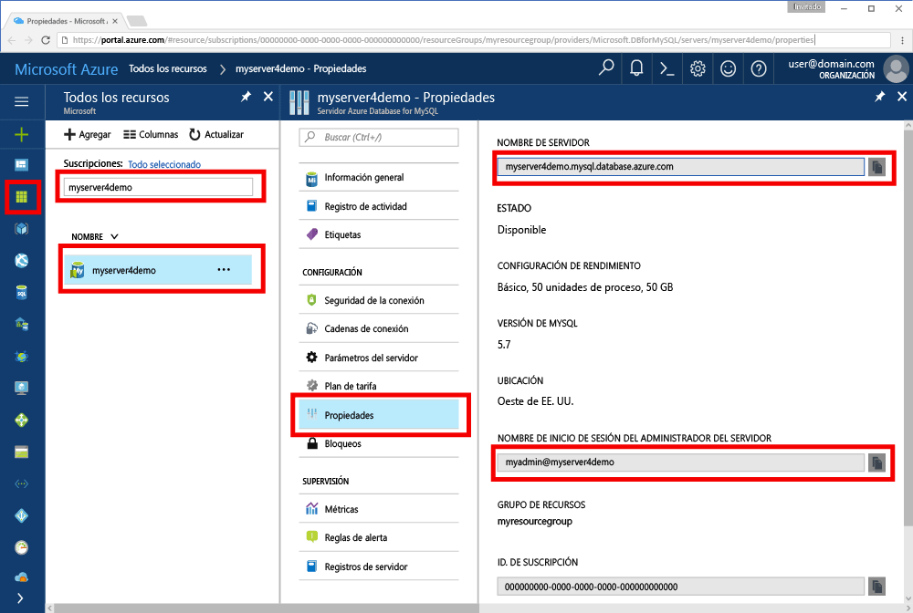

# <a name="azure-database-for-mysql-use-go-language-tooconnect-and-query-data"></a><span data-ttu-id="f0c12-103">Base de datos de Azure para MySQL: utilizan el comando Go lenguaje tooconnect y consultar datos</span><span class="sxs-lookup"><span data-stu-id="f0c12-103">Azure Database for MySQL: Use Go language tooconnect and query data</span></span>
<span data-ttu-id="f0c12-104">Este tutorial rápido muestra cómo tooconnect tooan base de datos de Azure para el uso de MySQL código escrito en hello [vaya](https://golang.org/) idioma de Windows, Ubuntu Linux y Apple plataformas macOS.</span><span class="sxs-lookup"><span data-stu-id="f0c12-104">This quickstart demonstrates how tooconnect tooan Azure Database for MySQL using code written in hello [Go](https://golang.org/) language from Windows, Ubuntu Linux, and Apple macOS platforms.</span></span> <span data-ttu-id="f0c12-105">Muestra cómo toouse tooquery de instrucciones de SQL, insertar, actualizar y eliminar datos en la base de datos de Hola.</span><span class="sxs-lookup"><span data-stu-id="f0c12-105">It shows how toouse SQL statements tooquery, insert, update, and delete data in hello database.</span></span> <span data-ttu-id="f0c12-106">En este artículo se da por supuesto que está familiarizado con el desarrollo mediante Go, pero que se tooworking nueva con la base de datos de Azure para MySQL.</span><span class="sxs-lookup"><span data-stu-id="f0c12-106">This article assumes you are familiar with development using Go, but that you are new tooworking with Azure Database for MySQL.</span></span>

## <a name="prerequisites"></a><span data-ttu-id="f0c12-107">Requisitos previos</span><span class="sxs-lookup"><span data-stu-id="f0c12-107">Prerequisites</span></span>
<span data-ttu-id="f0c12-108">Este tutorial rápido usa recursos de hello creados en cualquiera de estas guías como punto de partida:</span><span class="sxs-lookup"><span data-stu-id="f0c12-108">This quickstart uses hello resources created in either of these guides as a starting point:</span></span>
- <span data-ttu-id="f0c12-109">[Create an Azure Database for MySQL server using Azure Portal](./quickstart-create-mysql-server-database-using-azure-portal.md) (Creación de un servidor de Azure Database for MySQL mediante Azure Portal)</span><span class="sxs-lookup"><span data-stu-id="f0c12-109">[Create an Azure Database for MySQL server using Azure portal](./quickstart-create-mysql-server-database-using-azure-portal.md)</span></span>
- <span data-ttu-id="f0c12-110">[Create an Azure Database for MySQL server using Azure CLI](./quickstart-create-mysql-server-database-using-azure-cli.md) (Creación de un servidor de Azure Database for MySQL mediante la CLI de Azure)</span><span class="sxs-lookup"><span data-stu-id="f0c12-110">[Create an Azure Database for MySQL server using Azure CLI](./quickstart-create-mysql-server-database-using-azure-cli.md)</span></span>

## <a name="install-go-and-mysql-connector"></a><span data-ttu-id="f0c12-111">Instalación de Go y el conector de MySQL</span><span class="sxs-lookup"><span data-stu-id="f0c12-111">Install Go and MySQL connector</span></span>
<span data-ttu-id="f0c12-112">Instalar [vaya](https://golang.org/doc/install) hello y [go--controlador sql para MySQL](https://github.com/go-sql-driver/mysql#installation) en su propio equipo.</span><span class="sxs-lookup"><span data-stu-id="f0c12-112">Install [Go](https://golang.org/doc/install) and hello [go-sql-driver for MySQL](https://github.com/go-sql-driver/mysql#installation) on your own machine.</span></span> <span data-ttu-id="f0c12-113">Dependiendo de la plataforma, siga los pasos de hello:</span><span class="sxs-lookup"><span data-stu-id="f0c12-113">Depending on your platform, follow hello steps:</span></span>

### <a name="windows"></a><span data-ttu-id="f0c12-114">Windows</span><span class="sxs-lookup"><span data-stu-id="f0c12-114">Windows</span></span>
1. <span data-ttu-id="f0c12-115">[Descargar](https://golang.org/dl/) e instale Go para Microsoft Windows según toohello [las instrucciones de instalación](https://golang.org/doc/install).</span><span class="sxs-lookup"><span data-stu-id="f0c12-115">[Download](https://golang.org/dl/) and install Go for Microsoft Windows according toohello [installation instructions](https://golang.org/doc/install).</span></span>
2. <span data-ttu-id="f0c12-116">Inicie símbolo Hola desde el menú de inicio de Hola.</span><span class="sxs-lookup"><span data-stu-id="f0c12-116">Launch hello command prompt from hello start menu.</span></span>
3. <span data-ttu-id="f0c12-117">Cree una carpeta para su proyecto, como</span><span class="sxs-lookup"><span data-stu-id="f0c12-117">Make a folder for your project such.</span></span> <span data-ttu-id="f0c12-118">`mkdir  %USERPROFILE%\go\src\mysqlgo`.</span><span class="sxs-lookup"><span data-stu-id="f0c12-118">`mkdir  %USERPROFILE%\go\src\mysqlgo`.</span></span>
4. <span data-ttu-id="f0c12-119">Cambie el directorio a la carpeta del proyecto hello, como `cd %USERPROFILE%\go\src\mysqlgo`.</span><span class="sxs-lookup"><span data-stu-id="f0c12-119">Change directory into hello project folder, such as `cd %USERPROFILE%\go\src\mysqlgo`.</span></span>
5. <span data-ttu-id="f0c12-120">Establezca la variable de entorno de hello para el directorio de código fuente GOPATH toopoint toohello.</span><span class="sxs-lookup"><span data-stu-id="f0c12-120">Set hello environment variable for GOPATH toopoint toohello source code directory.</span></span> <span data-ttu-id="f0c12-121">`set GOPATH=%USERPROFILE%\go`.</span><span class="sxs-lookup"><span data-stu-id="f0c12-121">`set GOPATH=%USERPROFILE%\go`.</span></span>
6. <span data-ttu-id="f0c12-122">Instalar hello [go--controlador sql para mysql](https://github.com/go-sql-driver/mysql#installation) ejecutando hello `go get github.com/go-sql-driver/mysql` comando.</span><span class="sxs-lookup"><span data-stu-id="f0c12-122">Install hello [go-sql-driver for mysql](https://github.com/go-sql-driver/mysql#installation) by running hello `go get github.com/go-sql-driver/mysql` command.</span></span>

   <span data-ttu-id="f0c12-123">En resumen, instale Go, a continuación, ejecute estos comandos en el símbolo del sistema de hello:</span><span class="sxs-lookup"><span data-stu-id="f0c12-123">In summary, install Go, then run these commands in hello command prompt:</span></span>
   ```cmd
   mkdir  %USERPROFILE%\go\src\mysqlgo
   cd %USERPROFILE%\go\src\mysqlgo
   set GOPATH=%USERPROFILE%\go
   go get github.com/go-sql-driver/mysql
   ```

### <a name="linux-ubuntu"></a><span data-ttu-id="f0c12-124">Linux (Ubuntu)</span><span class="sxs-lookup"><span data-stu-id="f0c12-124">Linux (Ubuntu)</span></span>
1. <span data-ttu-id="f0c12-125">Inicie el shell de Bash Hola.</span><span class="sxs-lookup"><span data-stu-id="f0c12-125">Launch hello Bash shell.</span></span> 
2. <span data-ttu-id="f0c12-126">Instale Go mediante la ejecución de `sudo apt-get install golang-go`.</span><span class="sxs-lookup"><span data-stu-id="f0c12-126">Install Go by running `sudo apt-get install golang-go`.</span></span>
3. <span data-ttu-id="f0c12-127">Cree una carpeta para el proyecto en su directorio principal, como `mkdir -p ~/go/src/mysqlgo/`.</span><span class="sxs-lookup"><span data-stu-id="f0c12-127">Make a folder for your project in your home directory, such as `mkdir -p ~/go/src/mysqlgo/`.</span></span>
4. <span data-ttu-id="f0c12-128">Cambie el directorio a la carpeta hello, como `cd ~/go/src/mysqlgo/`.</span><span class="sxs-lookup"><span data-stu-id="f0c12-128">Change directory into hello folder, such as `cd ~/go/src/mysqlgo/`.</span></span>
5. <span data-ttu-id="f0c12-129">Conjunto hello GOPATH entorno toopoint variable tooa directorio de origen válido, como el principal actual del directorio vaya carpeta.</span><span class="sxs-lookup"><span data-stu-id="f0c12-129">Set hello GOPATH environment variable toopoint tooa valid source directory, such as your current home directory's go folder.</span></span> <span data-ttu-id="f0c12-130">En el shell de bash hello, ejecute `export GOPATH=~/go` tooadd Hola ir directorio como hello GOPATH para la sesión actual de shell de Hola.</span><span class="sxs-lookup"><span data-stu-id="f0c12-130">At hello bash shell, run `export GOPATH=~/go` tooadd hello go directory as hello GOPATH for hello current shell session.</span></span>
6. <span data-ttu-id="f0c12-131">Instalar hello [go--controlador sql para mysql](https://github.com/go-sql-driver/mysql#installation) ejecutando hello `go get github.com/go-sql-driver/mysql` comando.</span><span class="sxs-lookup"><span data-stu-id="f0c12-131">Install hello [go-sql-driver for mysql](https://github.com/go-sql-driver/mysql#installation) by running hello `go get github.com/go-sql-driver/mysql` command.</span></span>

   <span data-ttu-id="f0c12-132">En resumen, ejecute estos comandos de Bash:</span><span class="sxs-lookup"><span data-stu-id="f0c12-132">In summary, run these bash commands:</span></span>
   ```bash
   sudo apt-get install golang-go
   mkdir -p ~/go/src/mysqlgo/
   cd ~/go/src/mysqlgo/
   export GOPATH=~/go/
   go get github.com/go-sql-driver/mysql
   ```

### <a name="apple-macos"></a><span data-ttu-id="f0c12-133">MacOS de Apple</span><span class="sxs-lookup"><span data-stu-id="f0c12-133">Apple macOS</span></span>
1. <span data-ttu-id="f0c12-134">Descargue e instale vayan según toohello [las instrucciones de instalación](https://golang.org/doc/install) coincidencia de la plataforma.</span><span class="sxs-lookup"><span data-stu-id="f0c12-134">Download and install Go according toohello [installation instructions](https://golang.org/doc/install)  matching your platform.</span></span> 
2. <span data-ttu-id="f0c12-135">Inicie el shell de Bash Hola.</span><span class="sxs-lookup"><span data-stu-id="f0c12-135">Launch hello Bash shell.</span></span> 
3. <span data-ttu-id="f0c12-136">Cree una carpeta para el proyecto en su directorio principal, como `mkdir -p ~/go/src/mysqlgo/`.</span><span class="sxs-lookup"><span data-stu-id="f0c12-136">Make a folder for your project in your home directory, such as `mkdir -p ~/go/src/mysqlgo/`.</span></span>
4. <span data-ttu-id="f0c12-137">Cambie el directorio a la carpeta hello, como `cd ~/go/src/mysqlgo/`.</span><span class="sxs-lookup"><span data-stu-id="f0c12-137">Change directory into hello folder, such as `cd ~/go/src/mysqlgo/`.</span></span>
5. <span data-ttu-id="f0c12-138">Conjunto hello GOPATH entorno toopoint variable tooa directorio de origen válido, como el principal actual del directorio vaya carpeta.</span><span class="sxs-lookup"><span data-stu-id="f0c12-138">Set hello GOPATH environment variable toopoint tooa valid source directory, such as your current home directory's go folder.</span></span> <span data-ttu-id="f0c12-139">En el shell de bash hello, ejecute `export GOPATH=~/go` tooadd Hola ir directorio como hello GOPATH para la sesión actual de shell de Hola.</span><span class="sxs-lookup"><span data-stu-id="f0c12-139">At hello bash shell, run `export GOPATH=~/go` tooadd hello go directory as hello GOPATH for hello current shell session.</span></span>
6. <span data-ttu-id="f0c12-140">Instalar hello [go--controlador sql para mysql](https://github.com/go-sql-driver/mysql#installation) ejecutando hello `go get github.com/go-sql-driver/mysql` comando.</span><span class="sxs-lookup"><span data-stu-id="f0c12-140">Install hello [go-sql-driver for mysql](https://github.com/go-sql-driver/mysql#installation) by running hello `go get github.com/go-sql-driver/mysql` command.</span></span>

   <span data-ttu-id="f0c12-141">En resumen, instale Go y después ejecute estos comandos de Bash:</span><span class="sxs-lookup"><span data-stu-id="f0c12-141">In summary, install Go, then run these bash commands:</span></span>
   ```bash
   mkdir -p ~/go/src/mysqlgo/
   cd ~/go/src/mysqlgo/
   export GOPATH=~/go/
   go get github.com/go-sql-driver/mysql
   ```

## <a name="get-connection-information"></a><span data-ttu-id="f0c12-142">Obtención de información sobre la conexión</span><span class="sxs-lookup"><span data-stu-id="f0c12-142">Get connection information</span></span>
<span data-ttu-id="f0c12-143">Obtener Hola conexión información necesaria tooconnect toohello base de datos MySQL.</span><span class="sxs-lookup"><span data-stu-id="f0c12-143">Get hello connection information needed tooconnect toohello Azure Database for MySQL.</span></span> <span data-ttu-id="f0c12-144">Es necesario Hola credenciales de inicio de sesión y nombre de servidor completo.</span><span class="sxs-lookup"><span data-stu-id="f0c12-144">You need hello fully qualified server name and login credentials.</span></span>

1. <span data-ttu-id="f0c12-145">Inicie sesión en toohello [portal de Azure](https://portal.azure.com/).</span><span class="sxs-lookup"><span data-stu-id="f0c12-145">Log in toohello [Azure portal](https://portal.azure.com/).</span></span>
2. <span data-ttu-id="f0c12-146">En el menú de la izquierda de hello en el portal de Azure, haga clic en **todos los recursos** y busque servidor hello plegado, como **myserver4demo**.</span><span class="sxs-lookup"><span data-stu-id="f0c12-146">From hello left-hand menu in Azure portal, click **All resources** and search for hello server you have creased, such as **myserver4demo**.</span></span>
3. <span data-ttu-id="f0c12-147">Haga clic en el nombre del servidor de hello **myserver4demo**.</span><span class="sxs-lookup"><span data-stu-id="f0c12-147">Click hello server name **myserver4demo**.</span></span>
4. <span data-ttu-id="f0c12-148">Servidor de hello seleccione **propiedades** página.</span><span class="sxs-lookup"><span data-stu-id="f0c12-148">Select hello server's **Properties** page.</span></span> <span data-ttu-id="f0c12-149">Tome nota de hello **nombre del servidor** y **nombre de inicio de sesión del Administrador de servidor**.</span><span class="sxs-lookup"><span data-stu-id="f0c12-149">Make a note of hello **Server name** and **Server admin login name**.</span></span>
 <span data-ttu-id="f0c12-150"></span><span class="sxs-lookup"><span data-stu-id="f0c12-150"></span></span>
5. <span data-ttu-id="f0c12-151">Si olvida su información de inicio de sesión de servidor, vaya a toohello **información general sobre** página Nombre de inicio de sesión de administrador del servidor de tooview hello y, si es necesario, restablecer la contraseña de Hola.</span><span class="sxs-lookup"><span data-stu-id="f0c12-151">If you forget your server login information, navigate toohello **Overview** page tooview hello Server admin login name and, if necessary, reset hello password.</span></span>
   

## <a name="build-and-run-go-code"></a><span data-ttu-id="f0c12-152">Compilación y ejecución del código de Go</span><span class="sxs-lookup"><span data-stu-id="f0c12-152">Build and run Go code</span></span> 
1. <span data-ttu-id="f0c12-153">toowrite Golang código, puede utilizar un editor de texto simple, como el Bloc de notas en Microsoft Windows, [vi](http://manpages.ubuntu.com/manpages/xenial/man1/nvi.1.html#contenttoc5) o [Nano](https://www.nano-editor.org/) en Ubuntu o TextEdit en macOS.</span><span class="sxs-lookup"><span data-stu-id="f0c12-153">toowrite Golang code, you can use a simple text editor, such as Notepad in Microsoft Windows, [vi](http://manpages.ubuntu.com/manpages/xenial/man1/nvi.1.html#contenttoc5) or [Nano](https://www.nano-editor.org/) in Ubuntu, or TextEdit in macOS.</span></span> <span data-ttu-id="f0c12-154">Si prefiere un entorno de desarrollo integrado (IDE) más rico, pruebe [Gogland](https://www.jetbrains.com/go/) de Jetbrains, [Visual Studio Code](https://code.visualstudio.com/) de Microsoft o [Atom](https://atom.io/).</span><span class="sxs-lookup"><span data-stu-id="f0c12-154">If you prefer a richer Interactive Development Environment (IDE) try [Gogland](https://www.jetbrains.com/go/) by Jetbrains, [Visual Studio Code](https://code.visualstudio.com/) by Microsoft, or [Atom](https://atom.io/).</span></span>
2. <span data-ttu-id="f0c12-155">Pegue Hola código Go de secciones de hello debajo de en archivos de texto y guarde en la carpeta del proyecto con la extensión de archivo \*.Vaya, por ejemplo, la ruta de acceso de Windows `%USERPROFILE%\go\src\mysqlgo\createtable.go` o ruta de acceso de Linux `~/go/src/mysqlgo/createtable.go`.</span><span class="sxs-lookup"><span data-stu-id="f0c12-155">Paste hello Go code from hello sections below into text files, and save into your project folder with file extension \*.go, such as Windows path `%USERPROFILE%\go\src\mysqlgo\createtable.go` or Linux path `~/go/src/mysqlgo/createtable.go`.</span></span>
3. <span data-ttu-id="f0c12-156">Busque hello `HOST`, `DATABASE`, `USER`, y `PASSWORD` constantes en el código de hello y reemplazar los valores de ejemplo de Hola con sus propios valores.</span><span class="sxs-lookup"><span data-stu-id="f0c12-156">Locate hello `HOST`, `DATABASE`, `USER`, and `PASSWORD` constants in hello code, and replace hello example values with your own values.</span></span> 
4. <span data-ttu-id="f0c12-157">Inicie el símbolo del sistema de Hola o el shell de bash.</span><span class="sxs-lookup"><span data-stu-id="f0c12-157">Launch hello command prompt or bash shell.</span></span> <span data-ttu-id="f0c12-158">Cambie el directorio a la carpeta de proyecto.</span><span class="sxs-lookup"><span data-stu-id="f0c12-158">Change directory into your project folder.</span></span> <span data-ttu-id="f0c12-159">Por ejemplo, en Windows `cd %USERPROFILE%\go\src\mysqlgo\`.</span><span class="sxs-lookup"><span data-stu-id="f0c12-159">For example, on Windows `cd %USERPROFILE%\go\src\mysqlgo\`.</span></span> <span data-ttu-id="f0c12-160">En Linux `cd ~/go/src/mysqlgo/`.</span><span class="sxs-lookup"><span data-stu-id="f0c12-160">On Linux `cd ~/go/src/mysqlgo/`.</span></span>  <span data-ttu-id="f0c12-161">Algunos editores de IDE Hola mencionados ofrecen capacidades de depuración y en tiempo de ejecución sin necesidad de los comandos de shell.</span><span class="sxs-lookup"><span data-stu-id="f0c12-161">Some of hello IDE editors mentioned offer debug and runtime capabilities without requiring shell commands.</span></span>
5. <span data-ttu-id="f0c12-162">Ejecutar código de hello escribiendo el comando hello `go run createtable.go` toocompile Hola aplicación y ejecútela.</span><span class="sxs-lookup"><span data-stu-id="f0c12-162">Run hello code by typing hello command `go run createtable.go` toocompile hello application and run it.</span></span> 
6. <span data-ttu-id="f0c12-163">O bien, toobuild código de hello en una aplicación nativa, `go build createtable.go`, a continuación, inicie `createtable.exe` aplicación de hello toorun.</span><span class="sxs-lookup"><span data-stu-id="f0c12-163">Alternatively, toobuild hello code into a native application, `go build createtable.go`, then launch `createtable.exe` toorun hello application.</span></span>

## <a name="connect-create-table-and-insert-data"></a><span data-ttu-id="f0c12-164">Conexión, creación de una tabla e inserción de datos</span><span class="sxs-lookup"><span data-stu-id="f0c12-164">Connect, create table, and insert data</span></span>
<span data-ttu-id="f0c12-165">Siguiente Hola de uso codificar tooconnect toohello server, cree una tabla y cargar datos de hello mediante un **insertar** instrucción SQL.</span><span class="sxs-lookup"><span data-stu-id="f0c12-165">Use hello following code tooconnect toohello server, create a table, and load hello data using an **INSERT** SQL statement.</span></span> 

<span data-ttu-id="f0c12-166">código de Hello importa tres paquetes: Hola [paquete sql](https://golang.org/pkg/database/sql/), hello [controlador de sql vaya para mysql](https://github.com/go-sql-driver/mysql#installation) como un toocommunicate de controlador con base de datos de Azure para MySQL Hola y Hola [fmt paquete](https://golang.org/pkg/fmt/)para impreso entrada y salida en la línea de comandos de Hola.</span><span class="sxs-lookup"><span data-stu-id="f0c12-166">hello code imports three packages: hello [sql package](https://golang.org/pkg/database/sql/), hello [go sql driver for mysql](https://github.com/go-sql-driver/mysql#installation) as a driver toocommunicate with hello Azure Database for MySQL, and hello [fmt package](https://golang.org/pkg/fmt/) for printed input and output on hello command line.</span></span>

<span data-ttu-id="f0c12-167">método llama a código de Hello [sql. Open()](http://go-database-sql.org/accessing.html) tooconnect tooAzure base de datos MySQL y comprobaciones de hello conexión mediante el método [base de datos. Ping()](https://golang.org/pkg/database/sql/#DB.Ping).</span><span class="sxs-lookup"><span data-stu-id="f0c12-167">hello code calls method [sql.Open()](http://go-database-sql.org/accessing.html) tooconnect tooAzure Database for MySQL, and checks hello connection using method [db.Ping()](https://golang.org/pkg/database/sql/#DB.Ping).</span></span> <span data-ttu-id="f0c12-168">A [identificador de base de datos](https://golang.org/pkg/database/sql/#DB) se utiliza en su totalidad, que contiene el grupo de conexiones de hello para el servidor de base de datos de Hola.</span><span class="sxs-lookup"><span data-stu-id="f0c12-168">A [database handle](https://golang.org/pkg/database/sql/#DB) is used throughout, holding hello connection pool for hello database server.</span></span> <span data-ttu-id="f0c12-169">Hola de llamadas de código de Hello [Exec()](https://golang.org/pkg/database/sql/#DB.Exec) método varias veces toorun varios comandos DDL.</span><span class="sxs-lookup"><span data-stu-id="f0c12-169">hello code calls hello [Exec()](https://golang.org/pkg/database/sql/#DB.Exec) method several times toorun several DDL commands.</span></span> <span data-ttu-id="f0c12-170">código de Hello también usa hello [Prepare()](http://go-database-sql.org/prepared.html) y Exec() toorun preparado instrucciones con parámetros diferentes tooinsert tres filas.</span><span class="sxs-lookup"><span data-stu-id="f0c12-170">hello code also uses hello [Prepare()](http://go-database-sql.org/prepared.html) and Exec() toorun prepared statements with different parameters tooinsert three rows.</span></span> <span data-ttu-id="f0c12-171">Cada vez que un método checkError() personalizado es toocheck usado si se produjo un error y pánico tooexit.</span><span class="sxs-lookup"><span data-stu-id="f0c12-171">Each time a custom checkError() method is used toocheck if an error occurred and panic tooexit.</span></span>

<span data-ttu-id="f0c12-172">Reemplace hello `host`, `database`, `user`, y `password` constantes con sus propios valores.</span><span class="sxs-lookup"><span data-stu-id="f0c12-172">Replace hello `host`, `database`, `user`, and `password` constants with your own values.</span></span> 

```Go
package main

import (
    "database/sql"
    "fmt"

    _ "github.com/go-sql-driver/mysql"
)

const (
    host     = "myserver4demo.mysql.database.azure.com"
    database = "quickstartdb"
    user     = "myadmin@myserver4demo"
    password = "yourpassword"
)

func checkError(err error) {
    if err != nil {
        panic(err)
    }
}

func main() {

    // Initialize connection string.
    var connectionString = fmt.Sprintf("%s:%s@tcp(%s:3306)/%s?allowNativePasswords=true", user, password, host, database)

    // Initialize connection object.
    db, err := sql.Open("mysql", connectionString)
    checkError(err)
    defer db.Close()

    err = db.Ping()
    checkError(err)
    fmt.Println("Successfully created connection toodatabase.")

    // Drop previous table of same name if one exists.
    _, err = db.Exec("DROP TABLE IF EXISTS inventory;")
    checkError(err)
    fmt.Println("Finished dropping table (if existed).")

    // Create table.
    _, err = db.Exec("CREATE TABLE inventory (id serial PRIMARY KEY, name VARCHAR(50), quantity INTEGER);")
    checkError(err)
    fmt.Println("Finished creating table.")

    // Insert some data into table.
    sqlStatement, err := db.Prepare("INSERT INTO inventory (name, quantity) VALUES (?, ?);")
    res, err := sqlStatement.Exec("banana", 150)
    checkError(err)
    rowCount, err := res.RowsAffected()
    fmt.Printf("Inserted %d row(s) of data.\n", rowCount)

    res, err = sqlStatement.Exec("orange", 154)
    checkError(err)
    rowCount, err = res.RowsAffected()
    fmt.Printf("Inserted %d row(s) of data.\n", rowCount)

    res, err = sqlStatement.Exec("apple", 100)
    checkError(err)
    rowCount, err = res.RowsAffected()
    fmt.Printf("Inserted %d row(s) of data.\n", rowCount)
    fmt.Println("Done.")
}

```

## <a name="read-data"></a><span data-ttu-id="f0c12-173">Lectura de datos</span><span class="sxs-lookup"><span data-stu-id="f0c12-173">Read data</span></span>
<span data-ttu-id="f0c12-174">Código tooconnect siguiente de Hola de uso y leer datos de hello mediante un **seleccione** instrucción SQL.</span><span class="sxs-lookup"><span data-stu-id="f0c12-174">Use hello following code tooconnect and read hello data using a **SELECT** SQL statement.</span></span> 

<span data-ttu-id="f0c12-175">código de Hello importa tres paquetes: Hola [paquete sql](https://golang.org/pkg/database/sql/), hello [controlador de sql vaya para mysql](https://github.com/go-sql-driver/mysql#installation) como un toocommunicate de controlador con base de datos de Azure para MySQL Hola y Hola [fmt paquete](https://golang.org/pkg/fmt/)para impreso entrada y salida en la línea de comandos de Hola.</span><span class="sxs-lookup"><span data-stu-id="f0c12-175">hello code imports three packages: hello [sql package](https://golang.org/pkg/database/sql/), hello [go sql driver for mysql](https://github.com/go-sql-driver/mysql#installation) as a driver toocommunicate with hello Azure Database for MySQL, and hello [fmt package](https://golang.org/pkg/fmt/) for printed input and output on hello command line.</span></span>

<span data-ttu-id="f0c12-176">método llama a código de Hello [sql. Open()](http://go-database-sql.org/accessing.html) tooconnect tooAzure base de datos MySQL y comprobaciones de hello conexión mediante el método [base de datos. Ping()](https://golang.org/pkg/database/sql/#DB.Ping).</span><span class="sxs-lookup"><span data-stu-id="f0c12-176">hello code calls method [sql.Open()](http://go-database-sql.org/accessing.html) tooconnect tooAzure Database for MySQL, and checks hello connection using method [db.Ping()](https://golang.org/pkg/database/sql/#DB.Ping).</span></span> <span data-ttu-id="f0c12-177">A [identificador de base de datos](https://golang.org/pkg/database/sql/#DB) se utiliza en su totalidad, que contiene el grupo de conexiones de hello para el servidor de base de datos de Hola.</span><span class="sxs-lookup"><span data-stu-id="f0c12-177">A [database handle](https://golang.org/pkg/database/sql/#DB) is used throughout, holding hello connection pool for hello database server.</span></span> <span data-ttu-id="f0c12-178">Hola de llamadas de código de Hello [Query()](https://golang.org/pkg/database/sql/#DB.Query) comando select de método toorun Hola.</span><span class="sxs-lookup"><span data-stu-id="f0c12-178">hello code calls hello [Query()](https://golang.org/pkg/database/sql/#DB.Query) method toorun hello select command.</span></span> <span data-ttu-id="f0c12-179">A continuación, ejecuta [Next()](https://golang.org/pkg/database/sql/#Rows.Next) tooiterate a través del conjunto de resultados de Hola y [Scan()](https://golang.org/pkg/database/sql/#Rows.Scan) tooparse Hola valores de las columnas, guardar el valor de hello en variables.</span><span class="sxs-lookup"><span data-stu-id="f0c12-179">Then it runs [Next()](https://golang.org/pkg/database/sql/#Rows.Next) tooiterate through hello result set and [Scan()](https://golang.org/pkg/database/sql/#Rows.Scan) tooparse hello column values, saving hello value into variables.</span></span> <span data-ttu-id="f0c12-180">Cada vez que un método checkError() personalizado es toocheck usado si se produjo un error y pánico tooexit.</span><span class="sxs-lookup"><span data-stu-id="f0c12-180">Each time a custom checkError() method is used toocheck if an error occurred and panic tooexit.</span></span>

<span data-ttu-id="f0c12-181">Reemplace hello `host`, `database`, `user`, y `password` constantes con sus propios valores.</span><span class="sxs-lookup"><span data-stu-id="f0c12-181">Replace hello `host`, `database`, `user`, and `password` constants with your own values.</span></span> 

```Go
package main

import (
    "database/sql"
    "fmt"

    _ "github.com/go-sql-driver/mysql"
)

const (
    host     = "myserver4demo.mysql.database.azure.com"
    database = "quickstartdb"
    user     = "myadmin@myserver4demo"
    password = "yourpassword"
)

func checkError(err error) {
    if err != nil {
        panic(err)
    }
}

func main() {

    // Initialize connection string.
    var connectionString = fmt.Sprintf("%s:%s@tcp(%s:3306)/%s?allowNativePasswords=true", user, password, host, database)

    // Initialize connection object.
    db, err := sql.Open("mysql", connectionString)
    checkError(err)
    defer db.Close()

    err = db.Ping()
    checkError(err)
    fmt.Println("Successfully created connection toodatabase.")

    // Variables for printing column data when scanned.
    var (
        id       int
        name     string
        quantity int
    )

    // Read some data from hello table.
    rows, err := db.Query("SELECT id, name, quantity from inventory;")
    checkError(err)
    defer rows.Close()
    fmt.Println("Reading data:")
    for rows.Next() {
        err := rows.Scan(&id, &name, &quantity)
        checkError(err)
        fmt.Printf("Data row = (%d, %s, %d)\n", id, name, quantity)
    }
    err = rows.Err()
    checkError(err)
    fmt.Println("Done.")
}
```

## <a name="update-data"></a><span data-ttu-id="f0c12-182">Actualización de datos</span><span class="sxs-lookup"><span data-stu-id="f0c12-182">Update data</span></span>
<span data-ttu-id="f0c12-183">Código tooconnect siguiente de Hola de uso y actualizar Hola datos mediante un **actualizar** instrucción SQL.</span><span class="sxs-lookup"><span data-stu-id="f0c12-183">Use hello following code tooconnect and update hello data using a **UPDATE** SQL statement.</span></span> 

<span data-ttu-id="f0c12-184">código de Hello importa tres paquetes: Hola [paquete sql](https://golang.org/pkg/database/sql/), hello [controlador de sql vaya para mysql](https://github.com/go-sql-driver/mysql#installation) como un toocommunicate de controlador con base de datos de Azure para MySQL Hola y Hola [fmt paquete](https://golang.org/pkg/fmt/)para impreso entrada y salida en la línea de comandos de Hola.</span><span class="sxs-lookup"><span data-stu-id="f0c12-184">hello code imports three packages: hello [sql package](https://golang.org/pkg/database/sql/), hello [go sql driver for mysql](https://github.com/go-sql-driver/mysql#installation) as a driver toocommunicate with hello Azure Database for MySQL, and hello [fmt package](https://golang.org/pkg/fmt/) for printed input and output on hello command line.</span></span>

<span data-ttu-id="f0c12-185">método llama a código de Hello [sql. Open()](http://go-database-sql.org/accessing.html) tooconnect tooAzure base de datos MySQL y comprobaciones de hello conexión mediante el método [base de datos. Ping()](https://golang.org/pkg/database/sql/#DB.Ping).</span><span class="sxs-lookup"><span data-stu-id="f0c12-185">hello code calls method [sql.Open()](http://go-database-sql.org/accessing.html) tooconnect tooAzure Database for MySQL, and checks hello connection using method [db.Ping()](https://golang.org/pkg/database/sql/#DB.Ping).</span></span> <span data-ttu-id="f0c12-186">A [identificador de base de datos](https://golang.org/pkg/database/sql/#DB) se utiliza en su totalidad, que contiene el grupo de conexiones de hello para el servidor de base de datos de Hola.</span><span class="sxs-lookup"><span data-stu-id="f0c12-186">A [database handle](https://golang.org/pkg/database/sql/#DB) is used throughout, holding hello connection pool for hello database server.</span></span> <span data-ttu-id="f0c12-187">Hola de llamadas de código de Hello [Exec()](https://golang.org/pkg/database/sql/#DB.Exec) comando de actualización de método toorun Hola.</span><span class="sxs-lookup"><span data-stu-id="f0c12-187">hello code calls hello [Exec()](https://golang.org/pkg/database/sql/#DB.Exec) method toorun hello update command.</span></span> <span data-ttu-id="f0c12-188">Cada vez que un método checkError() personalizado es toocheck usado si se produjo un error y pánico tooexit.</span><span class="sxs-lookup"><span data-stu-id="f0c12-188">Each time a custom checkError() method is used toocheck if an error occurred and panic tooexit.</span></span>

<span data-ttu-id="f0c12-189">Reemplace hello `host`, `database`, `user`, y `password` constantes con sus propios valores.</span><span class="sxs-lookup"><span data-stu-id="f0c12-189">Replace hello `host`, `database`, `user`, and `password` constants with your own values.</span></span> 

```Go
package main

import (
    "database/sql"
    "fmt"

    _ "github.com/go-sql-driver/mysql"
)

const (
    host     = "myserver4demo.mysql.database.azure.com"
    database = "quickstartdb"
    user     = "myadmin@myserver4demo"
    password = "yourpassword"
)

func checkError(err error) {
    if err != nil {
        panic(err)
    }
}

func main() {

    // Initialize connection string.
    var connectionString = fmt.Sprintf("%s:%s@tcp(%s:3306)/%s?allowNativePasswords=true", user, password, host, database)

    // Initialize connection object.
    db, err := sql.Open("mysql", connectionString)
    checkError(err)
    defer db.Close()

    err = db.Ping()
    checkError(err)
    fmt.Println("Successfully created connection toodatabase.")

    // Modify some data in table.
    rows, err := db.Exec("UPDATE inventory SET quantity = ? WHERE name = ?", 200, "banana")
    checkError(err)
    rowCount, err := rows.RowsAffected()
    fmt.Printf("Deleted %d row(s) of data.\n", rowCount)
    fmt.Println("Done.")
}
```

## <a name="delete-data"></a><span data-ttu-id="f0c12-190">Eliminación de datos</span><span class="sxs-lookup"><span data-stu-id="f0c12-190">Delete data</span></span>
<span data-ttu-id="f0c12-191">Código tooconnect siguiente de Hola de uso y eliminar los datos mediante un **eliminar** instrucción SQL.</span><span class="sxs-lookup"><span data-stu-id="f0c12-191">Use hello following code tooconnect and remove data using a **DELETE** SQL statement.</span></span> 

<span data-ttu-id="f0c12-192">código de Hello importa tres paquetes: Hola [paquete sql](https://golang.org/pkg/database/sql/), hello [controlador de sql vaya para mysql](https://github.com/go-sql-driver/mysql#installation) como un toocommunicate de controlador con base de datos de Azure para MySQL Hola y Hola [fmt paquete](https://golang.org/pkg/fmt/)para impreso entrada y salida en la línea de comandos de Hola.</span><span class="sxs-lookup"><span data-stu-id="f0c12-192">hello code imports three packages: hello [sql package](https://golang.org/pkg/database/sql/), hello [go sql driver for mysql](https://github.com/go-sql-driver/mysql#installation) as a driver toocommunicate with hello Azure Database for MySQL, and hello [fmt package](https://golang.org/pkg/fmt/) for printed input and output on hello command line.</span></span>

<span data-ttu-id="f0c12-193">método llama a código de Hello [sql. Open()](http://go-database-sql.org/accessing.html) tooconnect tooAzure base de datos MySQL y comprobaciones de hello conexión mediante el método [base de datos. Ping()](https://golang.org/pkg/database/sql/#DB.Ping).</span><span class="sxs-lookup"><span data-stu-id="f0c12-193">hello code calls method [sql.Open()](http://go-database-sql.org/accessing.html) tooconnect tooAzure Database for MySQL, and checks hello connection using method [db.Ping()](https://golang.org/pkg/database/sql/#DB.Ping).</span></span> <span data-ttu-id="f0c12-194">A [identificador de base de datos](https://golang.org/pkg/database/sql/#DB) se utiliza en su totalidad, que contiene el grupo de conexiones de hello para el servidor de base de datos de Hola.</span><span class="sxs-lookup"><span data-stu-id="f0c12-194">A [database handle](https://golang.org/pkg/database/sql/#DB) is used throughout, holding hello connection pool for hello database server.</span></span> <span data-ttu-id="f0c12-195">Hola de llamadas de código de Hello [Exec()](https://golang.org/pkg/database/sql/#DB.Exec) Hola de método toorun comando delete.</span><span class="sxs-lookup"><span data-stu-id="f0c12-195">hello code calls hello [Exec()](https://golang.org/pkg/database/sql/#DB.Exec) method toorun hello delete command.</span></span> <span data-ttu-id="f0c12-196">Cada vez que un método checkError() personalizado es toocheck usado si se produjo un error y pánico tooexit.</span><span class="sxs-lookup"><span data-stu-id="f0c12-196">Each time a custom checkError() method is used toocheck if an error occurred and panic tooexit.</span></span>

<span data-ttu-id="f0c12-197">Reemplace hello `host`, `database`, `user`, y `password` constantes con sus propios valores.</span><span class="sxs-lookup"><span data-stu-id="f0c12-197">Replace hello `host`, `database`, `user`, and `password` constants with your own values.</span></span> 

```Go
package main

import (
    "database/sql"
    "fmt"
    _ "github.com/go-sql-driver/mysql"
)

const (
    host     = "myserver4demo.mysql.database.azure.com"
    database = "quickstartdb"
    user     = "myadmin@myserver4demo"
    password = "yourpassword"
)

func checkError(err error) {
    if err != nil {
        panic(err)
    }
}

func main() {

    // Initialize connection string.
    var connectionString = fmt.Sprintf("%s:%s@tcp(%s:3306)/%s?allowNativePasswords=true", user, password, host, database)

    // Initialize connection object.
    db, err := sql.Open("mysql", connectionString)
    checkError(err)
    defer db.Close()

    err = db.Ping()
    checkError(err)
    fmt.Println("Successfully created connection toodatabase.")

    // Modify some data in table.
    rows, err := db.Exec("DELETE FROM inventory WHERE name = ?", "orange")
    checkError(err)
    rowCount, err := rows.RowsAffected()
    fmt.Printf("Deleted %d row(s) of data.\n", rowCount)
    fmt.Println("Done.")
}
```

## <a name="next-steps"></a><span data-ttu-id="f0c12-198">Pasos siguientes</span><span class="sxs-lookup"><span data-stu-id="f0c12-198">Next steps</span></span>
> [!div class="nextstepaction"]
> [<span data-ttu-id="f0c12-199">Migración de una base de datos mediante exportación e importación</span><span class="sxs-lookup"><span data-stu-id="f0c12-199">Migrate your database using Export and Import</span></span>](./concepts-migrate-import-export.md)
