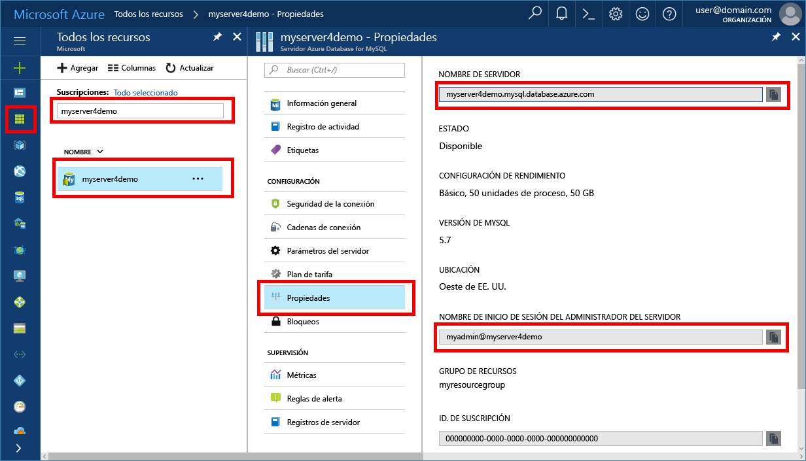

# <a name="azure-database-for-mysql-use-ruby-tooconnect-and-query-data"></a><span data-ttu-id="434ab-103">Base de datos de Azure para MySQL: Use Ruby tooconnect y consultar datos</span><span class="sxs-lookup"><span data-stu-id="434ab-103">Azure Database for MySQL: Use Ruby tooconnect and query data</span></span>
<span data-ttu-id="434ab-104">Este tutorial rápido muestra cómo tooconnect tooan Azure la base de datos de MySQL utilizando un [Ruby](https://www.ruby-lang.org) hello y aplicación [mysql2](https://rubygems.org/gems/mysql2) indicador entre plataformas de Windows, Ubuntu Linux y Mac.</span><span class="sxs-lookup"><span data-stu-id="434ab-104">This quickstart demonstrates how tooconnect tooan Azure Database for MySQL using a [Ruby](https://www.ruby-lang.org) application and hello [mysql2](https://rubygems.org/gems/mysql2) gem from Windows, Ubuntu Linux, and Mac platforms.</span></span> <span data-ttu-id="434ab-105">Muestra cómo toouse tooquery de instrucciones de SQL, insertar, actualizar y eliminar datos en la base de datos de Hola.</span><span class="sxs-lookup"><span data-stu-id="434ab-105">It shows how toouse SQL statements tooquery, insert, update, and delete data in hello database.</span></span> <span data-ttu-id="434ab-106">En este artículo se da por supuesto que está familiarizado con el desarrollo mediante Ruby, pero que se tooworking nueva con la base de datos de Azure para MySQL.</span><span class="sxs-lookup"><span data-stu-id="434ab-106">This article assumes you are familiar with development using Ruby, but that you are new tooworking with Azure Database for MySQL.</span></span>

## <a name="prerequisites"></a><span data-ttu-id="434ab-107">Requisitos previos</span><span class="sxs-lookup"><span data-stu-id="434ab-107">Prerequisites</span></span>
<span data-ttu-id="434ab-108">Este tutorial rápido usa recursos de hello creados en cualquiera de estas guías como punto de partida:</span><span class="sxs-lookup"><span data-stu-id="434ab-108">This quickstart uses hello resources created in either of these guides as a starting point:</span></span>
- <span data-ttu-id="434ab-109">[Create an Azure Database for MySQL server using Azure Portal](./quickstart-create-mysql-server-database-using-azure-portal.md) (Creación de un servidor de Azure Database for MySQL mediante Azure Portal)</span><span class="sxs-lookup"><span data-stu-id="434ab-109">[Create an Azure Database for MySQL server using Azure portal](./quickstart-create-mysql-server-database-using-azure-portal.md)</span></span>
- <span data-ttu-id="434ab-110">[Create an Azure Database for MySQL server using Azure CLI](./quickstart-create-mysql-server-database-using-azure-cli.md) (Creación de un servidor de Azure Database for MySQL mediante la CLI de Azure)</span><span class="sxs-lookup"><span data-stu-id="434ab-110">[Create an Azure Database for MySQL server using Azure CLI](./quickstart-create-mysql-server-database-using-azure-cli.md)</span></span>

## <a name="install-ruby"></a><span data-ttu-id="434ab-111">Instalación de Ruby</span><span class="sxs-lookup"><span data-stu-id="434ab-111">Install Ruby</span></span>
<span data-ttu-id="434ab-112">Instalar Ruby, la biblioteca de MySQL2 hello e indicador en su propio equipo.</span><span class="sxs-lookup"><span data-stu-id="434ab-112">Install Ruby, Gem, and hello MySQL2 library on your own machine.</span></span> 

### <a name="windows"></a><span data-ttu-id="434ab-113">Windows</span><span class="sxs-lookup"><span data-stu-id="434ab-113">Windows</span></span>
1. <span data-ttu-id="434ab-114">Descargue e instale la versión de Hola 2.3 de [Ruby](http://rubyinstaller.org/downloads/).</span><span class="sxs-lookup"><span data-stu-id="434ab-114">Download and Install hello 2.3 version of [Ruby](http://rubyinstaller.org/downloads/).</span></span>
2. <span data-ttu-id="434ab-115">Inicie un nuevo símbolo del sistema (cmd) desde el menú de inicio de Hola.</span><span class="sxs-lookup"><span data-stu-id="434ab-115">Launch a new command prompt (cmd) from hello Start menu.</span></span>
3. <span data-ttu-id="434ab-116">Cambie el directorio en hello Ruby directorio para la versión 2.3.</span><span class="sxs-lookup"><span data-stu-id="434ab-116">Change directory into hello Ruby directory for version 2.3.</span></span> `cd c:\Ruby23-x64\bin`
4. <span data-ttu-id="434ab-117">Hola prueba Ruby instalación mediante la ejecución de comando hello `ruby -v` versión de hello toosee instalada.</span><span class="sxs-lookup"><span data-stu-id="434ab-117">Test hello Ruby installation by running hello command `ruby -v` toosee hello version installed.</span></span>
5. <span data-ttu-id="434ab-118">Probar la instalación de indicador de hello mediante la ejecución de comando hello `gem -v` versión de hello toosee instalada.</span><span class="sxs-lookup"><span data-stu-id="434ab-118">Test hello Gem installation by running hello command `gem -v` toosee hello version installed.</span></span>
6. <span data-ttu-id="434ab-119">Generar el módulo de hello Mysql2 para Ruby con indicador mediante la ejecución de comando hello `gem install mysql2`.</span><span class="sxs-lookup"><span data-stu-id="434ab-119">Build hello Mysql2 module for Ruby using Gem by running hello command `gem install mysql2`.</span></span>

### <a name="macos"></a><span data-ttu-id="434ab-120">MacOS</span><span class="sxs-lookup"><span data-stu-id="434ab-120">MacOS</span></span>
1. <span data-ttu-id="434ab-121">Instalar Ruby con Homebrew mediante la ejecución de comando hello `brew install ruby`.</span><span class="sxs-lookup"><span data-stu-id="434ab-121">Install Ruby using Homebrew by running hello command `brew install ruby`.</span></span> <span data-ttu-id="434ab-122">Para obtener más opciones de instalación, vea Hola Ruby [documentación de la instalación](https://www.ruby-lang.org/en/documentation/installation/#homebrew).</span><span class="sxs-lookup"><span data-stu-id="434ab-122">For more installation options, see hello Ruby [installation documentation](https://www.ruby-lang.org/en/documentation/installation/#homebrew).</span></span>
2. <span data-ttu-id="434ab-123">Hola prueba Ruby instalación mediante la ejecución de comando hello `ruby -v` versión de hello toosee instalada.</span><span class="sxs-lookup"><span data-stu-id="434ab-123">Test hello Ruby installation by running hello command `ruby -v` toosee hello version installed.</span></span>
3. <span data-ttu-id="434ab-124">Probar la instalación de indicador de hello mediante la ejecución de comando hello `gem -v` versión de hello toosee instalada.</span><span class="sxs-lookup"><span data-stu-id="434ab-124">Test hello Gem installation by running hello command `gem -v` toosee hello version installed.</span></span>
4. <span data-ttu-id="434ab-125">Generar el módulo de hello Mysql2 para Ruby con indicador mediante la ejecución de comando hello `gem install mysql2`.</span><span class="sxs-lookup"><span data-stu-id="434ab-125">Build hello Mysql2 module for Ruby using Gem by running hello command `gem install mysql2`.</span></span>

### <a name="linux-ubuntu"></a><span data-ttu-id="434ab-126">Linux (Ubuntu)</span><span class="sxs-lookup"><span data-stu-id="434ab-126">Linux (Ubuntu)</span></span>
1. <span data-ttu-id="434ab-127">Instale Ruby ejecutando el comando de hello `sudo apt-get install ruby-full`.</span><span class="sxs-lookup"><span data-stu-id="434ab-127">Install Ruby by running hello command `sudo apt-get install ruby-full`.</span></span> <span data-ttu-id="434ab-128">Para obtener más opciones de instalación, vea Hola Ruby [documentación de la instalación](https://www.ruby-lang.org/en/documentation/installation/).</span><span class="sxs-lookup"><span data-stu-id="434ab-128">For more installation options, see hello Ruby [installation documentation](https://www.ruby-lang.org/en/documentation/installation/).</span></span>
2. <span data-ttu-id="434ab-129">Hola prueba Ruby instalación mediante la ejecución de comando hello `ruby -v` versión de hello toosee instalada.</span><span class="sxs-lookup"><span data-stu-id="434ab-129">Test hello Ruby installation by running hello command `ruby -v` toosee hello version installed.</span></span>
3. <span data-ttu-id="434ab-130">Instalar las actualizaciones más recientes de Hola para indicador mediante la ejecución de comando hello `sudo gem update --system`.</span><span class="sxs-lookup"><span data-stu-id="434ab-130">Install hello latest updates for Gem by running hello command `sudo gem update --system`.</span></span>
4. <span data-ttu-id="434ab-131">Probar la instalación de indicador de hello mediante la ejecución de comando hello `gem -v` versión de hello toosee instalada.</span><span class="sxs-lookup"><span data-stu-id="434ab-131">Test hello Gem installation by running hello command `gem -v` toosee hello version installed.</span></span>
5. <span data-ttu-id="434ab-132">Instalar gcc hello, marca y otras herramientas de compilación mediante la ejecución de comando hello `sudo apt-get install build-essential`.</span><span class="sxs-lookup"><span data-stu-id="434ab-132">Install hello gcc, make, and other build tools by running hello command `sudo apt-get install build-essential`.</span></span>
6. <span data-ttu-id="434ab-133">Instalar bibliotecas de desarrollador de cliente de MySQL de hello mediante la ejecución de comando hello `sudo apt-get install libmysqlclient-dev`.</span><span class="sxs-lookup"><span data-stu-id="434ab-133">Install hello MySQL client developer libraries by running hello command `sudo apt-get install libmysqlclient-dev`.</span></span>
7. <span data-ttu-id="434ab-134">Generar el módulo de mysql2 Hola para Ruby con indicador mediante la ejecución de comando hello `sudo gem install mysql2`.</span><span class="sxs-lookup"><span data-stu-id="434ab-134">Build hello mysql2 module for Ruby using Gem by running hello command `sudo gem install mysql2`.</span></span>

## <a name="get-connection-information"></a><span data-ttu-id="434ab-135">Obtención de información sobre la conexión</span><span class="sxs-lookup"><span data-stu-id="434ab-135">Get connection information</span></span>
<span data-ttu-id="434ab-136">Obtener Hola conexión información necesaria tooconnect toohello base de datos MySQL.</span><span class="sxs-lookup"><span data-stu-id="434ab-136">Get hello connection information needed tooconnect toohello Azure Database for MySQL.</span></span> <span data-ttu-id="434ab-137">Es necesario Hola credenciales de inicio de sesión y nombre de servidor completo.</span><span class="sxs-lookup"><span data-stu-id="434ab-137">You need hello fully qualified server name and login credentials.</span></span>

1. <span data-ttu-id="434ab-138">Inicie sesión en toohello [portal de Azure](https://portal.azure.com/).</span><span class="sxs-lookup"><span data-stu-id="434ab-138">Log in toohello [Azure portal](https://portal.azure.com/).</span></span>
2. <span data-ttu-id="434ab-139">En el menú de la izquierda de hello en el portal de Azure, haga clic en **todos los recursos** y busque servidor hello plegado, como **myserver4demo**.</span><span class="sxs-lookup"><span data-stu-id="434ab-139">From hello left-hand menu in Azure portal, click **All resources** and search for hello server you have creased, such as **myserver4demo**.</span></span>
3. <span data-ttu-id="434ab-140">Haga clic en el nombre del servidor de hello **myserver4demo**.</span><span class="sxs-lookup"><span data-stu-id="434ab-140">Click hello server name **myserver4demo**.</span></span>
4. <span data-ttu-id="434ab-141">Servidor de hello seleccione **propiedades** página.</span><span class="sxs-lookup"><span data-stu-id="434ab-141">Select hello server's **Properties** page.</span></span> <span data-ttu-id="434ab-142">Tome nota de hello **nombre del servidor** y **nombre de inicio de sesión del Administrador de servidor**.</span><span class="sxs-lookup"><span data-stu-id="434ab-142">Make a note of hello **Server name** and **Server admin login name**.</span></span>
 <span data-ttu-id="434ab-143"></span><span class="sxs-lookup"><span data-stu-id="434ab-143"></span></span>
5. <span data-ttu-id="434ab-144">Si olvida su información de inicio de sesión de servidor, vaya a toohello **información general sobre** página Nombre de inicio de sesión de administrador del servidor de tooview hello y, si es necesario, restablecer la contraseña de Hola.</span><span class="sxs-lookup"><span data-stu-id="434ab-144">If you forget your server login information, navigate toohello **Overview** page tooview hello Server admin login name and, if necessary, reset hello password.</span></span>

## <a name="run-ruby-code"></a><span data-ttu-id="434ab-145">Ejecución del código Ruby</span><span class="sxs-lookup"><span data-stu-id="434ab-145">Run Ruby code</span></span> 
1. <span data-ttu-id="434ab-146">Pegue Hola Ruby código de las secciones de Hola a continuación en archivos de texto y guardar archivos de hello en una carpeta del proyecto con RB de extensión de archivo, como `C:\rubymysql\createtable.rb` o `/home/username/rubymysql/createtable.rb`.</span><span class="sxs-lookup"><span data-stu-id="434ab-146">Paste hello Ruby code from hello sections below into text files, and save hello files into a project folder with file extension .rb, such as `C:\rubymysql\createtable.rb` or `/home/username/rubymysql/createtable.rb`.</span></span>
2. <span data-ttu-id="434ab-147">código de hello toorun, inicie el símbolo del sistema de Hola o el shell de bash.</span><span class="sxs-lookup"><span data-stu-id="434ab-147">toorun hello code, launch hello command prompt or bash shell.</span></span> <span data-ttu-id="434ab-148">Cambie el directorio a la carpeta de proyecto `cd rubymysql`.</span><span class="sxs-lookup"><span data-stu-id="434ab-148">Change directory into your project folder `cd rubymysql`</span></span>
3. <span data-ttu-id="434ab-149">A continuación, escriba el comando hello ruby seguida por nombre de archivo de hello, como `ruby createtable.rb` aplicación de hello toorun.</span><span class="sxs-lookup"><span data-stu-id="434ab-149">Then type hello ruby command followed by hello file name, such as `ruby createtable.rb` toorun hello application.</span></span>
4. <span data-ttu-id="434ab-150">En el sistema operativo Windows hello, si la aplicación hello ruby no está en la variable de entorno path, puede necesita toouse Hola ruta de acceso completa toolaunch Hola nodo aplicación, como`"c:\Ruby23-x64\bin\ruby.exe" createtable.rb`</span><span class="sxs-lookup"><span data-stu-id="434ab-150">On hello Windows OS, if hello ruby application is not in your path environment variable, you may need toouse hello full path toolaunch hello node application, such as `"c:\Ruby23-x64\bin\ruby.exe" createtable.rb`</span></span>

## <a name="connect-and-create-a-table"></a><span data-ttu-id="434ab-151">Conexión y creación de una tabla</span><span class="sxs-lookup"><span data-stu-id="434ab-151">Connect and create a table</span></span>
<span data-ttu-id="434ab-152">Código tooconnect siguiente de Hola de uso y crear una tabla mediante **CREATE TABLE** instrucción SQL, seguido de **INSERT INTO** tooadd filas de las instrucciones de SQL en la tabla de Hola.</span><span class="sxs-lookup"><span data-stu-id="434ab-152">Use hello following code tooconnect and create a table using **CREATE TABLE** SQL statement, followed by **INSERT INTO** SQL statements tooadd rows into hello table.</span></span>

<span data-ttu-id="434ab-153">código de Hello usa un [mysql2::client](http://www.rubydoc.info/gems/mysql2/0.4.8) clase .new() método tooconnect tooAzure base de datos de MySQL.</span><span class="sxs-lookup"><span data-stu-id="434ab-153">hello code uses a [mysql2::client](http://www.rubydoc.info/gems/mysql2/0.4.8) class .new() method tooconnect tooAzure Database for MySQL.</span></span> <span data-ttu-id="434ab-154">A continuación, llama el método [query()](http://www.rubydoc.info/gems/mysql2/0.4.8#Usage) varias veces toorun hello, CREATE TABLE, comandos DROP y INSERT INTO.</span><span class="sxs-lookup"><span data-stu-id="434ab-154">Then it calls method [query()](http://www.rubydoc.info/gems/mysql2/0.4.8#Usage) several times toorun hello DROP, CREATE TABLE, and INSERT INTO commands.</span></span> <span data-ttu-id="434ab-155">A continuación, llama el método [close()](http://www.rubydoc.info/gems/mysql2/0.4.8/Mysql2/Client#close-instance_method) conexión de hello tooclose antes de finalizar.</span><span class="sxs-lookup"><span data-stu-id="434ab-155">Then it calls method [close()](http://www.rubydoc.info/gems/mysql2/0.4.8/Mysql2/Client#close-instance_method) tooclose hello connection before terminating.</span></span>

<span data-ttu-id="434ab-156">Reemplace hello `host`, `database`, `username`, y `password` cadenas con sus propios valores.</span><span class="sxs-lookup"><span data-stu-id="434ab-156">Replace hello `host`, `database`, `username`, and `password` strings with your own values.</span></span> 
```ruby
require 'mysql2'

begin
    # Initialize connection variables.
    host = String('myserver4demo.mysql.database.azure.com')
    database = String('quickstartdb')
    username = String('myadmin@myserver4demo')
    password = String('yourpassword')

    # Initialize connection object.
    client = Mysql2::Client.new(:host => host, :username => username, :database => database, :password => password)
    puts 'Successfully created connection toodatabase.'

    # Drop previous table of same name if one exists
    client.query('DROP TABLE IF EXISTS inventory;')
    puts 'Finished dropping table (if existed).'

    # Drop previous table of same name if one exists.
    client.query('CREATE TABLE inventory (id serial PRIMARY KEY, name VARCHAR(50), quantity INTEGER);')
    puts 'Finished creating table.'

    # Insert some data into table.
    client.query("INSERT INTO inventory VALUES(1, 'banana', 150)")
    client.query("INSERT INTO inventory VALUES(2, 'orange', 154)")
    client.query("INSERT INTO inventory VALUES(3, 'apple', 100)")
    puts 'Inserted 3 rows of data.'

# Error handling
rescue Exception => e
    puts e.message

# Cleanup
ensure
    client.close if client
    puts 'Done.'
end
```

## <a name="read-data"></a><span data-ttu-id="434ab-157">Lectura de datos</span><span class="sxs-lookup"><span data-stu-id="434ab-157">Read data</span></span>
<span data-ttu-id="434ab-158">Código tooconnect siguiente de Hola de uso y leer datos de hello mediante un **seleccione** instrucción SQL.</span><span class="sxs-lookup"><span data-stu-id="434ab-158">Use hello following code tooconnect and read hello data using a **SELECT** SQL statement.</span></span> 

<span data-ttu-id="434ab-159">código de Hello usa un [mysql2::client](http://www.rubydoc.info/gems/mysql2/0.4.8) clase .new() método tooconnect tooAzure base de datos de MySQL.</span><span class="sxs-lookup"><span data-stu-id="434ab-159">hello code uses a [mysql2::client](http://www.rubydoc.info/gems/mysql2/0.4.8) class .new() method tooconnect tooAzure Database for MySQL.</span></span> <span data-ttu-id="434ab-160">A continuación, llama el método [query()](http://www.rubydoc.info/gems/mysql2/0.4.8#Usage) comandos SELECT de toorun Hola.</span><span class="sxs-lookup"><span data-stu-id="434ab-160">Then it calls method [query()](http://www.rubydoc.info/gems/mysql2/0.4.8#Usage) toorun hello SELECT commands.</span></span> <span data-ttu-id="434ab-161">A continuación, llama el método [close()](http://www.rubydoc.info/gems/mysql2/0.4.8/Mysql2/Client#close-instance_method) conexión de hello tooclose antes de finalizar.</span><span class="sxs-lookup"><span data-stu-id="434ab-161">Then it calls method [close()](http://www.rubydoc.info/gems/mysql2/0.4.8/Mysql2/Client#close-instance_method) tooclose hello connection before terminating.</span></span>

<span data-ttu-id="434ab-162">Reemplace hello `host`, `database`, `username`, y `password` cadenas con sus propios valores.</span><span class="sxs-lookup"><span data-stu-id="434ab-162">Replace hello `host`, `database`, `username`, and `password` strings with your own values.</span></span> 

```ruby
require 'mysql2'

begin
    # Initialize connection variables.
    host = String('myserver4demo.mysql.database.azure.com')
    database = String('quickstartdb')
    username = String('myadmin@myserver4demo')
    password = String('yourpassword')

    # Initialize connection object.
    client = Mysql2::Client.new(:host => host, :username => username, :database => database, :password => password)
    puts 'Successfully created connection toodatabase.'

    # Read data
    resultSet = client.query('SELECT * from inventory;')
    resultSet.each do |row|
        puts 'Data row = (%s, %s, %s)' % [row['id'], row['name'], row['quantity']]
    end
    puts 'Read ' + resultSet.count.to_s + ' row(s).'

# Error handling
rescue Exception => e
    puts e.message

# Cleanup
ensure
    client.close if client
    puts 'Done.'
end
```

## <a name="update-data"></a><span data-ttu-id="434ab-163">Actualización de datos</span><span class="sxs-lookup"><span data-stu-id="434ab-163">Update data</span></span>
<span data-ttu-id="434ab-164">Código tooconnect siguiente de Hola de uso y actualizar Hola datos mediante un **actualizar** instrucción SQL.</span><span class="sxs-lookup"><span data-stu-id="434ab-164">Use hello following code tooconnect and update hello data using a **UPDATE** SQL statement.</span></span>

<span data-ttu-id="434ab-165">código de Hello usa un [mysql2::client](http://www.rubydoc.info/gems/mysql2/0.4.8) clase .new() método tooconnect tooAzure base de datos de MySQL.</span><span class="sxs-lookup"><span data-stu-id="434ab-165">hello code uses a [mysql2::client](http://www.rubydoc.info/gems/mysql2/0.4.8) class .new() method tooconnect tooAzure Database for MySQL.</span></span> <span data-ttu-id="434ab-166">A continuación, llama el método [query()](http://www.rubydoc.info/gems/mysql2/0.4.8#Usage) comandos de actualización de toorun Hola.</span><span class="sxs-lookup"><span data-stu-id="434ab-166">Then it calls method [query()](http://www.rubydoc.info/gems/mysql2/0.4.8#Usage) toorun hello UPDATE commands.</span></span> <span data-ttu-id="434ab-167">A continuación, llama el método [close()](http://www.rubydoc.info/gems/mysql2/0.4.8/Mysql2/Client#close-instance_method) conexión de hello tooclose antes de finalizar.</span><span class="sxs-lookup"><span data-stu-id="434ab-167">Then it calls method [close()](http://www.rubydoc.info/gems/mysql2/0.4.8/Mysql2/Client#close-instance_method) tooclose hello connection before terminating.</span></span>

<span data-ttu-id="434ab-168">Reemplace hello `host`, `database`, `username`, y `password` cadenas con sus propios valores.</span><span class="sxs-lookup"><span data-stu-id="434ab-168">Replace hello `host`, `database`, `username`, and `password` strings with your own values.</span></span> 

```ruby
require 'mysql2'

begin
    # Initialize connection variables.
    host = String('myserver4demo.mysql.database.azure.com')
    database = String('quickstartdb')
    username = String('myadmin@myserver4demo')
    password = String('yourpassword')

    # Initialize connection object.
    client = Mysql2::Client.new(:host => host, :username => username, :database => database, :password => password)
    puts 'Successfully created connection toodatabase.'

    # Update data
   client.query('UPDATE inventory SET quantity = %d WHERE name = %s;' % [200, '\'banana\''])
   puts 'Updated 1 row of data.'

# Error handling
rescue Exception => e
    puts e.message

# Cleanup
ensure
    client.close if client
    puts 'Done.'
end
```


## <a name="delete-data"></a><span data-ttu-id="434ab-169">Eliminación de datos</span><span class="sxs-lookup"><span data-stu-id="434ab-169">Delete data</span></span>
<span data-ttu-id="434ab-170">Código tooconnect siguiente de Hola de uso y leer datos de hello mediante un **eliminar** instrucción SQL.</span><span class="sxs-lookup"><span data-stu-id="434ab-170">Use hello following code tooconnect and read hello data using a **DELETE** SQL statement.</span></span> 

<span data-ttu-id="434ab-171">código de Hello usa un [mysql2::client](http://www.rubydoc.info/gems/mysql2/0.4.8) clase .new() método tooconnect tooAzure base de datos de MySQL.</span><span class="sxs-lookup"><span data-stu-id="434ab-171">hello code uses a [mysql2::client](http://www.rubydoc.info/gems/mysql2/0.4.8) class .new() method tooconnect tooAzure Database for MySQL.</span></span> <span data-ttu-id="434ab-172">A continuación, llama el método [query()](http://www.rubydoc.info/gems/mysql2/0.4.8#Usage) comandos DELETE de toorun Hola.</span><span class="sxs-lookup"><span data-stu-id="434ab-172">Then it calls method [query()](http://www.rubydoc.info/gems/mysql2/0.4.8#Usage) toorun hello DELETE commands.</span></span> <span data-ttu-id="434ab-173">A continuación, llama el método [close()](http://www.rubydoc.info/gems/mysql2/0.4.8/Mysql2/Client#close-instance_method) conexión de hello tooclose antes de finalizar.</span><span class="sxs-lookup"><span data-stu-id="434ab-173">Then it calls method [close()](http://www.rubydoc.info/gems/mysql2/0.4.8/Mysql2/Client#close-instance_method) tooclose hello connection before terminating.</span></span>

<span data-ttu-id="434ab-174">Reemplace hello `host`, `database`, `username`, y `password` cadenas con sus propios valores.</span><span class="sxs-lookup"><span data-stu-id="434ab-174">Replace hello `host`, `database`, `username`, and `password` strings with your own values.</span></span> 

```ruby
require 'mysql2'

begin
    # Initialize connection variables.
    host = String('myserver4demo.mysql.database.azure.com')
    database = String('quickstartdb')
    username = String('myadmin@myserver4demo')
    password = String('yourpassword')

    # Initialize connection object.
    client = Mysql2::Client.new(:host => host, :username => username, :database => database, :password => password)
    puts 'Successfully created connection toodatabase.'

    # Delete data
    resultSet = client.query('DELETE FROM inventory WHERE name = %s;' % ['\'orange\''])
    puts 'Deleted 1 row.'

# Error handling
rescue Exception => e
    puts e.message

# Cleanup
ensure
    client.close if client
    puts 'Done.'
end
```

## <a name="next-steps"></a><span data-ttu-id="434ab-175">Pasos siguientes</span><span class="sxs-lookup"><span data-stu-id="434ab-175">Next steps</span></span>
> [!div class="nextstepaction"]
> [<span data-ttu-id="434ab-176">Migración de una base de datos mediante exportación e importación</span><span class="sxs-lookup"><span data-stu-id="434ab-176">Migrate your database using Export and Import</span></span>](./concepts-migrate-import-export.md)
