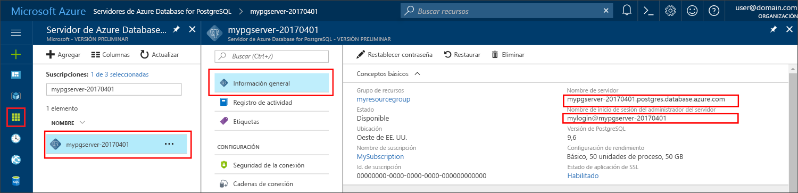

# <a name="azure-database-for-postgresql-use-go-language-to-connect-and-query-data"></a><span data-ttu-id="72c6a-103">Azure Database for PostgreSQL: uso del lenguaje Go para conectarse y consultar datos</span><span class="sxs-lookup"><span data-stu-id="72c6a-103">Azure Database for PostgreSQL: Use Go language to connect and query data</span></span>
<span data-ttu-id="72c6a-104">En este tutorial rápido se muestra cómo conectarse a una instancia de Azure Database for PostgreSQL mediante código escrito en el lenguaje [Go](https://golang.org/) (golang).</span><span class="sxs-lookup"><span data-stu-id="72c6a-104">This quickstart demonstrates how to connect to an Azure Database for PostgreSQL using code written in the [Go](https://golang.org/) language (golang).</span></span> <span data-ttu-id="72c6a-105">Se indica cómo usar instrucciones SQL para consultar, insertar, actualizar y eliminar datos en la base de datos.</span><span class="sxs-lookup"><span data-stu-id="72c6a-105">It shows how to use SQL statements to query, insert, update, and delete data in the database.</span></span> <span data-ttu-id="72c6a-106">En este artículo se da por hecho que está familiarizado con el desarrollo mediante Go, pero que nunca ha trabajado con Azure Database para PostgreSQL.</span><span class="sxs-lookup"><span data-stu-id="72c6a-106">This article assumes you are familiar with development using Go, but that you are new to working with Azure Database for PostgreSQL.</span></span>

## <a name="prerequisites"></a><span data-ttu-id="72c6a-107">Requisitos previos</span><span class="sxs-lookup"><span data-stu-id="72c6a-107">Prerequisites</span></span>
<span data-ttu-id="72c6a-108">En este tutorial rápido se usan como punto de partida los recursos creados en una de estas guías:</span><span class="sxs-lookup"><span data-stu-id="72c6a-108">This quickstart uses the resources created in either of these guides as a starting point:</span></span>
- [<span data-ttu-id="72c6a-109">Creación de la base de datos: Azure Portal</span><span class="sxs-lookup"><span data-stu-id="72c6a-109">Create DB - Portal</span></span>](quickstart-create-server-database-portal.md)
- [<span data-ttu-id="72c6a-110">Creación de la base de datos: CLI de Azure</span><span class="sxs-lookup"><span data-stu-id="72c6a-110">Create DB - Azure CLI</span></span>](quickstart-create-server-database-azure-cli.md)

## <a name="install-go-and-pq-connector"></a><span data-ttu-id="72c6a-111">Instalación de Go y del conector pq</span><span class="sxs-lookup"><span data-stu-id="72c6a-111">Install Go and pq connector</span></span>
<span data-ttu-id="72c6a-112">Instale [Go](https://golang.org/doc/install) y el [controlador Pure Go Postgres (pq)](https://github.com/lib/pq) en su máquina.</span><span class="sxs-lookup"><span data-stu-id="72c6a-112">Install [Go](https://golang.org/doc/install) and the [Pure Go Postgres driver (pq)](https://github.com/lib/pq) on your own machine.</span></span> <span data-ttu-id="72c6a-113">Dependiendo de la plataforma, siga estos pasos:</span><span class="sxs-lookup"><span data-stu-id="72c6a-113">Depending on your platform, follow the steps:</span></span>

### <a name="windows"></a><span data-ttu-id="72c6a-114">Windows</span><span class="sxs-lookup"><span data-stu-id="72c6a-114">Windows</span></span>
1. <span data-ttu-id="72c6a-115">[Descargue](https://golang.org/dl/) e instale Go para Microsoft Windows de acuerdo con las [instrucciones de instalación](https://golang.org/doc/install).</span><span class="sxs-lookup"><span data-stu-id="72c6a-115">[Download](https://golang.org/dl/) and install Go for Microsoft Windows according to the [installation instructions](https://golang.org/doc/install).</span></span>
2. <span data-ttu-id="72c6a-116">En el menú Inicio, inicie el símbolo del sistema.</span><span class="sxs-lookup"><span data-stu-id="72c6a-116">Launch the command prompt from the start menu.</span></span>
3. <span data-ttu-id="72c6a-117">Cree una carpeta para su proyecto, como</span><span class="sxs-lookup"><span data-stu-id="72c6a-117">Make a folder for your project such.</span></span> <span data-ttu-id="72c6a-118">`mkdir  %USERPROFILE%\go\src\postgresqlgo`.</span><span class="sxs-lookup"><span data-stu-id="72c6a-118">`mkdir  %USERPROFILE%\go\src\postgresqlgo`.</span></span>
4. <span data-ttu-id="72c6a-119">Cambie el directorio a la carpeta de proyecto, por ejemplo `cd %USERPROFILE%\go\src\postgresqlgo`.</span><span class="sxs-lookup"><span data-stu-id="72c6a-119">Change directory into the project folder, such as `cd %USERPROFILE%\go\src\postgresqlgo`.</span></span>
5. <span data-ttu-id="72c6a-120">Establezca la variable de entorno para GOPATH con el fin de que apunte al directorio de código fuente.</span><span class="sxs-lookup"><span data-stu-id="72c6a-120">Set the environment variable for GOPATH to point to the source code directory.</span></span> <span data-ttu-id="72c6a-121">`set GOPATH=%USERPROFILE%\go`.</span><span class="sxs-lookup"><span data-stu-id="72c6a-121">`set GOPATH=%USERPROFILE%\go`.</span></span>
6. <span data-ttu-id="72c6a-122">Instale el [controlador Pure Go Postgres (pq)](https://github.com/lib/pq) mediante la ejecución del comando `go get github.com/lib/pq`.</span><span class="sxs-lookup"><span data-stu-id="72c6a-122">Install the [Pure Go Postgres driver (pq)](https://github.com/lib/pq) by running the `go get github.com/lib/pq` command.</span></span>

   <span data-ttu-id="72c6a-123">En resumen, instale Go y después ejecute estos comandos en el símbolo del sistema:</span><span class="sxs-lookup"><span data-stu-id="72c6a-123">In summary, install Go, then run these commands in the command prompt:</span></span>
   ```cmd
   mkdir  %USERPROFILE%\go\src\postgresqlgo
   cd %USERPROFILE%\go\src\postgresqlgo
   set GOPATH=%USERPROFILE%\go
   go get github.com/lib/pq
   ```

### <a name="linux-ubuntu"></a><span data-ttu-id="72c6a-124">Linux (Ubuntu)</span><span class="sxs-lookup"><span data-stu-id="72c6a-124">Linux (Ubuntu)</span></span>
1. <span data-ttu-id="72c6a-125">Inicie el shell de Bash.</span><span class="sxs-lookup"><span data-stu-id="72c6a-125">Launch the Bash shell.</span></span> 
2. <span data-ttu-id="72c6a-126">Instale Go mediante la ejecución de `sudo apt-get install golang-go`.</span><span class="sxs-lookup"><span data-stu-id="72c6a-126">Install Go by running `sudo apt-get install golang-go`.</span></span>
3. <span data-ttu-id="72c6a-127">Cree una carpeta para el proyecto en su directorio principal, como `mkdir -p ~/go/src/postgresqlgo/`.</span><span class="sxs-lookup"><span data-stu-id="72c6a-127">Make a folder for your project in your home directory, such as `mkdir -p ~/go/src/postgresqlgo/`.</span></span>
4. <span data-ttu-id="72c6a-128">Cambie el directorio a la carpeta, por ejemplo, `cd ~/go/src/postgresqlgo/`.</span><span class="sxs-lookup"><span data-stu-id="72c6a-128">Change directory into the folder, such as `cd ~/go/src/postgresqlgo/`.</span></span>
5. <span data-ttu-id="72c6a-129">Establezca la variable de entorno GOPATH para que apunte a un directorio de origen válido, como la carpeta go del directorio principal actual.</span><span class="sxs-lookup"><span data-stu-id="72c6a-129">Set the GOPATH environment variable to point to a valid source directory, such as your current home directory's go folder.</span></span> <span data-ttu-id="72c6a-130">En el shell de Bash, ejecute `export GOPATH=~/go` para agregar el directorio go como GOPATH para la sesión de shell actual.</span><span class="sxs-lookup"><span data-stu-id="72c6a-130">At the bash shell, run `export GOPATH=~/go` to add the go directory as the GOPATH for the current shell session.</span></span>
6. <span data-ttu-id="72c6a-131">Instale el [controlador Pure Go Postgres (pq)](https://github.com/lib/pq) mediante la ejecución del comando `go get github.com/lib/pq`.</span><span class="sxs-lookup"><span data-stu-id="72c6a-131">Install the [Pure Go Postgres driver (pq)](https://github.com/lib/pq) by running the `go get github.com/lib/pq` command.</span></span>

   <span data-ttu-id="72c6a-132">En resumen, ejecute estos comandos de Bash:</span><span class="sxs-lookup"><span data-stu-id="72c6a-132">In summary, run these bash commands:</span></span>
   ```bash
   sudo apt-get install golang-go
   mkdir -p ~/go/src/postgresqlgo/
   cd ~/go/src/postgresqlgo/
   export GOPATH=~/go/
   go get github.com/lib/pq
   ```

### <a name="apple-macos"></a><span data-ttu-id="72c6a-133">MacOS de Apple</span><span class="sxs-lookup"><span data-stu-id="72c6a-133">Apple macOS</span></span>
1. <span data-ttu-id="72c6a-134">Descargue e instale Go de acuerdo con las [instrucciones de instalación](https://golang.org/doc/install) que coincidan con su plataforma.</span><span class="sxs-lookup"><span data-stu-id="72c6a-134">Download and install Go according to the [installation instructions](https://golang.org/doc/install)  matching your platform.</span></span> 
2. <span data-ttu-id="72c6a-135">Inicie el shell de Bash.</span><span class="sxs-lookup"><span data-stu-id="72c6a-135">Launch the Bash shell.</span></span> 
3. <span data-ttu-id="72c6a-136">Cree una carpeta para el proyecto en su directorio principal, como `mkdir -p ~/go/src/postgresqlgo/`.</span><span class="sxs-lookup"><span data-stu-id="72c6a-136">Make a folder for your project in your home directory, such as `mkdir -p ~/go/src/postgresqlgo/`.</span></span>
4. <span data-ttu-id="72c6a-137">Cambie el directorio a la carpeta, por ejemplo, `cd ~/go/src/postgresqlgo/`.</span><span class="sxs-lookup"><span data-stu-id="72c6a-137">Change directory into the folder, such as `cd ~/go/src/postgresqlgo/`.</span></span>
5. <span data-ttu-id="72c6a-138">Establezca la variable de entorno GOPATH para que apunte a un directorio de origen válido, como la carpeta go del directorio principal actual.</span><span class="sxs-lookup"><span data-stu-id="72c6a-138">Set the GOPATH environment variable to point to a valid source directory, such as your current home directory's go folder.</span></span> <span data-ttu-id="72c6a-139">En el shell de Bash, ejecute `export GOPATH=~/go` para agregar el directorio go como GOPATH para la sesión de shell actual.</span><span class="sxs-lookup"><span data-stu-id="72c6a-139">At the bash shell, run `export GOPATH=~/go` to add the go directory as the GOPATH for the current shell session.</span></span>
6. <span data-ttu-id="72c6a-140">Instale el [controlador Pure Go Postgres (pq)](https://github.com/lib/pq) mediante la ejecución del comando `go get github.com/lib/pq`.</span><span class="sxs-lookup"><span data-stu-id="72c6a-140">Install the [Pure Go Postgres driver (pq)](https://github.com/lib/pq) by running the `go get github.com/lib/pq` command.</span></span>

   <span data-ttu-id="72c6a-141">En resumen, instale Go y después ejecute estos comandos de Bash:</span><span class="sxs-lookup"><span data-stu-id="72c6a-141">In summary, install Go, then run these bash commands:</span></span>
   ```bash
   mkdir -p ~/go/src/postgresqlgo/
   cd ~/go/src/postgresqlgo/
   export GOPATH=~/go/
   go get github.com/lib/pq
   ```

## <a name="get-connection-information"></a><span data-ttu-id="72c6a-142">Obtención de información sobre la conexión</span><span class="sxs-lookup"><span data-stu-id="72c6a-142">Get connection information</span></span>
<span data-ttu-id="72c6a-143">Obtenga la información de conexión necesaria para conectarse a Azure Database for PostgreSQL.</span><span class="sxs-lookup"><span data-stu-id="72c6a-143">Get the connection information needed to connect to the Azure Database for PostgreSQL.</span></span> <span data-ttu-id="72c6a-144">Necesitará el nombre completo del servidor y las credenciales de inicio de sesión.</span><span class="sxs-lookup"><span data-stu-id="72c6a-144">You need the fully qualified server name and login credentials.</span></span>

1. <span data-ttu-id="72c6a-145">Inicie sesión en [Azure Portal](https://portal.azure.com/).</span><span class="sxs-lookup"><span data-stu-id="72c6a-145">Log in to the [Azure portal](https://portal.azure.com/).</span></span>
2. <span data-ttu-id="72c6a-146">En el menú izquierdo de Azure Portal, haga clic en **Todos los recursos** y busque el servidor que ha creado, por ejemplo, **mypgserver-20170401**.</span><span class="sxs-lookup"><span data-stu-id="72c6a-146">From the left-hand menu in Azure portal, click **All resources** and search for the server you have created, such as **mypgserver-20170401**.</span></span>
3. <span data-ttu-id="72c6a-147">Haga clic en el nombre del servidor **mypgserver-20170401**.</span><span class="sxs-lookup"><span data-stu-id="72c6a-147">Click the server name **mypgserver-20170401**.</span></span>
4. <span data-ttu-id="72c6a-148">Seleccione la página **Introducción** del servidor.</span><span class="sxs-lookup"><span data-stu-id="72c6a-148">Select the server's **Overview** page.</span></span> <span data-ttu-id="72c6a-149">Tome nota del **Nombre del servidor** y del **Server admin login name** (Nombre de inicio de sesión del administrador del servidor).</span><span class="sxs-lookup"><span data-stu-id="72c6a-149">Make a note of the **Server name** and **Server admin login name**.</span></span>
 <span data-ttu-id="72c6a-150"></span><span class="sxs-lookup"><span data-stu-id="72c6a-150"></span></span>
5. <span data-ttu-id="72c6a-151">Si olvida la información de inicio de sesión del servidor, navegue hasta la página **Información general** y vea el nombre de inicio de sesión del Administrador del servidor.</span><span class="sxs-lookup"><span data-stu-id="72c6a-151">If you forget your server login information, navigate to the **Overview** page, and view the Server admin login name.</span></span> <span data-ttu-id="72c6a-152">Si es necesario, restablezca la contraseña.</span><span class="sxs-lookup"><span data-stu-id="72c6a-152">If necessary, reset the password.</span></span>

## <a name="build-and-run-go-code"></a><span data-ttu-id="72c6a-153">Compilación y ejecución del código de Go</span><span class="sxs-lookup"><span data-stu-id="72c6a-153">Build and run Go code</span></span> 
1. <span data-ttu-id="72c6a-154">Para escribir código Golang, utilice un editor de texto simple, como el Bloc de notas en Microsoft Windows, [vi](http://manpages.ubuntu.com/manpages/xenial/man1/nvi.1.html#contenttoc5) o [Nano](https://www.nano-editor.org/) en Ubuntu, o TextEdit en macOS.</span><span class="sxs-lookup"><span data-stu-id="72c6a-154">To write Golang code, you can use a simple text editor, such as Notepad in Microsoft Windows, [vi](http://manpages.ubuntu.com/manpages/xenial/man1/nvi.1.html#contenttoc5) or [Nano](https://www.nano-editor.org/) in Ubuntu, or TextEdit in macOS.</span></span> <span data-ttu-id="72c6a-155">Si prefiere un entorno de desarrollo integrado (IDE) más rico, pruebe [Gogland](https://www.jetbrains.com/go/) de Jetbrains, [Visual Studio Code](https://code.visualstudio.com/) de Microsoft o [Atom](https://atom.io/).</span><span class="sxs-lookup"><span data-stu-id="72c6a-155">If you prefer a richer Interactive Development Environment (IDE) try [Gogland](https://www.jetbrains.com/go/) by Jetbrains, [Visual Studio Code](https://code.visualstudio.com/) by Microsoft, or [Atom](https://atom.io/).</span></span>
2. <span data-ttu-id="72c6a-156">Pegue el código de Golang de las secciones siguientes en archivos de texto y guárdelos en la carpeta del proyecto con la extensión de archivo \*.go, como la ruta de acceso de Windows `%USERPROFILE%\go\src\postgresqlgo\createtable.go` o la ruta de acceso de Linux `~/go/src/postgresqlgo/createtable.go`.</span><span class="sxs-lookup"><span data-stu-id="72c6a-156">Paste the Golang code from the sections below into text files, and save into your project folder with file extension \*.go, such as Windows path `%USERPROFILE%\go\src\postgresqlgo\createtable.go` or Linux path `~/go/src/postgresqlgo/createtable.go`.</span></span>
3. <span data-ttu-id="72c6a-157">Busque las constantes `HOST`, `DATABASE`, `USER` y `PASSWORD` en el código y reemplace los valores de ejemplo con sus propios valores.</span><span class="sxs-lookup"><span data-stu-id="72c6a-157">Locate the `HOST`, `DATABASE`, `USER`, and `PASSWORD` constants in the code, and replace the example values with your own values.</span></span>  
4. <span data-ttu-id="72c6a-158">Inicie el símbolo del sistema o el shell de Bash.</span><span class="sxs-lookup"><span data-stu-id="72c6a-158">Launch the command prompt or bash shell.</span></span> <span data-ttu-id="72c6a-159">Cambie el directorio a la carpeta de proyecto.</span><span class="sxs-lookup"><span data-stu-id="72c6a-159">Change directory into your project folder.</span></span> <span data-ttu-id="72c6a-160">Por ejemplo, en Windows `cd %USERPROFILE%\go\src\postgresqlgo\`.</span><span class="sxs-lookup"><span data-stu-id="72c6a-160">For example, on Windows `cd %USERPROFILE%\go\src\postgresqlgo\`.</span></span> <span data-ttu-id="72c6a-161">En Linux `cd ~/go/src/postgresqlgo/`.</span><span class="sxs-lookup"><span data-stu-id="72c6a-161">On Linux `cd ~/go/src/postgresqlgo/`.</span></span> <span data-ttu-id="72c6a-162">Algunos de los entornos de IDE mencionados ofrecen funcionalidades de depuración y de tiempo de ejecución sin necesidad de comandos de shell.</span><span class="sxs-lookup"><span data-stu-id="72c6a-162">Some of the IDE environments mentioned offer debug and runtime capabilities without requiring shell commands.</span></span>
5. <span data-ttu-id="72c6a-163">Ejecute el código escribiendo el comando `go run createtable.go` para compilar la aplicación y ejecútela.</span><span class="sxs-lookup"><span data-stu-id="72c6a-163">Run the code by typing the command `go run createtable.go` to compile the application and run it.</span></span> 
6. <span data-ttu-id="72c6a-164">Además, para compilar el código en una aplicación nativa, `go build createtable.go`, inicie `createtable.exe` para ejecutar la aplicación.</span><span class="sxs-lookup"><span data-stu-id="72c6a-164">Alternatively, to build the code into a native application, `go build createtable.go`, then launch `createtable.exe` to run the application.</span></span>

## <a name="connect-and-create-a-table"></a><span data-ttu-id="72c6a-165">Conexión y creación de una tabla</span><span class="sxs-lookup"><span data-stu-id="72c6a-165">Connect and create a table</span></span>
<span data-ttu-id="72c6a-166">Use el código siguiente para conectarse y crear una tabla mediante la instrucción SQL **CREATE TABLE**, seguida de las instrucciones SQL **INSERT INTO** para agregar filas a la tabla.</span><span class="sxs-lookup"><span data-stu-id="72c6a-166">Use the following code to connect and create a table using **CREATE TABLE** SQL statement, followed by **INSERT INTO** SQL statements to add rows into the table.</span></span>

<span data-ttu-id="72c6a-167">El código importa tres paquetes: el [paquete sql](https://golang.org/pkg/database/sql/), el [paquete pq](http://godoc.org/github.com/lib/pq), como controlador para la comunicación con el servidor de Postgres, y el [paquete fmt](https://golang.org/pkg/fmt/) para la entrada y la salida impresas en la línea de comandos.</span><span class="sxs-lookup"><span data-stu-id="72c6a-167">The code imports three packages: the [sql package](https://golang.org/pkg/database/sql/), the [pq package](http://godoc.org/github.com/lib/pq) as a driver to communicate with the Postgres server, and the [fmt package](https://golang.org/pkg/fmt/) for printed input and output on the command line.</span></span>

<span data-ttu-id="72c6a-168">El código llama al método [sql.Open()](http://godoc.org/github.com/lib/pq#Open) para conectarse a Azure Database for PostgreSQL y comprueba la conexión mediante el método [db.Ping()](https://golang.org/pkg/database/sql/#DB.Ping).</span><span class="sxs-lookup"><span data-stu-id="72c6a-168">The code calls method [sql.Open()](http://godoc.org/github.com/lib/pq#Open) to connect to Azure Database for PostgreSQL, and checks the connection using method [db.Ping()](https://golang.org/pkg/database/sql/#DB.Ping).</span></span> <span data-ttu-id="72c6a-169">Durante todo el proceso se usa un [identificador de base de datos](https://golang.org/pkg/database/sql/#DB), que contiene el grupo de conexiones del servidor de base de datos.</span><span class="sxs-lookup"><span data-stu-id="72c6a-169">A [database handle](https://golang.org/pkg/database/sql/#DB) is used throughout, holding the connection pool for the database server.</span></span> <span data-ttu-id="72c6a-170">El código llama al método [Exec()](https://golang.org/pkg/database/sql/#DB.Exec) varias veces para ejecutar varios comandos SQL.</span><span class="sxs-lookup"><span data-stu-id="72c6a-170">The code calls the [Exec()](https://golang.org/pkg/database/sql/#DB.Exec) method several times to run several SQL commands.</span></span> <span data-ttu-id="72c6a-171">En todo momento, un método checkError() personalizado comprueba si se ha producido un error y, en caso afirmativo, avisa para salir.</span><span class="sxs-lookup"><span data-stu-id="72c6a-171">Each time a custom checkError() method to check if an error occurred and panic to exit if an error occurs.</span></span>

<span data-ttu-id="72c6a-172">Reemplace los parámetros `HOST`, `DATABASE`, `USER` y `PASSWORD` por sus propios valores.</span><span class="sxs-lookup"><span data-stu-id="72c6a-172">Replace the `HOST`, `DATABASE`, `USER`, and `PASSWORD` parameters with your own values.</span></span> 

```go
package main

import (
    "database/sql"
    "fmt"
    _ "github.com/lib/pq"
)

const (
    // Initialize connection constants.
    HOST     = "mypgserver-20170401.postgres.database.azure.com"
    DATABASE = "mypgsqldb"
    USER     = "mylogin@mypgserver-20170401"
    PASSWORD = "<server_admin_password>"
)

func checkError(err error) {
    if err != nil {
        panic(err)
    }
}

func main() {
    // Initialize connection string.
    var connectionString string = fmt.Sprintf("host=%s user=%s password=%s dbname=%s sslmode=require", HOST, USER, PASSWORD, DATABASE)

    // Initialize connection object.
    db, err := sql.Open("postgres", connectionString)
    checkError(err)

    err = db.Ping()
    checkError(err)
    fmt.Println("Successfully created connection to database")

    // Drop previous table of same name if one exists.
    _, err = db.Exec("DROP TABLE IF EXISTS inventory;")
    checkError(err)
    fmt.Println("Finished dropping table (if existed)")

    // Create table.
    _, err = db.Exec("CREATE TABLE inventory (id serial PRIMARY KEY, name VARCHAR(50), quantity INTEGER);")
    checkError(err)
    fmt.Println("Finished creating table")

    // Insert some data into table.
    sql_statement := "INSERT INTO inventory (name, quantity) VALUES ($1, $2);"
    _, err = db.Exec(sql_statement, "banana", 150)
    checkError(err)
    _, err = db.Exec(sql_statement, "orange", 154)
    checkError(err)
    _, err = db.Exec(sql_statement, "apple", 100)
    checkError(err)
    fmt.Println("Inserted 3 rows of data")
}
```

## <a name="read-data"></a><span data-ttu-id="72c6a-173">Lectura de datos</span><span class="sxs-lookup"><span data-stu-id="72c6a-173">Read data</span></span>
<span data-ttu-id="72c6a-174">Use el código siguiente para conectarse y leer los datos mediante la instrucción SQL **SELECT**.</span><span class="sxs-lookup"><span data-stu-id="72c6a-174">Use the following code to connect and read the data using a **SELECT** SQL statement.</span></span> 

<span data-ttu-id="72c6a-175">El código importa tres paquetes: el [paquete sql](https://golang.org/pkg/database/sql/), el [paquete pq](http://godoc.org/github.com/lib/pq), como controlador para la comunicación con el servidor de Postgres, y el [paquete fmt](https://golang.org/pkg/fmt/) para la entrada y la salida impresas en la línea de comandos.</span><span class="sxs-lookup"><span data-stu-id="72c6a-175">The code imports three packages: the [sql package](https://golang.org/pkg/database/sql/), the [pq package](http://godoc.org/github.com/lib/pq) as a driver to communicate with the Postgres server, and the [fmt package](https://golang.org/pkg/fmt/) for printed input and output on the command line.</span></span>

<span data-ttu-id="72c6a-176">El código llama al método [sql.Open()](http://godoc.org/github.com/lib/pq#Open) para conectarse a Azure Database for PostgreSQL y comprueba la conexión mediante el método [db.Ping()](https://golang.org/pkg/database/sql/#DB.Ping).</span><span class="sxs-lookup"><span data-stu-id="72c6a-176">The code calls method [sql.Open()](http://godoc.org/github.com/lib/pq#Open) to connect to Azure Database for PostgreSQL, and checks the connection using method [db.Ping()](https://golang.org/pkg/database/sql/#DB.Ping).</span></span> <span data-ttu-id="72c6a-177">Durante todo el proceso se usa un [identificador de base de datos](https://golang.org/pkg/database/sql/#DB), que contiene el grupo de conexiones del servidor de base de datos.</span><span class="sxs-lookup"><span data-stu-id="72c6a-177">A [database handle](https://golang.org/pkg/database/sql/#DB) is used throughout, holding the connection pool for the database server.</span></span> <span data-ttu-id="72c6a-178">Para ejecutar la consulta de selección, se llama al método [db.Query()](https://golang.org/pkg/database/sql/#DB.Query), y las filas resultantes se guardan en una variable de tipo [rows](https://golang.org/pkg/database/sql/#Rows).</span><span class="sxs-lookup"><span data-stu-id="72c6a-178">The select query is run by calling method [db.Query()](https://golang.org/pkg/database/sql/#DB.Query), and the resulting rows is kept in a variable of type [rows](https://golang.org/pkg/database/sql/#Rows).</span></span> <span data-ttu-id="72c6a-179">El código lee los valores de los datos de las columnas de la fila actual mediante el método [rows.Scan()](https://golang.org/pkg/database/sql/#Rows.Scan) y recorre las filas mediante el iterador [rows.Next()](https://golang.org/pkg/database/sql/#Rows.Next) hasta que no existen más filas.</span><span class="sxs-lookup"><span data-stu-id="72c6a-179">The code reads the column data values in the current row using method [rows.Scan()](https://golang.org/pkg/database/sql/#Rows.Scan) and loops over the rows using the iterator [rows.Next()](https://golang.org/pkg/database/sql/#Rows.Next) until no more rows exist.</span></span> <span data-ttu-id="72c6a-180">Los valores de las columnas de cada fila se imprimen en la salida de la consola. En todo momento, un método checkError() personalizado comprueba si se ha producido un error y, en caso afirmativo, avisa para salir.</span><span class="sxs-lookup"><span data-stu-id="72c6a-180">Each row's column values are printed to the console out. Each time a custom checkError() method to check if an error occurred and panic to exit if an error occurs.</span></span>

<span data-ttu-id="72c6a-181">Reemplace los parámetros `HOST`, `DATABASE`, `USER` y `PASSWORD` por sus propios valores.</span><span class="sxs-lookup"><span data-stu-id="72c6a-181">Replace the `HOST`, `DATABASE`, `USER`, and `PASSWORD` parameters with your own values.</span></span> 

```go
package main

import (
    "database/sql"
    "fmt"
    _ "github.com/lib/pq"
)

const (
    // Initialize connection constants.
    HOST     = "mypgserver-20170401.postgres.database.azure.com"
    DATABASE = "mypgsqldb"
    USER     = "mylogin@mypgserver-20170401"
    PASSWORD = "<server_admin_password>"
)

func checkError(err error) {
    if err != nil {
        panic(err)
    }
}

func main() {

    // Initialize connection string.
    var connectionString string = fmt.Sprintf("host=%s user=%s password=%s dbname=%s sslmode=require", HOST, USER, PASSWORD, DATABASE)

    // Initialize connection object.
    db, err := sql.Open("postgres", connectionString)
    checkError(err)

    err = db.Ping()
    checkError(err)
    fmt.Println("Successfully created connection to database")

    // Read rows from table.
    var id int
    var name string
    var quantity int

    sql_statement := "SELECT * from inventory;"
    rows, err := db.Query(sql_statement)
    checkError(err)

    for rows.Next() {
        switch err := rows.Scan(&id, &name, &quantity); err {
        case sql.ErrNoRows:
            fmt.Println("No rows were returned")
        case nil:
            fmt.Printf("Data row = (%d, %s, %d)\n", id, name, quantity)
        default:
            checkError(err)
        }
    }
}
```

## <a name="update-data"></a><span data-ttu-id="72c6a-182">Actualización de datos</span><span class="sxs-lookup"><span data-stu-id="72c6a-182">Update data</span></span>
<span data-ttu-id="72c6a-183">Use el código siguiente para conectarse y actualizar los datos mediante la instrucción SQL **UPDATE**.</span><span class="sxs-lookup"><span data-stu-id="72c6a-183">Use the following code to connect and update the data using a **UPDATE** SQL statement.</span></span>

<span data-ttu-id="72c6a-184">El código importa tres paquetes: el [paquete sql](https://golang.org/pkg/database/sql/), el [paquete pq](http://godoc.org/github.com/lib/pq), como controlador para la comunicación con el servidor de Postgres, y el [paquete fmt](https://golang.org/pkg/fmt/) para la entrada y la salida impresas en la línea de comandos.</span><span class="sxs-lookup"><span data-stu-id="72c6a-184">The code imports three packages: the [sql package](https://golang.org/pkg/database/sql/), the [pq package](http://godoc.org/github.com/lib/pq) as a driver to communicate with the Postgres server, and the [fmt package](https://golang.org/pkg/fmt/) for printed input and output on the command line.</span></span>

<span data-ttu-id="72c6a-185">El código llama al método [sql.Open()](http://godoc.org/github.com/lib/pq#Open) para conectarse a Azure Database for PostgreSQL y comprueba la conexión mediante el método [db.Ping()](https://golang.org/pkg/database/sql/#DB.Ping).</span><span class="sxs-lookup"><span data-stu-id="72c6a-185">The code calls method [sql.Open()](http://godoc.org/github.com/lib/pq#Open) to connect to Azure Database for PostgreSQL, and checks the connection using method [db.Ping()](https://golang.org/pkg/database/sql/#DB.Ping).</span></span> <span data-ttu-id="72c6a-186">Durante todo el proceso se usa un [identificador de base de datos](https://golang.org/pkg/database/sql/#DB), que contiene el grupo de conexiones del servidor de base de datos.</span><span class="sxs-lookup"><span data-stu-id="72c6a-186">A [database handle](https://golang.org/pkg/database/sql/#DB) is used throughout, holding the connection pool for the database server.</span></span> <span data-ttu-id="72c6a-187">El código llama al método [Exec()](https://golang.org/pkg/database/sql/#DB.Exec) para ejecutar la instrucción SQL que actualiza la tabla.</span><span class="sxs-lookup"><span data-stu-id="72c6a-187">The code calls the [Exec()](https://golang.org/pkg/database/sql/#DB.Exec) method to run the SQL statement that updates the table.</span></span> <span data-ttu-id="72c6a-188">Un método checkError() personalizado comprueba si se ha producido un error y, en caso afirmativo, avisa para salir.</span><span class="sxs-lookup"><span data-stu-id="72c6a-188">A custom checkError() method to check if an error occurred and panic to exit if an error occurs.</span></span>

<span data-ttu-id="72c6a-189">Reemplace los parámetros `HOST`, `DATABASE`, `USER` y `PASSWORD` por sus propios valores.</span><span class="sxs-lookup"><span data-stu-id="72c6a-189">Replace the `HOST`, `DATABASE`, `USER`, and `PASSWORD` parameters with your own values.</span></span> 
```go
package main

import (
  "database/sql"
  _ "github.com/lib/pq"
  "fmt"
)

const (
    // Initialize connection constants.
    HOST     = "mypgserver-20170401.postgres.database.azure.com"
    DATABASE = "mypgsqldb"
    USER     = "mylogin@mypgserver-20170401"
    PASSWORD = "<server_admin_password>"
)

func checkError(err error) {
    if err != nil {
        panic(err)
    }
}

func main() {
    
    // Initialize connection string.
    var connectionString string = 
        fmt.Sprintf("host=%s user=%s password=%s dbname=%s sslmode=require", HOST, USER, PASSWORD, DATABASE)

    // Initialize connection object.
    db, err := sql.Open("postgres", connectionString)
    checkError(err)

    err = db.Ping()
    checkError(err)
    fmt.Println("Successfully created connection to database")

    // Modify some data in table.
    sql_statement := "UPDATE inventory SET quantity = $2 WHERE name = $1;"
    _, err = db.Exec(sql_statement, "banana", 200)
    checkError(err)
    fmt.Println("Updated 1 row of data")
}
```

## <a name="delete-data"></a><span data-ttu-id="72c6a-190">Eliminación de datos</span><span class="sxs-lookup"><span data-stu-id="72c6a-190">Delete data</span></span>
<span data-ttu-id="72c6a-191">Use el código siguiente para conectarse y leer los datos mediante la instrucción SQL **DELETE**.</span><span class="sxs-lookup"><span data-stu-id="72c6a-191">Use the following code to connect and read the data using a **DELETE** SQL statement.</span></span> 

<span data-ttu-id="72c6a-192">El código importa tres paquetes: el [paquete sql](https://golang.org/pkg/database/sql/), el [paquete pq](http://godoc.org/github.com/lib/pq), como controlador para la comunicación con el servidor de Postgres, y el [paquete fmt](https://golang.org/pkg/fmt/) para la entrada y la salida impresas en la línea de comandos.</span><span class="sxs-lookup"><span data-stu-id="72c6a-192">The code imports three packages: the [sql package](https://golang.org/pkg/database/sql/), the [pq package](http://godoc.org/github.com/lib/pq) as a driver to communicate with the Postgres server, and the [fmt package](https://golang.org/pkg/fmt/) for printed input and output on the command line.</span></span>

<span data-ttu-id="72c6a-193">El código llama al método [sql.Open()](http://godoc.org/github.com/lib/pq#Open) para conectarse a Azure Database for PostgreSQL y comprueba la conexión mediante el método [db.Ping()](https://golang.org/pkg/database/sql/#DB.Ping).</span><span class="sxs-lookup"><span data-stu-id="72c6a-193">The code calls method [sql.Open()](http://godoc.org/github.com/lib/pq#Open) to connect to Azure Database for PostgreSQL, and checks the connection using method [db.Ping()](https://golang.org/pkg/database/sql/#DB.Ping).</span></span> <span data-ttu-id="72c6a-194">Durante todo el proceso se usa un [identificador de base de datos](https://golang.org/pkg/database/sql/#DB), que contiene el grupo de conexiones del servidor de base de datos.</span><span class="sxs-lookup"><span data-stu-id="72c6a-194">A [database handle](https://golang.org/pkg/database/sql/#DB) is used throughout, holding the connection pool for the database server.</span></span> <span data-ttu-id="72c6a-195">El código llama al método [Exec()](https://golang.org/pkg/database/sql/#DB.Exec) para ejecutar la instrucción SQL que actualiza la tabla.</span><span class="sxs-lookup"><span data-stu-id="72c6a-195">The code calls the [Exec()](https://golang.org/pkg/database/sql/#DB.Exec) method to run the SQL statement that updates the table.</span></span> <span data-ttu-id="72c6a-196">Un método checkError() personalizado comprueba si se ha producido un error y, en caso afirmativo, avisa para salir.</span><span class="sxs-lookup"><span data-stu-id="72c6a-196">A custom checkError() method to check if an error occurred and panic to exit if an error occurs.</span></span>

<span data-ttu-id="72c6a-197">Reemplace los parámetros `HOST`, `DATABASE`, `USER` y `PASSWORD` por sus propios valores.</span><span class="sxs-lookup"><span data-stu-id="72c6a-197">Replace the `HOST`, `DATABASE`, `USER`, and `PASSWORD` parameters with your own values.</span></span> 
```go
package main

import (
  "database/sql"
  _ "github.com/lib/pq"
  "fmt"
)

const (
    // Initialize connection constants.
    HOST     = "mypgserver-20170401.postgres.database.azure.com"
    DATABASE = "mypgsqldb"
    USER     = "mylogin@mypgserver-20170401"
    PASSWORD = "<server_admin_password>"
)

func checkError(err error) {
    if err != nil {
        panic(err)
    }
}

func main() {
    
    // Initialize connection string.
    var connectionString string = 
        fmt.Sprintf("host=%s user=%s password=%s dbname=%s sslmode=require", HOST, USER, PASSWORD, DATABASE)

    // Initialize connection object.
    db, err := sql.Open("postgres", connectionString)
    checkError(err)

    err = db.Ping()
    checkError(err)
    fmt.Println("Successfully created connection to database")

    // Delete some data from table.
    sql_statement := "DELETE FROM inventory WHERE name = $1;"
    _, err = db.Exec(sql_statement, "orange")
    checkError(err)
    fmt.Println("Deleted 1 row of data")
}
```

## <a name="next-steps"></a><span data-ttu-id="72c6a-198">Pasos siguientes</span><span class="sxs-lookup"><span data-stu-id="72c6a-198">Next steps</span></span>
> [!div class="nextstepaction"]
> [<span data-ttu-id="72c6a-199">Migración de una base de datos mediante exportación e importación</span><span class="sxs-lookup"><span data-stu-id="72c6a-199">Migrate your database using Export and Import</span></span>](./howto-migrate-using-export-and-import.md)
