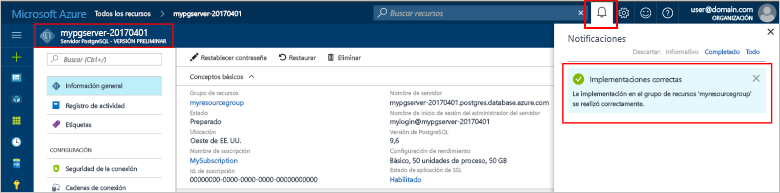

# <a name="create-an-azure-database-for-postgresql-in-hello-azure-portal"></a>Crear una base de datos de Azure para PostgreSQL Hola portal de Azure

Base de datos de Azure para PostgreSQL es un servicio administrado que le permite toorun, administrar y escalar las bases de datos de PostgreSQL altamente disponibles en la nube de Hola. Este tutorial rápido muestra cómo toocreate una Azure base de datos para el servidor de PostgreSQL usando Hola portal de Azure en aproximadamente cinco minutos.

Si no tiene una suscripción a Azure, cree una cuenta [gratuita](https://azure.microsoft.com/free/) antes de empezar.

## <a name="log-in-toohello-azure-portal"></a>Inicie sesión en toohello portal de Azure
Abra el explorador web y navegue toohello [portal de Microsoft Azure](https://portal.azure.com/). Escriba su credenciales toosign en toohello portal. vista predeterminada de Hello es el panel de servicio.

## <a name="create-an-azure-database-for-postgresql"></a>Creación de una instancia de Azure Database for PostgreSQL

Un servidor de Azure Database for PostgreSQL se crea con un conjunto definido de [recursos de proceso y almacenamiento](./concepts-compute-unit-and-storage.md). servidor de Hola se crea dentro de un [grupo de recursos de Azure](../azure-resource-manager/resource-group-overview.md).

Siga estos toocreate pasos una base de datos de Azure para PostgreSQL servidor:
1.  Haga clic en hello **New** botón (+) que se encuentra en la esquina izquierda superior de Hola de hello portal de Azure.
2.  Seleccione **bases de datos** de hello **New** página y seleccione **base de datos de Azure para PostgreSQL** de hello **bases de datos** página.
 

3.  Rellene Hola nuevo servidor detalles formulario con hello después de obtener información, como se muestra en hello anterior imagen:

    Configuración|Valor sugerido|Descripción
    ---|---|---
    Nombre de servidor |*mypgserver-20170401*|Elija un nombre único que identifique al servidor de Azure Database for PostgreSQL. nombre de dominio de Hello *postgres.database.azure.com* es toohello anexado nombre del servidor proporciona para las aplicaciones tooconnect a. nombre del servidor Hello puede contener solo letras minúsculas, números y caracteres de guión (-) de Hola y debe contener entre 3 y 63 caracteres.
    La suscripción|*Su suscripción*|Hola suscripción de Azure que quiere toouse de su servidor. Si tiene varias suscripciones, elija suscripción adecuado de hello en la que se facturan recursos Hola para.
    Grupo de recursos|*myresourcegroup*| Puede crear un nuevo nombre de grupo de recursos o usar uno existente de la suscripción.
    Inicio de sesión de administrador de servidor |*mylogin*| Realizar su propia toouse de cuenta de inicio de sesión al conectar el servidor de toohello. nombre de inicio de sesión de administrador de Hello no puede ser 'azure_superuser', 'azure_pg_admin', 'admin', 'administrator', 'raíz', 'guest' o 'public' y no puede comenzar con 'pg_'.
    Password |*Su elección* | Crear una nueva contraseña para la cuenta de administrador del servidor de Hola. Debe contener entre 8 caracteres too128. La contraseña debe contener caracteres de tres de hello siguientes categorías – letras en mayúsculas letras, letras minúsculas, números (0-9) y caracteres no alfanuméricos (!, $, #, %, etcetera.).
    Ubicación|*usuarios de Hello región más cercanos tooyour*| Elegir ubicación de Hola que sea más cercano tooyour los usuarios.
    Versión de PostgreSQL|*Elija la versión más reciente de Hola*| Elija la versión más reciente de Hola a menos que tenga requisitos específicos.
    Nivel de precios | **Básico**, **50 unidades de proceso****50 GB** | Haga clic en **tarifa** toospecify Hola nivel y rendimiento de nivel de servicio para la nueva base de datos. Elija el nivel básico en la pestaña de hello en la parte superior de Hola. Haga clic en el extremo izquierdo de Hola de hello unidades de proceso control deslizante tooadjust Hola valor toohello menor cantidad disponible para este tutorial rápido. Haga clic en **Aceptar** hello toosave selección de nivel de precios. Vea Hola siguiente captura de pantalla.
    | Toodashboard de PIN | Comprobar | Comprobar hello **toodashboard Pin** opción tooallow fácil seguimiento del servidor en la página de panel frontal de Hola de su portal de Azure.

  > [!IMPORTANT]
  > inicio de sesión de administrador de servidor de Hola y la contraseña que especifique aquí son necesario toolog en toohello server y sus bases de datos más adelante en esta guía de inicio rápido. Recuerde o grabe esta información para su uso posterior.

    

4.  Haga clic en **crear** servidor de hello tooprovision. Aprovisionamiento tarda unos minutos, los minutos de too20 máximo.

5.  En la barra de herramientas de hello, haga clic en **notificaciones** toomonitor proceso de implementación de Hola.
 
   
  De forma predeterminada, la base de datos de **postgres** se crea en el servidor. Hola [postgres](https://www.postgresql.org/docs/9.6/static/app-initdb.html) base de datos es una base de datos predeterminada destinado a los usuarios, utilidades y aplicaciones de otros fabricantes. 

## <a name="configure-a-server-level-firewall-rule"></a>Configuración de una regla de firewall de nivel de servidor

Hola base de datos de Azure para servicio PostgreSQL crea un servidor de seguridad en el nivel de servidor hello. Este firewall impide que las aplicaciones externas y las herramientas conexión toohello server y las bases de datos en el servidor de hello, a menos que se crea una regla de firewall tooopen firewall de Hola para direcciones IP concretas. 

1.  Busque el servidor al finalizar la implementación de Hola. Si es necesario, puede buscarlo. Por ejemplo, haga clic en **todos los recursos** del menú izquierdo de Hola y el tipo en el nombre del servidor de hello (como ejemplo de Hola *mypgserver 20170401*) toosearch para el servidor recién creado. Haga clic en el nombre del servidor aparece en el resultado de la búsqueda de Hola. Hola **Introducción** página para el servidor se abre y proporciona opciones para otra configuración.
 
    

2.  En la página del servidor hello, seleccione **seguridad de conexión**. 
    

3.  En hello **las reglas de Firewall** encabezado, haga clic en cuadro de texto en blanco de Hola Hola **nombre de la regla** toobegin columna Crear regla de firewall de Hola. 

    Para este tutorial, vamos a permitir todas las direcciones IP en servidor hello rellenando en el cuadro de texto hello en cada columna con hello siguientes valores:

    Nombre de la regla | Dirección IP inicial | Dirección IP final 
    ---|---|---
    AllowAllIps (permitir todas las direcciones IP) |  0.0.0.0 | 255.255.255.255

4. Hola superior barra de herramientas de la página de seguridad de conexión de hello, haga clic en **guardar**. Espere unos instantes y Hola de notificación que muestra que la actualización de seguridad de la conexión ha finalizado correctamente antes de continuar.

    > [!NOTE]
    > Las conexiones tooyour base de datos de Azure para PostgreSQL servidor se comunican a través de puerto 5432. Si está tratando de tooconnect desde dentro de una red corporativa, es posible que firewall de su red no permite el tráfico saliente en el puerto 5432. Si es así, no será capaz de tooconnect tooyour servidor a menos que el departamento de TI abre el puerto 5432.
    >

## <a name="get-hello-connection-information"></a>Obtener información de conexión de Hola

Al crear el servidor de Azure Database for PostgreSQL, también se crea la base de datos predeterminada denominada **postgres**. servidor de base de datos de tooconnect tooyour, necesita tooremember Hola credenciales de servidor completo administrador y el nombre de inicio de sesión. Puede haber tomado nota de esos valores anteriormente en el artículo de inicio rápido de Hola. En caso de que no lo hizo, puede encontrar fácilmente información de nombre y el inicio de sesión del servidor de Hola desde la página de información general del servidor de Hola Hola portal de Azure.

1. Abra la página **Información general** del servidor. Tome nota de hello **nombre del servidor** y **nombre de inicio de sesión del Administrador de servidor**.
    Situar el cursor sobre cada campo e icono de copiar Hola aparece toohello derecha texto hello. Haga clic en icono de copiar hello como valores de hello toocopy necesarios.

 

## <a name="connect-toopostgresql-database-using-psql-in-cloud-shell"></a>Conectar la base de datos de tooPostgreSQL con psql en el Shell de nube

Hay una serie de aplicaciones puede usar tooconnect tooyour base de datos de Azure para servidor de PostgreSQL. Vamos a usar hello psql utilidad de línea de comandos tooillustrate cómo tooconnect toohello server.  Puede usar un explorador web y Shell de nube de Azure como se describe aquí sin Hola Hola necesita tooinstall ningún software adicional. Si dispone de utilidad de psql Hola instalado localmente en su propio equipo, puede conectarse desde allí también.

1. Inicie Hola Shell en la nube de Azure a través del icono de terminal de hello en el panel de navegación superior de Hola.

   

2. Hola Shell en la nube de Azure se abre en el explorador, lo que los comandos de shell de bash tootype.

   

3. En el símbolo del sistema de hello Shell en la nube, conectar la base de datos de tooa en la base de datos de Azure para PostgreSQL servidor escribiendo línea de comandos de hello psql en el símbolo del sistema de hello verde.

    Hola siguiente formato es tooconnect usado tooan base de datos de Azure para servidor de PostgreSQL con hello [psql](https://www.postgresql.org/docs/9.6/static/app-psql.html) utilidad:
    ```bash
    psql --host=<yourserver> --port=<port> --username=<server admin login> --dbname=<database name>
    ```

    Por ejemplo, hello siguiente comando conecta tooan servidor de ejemplo:

    ```bash
    psql --host=mypgserver-20170401.postgres.database.azure.com --port=5432 --username=mylogin@mypgserver-20170401 --dbname=postgres
    ```

    Parámetro de psql |Valor sugerido|Descripción
    ---|---|---
    --host | *nombre del servidor* | Especifique el valor de nombre de servidor de Hola que se usó cuando creó Hola base de datos de Azure para PostgreSQL anteriormente. El servidor de ejemplo que se muestra es mypgserver-20170401.postgres.database.azure.com. Usar el nombre de dominio completo de hello (\*. postgres.database.azure.com) tal y como se muestra en el ejemplo de Hola. Siga los pasos Hola Hola anterior sección tooget Hola información de la conexión si no recuerda el nombre del servidor. 
    --port | **5432** | Utilice siempre el puerto 5432 al conectarse tooAzure base de datos de PostgreSQL. 
    --username | *nombre de inicio de sesión del administrador del servidor* |Escriba Hola server inicio de sesión nombre de usuario administrador especificó al crear Hola base de datos de Azure para PostgreSQL anteriormente. Siga los pasos Hola Hola anterior sección tooget Hola información de la conexión si no recuerda el nombre de usuario de Hola.  formato de Hello es  *username@servername* .
    --dbname | **postgres** | Nombre de base de datos de uso Hola predeterminada generada por el sistema *postgres* para la primera conexión de Hola. Posteriormente, puede crear su propia base de datos.

    Después de ejecutar el comando de psql hello, con sus propios valores de parámetro, son la contraseña de administrador en server tootype solicitadas Hola. Esta contraseña se Hola mismo que proporcionó cuando creó el servidor de Hola. 

    Parámetro de psql |Valor sugerido|Descripción
    ---|---|---
    Contraseña | *contraseña del administrador* | Tenga en cuenta, Hola contraseña escrita caracteres no se muestran en bash Hola símbolo del sistema. Presione ENTRAR después de haber escrito todos los tooauthenticate de caracteres de Hola y conectarse.

    Una vez conectado, utilidad de hello psql muestra una solicitud de postgres donde escribir comandos sql. En la salida de la conexión inicial de hello, puede mostrarse una advertencia ya psql Hola Hola Shell en la nube de Azure puede ser una versión diferente a Hola base de datos de Azure para la versión de servidor de PostgreSQL. 
    
    Ejemplo de salida de psql:
    ```bash
    psql (9.5.7, server 9.6.2)
    WARNING: psql major version 9.5, server major version 9.6.
        Some psql features might not work.
    SSL connection (protocol: TLSv1.2, cipher: ECDHE-RSA-AES256-SHA384, bits: 256, compression: off)
    Type "help" for help.
   
    postgres=> 
    ```

    > [!TIP]
    > Si firewall de hello no está configurado tooallow dirección IP de Hola de hello Shell en la nube de Azure, hello ocurre lo siguiente:
    > 
    > "psql: FATAL:  no pg_hba.conf entry for host "138.91.195.82", user "mylogin", database "postgres", SSL on FATAL:  SSL connection is required. Please specify SSL options and retry.
    > 
    > error de hello tooresolve, asegúrese de seguro Hola server configuration coincidencias Hola los pasos de hello *configurar una regla de firewall de nivel de servidor* sección del artículo Hola.

4.  Crear una base de datos en blanco en hello símbolo del sistema, escriba Hola siguiente comando:
    ```bash
    CREATE DATABASE mypgsqldb;
    ```
    comando Hello puede tardar unos toocomplete momentos. 

5.  En el símbolo del sistema de hello, ejecute hello después de la base de datos de comando tooswitch conexión toohello recién creado **mypgsqldb**.
    ```bash
    \c mypgsqldb
    ```

6.  Escriba \q y, a continuación, presione ENTRAR tooquit psql. Puede cerrar Hola Shell en la nube de Azure cuando haya terminado.

Ahora está conectado toohello base de datos de PostgreSQL y crea una base de datos de usuario en blanco. Continuar toohello siguiente sección tooconnect usar otra herramienta común, pgAdmin.

## <a name="connect-toopostgresql-database-using-pgadmin"></a>Conectar la base de datos de tooPostgreSQL mediante pgAdmin

tooconnect tooAzure PostgreSQL server mediante la herramienta de interfaz gráfica de usuario de hello _pgAdmin_
1.  Iniciar hello _pgAdmin_ aplicación en el equipo cliente. Puede instalar _pgAdmin_ desde http://www.pgadmin.org/.
2.  Haga clic en hello **Agregar nuevo servidor** icono de hello **vínculos rápidos** sección en el centro de Hola Hola de página de panel.
3.  Hola **crear - Server** cuadro de diálogo **General** ficha, escriba un nombre descriptivo único para el servidor de hello, como **Azure PostgreSQL Server**.

4.  Hola **crear - Server** cuadro de diálogo, **conexión** , usar la configuración de hello tal como se especifica y haga clic en **guardar**.
   

    parámetro pgAdmin |Valor sugerido|Descripción
    ---|---|---
    Host Name/Address | *nombre del servidor* | Especifique el valor de nombre de servidor de Hola que se usó cuando creó Hola base de datos de Azure para PostgreSQL anteriormente. El servidor de ejemplo que se muestra es mypgserver-20170401.postgres.database.azure.com. Usar el nombre de dominio completo de hello (\*. postgres.database.azure.com) tal y como se muestra en el ejemplo de Hola. Siga los pasos Hola Hola anterior sección tooget Hola información de la conexión si no recuerda el nombre del servidor. 
    Port | **5432** | Utilice siempre el puerto 5432 al conectarse tooAzure base de datos de PostgreSQL.  
    Maintenance Database | **postgres** | Nombre de base de datos de uso Hola predeterminada generada por el sistema *postgres*.
    User Name | *nombre de inicio de sesión del administrador del servidor* | Escriba Hola server inicio de sesión nombre de usuario administrador especificó al crear Hola base de datos de Azure para PostgreSQL anteriormente. Siga los pasos Hola Hola anterior sección tooget Hola información de la conexión si no recuerda el nombre de usuario de Hola. formato de Hello es  *username@servername* .
    Password | *contraseña del administrador* |  contraseña de Hola eligió al crear el servidor de hello anteriormente en este tutorial rápido.
    Rol | *déjelo en blanco* | Ya no necesita el nombre en este momento tooprovide un rol. Deje en blanco el campo de Hola.
    SSL Mode | Necesario | De forma predeterminada, todos los servidores de Azure PostgreSQL se crean para que se EXIJA SSL. tooturn desactivar exigir SSL, consulte los detalles en [exigir SSL](./concepts-ssl-connection-security.md).
    
5.  Haga clic en **Guardar**.
6.  En el panel izquierdo del explorador de hello, expanda hello **servidores** nodo. Elija el servidor, por ejemplo **Azure PostgreSQL Server** y haga clic en tooconnect tooit.
7. Expanda el nodo del servidor de hello y, a continuación, expanda **bases de datos** en él. Hello lista debe incluir sus *postgres* base de datos y cualquier usuario que acaba de crear la base de datos, como *mypgsqldb*, que hemos creado en la sección anterior de Hola. Tenga en cuenta que con Azure Database for PostgreSQL puede crear varias bases de datos por servidor.
8. Haga doble clic en **bases de datos**, elija hello **crear** menú y haga clic en **base de datos**.
9.  Escriba un nombre de base de datos de su elección en hello **base de datos** campo, como *mypgsqldb* se muestra en el ejemplo de Hola. 
10. Seleccione hello **propietario** de base de datos de Hola de cuadro de lista desplegable de Hola. Elija el nombre de inicio de sesión de administrador del servidor, como *mylogin* en nuestro ejemplo.
10. Haga clic en **guardar** toocreate una nueva base de datos en blanco.
11. Hola **explorador** panel, vea Hola base de datos que ha creado en la lista de Hola de bases de datos en el nombre del servidor.
 


## <a name="clean-up-resources"></a>Limpieza de recursos
Limpiar los recursos de Hola que creó en el tutorial rápido de hello ya sea eliminando Hola [grupo de recursos de Azure](../azure-resource-manager/resource-group-overview.md), que incluye todos los recursos de hello en el grupo de recursos de hello, o mediante la eliminación de recursos de un servidor hello si quiere tookeep Hola otros recursos intactos.

> [!TIP]
> Otras guías de inicio rápido de esta colección se basan en los valores de esta. Si tiene previsto toocontinue toowork con los siguientes tutoriales rápidos, realice la limpieza no Hola recursos creados en este tutorial rápido. Si no tiene previsto toocontinue, use Hola pasos toodelete recursos creados por este inicio rápido en hello portal de Azure siguientes.

toodelete Hola todo grupo de recursos incluidos servidor hello recién creado:
1.  Busque el grupo de recursos en hello portal de Azure. En el menú de la izquierda de Hola Hola portal de Azure, haga clic en **grupos de recursos** y, a continuación, haga clic en nombre de Hola de su grupo de recursos, como en nuestro ejemplo **myresourcegroup**.
2.  En la página del grupo de recursos, haga clic en **Eliminar**. A continuación, Hola nombre del tipo de su grupo de recursos, como en nuestro ejemplo **myresourcegroup**en Hola eliminación de tooconfirm del cuadro de texto y, a continuación, haga clic en **eliminar**.

O bien, en su lugar, toodelete Hola recién creado servidor:
1.  Busque el servidor en hello portal de Azure, si no tiene abrir. En el menú de la izquierda de hello en el portal de Azure, haga clic en **todos los recursos**y, a continuación, busque servidor hello que ha creado.
2.  En hello **Introducción** página, haga clic en hello **eliminar** botón en el panel superior de Hola.

3.  Confirme el nombre del servidor hello desee toodelete y mostrar hello las bases de datos en lo que se ven afectados. Escriba el nombre del servidor en el cuadro de texto hello, como en nuestro ejemplo **mypgserver 20170401**y, a continuación, haga clic en **eliminar**.

## <a name="next-steps"></a>Pasos siguientes
> [!div class="nextstepaction"]
> [Migración de una base de datos mediante exportación e importación](./howto-migrate-using-export-and-import.md)
