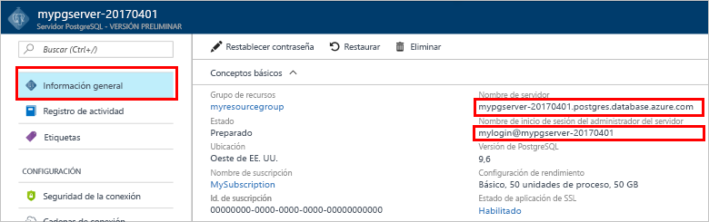

# <a name="create-an-azure-database-for-postgresql-in-hello-azure-portal"></a><span data-ttu-id="6bc4e-103">Crear una base de datos de Azure para PostgreSQL Hola portal de Azure</span><span class="sxs-lookup"><span data-stu-id="6bc4e-103">Create an Azure Database for PostgreSQL in hello Azure portal</span></span>

<span data-ttu-id="6bc4e-104">Base de datos de Azure para PostgreSQL es un servicio administrado que le permite toorun, administrar y escalar las bases de datos de PostgreSQL altamente disponibles en la nube de Hola.</span><span class="sxs-lookup"><span data-stu-id="6bc4e-104">Azure Database for PostgreSQL is a managed service that enables you toorun, manage, and scale highly available PostgreSQL databases in hello cloud.</span></span> <span data-ttu-id="6bc4e-105">Este tutorial rápido muestra cómo toocreate una Azure base de datos para el servidor de PostgreSQL usando Hola portal de Azure en aproximadamente cinco minutos.</span><span class="sxs-lookup"><span data-stu-id="6bc4e-105">This quickstart shows you how toocreate an Azure Database for PostgreSQL server using hello Azure portal in about five minutes.</span></span>

<span data-ttu-id="6bc4e-106">Si no tiene una suscripción a Azure, cree una cuenta [gratuita](https://azure.microsoft.com/free/) antes de empezar.</span><span class="sxs-lookup"><span data-stu-id="6bc4e-106">If you don't have an Azure subscription, create a [free](https://azure.microsoft.com/free/) account before you begin.</span></span>

## <a name="log-in-toohello-azure-portal"></a><span data-ttu-id="6bc4e-107">Inicie sesión en toohello portal de Azure</span><span class="sxs-lookup"><span data-stu-id="6bc4e-107">Log in toohello Azure portal</span></span>
<span data-ttu-id="6bc4e-108">Abra el explorador web y navegue toohello [portal de Microsoft Azure](https://portal.azure.com/).</span><span class="sxs-lookup"><span data-stu-id="6bc4e-108">Open your web browser, and navigate toohello [Microsoft Azure portal](https://portal.azure.com/).</span></span> <span data-ttu-id="6bc4e-109">Escriba su credenciales toosign en toohello portal.</span><span class="sxs-lookup"><span data-stu-id="6bc4e-109">Enter your credentials toosign in toohello portal.</span></span> <span data-ttu-id="6bc4e-110">vista predeterminada de Hello es el panel de servicio.</span><span class="sxs-lookup"><span data-stu-id="6bc4e-110">hello default view is your service dashboard.</span></span>

## <a name="create-an-azure-database-for-postgresql"></a><span data-ttu-id="6bc4e-111">Creación de una instancia de Azure Database for PostgreSQL</span><span class="sxs-lookup"><span data-stu-id="6bc4e-111">Create an Azure Database for PostgreSQL</span></span>

<span data-ttu-id="6bc4e-112">Un servidor de Azure Database for PostgreSQL se crea con un conjunto definido de [recursos de proceso y almacenamiento](./concepts-compute-unit-and-storage.md).</span><span class="sxs-lookup"><span data-stu-id="6bc4e-112">An Azure Database for PostgreSQL server is created with a defined set of [compute and storage resources](./concepts-compute-unit-and-storage.md).</span></span> <span data-ttu-id="6bc4e-113">servidor de Hola se crea dentro de un [grupo de recursos de Azure](../azure-resource-manager/resource-group-overview.md).</span><span class="sxs-lookup"><span data-stu-id="6bc4e-113">hello server is created within an [Azure resource group](../azure-resource-manager/resource-group-overview.md).</span></span>

<span data-ttu-id="6bc4e-114">Siga estos toocreate pasos una base de datos de Azure para PostgreSQL servidor:</span><span class="sxs-lookup"><span data-stu-id="6bc4e-114">Follow these steps toocreate an Azure Database for PostgreSQL server:</span></span>
1.  <span data-ttu-id="6bc4e-115">Haga clic en hello **New** botón (+) que se encuentra en la esquina izquierda superior de Hola de hello portal de Azure.</span><span class="sxs-lookup"><span data-stu-id="6bc4e-115">Click hello **New** button (+) found on hello upper left-hand corner of hello Azure portal.</span></span>
2.  <span data-ttu-id="6bc4e-116">Seleccione **bases de datos** de hello **New** página y seleccione **base de datos de Azure para PostgreSQL** de hello **bases de datos** página.</span><span class="sxs-lookup"><span data-stu-id="6bc4e-116">Select **Databases** from hello **New** page, and select **Azure Database for PostgreSQL** from hello **Databases** page.</span></span>
 <span data-ttu-id="6bc4e-117"></span><span class="sxs-lookup"><span data-stu-id="6bc4e-117"></span></span>

3.  <span data-ttu-id="6bc4e-118">Rellene Hola nuevo servidor detalles formulario con hello después de obtener información, como se muestra en hello anterior imagen:</span><span class="sxs-lookup"><span data-stu-id="6bc4e-118">Fill out hello new server details form with hello following information, as shown on hello preceding image:</span></span>

    <span data-ttu-id="6bc4e-119">Configuración</span><span class="sxs-lookup"><span data-stu-id="6bc4e-119">Setting</span></span>|<span data-ttu-id="6bc4e-120">Valor sugerido</span><span class="sxs-lookup"><span data-stu-id="6bc4e-120">Suggested value</span></span>|<span data-ttu-id="6bc4e-121">Descripción</span><span class="sxs-lookup"><span data-stu-id="6bc4e-121">Description</span></span>
    ---|---|---
    <span data-ttu-id="6bc4e-122">Nombre de servidor</span><span class="sxs-lookup"><span data-stu-id="6bc4e-122">Server name</span></span> |<span data-ttu-id="6bc4e-123">*mypgserver-20170401*</span><span class="sxs-lookup"><span data-stu-id="6bc4e-123">*mypgserver-20170401*</span></span>|<span data-ttu-id="6bc4e-124">Elija un nombre único que identifique al servidor de Azure Database for PostgreSQL.</span><span class="sxs-lookup"><span data-stu-id="6bc4e-124">Choose a unique name that identifies your Azure Database for PostgreSQL server.</span></span> <span data-ttu-id="6bc4e-125">nombre de dominio de Hello *postgres.database.azure.com* es toohello anexado nombre del servidor proporciona para las aplicaciones tooconnect a.</span><span class="sxs-lookup"><span data-stu-id="6bc4e-125">hello domain name *postgres.database.azure.com* is appended toohello server name you provide for applications tooconnect to.</span></span> <span data-ttu-id="6bc4e-126">nombre del servidor Hello puede contener solo letras minúsculas, números y caracteres de guión (-) de Hola y debe contener entre 3 y 63 caracteres.</span><span class="sxs-lookup"><span data-stu-id="6bc4e-126">hello server name can contain only lowercase letters, numbers, and hello hyphen (-) character, and it must contain from 3 through 63 characters.</span></span>
    <span data-ttu-id="6bc4e-127">La suscripción</span><span class="sxs-lookup"><span data-stu-id="6bc4e-127">Subscription</span></span>|<span data-ttu-id="6bc4e-128">*Su suscripción*</span><span class="sxs-lookup"><span data-stu-id="6bc4e-128">*Your subscription*</span></span>|<span data-ttu-id="6bc4e-129">Hola suscripción de Azure que quiere toouse de su servidor.</span><span class="sxs-lookup"><span data-stu-id="6bc4e-129">hello Azure subscription that you want toouse for your server.</span></span> <span data-ttu-id="6bc4e-130">Si tiene varias suscripciones, elija suscripción adecuado de hello en la que se facturan recursos Hola para.</span><span class="sxs-lookup"><span data-stu-id="6bc4e-130">If you have multiple subscriptions, choose hello appropriate subscription in which hello resource is billed for.</span></span>
    <span data-ttu-id="6bc4e-131">Grupo de recursos</span><span class="sxs-lookup"><span data-stu-id="6bc4e-131">Resource Group</span></span>|<span data-ttu-id="6bc4e-132">*myresourcegroup*</span><span class="sxs-lookup"><span data-stu-id="6bc4e-132">*myresourcegroup*</span></span>| <span data-ttu-id="6bc4e-133">Puede crear un nuevo nombre de grupo de recursos o usar uno existente de la suscripción.</span><span class="sxs-lookup"><span data-stu-id="6bc4e-133">You may make a new resource group name, or use an existing one from your subscription.</span></span>
    <span data-ttu-id="6bc4e-134">Inicio de sesión de administrador de servidor</span><span class="sxs-lookup"><span data-stu-id="6bc4e-134">Server admin login</span></span> |<span data-ttu-id="6bc4e-135">*mylogin*</span><span class="sxs-lookup"><span data-stu-id="6bc4e-135">*mylogin*</span></span>| <span data-ttu-id="6bc4e-136">Realizar su propia toouse de cuenta de inicio de sesión al conectar el servidor de toohello.</span><span class="sxs-lookup"><span data-stu-id="6bc4e-136">Make your own login account toouse when connecting toohello server.</span></span> <span data-ttu-id="6bc4e-137">nombre de inicio de sesión de administrador de Hello no puede ser 'azure_superuser', 'azure_pg_admin', 'admin', 'administrator', 'raíz', 'guest' o 'public' y no puede comenzar con 'pg_'.</span><span class="sxs-lookup"><span data-stu-id="6bc4e-137">hello admin login name cannot be 'azure_superuser', 'azure_pg_admin', 'admin', 'administrator', 'root', 'guest', or 'public', and cannot start with 'pg_'.</span></span>
    <span data-ttu-id="6bc4e-138">Password</span><span class="sxs-lookup"><span data-stu-id="6bc4e-138">Password</span></span> |<span data-ttu-id="6bc4e-139">*Su elección*</span><span class="sxs-lookup"><span data-stu-id="6bc4e-139">*Your choice*</span></span> | <span data-ttu-id="6bc4e-140">Crear una nueva contraseña para la cuenta de administrador del servidor de Hola.</span><span class="sxs-lookup"><span data-stu-id="6bc4e-140">Create a new password for hello server admin account.</span></span> <span data-ttu-id="6bc4e-141">Debe contener entre 8 caracteres too128.</span><span class="sxs-lookup"><span data-stu-id="6bc4e-141">Must contain from 8 too128 characters.</span></span> <span data-ttu-id="6bc4e-142">La contraseña debe contener caracteres de tres de hello siguientes categorías – letras en mayúsculas letras, letras minúsculas, números (0-9) y caracteres no alfanuméricos (!, $, #, %, etcetera.).</span><span class="sxs-lookup"><span data-stu-id="6bc4e-142">Your password must contain characters from three of hello following categories – English uppercase letters, English lowercase letters, numbers (0-9), and non-alphanumeric characters (!, $, #, %, etc.).</span></span>
    <span data-ttu-id="6bc4e-143">Ubicación</span><span class="sxs-lookup"><span data-stu-id="6bc4e-143">Location</span></span>|<span data-ttu-id="6bc4e-144">*usuarios de Hello región más cercanos tooyour*</span><span class="sxs-lookup"><span data-stu-id="6bc4e-144">*hello region closest tooyour users*</span></span>| <span data-ttu-id="6bc4e-145">Elegir ubicación de Hola que sea más cercano tooyour los usuarios.</span><span class="sxs-lookup"><span data-stu-id="6bc4e-145">Choose hello location that's closest tooyour users.</span></span>
    <span data-ttu-id="6bc4e-146">Versión de PostgreSQL</span><span class="sxs-lookup"><span data-stu-id="6bc4e-146">PostgreSQL Version</span></span>|<span data-ttu-id="6bc4e-147">*Elija la versión más reciente de Hola*</span><span class="sxs-lookup"><span data-stu-id="6bc4e-147">*Choose hello latest version*</span></span>| <span data-ttu-id="6bc4e-148">Elija la versión más reciente de Hola a menos que tenga requisitos específicos.</span><span class="sxs-lookup"><span data-stu-id="6bc4e-148">Choose hello latest version unless you have specific requirements.</span></span>
    <span data-ttu-id="6bc4e-149">Nivel de precios</span><span class="sxs-lookup"><span data-stu-id="6bc4e-149">Pricing Tier</span></span> | <span data-ttu-id="6bc4e-150">**Básico**, **50 unidades de proceso****50 GB**</span><span class="sxs-lookup"><span data-stu-id="6bc4e-150">**Basic**, **50 Compute Units** **50 GB**</span></span> | <span data-ttu-id="6bc4e-151">Haga clic en **tarifa** toospecify Hola nivel y rendimiento de nivel de servicio para la nueva base de datos.</span><span class="sxs-lookup"><span data-stu-id="6bc4e-151">Click **Pricing tier** toospecify hello service tier and performance level for your new database.</span></span> <span data-ttu-id="6bc4e-152">Elija el nivel básico en la pestaña de hello en la parte superior de Hola.</span><span class="sxs-lookup"><span data-stu-id="6bc4e-152">Choose Basic tier in hello tab at hello top.</span></span> <span data-ttu-id="6bc4e-153">Haga clic en el extremo izquierdo de Hola de hello unidades de proceso control deslizante tooadjust Hola valor toohello menor cantidad disponible para este tutorial rápido.</span><span class="sxs-lookup"><span data-stu-id="6bc4e-153">Click hello left end of hello Compute Units slider tooadjust hello value toohello least amount available for this quickstart.</span></span> <span data-ttu-id="6bc4e-154">Haga clic en **Aceptar** hello toosave selección de nivel de precios.</span><span class="sxs-lookup"><span data-stu-id="6bc4e-154">Click **Ok** toosave hello pricing tier selection.</span></span> <span data-ttu-id="6bc4e-155">Vea Hola siguiente captura de pantalla.</span><span class="sxs-lookup"><span data-stu-id="6bc4e-155">See hello following screenshot.</span></span>
    | <span data-ttu-id="6bc4e-156">Toodashboard de PIN</span><span class="sxs-lookup"><span data-stu-id="6bc4e-156">Pin toodashboard</span></span> | <span data-ttu-id="6bc4e-157">Comprobar</span><span class="sxs-lookup"><span data-stu-id="6bc4e-157">Check</span></span> | <span data-ttu-id="6bc4e-158">Comprobar hello **toodashboard Pin** opción tooallow fácil seguimiento del servidor en la página de panel frontal de Hola de su portal de Azure.</span><span class="sxs-lookup"><span data-stu-id="6bc4e-158">Check hello **Pin toodashboard** option tooallow easy tracking of your server on hello front dashboard page of your Azure portal.</span></span>

  > [!IMPORTANT]
  > <span data-ttu-id="6bc4e-159">inicio de sesión de administrador de servidor de Hola y la contraseña que especifique aquí son necesario toolog en toohello server y sus bases de datos más adelante en esta guía de inicio rápido.</span><span class="sxs-lookup"><span data-stu-id="6bc4e-159">hello server admin login and password that you specify here are required toolog in toohello server and its databases later in this quick start.</span></span> <span data-ttu-id="6bc4e-160">Recuerde o grabe esta información para su uso posterior.</span><span class="sxs-lookup"><span data-stu-id="6bc4e-160">Remember or record this information for later use.</span></span>

    

4.  <span data-ttu-id="6bc4e-162">Haga clic en **crear** servidor de hello tooprovision.</span><span class="sxs-lookup"><span data-stu-id="6bc4e-162">Click **Create** tooprovision hello server.</span></span> <span data-ttu-id="6bc4e-163">Aprovisionamiento tarda unos minutos, los minutos de too20 máximo.</span><span class="sxs-lookup"><span data-stu-id="6bc4e-163">Provisioning takes a few minutes, up too20 minutes maximum.</span></span>

5.  <span data-ttu-id="6bc4e-164">En la barra de herramientas de hello, haga clic en **notificaciones** toomonitor proceso de implementación de Hola.</span><span class="sxs-lookup"><span data-stu-id="6bc4e-164">On hello toolbar, click **Notifications** toomonitor hello deployment process.</span></span>
 <span data-ttu-id="6bc4e-165"></span><span class="sxs-lookup"><span data-stu-id="6bc4e-165"></span></span>
   
  <span data-ttu-id="6bc4e-166">De forma predeterminada, la base de datos de **postgres** se crea en el servidor.</span><span class="sxs-lookup"><span data-stu-id="6bc4e-166">By default, **postgres** database gets created under your server.</span></span> <span data-ttu-id="6bc4e-167">Hola [postgres](https://www.postgresql.org/docs/9.6/static/app-initdb.html) base de datos es una base de datos predeterminada destinado a los usuarios, utilidades y aplicaciones de otros fabricantes.</span><span class="sxs-lookup"><span data-stu-id="6bc4e-167">hello [postgres](https://www.postgresql.org/docs/9.6/static/app-initdb.html) database is a default database meant for use by users, utilities, and third-party applications.</span></span> 

## <a name="configure-a-server-level-firewall-rule"></a><span data-ttu-id="6bc4e-168">Configuración de una regla de firewall de nivel de servidor</span><span class="sxs-lookup"><span data-stu-id="6bc4e-168">Configure a server-level firewall rule</span></span>

<span data-ttu-id="6bc4e-169">Hola base de datos de Azure para servicio PostgreSQL crea un servidor de seguridad en el nivel de servidor hello.</span><span class="sxs-lookup"><span data-stu-id="6bc4e-169">hello Azure Database for PostgreSQL service creates a firewall at hello server-level.</span></span> <span data-ttu-id="6bc4e-170">Este firewall impide que las aplicaciones externas y las herramientas conexión toohello server y las bases de datos en el servidor de hello, a menos que se crea una regla de firewall tooopen firewall de Hola para direcciones IP concretas.</span><span class="sxs-lookup"><span data-stu-id="6bc4e-170">This firewall prevents external applications and tools from connecting toohello server and any databases on hello server, unless a firewall rule is created tooopen hello firewall for specific IP addresses.</span></span> 

1.  <span data-ttu-id="6bc4e-171">Busque el servidor al finalizar la implementación de Hola.</span><span class="sxs-lookup"><span data-stu-id="6bc4e-171">Locate your server after hello deployment completes.</span></span> <span data-ttu-id="6bc4e-172">Si es necesario, puede buscarlo.</span><span class="sxs-lookup"><span data-stu-id="6bc4e-172">If needed, you can search for it.</span></span> <span data-ttu-id="6bc4e-173">Por ejemplo, haga clic en **todos los recursos** del menú izquierdo de Hola y el tipo en el nombre del servidor de hello (como ejemplo de Hola *mypgserver 20170401*) toosearch para el servidor recién creado.</span><span class="sxs-lookup"><span data-stu-id="6bc4e-173">For example, click **All Resources** from hello left-hand menu and type in hello server name (such as hello example *mypgserver-20170401*) toosearch for your newly created server.</span></span> <span data-ttu-id="6bc4e-174">Haga clic en el nombre del servidor aparece en el resultado de la búsqueda de Hola.</span><span class="sxs-lookup"><span data-stu-id="6bc4e-174">Click on your server name listed in hello search result.</span></span> <span data-ttu-id="6bc4e-175">Hola **Introducción** página para el servidor se abre y proporciona opciones para otra configuración.</span><span class="sxs-lookup"><span data-stu-id="6bc4e-175">hello **Overview** page for your server opens and provides options for further configuration.</span></span>
 
    

2.  <span data-ttu-id="6bc4e-177">En la página del servidor hello, seleccione **seguridad de conexión**.</span><span class="sxs-lookup"><span data-stu-id="6bc4e-177">On hello server page, select **Connection security**.</span></span> 
    <span data-ttu-id="6bc4e-178"></span><span class="sxs-lookup"><span data-stu-id="6bc4e-178"></span></span>

3.  <span data-ttu-id="6bc4e-179">En hello **las reglas de Firewall** encabezado, haga clic en cuadro de texto en blanco de Hola Hola **nombre de la regla** toobegin columna Crear regla de firewall de Hola.</span><span class="sxs-lookup"><span data-stu-id="6bc4e-179">Under hello **Firewall rules** heading, click in hello blank text box in hello **Rule Name** column toobegin creating hello firewall rule.</span></span> 

    <span data-ttu-id="6bc4e-180">Para este tutorial, vamos a permitir todas las direcciones IP en servidor hello rellenando en el cuadro de texto hello en cada columna con hello siguientes valores:</span><span class="sxs-lookup"><span data-stu-id="6bc4e-180">For this quick start, let's allow all IP addresses into hello server by filling in hello text box in each column with hello following values:</span></span>

    <span data-ttu-id="6bc4e-181">Nombre de la regla</span><span class="sxs-lookup"><span data-stu-id="6bc4e-181">Rule Name</span></span> | <span data-ttu-id="6bc4e-182">Dirección IP inicial</span><span class="sxs-lookup"><span data-stu-id="6bc4e-182">Start IP</span></span> | <span data-ttu-id="6bc4e-183">Dirección IP final</span><span class="sxs-lookup"><span data-stu-id="6bc4e-183">End IP</span></span> 
    ---|---|---
    <span data-ttu-id="6bc4e-184">AllowAllIps (permitir todas las direcciones IP)</span><span class="sxs-lookup"><span data-stu-id="6bc4e-184">AllowAllIps</span></span> |  <span data-ttu-id="6bc4e-185">0.0.0.0</span><span class="sxs-lookup"><span data-stu-id="6bc4e-185">0.0.0.0</span></span> | <span data-ttu-id="6bc4e-186">255.255.255.255</span><span class="sxs-lookup"><span data-stu-id="6bc4e-186">255.255.255.255</span></span>

4. <span data-ttu-id="6bc4e-187">Hola superior barra de herramientas de la página de seguridad de conexión de hello, haga clic en **guardar**.</span><span class="sxs-lookup"><span data-stu-id="6bc4e-187">On hello upper toolbar of hello Connection security page, click **Save**.</span></span> <span data-ttu-id="6bc4e-188">Espere unos instantes y Hola de notificación que muestra que la actualización de seguridad de la conexión ha finalizado correctamente antes de continuar.</span><span class="sxs-lookup"><span data-stu-id="6bc4e-188">Wait for a few moments and notice hello notification showing that updating connection security has finished successfully before continuing.</span></span>

    > [!NOTE]
    > <span data-ttu-id="6bc4e-189">Las conexiones tooyour base de datos de Azure para PostgreSQL servidor se comunican a través de puerto 5432.</span><span class="sxs-lookup"><span data-stu-id="6bc4e-189">Connections tooyour Azure Database for PostgreSQL server communicate over port 5432.</span></span> <span data-ttu-id="6bc4e-190">Si está tratando de tooconnect desde dentro de una red corporativa, es posible que firewall de su red no permite el tráfico saliente en el puerto 5432.</span><span class="sxs-lookup"><span data-stu-id="6bc4e-190">If you are trying tooconnect from within a corporate network, outbound traffic over port 5432 may not be allowed by your network's firewall.</span></span> <span data-ttu-id="6bc4e-191">Si es así, no será capaz de tooconnect tooyour servidor a menos que el departamento de TI abre el puerto 5432.</span><span class="sxs-lookup"><span data-stu-id="6bc4e-191">If so, you will not be able tooconnect tooyour server unless your IT department opens port 5432.</span></span>
    >

## <a name="get-hello-connection-information"></a><span data-ttu-id="6bc4e-192">Obtener información de conexión de Hola</span><span class="sxs-lookup"><span data-stu-id="6bc4e-192">Get hello connection information</span></span>

<span data-ttu-id="6bc4e-193">Al crear el servidor de Azure Database for PostgreSQL, también se crea la base de datos predeterminada denominada **postgres**.</span><span class="sxs-lookup"><span data-stu-id="6bc4e-193">When we created our Azure Database for PostgreSQL server, a default database named **postgres** gets created.</span></span> <span data-ttu-id="6bc4e-194">servidor de base de datos de tooconnect tooyour, necesita tooremember Hola credenciales de servidor completo administrador y el nombre de inicio de sesión.</span><span class="sxs-lookup"><span data-stu-id="6bc4e-194">tooconnect tooyour database server, you need tooremember hello full server name and admin login credentials.</span></span> <span data-ttu-id="6bc4e-195">Puede haber tomado nota de esos valores anteriormente en el artículo de inicio rápido de Hola.</span><span class="sxs-lookup"><span data-stu-id="6bc4e-195">You may have noted those values earlier in hello quick start article.</span></span> <span data-ttu-id="6bc4e-196">En caso de que no lo hizo, puede encontrar fácilmente información de nombre y el inicio de sesión del servidor de Hola desde la página de información general del servidor de Hola Hola portal de Azure.</span><span class="sxs-lookup"><span data-stu-id="6bc4e-196">In case you did not, you can easily find hello server name and login information from hello server Overview page in hello Azure portal.</span></span>

1. <span data-ttu-id="6bc4e-197">Abra la página **Información general** del servidor.</span><span class="sxs-lookup"><span data-stu-id="6bc4e-197">Open your server's **Overview** page.</span></span> <span data-ttu-id="6bc4e-198">Tome nota de hello **nombre del servidor** y **nombre de inicio de sesión del Administrador de servidor**.</span><span class="sxs-lookup"><span data-stu-id="6bc4e-198">Make a note of hello **Server name** and **Server admin login name**.</span></span>
    <span data-ttu-id="6bc4e-199">Situar el cursor sobre cada campo e icono de copiar Hola aparece toohello derecha texto hello.</span><span class="sxs-lookup"><span data-stu-id="6bc4e-199">Hover your cursor over each field, and hello copy icon appears toohello right of hello text.</span></span> <span data-ttu-id="6bc4e-200">Haga clic en icono de copiar hello como valores de hello toocopy necesarios.</span><span class="sxs-lookup"><span data-stu-id="6bc4e-200">Click hello copy icon as needed toocopy hello values.</span></span>

 

## <a name="connect-toopostgresql-database-using-psql-in-cloud-shell"></a><span data-ttu-id="6bc4e-202">Conectar la base de datos de tooPostgreSQL con psql en el Shell de nube</span><span class="sxs-lookup"><span data-stu-id="6bc4e-202">Connect tooPostgreSQL database using psql in Cloud Shell</span></span>

<span data-ttu-id="6bc4e-203">Hay una serie de aplicaciones puede usar tooconnect tooyour base de datos de Azure para servidor de PostgreSQL.</span><span class="sxs-lookup"><span data-stu-id="6bc4e-203">There are a number of applications you can use tooconnect tooyour Azure Database for PostgreSQL server.</span></span> <span data-ttu-id="6bc4e-204">Vamos a usar hello psql utilidad de línea de comandos tooillustrate cómo tooconnect toohello server.</span><span class="sxs-lookup"><span data-stu-id="6bc4e-204">Let's first use hello psql command-line utility tooillustrate how tooconnect toohello server.</span></span>  <span data-ttu-id="6bc4e-205">Puede usar un explorador web y Shell de nube de Azure como se describe aquí sin Hola Hola necesita tooinstall ningún software adicional.</span><span class="sxs-lookup"><span data-stu-id="6bc4e-205">You can use a web browser and hello Azure Cloud Shell as described here without hello need tooinstall any additional software.</span></span> <span data-ttu-id="6bc4e-206">Si dispone de utilidad de psql Hola instalado localmente en su propio equipo, puede conectarse desde allí también.</span><span class="sxs-lookup"><span data-stu-id="6bc4e-206">If you have hello psql utility installed locally on your own machine, you can connect from there as well.</span></span>

1. <span data-ttu-id="6bc4e-207">Inicie Hola Shell en la nube de Azure a través del icono de terminal de hello en el panel de navegación superior de Hola.</span><span class="sxs-lookup"><span data-stu-id="6bc4e-207">Launch hello Azure Cloud Shell via hello terminal icon on hello top navigation pane.</span></span>

   

2. <span data-ttu-id="6bc4e-209">Hola Shell en la nube de Azure se abre en el explorador, lo que los comandos de shell de bash tootype.</span><span class="sxs-lookup"><span data-stu-id="6bc4e-209">hello Azure Cloud Shell opens in your browser, enabling you tootype bash shell commands.</span></span>

   

3. <span data-ttu-id="6bc4e-211">En el símbolo del sistema de hello Shell en la nube, conectar la base de datos de tooa en la base de datos de Azure para PostgreSQL servidor escribiendo línea de comandos de hello psql en el símbolo del sistema de hello verde.</span><span class="sxs-lookup"><span data-stu-id="6bc4e-211">At hello Cloud Shell prompt, connect tooa database in your Azure Database for PostgreSQL server by typing hello psql command line at hello green prompt.</span></span>

    <span data-ttu-id="6bc4e-212">Hola siguiente formato es tooconnect usado tooan base de datos de Azure para servidor de PostgreSQL con hello [psql](https://www.postgresql.org/docs/9.6/static/app-psql.html) utilidad:</span><span class="sxs-lookup"><span data-stu-id="6bc4e-212">hello following format is used tooconnect tooan Azure Database for PostgreSQL server with hello [psql](https://www.postgresql.org/docs/9.6/static/app-psql.html) utility:</span></span>
    ```bash
    psql --host=<yourserver> --port=<port> --username=<server admin login> --dbname=<database name>
    ```

    <span data-ttu-id="6bc4e-213">Por ejemplo, hello siguiente comando conecta tooan servidor de ejemplo:</span><span class="sxs-lookup"><span data-stu-id="6bc4e-213">For example, hello following command connects tooan example server:</span></span>

    ```bash
    psql --host=mypgserver-20170401.postgres.database.azure.com --port=5432 --username=mylogin@mypgserver-20170401 --dbname=postgres
    ```

    <span data-ttu-id="6bc4e-214">Parámetro de psql</span><span class="sxs-lookup"><span data-stu-id="6bc4e-214">psql parameter</span></span> |<span data-ttu-id="6bc4e-215">Valor sugerido</span><span class="sxs-lookup"><span data-stu-id="6bc4e-215">Suggested value</span></span>|<span data-ttu-id="6bc4e-216">Descripción</span><span class="sxs-lookup"><span data-stu-id="6bc4e-216">Description</span></span>
    ---|---|---
    <span data-ttu-id="6bc4e-217">--host</span><span class="sxs-lookup"><span data-stu-id="6bc4e-217">--host</span></span> | <span data-ttu-id="6bc4e-218">*nombre del servidor*</span><span class="sxs-lookup"><span data-stu-id="6bc4e-218">*server name*</span></span> | <span data-ttu-id="6bc4e-219">Especifique el valor de nombre de servidor de Hola que se usó cuando creó Hola base de datos de Azure para PostgreSQL anteriormente.</span><span class="sxs-lookup"><span data-stu-id="6bc4e-219">Specify hello server name value that was used when you created hello Azure Database for PostgreSQL earlier.</span></span> <span data-ttu-id="6bc4e-220">El servidor de ejemplo que se muestra es mypgserver-20170401.postgres.database.azure.com. Usar el nombre de dominio completo de hello (\*. postgres.database.azure.com) tal y como se muestra en el ejemplo de Hola.</span><span class="sxs-lookup"><span data-stu-id="6bc4e-220">Our example server shown is mypgserver-20170401.postgres.database.azure.com. Use hello fully qualified domain name (\*.postgres.database.azure.com) as shown in hello example.</span></span> <span data-ttu-id="6bc4e-221">Siga los pasos Hola Hola anterior sección tooget Hola información de la conexión si no recuerda el nombre del servidor.</span><span class="sxs-lookup"><span data-stu-id="6bc4e-221">Follow hello steps in hello previous section tooget hello connection information if you do not remember your server name.</span></span> 
    <span data-ttu-id="6bc4e-222">--port</span><span class="sxs-lookup"><span data-stu-id="6bc4e-222">--port</span></span> | <span data-ttu-id="6bc4e-223">**5432**</span><span class="sxs-lookup"><span data-stu-id="6bc4e-223">**5432**</span></span> | <span data-ttu-id="6bc4e-224">Utilice siempre el puerto 5432 al conectarse tooAzure base de datos de PostgreSQL.</span><span class="sxs-lookup"><span data-stu-id="6bc4e-224">Always use port 5432 when connecting tooAzure Database for PostgreSQL.</span></span> 
    <span data-ttu-id="6bc4e-225">--username</span><span class="sxs-lookup"><span data-stu-id="6bc4e-225">--username</span></span> | <span data-ttu-id="6bc4e-226">*nombre de inicio de sesión del administrador del servidor*</span><span class="sxs-lookup"><span data-stu-id="6bc4e-226">*server admin login name*</span></span> |<span data-ttu-id="6bc4e-227">Escriba Hola server inicio de sesión nombre de usuario administrador especificó al crear Hola base de datos de Azure para PostgreSQL anteriormente.</span><span class="sxs-lookup"><span data-stu-id="6bc4e-227">Type in hello  server admin login username supplied when you created hello Azure Database for PostgreSQL earlier.</span></span> <span data-ttu-id="6bc4e-228">Siga los pasos Hola Hola anterior sección tooget Hola información de la conexión si no recuerda el nombre de usuario de Hola.</span><span class="sxs-lookup"><span data-stu-id="6bc4e-228">Follow hello steps in hello previous section tooget hello connection information if you do not remember hello username.</span></span>  <span data-ttu-id="6bc4e-229">formato de Hello es  *username@servername* .</span><span class="sxs-lookup"><span data-stu-id="6bc4e-229">hello format is *username@servername*.</span></span>
    <span data-ttu-id="6bc4e-230">--dbname</span><span class="sxs-lookup"><span data-stu-id="6bc4e-230">--dbname</span></span> | <span data-ttu-id="6bc4e-231">**postgres**</span><span class="sxs-lookup"><span data-stu-id="6bc4e-231">**postgres**</span></span> | <span data-ttu-id="6bc4e-232">Nombre de base de datos de uso Hola predeterminada generada por el sistema *postgres* para la primera conexión de Hola.</span><span class="sxs-lookup"><span data-stu-id="6bc4e-232">Use hello default system generated database name *postgres* for hello first connection.</span></span> <span data-ttu-id="6bc4e-233">Posteriormente, puede crear su propia base de datos.</span><span class="sxs-lookup"><span data-stu-id="6bc4e-233">Later you create your own database.</span></span>

    <span data-ttu-id="6bc4e-234">Después de ejecutar el comando de psql hello, con sus propios valores de parámetro, son la contraseña de administrador en server tootype solicitadas Hola.</span><span class="sxs-lookup"><span data-stu-id="6bc4e-234">After running hello psql command, with your own parameter values, you are prompted tootype hello server admin password.</span></span> <span data-ttu-id="6bc4e-235">Esta contraseña se Hola mismo que proporcionó cuando creó el servidor de Hola.</span><span class="sxs-lookup"><span data-stu-id="6bc4e-235">This password is hello same that you provided when you created hello server.</span></span> 

    <span data-ttu-id="6bc4e-236">Parámetro de psql</span><span class="sxs-lookup"><span data-stu-id="6bc4e-236">psql parameter</span></span> |<span data-ttu-id="6bc4e-237">Valor sugerido</span><span class="sxs-lookup"><span data-stu-id="6bc4e-237">Suggested value</span></span>|<span data-ttu-id="6bc4e-238">Descripción</span><span class="sxs-lookup"><span data-stu-id="6bc4e-238">Description</span></span>
    ---|---|---
    <span data-ttu-id="6bc4e-239">Contraseña</span><span class="sxs-lookup"><span data-stu-id="6bc4e-239">password</span></span> | <span data-ttu-id="6bc4e-240">*contraseña del administrador*</span><span class="sxs-lookup"><span data-stu-id="6bc4e-240">*your admin password*</span></span> | <span data-ttu-id="6bc4e-241">Tenga en cuenta, Hola contraseña escrita caracteres no se muestran en bash Hola símbolo del sistema.</span><span class="sxs-lookup"><span data-stu-id="6bc4e-241">Note, hello typed password characters are not shown on hello bash prompt.</span></span> <span data-ttu-id="6bc4e-242">Presione ENTRAR después de haber escrito todos los tooauthenticate de caracteres de Hola y conectarse.</span><span class="sxs-lookup"><span data-stu-id="6bc4e-242">Press enter after you have typed all hello characters tooauthenticate and connect.</span></span>

    <span data-ttu-id="6bc4e-243">Una vez conectado, utilidad de hello psql muestra una solicitud de postgres donde escribir comandos sql.</span><span class="sxs-lookup"><span data-stu-id="6bc4e-243">Once connected, hello psql utility displays a postgres prompt where you type sql commands.</span></span> <span data-ttu-id="6bc4e-244">En la salida de la conexión inicial de hello, puede mostrarse una advertencia ya psql Hola Hola Shell en la nube de Azure puede ser una versión diferente a Hola base de datos de Azure para la versión de servidor de PostgreSQL.</span><span class="sxs-lookup"><span data-stu-id="6bc4e-244">In hello initial connection output, a warning may be displayed since hello psql in hello Azure Cloud Shell may be a different  version than hello Azure Database for PostgreSQL server version.</span></span> 
    
    <span data-ttu-id="6bc4e-245">Ejemplo de salida de psql:</span><span class="sxs-lookup"><span data-stu-id="6bc4e-245">Example psql output:</span></span>
    ```bash
    psql (9.5.7, server 9.6.2)
    WARNING: psql major version 9.5, server major version 9.6.
        Some psql features might not work.
    SSL connection (protocol: TLSv1.2, cipher: ECDHE-RSA-AES256-SHA384, bits: 256, compression: off)
    Type "help" for help.
   
    postgres=> 
    ```

    > [!TIP]
    > <span data-ttu-id="6bc4e-246">Si firewall de hello no está configurado tooallow dirección IP de Hola de hello Shell en la nube de Azure, hello ocurre lo siguiente:</span><span class="sxs-lookup"><span data-stu-id="6bc4e-246">If hello firewall is not configured tooallow hello IP address of hello Azure Cloud Shell, hello following error occurs:</span></span>
    > 
    > <span data-ttu-id="6bc4e-247">"psql: FATAL:  no pg_hba.conf entry for host "138.91.195.82", user "mylogin", database "postgres", SSL on FATAL:  SSL connection is required.</span><span class="sxs-lookup"><span data-stu-id="6bc4e-247">"psql: FATAL:  no pg_hba.conf entry for host "138.91.195.82", user "mylogin", database "postgres", SSL on FATAL:  SSL connection is required.</span></span> <span data-ttu-id="6bc4e-248">Please specify SSL options and retry.</span><span class="sxs-lookup"><span data-stu-id="6bc4e-248">Please specify SSL options and retry.</span></span>
    > 
    > <span data-ttu-id="6bc4e-249">error de hello tooresolve, asegúrese de seguro Hola server configuration coincidencias Hola los pasos de hello *configurar una regla de firewall de nivel de servidor* sección del artículo Hola.</span><span class="sxs-lookup"><span data-stu-id="6bc4e-249">tooresolve hello error, make sure hello server configuration matches hello steps in hello *Configure a server-level firewall rule* section of hello article.</span></span>

4.  <span data-ttu-id="6bc4e-250">Crear una base de datos en blanco en hello símbolo del sistema, escriba Hola siguiente comando:</span><span class="sxs-lookup"><span data-stu-id="6bc4e-250">Create a blank database at hello prompt by typing hello following command:</span></span>
    ```bash
    CREATE DATABASE mypgsqldb;
    ```
    <span data-ttu-id="6bc4e-251">comando Hello puede tardar unos toocomplete momentos.</span><span class="sxs-lookup"><span data-stu-id="6bc4e-251">hello command may take a few moments toocomplete.</span></span> 

5.  <span data-ttu-id="6bc4e-252">En el símbolo del sistema de hello, ejecute hello después de la base de datos de comando tooswitch conexión toohello recién creado **mypgsqldb**.</span><span class="sxs-lookup"><span data-stu-id="6bc4e-252">At hello prompt, execute hello following command tooswitch connection toohello newly created database **mypgsqldb**.</span></span>
    ```bash
    \c mypgsqldb
    ```

6.  <span data-ttu-id="6bc4e-253">Escriba \q y, a continuación, presione ENTRAR tooquit psql.</span><span class="sxs-lookup"><span data-stu-id="6bc4e-253">Type \q and then press ENTER tooquit psql.</span></span> <span data-ttu-id="6bc4e-254">Puede cerrar Hola Shell en la nube de Azure cuando haya terminado.</span><span class="sxs-lookup"><span data-stu-id="6bc4e-254">You can close hello Azure Cloud Shell after you are done.</span></span>

<span data-ttu-id="6bc4e-255">Ahora está conectado toohello base de datos de PostgreSQL y crea una base de datos de usuario en blanco.</span><span class="sxs-lookup"><span data-stu-id="6bc4e-255">Now you have connected toohello Azure Database for PostgreSQL and created a blank user database.</span></span> <span data-ttu-id="6bc4e-256">Continuar toohello siguiente sección tooconnect usar otra herramienta común, pgAdmin.</span><span class="sxs-lookup"><span data-stu-id="6bc4e-256">Continue toohello next section tooconnect using another common tool, pgAdmin.</span></span>

## <a name="connect-toopostgresql-database-using-pgadmin"></a><span data-ttu-id="6bc4e-257">Conectar la base de datos de tooPostgreSQL mediante pgAdmin</span><span class="sxs-lookup"><span data-stu-id="6bc4e-257">Connect tooPostgreSQL database using pgAdmin</span></span>

<span data-ttu-id="6bc4e-258">tooconnect tooAzure PostgreSQL server mediante la herramienta de interfaz gráfica de usuario de hello _pgAdmin_</span><span class="sxs-lookup"><span data-stu-id="6bc4e-258">tooconnect tooAzure PostgreSQL server using hello GUI tool _pgAdmin_</span></span>
1.  <span data-ttu-id="6bc4e-259">Iniciar hello _pgAdmin_ aplicación en el equipo cliente.</span><span class="sxs-lookup"><span data-stu-id="6bc4e-259">Launch hello _pgAdmin_ application on your client computer.</span></span> <span data-ttu-id="6bc4e-260">Puede instalar _pgAdmin_ desde http://www.pgadmin.org/.</span><span class="sxs-lookup"><span data-stu-id="6bc4e-260">You can install _pgAdmin_ from http://www.pgadmin.org/.</span></span>
2.  <span data-ttu-id="6bc4e-261">Haga clic en hello **Agregar nuevo servidor** icono de hello **vínculos rápidos** sección en el centro de Hola Hola de página de panel.</span><span class="sxs-lookup"><span data-stu-id="6bc4e-261">Click hello **Add New Server** icon from hello **Quick Links** section in hello center of hello Dashboard page.</span></span>
3.  <span data-ttu-id="6bc4e-262">Hola **crear - Server** cuadro de diálogo **General** ficha, escriba un nombre descriptivo único para el servidor de hello, como **Azure PostgreSQL Server**.</span><span class="sxs-lookup"><span data-stu-id="6bc4e-262">In hello **Create - Server** dialog box **General** tab, enter a unique friendly Name for hello server, such as **Azure PostgreSQL Server**.</span></span>
<span data-ttu-id="6bc4e-263"></span><span class="sxs-lookup"><span data-stu-id="6bc4e-263"></span></span>
4.  <span data-ttu-id="6bc4e-264">Hola **crear - Server** cuadro de diálogo, **conexión** , usar la configuración de hello tal como se especifica y haga clic en **guardar**.</span><span class="sxs-lookup"><span data-stu-id="6bc4e-264">In hello **Create - Server** dialog box, **Connection** tab, use hello settings as specified and click **Save**.</span></span>
   <span data-ttu-id="6bc4e-265"></span><span class="sxs-lookup"><span data-stu-id="6bc4e-265"></span></span>

    <span data-ttu-id="6bc4e-266">parámetro pgAdmin</span><span class="sxs-lookup"><span data-stu-id="6bc4e-266">pgAdmin parameter</span></span> |<span data-ttu-id="6bc4e-267">Valor sugerido</span><span class="sxs-lookup"><span data-stu-id="6bc4e-267">Suggested value</span></span>|<span data-ttu-id="6bc4e-268">Descripción</span><span class="sxs-lookup"><span data-stu-id="6bc4e-268">Description</span></span>
    ---|---|---
    <span data-ttu-id="6bc4e-269">Host Name/Address</span><span class="sxs-lookup"><span data-stu-id="6bc4e-269">Host Name/Address</span></span> | <span data-ttu-id="6bc4e-270">*nombre del servidor*</span><span class="sxs-lookup"><span data-stu-id="6bc4e-270">*server name*</span></span> | <span data-ttu-id="6bc4e-271">Especifique el valor de nombre de servidor de Hola que se usó cuando creó Hola base de datos de Azure para PostgreSQL anteriormente.</span><span class="sxs-lookup"><span data-stu-id="6bc4e-271">Specify hello server name value that was used when you created hello Azure Database for PostgreSQL earlier.</span></span> <span data-ttu-id="6bc4e-272">El servidor de ejemplo que se muestra es mypgserver-20170401.postgres.database.azure.com. Usar el nombre de dominio completo de hello (\*. postgres.database.azure.com) tal y como se muestra en el ejemplo de Hola.</span><span class="sxs-lookup"><span data-stu-id="6bc4e-272">Our example server shown is mypgserver-20170401.postgres.database.azure.com. Use hello fully qualified domain name (\*.postgres.database.azure.com) as shown in hello example.</span></span> <span data-ttu-id="6bc4e-273">Siga los pasos Hola Hola anterior sección tooget Hola información de la conexión si no recuerda el nombre del servidor.</span><span class="sxs-lookup"><span data-stu-id="6bc4e-273">Follow hello steps in hello previous section tooget hello connection information if you do not remember your server name.</span></span> 
    <span data-ttu-id="6bc4e-274">Port</span><span class="sxs-lookup"><span data-stu-id="6bc4e-274">Port</span></span> | <span data-ttu-id="6bc4e-275">**5432**</span><span class="sxs-lookup"><span data-stu-id="6bc4e-275">**5432**</span></span> | <span data-ttu-id="6bc4e-276">Utilice siempre el puerto 5432 al conectarse tooAzure base de datos de PostgreSQL.</span><span class="sxs-lookup"><span data-stu-id="6bc4e-276">Always use port 5432 when connecting tooAzure Database for PostgreSQL.</span></span>  
    <span data-ttu-id="6bc4e-277">Maintenance Database</span><span class="sxs-lookup"><span data-stu-id="6bc4e-277">Maintenance Database</span></span> | <span data-ttu-id="6bc4e-278">**postgres**</span><span class="sxs-lookup"><span data-stu-id="6bc4e-278">**postgres**</span></span> | <span data-ttu-id="6bc4e-279">Nombre de base de datos de uso Hola predeterminada generada por el sistema *postgres*.</span><span class="sxs-lookup"><span data-stu-id="6bc4e-279">Use hello default system generated database name *postgres*.</span></span>
    <span data-ttu-id="6bc4e-280">User Name</span><span class="sxs-lookup"><span data-stu-id="6bc4e-280">User Name</span></span> | <span data-ttu-id="6bc4e-281">*nombre de inicio de sesión del administrador del servidor*</span><span class="sxs-lookup"><span data-stu-id="6bc4e-281">*server admin login name*</span></span> | <span data-ttu-id="6bc4e-282">Escriba Hola server inicio de sesión nombre de usuario administrador especificó al crear Hola base de datos de Azure para PostgreSQL anteriormente.</span><span class="sxs-lookup"><span data-stu-id="6bc4e-282">Type in hello server admin login username supplied when you created hello Azure Database for PostgreSQL earlier.</span></span> <span data-ttu-id="6bc4e-283">Siga los pasos Hola Hola anterior sección tooget Hola información de la conexión si no recuerda el nombre de usuario de Hola.</span><span class="sxs-lookup"><span data-stu-id="6bc4e-283">Follow hello steps in hello previous section tooget hello connection information if you do not remember hello username.</span></span> <span data-ttu-id="6bc4e-284">formato de Hello es  *username@servername* .</span><span class="sxs-lookup"><span data-stu-id="6bc4e-284">hello format is *username@servername*.</span></span>
    <span data-ttu-id="6bc4e-285">Password</span><span class="sxs-lookup"><span data-stu-id="6bc4e-285">Password</span></span> | <span data-ttu-id="6bc4e-286">*contraseña del administrador*</span><span class="sxs-lookup"><span data-stu-id="6bc4e-286">*your admin password*</span></span> |  <span data-ttu-id="6bc4e-287">contraseña de Hola eligió al crear el servidor de hello anteriormente en este tutorial rápido.</span><span class="sxs-lookup"><span data-stu-id="6bc4e-287">hello password you chose when you created hello server earlier in this quickstart.</span></span>
    <span data-ttu-id="6bc4e-288">Rol</span><span class="sxs-lookup"><span data-stu-id="6bc4e-288">Role</span></span> | <span data-ttu-id="6bc4e-289">*déjelo en blanco*</span><span class="sxs-lookup"><span data-stu-id="6bc4e-289">*leave blank*</span></span> | <span data-ttu-id="6bc4e-290">Ya no necesita el nombre en este momento tooprovide un rol.</span><span class="sxs-lookup"><span data-stu-id="6bc4e-290">No need tooprovide a role name at this point.</span></span> <span data-ttu-id="6bc4e-291">Deje en blanco el campo de Hola.</span><span class="sxs-lookup"><span data-stu-id="6bc4e-291">Leave hello field blank.</span></span>
    <span data-ttu-id="6bc4e-292">SSL Mode</span><span class="sxs-lookup"><span data-stu-id="6bc4e-292">SSL Mode</span></span> | <span data-ttu-id="6bc4e-293">Necesario</span><span class="sxs-lookup"><span data-stu-id="6bc4e-293">Require</span></span> | <span data-ttu-id="6bc4e-294">De forma predeterminada, todos los servidores de Azure PostgreSQL se crean para que se EXIJA SSL.</span><span class="sxs-lookup"><span data-stu-id="6bc4e-294">By default, all Azure PostgreSQL servers are created with SSL enforcing turned ON.</span></span> <span data-ttu-id="6bc4e-295">tooturn desactivar exigir SSL, consulte los detalles en [exigir SSL](./concepts-ssl-connection-security.md).</span><span class="sxs-lookup"><span data-stu-id="6bc4e-295">tooturn OFF SSL enforcing, see details in [Enforcing SSL](./concepts-ssl-connection-security.md).</span></span>
    
5.  <span data-ttu-id="6bc4e-296">Haga clic en **Guardar**.</span><span class="sxs-lookup"><span data-stu-id="6bc4e-296">Click **Save**.</span></span>
6.  <span data-ttu-id="6bc4e-297">En el panel izquierdo del explorador de hello, expanda hello **servidores** nodo.</span><span class="sxs-lookup"><span data-stu-id="6bc4e-297">In hello Browser left pane, expand hello **Servers** node.</span></span> <span data-ttu-id="6bc4e-298">Elija el servidor, por ejemplo **Azure PostgreSQL Server** y haga clic en tooconnect tooit.</span><span class="sxs-lookup"><span data-stu-id="6bc4e-298">Choose your server, for example **Azure PostgreSQL Server** and click tooconnect tooit.</span></span>
7. <span data-ttu-id="6bc4e-299">Expanda el nodo del servidor de hello y, a continuación, expanda **bases de datos** en él.</span><span class="sxs-lookup"><span data-stu-id="6bc4e-299">Expand hello server node, and then expand **Databases** under it.</span></span> <span data-ttu-id="6bc4e-300">Hello lista debe incluir sus *postgres* base de datos y cualquier usuario que acaba de crear la base de datos, como *mypgsqldb*, que hemos creado en la sección anterior de Hola.</span><span class="sxs-lookup"><span data-stu-id="6bc4e-300">hello list should include your existing *postgres* database, and any newly created user database, such as *mypgsqldb*, that we created in hello previous section.</span></span> <span data-ttu-id="6bc4e-301">Tenga en cuenta que con Azure Database for PostgreSQL puede crear varias bases de datos por servidor.</span><span class="sxs-lookup"><span data-stu-id="6bc4e-301">Notice that you may create multiple databases per server with Azure Database for PostgreSQL.</span></span>
8. <span data-ttu-id="6bc4e-302">Haga doble clic en **bases de datos**, elija hello **crear** menú y haga clic en **base de datos**.</span><span class="sxs-lookup"><span data-stu-id="6bc4e-302">Right-click on **Databases**, choose hello **Create** menu, and click **Database**.</span></span>
9.  <span data-ttu-id="6bc4e-303">Escriba un nombre de base de datos de su elección en hello **base de datos** campo, como *mypgsqldb* se muestra en el ejemplo de Hola.</span><span class="sxs-lookup"><span data-stu-id="6bc4e-303">Type a database name of your choice in hello **Database** field, such as *mypgsqldb* shown in hello example.</span></span> 
10. <span data-ttu-id="6bc4e-304">Seleccione hello **propietario** de base de datos de Hola de cuadro de lista desplegable de Hola.</span><span class="sxs-lookup"><span data-stu-id="6bc4e-304">Select hello **Owner** for hello database from hello drop-down box.</span></span> <span data-ttu-id="6bc4e-305">Elija el nombre de inicio de sesión de administrador del servidor, como *mylogin* en nuestro ejemplo.</span><span class="sxs-lookup"><span data-stu-id="6bc4e-305">Choose your server admin login name, such as our example *mylogin*.</span></span>
10. <span data-ttu-id="6bc4e-306">Haga clic en **guardar** toocreate una nueva base de datos en blanco.</span><span class="sxs-lookup"><span data-stu-id="6bc4e-306">Click **Save** toocreate a new blank database.</span></span>
11. <span data-ttu-id="6bc4e-307">Hola **explorador** panel, vea Hola base de datos que ha creado en la lista de Hola de bases de datos en el nombre del servidor.</span><span class="sxs-lookup"><span data-stu-id="6bc4e-307">In hello **Browser** pane, see hello database you created in hello list of Databases under your server name.</span></span>
 <span data-ttu-id="6bc4e-308"></span><span class="sxs-lookup"><span data-stu-id="6bc4e-308"></span></span>


## <a name="clean-up-resources"></a><span data-ttu-id="6bc4e-309">Limpieza de recursos</span><span class="sxs-lookup"><span data-stu-id="6bc4e-309">Clean up resources</span></span>
<span data-ttu-id="6bc4e-310">Limpiar los recursos de Hola que creó en el tutorial rápido de hello ya sea eliminando Hola [grupo de recursos de Azure](../azure-resource-manager/resource-group-overview.md), que incluye todos los recursos de hello en el grupo de recursos de hello, o mediante la eliminación de recursos de un servidor hello si quiere tookeep Hola otros recursos intactos.</span><span class="sxs-lookup"><span data-stu-id="6bc4e-310">Clean up hello resources you created in hello quickstart either by deleting hello [Azure resource group](../azure-resource-manager/resource-group-overview.md), which includes all hello resources in hello resource group, or by deleting hello one server resource if you want tookeep hello other resources intact.</span></span>

> [!TIP]
> <span data-ttu-id="6bc4e-311">Otras guías de inicio rápido de esta colección se basan en los valores de esta.</span><span class="sxs-lookup"><span data-stu-id="6bc4e-311">Other quickstarts in this collection build upon this quick start.</span></span> <span data-ttu-id="6bc4e-312">Si tiene previsto toocontinue toowork con los siguientes tutoriales rápidos, realice la limpieza no Hola recursos creados en este tutorial rápido.</span><span class="sxs-lookup"><span data-stu-id="6bc4e-312">If you plan toocontinue on toowork with subsequent quickstarts, do not clean up hello resources created in this quickstart.</span></span> <span data-ttu-id="6bc4e-313">Si no tiene previsto toocontinue, use Hola pasos toodelete recursos creados por este inicio rápido en hello portal de Azure siguientes.</span><span class="sxs-lookup"><span data-stu-id="6bc4e-313">If you do not plan toocontinue, use hello following steps toodelete resources created by this quickstart in hello Azure portal.</span></span>

<span data-ttu-id="6bc4e-314">toodelete Hola todo grupo de recursos incluidos servidor hello recién creado:</span><span class="sxs-lookup"><span data-stu-id="6bc4e-314">toodelete hello entire resource group including hello newly created server:</span></span>
1.  <span data-ttu-id="6bc4e-315">Busque el grupo de recursos en hello portal de Azure.</span><span class="sxs-lookup"><span data-stu-id="6bc4e-315">Locate your resource group in hello Azure portal.</span></span> <span data-ttu-id="6bc4e-316">En el menú de la izquierda de Hola Hola portal de Azure, haga clic en **grupos de recursos** y, a continuación, haga clic en nombre de Hola de su grupo de recursos, como en nuestro ejemplo **myresourcegroup**.</span><span class="sxs-lookup"><span data-stu-id="6bc4e-316">From hello left-hand menu in hello Azure portal, click **Resource groups** and then click hello name of your resource group, such as our example **myresourcegroup**.</span></span>
2.  <span data-ttu-id="6bc4e-317">En la página del grupo de recursos, haga clic en **Eliminar**.</span><span class="sxs-lookup"><span data-stu-id="6bc4e-317">On your resource group page, click **Delete**.</span></span> <span data-ttu-id="6bc4e-318">A continuación, Hola nombre del tipo de su grupo de recursos, como en nuestro ejemplo **myresourcegroup**en Hola eliminación de tooconfirm del cuadro de texto y, a continuación, haga clic en **eliminar**.</span><span class="sxs-lookup"><span data-stu-id="6bc4e-318">Then type hello name of your resource group, such as our example **myresourcegroup**, in hello text box tooconfirm deletion, and then click **Delete**.</span></span>

<span data-ttu-id="6bc4e-319">O bien, en su lugar, toodelete Hola recién creado servidor:</span><span class="sxs-lookup"><span data-stu-id="6bc4e-319">Or instead, toodelete hello newly created server:</span></span>
1.  <span data-ttu-id="6bc4e-320">Busque el servidor en hello portal de Azure, si no tiene abrir.</span><span class="sxs-lookup"><span data-stu-id="6bc4e-320">Locate your server in hello Azure portal, if you do not have it open.</span></span> <span data-ttu-id="6bc4e-321">En el menú de la izquierda de hello en el portal de Azure, haga clic en **todos los recursos**y, a continuación, busque servidor hello que ha creado.</span><span class="sxs-lookup"><span data-stu-id="6bc4e-321">From hello left-hand menu in Azure portal, click **All resources**, and then search for hello server you created.</span></span>
2.  <span data-ttu-id="6bc4e-322">En hello **Introducción** página, haga clic en hello **eliminar** botón en el panel superior de Hola.</span><span class="sxs-lookup"><span data-stu-id="6bc4e-322">On hello **Overview** page, click hello **Delete** button on hello top pane.</span></span>
<span data-ttu-id="6bc4e-323"></span><span class="sxs-lookup"><span data-stu-id="6bc4e-323"></span></span>
3.  <span data-ttu-id="6bc4e-324">Confirme el nombre del servidor hello desee toodelete y mostrar hello las bases de datos en lo que se ven afectados.</span><span class="sxs-lookup"><span data-stu-id="6bc4e-324">Confirm hello server name you want toodelete, and show hello databases under it that are affected.</span></span> <span data-ttu-id="6bc4e-325">Escriba el nombre del servidor en el cuadro de texto hello, como en nuestro ejemplo **mypgserver 20170401**y, a continuación, haga clic en **eliminar**.</span><span class="sxs-lookup"><span data-stu-id="6bc4e-325">Type your server name in hello text box, such as our example **mypgserver-20170401**, and then click **Delete**.</span></span>

## <a name="next-steps"></a><span data-ttu-id="6bc4e-326">Pasos siguientes</span><span class="sxs-lookup"><span data-stu-id="6bc4e-326">Next steps</span></span>
> [!div class="nextstepaction"]
> [<span data-ttu-id="6bc4e-327">Migración de una base de datos mediante exportación e importación</span><span class="sxs-lookup"><span data-stu-id="6bc4e-327">Migrate your database using Export and Import</span></span>](./howto-migrate-using-export-and-import.md)
