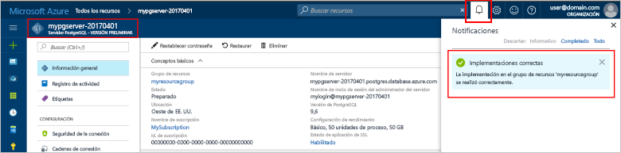
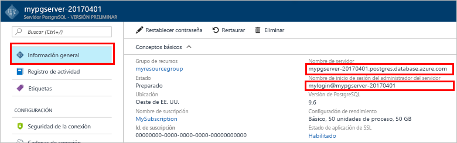
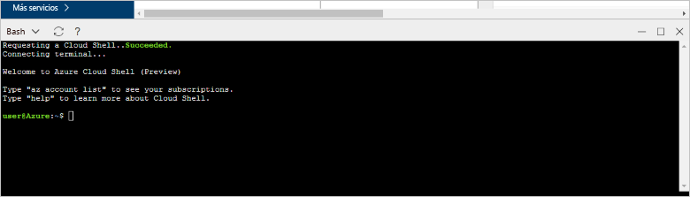

# <a name="design-your-first-azure-database-for-postgresql-using-hello-azure-portal"></a><span data-ttu-id="e38ca-103">Diseñar la primera base de datos de Azure para PostgreSQL mediante Hola portal de Azure</span><span class="sxs-lookup"><span data-stu-id="e38ca-103">Design your first Azure Database for PostgreSQL using hello Azure portal</span></span>

<span data-ttu-id="e38ca-104">Base de datos de Azure para PostgreSQL es un servicio administrado que le permite toorun, administrar y escalar las bases de datos de PostgreSQL altamente disponibles en la nube de Hola.</span><span class="sxs-lookup"><span data-stu-id="e38ca-104">Azure Database for PostgreSQL is a managed service that enables you toorun, manage, and scale highly available PostgreSQL databases in hello cloud.</span></span> <span data-ttu-id="e38ca-105">Con hello portal de Azure, puede administrar el servidor fácilmente y diseñar una base de datos.</span><span class="sxs-lookup"><span data-stu-id="e38ca-105">Using hello Azure portal, you can easily manage your server and design a database.</span></span>

<span data-ttu-id="e38ca-106">En este tutorial, utilice hello toolearn portal Azure cómo para:</span><span class="sxs-lookup"><span data-stu-id="e38ca-106">In this tutorial, you use hello Azure portal toolearn how to:</span></span>
> [!div class="checklist"]
> * <span data-ttu-id="e38ca-107">Creación de una instancia de Azure Database for PostgreSQL</span><span class="sxs-lookup"><span data-stu-id="e38ca-107">Create an Azure Database for PostgreSQL</span></span>
> * <span data-ttu-id="e38ca-108">Configurar firewall de servidor hello</span><span class="sxs-lookup"><span data-stu-id="e38ca-108">Configure hello server firewall</span></span>
> * <span data-ttu-id="e38ca-109">Use [ **psql** ](https://www.postgresql.org/docs/9.6/static/app-psql.html) utilidad toocreate una base de datos</span><span class="sxs-lookup"><span data-stu-id="e38ca-109">Use [**psql**](https://www.postgresql.org/docs/9.6/static/app-psql.html) utility toocreate a database</span></span>
> * <span data-ttu-id="e38ca-110">Carga de datos de ejemplo</span><span class="sxs-lookup"><span data-stu-id="e38ca-110">Load sample data</span></span>
> * <span data-ttu-id="e38ca-111">Datos de consulta</span><span class="sxs-lookup"><span data-stu-id="e38ca-111">Query data</span></span>
> * <span data-ttu-id="e38ca-112">Actualización de datos</span><span class="sxs-lookup"><span data-stu-id="e38ca-112">Update data</span></span>
> * <span data-ttu-id="e38ca-113">Restauración de datos</span><span class="sxs-lookup"><span data-stu-id="e38ca-113">Restore data</span></span>

## <a name="prerequisites"></a><span data-ttu-id="e38ca-114">Requisitos previos</span><span class="sxs-lookup"><span data-stu-id="e38ca-114">Prerequisites</span></span>
<span data-ttu-id="e38ca-115">Si no tiene una suscripción a Azure, cree una cuenta [gratuita](https://azure.microsoft.com/free/) antes de empezar.</span><span class="sxs-lookup"><span data-stu-id="e38ca-115">If you don't have an Azure subscription, create a [free](https://azure.microsoft.com/free/) account before you begin.</span></span>

## <a name="log-in-toohello-azure-portal"></a><span data-ttu-id="e38ca-116">Inicie sesión en toohello portal de Azure</span><span class="sxs-lookup"><span data-stu-id="e38ca-116">Log in toohello Azure portal</span></span>
<span data-ttu-id="e38ca-117">Inicie sesión en toohello [portal de Azure](https://portal.azure.com).</span><span class="sxs-lookup"><span data-stu-id="e38ca-117">Log in toohello [Azure portal](https://portal.azure.com).</span></span>

## <a name="create-an-azure-database-for-postgresql"></a><span data-ttu-id="e38ca-118">Creación de una instancia de Azure Database for PostgreSQL</span><span class="sxs-lookup"><span data-stu-id="e38ca-118">Create an Azure Database for PostgreSQL</span></span>

<span data-ttu-id="e38ca-119">Un servidor de Azure Database for PostgreSQL se crea con un conjunto definido de [recursos de proceso y almacenamiento](./concepts-compute-unit-and-storage.md).</span><span class="sxs-lookup"><span data-stu-id="e38ca-119">An Azure Database for PostgreSQL server is created with a defined set of [compute and storage resources](./concepts-compute-unit-and-storage.md).</span></span> <span data-ttu-id="e38ca-120">servidor de Hola se crea dentro de un [grupo de recursos de Azure](../azure-resource-manager/resource-group-overview.md).</span><span class="sxs-lookup"><span data-stu-id="e38ca-120">hello server is created within an [Azure resource group](../azure-resource-manager/resource-group-overview.md).</span></span>

<span data-ttu-id="e38ca-121">Siga estos toocreate pasos una base de datos de Azure para PostgreSQL servidor:</span><span class="sxs-lookup"><span data-stu-id="e38ca-121">Follow these steps toocreate an Azure Database for PostgreSQL server:</span></span>
1.  <span data-ttu-id="e38ca-122">Haga clic en hello **+ nuevo** encontró el botón en la esquina izquierda superior de Hola de hello portal de Azure.</span><span class="sxs-lookup"><span data-stu-id="e38ca-122">Click hello **+ New**  button found on hello upper left-hand corner of hello Azure portal.</span></span>
2.  <span data-ttu-id="e38ca-123">Seleccione **bases de datos** de hello **New** página y seleccione **base de datos de Azure para PostgreSQL** de hello **bases de datos** página.</span><span class="sxs-lookup"><span data-stu-id="e38ca-123">Select **Databases** from hello **New** page, and select **Azure Database for PostgreSQL** from hello **Databases** page.</span></span>
 <span data-ttu-id="e38ca-124"></span><span class="sxs-lookup"><span data-stu-id="e38ca-124"></span></span>

3.  <span data-ttu-id="e38ca-125">Rellene Hola nuevo servidor detalles formulario con hello después de obtener información, como se muestra en hello anterior imagen:</span><span class="sxs-lookup"><span data-stu-id="e38ca-125">Fill out hello new server details form with hello following information, as shown on hello preceding image:</span></span>
    - <span data-ttu-id="e38ca-126">Nombre del servidor: **mypgserver 20170401** (nombre de un servidor asigna nombre tooDNS y, por tanto, es necesario toobe único global)</span><span class="sxs-lookup"><span data-stu-id="e38ca-126">Server name: **mypgserver-20170401** (name of a server maps tooDNS name and is thus required toobe globally unique)</span></span> 
    - <span data-ttu-id="e38ca-127">Suscripción: Si tiene varias suscripciones, elija suscripción adecuado de hello en el que recurso de hello existe o se factura para.</span><span class="sxs-lookup"><span data-stu-id="e38ca-127">Subscription: If you have multiple subscriptions, choose hello appropriate subscription in which hello resource exists or is billed for.</span></span>
    - <span data-ttu-id="e38ca-128">Grupo de recursos: **myresourcegroup**</span><span class="sxs-lookup"><span data-stu-id="e38ca-128">Resource group: **myresourcegroup**</span></span>
    - <span data-ttu-id="e38ca-129">El inicio de sesión de administrador y la contraseña que elija para el servidor</span><span class="sxs-lookup"><span data-stu-id="e38ca-129">Server admin login and password of your choice</span></span>
    - <span data-ttu-id="e38ca-130">Ubicación</span><span class="sxs-lookup"><span data-stu-id="e38ca-130">Location</span></span>
    - <span data-ttu-id="e38ca-131">Versión de PostgreSQL</span><span class="sxs-lookup"><span data-stu-id="e38ca-131">PostgreSQL Version</span></span>

  > [!IMPORTANT]
  > <span data-ttu-id="e38ca-132">inicio de sesión de administrador de servidor de Hola y la contraseña que especifique aquí son necesario toolog en toohello server y sus bases de datos más adelante en esta guía de inicio rápido.</span><span class="sxs-lookup"><span data-stu-id="e38ca-132">hello server admin login and password that you specify here are required toolog in toohello server and its databases later in this quick start.</span></span> <span data-ttu-id="e38ca-133">Recuerde o grabe esta información para su uso posterior.</span><span class="sxs-lookup"><span data-stu-id="e38ca-133">Remember or record this information for later use.</span></span>

4.  <span data-ttu-id="e38ca-134">Haga clic en **tarifa** toospecify Hola nivel y rendimiento de nivel de servicio para la nueva base de datos.</span><span class="sxs-lookup"><span data-stu-id="e38ca-134">Click **Pricing tier** toospecify hello service tier and performance level for your new database.</span></span> <span data-ttu-id="e38ca-135">En esta guía de inicio rápido, seleccione el nivel **Básico**, **50 Unidades de proceso** y **50 GB** de almacenamiento incluido.</span><span class="sxs-lookup"><span data-stu-id="e38ca-135">For this quick start, select **Basic** Tier, **50 Compute Units** and **50 GB** of included storage.</span></span>
 <span data-ttu-id="e38ca-136"></span><span class="sxs-lookup"><span data-stu-id="e38ca-136"></span></span>
5.  <span data-ttu-id="e38ca-137">Haga clic en **Aceptar**.</span><span class="sxs-lookup"><span data-stu-id="e38ca-137">Click **Ok**.</span></span>
6.  <span data-ttu-id="e38ca-138">Haga clic en **crear** servidor de hello tooprovision.</span><span class="sxs-lookup"><span data-stu-id="e38ca-138">Click **Create** tooprovision hello server.</span></span> <span data-ttu-id="e38ca-139">El aprovisionamiento tarda unos minutos.</span><span class="sxs-lookup"><span data-stu-id="e38ca-139">Provisioning takes a few minutes.</span></span>

  > [!TIP]
  > <span data-ttu-id="e38ca-140">Comprobar hello **toodashboard Pin** opción tooallow fácil realizar un seguimiento de las implementaciones.</span><span class="sxs-lookup"><span data-stu-id="e38ca-140">Check hello **Pin toodashboard** option tooallow easy tracking of your deployments.</span></span>

7.  <span data-ttu-id="e38ca-141">En la barra de herramientas de hello, haga clic en **notificaciones** toomonitor proceso de implementación de Hola.</span><span class="sxs-lookup"><span data-stu-id="e38ca-141">On hello toolbar, click **Notifications** toomonitor hello deployment process.</span></span>
 <span data-ttu-id="e38ca-142"></span><span class="sxs-lookup"><span data-stu-id="e38ca-142"></span></span>
   
  <span data-ttu-id="e38ca-143">De forma predeterminada, la base de datos de **postgres** se crea en el servidor.</span><span class="sxs-lookup"><span data-stu-id="e38ca-143">By default, **postgres** database gets created under your server.</span></span> <span data-ttu-id="e38ca-144">Hola [postgres](https://www.postgresql.org/docs/9.6/static/app-initdb.html) base de datos es una base de datos predeterminada destinado a los usuarios, utilidades y aplicaciones de otros fabricantes.</span><span class="sxs-lookup"><span data-stu-id="e38ca-144">hello [postgres](https://www.postgresql.org/docs/9.6/static/app-initdb.html) database is a default database meant for use by users, utilities, and third-party applications.</span></span> 

## <a name="configure-a-server-level-firewall-rule"></a><span data-ttu-id="e38ca-145">Configuración de una regla de firewall de nivel de servidor</span><span class="sxs-lookup"><span data-stu-id="e38ca-145">Configure a server-level firewall rule</span></span>

<span data-ttu-id="e38ca-146">Hola base de datos de Azure para servicio PostgreSQL crea un servidor de seguridad en el nivel de servidor hello.</span><span class="sxs-lookup"><span data-stu-id="e38ca-146">hello Azure Database for PostgreSQL service creates a firewall at hello server-level.</span></span> <span data-ttu-id="e38ca-147">Este firewall impide que las aplicaciones externas y las herramientas se conecten toohello server y las bases de datos en el servidor de Hola a menos que se crea una regla de firewall tooopen firewall de Hola para direcciones IP concretas.</span><span class="sxs-lookup"><span data-stu-id="e38ca-147">This firewall prevents external applications and tools from connecting toohello server and any databases on hello server unless a firewall rule is created tooopen hello firewall for specific IP addresses.</span></span> 

1.  <span data-ttu-id="e38ca-148">Una vez finalizada la implementación de hello, haga clic en **todos los recursos** del menú izquierdo de Hola y escriba el nombre de hello **mypgserver 20170401** toosearch para el servidor recién creado.</span><span class="sxs-lookup"><span data-stu-id="e38ca-148">After hello deployment completes, click **All Resources** from hello left-hand menu and type in hello name **mypgserver-20170401** toosearch for your newly created server.</span></span> <span data-ttu-id="e38ca-149">Haga clic en nombre del servidor de hello, en el resultado de la búsqueda de Hola.</span><span class="sxs-lookup"><span data-stu-id="e38ca-149">Click hello server name listed in hello search result.</span></span> <span data-ttu-id="e38ca-150">Hola **Introducción** página para el servidor se abre y proporciona opciones para otra configuración.</span><span class="sxs-lookup"><span data-stu-id="e38ca-150">hello **Overview** page for your server opens and provides options for further configuration.</span></span>
 
 

2.  <span data-ttu-id="e38ca-152">En la hoja de servidor hello, seleccione **seguridad de conexión**.</span><span class="sxs-lookup"><span data-stu-id="e38ca-152">In hello server blade, select **Connection Security**.</span></span> 
3.  <span data-ttu-id="e38ca-153">Haga clic en el cuadro de texto hello **nombre de la regla,** y agregue un nuevo firewall regla toowhitelist Hola intervalo IP para la conectividad.</span><span class="sxs-lookup"><span data-stu-id="e38ca-153">Click in hello text box under **Rule Name,** and add a new firewall rule toowhitelist hello IP range for connectivity.</span></span> <span data-ttu-id="e38ca-154">Para este tutorial, vamos a permitir todas las direcciones IP; para ello, escriba **Nombre de la regla = AllowAllIps**, **IP inicial = 0.0.0.0** e **IP final = 255.255.255.255** y haga clic en **Guardar**.</span><span class="sxs-lookup"><span data-stu-id="e38ca-154">For this tutorial, let's allow all IPs by typing in **Rule Name = AllowAllIps**, **Start IP = 0.0.0.0** and **End IP = 255.255.255.255** and then click **Save**.</span></span> <span data-ttu-id="e38ca-155">Puede establecer una regla de firewall que abarca un intervalo IP toobe tooconnect capaz de la red.</span><span class="sxs-lookup"><span data-stu-id="e38ca-155">You can set a firewall rule that covers an IP range toobe able tooconnect from your network.</span></span>
 
 

4.  <span data-ttu-id="e38ca-157">Haga clic en **guardar** y, a continuación, haga clic en hello **X** tooclose hello **conexiones seguridad** página.</span><span class="sxs-lookup"><span data-stu-id="e38ca-157">Click **Save** and then click hello **X** tooclose hello **Connections Security** page.</span></span>

  > [!NOTE]
  > <span data-ttu-id="e38ca-158">El servidor Azure PostgreSQL se comunica a través de puerto 5432.</span><span class="sxs-lookup"><span data-stu-id="e38ca-158">Azure PostgreSQL server communicates over port 5432.</span></span> <span data-ttu-id="e38ca-159">Si está tratando de tooconnect desde dentro de una red corporativa, es posible que firewall de su red no permite el tráfico saliente en el puerto 5432.</span><span class="sxs-lookup"><span data-stu-id="e38ca-159">If you are trying tooconnect from within a corporate network, outbound traffic over port 5432 may not be allowed by your network's firewall.</span></span> <span data-ttu-id="e38ca-160">Si es así, no será capaz de tooconnect tooyour base de datos de SQL Azure servidor a menos que el departamento de TI abre el puerto 5432.</span><span class="sxs-lookup"><span data-stu-id="e38ca-160">If so, you will not be able tooconnect tooyour Azure SQL Database server unless your IT department opens port 5432.</span></span>
  >


## <a name="get-hello-connection-information"></a><span data-ttu-id="e38ca-161">Obtener información de conexión de Hola</span><span class="sxs-lookup"><span data-stu-id="e38ca-161">Get hello connection information</span></span>

<span data-ttu-id="e38ca-162">Cuando creamos nuestra base de datos de Azure para servidor PostgreSQL, Hola predeterminado **postgres** base de datos también se crea.</span><span class="sxs-lookup"><span data-stu-id="e38ca-162">When we created our Azure Database for PostgreSQL server, hello default **postgres** database also gets created.</span></span> <span data-ttu-id="e38ca-163">servidor de base de datos de tooconnect tooyour, necesita credenciales de acceso y la información de host de tooprovide.</span><span class="sxs-lookup"><span data-stu-id="e38ca-163">tooconnect tooyour database server, you need tooprovide host information and access credentials.</span></span>

1. <span data-ttu-id="e38ca-164">En el menú de la izquierda de hello en el portal de Azure, haga clic en **todos los recursos** y busque el servidor de Hola que acaba de crear **mypgserver 20170401**.</span><span class="sxs-lookup"><span data-stu-id="e38ca-164">From hello left-hand menu in Azure portal, click **All resources** and search for hello server you just created **mypgserver-20170401**.</span></span>

  

3. <span data-ttu-id="e38ca-166">Haga clic en el nombre del servidor de hello **mypgserver 20170401**.</span><span class="sxs-lookup"><span data-stu-id="e38ca-166">Click hello server name **mypgserver-20170401**.</span></span>
4. <span data-ttu-id="e38ca-167">Servidor de hello seleccione **Introducción** página.</span><span class="sxs-lookup"><span data-stu-id="e38ca-167">Select hello server's **Overview** page.</span></span> <span data-ttu-id="e38ca-168">Tome nota de hello **nombre del servidor** y **nombre de inicio de sesión del Administrador de servidor**.</span><span class="sxs-lookup"><span data-stu-id="e38ca-168">Make a note of hello **Server name** and **Server admin login name**.</span></span>

 


## <a name="connect-toopostgresql-database-using-psql-in-cloud-shell"></a><span data-ttu-id="e38ca-170">Conectar la base de datos de tooPostgreSQL con psql en el Shell de nube</span><span class="sxs-lookup"><span data-stu-id="e38ca-170">Connect tooPostgreSQL database using psql in Cloud Shell</span></span>

<span data-ttu-id="e38ca-171">Vamos a usar ahora hello psql utilidad de línea de comandos tooconnect toohello base de datos de Azure para servidor de PostgreSQL.</span><span class="sxs-lookup"><span data-stu-id="e38ca-171">Let's now use hello psql command-line utility tooconnect toohello Azure Database for PostgreSQL server.</span></span> 
1. <span data-ttu-id="e38ca-172">Inicie Hola Shell en la nube de Azure a través del icono de terminal de hello en el panel de navegación superior de Hola.</span><span class="sxs-lookup"><span data-stu-id="e38ca-172">Launch hello Azure Cloud Shell via hello terminal icon on hello top navigation pane.</span></span>

   

2. <span data-ttu-id="e38ca-174">Hola Shell en la nube de Azure se abre en el explorador, lo que le tootype intensiva de comandos.</span><span class="sxs-lookup"><span data-stu-id="e38ca-174">hello Azure Cloud Shell opens in your browser, enabling you tootype bash commands.</span></span>

   

3. <span data-ttu-id="e38ca-176">En el símbolo del sistema de hello Shell en la nube, conectar tooyour base de datos de Azure para el servidor de PostgreSQL usando comandos de psql Hola.</span><span class="sxs-lookup"><span data-stu-id="e38ca-176">At hello Cloud Shell prompt, connect tooyour Azure Database for PostgreSQL server using hello psql commands.</span></span> <span data-ttu-id="e38ca-177">Hola siguiente formato es tooconnect usado tooan base de datos de Azure para servidor de PostgreSQL con hello [psql](https://www.postgresql.org/docs/9.6/static/app-psql.html) utilidad:</span><span class="sxs-lookup"><span data-stu-id="e38ca-177">hello following format is used tooconnect tooan Azure Database for PostgreSQL server with hello [psql](https://www.postgresql.org/docs/9.6/static/app-psql.html) utility:</span></span>
   ```bash
   psql --host=<myserver> --port=<port> --username=<server admin login> --dbname=<database name>
   ```

   <span data-ttu-id="e38ca-178">Por ejemplo, hello siguiente comando conecta a base de datos de toohello predeterminada denominada **postgres** en el servidor de PostgreSQL **mypgserver 20170401.postgres.database.azure.com** utilizando las credenciales de acceso.</span><span class="sxs-lookup"><span data-stu-id="e38ca-178">For example, hello following command connects toohello default database called **postgres** on your PostgreSQL server **mypgserver-20170401.postgres.database.azure.com** using access credentials.</span></span> <span data-ttu-id="e38ca-179">Escriba la contraseña de administrador del servidor cuando se le solicite.</span><span class="sxs-lookup"><span data-stu-id="e38ca-179">Enter your server admin password when prompted.</span></span>

   ```bash
   psql --host=mypgserver-20170401.postgres.database.azure.com --port=5432 --username=mylogin@mypgserver-20170401 --dbname=postgres
   ```

## <a name="create-a-new-database"></a><span data-ttu-id="e38ca-180">Creación de una base de datos</span><span class="sxs-lookup"><span data-stu-id="e38ca-180">Create a New Database</span></span>
<span data-ttu-id="e38ca-181">Una vez que esté conectado toohello server, cree una base de datos en blanco en el símbolo del sistema de Hola.</span><span class="sxs-lookup"><span data-stu-id="e38ca-181">Once you're connected toohello server, create a blank database at hello prompt.</span></span>
```bash
CREATE DATABASE mypgsqldb;
```

<span data-ttu-id="e38ca-182">En el símbolo del sistema de hello, ejecute hello después de la base de datos de comando tooswitch conexión toohello recién creado **mypgsqldb**.</span><span class="sxs-lookup"><span data-stu-id="e38ca-182">At hello prompt, execute hello following command tooswitch connection toohello newly created database **mypgsqldb**.</span></span>
```bash
\c mypgsqldb
```
## <a name="create-tables-in-hello-database"></a><span data-ttu-id="e38ca-183">Crear tablas de base de datos de Hola</span><span class="sxs-lookup"><span data-stu-id="e38ca-183">Create tables in hello database</span></span>
<span data-ttu-id="e38ca-184">Ahora que sabe cómo tooconnect toohello base de datos de Azure para PostgreSQL, podemos ver cómo toocomplete algunas tareas básicas.</span><span class="sxs-lookup"><span data-stu-id="e38ca-184">Now that you know how tooconnect toohello Azure Database for PostgreSQL, we can go over how toocomplete some basic tasks.</span></span>

<span data-ttu-id="e38ca-185">En primer lugar, podemos crear una tabla y cargarla con algunos datos.</span><span class="sxs-lookup"><span data-stu-id="e38ca-185">First, we can create a table and load it with some data.</span></span> <span data-ttu-id="e38ca-186">Vamos a crear una tabla que hace el seguimiento de información del inventario.</span><span class="sxs-lookup"><span data-stu-id="e38ca-186">Let's create a table that tracks inventory information.</span></span>
```sql
CREATE TABLE inventory (
    id serial PRIMARY KEY, 
    name VARCHAR(50), 
    quantity INTEGER
);
```

<span data-ttu-id="e38ca-187">Puede ver Hola recién creado tabla en la lista de Hola de tabvles ahora escribiendo:</span><span class="sxs-lookup"><span data-stu-id="e38ca-187">You can see hello newly created table in hello list of tabvles now by typing:</span></span>
```sql
\dt
```

## <a name="load-data-into-hello-tables"></a><span data-ttu-id="e38ca-188">Cargar datos en tablas de Hola</span><span class="sxs-lookup"><span data-stu-id="e38ca-188">Load data into hello tables</span></span>
<span data-ttu-id="e38ca-189">Ahora que tenemos una tabla, podemos insertar algunos datos en ella.</span><span class="sxs-lookup"><span data-stu-id="e38ca-189">Now that we have a table, we can insert some data into it.</span></span> <span data-ttu-id="e38ca-190">En la ventana de símbolo del sistema abierto hello, ejecute hello después consulta tooinsert algunas filas de datos</span><span class="sxs-lookup"><span data-stu-id="e38ca-190">At hello open command prompt window, run hello following query tooinsert some rows of data</span></span>
```sql
INSERT INTO inventory (id, name, quantity) VALUES (1, 'banana', 150); 
INSERT INTO inventory (id, name, quantity) VALUES (2, 'orange', 154);
```

<span data-ttu-id="e38ca-191">Tiene ahora dos filas de datos de ejemplo en la tabla de Hola que creó anteriormente.</span><span class="sxs-lookup"><span data-stu-id="e38ca-191">You have now two rows of sample data into hello table you created earlier.</span></span>

## <a name="query-and-update-hello-data-in-hello-tables"></a><span data-ttu-id="e38ca-192">Consultar y actualizar los datos de hello en tablas de Hola</span><span class="sxs-lookup"><span data-stu-id="e38ca-192">Query and update hello data in hello tables</span></span>
<span data-ttu-id="e38ca-193">Ejecute hello siguientes tooretrieve información de consulta de tabla de base de datos de Hola.</span><span class="sxs-lookup"><span data-stu-id="e38ca-193">Execute hello following query tooretrieve information from hello database table.</span></span> 
```sql
SELECT * FROM inventory;
```

<span data-ttu-id="e38ca-194">También puede actualizar los datos de hello en tablas de Hola</span><span class="sxs-lookup"><span data-stu-id="e38ca-194">You can also update hello data in hello tables</span></span>
```sql
UPDATE inventory SET quantity = 200 WHERE name = 'banana';
```

<span data-ttu-id="e38ca-195">fila de Hola se actualiza en consecuencia cuando se recuperan datos.</span><span class="sxs-lookup"><span data-stu-id="e38ca-195">hello row gets updated accordingly when you retrieve data.</span></span>
```sql
SELECT * FROM inventory;
```

## <a name="restore-data-tooa-previous-point-in-time"></a><span data-ttu-id="e38ca-196">Restaurar el punto de datos tooa anterior en el tiempo</span><span class="sxs-lookup"><span data-stu-id="e38ca-196">Restore data tooa previous point in time</span></span>
<span data-ttu-id="e38ca-197">Imagine que eliminó accidentalmente esta tabla.</span><span class="sxs-lookup"><span data-stu-id="e38ca-197">Imagine you have accidentally deleted this table.</span></span> <span data-ttu-id="e38ca-198">No se puede recuperar con facilidad de esta situación.</span><span class="sxs-lookup"><span data-stu-id="e38ca-198">This situation is something you cannot easily recover from.</span></span> <span data-ttu-id="e38ca-199">Base de datos de Azure para PostgreSQL permite toogo tooany atrás en un momento (en Hola última too7 días (Basic) y 35 días (estándar)) y restaurar este punto-in-time tooa nuevo servidor.</span><span class="sxs-lookup"><span data-stu-id="e38ca-199">Azure Database for PostgreSQL allows you toogo back tooany point-in-time (in hello last up too7 days (Basic) and 35 days (Standard)) and restore this point-in-time tooa new server.</span></span> <span data-ttu-id="e38ca-200">Puede usar esta nueva toorecover server los datos eliminados.</span><span class="sxs-lookup"><span data-stu-id="e38ca-200">You can use this new server toorecover your deleted data.</span></span> <span data-ttu-id="e38ca-201">Hola siguiendo los pasos restauración Hola ejemplo servidor tooa punto antes de que se ha agregado Hola tabla.</span><span class="sxs-lookup"><span data-stu-id="e38ca-201">hello following steps restore hello sample server tooa point before hello table was added.</span></span>

1.  <span data-ttu-id="e38ca-202">En hello base de datos de Azure para la página de PostgreSQL para el servidor, haga clic en **restaurar** en la barra de herramientas de Hola.</span><span class="sxs-lookup"><span data-stu-id="e38ca-202">On hello Azure Database for PostgreSQL page for your server, click **Restore** on hello toolbar.</span></span> <span data-ttu-id="e38ca-203">Hola **restaurar** se abre la página.</span><span class="sxs-lookup"><span data-stu-id="e38ca-203">hello **Restore** page opens.</span></span>
  <span data-ttu-id="e38ca-204"></span><span class="sxs-lookup"><span data-stu-id="e38ca-204"></span></span>
2.  <span data-ttu-id="e38ca-205">Rellene hello **restaurar** formulario con la información de hello necesario:</span><span class="sxs-lookup"><span data-stu-id="e38ca-205">Fill out hello **Restore** form with hello required information:</span></span>

  
  - <span data-ttu-id="e38ca-207">**Punto de restauración**: seleccione un punto-in-time que se produce antes de que se cambió el servidor hello</span><span class="sxs-lookup"><span data-stu-id="e38ca-207">**Restore point**: Select a point-in-time that occurs before hello server was changed</span></span>
  - <span data-ttu-id="e38ca-208">**Servidor de destino**: especifique un nuevo nombre de servidor que desee toorestore a</span><span class="sxs-lookup"><span data-stu-id="e38ca-208">**Target server**: Provide a new server name you want toorestore to</span></span>
  - <span data-ttu-id="e38ca-209">**Ubicación**: no se puede seleccionar una región hello, de forma predeterminada es igual que el servidor de origen de Hola</span><span class="sxs-lookup"><span data-stu-id="e38ca-209">**Location**: You cannot select hello region, by default it is same as hello source server</span></span>
  - <span data-ttu-id="e38ca-210">**Plan de tarifa**: no se puede cambiar este valor al restaurar un servidor.</span><span class="sxs-lookup"><span data-stu-id="e38ca-210">**Pricing tier**: You cannot change this value when restoring a server.</span></span> <span data-ttu-id="e38ca-211">Es igual que el servidor de origen de Hola.</span><span class="sxs-lookup"><span data-stu-id="e38ca-211">It is same as hello source server.</span></span> 
3.  <span data-ttu-id="e38ca-212">Haga clic en **Aceptar** toorestore Hola servidor demasiado[tooa en el momento de restaurar](./howto-restore-server-portal.md) antes de que se eliminen tablas Hola.</span><span class="sxs-lookup"><span data-stu-id="e38ca-212">Click **OK** toorestore hello server too[restore tooa point-in-time](./howto-restore-server-portal.md) before hello tables was deleted.</span></span> <span data-ttu-id="e38ca-213">Restauración tooa otro punto de servidor en el tiempo crea un duplicado en el servidor nuevo como servidor original Hola de punto de hello en el tiempo especificado, siempre que esté dentro del período de retención de Hola para su [nivel de servicio](./concepts-service-tiers.md).</span><span class="sxs-lookup"><span data-stu-id="e38ca-213">Restoring a server tooa different point in time creates a duplicate new server as hello original server as of hello point in time you specify, provided that it is within hello retention period for your [service tier](./concepts-service-tiers.md).</span></span>

## <a name="next-steps"></a><span data-ttu-id="e38ca-214">Pasos siguientes</span><span class="sxs-lookup"><span data-stu-id="e38ca-214">Next Steps</span></span>
<span data-ttu-id="e38ca-215">En este tutorial, ha aprendido cómo toouse Hola portal de Azure y otras utilidades para:</span><span class="sxs-lookup"><span data-stu-id="e38ca-215">In this tutorial, you learned how toouse hello Azure portal and other utilities to:</span></span>
> [!div class="checklist"]
> * <span data-ttu-id="e38ca-216">Creación de una instancia de Azure Database for PostgreSQL</span><span class="sxs-lookup"><span data-stu-id="e38ca-216">Create an Azure Database for PostgreSQL</span></span>
> * <span data-ttu-id="e38ca-217">Configurar firewall de servidor hello</span><span class="sxs-lookup"><span data-stu-id="e38ca-217">Configure hello server firewall</span></span>
> * <span data-ttu-id="e38ca-218">Use [ **psql** ](https://www.postgresql.org/docs/9.6/static/app-psql.html) utilidad toocreate una base de datos</span><span class="sxs-lookup"><span data-stu-id="e38ca-218">Use [**psql**](https://www.postgresql.org/docs/9.6/static/app-psql.html) utility toocreate a database</span></span>
> * <span data-ttu-id="e38ca-219">Carga de datos de ejemplo</span><span class="sxs-lookup"><span data-stu-id="e38ca-219">Load sample data</span></span>
> * <span data-ttu-id="e38ca-220">Datos de consulta</span><span class="sxs-lookup"><span data-stu-id="e38ca-220">Query data</span></span>
> * <span data-ttu-id="e38ca-221">Actualización de datos</span><span class="sxs-lookup"><span data-stu-id="e38ca-221">Update data</span></span>
> * <span data-ttu-id="e38ca-222">Restauración de datos</span><span class="sxs-lookup"><span data-stu-id="e38ca-222">Restore data</span></span>

<span data-ttu-id="e38ca-223">A continuación, obtenga información acerca de cómo toouse otras tareas similares toodo CLI de Azure, revise este tutorial: [diseñar la primera base de datos de Azure para PostgreSQL con CLI de Azure](tutorial-design-database-using-azure-cli.md)</span><span class="sxs-lookup"><span data-stu-id="e38ca-223">Next, learn how toouse Azure CLI toodo similar tasks, review this tutorial: [Design your first Azure Database for PostgreSQL using Azure CLI](tutorial-design-database-using-azure-cli.md)</span></span>
