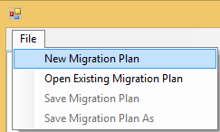
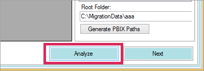
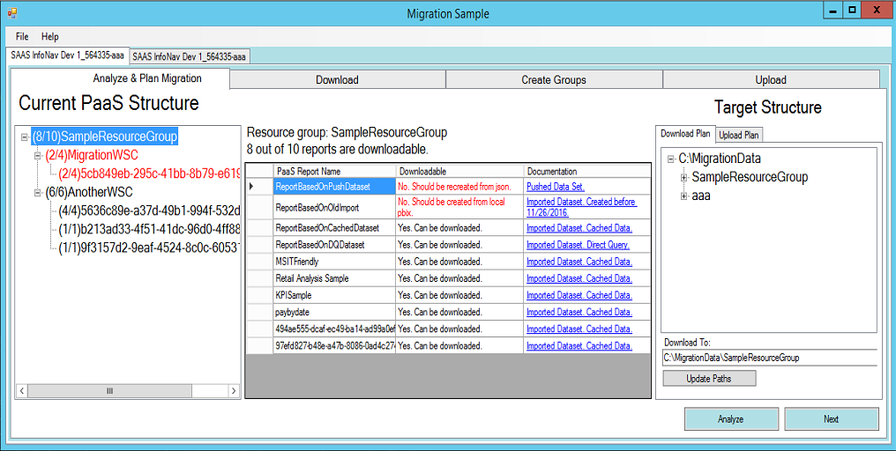
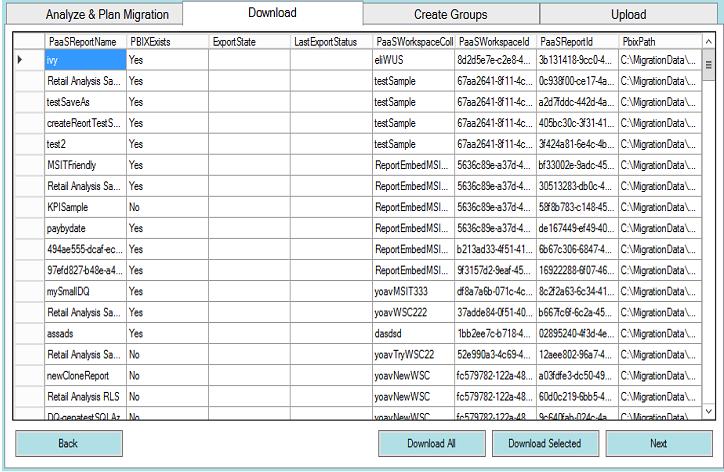
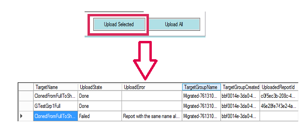

# <a name="use-the-power-bi-embedded-migration-tool"></a>Uso de la herramienta de migración de Power BI Embedded

La herramienta de migración de Power BI Embedded puede utilizarse para copiar los informes de Colecciones de áreas de trabajo de Power BI en Power BI Embedded.

El contenido de las colecciones de áreas de trabajo se puede migrar en paralelo al servicio Power BI con la solución que tenga implementada, sin tiempos de inactividad.

## <a name="limitations"></a>Limitaciones

* Los conjuntos de datos insertados no se pueden descargar y hay que volver a crearlos con las API de REST de Power BI del servicio Power BI.
* Los archivos PBIX importados antes del 26 de noviembre de 2016 no se descargarán.

## <a name="download"></a>Descargar

Puede descargar la herramienta de migración de ejemplo de [GitHub](https://github.com/Microsoft/powerbi-migration-sample) en un archivo .zip del repositorio o clonarla localmente. Una vez descargada, puede abrir el archivo *powerbi-migration-sample.sln* en Visual Studio para compilar y ejecutar la herramienta de migración.

## <a name="migration-plans"></a>Planes de migración

Un plan de migración son simplemente metadatos que catalogan el contenido en Colecciones de áreas de trabajo de Power BI que permiten elegir cómo publicarlos en Power BI Embedded.

### <a name="start-with-a-new-migration-plan"></a>Comience con un nuevo plan de migración

Un plan de migración son los metadatos de los elementos disponibles en Colecciones de áreas de trabajo de Power BI que desea migrar a Power BI Embedded. El plan de migración se almacena como un archivo XML.

Recomendamos empezar creando un plan de migración. Para ello, siga estos pasos.

1. Seleccione **Archivo** > **New Migration Plan** (Nuevo plan de migración).

    

2. En el cuadro de diálogo **Select Power BI Workspace Collections Resource Group** (Seleccionar grupo de recursos de Colecciones de áreas de trabajo de Power BI), hay que seleccionar la lista desplegable **Entorno** y elegir "prod".

3. Se le pedirá que inicie sesión. Usará los datos de inicio de sesión de su suscripción de Azure.

    > [!IMPORTANT]
    > **No** se trata de su cuenta de organización de Office 365 con la que inicia sesión en Power BI.

4. Seleccione la suscripción de Azure que almacena el recurso Colecciones de áreas de trabajo de Power BI.

    

5. Debajo de la lista de suscripción, seleccione el **grupo de recursos** que contiene las colecciones de áreas de trabajo y elija **Seleccionar**.

    

6. Seleccione **Analizar**. De este modo, obtendrá un inventario de los elementos de su suscripción de Azure para comenzar el plan.

    

    > [!NOTE]
    > El proceso de análisis podría durar varios minutos, según el número de colecciones de áreas de trabajo y la cantidad de contenido que haya en ellas.

7. Cuando se complete el proceso de **análisis**, se le pedirá que guarde el plan de migración.

En este punto, el plan de migración ya está conectado a su suscripción de Azure. Siga leyendo para comprender el flujo de trabajo de los planes de migración, que incluye las fases de análisis y planeamiento de la migración, descarga, creación de grupos y carga.

### <a name="save-your-migration-plan"></a>Guardado del plan de migración

Puede guardar el plan de migración para utilizarlo en otro momento. Se creará un archivo XML que contiene toda la información del plan de migración.

Para guardar el plan de migración, siga estos pasos.

1. Seleccione **Archivo** > **Save Migration Plan** (Guardar plan de migración).

    

2. Asigne un nombre al archivo, o bien use el nombre de archivo generado y seleccione **Guardar**.

### <a name="open-an-existing-migration-plan"></a>Apertura de un plan de migración

Puede abrir un plan de migración guardado para seguir trabajando en la migración.

Para abrir un plan de migración, siga estos pasos.

1. Seleccione **Archivo** > **Open Existing Migration Plan** (Abrir plan de migración).

    

2. Seleccione el archivo de migración y elija **Abrir**.

## <a name="step-1-analyze-and-plan-migration"></a>Paso 1: Análisis y planeamiento de una migración

La pestaña **Analyze & Plan Migration** (Analizar y planear migración) permite ver el contenido actual del grupo de recursos de su suscripción de Azure.



Examinaremos *SampleResourceGroup* como ejemplo.

### <a name="paas-topology"></a>Topología PaaS

Se trata de una lista de *Grupo de recursos > Colecciones de áreas de trabajo de Power BI > Áreas de trabajo*. Las colecciones de áreas de trabajo y el grupo de recursos mostrarán un nombre descriptivo; las áreas de trabajo, un GUID.

Los elementos de la lista también mostrarán un color y un número con el formato (n.º/n.º). Esto indica la cantidad de informes que se pueden descargar.

Un color negro significa que se pueden descargar todos los informes. El color rojo quiere decir que algunos informes no se pueden descargar. El número de la izquierda indica el número total de informes que se pueden descargar. El número de la derecha muestra el número total de informes de la agrupación.

Puede seleccionar un elemento de la topología PaaS para mostrar los informes de la sección de informes.

### <a name="reports"></a>Informes

La sección de informes mostrará una lista de los informes disponibles e indica si se pueden descargar o no.


### <a name="target-structure"></a>Estructura de destino

En la sección **Target structure** (Estructura de destino) es donde indicará a la herramienta que elementos se descargarán y cómo se cargarán.

#### <a name="download-plan"></a>Download plan (Plan de descarga)

Se creará automáticamente una ruta de acceso. Puede cambiarla si lo desea. Si lo hace, deberá seleccionar **Update paths** (Actualizar rutas de acceso).

**La descarga no se realiza realmente;** solo se especificará la estructura en la que se descargarán los informes.

#### <a name="upload-plan"></a>Upload plan (Plan de carga)

Aquí puede especificar un prefijo que se utilizará para las áreas de trabajo de aplicación que se creará en el servicio Power BI. Después, el prefijo será el GUID del área de trabajo que existía en Azure.


**No se crean realmente los grupos en el servicio Power BI;** solo se define la estructura de nomenclatura de estos.

Si cambia el prefijo, deberá seleccionar **Generate Upload Plan** (Generar plan de carga).

Puede hacer clic con el botón derecho en un grupo y cambiarle el nombre directamente en el plan de carga, si lo desea.


> [!NOTE]
> El nombre del *grupo* no debe contener espacios ni caracteres no válidos.

## <a name="step-2-download"></a>Paso 2: Descarga

En la pestaña **Descargar**, verá la lista de informes y los metadatos asociados. Puede ver el estado de exportación y el estado de exportación anterior.



Tiene dos opciones:

* Seleccionar informes específicos y hacer clic en **Descargar selección**
* Elegir **Descargar todo**


Si la descarga se realiza correctamente, verá un estado de *Listo* y se indicará que el archivo PBIX existe.

Una vez completada la descarga, seleccione la pestaña **Crear grupos**.

## <a name="step-3-create-groups"></a>Paso 3: Creación de grupos

Cuando se hayan descargado los informes disponibles, puede acceder a la pestaña **Crear grupos**. Esta pestaña generará las áreas de trabajo de aplicación en el servicio Power BI según el plan de migración que haya creado. Se creará el área de trabajo de aplicación con el nombre proporcionado en la pestaña **Cargar** de **Analyze & Plan Migration** (Analizar y planear migración).


Para crear las áreas de trabajo de aplicación, puede seleccionar **Create Selected Groups** (Crear grupos seleccionados) o **Create All Missing Groups** (Crear todos los grupos que faltan).

Cuando elija cualquiera de estas opciones, se le pedirá que inicie sesión. *Recomendamos utilizar las credenciales del servicio Power BI en el que desea crear las áreas de trabajo de aplicación.*


De este modo, se creará el área de trabajo de aplicación en el servicio Power BI. Los informes no se cargan en el área de trabajo de aplicación.

Puede comprobar si se ha creado el área de trabajo de aplicación iniciando sesión en Power BI y validando que existe el área de trabajo. Observará que no hay nada en el área de trabajo.


Después de crea el área de trabajo, puede avanzar a la pestaña **Cargar**.

## <a name="step-4-upload"></a>Paso 4: Carga

En la pestaña **Cargar**, se pueden cargar los informes en el servicio Power BI. Verá una lista de los informes que se descargaron en la pestaña Descargar junto con el nombre del grupo de destino según su plan de migración.


Puede cargar los informes seleccionados o todos. También puede restablecer el estado de carga para volver a cargar elementos.

Además, tiene la opción de seleccionar qué hacer si hay un informe con el mismo nombre. Puede elegir entre **Anular**, **Omitir** y **Sobrescribir**.




### <a name="duplicate-report-names"></a>Nombres de informe duplicados

Si tiene informes con el mismo nombre, pero sabe que no son los mismos, tendrá que cambiar la propiedad **TargetName** del informe. Puede cambiar el nombre editando manualmente el código XML del plan de migración.

Tendrá que cerrar la herramienta de migración para realizar el cambio y, luego, volver a abrir la herramienta y el plan de migración.

En el ejemplo anterior, uno de los informes clonados mostró un mensaje de error que indicaba que había otro informe con el mismo nombre. Si analizamos el código XML del plan de migración, verá lo siguiente.

```
<ReportMigrationData>
    <PaaSWorkspaceCollectionName>SampleWorkspaceCollection</PaaSWorkspaceCollectionName>
    <PaaSWorkspaceId>4c04147b-d8fc-478b-8dcb-bcf687149823</PaaSWorkspaceId>
    <PaaSReportId>525a8328-b8cc-4f0d-b2cb-c3a9b4ba2efe</PaaSReportId>
    <PaaSReportLastImportTime>1/3/2017 2:10:19 PM</PaaSReportLastImportTime>
    <PaaSReportName>cloned</PaaSReportName>
    <IsPushDataset>false</IsPushDataset>
    <IsBoundToOldDataset>false</IsBoundToOldDataset>
    <PbixPath>C:\MigrationData\SampleResourceGroup\SampleWorkspaceCollection\4c04147b-d8fc-478b-8dcb-bcf687149823\cloned-525a8328-b8cc-4f0d-b2cb-c3a9b4ba2efe.pbix</PbixPath>
    <ExportState>Done</ExportState>
    <LastExportStatus>OK</LastExportStatus>
    <SaaSTargetGroupName>SampleMigrate</SaaSTargetGroupName>
    <SaaSTargetGroupId>6da6f072-0135-4e6c-bc92-0886d8aeb79d</SaaSTargetGroupId>
    <SaaSTargetReportName>cloned</SaaSTargetReportName>
    <SaaSImportState>Failed</SaaSImportState>
    <SaaSImportError>Report with the same name already exists</SaaSImportError>
</ReportMigrationData>
```

En el elemento erróneo, podemos cambiar el nombre de SaaSTargetReportName.

```
<SaaSTargetReportName>cloned2</SaaSTargetReportName>
```

Después, podemos volver a abrir el plan, en la herramienta de migración, y cargar el informe erróneo.

Al volver a Power BI, podemos ver que los informes y conjuntos de datos se han cargado en el área de trabajo de aplicación.


<a name="upload-local-file"></a>
### <a name="upload-a-local-pbix-file"></a>Carga de un archivo PBIX local

Puede cargar una versión local de un archivo de Power BI Desktop. Tendrá que cerrar la herramienta, editar el código XML y colocar la ruta de acceso completa al archivo PBIX local en la propiedad **PbixPath**.

```
<PbixPath>[Full Path to PBIX file]</PbixPath>
```

Después de editar el código XML, vuelva a abrir el plan en la herramienta de migración y cargue el informe.

<a name="directquery-reports"></a>
### <a name="directquery-reports"></a>Informes de DirectQuery

Debe actualizar la cadena de conexión de los informes de DirectQuery. Esto puede realizarse en *powerbi.com*, o bien puede hacer una consulta mediante programación de la cadena de conexión en Power BI Embedded (Paas). Para ver un ejemplo, consulte la sección [Extraer la cadena de conexión de DirectQuery desde un informe PaaS](migrate-code-snippets.md#extract-directquery-connection-string-from-power-bi-workspace-collections).

Después, podrá actualizar la cadena de conexión del conjunto de datos en el servicio Power BI y establecer las credenciales del origen de datos. Puede consultar los siguientes ejemplos para ver cómo se hace.

* [Actualizar una cadena de conexión de DirectQuery en Power BI Embedded](migrate-code-snippets.md#update-directquery-connection-string-in-power-bi-embedded)
* [Establecer las credenciales de DirectQuery en Power BI Embedded](migrate-code-snippets.md#set-directquery-credentials-in-power-bi-embedded)

## <a name="next-steps"></a>Pasos siguientes

Ahora que se han migrado los informes de Colecciones de áreas de trabajo de Power BI a Power BI Embedded, puede actualizar la aplicación y comenzar a insertar los informes en esta área de trabajo de aplicación.

Para obtener más información, consulte [Migración de contenido de la colección de áreas de trabajo de Power BI Embedded a Power BI](migrate-from-power-bi-workspace-collections.md).

¿Tiene más preguntas? [Pruebe a plantearlas en la Comunidad de Power BI](http://community.powerbi.com/)