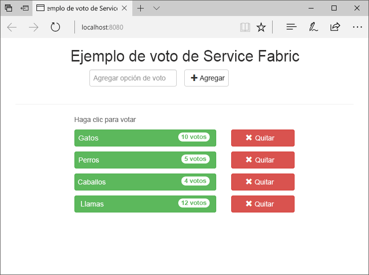
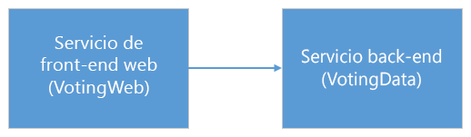
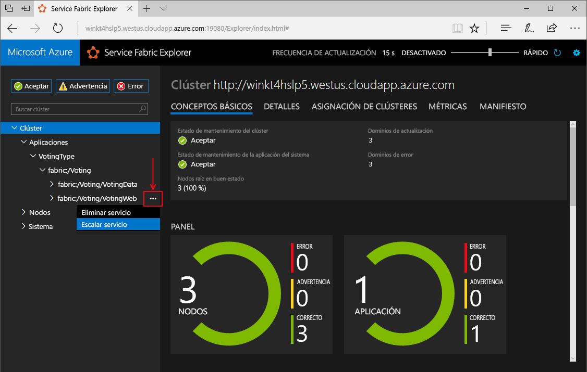
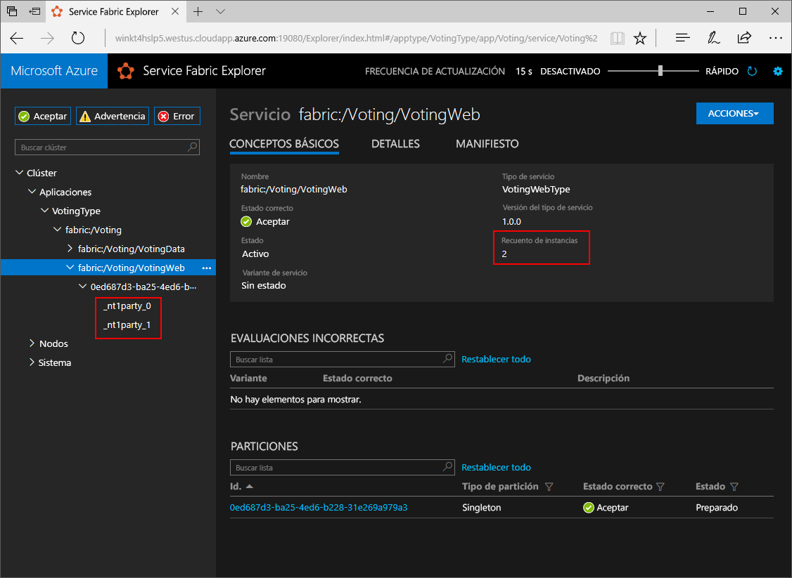
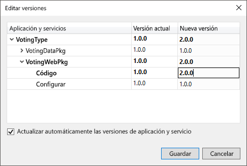
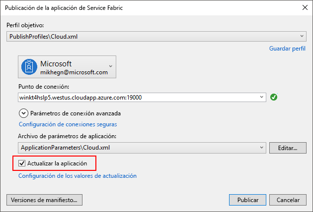
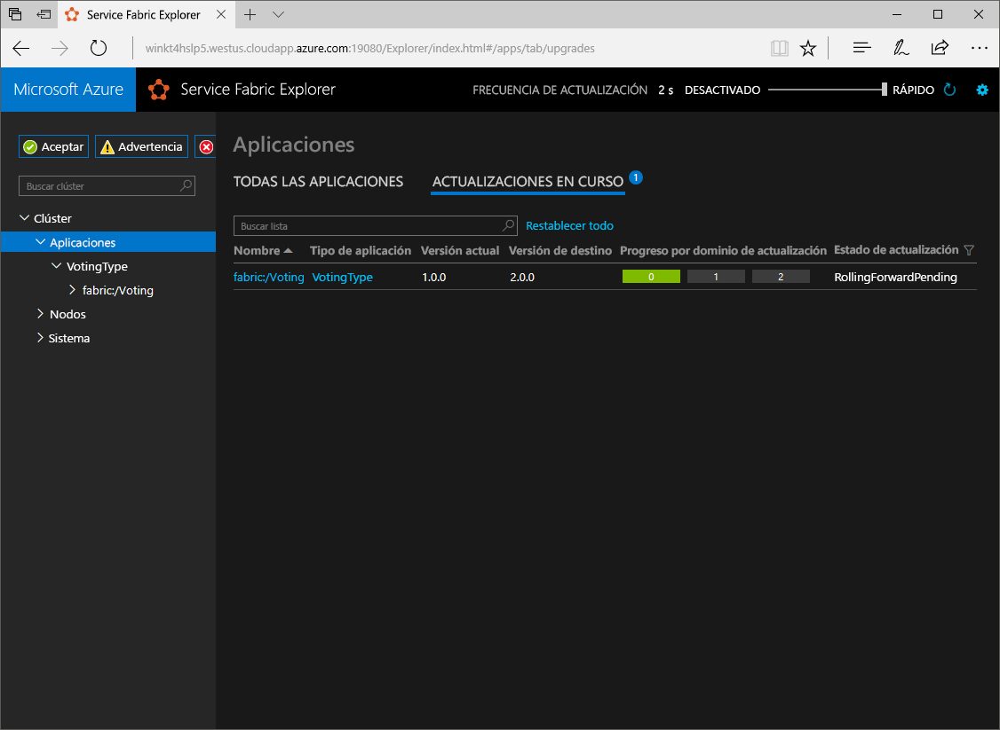

# <a name="create-a-net-service-fabric-application-in-azure"></a><span data-ttu-id="bdf69-103">Crear una aplicación .NET de Service Fabric en Azure</span><span class="sxs-lookup"><span data-stu-id="bdf69-103">Create a .NET Service Fabric application in Azure</span></span>
<span data-ttu-id="bdf69-104">Azure Service Fabric es una plataforma de sistemas distribuidos para implementar y administrar microservicios y contenedores escalables y confiables.</span><span class="sxs-lookup"><span data-stu-id="bdf69-104">Azure Service Fabric is a distributed systems platform for deploying and managing scalable and reliable microservices and containers.</span></span> 

<span data-ttu-id="bdf69-105">Este tutorial rápido muestra cómo toodeploy su primer tooService de aplicación .NET tejido.</span><span class="sxs-lookup"><span data-stu-id="bdf69-105">This quickstart shows how toodeploy your first .NET application tooService Fabric.</span></span> <span data-ttu-id="bdf69-106">Cuando haya terminado, tiene una aplicación con un front-end que guarda los resultados de la votos en un servicio back-end con estado en el clúster de hello web de ASP.NET Core derecho a voto.</span><span class="sxs-lookup"><span data-stu-id="bdf69-106">When you're finished, you have a voting application with an ASP.NET Core web front-end that saves voting results in a stateful back-end service in hello cluster.</span></span>



<span data-ttu-id="bdf69-108">Mediante el uso de esta aplicación, aprenderá a hacer lo siguiente:</span><span class="sxs-lookup"><span data-stu-id="bdf69-108">Using this application you learn how to:</span></span>
> [!div class="checklist"]
> * <span data-ttu-id="bdf69-109">Crear una aplicación con .NET y Service Fabric</span><span class="sxs-lookup"><span data-stu-id="bdf69-109">Create an application using .NET and Service Fabric</span></span>
> * <span data-ttu-id="bdf69-110">Usar ASP.NET Core como front-end web</span><span class="sxs-lookup"><span data-stu-id="bdf69-110">Use ASP.NET core as a web front-end</span></span>
> * <span data-ttu-id="bdf69-111">Almacenar datos de la aplicación en un servicio con estado</span><span class="sxs-lookup"><span data-stu-id="bdf69-111">Store application data in a stateful service</span></span>
> * <span data-ttu-id="bdf69-112">Depurar la aplicación de forma local</span><span class="sxs-lookup"><span data-stu-id="bdf69-112">Debug your application locally</span></span>
> * <span data-ttu-id="bdf69-113">Implementar Hola aplicación tooa clúster en Azure</span><span class="sxs-lookup"><span data-stu-id="bdf69-113">Deploy hello application tooa cluster in Azure</span></span>
> * <span data-ttu-id="bdf69-114">Aplicación Hola de escalabilidad horizontal en varios nodos</span><span class="sxs-lookup"><span data-stu-id="bdf69-114">Scale-out hello application across multiple nodes</span></span>
> * <span data-ttu-id="bdf69-115">Realizar una actualización gradual de aplicaciones</span><span class="sxs-lookup"><span data-stu-id="bdf69-115">Perform a rolling application upgrade</span></span>

## <a name="prerequisites"></a><span data-ttu-id="bdf69-116">Requisitos previos</span><span class="sxs-lookup"><span data-stu-id="bdf69-116">Prerequisites</span></span>
<span data-ttu-id="bdf69-117">toocomplete este tutorial rápido:</span><span class="sxs-lookup"><span data-stu-id="bdf69-117">toocomplete this quickstart:</span></span>
1. <span data-ttu-id="bdf69-118">[Instalar Visual Studio de 2017](https://www.visualstudio.com/) con hello **desarrollo Azure** y **ASP.NET y desarrollo web** las cargas de trabajo.</span><span class="sxs-lookup"><span data-stu-id="bdf69-118">[Install Visual Studio 2017](https://www.visualstudio.com/) with hello **Azure development** and **ASP.NET and web development** workloads.</span></span>
2. [<span data-ttu-id="bdf69-119">Instalación de Git</span><span class="sxs-lookup"><span data-stu-id="bdf69-119">Install Git</span></span>](https://git-scm.com/)
3. [<span data-ttu-id="bdf69-120">Instalar SDK del servicio de Microsoft Azure Fabric Hola</span><span class="sxs-lookup"><span data-stu-id="bdf69-120">Install hello Microsoft Azure Service Fabric SDK</span></span>](http://www.microsoft.com/web/handlers/webpi.ashx?command=getinstallerredirect&appid=MicrosoftAzure-ServiceFabric-CoreSDK)
4. <span data-ttu-id="bdf69-121">Ejecute hello después comando tooenable Visual Studio toodeploy toohello Service Fabric clúster local:</span><span class="sxs-lookup"><span data-stu-id="bdf69-121">Run hello following command tooenable Visual Studio toodeploy toohello local Service Fabric cluster:</span></span>
    ```powershell
    Set-ExecutionPolicy -ExecutionPolicy Unrestricted -Force -Scope CurrentUser
    ```

## <a name="download-hello-sample"></a><span data-ttu-id="bdf69-122">Descargar el ejemplo hello</span><span class="sxs-lookup"><span data-stu-id="bdf69-122">Download hello sample</span></span>
<span data-ttu-id="bdf69-123">En una ventana de comandos, ejecute hello después comando tooclone Hola ejemplo aplicación repositorio tooyour equipo local.</span><span class="sxs-lookup"><span data-stu-id="bdf69-123">In a command window, run hello following command tooclone hello sample app repository tooyour local machine.</span></span>
```
git clone https://github.com/Azure-Samples/service-fabric-dotnet-quickstart
```

## <a name="run-hello-application-locally"></a><span data-ttu-id="bdf69-124">Ejecutar la aplicación hello localmente</span><span class="sxs-lookup"><span data-stu-id="bdf69-124">Run hello application locally</span></span>
<span data-ttu-id="bdf69-125">Haga clic en el icono de Visual Studio Hola Hola menú Inicio y elija **ejecutar como administrador**.</span><span class="sxs-lookup"><span data-stu-id="bdf69-125">Right-click hello Visual Studio icon in hello Start Menu and choose **Run as administrator**.</span></span> <span data-ttu-id="bdf69-126">En orden tooattach Hola depurador tooyour los servicios, debe toorun Visual Studio como administrador.</span><span class="sxs-lookup"><span data-stu-id="bdf69-126">In order tooattach hello debugger tooyour services, you need toorun Visual Studio as administrator.</span></span>

<span data-ttu-id="bdf69-127">Abra hello **Voting.sln** solución de Visual Studio del repositorio de Hola se clonó.</span><span class="sxs-lookup"><span data-stu-id="bdf69-127">Open hello **Voting.sln** Visual Studio solution from hello repository you cloned.</span></span>

<span data-ttu-id="bdf69-128">aplicación de hello toodeploy, presione **F5**.</span><span class="sxs-lookup"><span data-stu-id="bdf69-128">toodeploy hello application, press **F5**.</span></span>

> [!NOTE]
> <span data-ttu-id="bdf69-129">Hola la primera vez que se ejecute e implementa aplicación hello, Visual Studio crea un clúster local para la depuración.</span><span class="sxs-lookup"><span data-stu-id="bdf69-129">hello first time you run and deploy hello application, Visual Studio creates a local cluster for debugging.</span></span> <span data-ttu-id="bdf69-130">Es posible que esta operación tarde un tiempo.</span><span class="sxs-lookup"><span data-stu-id="bdf69-130">This operation may take some time.</span></span> <span data-ttu-id="bdf69-131">estado de creación de clúster de Hola se muestra en la ventana de salida de Visual Studio de hello.</span><span class="sxs-lookup"><span data-stu-id="bdf69-131">hello cluster creation status is displayed in hello Visual Studio output window.</span></span>

<span data-ttu-id="bdf69-132">Una vez completada la implementación de hello, inicie un explorador y abrir esta página: `http://localhost:8080` -web Hola front-end de la aplicación hello.</span><span class="sxs-lookup"><span data-stu-id="bdf69-132">When hello deployment is complete, launch a browser and open this page: `http://localhost:8080` - hello web front-end of hello application.</span></span>


<span data-ttu-id="bdf69-134">Ahora puede agregar una serie de opciones de votación y empezar a recibir votos.</span><span class="sxs-lookup"><span data-stu-id="bdf69-134">You can now add a set of voting options, and start taking votes.</span></span> <span data-ttu-id="bdf69-135">Hola ejecuta la aplicación y almacena todos los datos en el clúster de Service Fabric, sin necesidad de Hola de una base de datos independiente.</span><span class="sxs-lookup"><span data-stu-id="bdf69-135">hello application runs and stores all data in your Service Fabric cluster, without hello need for a separate database.</span></span>

## <a name="walk-through-hello-voting-sample-application"></a><span data-ttu-id="bdf69-136">Recorrer Hola votos de aplicación de ejemplo</span><span class="sxs-lookup"><span data-stu-id="bdf69-136">Walk through hello voting sample application</span></span>
<span data-ttu-id="bdf69-137">Hola votos aplicación consta de dos servicios:</span><span class="sxs-lookup"><span data-stu-id="bdf69-137">hello voting application consists of two services:</span></span>
- <span data-ttu-id="bdf69-138">Servicio de front-end (VotingWeb) Web: An ASP.NET Core servicio front-end, que sirve de página web de Hola y expone web toocommunicate de API con el servicio back-end de Hola.</span><span class="sxs-lookup"><span data-stu-id="bdf69-138">Web front-end service (VotingWeb)- An ASP.NET Core web front-end service, which serves hello web page and exposes web APIs toocommunicate with hello backend service.</span></span>
- <span data-ttu-id="bdf69-139">Servicio de back-end (VotingData)-servicio de web de un núcleo de ASP.NET, que expone un voto de hello API toostore da como resultado un diccionario confiable se conserva en el disco.</span><span class="sxs-lookup"><span data-stu-id="bdf69-139">Back-end service (VotingData)- An ASP.NET Core web service, which exposes an API toostore hello vote results in a reliable dictionary persisted on disk.</span></span>



<span data-ttu-id="bdf69-141">Eventos se producen cuando votar Hola Hola de aplicaciones siguientes:</span><span class="sxs-lookup"><span data-stu-id="bdf69-141">When you vote in hello application hello following events occur:</span></span>
1. <span data-ttu-id="bdf69-142">JavaScript envía API web solicitud toohello para hello voto en el servicio front-end web de hello como una solicitud PUT de HTTP.</span><span class="sxs-lookup"><span data-stu-id="bdf69-142">A JavaScript sends hello vote request toohello web API in hello web front-end service as an HTTP PUT request.</span></span>

2. <span data-ttu-id="bdf69-143">servicio front-end de Hello web utiliza un proxy toolocate y reenviar un servicio de back-end de toohello de solicitud HTTP PUT.</span><span class="sxs-lookup"><span data-stu-id="bdf69-143">hello web front-end service uses a proxy toolocate and forward an HTTP PUT request toohello back-end service.</span></span>

3. <span data-ttu-id="bdf69-144">servicio de back-end de Hello toma la solicitud entrante de Hola y Hola almacenes actualiza resultado en un diccionario confiable, que obtiene toomultiple replicada nodos en clúster de Hola y se conserva en el disco.</span><span class="sxs-lookup"><span data-stu-id="bdf69-144">hello back-end service takes hello incoming request, and stores hello updated result in a reliable dictionary, which gets replicated toomultiple nodes within hello cluster and persisted on disk.</span></span> <span data-ttu-id="bdf69-145">Datos de todas las aplicación Hola se almacenan en el clúster de hello, por lo que no se necesita ninguna base de datos.</span><span class="sxs-lookup"><span data-stu-id="bdf69-145">All hello application's data is stored in hello cluster, so no database is needed.</span></span>

## <a name="debug-in-visual-studio"></a><span data-ttu-id="bdf69-146">Depurar en Visual Studio</span><span class="sxs-lookup"><span data-stu-id="bdf69-146">Debug in Visual Studio</span></span>
<span data-ttu-id="bdf69-147">Cuando se depura una aplicación en Visual Studio, se usa un clúster de desarrollo de Service Fabric local.</span><span class="sxs-lookup"><span data-stu-id="bdf69-147">When debugging application in Visual Studio, you are using a local Service Fabric development cluster.</span></span> <span data-ttu-id="bdf69-148">Tener Hola opción tooadjust su escenario de tooyour de experiencia de depuración.</span><span class="sxs-lookup"><span data-stu-id="bdf69-148">You have hello option tooadjust your debugging experience tooyour scenario.</span></span> <span data-ttu-id="bdf69-149">En esta aplicación, almacenamos los datos en nuestro servicio back-end mediante un diccionario confiable.</span><span class="sxs-lookup"><span data-stu-id="bdf69-149">In this application, we store data in our back-end service, using a reliable dictionary.</span></span> <span data-ttu-id="bdf69-150">Visual Studio quita aplicación hello de forma predeterminada cuando se detiene el depurador Hola.</span><span class="sxs-lookup"><span data-stu-id="bdf69-150">Visual Studio removes hello application per default when you stop hello debugger.</span></span> <span data-ttu-id="bdf69-151">Quitar aplicación hello hace que los datos de hello en hello back-end puede quitar tooalso de servicio.</span><span class="sxs-lookup"><span data-stu-id="bdf69-151">Removing hello application causes hello data in hello back-end service tooalso be removed.</span></span> <span data-ttu-id="bdf69-152">datos de hello toopersist entre las sesiones de depuración, puede cambiar hello **modo de depuración de la aplicación** como una propiedad en hello **votación** proyecto en Visual Studio.</span><span class="sxs-lookup"><span data-stu-id="bdf69-152">toopersist hello data between debugging sessions, you can change hello **Application Debug Mode** as a property on hello **Voting** project in Visual Studio.</span></span>

<span data-ttu-id="bdf69-153">toolook en lo que sucede en el código de hello, Hola completa pasos:</span><span class="sxs-lookup"><span data-stu-id="bdf69-153">toolook at what happens in hello code, complete hello following steps:</span></span>
1. <span data-ttu-id="bdf69-154">Hola abierto **VotesController.cs** de archivos y establecer un punto de interrupción en web Hola API **colocar** método (línea 47): puede buscar archivo Hola Hola el Explorador de soluciones en Visual Studio.</span><span class="sxs-lookup"><span data-stu-id="bdf69-154">Open hello **VotesController.cs** file and set a breakpoint in hello web API's **Put** method (line 47) - You can search for hello file in hello Solution Explorer in Visual Studio.</span></span>

2. <span data-ttu-id="bdf69-155">Abra hello **VoteDataController.cs** de archivos y establezca un punto de interrupción en esta API de web **colocar** método (línea 50).</span><span class="sxs-lookup"><span data-stu-id="bdf69-155">Open hello **VoteDataController.cs** file and set a breakpoint in this web API's **Put** method (line 50).</span></span>

3. <span data-ttu-id="bdf69-156">Volver atrás toohello explorador y haga clic en una opción de votación o agregue una nueva opción de voto.</span><span class="sxs-lookup"><span data-stu-id="bdf69-156">Go back toohello browser and click a voting option or add a new voting option.</span></span> <span data-ttu-id="bdf69-157">Se alcanza el primer punto de interrupción hello en el controlador de api de hello web front-end.</span><span class="sxs-lookup"><span data-stu-id="bdf69-157">You hit hello first breakpoint in hello web front-end's api controller.</span></span>
    - <span data-ttu-id="bdf69-158">Esto es donde hello JavaScript en el Explorador de hello envía un controlador de API web de solicitud toohello en el servicio front-end de Hola.</span><span class="sxs-lookup"><span data-stu-id="bdf69-158">This is where hello JavaScript in hello browser sends a request toohello web API controller in hello front-end service.</span></span>
    
    

    - <span data-ttu-id="bdf69-160">Primero creamos Hola URL toohello ReverseProxy para nuestro servicio back-end **(1)**.</span><span class="sxs-lookup"><span data-stu-id="bdf69-160">First we construct hello URL toohello ReverseProxy for our back-end service **(1)**.</span></span>
    - <span data-ttu-id="bdf69-161">A continuación, enviamos Hola solicitud PUT de HTTP toohello ReverseProxy **(2)**.</span><span class="sxs-lookup"><span data-stu-id="bdf69-161">Then we send hello HTTP PUT Request toohello ReverseProxy **(2)**.</span></span>
    - <span data-ttu-id="bdf69-162">Por último, hello se devuelva la respuesta de Hola de hello servicio back-end toohello cliente **(3)**.</span><span class="sxs-lookup"><span data-stu-id="bdf69-162">Finally hello we return hello response from hello back-end service toohello client **(3)**.</span></span>

4. <span data-ttu-id="bdf69-163">Presione **F5** toocontinue</span><span class="sxs-lookup"><span data-stu-id="bdf69-163">Press **F5** toocontinue</span></span>
    - <span data-ttu-id="bdf69-164">Ya estás hello en punto de interrupción en el servicio de back-end de Hola.</span><span class="sxs-lookup"><span data-stu-id="bdf69-164">You are now at hello break point in hello back-end service.</span></span>
    
    

    - <span data-ttu-id="bdf69-166">Primera línea de hello en método hello **(1)** , usamos hello `StateManager` tooget o agregar un diccionario confiable denominado `counts`.</span><span class="sxs-lookup"><span data-stu-id="bdf69-166">In hello first line in hello method **(1)** we are using hello `StateManager` tooget or add a reliable dictionary called `counts`.</span></span>
    - <span data-ttu-id="bdf69-167">Todas las interacciones con valores de un diccionario confiable requieren una transacción. Esta instrucción using **(2)** crea dicha transacción.</span><span class="sxs-lookup"><span data-stu-id="bdf69-167">All interactions with values in a reliable dictionary require a transaction, this using statement **(2)** creates that transaction.</span></span>
    - <span data-ttu-id="bdf69-168">En transacciones de hello, actualizamos, a continuación, valor de Hola de clave relevante Hola Hola votar la opción y confirmaciones Hola operación **(3)**.</span><span class="sxs-lookup"><span data-stu-id="bdf69-168">In hello transaction, we then update hello value of hello relevant key for hello voting option and commits hello operation **(3)**.</span></span> <span data-ttu-id="bdf69-169">Una vez Hola confirme método devuelve, Hola datos se actualizan en el diccionario de Hola y replican tooother nodos de clúster de Hola.</span><span class="sxs-lookup"><span data-stu-id="bdf69-169">Once hello commit method returns, hello data is updated in hello dictionary and replicated tooother nodes in hello cluster.</span></span> <span data-ttu-id="bdf69-170">datos de Hello ahora se almacenan de forma segura en clúster de Hola y servicio back-end de hello puede conmutar por error nodos tooother, sigue teniendo datos Hola disponibles.</span><span class="sxs-lookup"><span data-stu-id="bdf69-170">hello data is now safely stored in hello cluster, and hello back-end service can fail over tooother nodes, still having hello data available.</span></span>
5. <span data-ttu-id="bdf69-171">Presione **F5** toocontinue</span><span class="sxs-lookup"><span data-stu-id="bdf69-171">Press **F5** toocontinue</span></span>

<span data-ttu-id="bdf69-172">Hola toostop depuración de sesión, presione **MAYÚS+F5**.</span><span class="sxs-lookup"><span data-stu-id="bdf69-172">toostop hello debugging session, press **Shift+F5**.</span></span>

## <a name="deploy-hello-application-tooazure"></a><span data-ttu-id="bdf69-173">Implementar Hola aplicación tooAzure</span><span class="sxs-lookup"><span data-stu-id="bdf69-173">Deploy hello application tooAzure</span></span>
<span data-ttu-id="bdf69-174">clúster de tooa de toodeploy Hola aplicación en Azure, puede elegir toocreate su propio clúster o use un clúster de entidad.</span><span class="sxs-lookup"><span data-stu-id="bdf69-174">toodeploy hello application tooa cluster in Azure, you can either choose toocreate your own cluster, or use a Party Cluster.</span></span>

<span data-ttu-id="bdf69-175">Clústeres de entidades son libres, por tiempo limitado para los clústeres Service Fabric hospedado en Azure y ejecutar, equipo de Service Fabric Hola que cualquiera puede implementar aplicaciones y obtener información acerca de la plataforma de Hola.</span><span class="sxs-lookup"><span data-stu-id="bdf69-175">Party clusters are free, limited-time Service Fabric clusters hosted on Azure and run by hello Service Fabric team where anyone can deploy applications and learn about hello platform.</span></span> <span data-ttu-id="bdf69-176">tooget acceso tooa clúster de entidad, [siga las instrucciones de hello](http://aka.ms/tryservicefabric).</span><span class="sxs-lookup"><span data-stu-id="bdf69-176">tooget access tooa Party Cluster, [follow hello instructions](http://aka.ms/tryservicefabric).</span></span> 

<span data-ttu-id="bdf69-177">Para obtener información sobre cómo crear su propio clúster, vea [Creación del primer clúster de Service Fabric en Azure](service-fabric-get-started-azure-cluster.md).</span><span class="sxs-lookup"><span data-stu-id="bdf69-177">For information about creating your own cluster, see [Create your first Service Fabric cluster on Azure](service-fabric-get-started-azure-cluster.md).</span></span>

> [!Note]
> <span data-ttu-id="bdf69-178">servicio de Hello web front-end es toolisten configurado en el puerto 8080 para el tráfico entrante.</span><span class="sxs-lookup"><span data-stu-id="bdf69-178">hello web front-end service is configured toolisten on port 8080 for incoming traffic.</span></span> <span data-ttu-id="bdf69-179">Asegúrese de que dicho puerto está abierto en el clúster.</span><span class="sxs-lookup"><span data-stu-id="bdf69-179">Make sure that port is open in your cluster.</span></span> <span data-ttu-id="bdf69-180">Si usas Hola entidad clúster, este puerto está abierto.</span><span class="sxs-lookup"><span data-stu-id="bdf69-180">If you are using hello Party Cluster, this port is open.</span></span>
>

### <a name="deploy-hello-application-using-visual-studio"></a><span data-ttu-id="bdf69-181">Implementar la aplicación hello mediante Visual Studio</span><span class="sxs-lookup"><span data-stu-id="bdf69-181">Deploy hello application using Visual Studio</span></span>
<span data-ttu-id="bdf69-182">Ahora que la aplicación hello está listo, puede implementarlo tooa clúster directamente desde Visual Studio.</span><span class="sxs-lookup"><span data-stu-id="bdf69-182">Now that hello application is ready, you can deploy it tooa cluster directly from Visual Studio.</span></span>

1. <span data-ttu-id="bdf69-183">Haga clic en **votación** en hello en el Explorador de soluciones y elija **publicar**.</span><span class="sxs-lookup"><span data-stu-id="bdf69-183">Right-click **Voting** in hello Solution Explorer and choose **Publish**.</span></span> <span data-ttu-id="bdf69-184">aparece el cuadro de diálogo de publicación de Hola.</span><span class="sxs-lookup"><span data-stu-id="bdf69-184">hello Publish dialog appears.</span></span>

    

2. <span data-ttu-id="bdf69-186">Escriba Hola extremo de la conexión de clúster Hola Hola **extremo de la conexión** campo y haga clic en **publicar**.</span><span class="sxs-lookup"><span data-stu-id="bdf69-186">Type in hello Connection Endpoint of hello cluster in hello **Connection Endpoint** field and click **Publish**.</span></span> <span data-ttu-id="bdf69-187">Al registrarse para hello clúster de entidad, Hola extremo de la conexión se proporciona en el Explorador de Hola.</span><span class="sxs-lookup"><span data-stu-id="bdf69-187">When signing up for hello Party Cluster, hello Connection Endpoint is provided in hello browser.</span></span> <span data-ttu-id="bdf69-188">por ejemplo, `winh1x87d1d.westus.cloudapp.azure.com:19000`.</span><span class="sxs-lookup"><span data-stu-id="bdf69-188">- for example, `winh1x87d1d.westus.cloudapp.azure.com:19000`.</span></span>

3. <span data-ttu-id="bdf69-189">Abra un explorador y escriba en la dirección del clúster hello - por ejemplo, `http://winh1x87d1d.westus.cloudapp.azure.com`.</span><span class="sxs-lookup"><span data-stu-id="bdf69-189">Open a browser and type in hello cluster address - for example, `http://winh1x87d1d.westus.cloudapp.azure.com`.</span></span> <span data-ttu-id="bdf69-190">Ahora debería ver aplicación Hola que se ejecuta en el clúster de hello en Azure.</span><span class="sxs-lookup"><span data-stu-id="bdf69-190">You should now see hello application running in hello cluster in Azure.</span></span>


## <a name="scale-applications-and-services-in-a-cluster"></a><span data-ttu-id="bdf69-192">Escalar aplicaciones y servicios en un clúster</span><span class="sxs-lookup"><span data-stu-id="bdf69-192">Scale applications and services in a cluster</span></span>
<span data-ttu-id="bdf69-193">Servicios de Service Fabric fácilmente se pueden escalar a través de un tooaccommodate de clúster si hay cambios en la carga de hello en los servicios de Hola.</span><span class="sxs-lookup"><span data-stu-id="bdf69-193">Service Fabric services can easily be scaled across a cluster tooaccommodate for a change in hello load on hello services.</span></span> <span data-ttu-id="bdf69-194">Escalar un servicio cambiando Hola número de instancias que se ejecutan en el clúster de Hola.</span><span class="sxs-lookup"><span data-stu-id="bdf69-194">You scale a service by changing hello number of instances running in hello cluster.</span></span> <span data-ttu-id="bdf69-195">Existen varias formas de escalar los servicios, ya sea mediante scripts o comandos de PowerShell o la CLI de Service Fabric (sfctl).</span><span class="sxs-lookup"><span data-stu-id="bdf69-195">You have multiple ways of scaling your services, you can use scripts or commands from PowerShell or Service Fabric CLI (sfctl).</span></span> <span data-ttu-id="bdf69-196">En este ejemplo, usamos Service Fabric Explorer.</span><span class="sxs-lookup"><span data-stu-id="bdf69-196">In this example, we are using Service Fabric Explorer.</span></span>

<span data-ttu-id="bdf69-197">Explorador de Service Fabric se ejecuta en todos los clústeres de Service Fabric y puede tener acceso desde un explorador, al examinar el puerto de administración de clústeres HTTP toohello (19080), por ejemplo, `http://winh1x87d1d.westus.cloudapp.azure.com:19080`.</span><span class="sxs-lookup"><span data-stu-id="bdf69-197">Service Fabric Explorer runs in all Service Fabric clusters and can be accessed from a browser, by browsing toohello clusters HTTP management port (19080), for example, `http://winh1x87d1d.westus.cloudapp.azure.com:19080`.</span></span>

<span data-ttu-id="bdf69-198">Hola tooscale servicio front-end web, Hola lo siguiente:</span><span class="sxs-lookup"><span data-stu-id="bdf69-198">tooscale hello web front-end service, do hello following steps:</span></span>

1. <span data-ttu-id="bdf69-199">Abra Service Fabric Explorer en el clúster, por ejemplo, `http://winh1x87d1d.westus.cloudapp.azure.com:19080`.</span><span class="sxs-lookup"><span data-stu-id="bdf69-199">Open Service Fabric Explorer in your cluster - for example,`http://winh1x87d1d.westus.cloudapp.azure.com:19080`.</span></span>
2. <span data-ttu-id="bdf69-200">Haga clic en toohello siguiente de puntos suspensivos (tres puntos) de hello **fabric: / votación/VotingWeb** nodo en Hola treeview y elija **servicio escala**.</span><span class="sxs-lookup"><span data-stu-id="bdf69-200">Click on hello ellipsis (three dots) next toohello **fabric:/Voting/VotingWeb** node in hello treeview and choose **Scale Service**.</span></span>

    

    <span data-ttu-id="bdf69-202">Ahora puede elegir el número de hello tooscale de instancias de servicio de hello web front-end.</span><span class="sxs-lookup"><span data-stu-id="bdf69-202">You can now choose tooscale hello number of instances of hello web front-end service.</span></span>

3. <span data-ttu-id="bdf69-203">Cambiar el número de hello demasiado**2** y haga clic en **servicio escala**.</span><span class="sxs-lookup"><span data-stu-id="bdf69-203">Change hello number too**2** and click **Scale Service**.</span></span>
4. <span data-ttu-id="bdf69-204">Haga clic en hello **fabric: / votación/VotingWeb** nodo en vista de árbol de Hola y Expandir nodo de partición de hello (representado por un GUID).</span><span class="sxs-lookup"><span data-stu-id="bdf69-204">Click on hello **fabric:/Voting/VotingWeb** node in hello tree-view and expand hello partition node (represented by a GUID).</span></span>

    

    <span data-ttu-id="bdf69-206">Ahora puede ver que servicio hello tiene dos instancias, y en la vista de árbol de hello verá los nodos que se ejecutan las instancias de hello en.</span><span class="sxs-lookup"><span data-stu-id="bdf69-206">You can now see that hello service has two instances, and in hello tree view you see which nodes hello instances run on.</span></span>

<span data-ttu-id="bdf69-207">Por esta tarea de administración simple, se duplican recursos Hola disponibles para nuestra carga de usuarios de tooprocess servicio front-end.</span><span class="sxs-lookup"><span data-stu-id="bdf69-207">By this simple management task, we doubled hello resources available for our front-end service tooprocess user load.</span></span> <span data-ttu-id="bdf69-208">Es importante toounderstand que no se necesitan varias instancias de un toohave de servicio ejecutan de forma confiable.</span><span class="sxs-lookup"><span data-stu-id="bdf69-208">It's important toounderstand that you do not need multiple instances of a service toohave it run reliably.</span></span> <span data-ttu-id="bdf69-209">Si se produce un error en un servicio, Service Fabric asegura que una nueva instancia de servicio se ejecuta en el clúster de Hola.</span><span class="sxs-lookup"><span data-stu-id="bdf69-209">If a service fails, Service Fabric makes sure a new service instance runs in hello cluster.</span></span>

## <a name="perform-a-rolling-application-upgrade"></a><span data-ttu-id="bdf69-210">Realizar una actualización gradual de aplicaciones</span><span class="sxs-lookup"><span data-stu-id="bdf69-210">Perform a rolling application upgrade</span></span>
<span data-ttu-id="bdf69-211">Al implementar la nueva aplicación de tooyour de actualizaciones, Service Fabric implementa Hola update de forma segura.</span><span class="sxs-lookup"><span data-stu-id="bdf69-211">When deploying new updates tooyour application, Service Fabric rolls out hello update in a safe way.</span></span> <span data-ttu-id="bdf69-212">Las actualizaciones graduales eliminan el tiempo de inactividad durante el proceso de actualización y permiten la reversión automática en caso de que se produzcan errores.</span><span class="sxs-lookup"><span data-stu-id="bdf69-212">Rolling upgrades gives you no downtime while upgrading as well as automated rollback should errors occur.</span></span>

<span data-ttu-id="bdf69-213">tooupgrade Hola aplicación, Hola siguientes:</span><span class="sxs-lookup"><span data-stu-id="bdf69-213">tooupgrade hello application, do hello following:</span></span>

1. <span data-ttu-id="bdf69-214">Abra hello **Index.cshtml** archivo en Visual Studio, puede buscar archivo Hola Hola el Explorador de soluciones en Visual Studio.</span><span class="sxs-lookup"><span data-stu-id="bdf69-214">Open hello **Index.cshtml** file in Visual Studio - You can search for hello file in hello Solution Explorer in Visual Studio.</span></span>
2. <span data-ttu-id="bdf69-215">Cambiar el título de hello en la página de hello mediante la adición de texto: por ejemplo.</span><span class="sxs-lookup"><span data-stu-id="bdf69-215">Change hello heading on hello page by adding some text - for example.</span></span>
    ```html
        <div class="col-xs-8 col-xs-offset-2 text-center">
            <h2>Service Fabric Voting Sample v2</h2>
        </div>
    ```
3. <span data-ttu-id="bdf69-216">Guarde el archivo hello.</span><span class="sxs-lookup"><span data-stu-id="bdf69-216">Save hello file.</span></span>
4. <span data-ttu-id="bdf69-217">Haga clic en **votación** en hello en el Explorador de soluciones y elija **publicar**.</span><span class="sxs-lookup"><span data-stu-id="bdf69-217">Right-click **Voting** in hello Solution Explorer and choose **Publish**.</span></span> <span data-ttu-id="bdf69-218">aparece el cuadro de diálogo de publicación de Hola.</span><span class="sxs-lookup"><span data-stu-id="bdf69-218">hello Publish dialog appears.</span></span>
5. <span data-ttu-id="bdf69-219">Haga clic en hello **manifiesto versión** versión de hello toochange de botón de servicio de Hola y de aplicación.</span><span class="sxs-lookup"><span data-stu-id="bdf69-219">Click hello **Manifest Version** button toochange hello version of hello service and application.</span></span>
6. <span data-ttu-id="bdf69-220">Cambiar la versión de Hola de hello **código** elemento bajo **VotingWebPkg** demasiado "2.0.0", por ejemplo y haga clic en **guardar**.</span><span class="sxs-lookup"><span data-stu-id="bdf69-220">Change hello version of hello **Code** element under **VotingWebPkg** too"2.0.0", for example, and click **Save**.</span></span>

    
7. <span data-ttu-id="bdf69-222">Hola **publicar aplicación de servicio de Fabric** cuadro de diálogo, casilla de verificación Hola Hola actualización aplicación y haga clic en **publicar**.</span><span class="sxs-lookup"><span data-stu-id="bdf69-222">In hello **Publish Service Fabric Application** dialog, check hello Upgrade hello Application checkbox, and click **Publish**.</span></span>

    
8. <span data-ttu-id="bdf69-224">Abra el explorador y busque toohello dirección de clúster en el puerto 19080 - por ejemplo, `http://winh1x87d1d.westus.cloudapp.azure.com:19080`.</span><span class="sxs-lookup"><span data-stu-id="bdf69-224">Open your browser and browse toohello cluster address on port 19080 - for example, `http://winh1x87d1d.westus.cloudapp.azure.com:19080`.</span></span>
9. <span data-ttu-id="bdf69-225">Haga clic en hello **aplicaciones** nodo en la vista de árbol de hello y, a continuación, **las actualizaciones en curso** en el panel derecho de Hola.</span><span class="sxs-lookup"><span data-stu-id="bdf69-225">Click on hello **Applications** node in hello tree view, and then **Upgrades in Progress** in hello right-hand pane.</span></span> <span data-ttu-id="bdf69-226">Verá cómo se agrupa el actualización Hola a través de dominios de actualización de hello en el clúster, asegurándose de que cada dominio es correcto antes de continuar toohello a continuación.</span><span class="sxs-lookup"><span data-stu-id="bdf69-226">You see how hello upgrade rolls through hello upgrade domains in your cluster, making sure each domain is healthy before proceeding toohello next.</span></span>
    <span data-ttu-id="bdf69-227"></span><span class="sxs-lookup"><span data-stu-id="bdf69-227"></span></span>

    <span data-ttu-id="bdf69-228">Service Fabric hace actualizaciones seguro espera dos minutos después de actualizar el servicio de hello en cada nodo de clúster de Hola.</span><span class="sxs-lookup"><span data-stu-id="bdf69-228">Service Fabric makes upgrades safe by waiting two minutes after upgrading hello service on each node in hello cluster.</span></span> <span data-ttu-id="bdf69-229">Esperar Hola toda actualización tootake ocho minutos aproximadamente.</span><span class="sxs-lookup"><span data-stu-id="bdf69-229">Expect hello entire update tootake approximately eight minutes.</span></span>

10. <span data-ttu-id="bdf69-230">Mientras se ejecuta la actualización de hello, todavía puede usar aplicación hello.</span><span class="sxs-lookup"><span data-stu-id="bdf69-230">While hello upgrade is running, you can still use hello application.</span></span> <span data-ttu-id="bdf69-231">Dado que tiene dos instancias de servicio de Hola que se ejecuta en el clúster de hello, algunas de las solicitudes pueden obtener una versión actualizada de la aplicación hello, mientras otros todavía pueden obtener una versión antigua Hola.</span><span class="sxs-lookup"><span data-stu-id="bdf69-231">Because you have two instances of hello service running in hello cluster, some of your requests may get an upgraded version of hello application, while others may still get hello old version.</span></span>

## <a name="next-steps"></a><span data-ttu-id="bdf69-232">Pasos siguientes</span><span class="sxs-lookup"><span data-stu-id="bdf69-232">Next steps</span></span>
<span data-ttu-id="bdf69-233">En este tutorial, ha aprendido a hacer lo siguiente:</span><span class="sxs-lookup"><span data-stu-id="bdf69-233">In this quickstart, you learned how to:</span></span>

> [!div class="checklist"]
> * <span data-ttu-id="bdf69-234">Crear una aplicación con .NET y Service Fabric</span><span class="sxs-lookup"><span data-stu-id="bdf69-234">Create an application using .NET and Service Fabric</span></span>
> * <span data-ttu-id="bdf69-235">Usar ASP.NET Core como front-end web</span><span class="sxs-lookup"><span data-stu-id="bdf69-235">Use ASP.NET core as a web front-end</span></span>
> * <span data-ttu-id="bdf69-236">Almacenar datos de la aplicación en un servicio con estado</span><span class="sxs-lookup"><span data-stu-id="bdf69-236">Store application data in a stateful service</span></span>
> * <span data-ttu-id="bdf69-237">Depurar la aplicación de forma local</span><span class="sxs-lookup"><span data-stu-id="bdf69-237">Debug your application locally</span></span>
> * <span data-ttu-id="bdf69-238">Implementar Hola aplicación tooa clúster en Azure</span><span class="sxs-lookup"><span data-stu-id="bdf69-238">Deploy hello application tooa cluster in Azure</span></span>
> * <span data-ttu-id="bdf69-239">Aplicación Hola de escalabilidad horizontal en varios nodos</span><span class="sxs-lookup"><span data-stu-id="bdf69-239">Scale-out hello application across multiple nodes</span></span>
> * <span data-ttu-id="bdf69-240">Realizar una actualización gradual de aplicaciones</span><span class="sxs-lookup"><span data-stu-id="bdf69-240">Perform a rolling application upgrade</span></span>

<span data-ttu-id="bdf69-241">toolearn más información acerca de Service Fabric y. NET, eche un vistazo a este tutorial:</span><span class="sxs-lookup"><span data-stu-id="bdf69-241">toolearn more about Service Fabric and .NET, take a look at this tutorial:</span></span>
> [!div class="nextstepaction"]
> [<span data-ttu-id="bdf69-242">Aplicación .NET en Service Fabric</span><span class="sxs-lookup"><span data-stu-id="bdf69-242">.NET application on Service Fabric</span></span>](service-fabric-tutorial-create-dotnet-app.md)