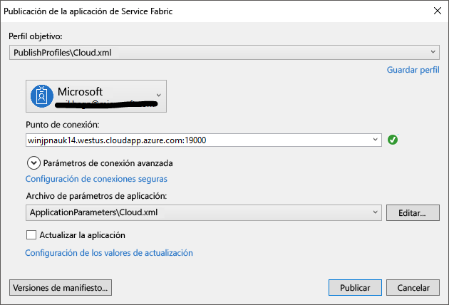

# <a name="deploy-an-application-to-a-party-cluster-in-azure"></a><span data-ttu-id="efb88-103">Implementación de una aplicación en un clúster de entidad en Azure</span><span class="sxs-lookup"><span data-stu-id="efb88-103">Deploy an application to a Party Cluster in Azure</span></span>
<span data-ttu-id="efb88-104">Este tutorial es la segunda parte de una serie y le muestra cómo implementar una aplicación de Azure Service Fabric en un Party Cluster en Azure.</span><span class="sxs-lookup"><span data-stu-id="efb88-104">This tutorial is part two of a series and shows you how to deploy an Azure Service Fabric application to a Party Cluster in Azure.</span></span>

<span data-ttu-id="efb88-105">En la segunda parte de la serie de tutoriales, se aprende a:</span><span class="sxs-lookup"><span data-stu-id="efb88-105">In part two of the tutorial series, you learn how to:</span></span>
> [!div class="checklist"]
> * <span data-ttu-id="efb88-106">Implementar una aplicación en un clúster remoto con Visual Studio</span><span class="sxs-lookup"><span data-stu-id="efb88-106">Deploy an application to a remote cluster using Visual Studio</span></span>
> * <span data-ttu-id="efb88-107">Eliminar una aplicación de un clúster mediante de Service Fabric Explorer</span><span class="sxs-lookup"><span data-stu-id="efb88-107">Remove an application from a cluster using Service Fabric Explorer</span></span>

<span data-ttu-id="efb88-108">En esta serie de tutoriales, se aprende a:</span><span class="sxs-lookup"><span data-stu-id="efb88-108">In this tutorial series you learn how to:</span></span>
> [!div class="checklist"]
> * [<span data-ttu-id="efb88-109">Crear una aplicación de .NET Service Fabric</span><span class="sxs-lookup"><span data-stu-id="efb88-109">Build a .NET Service Fabric application</span></span>](service-fabric-tutorial-create-dotnet-app.md)
> * <span data-ttu-id="efb88-110">Implementar la aplicación en un clúster remoto</span><span class="sxs-lookup"><span data-stu-id="efb88-110">Deploy the application to a remote cluster</span></span>
> * [<span data-ttu-id="efb88-111">Configurar CI/CD con Visual Studio Team Services</span><span class="sxs-lookup"><span data-stu-id="efb88-111">Configure CI/CD using Visual Studio Team Services</span></span>](service-fabric-tutorial-deploy-app-with-cicd-vsts.md)

## <a name="prerequisites"></a><span data-ttu-id="efb88-112">Requisitos previos</span><span class="sxs-lookup"><span data-stu-id="efb88-112">Prerequisites</span></span>
<span data-ttu-id="efb88-113">Antes de empezar este tutorial:</span><span class="sxs-lookup"><span data-stu-id="efb88-113">Before you begin this tutorial:</span></span>
- <span data-ttu-id="efb88-114">Si no tiene ninguna suscripción a Azure, cree una [cuenta gratuita](https://azure.microsoft.com/free/?WT.mc_id=A261C142F).</span><span class="sxs-lookup"><span data-stu-id="efb88-114">If you don't have an Azure subscription, create a [free account](https://azure.microsoft.com/free/?WT.mc_id=A261C142F)</span></span>
- <span data-ttu-id="efb88-115">[Instale Visual Studio 2017](https://www.visualstudio.com/) y las cargas de trabajo de **desarrollo de Azure** y de **desarrollo web y de ASP.NET**.</span><span class="sxs-lookup"><span data-stu-id="efb88-115">[Install Visual Studio 2017](https://www.visualstudio.com/) and install the **Azure development** and **ASP.NET and web development** workloads.</span></span>
- <span data-ttu-id="efb88-116">[Instale el SDK de Service Fabric](service-fabric-get-started.md).</span><span class="sxs-lookup"><span data-stu-id="efb88-116">[Install the Service Fabric SDK](service-fabric-get-started.md)</span></span>

## <a name="download-the-voting-sample-application"></a><span data-ttu-id="efb88-117">Descarga de la aplicación de ejemplo de votación</span><span class="sxs-lookup"><span data-stu-id="efb88-117">Download the Voting sample application</span></span>
<span data-ttu-id="efb88-118">Si no compiló la aplicación de ejemplo de votación en la [primera parte de esta serie de tutoriales](service-fabric-tutorial-create-dotnet-app.md), puede descargarla.</span><span class="sxs-lookup"><span data-stu-id="efb88-118">If you did not build the Voting sample application in [part one of this tutorial series](service-fabric-tutorial-create-dotnet-app.md), you can download it.</span></span> <span data-ttu-id="efb88-119">En una ventana Comandos, ejecute el comando siguiente para clonar el repositorio de la aplicación de ejemplo en la máquina local.</span><span class="sxs-lookup"><span data-stu-id="efb88-119">In a command window, run the following command to clone the sample app repository to your local machine.</span></span>

```
git clone https://github.com/Azure-Samples/service-fabric-dotnet-quickstart
```

## <a name="set-up-a-party-cluster"></a><span data-ttu-id="efb88-120">Configuración de un clúster de entidad</span><span class="sxs-lookup"><span data-stu-id="efb88-120">Set up a Party Cluster</span></span>
<span data-ttu-id="efb88-121">Los clústeres de entidad son clústeres de Service Fabric gratuitos y de duración limitada, hospedados en Azure y ejecutados por el equipo de Service Fabric, donde cualquier usuario puede implementar aplicaciones y obtener información sobre la plataforma.</span><span class="sxs-lookup"><span data-stu-id="efb88-121">Party clusters are free, limited-time Service Fabric clusters hosted on Azure and run by the Service Fabric team where anyone can deploy applications and learn about the platform.</span></span> <span data-ttu-id="efb88-122">¡Gratis!</span><span class="sxs-lookup"><span data-stu-id="efb88-122">For free!</span></span>

<span data-ttu-id="efb88-123">Para obtener acceso a un clúster de entidad, vaya al sitio http://aka.ms/tryservicefabric y siga las instrucciones para acceder a un clúster.</span><span class="sxs-lookup"><span data-stu-id="efb88-123">To get access to a Party Cluster, browse to this site: http://aka.ms/tryservicefabric and follow the instructions to get access to a cluster.</span></span> <span data-ttu-id="efb88-124">Necesita una cuenta de Facebook o GitHub para acceder a un clúster de entidad.</span><span class="sxs-lookup"><span data-stu-id="efb88-124">You need a Facebook or GitHub account to get access to a Party Cluster.</span></span>

> [!NOTE]
> <span data-ttu-id="efb88-125">Los clústeres de entidades no están protegidos, por lo que las aplicaciones y los datos que coloque en ellos los pueden ver otros usuarios.</span><span class="sxs-lookup"><span data-stu-id="efb88-125">Party clusters are not secured, so your applications and any data you put in them may be visible to others.</span></span> <span data-ttu-id="efb88-126">No implemente nada que no desea que vean los demás usuarios.</span><span class="sxs-lookup"><span data-stu-id="efb88-126">Don't deploy anything you don't want others to see.</span></span> <span data-ttu-id="efb88-127">Asegúrese de leer nuestros términos de uso para conocer todos los detalles.</span><span class="sxs-lookup"><span data-stu-id="efb88-127">Be sure to read over our Terms of Use for all the details.</span></span>

## <a name="configure-the-listening-port"></a><span data-ttu-id="efb88-128">Configuración del puerto de escucha</span><span class="sxs-lookup"><span data-stu-id="efb88-128">Configure the listening port</span></span>
<span data-ttu-id="efb88-129">Cuando se crea el servicio front-end VotingWeb, Visual Studio selecciona aleatoriamente un puerto en el que el servicio realiza la escucha.</span><span class="sxs-lookup"><span data-stu-id="efb88-129">When the VotingWeb front-end service is created, Visual Studio randomly selects a port for the service to listen on.</span></span>  <span data-ttu-id="efb88-130">Dado que el servicio VotingWeb actúa como front-end para esta aplicación y acepta tráfico externo, queremos enlazar dicho servicio a un puerto fijo y conocido.</span><span class="sxs-lookup"><span data-stu-id="efb88-130">The VotingWeb service acts as the front-end for this application and accepts external traffic, so let's bind that service to a fixed and well-know port.</span></span> <span data-ttu-id="efb88-131">En el Explorador de soluciones, abra *VotingWeb/PackageRoot/ServiceManifest.xml*.</span><span class="sxs-lookup"><span data-stu-id="efb88-131">In Solution Explorer, open  *VotingWeb/PackageRoot/ServiceManifest.xml*.</span></span>  <span data-ttu-id="efb88-132">Busque el recurso **Endpoint** en la sección de **recursos** y cambie el valor del **puerto** a 80.</span><span class="sxs-lookup"><span data-stu-id="efb88-132">Find the **Endpoint** resource in the **Resources** section and change the **Port** value to 80.</span></span>

```xml
<Resources>
    <Endpoints>
      <!-- This endpoint is used by the communication listener to obtain the port on which to 
           listen. Please note that if your service is partitioned, this port is shared with 
           replicas of different partitions that are placed in your code. -->
      <Endpoint Protocol="http" Name="ServiceEndpoint" Type="Input" Port="80" />
    </Endpoints>
  </Resources>
```

<span data-ttu-id="efb88-133">Actualice también el valor de la propiedad de dirección URL de la aplicación en el proyecto Voting para que un explorador web se abra en el puerto correcto al depurar mediante "F5".</span><span class="sxs-lookup"><span data-stu-id="efb88-133">Also update the Application URL property value in the Voting project so a web browser opens to the correct port when you debug using 'F5'.</span></span>  <span data-ttu-id="efb88-134">En el Explorador de soluciones, seleccione el proyecto **Voting** y actualice la propiedad **dirección URL de la aplicación**.</span><span class="sxs-lookup"><span data-stu-id="efb88-134">In Solution Explorer, select the **Voting** project and update the **Application URL** property.</span></span>


## <a name="deploy-the-app-to-the-azure"></a><span data-ttu-id="efb88-136">Implementación de la aplicación en Azure</span><span class="sxs-lookup"><span data-stu-id="efb88-136">Deploy the app to the Azure</span></span>
<span data-ttu-id="efb88-137">Ahora que la aplicación está lista, puede implementarla en un clúster de entidad directamente desde Visual Studio.</span><span class="sxs-lookup"><span data-stu-id="efb88-137">Now that the application is ready, you can deploy it to the Party Cluster direct from Visual Studio.</span></span>

1. <span data-ttu-id="efb88-138">Haga clic con el botón derecho en el proyecto **Voting** en el Explorador de soluciones y seleccione **Publicar**.</span><span class="sxs-lookup"><span data-stu-id="efb88-138">Right-click **Voting** in the Solution Explorer and choose **Publish**.</span></span>

    

2. <span data-ttu-id="efb88-140">Escriba el punto de conexión del clúster de entidad en el campo **Punto de conexión** y haga clic en **Publicar**.</span><span class="sxs-lookup"><span data-stu-id="efb88-140">Type in the Connection Endpoint of the Party Cluster in the **Connection Endpoint** field and click **Publish**.</span></span>

    <span data-ttu-id="efb88-141">Cuando la publicación haya finalizado, debería poder enviar una solicitud a la aplicación a través de un explorador.</span><span class="sxs-lookup"><span data-stu-id="efb88-141">Once the publish has finished, you should be able to send a request to the application via a browser.</span></span>

3. <span data-ttu-id="efb88-142">Abra su explorador preferido, escriba la dirección del clúster (punto de conexión sin la información de puerto; por ejemplo, win1kw5649s.westus.cloudapp.azure.com).</span><span class="sxs-lookup"><span data-stu-id="efb88-142">Open you preferred browser and type in the cluster address (the connection endpoint without the port information - for example, win1kw5649s.westus.cloudapp.azure.com).</span></span>

    <span data-ttu-id="efb88-143">Ahora debería ver el mismo resultado que vio cuando se ejecuta la aplicación localmente.</span><span class="sxs-lookup"><span data-stu-id="efb88-143">You should now see the same result as you saw when running the application locally.</span></span>

    

## <a name="remove-the-application-from-a-cluster-using-service-fabric-explorer"></a><span data-ttu-id="efb88-145">Eliminación de la aplicación de un clúster mediante Service Fabric Explorer</span><span class="sxs-lookup"><span data-stu-id="efb88-145">Remove the application from a cluster using Service Fabric Explorer</span></span>
<span data-ttu-id="efb88-146">Service Fabric Explorer es una interfaz gráfica de usuario para explorar y administrar aplicaciones en un clúster de Service Fabric.</span><span class="sxs-lookup"><span data-stu-id="efb88-146">Service Fabric Explorer is a graphical user interface to explore and manage applications in a Service Fabric cluster.</span></span>

<span data-ttu-id="efb88-147">Para quitar la aplicación del clúster de entidad:</span><span class="sxs-lookup"><span data-stu-id="efb88-147">To remove the application from the Party Cluster:</span></span>

1. <span data-ttu-id="efb88-148">Vaya a Service Fabric Explorer mediante el vínculo que proporciona la página de suscripción del clúster de entidad.</span><span class="sxs-lookup"><span data-stu-id="efb88-148">Browse to the Service Fabric Explorer, using the link provided by the Party Cluster sign-up page.</span></span> <span data-ttu-id="efb88-149">Por ejemplo, http://win1kw5649s.westus.cloudapp.azure.com:19080/Explorer/index.html.</span><span class="sxs-lookup"><span data-stu-id="efb88-149">For example, http://win1kw5649s.westus.cloudapp.azure.com:19080/Explorer/index.html.</span></span>

2. <span data-ttu-id="efb88-150">En Service Fabric Explorer, navegue hasta el nodo **fabric://Voting** en la vista de árbol del lado izquierdo.</span><span class="sxs-lookup"><span data-stu-id="efb88-150">In Service Fabric Explorer, navigate to the **fabric://Voting** node in the treeview on the left-hand side.</span></span>

3. <span data-ttu-id="efb88-151">Haga clic en el botón **Acción** en el recuadro **Essentials** de la derecha y elija **Eliminar aplicación**.</span><span class="sxs-lookup"><span data-stu-id="efb88-151">Click the **Action** button in the right-hand **Essentials** pane, and choose **Delete Application**.</span></span> <span data-ttu-id="efb88-152">Confirme la eliminación de la instancia de aplicación, lo que eliminará la instancia de la aplicación que se ejecuta en el clúster.</span><span class="sxs-lookup"><span data-stu-id="efb88-152">Confirm deleting the application instance, which removes the instance of our application running in the cluster.</span></span>


## <a name="remove-the-application-type-from-a-cluster-using-service-fabric-explorer"></a><span data-ttu-id="efb88-154">Eliminación del tipo de aplicación de un clúster mediante Service Fabric Explorer</span><span class="sxs-lookup"><span data-stu-id="efb88-154">Remove the application type from a cluster using Service Fabric Explorer</span></span>
<span data-ttu-id="efb88-155">Las aplicaciones se implementan como tipos de aplicaciones en un clúster de Service Fabric, lo que permite tener varias instancias y versiones de la aplicación ejecutándose dentro del clúster.</span><span class="sxs-lookup"><span data-stu-id="efb88-155">Applications are deployed as application types in a Service Fabric cluster, which enables you to have multiple instances and versions of the application running within the cluster.</span></span> <span data-ttu-id="efb88-156">Una vez quitada la instancia en ejecución de nuestra aplicación, también podemos quitar el tipo para completar la limpieza de la implementación.</span><span class="sxs-lookup"><span data-stu-id="efb88-156">After having removed the running instance of our application, we can also remove the type, to complete the cleanup of the deployment.</span></span>

<span data-ttu-id="efb88-157">Para más información sobre el modelo de aplicación de Service Fabric, consulte [Modelar una aplicación en Service Fabric](service-fabric-application-model.md).</span><span class="sxs-lookup"><span data-stu-id="efb88-157">For more information about the application model in Service Fabric, see [Model an application in Service Fabric](service-fabric-application-model.md).</span></span>

1. <span data-ttu-id="efb88-158">Navegue hasta el nodo **VotingType** en la vista de árbol.</span><span class="sxs-lookup"><span data-stu-id="efb88-158">Navigate to the **VotingType** node in the treeview.</span></span>

2. <span data-ttu-id="efb88-159">Haga clic en el botón **Acción** en el recuadro **Essentials** de la derecha y elija **Deshacer aprovisionamiento del tipo**.</span><span class="sxs-lookup"><span data-stu-id="efb88-159">Click the **Action** button in the right-hand **Essentials** pane, and choose **Unprovision Type**.</span></span> <span data-ttu-id="efb88-160">Confirme la anulación del aprovisionamiento del tipo de aplicación.</span><span class="sxs-lookup"><span data-stu-id="efb88-160">Confirm unprovisioning the application type.</span></span>


<span data-ttu-id="efb88-162">De este modo se finaliza el tutorial.</span><span class="sxs-lookup"><span data-stu-id="efb88-162">This concludes the tutorial.</span></span>

## <a name="next-steps"></a><span data-ttu-id="efb88-163">Pasos siguientes</span><span class="sxs-lookup"><span data-stu-id="efb88-163">Next steps</span></span>
<span data-ttu-id="efb88-164">En este tutorial, ha aprendido cómo:</span><span class="sxs-lookup"><span data-stu-id="efb88-164">In this tutorial, you learned how to:</span></span>

> [!div class="checklist"]
> * <span data-ttu-id="efb88-165">Implementar una aplicación en un clúster remoto con Visual Studio</span><span class="sxs-lookup"><span data-stu-id="efb88-165">Deploy an application to a remote cluster using Visual Studio</span></span>
> * <span data-ttu-id="efb88-166">Eliminar una aplicación de un clúster mediante de Service Fabric Explorer</span><span class="sxs-lookup"><span data-stu-id="efb88-166">Remove an application from a cluster using Service Fabric Explorer</span></span>

<span data-ttu-id="efb88-167">Avanzar hasta el siguiente tutorial:</span><span class="sxs-lookup"><span data-stu-id="efb88-167">Advance to the next tutorial:</span></span>
> [!div class="nextstepaction"]
> [<span data-ttu-id="efb88-168">Configurar la integración continua con Visual Studio Team Services</span><span class="sxs-lookup"><span data-stu-id="efb88-168">Set up continuous integration using Visual Studio Team Services</span></span>](service-fabric-tutorial-deploy-app-with-cicd-vsts.md)