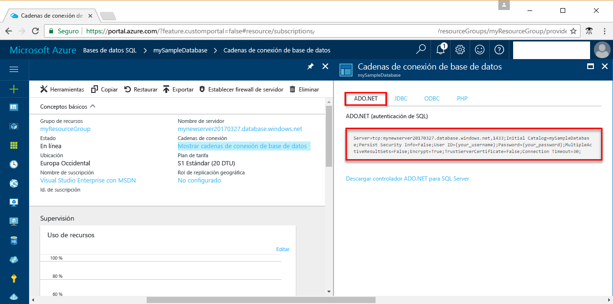

# <a name="use-net-core-c-to-query-an-azure-sql-database"></a><span data-ttu-id="2a8f3-103">Uso de .NET Core (C#) para consultar una instancia de Azure SQL Database</span><span class="sxs-lookup"><span data-stu-id="2a8f3-103">Use .NET Core (C#) to query an Azure SQL database</span></span>

<span data-ttu-id="2a8f3-104">Este tutorial de introducción muestra cómo usar [.NET Core](https://www.microsoft.com/net/) en Windows, Linux o macOS para crear un programa de C# que se conecta a una instancia de Azure SQL Database y utiliza instrucciones Transact-SQL para consultar los datos.</span><span class="sxs-lookup"><span data-stu-id="2a8f3-104">This quick start tutorial demonstrates how to use [.NET Core](https://www.microsoft.com/net/) on Windows/Linux/macOS to create a C# program to connect to an Azure SQL database and use Transact-SQL statements to query data.</span></span>

## <a name="prerequisites"></a><span data-ttu-id="2a8f3-105">Requisitos previos</span><span class="sxs-lookup"><span data-stu-id="2a8f3-105">Prerequisites</span></span>

<span data-ttu-id="2a8f3-106">Para completar este tutorial, asegúrese de que dispone de lo siguiente:</span><span class="sxs-lookup"><span data-stu-id="2a8f3-106">To complete this quick start tutorial, make sure you have the following:</span></span>

- <span data-ttu-id="2a8f3-107">Una base de datos SQL de Azure.</span><span class="sxs-lookup"><span data-stu-id="2a8f3-107">An Azure SQL database.</span></span> <span data-ttu-id="2a8f3-108">En esta guía de inicio rápido se utilizan como punto de partida los recursos creados en una de las siguientes guías:</span><span class="sxs-lookup"><span data-stu-id="2a8f3-108">This quick start uses the resources created in one of these quick starts:</span></span> 

   - [<span data-ttu-id="2a8f3-109">Creación de la base de datos: Azure Portal</span><span class="sxs-lookup"><span data-stu-id="2a8f3-109">Create DB - Portal</span></span>](sql-database-get-started-portal.md)
   - [<span data-ttu-id="2a8f3-110">Creación de la base de datos: CLI</span><span class="sxs-lookup"><span data-stu-id="2a8f3-110">Create DB - CLI</span></span>](sql-database-get-started-cli.md)
   - [<span data-ttu-id="2a8f3-111">Creación de la base de datos: PowerShell</span><span class="sxs-lookup"><span data-stu-id="2a8f3-111">Create DB - PowerShell</span></span>](sql-database-get-started-powershell.md)

- <span data-ttu-id="2a8f3-112">Una [regla de firewall de nivel de servidor](sql-database-get-started-portal.md#create-a-server-level-firewall-rule) para la dirección IP pública del equipo que usa para seguir este tutorial.</span><span class="sxs-lookup"><span data-stu-id="2a8f3-112">A [server-level firewall rule](sql-database-get-started-portal.md#create-a-server-level-firewall-rule) for the public IP address of the computer you use for this quick start tutorial.</span></span>
- <span data-ttu-id="2a8f3-113">Ha instalado [.NET Core para su sistema operativo](https://www.microsoft.com/net/core).</span><span class="sxs-lookup"><span data-stu-id="2a8f3-113">You have installed [.NET Core for your operating system](https://www.microsoft.com/net/core).</span></span> 

## <a name="sql-server-connection-information"></a><span data-ttu-id="2a8f3-114">Información de conexión de SQL server</span><span class="sxs-lookup"><span data-stu-id="2a8f3-114">SQL server connection information</span></span>

<span data-ttu-id="2a8f3-115">Obtención de la información de conexión necesaria para conectarse a Azure SQL Database.</span><span class="sxs-lookup"><span data-stu-id="2a8f3-115">Get the connection information needed to connect to the Azure SQL database.</span></span> <span data-ttu-id="2a8f3-116">En los procedimientos siguientes, necesitará el nombre completo del servidor, el nombre de la base de datos y la información de inicio de sesión.</span><span class="sxs-lookup"><span data-stu-id="2a8f3-116">You will need the fully qualified server name, database name, and login information in the next procedures.</span></span>

1. <span data-ttu-id="2a8f3-117">Inicie sesión en [Azure Portal](https://portal.azure.com/).</span><span class="sxs-lookup"><span data-stu-id="2a8f3-117">Log in to the [Azure portal](https://portal.azure.com/).</span></span>
2. <span data-ttu-id="2a8f3-118">Seleccione **Bases de datos SQL** en el menú de la izquierda y haga clic en la base de datos en la página **Bases de datos SQL**.</span><span class="sxs-lookup"><span data-stu-id="2a8f3-118">Select **SQL Databases** from the left-hand menu, and click your database on the **SQL databases** page.</span></span> 
3. <span data-ttu-id="2a8f3-119">En la página **Introducción** de la base de datos, revise el nombre completo del servidor tal como se muestra en la siguiente imagen.</span><span class="sxs-lookup"><span data-stu-id="2a8f3-119">On the **Overview** page for your database, review the fully qualified server name as shown in the following image.</span></span> <span data-ttu-id="2a8f3-120">Mantenga el puntero sobre el nombre del servidor hasta que aparezca la opción **Haga clic para copiar**.</span><span class="sxs-lookup"><span data-stu-id="2a8f3-120">You can hover over the server name to bring up the **Click to copy** option.</span></span> 

    

4. <span data-ttu-id="2a8f3-122">Si ha olvidado la información de inicio de sesión para el servidor de Azure SQL Database, vaya a la página del servidor de SQL Database para ver el nombre del administrador del servidor.</span><span class="sxs-lookup"><span data-stu-id="2a8f3-122">If you forget your Azure SQL Database server login information, navigate to the SQL Database server page to view the server admin name.</span></span> <span data-ttu-id="2a8f3-123">Si es necesario, restablezca la contraseña.</span><span class="sxs-lookup"><span data-stu-id="2a8f3-123">You can reset the password if necessary.</span></span>

5. <span data-ttu-id="2a8f3-124">Haga clic en **Mostrar las cadenas de conexión de la base de datos**.</span><span class="sxs-lookup"><span data-stu-id="2a8f3-124">Click **Show database connection strings**.</span></span>

6. <span data-ttu-id="2a8f3-125">Revise la cadena de conexión completa de **ADO.NET**.</span><span class="sxs-lookup"><span data-stu-id="2a8f3-125">Review the complete **ADO.NET** connection string.</span></span>

    

> [!IMPORTANT]
> <span data-ttu-id="2a8f3-127">Debe tener una regla de firewall activa para la dirección IP pública del equipo en el que sigue este tutorial.</span><span class="sxs-lookup"><span data-stu-id="2a8f3-127">You must have a firewall rule in place for the public IP address of the computer on which you perform this tutorial.</span></span> <span data-ttu-id="2a8f3-128">Si se encuentra en un equipo diferente o tiene una dirección IP pública diferente, cree una [regla de firewall de nivel de servidor mediante Azure Portal](sql-database-get-started-portal.md#create-a-server-level-firewall-rule).</span><span class="sxs-lookup"><span data-stu-id="2a8f3-128">If you are on a different computer or have a different public IP address, create a [server-level firewall rule using the Azure portal](sql-database-get-started-portal.md#create-a-server-level-firewall-rule).</span></span> 
>
  
## <a name="create-a-new-net-project"></a><span data-ttu-id="2a8f3-129">Creación de un nuevo proyecto de .NET</span><span class="sxs-lookup"><span data-stu-id="2a8f3-129">Create a new .NET project</span></span>

1. <span data-ttu-id="2a8f3-130">Abra un símbolo del sistema y cree una carpeta denominada *sqltest*.</span><span class="sxs-lookup"><span data-stu-id="2a8f3-130">Open a command prompt and create a folder named *sqltest*.</span></span> <span data-ttu-id="2a8f3-131">Navegue hasta la carpeta que ha creado y ejecute el siguiente comando:</span><span class="sxs-lookup"><span data-stu-id="2a8f3-131">Navigate to the folder you created and run the following command:</span></span>

    ```
    dotnet new console
    ```

2. <span data-ttu-id="2a8f3-132">Abra ***sqltest.csproj*** con el editor de texto y agregue System.Data.SqlClient como una dependencia con el código siguiente:</span><span class="sxs-lookup"><span data-stu-id="2a8f3-132">Open ***sqltest.csproj*** with your favorite text editor and add System.Data.SqlClient as a dependency using the following code:</span></span>

    ```xml
    <ItemGroup>
        <PackageReference Include="System.Data.SqlClient" Version="4.3.0" />
    </ItemGroup>
    ```

## <a name="insert-code-to-query-sql-database"></a><span data-ttu-id="2a8f3-133">Inserción de código para consultar la base de datos SQL</span><span class="sxs-lookup"><span data-stu-id="2a8f3-133">Insert code to query SQL database</span></span>

1. <span data-ttu-id="2a8f3-134">En el entorno de desarrollo o en el editor de texto, abra **Program.cs**</span><span class="sxs-lookup"><span data-stu-id="2a8f3-134">In your development environment or favorite text editor open **Program.cs**</span></span>

2. <span data-ttu-id="2a8f3-135">Reemplace el contenido con el código siguiente y agregue los valores adecuados para el servidor, la base de datos, el usuario y la contraseña.</span><span class="sxs-lookup"><span data-stu-id="2a8f3-135">Replace the contents with the following code and add the appropriate values for your server, database, user, and password.</span></span>

```csharp
using System;
using System.Data.SqlClient;
using System.Text;

namespace sqltest
{
    class Program
    {
        static void Main(string[] args)
        {
            try 
            { 
                SqlConnectionStringBuilder builder = new SqlConnectionStringBuilder();
                builder.DataSource = "your_server.database.windows.net"; 
                builder.UserID = "your_user";            
                builder.Password = "your_password";     
                builder.InitialCatalog = "your_database";

                using (SqlConnection connection = new SqlConnection(builder.ConnectionString))
                {
                    Console.WriteLine("\nQuery data example:");
                    Console.WriteLine("=========================================\n");
                    
                    connection.Open();       
                    StringBuilder sb = new StringBuilder();
                    sb.Append("SELECT TOP 20 pc.Name as CategoryName, p.name as ProductName ");
                    sb.Append("FROM [SalesLT].[ProductCategory] pc ");
                    sb.Append("JOIN [SalesLT].[Product] p ");
                    sb.Append("ON pc.productcategoryid = p.productcategoryid;");
                    String sql = sb.ToString();

                    using (SqlCommand command = new SqlCommand(sql, connection))
                    {
                        using (SqlDataReader reader = command.ExecuteReader())
                        {
                            while (reader.Read())
                            {
                                Console.WriteLine("{0} {1}", reader.GetString(0), reader.GetString(1));
                            }
                        }
                    }                    
                }
            }
            catch (SqlException e)
            {
                Console.WriteLine(e.ToString());
            }
            Console.ReadLine();
        }
    }
}
```

## <a name="run-the-code"></a><span data-ttu-id="2a8f3-136">Ejecución del código</span><span class="sxs-lookup"><span data-stu-id="2a8f3-136">Run the code</span></span>

1. <span data-ttu-id="2a8f3-137">En el símbolo del sistema, ejecute los siguientes comandos:</span><span class="sxs-lookup"><span data-stu-id="2a8f3-137">At the command prompt, run the following commands:</span></span>

   ```csharp
   dotnet restore
   dotnet run
   ```

2. <span data-ttu-id="2a8f3-138">Compruebe que se han devuelto las primeras 20 filas y, a continuación, cierre la ventana de la aplicación.</span><span class="sxs-lookup"><span data-stu-id="2a8f3-138">Verify that the top 20 rows are returned and then close the application window.</span></span>


## <a name="next-steps"></a><span data-ttu-id="2a8f3-139">Pasos siguientes</span><span class="sxs-lookup"><span data-stu-id="2a8f3-139">Next steps</span></span>

- <span data-ttu-id="2a8f3-140">[Introducción a .NET Core en Windows, Linux y macOS mediante la línea de comandos](/dotnet/core/tutorials/using-with-xplat-cli).</span><span class="sxs-lookup"><span data-stu-id="2a8f3-140">[Getting started with .NET Core on Windows/Linux/macOS using the command line](/dotnet/core/tutorials/using-with-xplat-cli).</span></span>
- <span data-ttu-id="2a8f3-141">Obtenga información acerca de cómo [conectarse y consultar una base de datos SQL de Azure mediante .NET Framework y Visual Studio](sql-database-connect-query-dotnet-visual-studio.md).</span><span class="sxs-lookup"><span data-stu-id="2a8f3-141">Learn how to [connect and query an Azure SQL database using the .NET framework and Visual Studio](sql-database-connect-query-dotnet-visual-studio.md).</span></span>  
- <span data-ttu-id="2a8f3-142">Obtenga información acerca de cómo [diseñar la primera base de datos SQL de Azure con SSMS](sql-database-design-first-database.md) o [diseñar la primera base de datos SQL de Azure mediante .NET](sql-database-design-first-database-csharp.md).</span><span class="sxs-lookup"><span data-stu-id="2a8f3-142">Learn how to [Design your first Azure SQL database using SSMS](sql-database-design-first-database.md) or [Design your first Azure SQL database using .NET](sql-database-design-first-database-csharp.md).</span></span>
- <span data-ttu-id="2a8f3-143">Para más información acerca de. NET, consulte la [Documentación de .NET](https://docs.microsoft.com/dotnet/).</span><span class="sxs-lookup"><span data-stu-id="2a8f3-143">For more information about .NET, see [.NET documentation](https://docs.microsoft.com/dotnet/).</span></span>
