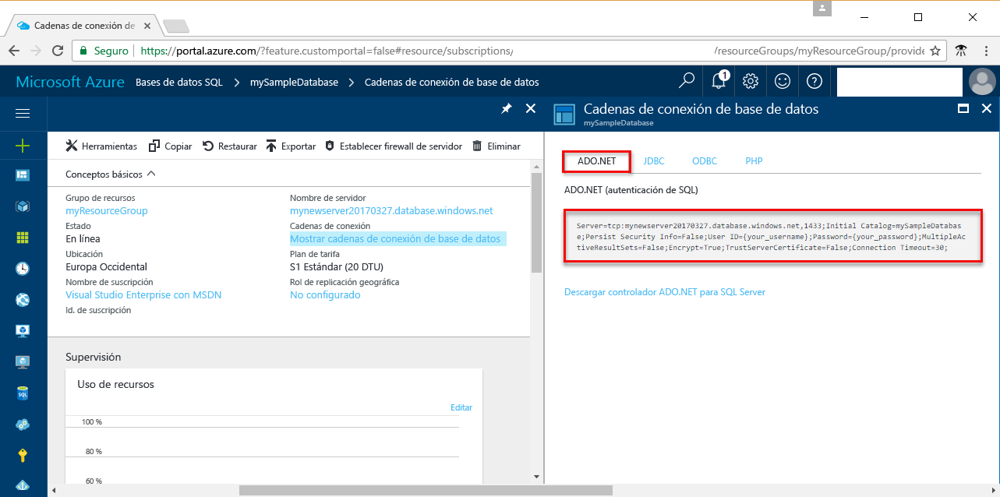

# <a name="use-net-c-with-visual-studio-tooconnect-and-query-an-azure-sql-database"></a>Usar .NET (C#) con Visual Studio tooconnect y consultar una base de datos de SQL Azure

Este tutorial de inicio rápido se muestra cómo hello toouse [.NET framework](https://www.microsoft.com/net/) toocreate C# del programa con la base de datos de SQL Azure de Visual Studio tooconnect tooan y usar datos de tooquery de instrucciones de Transact-SQL.

## <a name="prerequisites"></a>Requisitos previos

toocomplete rápida de este tutorial de inicio, asegúrese de que tiene Hola siguientes:

- Una base de datos SQL de Azure. Este inicio rápido utiliza recursos de hello creados mediante uno de estos tutoriales: 

   - [Creación de la base de datos: Azure Portal](sql-database-get-started-portal.md)
   - [Creación de la base de datos: CLI](sql-database-get-started-cli.md)
   - [Creación de la base de datos: PowerShell](sql-database-get-started-powershell.md)

- A [regla de firewall de nivel de servidor](sql-database-get-started-portal.md#create-a-server-level-firewall-rule) para la dirección IP pública de hello del equipo de Hola se usa para este tutorial de inicio rápido.
- Una instalación de [Visual Studio Community 2017, Visual Studio Professional 2017 o Visual Studio Enterprise 2017](https://www.visualstudio.com/downloads/).

## <a name="sql-server-connection-information"></a>Información de conexión de SQL server

Obtener base de datos SQL de Azure de toohello de tooconnect de hello conexión información necesaria. Necesitará el nombre del servidor de acceso completa de hello, nombre de base de datos y la información de inicio de sesión en los procedimientos siguientes de Hola.

1. Inicie sesión en toohello [portal de Azure](https://portal.azure.com/).
2. Seleccione **bases de datos SQL** desde el menú de la izquierda, hello y haga clic en la base de datos en hello **bases de datos SQL** página. 
3. En hello **Introducción** página de la base de datos, revisión Hola servidor nombre completo como se muestra en hello después de la imagen. Puede mantener el mouse sobre toobring de nombre de servidor hello seguridad hello **haga clic en toocopy** opción. 

    

4. Si olvida la información de inicio de sesión del servidor de base de datos de SQL Azure, navegue toohello base de datos de SQL server página tooview Hola administrador nombre del servidor. Puede restablecer la contraseña de hello si es necesario.

5. Haga clic en **Mostrar las cadenas de conexión de la base de datos**.

6. Hola de revisión completa **ADO.NET** cadena de conexión.

    

> [!IMPORTANT]
> Debe tener una regla de firewall en su lugar para la dirección IP pública de hello del equipo de hello en el que realizar este tutorial. Si se encuentran en un equipo diferente o tiene una dirección IP pública diferentes, cree un [regla de firewall de nivel de servidor mediante Hola portal de Azure](sql-database-get-started-portal.md#create-a-server-level-firewall-rule). 
>
  
## <a name="create-a-new-visual-studio-project"></a>Creación de un nuevo proyecto de Visual Studio

1. En Visual Studio, seleccione **Archivo**, **Nuevo**, **Proyecto**. 
2. Hola **nuevo proyecto** cuadro de diálogo y expanda **Visual C#**.
3. Seleccione **aplicación de consola** y escriba *sqltest* como nombre de proyecto de Hola.
4. Haga clic en **Aceptar** toocreate y Hola abrir nuevo proyecto en Visual Studio
4. En el Explorador de soluciones, haga clic con el botón derecho en **sqltest** y haga clic en **Administrar paquetes de NuGet**. 
5. En hello **examinar**, busque ```System.Data.SqlClient``` y, cuando se encuentra, selecciónelo.
6. Hola **System.Data.SqlClient** página, haga clic en **instalar**.
7. Cuando se haya completado la instalación de hello, revise los cambios de hello y, a continuación, haga clic en **Aceptar** tooclose hello **vista previa** ventana. 
8. Si aparece una ventana de **Aceptación de licencia**, haga clic en **Acepto**.

## <a name="insert-code-tooquery-sql-database"></a>Insertar la base de datos SQL de tooquery de código
1. Cambiar demasiado (o abra si es necesario) **Program.cs**

2. Reemplace el contenido de Hola de **Program.cs** con hello siguiente de código y agregue los valores adecuados de hello para el servidor, la base de datos, el usuario y la contraseña.

```csharp
using System;
using System.Data.SqlClient;
using System.Text;

namespace sqltest
{
    class Program
    {
        static void Main(string[] args)
        {
            try 
            { 
                SqlConnectionStringBuilder builder = new SqlConnectionStringBuilder();
                builder.DataSource = "your_server.database.windows.net"; 
                builder.UserID = "your_user";            
                builder.Password = "your_password";     
                builder.InitialCatalog = "your_database";

                using (SqlConnection connection = new SqlConnection(builder.ConnectionString))
                {
                    Console.WriteLine("\nQuery data example:");
                    Console.WriteLine("=========================================\n");
                    
                    connection.Open();       
                    StringBuilder sb = new StringBuilder();
                    sb.Append("SELECT TOP 20 pc.Name as CategoryName, p.name as ProductName ");
                    sb.Append("FROM [SalesLT].[ProductCategory] pc ");
                    sb.Append("JOIN [SalesLT].[Product] p ");
                    sb.Append("ON pc.productcategoryid = p.productcategoryid;");
                    String sql = sb.ToString();

                    using (SqlCommand command = new SqlCommand(sql, connection))
                    {
                        using (SqlDataReader reader = command.ExecuteReader())
                        {
                            while (reader.Read())
                            {
                                Console.WriteLine("{0} {1}", reader.GetString(0), reader.GetString(1));
                            }
                        }
                    }                    
                }
            }
            catch (SqlException e)
            {
                Console.WriteLine(e.ToString());
            }
            Console.ReadLine();
        }
    }
}
```

## <a name="run-hello-code"></a>Ejecutar código de hello

1. Presione **F5** aplicación de hello toorun.
2. Compruebe que 20 filas de top Hola se devuelven y, a continuación, cierre la ventana de la aplicación hello.

## <a name="next-steps"></a>Pasos siguientes

- Obtenga información acerca de cómo demasiado[conectarse y consultar una base de datos de SQL Azure mediante .NET core](sql-database-connect-query-dotnet-core.md) en Windows/Linux/macOS.  
- Obtenga información acerca de [Introducción a .NET Core en Windows/Linux/macOS mediante la línea de comandos de hello](/dotnet/core/tutorials/using-with-xplat-cli).
- Obtenga información acerca de cómo demasiado[diseñar la primera base de datos de SQL Azure con SSMS](sql-database-design-first-database.md) o [diseñar la primera base de datos de SQL Azure mediante .NET](sql-database-design-first-database-csharp.md).
- Para más información acerca de. NET, consulte la [Documentación de .NET](https://docs.microsoft.com/dotnet/).
