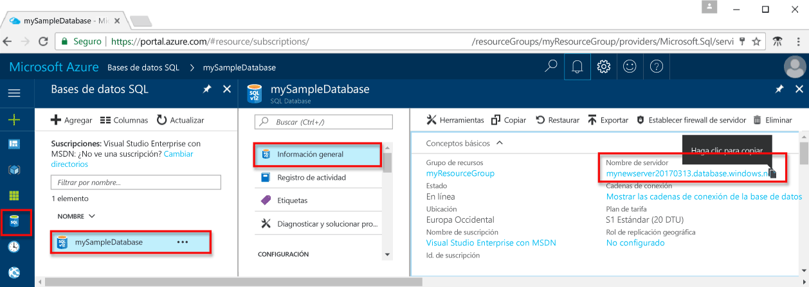

# <a name="use-nodejs-to-query-an-azure-sql-database"></a><span data-ttu-id="bf98f-103">Uso de Node.js para consultar una base de datos SQL de Azure</span><span class="sxs-lookup"><span data-stu-id="bf98f-103">Use Node.js to query an Azure SQL database</span></span>

<span data-ttu-id="bf98f-104">Este tutorial de introducción muestra cómo usar [Node.js](https://nodejs.org/en/) para crear un programa que se conecta a una base de datos SQL de Azure y utiliza instrucciones Transact-SQL para consultar los datos.</span><span class="sxs-lookup"><span data-stu-id="bf98f-104">This quick start tutorial demonstrates how to use [Node.js](https://nodejs.org/en/) to create a program to connect to an Azure SQL database and use Transact-SQL statements to query data.</span></span>

## <a name="prerequisites"></a><span data-ttu-id="bf98f-105">Requisitos previos</span><span class="sxs-lookup"><span data-stu-id="bf98f-105">Prerequisites</span></span>

<span data-ttu-id="bf98f-106">Para completar este tutorial, asegúrese de que dispone de lo siguiente:</span><span class="sxs-lookup"><span data-stu-id="bf98f-106">To complete this quick start tutorial, make sure you have the following:</span></span>

- <span data-ttu-id="bf98f-107">Una base de datos SQL de Azure.</span><span class="sxs-lookup"><span data-stu-id="bf98f-107">An Azure SQL database.</span></span> <span data-ttu-id="bf98f-108">En esta guía de inicio rápido se utilizan como punto de partida los recursos creados en una de las siguientes guías:</span><span class="sxs-lookup"><span data-stu-id="bf98f-108">This quick start uses the resources created in one of these quick starts:</span></span> 

   - [<span data-ttu-id="bf98f-109">Creación de la base de datos: Azure Portal</span><span class="sxs-lookup"><span data-stu-id="bf98f-109">Create DB - Portal</span></span>](sql-database-get-started-portal.md)
   - [<span data-ttu-id="bf98f-110">Creación de la base de datos: CLI</span><span class="sxs-lookup"><span data-stu-id="bf98f-110">Create DB - CLI</span></span>](sql-database-get-started-cli.md)
   - [<span data-ttu-id="bf98f-111">Creación de la base de datos: PowerShell</span><span class="sxs-lookup"><span data-stu-id="bf98f-111">Create DB - PowerShell</span></span>](sql-database-get-started-powershell.md)

- <span data-ttu-id="bf98f-112">Una [regla de firewall de nivel de servidor](sql-database-get-started-portal.md#create-a-server-level-firewall-rule) para la dirección IP pública del equipo que usa para seguir este tutorial.</span><span class="sxs-lookup"><span data-stu-id="bf98f-112">A [server-level firewall rule](sql-database-get-started-portal.md#create-a-server-level-firewall-rule) for the public IP address of the computer you use for this quick start tutorial.</span></span>
- <span data-ttu-id="bf98f-113">Ha instalado Node.js y el software relacionado para el sistema operativo.</span><span class="sxs-lookup"><span data-stu-id="bf98f-113">You have installed Node.js and related software for your operating system.</span></span>
    - <span data-ttu-id="bf98f-114">**MacOS**: instalación de Homebrew y Node.js y, a continuación, instalación del controlador ODBC y SQLCMD.</span><span class="sxs-lookup"><span data-stu-id="bf98f-114">**MacOS**: Install Homebrew and Node.js, and then install the ODBC driver and SQLCMD.</span></span> <span data-ttu-id="bf98f-115">Consulte [pasos 1.2 y 1.3](https://www.microsoft.com/sql-server/developer-get-started/node/mac/).</span><span class="sxs-lookup"><span data-stu-id="bf98f-115">See [Step 1.2 and 1.3](https://www.microsoft.com/sql-server/developer-get-started/node/mac/).</span></span>
    - <span data-ttu-id="bf98f-116">**Ubuntu**: instalación de Node.js y, a continuación, instalación del controlador ODBC y SQLCMD.</span><span class="sxs-lookup"><span data-stu-id="bf98f-116">**Ubuntu**: Install Node.js, and then install the ODBC driver and SQLCMD.</span></span> <span data-ttu-id="bf98f-117">Consulte [pasos 1.2 y 1.3](https://www.microsoft.com/sql-server/developer-get-started/node/ubuntu/).</span><span class="sxs-lookup"><span data-stu-id="bf98f-117">See [Step 1.2 and 1.3](https://www.microsoft.com/sql-server/developer-get-started/node/ubuntu/) .</span></span>
    - <span data-ttu-id="bf98f-118">**Windows**: Instalación de Chocolatey y Node.js y, a continuación, instalación del controlador ODBC y SQLCMD.</span><span class="sxs-lookup"><span data-stu-id="bf98f-118">**Windows**: Install Chocolatey and Node.js, and then install the ODBC driver and SQL CMD.</span></span> <span data-ttu-id="bf98f-119">Consulte [pasos 1.2 y 1.3](https://www.microsoft.com/sql-server/developer-get-started/node/windows/).</span><span class="sxs-lookup"><span data-stu-id="bf98f-119">See [Step 1.2 and 1.3](https://www.microsoft.com/sql-server/developer-get-started/node/windows/).</span></span>

## <a name="sql-server-connection-information"></a><span data-ttu-id="bf98f-120">Información de conexión de SQL server</span><span class="sxs-lookup"><span data-stu-id="bf98f-120">SQL server connection information</span></span>

<span data-ttu-id="bf98f-121">Obtención de la información de conexión necesaria para conectarse a Azure SQL Database.</span><span class="sxs-lookup"><span data-stu-id="bf98f-121">Get the connection information needed to connect to the Azure SQL database.</span></span> <span data-ttu-id="bf98f-122">En los procedimientos siguientes, necesitará el nombre completo del servidor, el nombre de la base de datos y la información de inicio de sesión.</span><span class="sxs-lookup"><span data-stu-id="bf98f-122">You will need the fully qualified server name, database name, and login information in the next procedures.</span></span>

1. <span data-ttu-id="bf98f-123">Inicie sesión en [Azure Portal](https://portal.azure.com/).</span><span class="sxs-lookup"><span data-stu-id="bf98f-123">Log in to the [Azure portal](https://portal.azure.com/).</span></span>
2. <span data-ttu-id="bf98f-124">Seleccione **Bases de datos SQL** en el menú de la izquierda y haga clic en la base de datos en la página **Bases de datos SQL**.</span><span class="sxs-lookup"><span data-stu-id="bf98f-124">Select **SQL Databases** from the left-hand menu, and click your database on the **SQL databases** page.</span></span> 
3. <span data-ttu-id="bf98f-125">En la página **Introducción** de la base de datos, revise el nombre completo del servidor tal como se muestra en la siguiente imagen.</span><span class="sxs-lookup"><span data-stu-id="bf98f-125">On the **Overview** page for your database, review the fully qualified server name as shown in the following image.</span></span> <span data-ttu-id="bf98f-126">Mantenga el puntero sobre el nombre del servidor hasta que aparezca la opción **Haga clic para copiar**.</span><span class="sxs-lookup"><span data-stu-id="bf98f-126">You can hover over the server name to bring up the **Click to copy** option.</span></span> 

    

4. <span data-ttu-id="bf98f-128">Si ha olvidado la información de inicio de sesión para el servidor de Azure SQL Database, navegue a la página del servidor de SQL Database para ver el nombre del Administrador del servidor y, si es necesario, restablecer la contraseña.</span><span class="sxs-lookup"><span data-stu-id="bf98f-128">If you have forgotten the login information for your Azure SQL Database server, navigate to the SQL Database server page to view the server admin name and, if necessary, reset the password.</span></span>

> [!IMPORTANT]
> <span data-ttu-id="bf98f-129">Debe tener una regla de firewall activa para la dirección IP pública del equipo en el que sigue este tutorial.</span><span class="sxs-lookup"><span data-stu-id="bf98f-129">You must have a firewall rule in place for the public IP address of the computer on which you perform this tutorial.</span></span> <span data-ttu-id="bf98f-130">Si se encuentra en un equipo diferente o tiene una dirección IP pública diferente, cree una [regla de firewall de nivel de servidor mediante Azure Portal](sql-database-get-started-portal.md#create-a-server-level-firewall-rule).</span><span class="sxs-lookup"><span data-stu-id="bf98f-130">If you are on a different computer or have a different public IP address, create a [server-level firewall rule using the Azure portal](sql-database-get-started-portal.md#create-a-server-level-firewall-rule).</span></span> 

## <a name="create-a-nodejs-project"></a><span data-ttu-id="bf98f-131">Creación de un proyecto Node.js</span><span class="sxs-lookup"><span data-stu-id="bf98f-131">Create a Node.js project</span></span>

<span data-ttu-id="bf98f-132">Abra un símbolo del sistema y cree una carpeta denominada *sqltest*.</span><span class="sxs-lookup"><span data-stu-id="bf98f-132">Open a command prompt and create a folder named *sqltest*.</span></span> <span data-ttu-id="bf98f-133">Navegue hasta la carpeta que ha creado y ejecute el siguiente comando:</span><span class="sxs-lookup"><span data-stu-id="bf98f-133">Navigate to the folder you created and run the following command:</span></span>

    
    npm init -y
    npm install tedious
    npm install async
    

## <a name="insert-code-to-query-sql-database"></a><span data-ttu-id="bf98f-134">Inserción de código para consultar la base de datos SQL</span><span class="sxs-lookup"><span data-stu-id="bf98f-134">Insert code to query SQL database</span></span>

1. <span data-ttu-id="bf98f-135">En el entorno de desarrollo o en el editor de texto, cree un nuevo archivo, **sqltest.js**.</span><span class="sxs-lookup"><span data-stu-id="bf98f-135">In your development environment or favorite text editor, create a new file, **sqltest.js**.</span></span>

2. <span data-ttu-id="bf98f-136">Reemplace el contenido con el código siguiente y agregue los valores adecuados para el servidor, la base de datos, el usuario y la contraseña.</span><span class="sxs-lookup"><span data-stu-id="bf98f-136">Replace the contents with the following code and add the appropriate values for your server, database, user, and password.</span></span>

   ```js
   var Connection = require('tedious').Connection;
   var Request = require('tedious').Request;

   // Create connection to database
   var config = 
      {
        userName: 'someuser', // update me
        password: 'somepassword', // update me
        server: 'edmacasqlserver.database.windows.net', // update me
        options: 
           {
              database: 'somedb' //update me
              , encrypt: true
           }
      }
   var connection = new Connection(config);

   // Attempt to connect and execute queries if connection goes through
   connection.on('connect', function(err) 
      {
        if (err) 
          {
             console.log(err)
          }
       else
          {
              queryDatabase()
          }
      }
    );

   function queryDatabase()
      { console.log('Reading rows from the Table...');

          // Read all rows from table
        request = new Request(
             "SELECT TOP 20 pc.Name as CategoryName, p.name as ProductName FROM [SalesLT].[ProductCategory] pc JOIN [SalesLT].[Product] p ON pc.productcategoryid = p.productcategoryid",
                function(err, rowCount, rows) 
                   {
                       console.log(rowCount + ' row(s) returned');
                       process.exit();
                   }
               );
    
        request.on('row', function(columns) {
           columns.forEach(function(column) {
               console.log("%s\t%s", column.metadata.colName, column.value);
            });
                });
        connection.execSql(request);
      }
```

## <a name="run-the-code"></a><span data-ttu-id="bf98f-137">Ejecución del código</span><span class="sxs-lookup"><span data-stu-id="bf98f-137">Run the code</span></span>

1. <span data-ttu-id="bf98f-138">En el símbolo del sistema, ejecute los siguientes comandos:</span><span class="sxs-lookup"><span data-stu-id="bf98f-138">At the command prompt, run the following commands:</span></span>

   ```js
   node sqltest.js
   ```

2. <span data-ttu-id="bf98f-139">Compruebe que se han devuelto las primeras 20 filas y, a continuación, cierre la ventana de la aplicación.</span><span class="sxs-lookup"><span data-stu-id="bf98f-139">Verify that the top 20 rows are returned and then close the application window.</span></span>

## <a name="next-steps"></a><span data-ttu-id="bf98f-140">Pasos siguientes</span><span class="sxs-lookup"><span data-stu-id="bf98f-140">Next steps</span></span>

- <span data-ttu-id="bf98f-141">Consulte información sobre el [Controlador de Microsoft Node.js para SQL Server](https://docs.microsoft.com/sql/connect/node-js/node-js-driver-for-sql-server/)</span><span class="sxs-lookup"><span data-stu-id="bf98f-141">Learn about the [Microsoft Node.js Driver for SQL Server](https://docs.microsoft.com/sql/connect/node-js/node-js-driver-for-sql-server/)</span></span>
- <span data-ttu-id="bf98f-142">Obtenga información acerca de cómo [conectarse y consultar una base de datos SQL de Azure mediante .NET Core](sql-database-connect-query-dotnet-core.md) en Windows, Linux y macOS.</span><span class="sxs-lookup"><span data-stu-id="bf98f-142">Learn how to [connect and query an Azure SQL database using .NET core](sql-database-connect-query-dotnet-core.md) on Windows/Linux/macOS.</span></span>  
- <span data-ttu-id="bf98f-143">Para más información, consulte [Introducción a .NET Core en Windows, Linux y macOS mediante la línea de comandos](/dotnet/core/tutorials/using-with-xplat-cli).</span><span class="sxs-lookup"><span data-stu-id="bf98f-143">Learn about [Getting started with .NET Core on Windows/Linux/macOS using the command line](/dotnet/core/tutorials/using-with-xplat-cli).</span></span>
- <span data-ttu-id="bf98f-144">Obtenga información acerca de cómo [diseñar la primera base de datos SQL de Azure con SSMS](sql-database-design-first-database.md) o [diseñar la primera base de datos SQL de Azure mediante .NET](sql-database-design-first-database-csharp.md).</span><span class="sxs-lookup"><span data-stu-id="bf98f-144">Learn how to [Design your first Azure SQL database using SSMS](sql-database-design-first-database.md) or [Design your first Azure SQL database using .NET](sql-database-design-first-database-csharp.md).</span></span>
- <span data-ttu-id="bf98f-145">Obtenga información acerca de cómo [Conectarse y realizar consultas con SSMS](sql-database-connect-query-ssms.md)</span><span class="sxs-lookup"><span data-stu-id="bf98f-145">Learn how to [Connect and query with SSMS](sql-database-connect-query-ssms.md)</span></span>
- <span data-ttu-id="bf98f-146">Obtenga información acerca de cómo [Conectarse y realizar consultas con Visual Studio Code](sql-database-connect-query-vscode.md).</span><span class="sxs-lookup"><span data-stu-id="bf98f-146">Learn how to [Connect and query with Visual Studio Code](sql-database-connect-query-vscode.md).</span></span>


