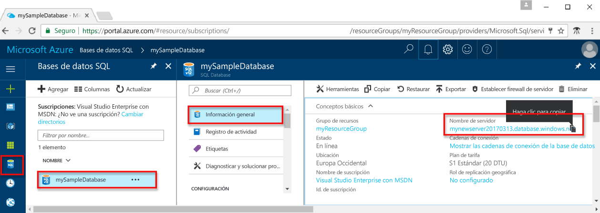
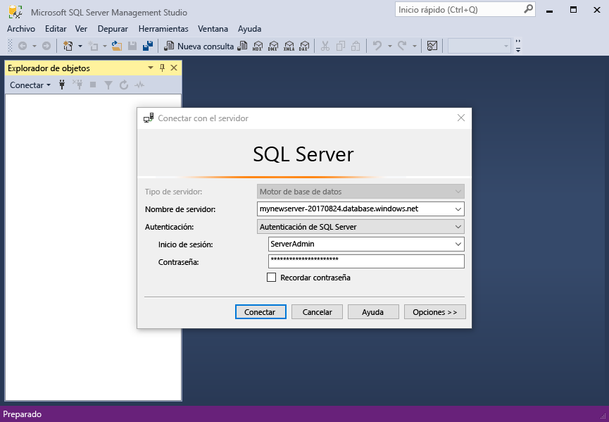
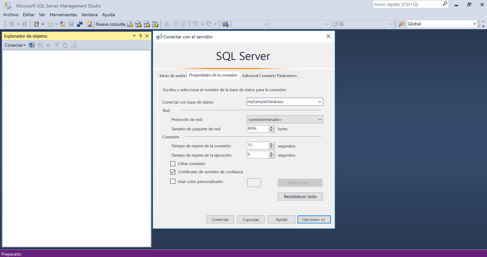
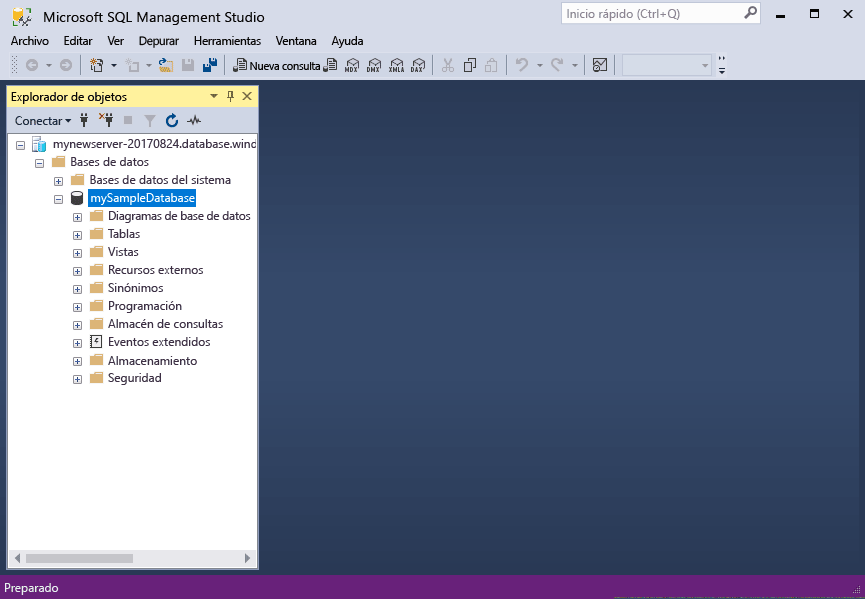
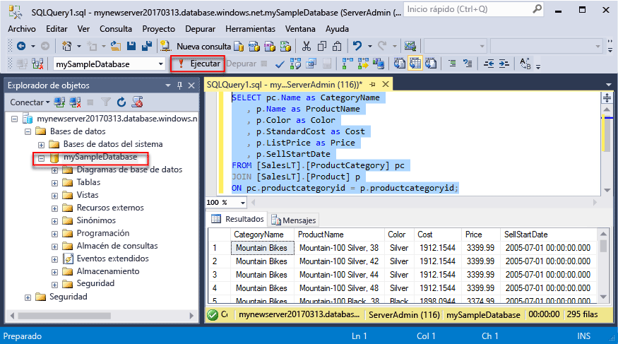
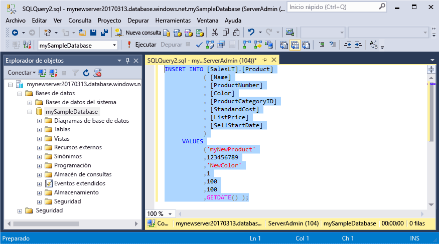
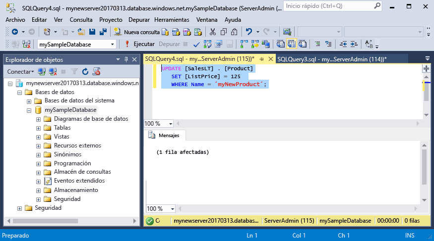
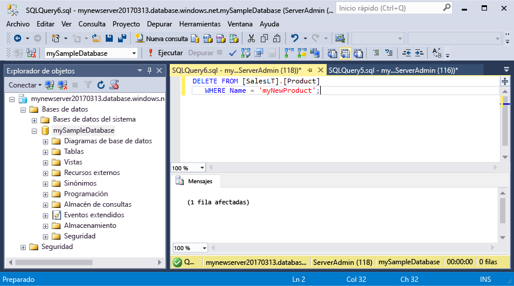

# <a name="azure-sql-database-use-sql-server-management-studio-to-connect-and-query-data"></a><span data-ttu-id="57d49-105">Azure SQL Database: use SQL Server Management Studio para conectarse a los datos y realizar consultas en ellos</span><span class="sxs-lookup"><span data-stu-id="57d49-105">Azure SQL Database: Use SQL Server Management Studio to connect and query data</span></span>

<span data-ttu-id="57d49-106">[SQL Server Management Studio](https://msdn.microsoft.com/library/ms174173.aspx) (SSMS) es un entorno integrado para administrar cualquier infraestructura de SQL, desde SQL Server hasta SQL Database para Microsoft Windows.</span><span class="sxs-lookup"><span data-stu-id="57d49-106">[SQL Server Management Studio](https://msdn.microsoft.com/library/ms174173.aspx) (SSMS) is an integrated environment for managing any SQL infrastructure, from SQL Server to SQL Database for Microsoft Windows.</span></span> <span data-ttu-id="57d49-107">Este inicio rápido muestra cómo usar SSMS para conectarse a una base de datos de SQL Azure Database, para después usar las instrucciones Transact-SQL para consultar, insertar, actualizar y eliminar datos en la base de datos.</span><span class="sxs-lookup"><span data-stu-id="57d49-107">This quick start demonstrates how to use SSMS to connect to an Azure SQL database, and then use Transact-SQL statements to query, insert, update, and delete data in the database.</span></span> 

## <a name="prerequisites"></a><span data-ttu-id="57d49-108">Requisitos previos</span><span class="sxs-lookup"><span data-stu-id="57d49-108">Prerequisites</span></span>

<span data-ttu-id="57d49-109">En esta guía de inicio rápido se utilizan como punto de partida los recursos creados en una de las siguientes guías:</span><span class="sxs-lookup"><span data-stu-id="57d49-109">This quick start uses as its starting point the resources created in one of these quick starts:</span></span>

- [<span data-ttu-id="57d49-110">Creación de la base de datos: Azure Portal</span><span class="sxs-lookup"><span data-stu-id="57d49-110">Create DB - Portal</span></span>](sql-database-get-started-portal.md)
- [<span data-ttu-id="57d49-111">Creación de la base de datos: CLI</span><span class="sxs-lookup"><span data-stu-id="57d49-111">Create DB - CLI</span></span>](sql-database-get-started-cli.md)
- [<span data-ttu-id="57d49-112">Creación de la base de datos: PowerShell</span><span class="sxs-lookup"><span data-stu-id="57d49-112">Create DB - PowerShell</span></span>](sql-database-get-started-powershell.md)

<span data-ttu-id="57d49-113">Antes de empezar, asegúrese de que ha instalado la versión más reciente de [SSMS](https://msdn.microsoft.com/library/mt238290.aspx).</span><span class="sxs-lookup"><span data-stu-id="57d49-113">Before you start, make sure you have installed the newest version of [SSMS](https://msdn.microsoft.com/library/mt238290.aspx).</span></span> 

## <a name="sql-server-connection-information"></a><span data-ttu-id="57d49-114">Información de conexión de SQL server</span><span class="sxs-lookup"><span data-stu-id="57d49-114">SQL server connection information</span></span>

<span data-ttu-id="57d49-115">Obtención de la información de conexión necesaria para conectarse a Azure SQL Database.</span><span class="sxs-lookup"><span data-stu-id="57d49-115">Get the connection information needed to connect to the Azure SQL database.</span></span> <span data-ttu-id="57d49-116">En los procedimientos siguientes, necesitará el nombre completo del servidor, el nombre de la base de datos y la información de inicio de sesión.</span><span class="sxs-lookup"><span data-stu-id="57d49-116">You will need the fully qualified server name, database name, and login information in the next procedures.</span></span>

1. <span data-ttu-id="57d49-117">Inicie sesión en [Azure Portal](https://portal.azure.com/).</span><span class="sxs-lookup"><span data-stu-id="57d49-117">Log in to the [Azure portal](https://portal.azure.com/).</span></span>
2. <span data-ttu-id="57d49-118">Seleccione **Bases de datos SQL** en el menú de la izquierda y haga clic en la base de datos en la página **Bases de datos SQL**.</span><span class="sxs-lookup"><span data-stu-id="57d49-118">Select **SQL Databases** from the left-hand menu, and click your database on the **SQL databases** page.</span></span> 
3. <span data-ttu-id="57d49-119">En la página **Introducción** de la base de datos, revise el nombre completo del servidor, tal como se muestra en la imagen siguiente.</span><span class="sxs-lookup"><span data-stu-id="57d49-119">On the **Overview** page for your database, review the fully qualified server name as shown in the image below.</span></span> <span data-ttu-id="57d49-120">Mantenga el puntero sobre el nombre del servidor hasta que aparezca la opción **Haga clic para copiar**.</span><span class="sxs-lookup"><span data-stu-id="57d49-120">You can hover over the server name to bring up the **Click to copy** option.</span></span>

    

4. <span data-ttu-id="57d49-122">Si ha olvidado la información de inicio de sesión para el servidor de Azure SQL Database, navegue a la página del servidor de SQL Database para ver el nombre del Administrador del servidor y, si es necesario, restablecer la contraseña.</span><span class="sxs-lookup"><span data-stu-id="57d49-122">If you have forgotten the login information for your Azure SQL Database server, navigate to the SQL Database server page to view the server admin name and, if necessary, reset the password.</span></span> 

## <a name="connect-to-your-database"></a><span data-ttu-id="57d49-123">Conectarse a la base de datos</span><span class="sxs-lookup"><span data-stu-id="57d49-123">Connect to your database</span></span>

<span data-ttu-id="57d49-124">Use SQL Server Management Studio para establecer una conexión con un servidor de Azure SQL Database.</span><span class="sxs-lookup"><span data-stu-id="57d49-124">Use SQL Server Management Studio to establish a connection to your Azure SQL Database server.</span></span> 

> [!IMPORTANT]
> <span data-ttu-id="57d49-125">Un servidor lógico de Azure SQL Database escucha en el puerto 1433.</span><span class="sxs-lookup"><span data-stu-id="57d49-125">An Azure SQL Database logical server listens on port 1433.</span></span> <span data-ttu-id="57d49-126">Si intenta conectarse a un servidor lógico de Azure SQL Database desde dentro de un firewall corporativo, este puerto debe estar abierto en el firewall corporativo para poder conectarse correctamente.</span><span class="sxs-lookup"><span data-stu-id="57d49-126">If you are attempting to connect to an Azure SQL Database logical server from within a corporate firewall, this port must be open in the corporate firewall for you to successfully connect.</span></span>
>

1. <span data-ttu-id="57d49-127">Abra SQL Server Management Studio.</span><span class="sxs-lookup"><span data-stu-id="57d49-127">Open SQL Server Management Studio.</span></span>

2. <span data-ttu-id="57d49-128">En el cuadro de diálogo **Conectar con el servidor**, especifique la siguiente información:</span><span class="sxs-lookup"><span data-stu-id="57d49-128">In the **Connect to Server** dialog box, enter the following information:</span></span>

   | <span data-ttu-id="57d49-129">Configuración</span><span class="sxs-lookup"><span data-stu-id="57d49-129">Setting</span></span>       | <span data-ttu-id="57d49-130">Valor sugerido</span><span class="sxs-lookup"><span data-stu-id="57d49-130">Suggested value</span></span> | <span data-ttu-id="57d49-131">Descripción</span><span class="sxs-lookup"><span data-stu-id="57d49-131">Description</span></span> | 
   | ------------ | ------------------ | ------------------------------------------------- | 
   | <span data-ttu-id="57d49-132">**Tipo de servidor**</span><span class="sxs-lookup"><span data-stu-id="57d49-132">**Server type**</span></span> | <span data-ttu-id="57d49-133">Motor de base de datos</span><span class="sxs-lookup"><span data-stu-id="57d49-133">Database engine</span></span> | <span data-ttu-id="57d49-134">Este valor es necesario.</span><span class="sxs-lookup"><span data-stu-id="57d49-134">This value is required.</span></span> |
   | <span data-ttu-id="57d49-135">**Nombre del servidor**</span><span class="sxs-lookup"><span data-stu-id="57d49-135">**Server name**</span></span> | <span data-ttu-id="57d49-136">Nombre completo del servidor</span><span class="sxs-lookup"><span data-stu-id="57d49-136">The fully qualified server name</span></span> | <span data-ttu-id="57d49-137">Dicho nombre debe parecerse al siguiente: **mynewserver20170313.database.windows.net**.</span><span class="sxs-lookup"><span data-stu-id="57d49-137">The name should be something like this: **mynewserver20170313.database.windows.net**.</span></span> |
   | <span data-ttu-id="57d49-138">**Autenticación**</span><span class="sxs-lookup"><span data-stu-id="57d49-138">**Authentication**</span></span> | <span data-ttu-id="57d49-139">Autenticación de SQL Server</span><span class="sxs-lookup"><span data-stu-id="57d49-139">SQL Server Authentication</span></span> | <span data-ttu-id="57d49-140">Autenticación de SQL es el único tipo de autenticación que hemos configurado en este tutorial.</span><span class="sxs-lookup"><span data-stu-id="57d49-140">SQL Authentication is the only authentication type that we have configured in this tutorial.</span></span> |
   | <span data-ttu-id="57d49-141">**Inicio de sesión**</span><span class="sxs-lookup"><span data-stu-id="57d49-141">**Login**</span></span> | <span data-ttu-id="57d49-142">La cuenta de administrador del servidor</span><span class="sxs-lookup"><span data-stu-id="57d49-142">The server admin account</span></span> | <span data-ttu-id="57d49-143">Es la cuenta que especificó cuando creó el servidor.</span><span class="sxs-lookup"><span data-stu-id="57d49-143">This is the account that you specified when you created the server.</span></span> |
   | <span data-ttu-id="57d49-144">**Password**</span><span class="sxs-lookup"><span data-stu-id="57d49-144">**Password**</span></span> | <span data-ttu-id="57d49-145">La contraseña de la cuenta de administrador del servidor</span><span class="sxs-lookup"><span data-stu-id="57d49-145">The password for your server admin account</span></span> | <span data-ttu-id="57d49-146">Es la contraseña que especificó cuando creó el servidor.</span><span class="sxs-lookup"><span data-stu-id="57d49-146">This is the password that you specified when you created the server.</span></span> |

     

3. <span data-ttu-id="57d49-148">Haga clic en **Opciones** en el cuadro de diálogo **Conectar con el servidor**.</span><span class="sxs-lookup"><span data-stu-id="57d49-148">Click **Options** in the **Connect to server** dialog box.</span></span> <span data-ttu-id="57d49-149">En la sección **Conectar con base de datos**, escriba **mySampleDatabase** para conectarse a esta base de datos.</span><span class="sxs-lookup"><span data-stu-id="57d49-149">In the **Connect to database** section, enter **mySampleDatabase** to connect to this database.</span></span>

     

4. <span data-ttu-id="57d49-151">Haga clic en **Conectar**.</span><span class="sxs-lookup"><span data-stu-id="57d49-151">Click **Connect**.</span></span> <span data-ttu-id="57d49-152">Se abre la ventana del Explorador de objetos en SSMS.</span><span class="sxs-lookup"><span data-stu-id="57d49-152">The Object Explorer window opens in SSMS.</span></span> 

     

5. <span data-ttu-id="57d49-154">En el Explorador de objetos, expanda **Bases de datos** y, después, expanda **mySampleDatabase** para ver los objetos de la base de datos de ejemplo.</span><span class="sxs-lookup"><span data-stu-id="57d49-154">In Object Explorer, expand **Databases** and then expand **mySampleDatabase** to view the objects in the sample database.</span></span>

## <a name="query-data"></a><span data-ttu-id="57d49-155">Datos de consulta</span><span class="sxs-lookup"><span data-stu-id="57d49-155">Query data</span></span>

<span data-ttu-id="57d49-156">Utilice el código siguiente para consultar los 20 primeros productos por categoría con la instrucción Transact-SQL [SELECT](https://msdn.microsoft.com/library/ms189499.aspx).</span><span class="sxs-lookup"><span data-stu-id="57d49-156">Use the following code to query for the top 20 products by category using the [SELECT](https://msdn.microsoft.com/library/ms189499.aspx) Transact-SQL statement.</span></span>

1. <span data-ttu-id="57d49-157">En el Explorador de objetos, haga clic con el botón derecho en **mySampleDatabase** y luego en **Nueva consulta**.</span><span class="sxs-lookup"><span data-stu-id="57d49-157">In Object Explorer, right-click **mySampleDatabase** and click **New Query**.</span></span> <span data-ttu-id="57d49-158">Se abre una ventana de consulta en blanco que está conectada a la base de datos.</span><span class="sxs-lookup"><span data-stu-id="57d49-158">A blank query window opens that is connected to your database.</span></span>
2. <span data-ttu-id="57d49-159">En la ventana Consulta, escriba la consulta siguiente:</span><span class="sxs-lookup"><span data-stu-id="57d49-159">In the query window, enter the following query:</span></span>

   ```sql
   SELECT pc.Name as CategoryName, p.name as ProductName
   FROM [SalesLT].[ProductCategory] pc
   JOIN [SalesLT].[Product] p
   ON pc.productcategoryid = p.productcategoryid;
   ```

3. <span data-ttu-id="57d49-160">En la barra de herramientas, haga clic en **Ejecutar** para recuperar datos de las tablas Product y ProductCategory.</span><span class="sxs-lookup"><span data-stu-id="57d49-160">On the toolbar, click **Execute** to retrieve data from the Product and ProductCategory tables.</span></span>

    

## <a name="insert-data"></a><span data-ttu-id="57d49-162">Insertar datos</span><span class="sxs-lookup"><span data-stu-id="57d49-162">Insert data</span></span>

<span data-ttu-id="57d49-163">Utilice el código siguiente para insertar un nuevo producto en la tabla SalesLT.Product con la instrucción Transact-SQL [INSERT](https://msdn.microsoft.com/library/ms174335.aspx).</span><span class="sxs-lookup"><span data-stu-id="57d49-163">Use the following code to insert a new product into the SalesLT.Product table using the [INSERT](https://msdn.microsoft.com/library/ms174335.aspx) Transact-SQL statement.</span></span>

1. <span data-ttu-id="57d49-164">En la ventana Consulta, reemplace la consulta anterior con la siguiente consulta:</span><span class="sxs-lookup"><span data-stu-id="57d49-164">In the query window, replace the previous query with the following query:</span></span>

   ```sql
   INSERT INTO [SalesLT].[Product]
           ( [Name]
           , [ProductNumber]
           , [Color]
           , [ProductCategoryID]
           , [StandardCost]
           , [ListPrice]
           , [SellStartDate]
           )
     VALUES
           ('myNewProduct'
           ,123456789
           ,'NewColor'
           ,1
           ,100
           ,100
           ,GETDATE() );
   ```

2. <span data-ttu-id="57d49-165">En la barra de herramientas, haga clic en **Ejecutar** para insertar una nueva fila en la tabla Product.</span><span class="sxs-lookup"><span data-stu-id="57d49-165">On the toolbar, click **Execute**  to insert a new row in the Product table.</span></span>

    

## <a name="update-data"></a><span data-ttu-id="57d49-166">Actualización de datos</span><span class="sxs-lookup"><span data-stu-id="57d49-166">Update data</span></span>

<span data-ttu-id="57d49-167">Utilice el código siguiente para actualizar el nuevo producto que ha agregado anteriormente con la instrucción Transact-SQL [UPDATE](https://msdn.microsoft.com/library/ms177523.aspx).</span><span class="sxs-lookup"><span data-stu-id="57d49-167">Use the following code to update the new product that you previously added using the [UPDATE](https://msdn.microsoft.com/library/ms177523.aspx) Transact-SQL statement.</span></span>

1. <span data-ttu-id="57d49-168">En la ventana Consulta, reemplace la consulta anterior con la siguiente consulta:</span><span class="sxs-lookup"><span data-stu-id="57d49-168">In the query window, replace the previous query with the following query:</span></span>

   ```sql
   UPDATE [SalesLT].[Product]
   SET [ListPrice] = 125
   WHERE Name = 'myNewProduct';
   ```

2. <span data-ttu-id="57d49-169">En la barra de herramientas, haga clic en **Ejecutar** para actualizar la fila especificada en la tabla Product.</span><span class="sxs-lookup"><span data-stu-id="57d49-169">On the toolbar, click **Execute** to update the specified row in the Product table.</span></span>

    

## <a name="delete-data"></a><span data-ttu-id="57d49-170">Eliminación de datos</span><span class="sxs-lookup"><span data-stu-id="57d49-170">Delete data</span></span>

<span data-ttu-id="57d49-171">Utilice el código siguiente para eliminar el nuevo producto que ha agregado anteriormente con la instrucción Transact-SQL [DELETE](https://msdn.microsoft.com/library/ms189835.aspx).</span><span class="sxs-lookup"><span data-stu-id="57d49-171">Use the following code to delete the new product that you previously added using the [DELETE](https://msdn.microsoft.com/library/ms189835.aspx) Transact-SQL statement.</span></span>

1. <span data-ttu-id="57d49-172">En la ventana Consulta, reemplace la consulta anterior con la siguiente consulta:</span><span class="sxs-lookup"><span data-stu-id="57d49-172">In the query window, replace the previous query with the following query:</span></span>

   ```sql
   DELETE FROM [SalesLT].[Product]
   WHERE Name = 'myNewProduct';
   ```

2. <span data-ttu-id="57d49-173">En la barra de herramientas, haga clic en **Ejecutar** para eliminar la fila especificada en la tabla Product.</span><span class="sxs-lookup"><span data-stu-id="57d49-173">On the toolbar, click **Execute** to delete the specified row in the Product table.</span></span>

    

## <a name="next-steps"></a><span data-ttu-id="57d49-174">Pasos siguientes</span><span class="sxs-lookup"><span data-stu-id="57d49-174">Next steps</span></span>

- <span data-ttu-id="57d49-175">Para aprender a crear y administrar servidores y bases de datos con Transact-SQL, consulte [Create and manage Azure SQL Database servers and databases](sql-database-servers-databases.md) (Creación y administración de bases de datos y servidores de Azure SQL Database).</span><span class="sxs-lookup"><span data-stu-id="57d49-175">To learn about creating and managing servers and databases with Transact-SQL, see [Learn about Azure SQL Database servers and databases](sql-database-servers-databases.md).</span></span>
- <span data-ttu-id="57d49-176">Para más información acerca de SSMS, consulte [Uso de SQL Server Management Studio](https://msdn.microsoft.com/library/ms174173.aspx).</span><span class="sxs-lookup"><span data-stu-id="57d49-176">For information about SSMS, see [Use SQL Server Management Studio](https://msdn.microsoft.com/library/ms174173.aspx).</span></span>
- <span data-ttu-id="57d49-177">Para conectarse y consultar con Visual Studio, vea [Conexión y consultas con Visual Studio Code](sql-database-connect-query-vscode.md).</span><span class="sxs-lookup"><span data-stu-id="57d49-177">To connect and query using Visual Studio Code, see [Connect and query with Visual Studio Code](sql-database-connect-query-vscode.md).</span></span>
- <span data-ttu-id="57d49-178">Para conectarse y consultar con .NET, vea [Conexión y consultas con .NET](sql-database-connect-query-dotnet.md).</span><span class="sxs-lookup"><span data-stu-id="57d49-178">To connect and query using .NET, see [Connect and query with .NET](sql-database-connect-query-dotnet.md).</span></span>
- <span data-ttu-id="57d49-179">Para conectarse y consultar con PHP, vea [Conexión y consultas con PHP](sql-database-connect-query-php.md).</span><span class="sxs-lookup"><span data-stu-id="57d49-179">To connect and query using PHP, see [Connect and query with PHP](sql-database-connect-query-php.md).</span></span>
- <span data-ttu-id="57d49-180">Para conectarse y consultar con Node.js, vea [Conexión y consultas con Node.js](sql-database-connect-query-nodejs.md).</span><span class="sxs-lookup"><span data-stu-id="57d49-180">To connect and query using Node.js, see [Connect and query with Node.js](sql-database-connect-query-nodejs.md).</span></span>
- <span data-ttu-id="57d49-181">Para conectarse y consultar con Java, vea [Conexión y consultas con Java](sql-database-connect-query-java.md).</span><span class="sxs-lookup"><span data-stu-id="57d49-181">To connect and query using Java, see [Connect and query with Java](sql-database-connect-query-java.md).</span></span>
- <span data-ttu-id="57d49-182">Para conectarse y consultar con Python, vea [Conexión y consultas con Python](sql-database-connect-query-python.md).</span><span class="sxs-lookup"><span data-stu-id="57d49-182">To connect and query using Python, see [Connect and query with Python](sql-database-connect-query-python.md).</span></span>
- <span data-ttu-id="57d49-183">Para conectarse y consultar con Ruby, vea [Conexión y consultas con Ruby](sql-database-connect-query-ruby.md).</span><span class="sxs-lookup"><span data-stu-id="57d49-183">To connect and query using Ruby, see [Connect and query with Ruby](sql-database-connect-query-ruby.md).</span></span>
