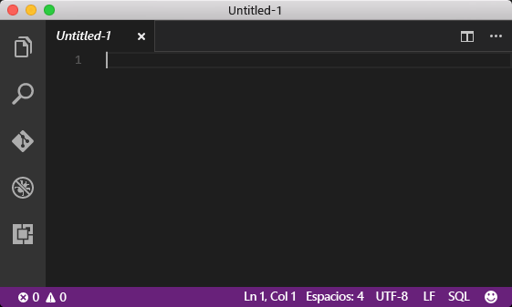
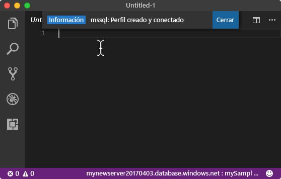
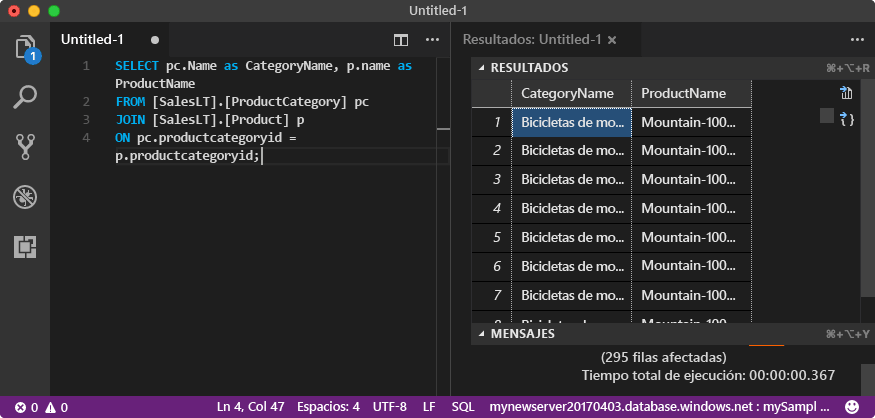

# <a name="azure-sql-database-use-visual-studio-code-to-connect-and-query-data"></a><span data-ttu-id="1c478-105">Azure SQL Database: uso de Visual Studio Code para conectar y consultar datos</span><span class="sxs-lookup"><span data-stu-id="1c478-105">Azure SQL Database: Use Visual Studio Code to connect and query data</span></span>

<span data-ttu-id="1c478-106">[Visual Studio Code](https://code.visualstudio.com/docs) es un editor de código gráfico para Linux, Mac OS y Windows que admite extensiones, incluidas la [extensión mssql](https://aka.ms/mssql-marketplace) para realizar consultas en Microsoft SQL Server, Azure SQL Database y SQL Data Warehouse.</span><span class="sxs-lookup"><span data-stu-id="1c478-106">[Visual Studio Code](https://code.visualstudio.com/docs) is a graphical code editor for Linux, macOS, and Windows that supports extensions, including the [mssql extension](https://aka.ms/mssql-marketplace) for querying Microsoft SQL Server, Azure SQL Database, and SQL Data Warehouse.</span></span> <span data-ttu-id="1c478-107">Este inicio rápido muestra cómo usar Visual Studio Code para conectarse a una base de datos de SQL Azure Database, para después usar las instrucciones Transact-SQL para consultar, insertar, actualizar y eliminar datos en la base de datos.</span><span class="sxs-lookup"><span data-stu-id="1c478-107">This quick start demonstrates how to use Visual Studio Code to connect to an Azure SQL database, and then use Transact-SQL statements to query, insert, update, and delete data in the database.</span></span>

## <a name="prerequisites"></a><span data-ttu-id="1c478-108">Requisitos previos</span><span class="sxs-lookup"><span data-stu-id="1c478-108">Prerequisites</span></span>

<span data-ttu-id="1c478-109">En esta guía de inicio rápido se utilizan como punto de partida los recursos creados en una de las siguientes guías:</span><span class="sxs-lookup"><span data-stu-id="1c478-109">This quick start uses as its starting point the resources created in one of these quick starts:</span></span>

- [<span data-ttu-id="1c478-110">Creación de la base de datos: Azure Portal</span><span class="sxs-lookup"><span data-stu-id="1c478-110">Create DB - Portal</span></span>](sql-database-get-started-portal.md)
- [<span data-ttu-id="1c478-111">Creación de la base de datos: CLI</span><span class="sxs-lookup"><span data-stu-id="1c478-111">Create DB - CLI</span></span>](sql-database-get-started-cli.md)
- [<span data-ttu-id="1c478-112">Creación de la base de datos: PowerShell</span><span class="sxs-lookup"><span data-stu-id="1c478-112">Create DB - PowerShell</span></span>](sql-database-get-started-powershell.md)

<span data-ttu-id="1c478-113">Antes de empezar, asegúrese de que tiene instalada la versión más reciente de [Visual Studio Code](https://code.visualstudio.com/Download) y cargue la [extensión mssql](https://aka.ms/mssql-marketplace).</span><span class="sxs-lookup"><span data-stu-id="1c478-113">Before you start, make sure you have installed the newest version of [Visual Studio Code](https://code.visualstudio.com/Download) and loaded the [mssql extension](https://aka.ms/mssql-marketplace).</span></span> <span data-ttu-id="1c478-114">Para obtener instrucciones de instalación para la extensión mssql, vea [Install VS Code](https://docs.microsoft.com/sql/linux/sql-server-linux-develop-use-vscode#install-vs-code) (Instalación de VS Code) y [mssql for Visual Studio Code](https://marketplace.visualstudio.com/items?itemName=ms-mssql.mssql) (mssql para Visual Studio Code).</span><span class="sxs-lookup"><span data-stu-id="1c478-114">For installation guidance for the mssql extension, see [Install VS Code](https://docs.microsoft.com/sql/linux/sql-server-linux-develop-use-vscode#install-vs-code) and see [mssql for Visual Studio Code](https://marketplace.visualstudio.com/items?itemName=ms-mssql.mssql).</span></span> 

## <a name="configure-vs-code"></a><span data-ttu-id="1c478-115">Configuración del código de VS</span><span class="sxs-lookup"><span data-stu-id="1c478-115">Configure VS Code</span></span> 

### <a name="mac-os"></a><span data-ttu-id="1c478-116">**Mac OS**</span><span class="sxs-lookup"><span data-stu-id="1c478-116">**Mac OS**</span></span>
<span data-ttu-id="1c478-117">Para macOS, debe instalar OpenSSL, que es un requisito previo para DotNet Core que la extensión mssql utiliza.</span><span class="sxs-lookup"><span data-stu-id="1c478-117">For macOS, you need to install OpenSSL which is a prerequiste for DotNet Core that mssql extention uses.</span></span> <span data-ttu-id="1c478-118">Abra el terminal y escriba los siguientes comandos para instalar **brew** y **OpenSSL**.</span><span class="sxs-lookup"><span data-stu-id="1c478-118">Open your terminal and enter the following commands to install **brew** and **OpenSSL**.</span></span> 

```bash
ruby -e "$(curl -fsSL https://raw.githubusercontent.com/Homebrew/install/master/install)"
brew update
brew install openssl
mkdir -p /usr/local/lib
ln -s /usr/local/opt/openssl/lib/libcrypto.1.0.0.dylib /usr/local/lib/
ln -s /usr/local/opt/openssl/lib/libssl.1.0.0.dylib /usr/local/lib/
```

### <a name="linux-ubuntu"></a><span data-ttu-id="1c478-119">**Linux (Ubuntu)**</span><span class="sxs-lookup"><span data-stu-id="1c478-119">**Linux (Ubuntu)**</span></span>

<span data-ttu-id="1c478-120">No se necesita ninguna configuración especial.</span><span class="sxs-lookup"><span data-stu-id="1c478-120">No special configuration needed.</span></span>

### <a name="windows"></a><span data-ttu-id="1c478-121">**Windows**</span><span class="sxs-lookup"><span data-stu-id="1c478-121">**Windows**</span></span>

<span data-ttu-id="1c478-122">No se necesita ninguna configuración especial.</span><span class="sxs-lookup"><span data-stu-id="1c478-122">No special configuration needed.</span></span>

## <a name="sql-server-connection-information"></a><span data-ttu-id="1c478-123">Información de conexión de SQL server</span><span class="sxs-lookup"><span data-stu-id="1c478-123">SQL server connection information</span></span>

<span data-ttu-id="1c478-124">Obtención de la información de conexión necesaria para conectarse a Azure SQL Database.</span><span class="sxs-lookup"><span data-stu-id="1c478-124">Get the connection information needed to connect to the Azure SQL database.</span></span> <span data-ttu-id="1c478-125">En los procedimientos siguientes, necesitará el nombre completo del servidor, el nombre de la base de datos y la información de inicio de sesión.</span><span class="sxs-lookup"><span data-stu-id="1c478-125">You will need the fully qualified server name, database name, and login information in the next procedures.</span></span>

1. <span data-ttu-id="1c478-126">Inicie sesión en [Azure Portal](https://portal.azure.com/).</span><span class="sxs-lookup"><span data-stu-id="1c478-126">Log in to the [Azure portal](https://portal.azure.com/).</span></span>
2. <span data-ttu-id="1c478-127">Seleccione **Bases de datos SQL** en el menú de la izquierda y haga clic en la base de datos en la página **Bases de datos SQL**.</span><span class="sxs-lookup"><span data-stu-id="1c478-127">Select **SQL Databases** from the left-hand menu, and click your database on the **SQL databases** page.</span></span> 
3. <span data-ttu-id="1c478-128">En la página **Introducción** de la base de datos, revise el nombre completo del servidor tal como se muestra en la siguiente imagen.</span><span class="sxs-lookup"><span data-stu-id="1c478-128">On the **Overview** page for your database, review the fully qualified server name as shown in the following image.</span></span> <span data-ttu-id="1c478-129">Mantenga el puntero sobre el nombre del servidor hasta que aparezca la opción **Haga clic para copiar**.</span><span class="sxs-lookup"><span data-stu-id="1c478-129">You can hover over the server name to bring up the **Click to copy** option.</span></span>

    

4. <span data-ttu-id="1c478-131">Si ha olvidado la información de inicio de sesión para el servidor de Azure SQL Database, navegue a la página del servidor de SQL Database para ver el nombre del Administrador de servidor y, si es necesario, restablecer la contraseña.</span><span class="sxs-lookup"><span data-stu-id="1c478-131">If you have forgotten the login information for your Azure SQL Database server, navigate to the SQL Database server page to view the server admin name and, if necessary, reset the password.</span></span> 

## <a name="set-language-mode-to-sql"></a><span data-ttu-id="1c478-132">Definición del modo de lenguaje en SQL</span><span class="sxs-lookup"><span data-stu-id="1c478-132">Set language mode to SQL</span></span>

<span data-ttu-id="1c478-133">El modo de lenguaje está establecido en **SQL** en Visual Studio Code para habilitar comandos mssql y T-SQL IntelliSense.</span><span class="sxs-lookup"><span data-stu-id="1c478-133">Set the language mode is set to **SQL** in Visual Studio Code to enable mssql commands and T-SQL IntelliSense.</span></span>

1. <span data-ttu-id="1c478-134">Abra una nueva ventana de Visual Studio Code.</span><span class="sxs-lookup"><span data-stu-id="1c478-134">Open a new Visual Studio Code window.</span></span> 

2. <span data-ttu-id="1c478-135">Haga clic en **Texto sin formato** en la esquina inferior derecha de la barra de estado.</span><span class="sxs-lookup"><span data-stu-id="1c478-135">Click **Plain Text** in the lower right-hand corner of the status bar.</span></span>
3. <span data-ttu-id="1c478-136">En menú desplegable **Seleccionar modo de lenguaje** que se abre, escriba **SQL** y, a continuación, presione **ENTRAR** para establecer el modo de lenguaje en SQL.</span><span class="sxs-lookup"><span data-stu-id="1c478-136">In the **Select language mode** drop-down menu that opens, type **SQL**, and then press **ENTER** to set the language mode to SQL.</span></span> 

   

## <a name="connect-to-your-database"></a><span data-ttu-id="1c478-138">Conectarse a la base de datos</span><span class="sxs-lookup"><span data-stu-id="1c478-138">Connect to your database</span></span>

<span data-ttu-id="1c478-139">Use Visual Studio Code para establecer una conexión con el servidor de Azure SQL Database.</span><span class="sxs-lookup"><span data-stu-id="1c478-139">Use Visual Studio Code to establish a connection to your Azure SQL Database server.</span></span>

> [!IMPORTANT]
> <span data-ttu-id="1c478-140">Antes de continuar, asegúrese de que están preparados el servidor, la base de datos y la lista de información de inicio de sesión.</span><span class="sxs-lookup"><span data-stu-id="1c478-140">Before continuing, make sure that you have your server, database, and login information ready.</span></span> <span data-ttu-id="1c478-141">Cuando comience a escribir la información de perfil de conexión, si cambia el foco de Visual Studio Code, tendrá que reiniciar la creación del perfil de conexión.</span><span class="sxs-lookup"><span data-stu-id="1c478-141">Once you begin entering the connection profile information, if you change your focus from Visual Studio Code, you have to restart creating the connection profile.</span></span>
>

1. <span data-ttu-id="1c478-142">En VS Code, presione **CTRL + MAYÚS + P** (o **F1**) para abrir la paleta de comandos.</span><span class="sxs-lookup"><span data-stu-id="1c478-142">In VS Code, press **CTRL+SHIFT+P** (or **F1**) to open the Command Palette.</span></span>

2. <span data-ttu-id="1c478-143">Escriba **sqlcon** y presione **ENTRAR**.</span><span class="sxs-lookup"><span data-stu-id="1c478-143">Type **sqlcon** and press **ENTER**.</span></span>

3. <span data-ttu-id="1c478-144">Presione **ENTRAR** para seleccionar **Create Connection Profile** (Crear perfil de conexión).</span><span class="sxs-lookup"><span data-stu-id="1c478-144">Press **ENTER** to select **Create Connection Profile**.</span></span> <span data-ttu-id="1c478-145">Al hacerlo, se creará un perfil de conexión para la instancia de SQL Server.</span><span class="sxs-lookup"><span data-stu-id="1c478-145">This creates a connection profile for your SQL Server instance.</span></span>

4. <span data-ttu-id="1c478-146">Siga las indicaciones para especificar las propiedades de conexión para el nuevo perfil de conexión.</span><span class="sxs-lookup"><span data-stu-id="1c478-146">Follow the prompts to specify the connection properties for the new connection profile.</span></span> <span data-ttu-id="1c478-147">Después de especificar cada valor, presione **ENTRAR** para continuar.</span><span class="sxs-lookup"><span data-stu-id="1c478-147">After specifying each value, press **ENTER** to continue.</span></span> 

   | <span data-ttu-id="1c478-148">Configuración</span><span class="sxs-lookup"><span data-stu-id="1c478-148">Setting</span></span>       | <span data-ttu-id="1c478-149">Valor sugerido</span><span class="sxs-lookup"><span data-stu-id="1c478-149">Suggested value</span></span> | <span data-ttu-id="1c478-150">Descripción</span><span class="sxs-lookup"><span data-stu-id="1c478-150">Description</span></span> |
   | ------------ | ------------------ | ------------------------------------------------- | 
   | <span data-ttu-id="1c478-151">**Nombre de servidor</span><span class="sxs-lookup"><span data-stu-id="1c478-151">**Server name</span></span> | <span data-ttu-id="1c478-152">Nombre completo del servidor</span><span class="sxs-lookup"><span data-stu-id="1c478-152">The fully qualified server name</span></span> | <span data-ttu-id="1c478-153">Dicho nombre debe parecerse al siguiente: **mynewserver20170313.database.windows.net**.</span><span class="sxs-lookup"><span data-stu-id="1c478-153">The name should be something like this: **mynewserver20170313.database.windows.net**.</span></span> |
   | <span data-ttu-id="1c478-154">**Nombre de la base de datos**</span><span class="sxs-lookup"><span data-stu-id="1c478-154">**Database name**</span></span> | <span data-ttu-id="1c478-155">mySampleDatabase</span><span class="sxs-lookup"><span data-stu-id="1c478-155">mySampleDatabase</span></span> | <span data-ttu-id="1c478-156">El nombre de la base de datos con la que se realizará la conexión.</span><span class="sxs-lookup"><span data-stu-id="1c478-156">The name of the database to which to connect.</span></span> |
   | <span data-ttu-id="1c478-157">**Autenticación**</span><span class="sxs-lookup"><span data-stu-id="1c478-157">**Authentication**</span></span> | <span data-ttu-id="1c478-158">Inicio de sesión SQL</span><span class="sxs-lookup"><span data-stu-id="1c478-158">SQL Login</span></span>| <span data-ttu-id="1c478-159">Autenticación de SQL es el único tipo de autenticación que hemos configurado en este tutorial.</span><span class="sxs-lookup"><span data-stu-id="1c478-159">SQL Authentication is the only authentication type that we have configured in this tutorial.</span></span> |
   | <span data-ttu-id="1c478-160">**Nombre de usuario**</span><span class="sxs-lookup"><span data-stu-id="1c478-160">**User name**</span></span> | <span data-ttu-id="1c478-161">La cuenta de administrador del servidor</span><span class="sxs-lookup"><span data-stu-id="1c478-161">The server admin account</span></span> | <span data-ttu-id="1c478-162">Es la cuenta que especificó cuando creó el servidor.</span><span class="sxs-lookup"><span data-stu-id="1c478-162">This is the account that you specified when you created the server.</span></span> |
   | <span data-ttu-id="1c478-163">**Contraseña (Inicio de sesión de SQL)**</span><span class="sxs-lookup"><span data-stu-id="1c478-163">**Password (SQL Login)**</span></span> | <span data-ttu-id="1c478-164">La contraseña de la cuenta de administrador del servidor</span><span class="sxs-lookup"><span data-stu-id="1c478-164">The password for your server admin account</span></span> | <span data-ttu-id="1c478-165">Es la contraseña que especificó cuando creó el servidor.</span><span class="sxs-lookup"><span data-stu-id="1c478-165">This is the password that you specified when you created the server.</span></span> |
   | <span data-ttu-id="1c478-166">**¿Guardar la contraseña?**</span><span class="sxs-lookup"><span data-stu-id="1c478-166">**Save Password?**</span></span> | <span data-ttu-id="1c478-167">Sí o no</span><span class="sxs-lookup"><span data-stu-id="1c478-167">Yes or No</span></span> | <span data-ttu-id="1c478-168">Seleccione Sí si no desea escribir la contraseña cada vez que inicie sesión.</span><span class="sxs-lookup"><span data-stu-id="1c478-168">Select Yes if you do not want to enter the password each time.</span></span> |
   | <span data-ttu-id="1c478-169">**Escribir un nombre para este perfil**</span><span class="sxs-lookup"><span data-stu-id="1c478-169">**Enter a name for this profile**</span></span> | <span data-ttu-id="1c478-170">Un nombre de perfil, como **mySampleDatabase**</span><span class="sxs-lookup"><span data-stu-id="1c478-170">A profile name, such as **mySampleDatabase**</span></span> | <span data-ttu-id="1c478-171">Un nombre de perfil guardado acelera la conexión en los inicios de sesión posteriores.</span><span class="sxs-lookup"><span data-stu-id="1c478-171">A saved profile name speeds your connection on subsequent logins.</span></span> | 

5. <span data-ttu-id="1c478-172">Presione la tecla **ESC** para cerrar el mensaje de información que indica que el perfil se ha creado y conectado.</span><span class="sxs-lookup"><span data-stu-id="1c478-172">Press the **ESC** key to close the info message that informs you that the profile is created and connected.</span></span>

6. <span data-ttu-id="1c478-173">Compruebe la conexión en la barra de estado.</span><span class="sxs-lookup"><span data-stu-id="1c478-173">Verify your connection in the status bar.</span></span>

   

## <a name="query-data"></a><span data-ttu-id="1c478-175">Datos de consulta</span><span class="sxs-lookup"><span data-stu-id="1c478-175">Query data</span></span>

<span data-ttu-id="1c478-176">Utilice el código siguiente para consultar los 20 primeros productos por categoría con la instrucción Transact-SQL [SELECT](https://msdn.microsoft.com/library/ms189499.aspx).</span><span class="sxs-lookup"><span data-stu-id="1c478-176">Use the following code to query for the top 20 products by category using the [SELECT](https://msdn.microsoft.com/library/ms189499.aspx) Transact-SQL statement.</span></span>

1. <span data-ttu-id="1c478-177">En la ventana del **editor**, escriba la siguiente consulta en la ventana de consulta vacía:</span><span class="sxs-lookup"><span data-stu-id="1c478-177">In the **Editor** window, enter the following query in the empty query window:</span></span>

   ```sql
   SELECT pc.Name as CategoryName, p.name as ProductName
   FROM [SalesLT].[ProductCategory] pc
   JOIN [SalesLT].[Product] p
   ON pc.productcategoryid = p.productcategoryid;
   ```

2. <span data-ttu-id="1c478-178">Presione **CTRL + MAYÚS + E** para recuperar datos de las tablas Product y ProductCategory.</span><span class="sxs-lookup"><span data-stu-id="1c478-178">Press **CTRL+SHIFT+E** to retrieve data from the Product and ProductCategory tables.</span></span>

    

## <a name="insert-data"></a><span data-ttu-id="1c478-180">Insertar datos</span><span class="sxs-lookup"><span data-stu-id="1c478-180">Insert data</span></span>

<span data-ttu-id="1c478-181">Utilice el código siguiente para insertar un nuevo producto en la tabla SalesLT.Product con la instrucción Transact-SQL [INSERT](https://msdn.microsoft.com/library/ms174335.aspx).</span><span class="sxs-lookup"><span data-stu-id="1c478-181">Use the following code to insert a new product into the SalesLT.Product table using the [INSERT](https://msdn.microsoft.com/library/ms174335.aspx) Transact-SQL statement.</span></span>

1. <span data-ttu-id="1c478-182">En la ventana del **editor**, elimine la consulta anterior y escriba la siguiente consulta:</span><span class="sxs-lookup"><span data-stu-id="1c478-182">In the **Editor** window, delete the previous query and enter the following query:</span></span>

   ```sql
   INSERT INTO [SalesLT].[Product]
           ( [Name]
           , [ProductNumber]
           , [Color]
           , [ProductCategoryID]
           , [StandardCost]
           , [ListPrice]
           , [SellStartDate]
           )
     VALUES
           ('myNewProduct'
           ,123456789
           ,'NewColor'
           ,1
           ,100
           ,100
           ,GETDATE() );
   ```

2. <span data-ttu-id="1c478-183">Presione **CTRL + MAYÚS + E** para insertar una nueva fila en la tabla Product.</span><span class="sxs-lookup"><span data-stu-id="1c478-183">Press **CTRL+SHIFT+E** to insert a new row in the Product table.</span></span>

## <a name="update-data"></a><span data-ttu-id="1c478-184">Actualización de datos</span><span class="sxs-lookup"><span data-stu-id="1c478-184">Update data</span></span>

<span data-ttu-id="1c478-185">Utilice el código siguiente para actualizar el nuevo producto que ha agregado anteriormente con la instrucción Transact-SQL [UPDATE](https://msdn.microsoft.com/library/ms177523.aspx).</span><span class="sxs-lookup"><span data-stu-id="1c478-185">Use the following code to update the new product that you previously added using the [UPDATE](https://msdn.microsoft.com/library/ms177523.aspx) Transact-SQL statement.</span></span>

1.  <span data-ttu-id="1c478-186">En la ventana del **editor**, elimine la consulta anterior y escriba la siguiente consulta:</span><span class="sxs-lookup"><span data-stu-id="1c478-186">In the **Editor** window, delete the previous query and enter the following query:</span></span>

   ```sql
   UPDATE [SalesLT].[Product]
   SET [ListPrice] = 125
   WHERE Name = 'myNewProduct';
   ```

2. <span data-ttu-id="1c478-187">Presione **CTRL + MAYÚS + E** para actualizar la fila especificada en la tabla Product.</span><span class="sxs-lookup"><span data-stu-id="1c478-187">Press **CTRL+SHIFT+E** to update the specified row in the Product table.</span></span>

## <a name="delete-data"></a><span data-ttu-id="1c478-188">Eliminación de datos</span><span class="sxs-lookup"><span data-stu-id="1c478-188">Delete data</span></span>

<span data-ttu-id="1c478-189">Utilice el código siguiente para eliminar el nuevo producto que ha agregado anteriormente con la instrucción Transact-SQL [DELETE](https://msdn.microsoft.com/library/ms189835.aspx).</span><span class="sxs-lookup"><span data-stu-id="1c478-189">Use the following code to delete the new product that you previously added using the [DELETE](https://msdn.microsoft.com/library/ms189835.aspx) Transact-SQL statement.</span></span>

1. <span data-ttu-id="1c478-190">En la ventana del **editor**, elimine la consulta anterior y escriba la siguiente consulta:</span><span class="sxs-lookup"><span data-stu-id="1c478-190">In the **Editor** window, delete the previous query and enter the following query:</span></span>

   ```sql
   DELETE FROM [SalesLT].[Product]
   WHERE Name = 'myNewProduct';
   ```

2. <span data-ttu-id="1c478-191">Presione **CTRL + MAYÚS + E** para eliminar la fila especificada en la tabla Product.</span><span class="sxs-lookup"><span data-stu-id="1c478-191">Press **CTRL+SHIFT+E** to delete the specified row in the Product table.</span></span>

## <a name="next-steps"></a><span data-ttu-id="1c478-192">Pasos siguientes</span><span class="sxs-lookup"><span data-stu-id="1c478-192">Next steps</span></span>

- <span data-ttu-id="1c478-193">Para conectarse y realizar consultas mediante SQL Server Management Studio, consulte el artículo de [Conexión y realización de consultas con SSMS](sql-database-connect-query-ssms.md).</span><span class="sxs-lookup"><span data-stu-id="1c478-193">To connect and query using SQL Server Management Studio, see [Connect and query with SSMS](sql-database-connect-query-ssms.md).</span></span>
- <span data-ttu-id="1c478-194">Si está interesado en ver un artículo de la revista de MSDN sobre el uso de Visual Studio Code, consulte la entrada del blob sobre cómo [crear un IDE de base de datos con la extensión MSSQL](https://msdn.microsoft.com/magazine/mt809115).</span><span class="sxs-lookup"><span data-stu-id="1c478-194">For an MSDN magazine article on using Visual Studio Code, see [Create a database IDE with MSSQL extension blog post](https://msdn.microsoft.com/magazine/mt809115).</span></span>
