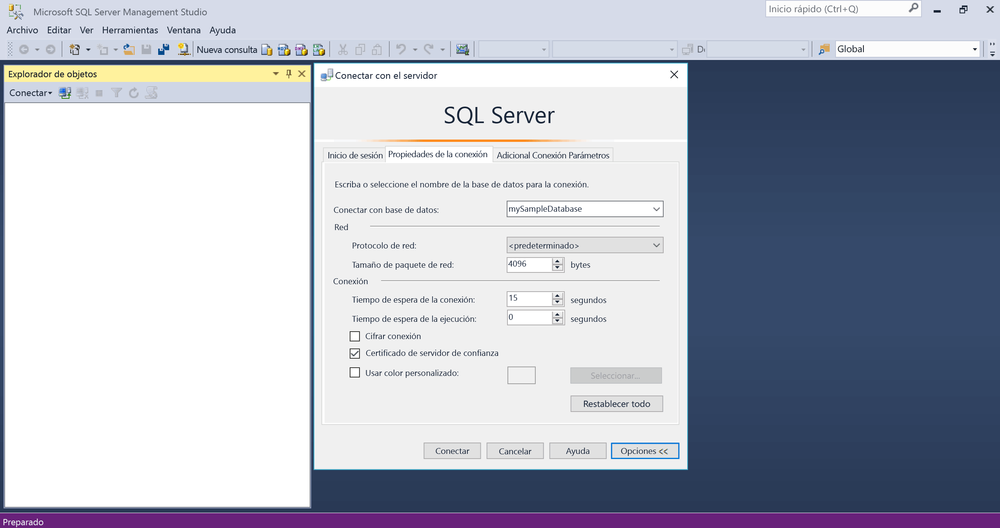

# <a name="design-your-first-azure-sql-database"></a><span data-ttu-id="bcac6-103">Diseño de la primera instancia de Azure SQL Database</span><span class="sxs-lookup"><span data-stu-id="bcac6-103">Design your first Azure SQL database</span></span>

<span data-ttu-id="bcac6-104">La base de datos de SQL Azure es un base de datos como un servicio relacional (DBaaS) Hola Microsoft Cloud ("Azure").</span><span class="sxs-lookup"><span data-stu-id="bcac6-104">Azure SQL Database is a relational database-as-a service (DBaaS) in hello Microsoft Cloud ("Azure").</span></span> <span data-ttu-id="bcac6-105">En este tutorial, aprenderá cómo toouse Hola portal de Azure y [SQL Server Management Studio](https://msdn.microsoft.com/library/ms174173.aspx) (SSMS) para:</span><span class="sxs-lookup"><span data-stu-id="bcac6-105">In this tutorial, you learn how toouse hello Azure portal and [SQL Server Management Studio](https://msdn.microsoft.com/library/ms174173.aspx) (SSMS) to:</span></span> 

> [!div class="checklist"]
> * <span data-ttu-id="bcac6-106">Crear una base de datos en hello portal de Azure</span><span class="sxs-lookup"><span data-stu-id="bcac6-106">Create a database in hello Azure portal</span></span>
> * <span data-ttu-id="bcac6-107">Configurar una regla de firewall de nivel de servidor en hello portal de Azure</span><span class="sxs-lookup"><span data-stu-id="bcac6-107">Set up a server-level firewall rule in hello Azure portal</span></span>
> * <span data-ttu-id="bcac6-108">Conectar la base de datos de toohello con SSMS</span><span class="sxs-lookup"><span data-stu-id="bcac6-108">Connect toohello database with SSMS</span></span>
> * <span data-ttu-id="bcac6-109">Crear tablas con SSMS</span><span class="sxs-lookup"><span data-stu-id="bcac6-109">Create tables with SSMS</span></span>
> * <span data-ttu-id="bcac6-110">Carga masiva de datos con BCP</span><span class="sxs-lookup"><span data-stu-id="bcac6-110">Bulk load data with BCP</span></span>
> * <span data-ttu-id="bcac6-111">Consultar los datos con SSMS</span><span class="sxs-lookup"><span data-stu-id="bcac6-111">Query that data with SSMS</span></span>
> * <span data-ttu-id="bcac6-112">Restaurar hello tooa de base de datos anterior [punto de restauración a un momento](sql-database-recovery-using-backups.md#point-in-time-restore) Hola portal de Azure</span><span class="sxs-lookup"><span data-stu-id="bcac6-112">Restore hello database tooa previous [point in time restore](sql-database-recovery-using-backups.md#point-in-time-restore) in hello Azure portal</span></span>

<span data-ttu-id="bcac6-113">Si no tiene una suscripción a Azure, cree una [cuenta gratuita](https://azure.microsoft.com/free/) antes de empezar.</span><span class="sxs-lookup"><span data-stu-id="bcac6-113">If you don't have an Azure subscription, [create a free account](https://azure.microsoft.com/free/) before you begin.</span></span>

## <a name="prerequisites"></a><span data-ttu-id="bcac6-114">Requisitos previos</span><span class="sxs-lookup"><span data-stu-id="bcac6-114">Prerequisites</span></span>

<span data-ttu-id="bcac6-115">toocomplete este tutorial, asegúrese de que ha instalado:</span><span class="sxs-lookup"><span data-stu-id="bcac6-115">toocomplete this tutorial, make sure you have installed:</span></span>
- <span data-ttu-id="bcac6-116">versión más reciente de Hola de [SQL Server Management Studio](https://msdn.microsoft.com/library/ms174173.aspx) (SSMS).</span><span class="sxs-lookup"><span data-stu-id="bcac6-116">hello newest version of [SQL Server Management Studio](https://msdn.microsoft.com/library/ms174173.aspx) (SSMS).</span></span>
- <span data-ttu-id="bcac6-117">versión más reciente de Hola de [BCP y SQLCMD](https://www.microsoft.com/download/details.aspx?id=36433).</span><span class="sxs-lookup"><span data-stu-id="bcac6-117">hello newest version of [BCP and SQLCMD](https://www.microsoft.com/download/details.aspx?id=36433).</span></span>

## <a name="log-in-toohello-azure-portal"></a><span data-ttu-id="bcac6-118">Inicie sesión en toohello portal de Azure</span><span class="sxs-lookup"><span data-stu-id="bcac6-118">Log in toohello Azure portal</span></span>

<span data-ttu-id="bcac6-119">Inicie sesión en toohello [portal de Azure](https://portal.azure.com/).</span><span class="sxs-lookup"><span data-stu-id="bcac6-119">Log in toohello [Azure portal](https://portal.azure.com/).</span></span>

## <a name="create-a-blank-sql-database"></a><span data-ttu-id="bcac6-120">Crear una instancia en blanco en SQL Database</span><span class="sxs-lookup"><span data-stu-id="bcac6-120">Create a blank SQL database</span></span>

<span data-ttu-id="bcac6-121">Se crea una instancia de Azure SQL Database con un conjunto definido de [recursos de proceso y almacenamiento](sql-database-service-tiers.md).</span><span class="sxs-lookup"><span data-stu-id="bcac6-121">An Azure SQL database is created with a defined set of [compute and storage resources](sql-database-service-tiers.md).</span></span> <span data-ttu-id="bcac6-122">base de datos de Hola se crea dentro de un [grupo de recursos de Azure](../azure-resource-manager/resource-group-overview.md) y en un [servidor lógico de base de datos de SQL Azure](sql-database-features.md).</span><span class="sxs-lookup"><span data-stu-id="bcac6-122">hello database is created within an [Azure resource group](../azure-resource-manager/resource-group-overview.md) and in an [Azure SQL Database logical server](sql-database-features.md).</span></span> 

<span data-ttu-id="bcac6-123">Siga estos toocreate pasos una base de datos SQL en blanco.</span><span class="sxs-lookup"><span data-stu-id="bcac6-123">Follow these steps toocreate a blank SQL database.</span></span> 

1. <span data-ttu-id="bcac6-124">Haga clic en hello **New** encontró el botón en la esquina izquierda superior de Hola de hello portal de Azure.</span><span class="sxs-lookup"><span data-stu-id="bcac6-124">Click hello **New** button found on hello upper left-hand corner of hello Azure portal.</span></span>

2. <span data-ttu-id="bcac6-125">Seleccione **bases de datos** de hello **New** página y seleccione **base de datos SQL** de hello **bases de datos** página.</span><span class="sxs-lookup"><span data-stu-id="bcac6-125">Select **Databases** from hello **New** page, and select **SQL Database** from hello **Databases** page.</span></span> 

   

3. <span data-ttu-id="bcac6-127">Rellenar formulario de la base de datos SQL de Hola con hello después de obtener información, tal como se muestra en hello anterior imagen:</span><span class="sxs-lookup"><span data-stu-id="bcac6-127">Fill out hello SQL Database form with hello following information, as shown on hello preceding image:</span></span>   

   | <span data-ttu-id="bcac6-128">Configuración</span><span class="sxs-lookup"><span data-stu-id="bcac6-128">Setting</span></span>       | <span data-ttu-id="bcac6-129">Valor sugerido</span><span class="sxs-lookup"><span data-stu-id="bcac6-129">Suggested value</span></span> | <span data-ttu-id="bcac6-130">Descripción</span><span class="sxs-lookup"><span data-stu-id="bcac6-130">Description</span></span> | 
   | ------------ | ------------------ | ------------------------------------------------- | 
   | <span data-ttu-id="bcac6-131">**Nombre de la base de datos**</span><span class="sxs-lookup"><span data-stu-id="bcac6-131">**Database name**</span></span> | <span data-ttu-id="bcac6-132">mySampleDatabase</span><span class="sxs-lookup"><span data-stu-id="bcac6-132">mySampleDatabase</span></span> | <span data-ttu-id="bcac6-133">Para conocer los nombres de base de datos válidos, consulte [Database Identifiers](https://docs.microsoft.com/sql/relational-databases/databases/database-identifiers) (Identificadores de base de datos).</span><span class="sxs-lookup"><span data-stu-id="bcac6-133">For valid database names, see [Database Identifiers](https://docs.microsoft.com/sql/relational-databases/databases/database-identifiers).</span></span> | 
   | <span data-ttu-id="bcac6-134">**Suscripción**</span><span class="sxs-lookup"><span data-stu-id="bcac6-134">**Subscription**</span></span> | <span data-ttu-id="bcac6-135">Su suscripción</span><span class="sxs-lookup"><span data-stu-id="bcac6-135">Your subscription</span></span>  | <span data-ttu-id="bcac6-136">Para más información acerca de sus suscripciones, consulte [Suscripciones](https://account.windowsazure.com/Subscriptions).</span><span class="sxs-lookup"><span data-stu-id="bcac6-136">For details about your subscriptions, see [Subscriptions](https://account.windowsazure.com/Subscriptions).</span></span> |
   | <span data-ttu-id="bcac6-137">**Grupos de recursos**</span><span class="sxs-lookup"><span data-stu-id="bcac6-137">**Resource group**</span></span> | <span data-ttu-id="bcac6-138">myResourceGroup</span><span class="sxs-lookup"><span data-stu-id="bcac6-138">myResourceGroup</span></span> | <span data-ttu-id="bcac6-139">Para conocer cuáles son los nombres de grupo de recursos válidos, consulte el artículo [Naming conventions](https://docs.microsoft.com/azure/architecture/best-practices/naming-conventions) (Convenciones de nomenclatura).</span><span class="sxs-lookup"><span data-stu-id="bcac6-139">For valid resource group names, see [Naming rules and restrictions](https://docs.microsoft.com/azure/architecture/best-practices/naming-conventions).</span></span> |
   | <span data-ttu-id="bcac6-140">**Seleccionar origen**</span><span class="sxs-lookup"><span data-stu-id="bcac6-140">**Select source**</span></span> | <span data-ttu-id="bcac6-141">Base de datos en blanco</span><span class="sxs-lookup"><span data-stu-id="bcac6-141">Blank database</span></span> | <span data-ttu-id="bcac6-142">Especifica que se debe crear una base de datos en blanco.</span><span class="sxs-lookup"><span data-stu-id="bcac6-142">Specifies that a blank database should be created.</span></span> |

4. <span data-ttu-id="bcac6-143">Haga clic en **Server** toocreate y configurar un servidor nuevo para la nueva base de datos.</span><span class="sxs-lookup"><span data-stu-id="bcac6-143">Click **Server** toocreate and configure a new server for your new database.</span></span> <span data-ttu-id="bcac6-144">Rellene hello **nuevo formulario server** con hello siguiente información:</span><span class="sxs-lookup"><span data-stu-id="bcac6-144">Fill out hello **New server form** with hello following information:</span></span> 

   | <span data-ttu-id="bcac6-145">Configuración</span><span class="sxs-lookup"><span data-stu-id="bcac6-145">Setting</span></span>       | <span data-ttu-id="bcac6-146">Valor sugerido</span><span class="sxs-lookup"><span data-stu-id="bcac6-146">Suggested value</span></span> | <span data-ttu-id="bcac6-147">Descripción</span><span class="sxs-lookup"><span data-stu-id="bcac6-147">Description</span></span> | 
   | ------------ | ------------------ | ------------------------------------------------- | 
   | <span data-ttu-id="bcac6-148">**Nombre del servidor**</span><span class="sxs-lookup"><span data-stu-id="bcac6-148">**Server name**</span></span> | <span data-ttu-id="bcac6-149">Cualquier nombre globalmente único</span><span class="sxs-lookup"><span data-stu-id="bcac6-149">Any globally unique name</span></span> | <span data-ttu-id="bcac6-150">Para conocer cuáles son los nombres de servidor válidos, consulte el artículo [Naming conventions](https://docs.microsoft.com/azure/architecture/best-practices/naming-conventions) (Convenciones de nomenclatura).</span><span class="sxs-lookup"><span data-stu-id="bcac6-150">For valid server names, see [Naming rules and restrictions](https://docs.microsoft.com/azure/architecture/best-practices/naming-conventions).</span></span> | 
   | <span data-ttu-id="bcac6-151">**Inicio de sesión del administrador del servidor**</span><span class="sxs-lookup"><span data-stu-id="bcac6-151">**Server admin login**</span></span> | <span data-ttu-id="bcac6-152">Cualquier nombre válido</span><span class="sxs-lookup"><span data-stu-id="bcac6-152">Any valid name</span></span> | <span data-ttu-id="bcac6-153">Para conocer los nombres de inicio de sesión válidos, consulte [Database Identifiers](https://docs.microsoft.com/sql/relational-databases/databases/database-identifiers) (Identificadores de base de datos).</span><span class="sxs-lookup"><span data-stu-id="bcac6-153">For valid login names, see [Database Identifiers](https://docs.microsoft.com/sql/relational-databases/databases/database-identifiers).</span></span>|
   | <span data-ttu-id="bcac6-154">**Password**</span><span class="sxs-lookup"><span data-stu-id="bcac6-154">**Password**</span></span> | <span data-ttu-id="bcac6-155">Cualquier contraseña válida</span><span class="sxs-lookup"><span data-stu-id="bcac6-155">Any valid password</span></span> | <span data-ttu-id="bcac6-156">La contraseña debe tener al menos 8 caracteres y debe contener caracteres de tres de las siguientes categorías de hello: caracteres en mayúsculas, caracteres en minúsculas, números y caracteres no alfanuméricos.</span><span class="sxs-lookup"><span data-stu-id="bcac6-156">Your password must have at least 8 characters and must contain characters from three of hello following categories: upper case characters, lower case characters, numbers, and non-alphanumeric characters.</span></span> |
   | <span data-ttu-id="bcac6-157">**Ubicación**</span><span class="sxs-lookup"><span data-stu-id="bcac6-157">**Location**</span></span> | <span data-ttu-id="bcac6-158">Cualquier ubicación válida</span><span class="sxs-lookup"><span data-stu-id="bcac6-158">Any valid location</span></span> | <span data-ttu-id="bcac6-159">Para obtener información acerca de las regiones, consulte [Regiones de Azure](https://azure.microsoft.com/regions/).</span><span class="sxs-lookup"><span data-stu-id="bcac6-159">For information about regions, see [Azure Regions](https://azure.microsoft.com/regions/).</span></span> |

   

5. <span data-ttu-id="bcac6-161">Haga clic en **Seleccionar**.</span><span class="sxs-lookup"><span data-stu-id="bcac6-161">Click **Select**.</span></span>

6. <span data-ttu-id="bcac6-162">Haga clic en **tarifa** toospecify Hola nivel y rendimiento de nivel de servicio para la nueva base de datos.</span><span class="sxs-lookup"><span data-stu-id="bcac6-162">Click **Pricing tier** toospecify hello service tier and performance level for your new database.</span></span> <span data-ttu-id="bcac6-163">Para este tutorial, seleccione **20 DTU** y **250** GB de almacenamiento.</span><span class="sxs-lookup"><span data-stu-id="bcac6-163">For this tutorial, select **20 DTUs** and **250** GB of storage.</span></span>

   

7. <span data-ttu-id="bcac6-165">Haga clic en **Apply**.</span><span class="sxs-lookup"><span data-stu-id="bcac6-165">Click **Apply**.</span></span>  

8. <span data-ttu-id="bcac6-166">Seleccione un **intercalación** de base de datos en blanco de hello (para este tutorial, el valor predeterminado de Hola de uso).</span><span class="sxs-lookup"><span data-stu-id="bcac6-166">Select a **collation** for hello blank database (for this tutorial, use hello default value).</span></span> <span data-ttu-id="bcac6-167">Para más información sobre las intercalaciones, vea [Collations](https://docs.microsoft.com/sql/t-sql/statements/collations) (Intercalaciones)</span><span class="sxs-lookup"><span data-stu-id="bcac6-167">For more information about collations, see [Collations](https://docs.microsoft.com/sql/t-sql/statements/collations)</span></span>

9. <span data-ttu-id="bcac6-168">Haga clic en **crear** base de datos de tooprovision Hola.</span><span class="sxs-lookup"><span data-stu-id="bcac6-168">Click **Create** tooprovision hello database.</span></span> <span data-ttu-id="bcac6-169">Aprovisionamiento dura aproximadamente un minuto y Media toocomplete.</span><span class="sxs-lookup"><span data-stu-id="bcac6-169">Provisioning takes about a minute and a half toocomplete.</span></span> 

10. <span data-ttu-id="bcac6-170">En la barra de herramientas de hello, haga clic en **notificaciones** toomonitor proceso de implementación de Hola.</span><span class="sxs-lookup"><span data-stu-id="bcac6-170">On hello toolbar, click **Notifications** toomonitor hello deployment process.</span></span>

   

## <a name="create-a-server-level-firewall-rule"></a><span data-ttu-id="bcac6-172">Crear una regla de firewall de nivel de servidor</span><span class="sxs-lookup"><span data-stu-id="bcac6-172">Create a server-level firewall rule</span></span>

<span data-ttu-id="bcac6-173">Hola servicio de base de datos SQL crea un firewall en hello-nivel de servidor que impide que las aplicaciones externas y las herramientas de conectar toohello server o las bases de datos en el servidor de Hola a menos que se crea una regla de firewall tooopen firewall de Hola para direcciones IP concretas.</span><span class="sxs-lookup"><span data-stu-id="bcac6-173">hello SQL Database service creates a firewall at hello server-level that prevents external applications and tools from connecting toohello server or any databases on hello server unless a firewall rule is created tooopen hello firewall for specific IP addresses.</span></span> <span data-ttu-id="bcac6-174">Siga estos pasos toocreate una [regla de firewall de nivel de servidor de base de datos SQL](sql-database-firewall-configure.md) para direcciones IP de su cliente y habilitar la conectividad externa a través de firewall de base de datos SQL de Hola para sólo la dirección IP.</span><span class="sxs-lookup"><span data-stu-id="bcac6-174">Follow these steps toocreate a [SQL Database server-level firewall rule](sql-database-firewall-configure.md) for your client's IP address and enable external connectivity through hello SQL Database firewall for your IP address only.</span></span> 

> [!NOTE]
> <span data-ttu-id="bcac6-175">SQL Database se comunica a través del puerto 1433.</span><span class="sxs-lookup"><span data-stu-id="bcac6-175">SQL Database communicates over port 1433.</span></span> <span data-ttu-id="bcac6-176">Si está tratando de tooconnect desde dentro de una red corporativa, es posible que firewall de su red no permite el tráfico saliente en el puerto 1433.</span><span class="sxs-lookup"><span data-stu-id="bcac6-176">If you are trying tooconnect from within a corporate network, outbound traffic over port 1433 may not be allowed by your network's firewall.</span></span> <span data-ttu-id="bcac6-177">Si es así, no se puede conectar el servidor de base de datos de SQL Azure tooyour a menos que el departamento de TI abre el puerto 1433.</span><span class="sxs-lookup"><span data-stu-id="bcac6-177">If so, you cannot connect tooyour Azure SQL Database server unless your IT department opens port 1433.</span></span>
>

1. <span data-ttu-id="bcac6-178">Una vez finalizada la implementación de hello, haga clic en **bases de datos SQL** del menú izquierdo de hello y, a continuación, haga clic en **mySampleDatabase** en hello **bases de datos SQL** página.</span><span class="sxs-lookup"><span data-stu-id="bcac6-178">After hello deployment completes, click **SQL databases** from hello left-hand menu and then click **mySampleDatabase** on hello **SQL databases** page.</span></span> <span data-ttu-id="bcac6-179">página de información general para abrir el base de datos, que muestra que Hola totalmente Hello calificado nombre del servidor (como **mynewserver20170313.database.windows.net**) y proporciona opciones para otra configuración.</span><span class="sxs-lookup"><span data-stu-id="bcac6-179">hello overview page for your database opens, showing you hello fully qualified server name (such as **mynewserver20170313.database.windows.net**) and provides options for further configuration.</span></span> <span data-ttu-id="bcac6-180">Copie dicho nombre, ya que lo tendrá que usar más adelante,</span><span class="sxs-lookup"><span data-stu-id="bcac6-180">Copy this fully qualified server name for use later.</span></span>

   > [!IMPORTANT]
   > <span data-ttu-id="bcac6-181">Necesitará este servidor de tooyour de tooconnect de nombre completo del servidor y sus bases de datos en las siguientes guías de inicio rápidos.</span><span class="sxs-lookup"><span data-stu-id="bcac6-181">You need this fully qualified server name tooconnect tooyour server and its databases in subsequent quick starts.</span></span>
   > 

    

2. <span data-ttu-id="bcac6-183">Haga clic en **Configurar firewall de servidor** de barra de herramientas de hello tal y como se muestra en la imagen anterior de Hola.</span><span class="sxs-lookup"><span data-stu-id="bcac6-183">Click **Set server firewall** on hello toolbar as shown in hello previous image.</span></span> <span data-ttu-id="bcac6-184">Hola **configuración del Firewall** se abre la página servidor de base de datos de SQL de Hola.</span><span class="sxs-lookup"><span data-stu-id="bcac6-184">hello **Firewall settings** page for hello SQL Database server opens.</span></span> 

    


3. <span data-ttu-id="bcac6-186">Haga clic en **agregar dirección IP del cliente** en tooadd de barra de herramientas de hello tooa nueva regla de firewall de direcciones de la IP actual.</span><span class="sxs-lookup"><span data-stu-id="bcac6-186">Click **Add client IP** on hello toolbar tooadd your current IP address tooa new firewall rule.</span></span> <span data-ttu-id="bcac6-187">La regla de firewall puede abrir el puerto 1433 para una única dirección IP o un intervalo de direcciones IP.</span><span class="sxs-lookup"><span data-stu-id="bcac6-187">A firewall rule can open port 1433 for a single IP address or a range of IP addresses.</span></span>

4. <span data-ttu-id="bcac6-188">Haga clic en **Guardar**.</span><span class="sxs-lookup"><span data-stu-id="bcac6-188">Click **Save**.</span></span> <span data-ttu-id="bcac6-189">Se crea una regla de firewall de nivel de servidor para la dirección IP actual abrir el puerto 1433 en el servidor lógico Hola.</span><span class="sxs-lookup"><span data-stu-id="bcac6-189">A server-level firewall rule is created for your current IP address opening port 1433 on hello logical server.</span></span>

    

4. <span data-ttu-id="bcac6-191">Haga clic en **Aceptar** y, a continuación, cierre hello **configuración del Firewall** página.</span><span class="sxs-lookup"><span data-stu-id="bcac6-191">Click **OK** and then close hello **Firewall settings** page.</span></span>

<span data-ttu-id="bcac6-192">Ahora puede conectarse toohello servidor de base de datos SQL y sus bases de datos mediante SQL Server Management Studio u otra herramienta de su elección de esta dirección IP con cuenta de administrador de servidor hello creado anteriormente.</span><span class="sxs-lookup"><span data-stu-id="bcac6-192">You can now connect toohello SQL Database server and its databases using SQL Server Management Studio or another tool of your choice from this IP address using hello server admin account created previously.</span></span>

> [!IMPORTANT]
> <span data-ttu-id="bcac6-193">De forma predeterminada, el acceso a través de firewall de base de datos SQL de hello está habilitado para todos los servicios de Azure.</span><span class="sxs-lookup"><span data-stu-id="bcac6-193">By default, access through hello SQL Database firewall is enabled for all Azure services.</span></span> <span data-ttu-id="bcac6-194">Haga clic en **OFF** en este toodisable de página para todos los servicios de Azure.</span><span class="sxs-lookup"><span data-stu-id="bcac6-194">Click **OFF** on this page toodisable for all Azure services.</span></span>

## <a name="sql-server-connection-information"></a><span data-ttu-id="bcac6-195">Información de conexión de SQL server</span><span class="sxs-lookup"><span data-stu-id="bcac6-195">SQL server connection information</span></span>

<span data-ttu-id="bcac6-196">Obtener nombre de servidor completo de hello para el servidor de base de datos de SQL Azure en hello portal de Azure.</span><span class="sxs-lookup"><span data-stu-id="bcac6-196">Get hello fully qualified server name for your Azure SQL Database server in hello Azure portal.</span></span> <span data-ttu-id="bcac6-197">Usa Hola completo nombre tooconnect tooyour server utilizando SQL Server Management Studio.</span><span class="sxs-lookup"><span data-stu-id="bcac6-197">You use hello fully qualified server name tooconnect tooyour server using SQL Server Management Studio.</span></span>

1. <span data-ttu-id="bcac6-198">Inicie sesión en toohello [portal de Azure](https://portal.azure.com/).</span><span class="sxs-lookup"><span data-stu-id="bcac6-198">Log in toohello [Azure portal](https://portal.azure.com/).</span></span>
2. <span data-ttu-id="bcac6-199">Seleccione **bases de datos SQL** desde el menú de la izquierda, hello y haga clic en la base de datos en hello **bases de datos SQL** página.</span><span class="sxs-lookup"><span data-stu-id="bcac6-199">Select **SQL Databases** from hello left-hand menu, and click your database on hello **SQL databases** page.</span></span> 
3. <span data-ttu-id="bcac6-200">Hola **Essentials** panel Hola página del portal Azure para la base de datos, busque y, a continuación, copie hello **nombre del servidor**.</span><span class="sxs-lookup"><span data-stu-id="bcac6-200">In hello **Essentials** pane in hello Azure portal page for your database, locate and then copy hello **Server name**.</span></span>

   

## <a name="connect-toohello-database-with-ssms"></a><span data-ttu-id="bcac6-202">Conectar la base de datos de toohello con SSMS</span><span class="sxs-lookup"><span data-stu-id="bcac6-202">Connect toohello database with SSMS</span></span>

<span data-ttu-id="bcac6-203">Use [SQL Server Management Studio](https://docs.microsoft.com/sql/ssms/sql-server-management-studio-ssms) tooestablish un servidor de base de datos de SQL Azure tooyour de conexión.</span><span class="sxs-lookup"><span data-stu-id="bcac6-203">Use [SQL Server Management Studio](https://docs.microsoft.com/sql/ssms/sql-server-management-studio-ssms) tooestablish a connection tooyour Azure SQL Database server.</span></span>

1. <span data-ttu-id="bcac6-204">Abra SQL Server Management Studio.</span><span class="sxs-lookup"><span data-stu-id="bcac6-204">Open SQL Server Management Studio.</span></span>

2. <span data-ttu-id="bcac6-205">Hola **conectar tooServer** diálogo cuadro, escriba Hola siguiente información:</span><span class="sxs-lookup"><span data-stu-id="bcac6-205">In hello **Connect tooServer** dialog box, enter hello following information:</span></span>

   | <span data-ttu-id="bcac6-206">Configuración</span><span class="sxs-lookup"><span data-stu-id="bcac6-206">Setting</span></span>       | <span data-ttu-id="bcac6-207">Valor sugerido</span><span class="sxs-lookup"><span data-stu-id="bcac6-207">Suggested value</span></span> | <span data-ttu-id="bcac6-208">Descripción</span><span class="sxs-lookup"><span data-stu-id="bcac6-208">Description</span></span> | 
   | ------------ | ------------------ | ------------------------------------------------- | 
   | <span data-ttu-id="bcac6-209">Tipo de servidor</span><span class="sxs-lookup"><span data-stu-id="bcac6-209">Server type</span></span> | <span data-ttu-id="bcac6-210">Motor de base de datos</span><span class="sxs-lookup"><span data-stu-id="bcac6-210">Database engine</span></span> | <span data-ttu-id="bcac6-211">Este valor es obligatorio</span><span class="sxs-lookup"><span data-stu-id="bcac6-211">This value is required</span></span> |
   | <span data-ttu-id="bcac6-212">Nombre de servidor</span><span class="sxs-lookup"><span data-stu-id="bcac6-212">Server name</span></span> | <span data-ttu-id="bcac6-213">nombre completo del servidor de Hola</span><span class="sxs-lookup"><span data-stu-id="bcac6-213">hello fully qualified server name</span></span> | <span data-ttu-id="bcac6-214">Hello nombre debe ser algo parecido a esto: **mynewserver20170313.database.windows.net**.</span><span class="sxs-lookup"><span data-stu-id="bcac6-214">hello name should be something like this: **mynewserver20170313.database.windows.net**.</span></span> |
   | <span data-ttu-id="bcac6-215">Autenticación</span><span class="sxs-lookup"><span data-stu-id="bcac6-215">Authentication</span></span> | <span data-ttu-id="bcac6-216">Autenticación de SQL Server</span><span class="sxs-lookup"><span data-stu-id="bcac6-216">SQL Server Authentication</span></span> | <span data-ttu-id="bcac6-217">Autenticación de SQL es Hola único tipo de autenticación que hemos configurado en este tutorial.</span><span class="sxs-lookup"><span data-stu-id="bcac6-217">SQL Authentication is hello only authentication type that we have configured in this tutorial.</span></span> |
   | <span data-ttu-id="bcac6-218">Inicio de sesión</span><span class="sxs-lookup"><span data-stu-id="bcac6-218">Login</span></span> | <span data-ttu-id="bcac6-219">cuenta de administrador del servidor de Hola</span><span class="sxs-lookup"><span data-stu-id="bcac6-219">hello server admin account</span></span> | <span data-ttu-id="bcac6-220">Esta es la cuenta de hello que especificó cuando creó el servidor de Hola.</span><span class="sxs-lookup"><span data-stu-id="bcac6-220">This is hello account that you specified when you created hello server.</span></span> |
   | <span data-ttu-id="bcac6-221">Password</span><span class="sxs-lookup"><span data-stu-id="bcac6-221">Password</span></span> | <span data-ttu-id="bcac6-222">contraseña de Hello para la cuenta de administrador del servidor</span><span class="sxs-lookup"><span data-stu-id="bcac6-222">hello password for your server admin account</span></span> | <span data-ttu-id="bcac6-223">Esta es la contraseña de Hola que especificó cuando creó el servidor de Hola.</span><span class="sxs-lookup"><span data-stu-id="bcac6-223">This is hello password that you specified when you created hello server.</span></span> |

   

3. <span data-ttu-id="bcac6-225">Haga clic en **opciones** en hello **conectar tooserver** cuadro de diálogo.</span><span class="sxs-lookup"><span data-stu-id="bcac6-225">Click **Options** in hello **Connect tooserver** dialog box.</span></span> <span data-ttu-id="bcac6-226">Hola **conectar toodatabase** sección, escriba **mySampleDatabase** base de datos de tooconnect toothis.</span><span class="sxs-lookup"><span data-stu-id="bcac6-226">In hello **Connect toodatabase** section, enter **mySampleDatabase** tooconnect toothis database.</span></span>

     

4. <span data-ttu-id="bcac6-228">Haga clic en **Conectar**.</span><span class="sxs-lookup"><span data-stu-id="bcac6-228">Click **Connect**.</span></span> <span data-ttu-id="bcac6-229">Abre la ventana del explorador de objetos de Hello en SSMS.</span><span class="sxs-lookup"><span data-stu-id="bcac6-229">hello Object Explorer window opens in SSMS.</span></span> 

5. <span data-ttu-id="bcac6-230">En el Explorador de objetos, expanda **bases de datos** y, a continuación, expanda **mySampleDatabase** tooview objetos de hello en la base de datos de ejemplo de Hola.</span><span class="sxs-lookup"><span data-stu-id="bcac6-230">In Object Explorer, expand **Databases** and then expand **mySampleDatabase** tooview hello objects in hello sample database.</span></span>

     

## <a name="create-tables-in-hello-database"></a><span data-ttu-id="bcac6-232">Crear tablas de base de datos de Hola</span><span class="sxs-lookup"><span data-stu-id="bcac6-232">Create tables in hello database</span></span> 

<span data-ttu-id="bcac6-233">Cree un esquema de base de datos con cuatro tablas que modelan un sistema de administración de estudiantes para universidades con [Transact-SQL](https://docs.microsoft.com/sql/t-sql/language-reference):</span><span class="sxs-lookup"><span data-stu-id="bcac6-233">Create a database schema with four tables that model a student management system for universities using [Transact-SQL](https://docs.microsoft.com/sql/t-sql/language-reference):</span></span>

- <span data-ttu-id="bcac6-234">Persona</span><span class="sxs-lookup"><span data-stu-id="bcac6-234">Person</span></span>
- <span data-ttu-id="bcac6-235">Curso</span><span class="sxs-lookup"><span data-stu-id="bcac6-235">Course</span></span>
- <span data-ttu-id="bcac6-236">Estudiante</span><span class="sxs-lookup"><span data-stu-id="bcac6-236">Student</span></span>
- <span data-ttu-id="bcac6-237">Crédito que modela un sistema de administración de estudiantes para universidades</span><span class="sxs-lookup"><span data-stu-id="bcac6-237">Credit that model a student management system for universities</span></span>

<span data-ttu-id="bcac6-238">Hello siguiente diagrama muestra cómo estas tablas están relacionada tooeach otro.</span><span class="sxs-lookup"><span data-stu-id="bcac6-238">hello following diagram shows how these tables are related tooeach other.</span></span> <span data-ttu-id="bcac6-239">Algunas de estas tablas hacen referencia a columnas de otras tablas.</span><span class="sxs-lookup"><span data-stu-id="bcac6-239">Some of these tables reference columns in other tables.</span></span> <span data-ttu-id="bcac6-240">Por ejemplo, la tabla de estudiantes Hola hace referencia hello **PersonId** columna de hello **persona** tabla.</span><span class="sxs-lookup"><span data-stu-id="bcac6-240">For example, hello Student table references hello **PersonId** column of hello **Person** table.</span></span> <span data-ttu-id="bcac6-241">Estudio Hola diagrama toounderstand cómo Hola tablas en este tutorial están relacionado tooone otro.</span><span class="sxs-lookup"><span data-stu-id="bcac6-241">Study hello diagram toounderstand how hello tables in this tutorial are related tooone another.</span></span> <span data-ttu-id="bcac6-242">Para obtener información detallada sobre cómo toocreate tablas de base de datos eficaz, vea [crear tablas de base de datos eficaz](https://msdn.microsoft.com/library/cc505842.aspx).</span><span class="sxs-lookup"><span data-stu-id="bcac6-242">For an in-depth look at how toocreate effective database tables, see [Create effective database tables](https://msdn.microsoft.com/library/cc505842.aspx).</span></span> <span data-ttu-id="bcac6-243">Para obtener información sobre cómo elegir tipos de datos, vea [Data types](https://docs.microsoft.com/sql/t-sql/data-types/data-types-transact-sql) (Tipos de datos).</span><span class="sxs-lookup"><span data-stu-id="bcac6-243">For information about choosing data types, see [Data types](https://docs.microsoft.com/sql/t-sql/data-types/data-types-transact-sql).</span></span>

> [!NOTE]
> <span data-ttu-id="bcac6-244">También puede usar hello [Diseñador de tablas en SQL Server Management Studio](https://msdn.microsoft.com/library/hh272695.aspx) toocreate y diseñar las tablas.</span><span class="sxs-lookup"><span data-stu-id="bcac6-244">You can also use hello [table designer in SQL Server Management Studio](https://msdn.microsoft.com/library/hh272695.aspx) toocreate and design your tables.</span></span> 


1. <span data-ttu-id="bcac6-246">En el Explorador de objetos, haga clic con el botón derecho en **mySampleDatabase** y luego en **Nueva consulta**.</span><span class="sxs-lookup"><span data-stu-id="bcac6-246">In Object Explorer, right-click **mySampleDatabase** and click **New Query**.</span></span> <span data-ttu-id="bcac6-247">Abre una ventana de consulta en blanco que es conectado tooyour base de datos.</span><span class="sxs-lookup"><span data-stu-id="bcac6-247">A blank query window opens that is connected tooyour database.</span></span>

2. <span data-ttu-id="bcac6-248">En la ventana de consulta de hello, ejecute hello toocreate cuatro tablas de consulta en la base de datos siguientes:</span><span class="sxs-lookup"><span data-stu-id="bcac6-248">In hello query window, execute hello following query toocreate four tables in your database:</span></span> 

   ```sql 
   -- Create Person table

   CREATE TABLE Person
   (
   PersonId   INT IDENTITY PRIMARY KEY,
   FirstName   NVARCHAR(128) NOT NULL,
   MiddelInitial NVARCHAR(10),
   LastName   NVARCHAR(128) NOT NULL,
   DateOfBirth   DATE NOT NULL
   )
   
   -- Create Student table
 
   CREATE TABLE Student
   (
   StudentId INT IDENTITY PRIMARY KEY,
   PersonId  INT REFERENCES Person (PersonId),
   Email   NVARCHAR(256)
   )
   
   -- Create Course table
 
   CREATE TABLE Course
   (
   CourseId  INT IDENTITY PRIMARY KEY,
   Name   NVARCHAR(50) NOT NULL,
   Teacher   NVARCHAR(256) NOT NULL
   ) 

   -- Create Credit table
 
   CREATE TABLE Credit
   (
   StudentId   INT REFERENCES Student (StudentId),
   CourseId   INT REFERENCES Course (CourseId),
   Grade   DECIMAL(5,2) CHECK (Grade <= 100.00),
   Attempt   TINYINT,
   CONSTRAINT  [UQ_studentgrades] UNIQUE CLUSTERED
   (
   StudentId, CourseId, Grade, Attempt
   )
   )
   ```

   

3. <span data-ttu-id="bcac6-250">Expanda el nodo de 'tablas' de hello en tablas Hola SQL Server Management Studio Object explorer toosee Hola que ha creado.</span><span class="sxs-lookup"><span data-stu-id="bcac6-250">Expand hello 'tables' node in hello SQL Server Management Studio Object explorer toosee hello tables you created.</span></span>

   

## <a name="load-data-into-hello-tables"></a><span data-ttu-id="bcac6-252">Cargar datos en tablas de Hola</span><span class="sxs-lookup"><span data-stu-id="bcac6-252">Load data into hello tables</span></span>

1. <span data-ttu-id="bcac6-253">Cree una carpeta denominada **SampleTableData** en los datos de ejemplo de toostore de carpeta de descargas para la base de datos.</span><span class="sxs-lookup"><span data-stu-id="bcac6-253">Create a folder called **SampleTableData** in your Downloads folder toostore sample data for your database.</span></span> 

2. <span data-ttu-id="bcac6-254">Siguiente de hello contextual vincula y guardarlos en hello **SampleTableData** carpeta.</span><span class="sxs-lookup"><span data-stu-id="bcac6-254">Right-click hello following links and save them into hello **SampleTableData** folder.</span></span> 

   - [<span data-ttu-id="bcac6-255">SampleCourseData</span><span class="sxs-lookup"><span data-stu-id="bcac6-255">SampleCourseData</span></span>](https://sqldbtutorial.blob.core.windows.net/tutorials/SampleCourseData)
   - [<span data-ttu-id="bcac6-256">SamplePersonData</span><span class="sxs-lookup"><span data-stu-id="bcac6-256">SamplePersonData</span></span>](https://sqldbtutorial.blob.core.windows.net/tutorials/SamplePersonData)
   - [<span data-ttu-id="bcac6-257">SampleStudentData</span><span class="sxs-lookup"><span data-stu-id="bcac6-257">SampleStudentData</span></span>](https://sqldbtutorial.blob.core.windows.net/tutorials/SampleStudentData)
   - [<span data-ttu-id="bcac6-258">SampleCreditData</span><span class="sxs-lookup"><span data-stu-id="bcac6-258">SampleCreditData</span></span>](https://sqldbtutorial.blob.core.windows.net/tutorials/SampleCreditData)

3. <span data-ttu-id="bcac6-259">Abra una ventana del símbolo del sistema y desplazarse por las carpetas de SampleTableData toohello.</span><span class="sxs-lookup"><span data-stu-id="bcac6-259">Open a command prompt window and navigate toohello SampleTableData folder.</span></span>

4. <span data-ttu-id="bcac6-260">Ejecutar Hola después de datos de ejemplo de comandos tooinsert en tablas de hello reemplazando los valores de hello para **ServerName**, **DatabaseName**, **nombre de usuario**y **Contraseña** con valores de hello para su entorno.</span><span class="sxs-lookup"><span data-stu-id="bcac6-260">Execute hello following commands tooinsert sample data into hello tables replacing hello values for **ServerName**, **DatabaseName**, **UserName**, and **Password** with hello values for your environment.</span></span>
  
   ```bcp
   bcp Course in SampleCourseData -S <ServerName>.database.windows.net -d <DatabaseName> -U <Username> -P <password> -q -c -t ","
   bcp Person in SamplePersonData -S <ServerName>.database.windows.net -d <DatabaseName> -U <Username> -P <password> -q -c -t ","
   bcp Student in SampleStudentData -S <ServerName>.database.windows.net -d <DatabaseName> -U <Username> -P <password> -q -c -t ","
   bcp Credit in SampleCreditData -S <ServerName>.database.windows.net -d <DatabaseName> -U <Username> -P <password> -q -c -t ","
   ```

<span data-ttu-id="bcac6-261">Ahora se hayan cargado los datos de ejemplo en las tablas de Hola que creó anteriormente.</span><span class="sxs-lookup"><span data-stu-id="bcac6-261">You have now loaded sample data into hello tables you created earlier.</span></span>

## <a name="query-data"></a><span data-ttu-id="bcac6-262">Datos de consulta</span><span class="sxs-lookup"><span data-stu-id="bcac6-262">Query data</span></span>

<span data-ttu-id="bcac6-263">Ejecute hello siguientes información tooretrieve de las consultas de tablas de base de datos de Hola.</span><span class="sxs-lookup"><span data-stu-id="bcac6-263">Execute hello following queries tooretrieve information from hello database tables.</span></span> <span data-ttu-id="bcac6-264">Vea [escribir consultas SQL](https://technet.microsoft.com/library/bb264565.aspx) toolearn más acerca de cómo escribir consultas SQL.</span><span class="sxs-lookup"><span data-stu-id="bcac6-264">See [Writing SQL Queries](https://technet.microsoft.com/library/bb264565.aspx) toolearn more about writing SQL queries.</span></span> <span data-ttu-id="bcac6-265">consulta primera Hola combina todas las cuatro tablas toofind todos los estudiantes de hello imparten por ' Dominick Pope' que tienen una puntuación superior al 75% de su clase.</span><span class="sxs-lookup"><span data-stu-id="bcac6-265">hello first query joins all four tables toofind all hello students taught by 'Dominick Pope' who have a grade higher than 75% in his class.</span></span> <span data-ttu-id="bcac6-266">segunda consulta de Hello combina las cuatro tablas y busca todos los cursos en los que nunca se ha inscrito 'Noe Coleman'.</span><span class="sxs-lookup"><span data-stu-id="bcac6-266">hello second query joins all four tables and finds all courses in which 'Noe Coleman' has ever enrolled.</span></span>

1. <span data-ttu-id="bcac6-267">En una ventana de consulta de SQL Server Management Studio, ejecute hello después de consulta:</span><span class="sxs-lookup"><span data-stu-id="bcac6-267">In a SQL Server Management Studio query window, execute hello following query:</span></span>

   ```sql 
   -- Find hello students taught by Dominick Pope who have a grade higher than 75%

   SELECT  person.FirstName,
   person.LastName,
   course.Name,
   credit.Grade
   FROM  Person AS person
   INNER JOIN Student AS student ON person.PersonId = student.PersonId
   INNER JOIN Credit AS credit ON student.StudentId = credit.StudentId
   INNER JOIN Course AS course ON credit.CourseId = course.courseId
   WHERE course.Teacher = 'Dominick Pope' 
   AND Grade > 75
   ```

2. <span data-ttu-id="bcac6-268">En una ventana de consulta de SQL Server Management Studio, ejecute la siguiente consulta:</span><span class="sxs-lookup"><span data-stu-id="bcac6-268">In a SQL Server Management Studio query window, execute following query:</span></span>

   ```sql
   -- Find all hello courses in which Noe Coleman has ever enrolled

   SELECT  course.Name,
   course.Teacher,
   credit.Grade
   FROM  Course AS course
   INNER JOIN Credit AS credit ON credit.CourseId = course.CourseId
   INNER JOIN Student AS student ON student.StudentId = credit.StudentId
   INNER JOIN Person AS person ON person.PersonId = student.PersonId
   WHERE person.FirstName = 'Noe'
   AND person.LastName = 'Coleman'
   ```

## <a name="restore-a-database-tooa-previous-point-in-time"></a><span data-ttu-id="bcac6-269">Restaurar un punto anterior de tooa de base de datos en el tiempo</span><span class="sxs-lookup"><span data-stu-id="bcac6-269">Restore a database tooa previous point in time</span></span>

<span data-ttu-id="bcac6-270">Imagine que ha eliminado accidentalmente una tabla.</span><span class="sxs-lookup"><span data-stu-id="bcac6-270">Imagine you have accidentally deleted a table.</span></span> <span data-ttu-id="bcac6-271">No se puede recuperar con facilidad.</span><span class="sxs-lookup"><span data-stu-id="bcac6-271">This is something you cannot easily recover from.</span></span> <span data-ttu-id="bcac6-272">La base de datos de SQL Azure permite toogo tooany atrás punto en el tiempo en hello última los días de too35 y restaurar este punto de la nueva base de datos de tiempo tooa.</span><span class="sxs-lookup"><span data-stu-id="bcac6-272">Azure SQL Database allows you toogo back tooany point in time in hello last up too35 days and restore this point in time tooa new database.</span></span> <span data-ttu-id="bcac6-273">Puede usar este toorecover de base de datos los datos eliminados.</span><span class="sxs-lookup"><span data-stu-id="bcac6-273">You can you this database toorecover your deleted data.</span></span> <span data-ttu-id="bcac6-274">Hello pasos siguientes restauración punto de tooa de base de datos de ejemplo de Hola antes de que se agregaron Hola tablas.</span><span class="sxs-lookup"><span data-stu-id="bcac6-274">hello following steps restore hello sample database tooa point before hello tables were added.</span></span>

1. <span data-ttu-id="bcac6-275">En la página de base de datos SQL de hello para la base de datos, haga clic en **restaurar** en la barra de herramientas de Hola.</span><span class="sxs-lookup"><span data-stu-id="bcac6-275">On hello SQL Database page for your database, click **Restore** on hello toolbar.</span></span> <span data-ttu-id="bcac6-276">Hola **restaurar** se abre la página.</span><span class="sxs-lookup"><span data-stu-id="bcac6-276">hello **Restore** page opens.</span></span>

   

2. <span data-ttu-id="bcac6-278">Rellene hello **restaurar** formulario con la información de hello necesario:</span><span class="sxs-lookup"><span data-stu-id="bcac6-278">Fill out hello **Restore** form with hello required information:</span></span>
    * <span data-ttu-id="bcac6-279">Nombre de la base de datos: escriba un nombre para la base de datos</span><span class="sxs-lookup"><span data-stu-id="bcac6-279">Database name: Provide a database name</span></span> 
    * <span data-ttu-id="bcac6-280">En un momento: Seleccione hello **en un momento** ficha en forma de restauración de Hola</span><span class="sxs-lookup"><span data-stu-id="bcac6-280">Point-in-time: Select hello **Point-in-time** tab on hello Restore form</span></span> 
    * <span data-ttu-id="bcac6-281">Punto de restauración: seleccionar una hora que se produce antes de cambia base de datos de Hola</span><span class="sxs-lookup"><span data-stu-id="bcac6-281">Restore point: Select a time that occurs before hello database was changed</span></span>
    * <span data-ttu-id="bcac6-282">Servidor de destino: no puede modificar este valor cuando restaura una base de datos</span><span class="sxs-lookup"><span data-stu-id="bcac6-282">Target server: You cannot change this value when restoring a database</span></span> 
    * <span data-ttu-id="bcac6-283">Grupo de bases de datos elásticas: seleccione **Ninguno**</span><span class="sxs-lookup"><span data-stu-id="bcac6-283">Elastic database pool: Select **None**</span></span>  
    * <span data-ttu-id="bcac6-284">Plan de tarifa: seleccione **20 DTU** y **250 GB** de almacenamiento</span><span class="sxs-lookup"><span data-stu-id="bcac6-284">Pricing tier: Select **20 DTUs** and **250 GB** of storage.</span></span>

   

3. <span data-ttu-id="bcac6-286">Haga clic en **Aceptar** toorestore Hola base de datos demasiado[tooa punto de restauración tiempo](sql-database-recovery-using-backups.md#point-in-time-restore) antes de que se agregaron Hola tablas.</span><span class="sxs-lookup"><span data-stu-id="bcac6-286">Click **OK** toorestore hello database too[restore tooa point in time](sql-database-recovery-using-backups.md#point-in-time-restore) before hello tables were added.</span></span> <span data-ttu-id="bcac6-287">Restauración tooa otro punto de base de datos en el tiempo, crea una base de datos duplicado en hello mismo servidor que la base de datos original de Hola a partir de punto de hello en el tiempo especifique, siempre que esté dentro del período de retención de hello para el [nivel de servicio](sql-database-service-tiers.md).</span><span class="sxs-lookup"><span data-stu-id="bcac6-287">Restoring a database tooa different point in time creates a duplicate database in hello same server as hello original database as of hello point in time you specify, as long as it is within hello retention period for your [service tier](sql-database-service-tiers.md).</span></span>

## <a name="next-steps"></a><span data-ttu-id="bcac6-288">Pasos siguientes</span><span class="sxs-lookup"><span data-stu-id="bcac6-288">Next Steps</span></span> 
<span data-ttu-id="bcac6-289">En este tutorial, ha aprendido las tareas básicas de la base de datos, como crean una base de datos y tablas, cargar y consultar los datos y restaurar el punto anterior de tooa de base de datos de hello en el tiempo.</span><span class="sxs-lookup"><span data-stu-id="bcac6-289">In this tutorial, you learned basic database tasks such as create a database and tables, load and query data, and restore hello database tooa previous point in time.</span></span> <span data-ttu-id="bcac6-290">Ha aprendido a:</span><span class="sxs-lookup"><span data-stu-id="bcac6-290">You learned how to:</span></span>
> [!div class="checklist"]
> * <span data-ttu-id="bcac6-291">Crear una base de datos</span><span class="sxs-lookup"><span data-stu-id="bcac6-291">Create a database</span></span>
> * <span data-ttu-id="bcac6-292">Configurar una regla de firewall</span><span class="sxs-lookup"><span data-stu-id="bcac6-292">Set up a firewall rule</span></span>
> * <span data-ttu-id="bcac6-293">Conectar la base de datos de toohello con [SQL Server Management Studio](https://msdn.microsoft.com/library/ms174173.aspx) (SSMS)</span><span class="sxs-lookup"><span data-stu-id="bcac6-293">Connect toohello database with [SQL Server Management Studio](https://msdn.microsoft.com/library/ms174173.aspx) (SSMS)</span></span>
> * <span data-ttu-id="bcac6-294">Cree las tablas.</span><span class="sxs-lookup"><span data-stu-id="bcac6-294">Create tables</span></span>
> * <span data-ttu-id="bcac6-295">Realizar cargas masivas de datos</span><span class="sxs-lookup"><span data-stu-id="bcac6-295">Bulk load data</span></span>
> * <span data-ttu-id="bcac6-296">Consultar los datos</span><span class="sxs-lookup"><span data-stu-id="bcac6-296">Query that data</span></span>
> * <span data-ttu-id="bcac6-297">Restaurar punto anterior de tooa de base de datos de hello en el tiempo con la base de datos SQL [punto de restauración a un momento](sql-database-recovery-using-backups.md#point-in-time-restore) capacidades</span><span class="sxs-lookup"><span data-stu-id="bcac6-297">Restore hello database tooa previous point in time using SQL Database [point in time restore](sql-database-recovery-using-backups.md#point-in-time-restore) capabilities</span></span>

<span data-ttu-id="bcac6-298">Avanzar toohello toolearn de tutorial siguiente acerca de cómo diseñar una base de datos con Visual Studio y C#.</span><span class="sxs-lookup"><span data-stu-id="bcac6-298">Advance toohello next tutorial toolearn about designing a database using Visual Studio and C#.</span></span>

> [!div class="nextstepaction"]
>[<span data-ttu-id="bcac6-299">Diseño de una base de datos de Azure SQL Database y conexión con C# y ADO.NET</span><span class="sxs-lookup"><span data-stu-id="bcac6-299">Design an Azure SQL database and connect with C# and ADO.NET</span></span>](sql-database-design-first-database-csharp.md)
