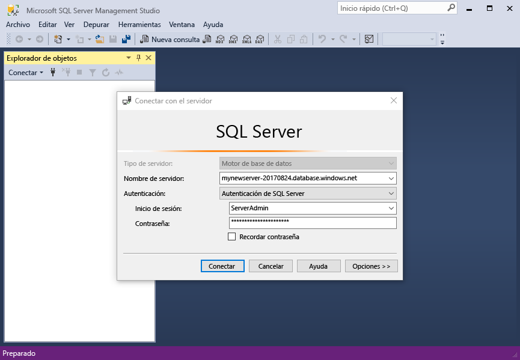
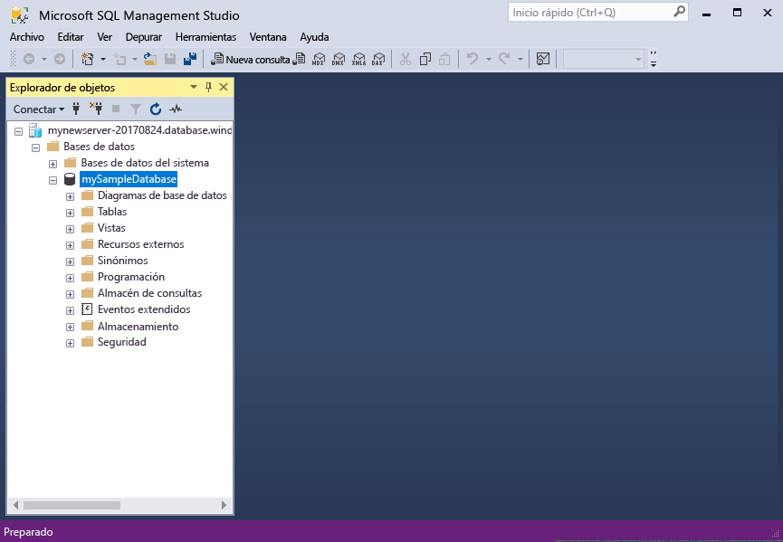

# <a name="design-your-first-azure-sql-database"></a>Diseño de la primera instancia de Azure SQL Database

La base de datos de SQL Azure es un base de datos como un servicio relacional (DBaaS) Hola Microsoft Cloud ("Azure"). En este tutorial, aprenderá cómo toouse Hola portal de Azure y [SQL Server Management Studio](https://msdn.microsoft.com/library/ms174173.aspx) (SSMS) para: 

> [!div class="checklist"]
> * Crear una base de datos en hello portal de Azure
> * Configurar una regla de firewall de nivel de servidor en hello portal de Azure
> * Conectar la base de datos de toohello con SSMS
> * Crear tablas con SSMS
> * Carga masiva de datos con BCP
> * Consultar los datos con SSMS
> * Restaurar hello tooa de base de datos anterior [punto de restauración a un momento](sql-database-recovery-using-backups.md#point-in-time-restore) Hola portal de Azure

Si no tiene una suscripción a Azure, cree una [cuenta gratuita](https://azure.microsoft.com/free/) antes de empezar.

## <a name="prerequisites"></a>Requisitos previos

toocomplete este tutorial, asegúrese de que ha instalado:
- versión más reciente de Hola de [SQL Server Management Studio](https://msdn.microsoft.com/library/ms174173.aspx) (SSMS).
- versión más reciente de Hola de [BCP y SQLCMD](https://www.microsoft.com/download/details.aspx?id=36433).

## <a name="log-in-toohello-azure-portal"></a>Inicie sesión en toohello portal de Azure

Inicie sesión en toohello [portal de Azure](https://portal.azure.com/).

## <a name="create-a-blank-sql-database"></a>Crear una instancia en blanco en SQL Database

Se crea una instancia de Azure SQL Database con un conjunto definido de [recursos de proceso y almacenamiento](sql-database-service-tiers.md). base de datos de Hola se crea dentro de un [grupo de recursos de Azure](../azure-resource-manager/resource-group-overview.md) y en un [servidor lógico de base de datos de SQL Azure](sql-database-features.md). 

Siga estos toocreate pasos una base de datos SQL en blanco. 

1. Haga clic en hello **New** encontró el botón en la esquina izquierda superior de Hola de hello portal de Azure.

2. Seleccione **bases de datos** de hello **New** página y seleccione **base de datos SQL** de hello **bases de datos** página. 

   

3. Rellenar formulario de la base de datos SQL de Hola con hello después de obtener información, tal como se muestra en hello anterior imagen:   

   | Configuración       | Valor sugerido | Descripción | 
   | ------------ | ------------------ | ------------------------------------------------- | 
   | **Nombre de la base de datos** | mySampleDatabase | Para conocer los nombres de base de datos válidos, consulte [Database Identifiers](https://docs.microsoft.com/sql/relational-databases/databases/database-identifiers) (Identificadores de base de datos). | 
   | **Suscripción** | Su suscripción  | Para más información acerca de sus suscripciones, consulte [Suscripciones](https://account.windowsazure.com/Subscriptions). |
   | **Grupos de recursos** | myResourceGroup | Para conocer cuáles son los nombres de grupo de recursos válidos, consulte el artículo [Naming conventions](https://docs.microsoft.com/azure/architecture/best-practices/naming-conventions) (Convenciones de nomenclatura). |
   | **Seleccionar origen** | Base de datos en blanco | Especifica que se debe crear una base de datos en blanco. |

4. Haga clic en **Server** toocreate y configurar un servidor nuevo para la nueva base de datos. Rellene hello **nuevo formulario server** con hello siguiente información: 

   | Configuración       | Valor sugerido | Descripción | 
   | ------------ | ------------------ | ------------------------------------------------- | 
   | **Nombre del servidor** | Cualquier nombre globalmente único | Para conocer cuáles son los nombres de servidor válidos, consulte el artículo [Naming conventions](https://docs.microsoft.com/azure/architecture/best-practices/naming-conventions) (Convenciones de nomenclatura). | 
   | **Inicio de sesión del administrador del servidor** | Cualquier nombre válido | Para conocer los nombres de inicio de sesión válidos, consulte [Database Identifiers](https://docs.microsoft.com/sql/relational-databases/databases/database-identifiers) (Identificadores de base de datos).|
   | **Password** | Cualquier contraseña válida | La contraseña debe tener al menos 8 caracteres y debe contener caracteres de tres de las siguientes categorías de hello: caracteres en mayúsculas, caracteres en minúsculas, números y caracteres no alfanuméricos. |
   | **Ubicación** | Cualquier ubicación válida | Para obtener información acerca de las regiones, consulte [Regiones de Azure](https://azure.microsoft.com/regions/). |

   

5. Haga clic en **Seleccionar**.

6. Haga clic en **tarifa** toospecify Hola nivel y rendimiento de nivel de servicio para la nueva base de datos. Para este tutorial, seleccione **20 DTU** y **250** GB de almacenamiento.

   

7. Haga clic en **Apply**.  

8. Seleccione un **intercalación** de base de datos en blanco de hello (para este tutorial, el valor predeterminado de Hola de uso). Para más información sobre las intercalaciones, vea [Collations](https://docs.microsoft.com/sql/t-sql/statements/collations) (Intercalaciones)

9. Haga clic en **crear** base de datos de tooprovision Hola. Aprovisionamiento dura aproximadamente un minuto y Media toocomplete. 

10. En la barra de herramientas de hello, haga clic en **notificaciones** toomonitor proceso de implementación de Hola.

   

## <a name="create-a-server-level-firewall-rule"></a>Crear una regla de firewall de nivel de servidor

Hola servicio de base de datos SQL crea un firewall en hello-nivel de servidor que impide que las aplicaciones externas y las herramientas de conectar toohello server o las bases de datos en el servidor de Hola a menos que se crea una regla de firewall tooopen firewall de Hola para direcciones IP concretas. Siga estos pasos toocreate una [regla de firewall de nivel de servidor de base de datos SQL](sql-database-firewall-configure.md) para direcciones IP de su cliente y habilitar la conectividad externa a través de firewall de base de datos SQL de Hola para sólo la dirección IP. 

> [!NOTE]
> SQL Database se comunica a través del puerto 1433. Si está tratando de tooconnect desde dentro de una red corporativa, es posible que firewall de su red no permite el tráfico saliente en el puerto 1433. Si es así, no se puede conectar el servidor de base de datos de SQL Azure tooyour a menos que el departamento de TI abre el puerto 1433.
>

1. Una vez finalizada la implementación de hello, haga clic en **bases de datos SQL** del menú izquierdo de hello y, a continuación, haga clic en **mySampleDatabase** en hello **bases de datos SQL** página. página de información general para abrir el base de datos, que muestra que Hola totalmente Hello calificado nombre del servidor (como **mynewserver20170313.database.windows.net**) y proporciona opciones para otra configuración. Copie dicho nombre, ya que lo tendrá que usar más adelante,

   > [!IMPORTANT]
   > Necesitará este servidor de tooyour de tooconnect de nombre completo del servidor y sus bases de datos en las siguientes guías de inicio rápidos.
   > 

    

2. Haga clic en **Configurar firewall de servidor** de barra de herramientas de hello tal y como se muestra en la imagen anterior de Hola. Hola **configuración del Firewall** se abre la página servidor de base de datos de SQL de Hola. 

    


3. Haga clic en **agregar dirección IP del cliente** en tooadd de barra de herramientas de hello tooa nueva regla de firewall de direcciones de la IP actual. La regla de firewall puede abrir el puerto 1433 para una única dirección IP o un intervalo de direcciones IP.

4. Haga clic en **Guardar**. Se crea una regla de firewall de nivel de servidor para la dirección IP actual abrir el puerto 1433 en el servidor lógico Hola.

    

4. Haga clic en **Aceptar** y, a continuación, cierre hello **configuración del Firewall** página.

Ahora puede conectarse toohello servidor de base de datos SQL y sus bases de datos mediante SQL Server Management Studio u otra herramienta de su elección de esta dirección IP con cuenta de administrador de servidor hello creado anteriormente.

> [!IMPORTANT]
> De forma predeterminada, el acceso a través de firewall de base de datos SQL de hello está habilitado para todos los servicios de Azure. Haga clic en **OFF** en este toodisable de página para todos los servicios de Azure.

## <a name="sql-server-connection-information"></a>Información de conexión de SQL server

Obtener nombre de servidor completo de hello para el servidor de base de datos de SQL Azure en hello portal de Azure. Usa Hola completo nombre tooconnect tooyour server utilizando SQL Server Management Studio.

1. Inicie sesión en toohello [portal de Azure](https://portal.azure.com/).
2. Seleccione **bases de datos SQL** desde el menú de la izquierda, hello y haga clic en la base de datos en hello **bases de datos SQL** página. 
3. Hola **Essentials** panel Hola página del portal Azure para la base de datos, busque y, a continuación, copie hello **nombre del servidor**.

   

## <a name="connect-toohello-database-with-ssms"></a>Conectar la base de datos de toohello con SSMS

Use [SQL Server Management Studio](https://docs.microsoft.com/sql/ssms/sql-server-management-studio-ssms) tooestablish un servidor de base de datos de SQL Azure tooyour de conexión.

1. Abra SQL Server Management Studio.

2. Hola **conectar tooServer** diálogo cuadro, escriba Hola siguiente información:

   | Configuración       | Valor sugerido | Descripción | 
   | ------------ | ------------------ | ------------------------------------------------- | 
   | Tipo de servidor | Motor de base de datos | Este valor es obligatorio |
   | Nombre de servidor | nombre completo del servidor de Hola | Hello nombre debe ser algo parecido a esto: **mynewserver20170313.database.windows.net**. |
   | Autenticación | Autenticación de SQL Server | Autenticación de SQL es Hola único tipo de autenticación que hemos configurado en este tutorial. |
   | Inicio de sesión | cuenta de administrador del servidor de Hola | Esta es la cuenta de hello que especificó cuando creó el servidor de Hola. |
   | Password | contraseña de Hello para la cuenta de administrador del servidor | Esta es la contraseña de Hola que especificó cuando creó el servidor de Hola. |

   

3. Haga clic en **opciones** en hello **conectar tooserver** cuadro de diálogo. Hola **conectar toodatabase** sección, escriba **mySampleDatabase** base de datos de tooconnect toothis.

     

4. Haga clic en **Conectar**. Abre la ventana del explorador de objetos de Hello en SSMS. 

5. En el Explorador de objetos, expanda **bases de datos** y, a continuación, expanda **mySampleDatabase** tooview objetos de hello en la base de datos de ejemplo de Hola.

     

## <a name="create-tables-in-hello-database"></a>Crear tablas de base de datos de Hola 

Cree un esquema de base de datos con cuatro tablas que modelan un sistema de administración de estudiantes para universidades con [Transact-SQL](https://docs.microsoft.com/sql/t-sql/language-reference):

- Persona
- Curso
- Estudiante
- Crédito que modela un sistema de administración de estudiantes para universidades

Hello siguiente diagrama muestra cómo estas tablas están relacionada tooeach otro. Algunas de estas tablas hacen referencia a columnas de otras tablas. Por ejemplo, la tabla de estudiantes Hola hace referencia hello **PersonId** columna de hello **persona** tabla. Estudio Hola diagrama toounderstand cómo Hola tablas en este tutorial están relacionado tooone otro. Para obtener información detallada sobre cómo toocreate tablas de base de datos eficaz, vea [crear tablas de base de datos eficaz](https://msdn.microsoft.com/library/cc505842.aspx). Para obtener información sobre cómo elegir tipos de datos, vea [Data types](https://docs.microsoft.com/sql/t-sql/data-types/data-types-transact-sql) (Tipos de datos).

> [!NOTE]
> También puede usar hello [Diseñador de tablas en SQL Server Management Studio](https://msdn.microsoft.com/library/hh272695.aspx) toocreate y diseñar las tablas. 


1. En el Explorador de objetos, haga clic con el botón derecho en **mySampleDatabase** y luego en **Nueva consulta**. Abre una ventana de consulta en blanco que es conectado tooyour base de datos.

2. En la ventana de consulta de hello, ejecute hello toocreate cuatro tablas de consulta en la base de datos siguientes: 

   ```sql 
   -- Create Person table

   CREATE TABLE Person
   (
   PersonId   INT IDENTITY PRIMARY KEY,
   FirstName   NVARCHAR(128) NOT NULL,
   MiddelInitial NVARCHAR(10),
   LastName   NVARCHAR(128) NOT NULL,
   DateOfBirth   DATE NOT NULL
   )
   
   -- Create Student table
 
   CREATE TABLE Student
   (
   StudentId INT IDENTITY PRIMARY KEY,
   PersonId  INT REFERENCES Person (PersonId),
   Email   NVARCHAR(256)
   )
   
   -- Create Course table
 
   CREATE TABLE Course
   (
   CourseId  INT IDENTITY PRIMARY KEY,
   Name   NVARCHAR(50) NOT NULL,
   Teacher   NVARCHAR(256) NOT NULL
   ) 

   -- Create Credit table
 
   CREATE TABLE Credit
   (
   StudentId   INT REFERENCES Student (StudentId),
   CourseId   INT REFERENCES Course (CourseId),
   Grade   DECIMAL(5,2) CHECK (Grade <= 100.00),
   Attempt   TINYINT,
   CONSTRAINT  [UQ_studentgrades] UNIQUE CLUSTERED
   (
   StudentId, CourseId, Grade, Attempt
   )
   )
   ```

   

3. Expanda el nodo de 'tablas' de hello en tablas Hola SQL Server Management Studio Object explorer toosee Hola que ha creado.

   

## <a name="load-data-into-hello-tables"></a>Cargar datos en tablas de Hola

1. Cree una carpeta denominada **SampleTableData** en los datos de ejemplo de toostore de carpeta de descargas para la base de datos. 

2. Siguiente de hello contextual vincula y guardarlos en hello **SampleTableData** carpeta. 

   - [SampleCourseData](https://sqldbtutorial.blob.core.windows.net/tutorials/SampleCourseData)
   - [SamplePersonData](https://sqldbtutorial.blob.core.windows.net/tutorials/SamplePersonData)
   - [SampleStudentData](https://sqldbtutorial.blob.core.windows.net/tutorials/SampleStudentData)
   - [SampleCreditData](https://sqldbtutorial.blob.core.windows.net/tutorials/SampleCreditData)

3. Abra una ventana del símbolo del sistema y desplazarse por las carpetas de SampleTableData toohello.

4. Ejecutar Hola después de datos de ejemplo de comandos tooinsert en tablas de hello reemplazando los valores de hello para **ServerName**, **DatabaseName**, **nombre de usuario**y **Contraseña** con valores de hello para su entorno.
  
   ```bcp
   bcp Course in SampleCourseData -S <ServerName>.database.windows.net -d <DatabaseName> -U <Username> -P <password> -q -c -t ","
   bcp Person in SamplePersonData -S <ServerName>.database.windows.net -d <DatabaseName> -U <Username> -P <password> -q -c -t ","
   bcp Student in SampleStudentData -S <ServerName>.database.windows.net -d <DatabaseName> -U <Username> -P <password> -q -c -t ","
   bcp Credit in SampleCreditData -S <ServerName>.database.windows.net -d <DatabaseName> -U <Username> -P <password> -q -c -t ","
   ```

Ahora se hayan cargado los datos de ejemplo en las tablas de Hola que creó anteriormente.

## <a name="query-data"></a>Datos de consulta

Ejecute hello siguientes información tooretrieve de las consultas de tablas de base de datos de Hola. Vea [escribir consultas SQL](https://technet.microsoft.com/library/bb264565.aspx) toolearn más acerca de cómo escribir consultas SQL. consulta primera Hola combina todas las cuatro tablas toofind todos los estudiantes de hello imparten por ' Dominick Pope' que tienen una puntuación superior al 75% de su clase. segunda consulta de Hello combina las cuatro tablas y busca todos los cursos en los que nunca se ha inscrito 'Noe Coleman'.

1. En una ventana de consulta de SQL Server Management Studio, ejecute hello después de consulta:

   ```sql 
   -- Find hello students taught by Dominick Pope who have a grade higher than 75%

   SELECT  person.FirstName,
   person.LastName,
   course.Name,
   credit.Grade
   FROM  Person AS person
   INNER JOIN Student AS student ON person.PersonId = student.PersonId
   INNER JOIN Credit AS credit ON student.StudentId = credit.StudentId
   INNER JOIN Course AS course ON credit.CourseId = course.courseId
   WHERE course.Teacher = 'Dominick Pope' 
   AND Grade > 75
   ```

2. En una ventana de consulta de SQL Server Management Studio, ejecute la siguiente consulta:

   ```sql
   -- Find all hello courses in which Noe Coleman has ever enrolled

   SELECT  course.Name,
   course.Teacher,
   credit.Grade
   FROM  Course AS course
   INNER JOIN Credit AS credit ON credit.CourseId = course.CourseId
   INNER JOIN Student AS student ON student.StudentId = credit.StudentId
   INNER JOIN Person AS person ON person.PersonId = student.PersonId
   WHERE person.FirstName = 'Noe'
   AND person.LastName = 'Coleman'
   ```

## <a name="restore-a-database-tooa-previous-point-in-time"></a>Restaurar un punto anterior de tooa de base de datos en el tiempo

Imagine que ha eliminado accidentalmente una tabla. No se puede recuperar con facilidad. La base de datos de SQL Azure permite toogo tooany atrás punto en el tiempo en hello última los días de too35 y restaurar este punto de la nueva base de datos de tiempo tooa. Puede usar este toorecover de base de datos los datos eliminados. Hello pasos siguientes restauración punto de tooa de base de datos de ejemplo de Hola antes de que se agregaron Hola tablas.

1. En la página de base de datos SQL de hello para la base de datos, haga clic en **restaurar** en la barra de herramientas de Hola. Hola **restaurar** se abre la página.

   

2. Rellene hello **restaurar** formulario con la información de hello necesario:
    * Nombre de la base de datos: escriba un nombre para la base de datos 
    * En un momento: Seleccione hello **en un momento** ficha en forma de restauración de Hola 
    * Punto de restauración: seleccionar una hora que se produce antes de cambia base de datos de Hola
    * Servidor de destino: no puede modificar este valor cuando restaura una base de datos 
    * Grupo de bases de datos elásticas: seleccione **Ninguno**  
    * Plan de tarifa: seleccione **20 DTU** y **250 GB** de almacenamiento

   

3. Haga clic en **Aceptar** toorestore Hola base de datos demasiado[tooa punto de restauración tiempo](sql-database-recovery-using-backups.md#point-in-time-restore) antes de que se agregaron Hola tablas. Restauración tooa otro punto de base de datos en el tiempo, crea una base de datos duplicado en hello mismo servidor que la base de datos original de Hola a partir de punto de hello en el tiempo especifique, siempre que esté dentro del período de retención de hello para el [nivel de servicio](sql-database-service-tiers.md).

## <a name="next-steps"></a>Pasos siguientes 
En este tutorial, ha aprendido las tareas básicas de la base de datos, como crean una base de datos y tablas, cargar y consultar los datos y restaurar el punto anterior de tooa de base de datos de hello en el tiempo. Ha aprendido a:
> [!div class="checklist"]
> * Crear una base de datos
> * Configurar una regla de firewall
> * Conectar la base de datos de toohello con [SQL Server Management Studio](https://msdn.microsoft.com/library/ms174173.aspx) (SSMS)
> * Cree las tablas.
> * Realizar cargas masivas de datos
> * Consultar los datos
> * Restaurar punto anterior de tooa de base de datos de hello en el tiempo con la base de datos SQL [punto de restauración a un momento](sql-database-recovery-using-backups.md#point-in-time-restore) capacidades

Avanzar toohello toolearn de tutorial siguiente acerca de cómo diseñar una base de datos con Visual Studio y C#.

> [!div class="nextstepaction"]
>[Diseño de una base de datos de Azure SQL Database y conexión con C# y ADO.NET](sql-database-design-first-database-csharp.md)
