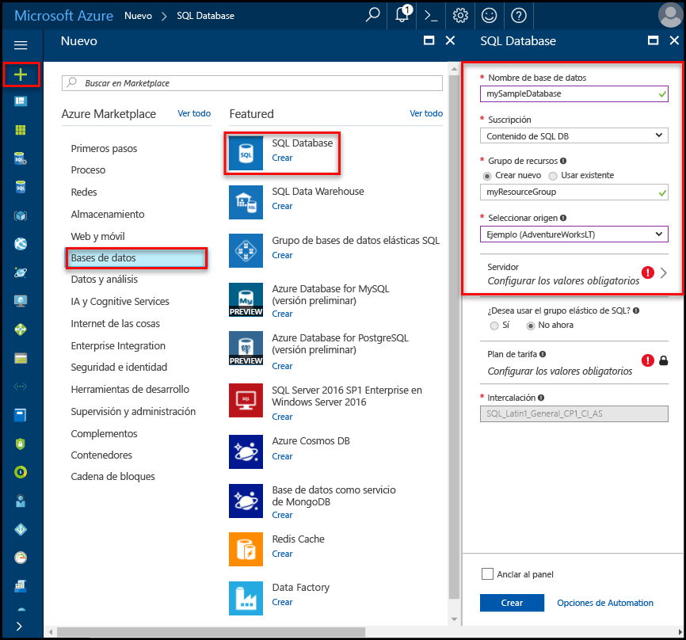
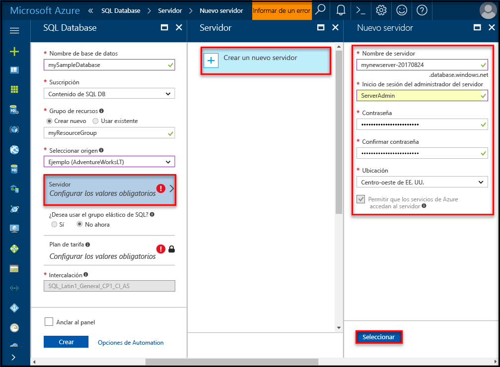
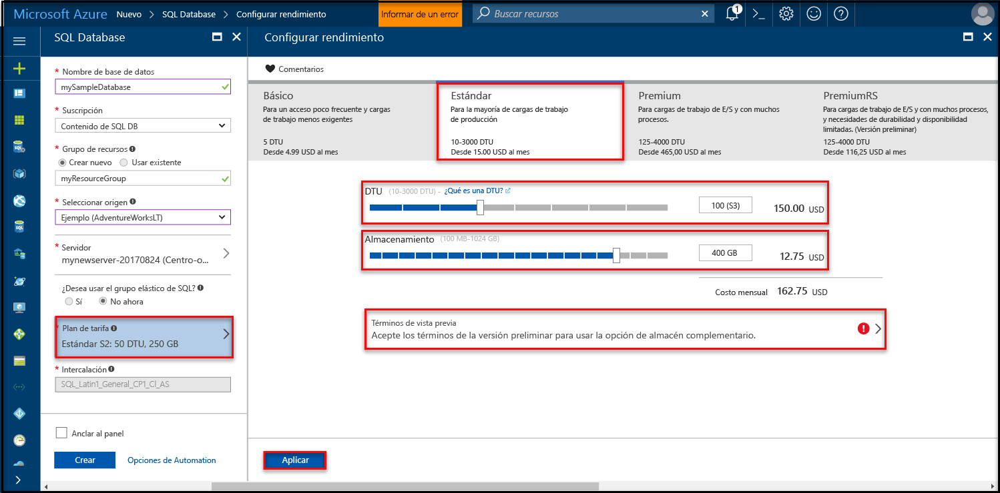

# <a name="create-an-azure-sql-database-in-hello-azure-portal"></a><span data-ttu-id="bf024-105">Crear una base de datos de SQL Azure en hello portal de Azure</span><span class="sxs-lookup"><span data-stu-id="bf024-105">Create an Azure SQL database in hello Azure portal</span></span>

<span data-ttu-id="bf024-106">Este tutorial de inicio rápido le guía a través de la base de datos toocreate una instancia de SQL en Azure.</span><span class="sxs-lookup"><span data-stu-id="bf024-106">This quick start tutorial walks through how toocreate a SQL database in Azure.</span></span> <span data-ttu-id="bf024-107">La base de datos de SQL Azure es una "base de datos-as-a-Service" oferta que le permite toorun y escala alta disponibilidad SQL Server las bases de datos en la nube de Hola.</span><span class="sxs-lookup"><span data-stu-id="bf024-107">Azure SQL Database is a “Database-as-a-Service” offering that enables you toorun and scale highly available SQL Server databases in hello cloud.</span></span> <span data-ttu-id="bf024-108">Este inicio rápido muestra cómo tooget iniciado mediante la creación de una base de datos SQL Hola portal de Azure.</span><span class="sxs-lookup"><span data-stu-id="bf024-108">This quick start shows you how tooget started by creating a SQL database using hello Azure portal.</span></span>

<span data-ttu-id="bf024-109">Si no tiene una suscripción a Azure, cree una cuenta [gratuita](https://azure.microsoft.com/free/) antes de empezar.</span><span class="sxs-lookup"><span data-stu-id="bf024-109">If you don't have an Azure subscription, create a [free](https://azure.microsoft.com/free/) account before you begin.</span></span>

## <a name="log-in-toohello-azure-portal"></a><span data-ttu-id="bf024-110">Inicie sesión en toohello portal de Azure</span><span class="sxs-lookup"><span data-stu-id="bf024-110">Log in toohello Azure portal</span></span>

<span data-ttu-id="bf024-111">Inicie sesión en toohello [portal de Azure](https://portal.azure.com/).</span><span class="sxs-lookup"><span data-stu-id="bf024-111">Log in toohello [Azure portal](https://portal.azure.com/).</span></span>

## <a name="create-a-sql-database"></a><span data-ttu-id="bf024-112">Creación de una base de datos SQL</span><span class="sxs-lookup"><span data-stu-id="bf024-112">Create a SQL database</span></span>

<span data-ttu-id="bf024-113">Se crea una instancia de Azure SQL Database con un conjunto definido de [recursos de proceso y almacenamiento](sql-database-service-tiers.md).</span><span class="sxs-lookup"><span data-stu-id="bf024-113">An Azure SQL database is created with a defined set of [compute and storage resources](sql-database-service-tiers.md).</span></span> <span data-ttu-id="bf024-114">base de datos de Hola se crea dentro de un [grupo de recursos de Azure](../azure-resource-manager/resource-group-overview.md) y en un [servidor lógico de base de datos de SQL Azure](sql-database-features.md).</span><span class="sxs-lookup"><span data-stu-id="bf024-114">hello database is created within an [Azure resource group](../azure-resource-manager/resource-group-overview.md) and in an [Azure SQL Database logical server](sql-database-features.md).</span></span> 

<span data-ttu-id="bf024-115">Siga estos pasos toocreate una base de datos SQL que contiene datos de ejemplo de Hola LT de Adventure Works.</span><span class="sxs-lookup"><span data-stu-id="bf024-115">Follow these steps toocreate a SQL database containing hello Adventure Works LT sample data.</span></span> 

1. <span data-ttu-id="bf024-116">Haga clic en hello **New** encontró el botón en la esquina izquierda superior de Hola de hello portal de Azure.</span><span class="sxs-lookup"><span data-stu-id="bf024-116">Click hello **New** button found on hello upper left-hand corner of hello Azure portal.</span></span>

2. <span data-ttu-id="bf024-117">Seleccione **bases de datos** de hello **New** página y seleccione **base de datos SQL** de hello **bases de datos** página.</span><span class="sxs-lookup"><span data-stu-id="bf024-117">Select **Databases** from hello **New** page, and select **SQL Database** from hello **Databases** page.</span></span>

   

3. <span data-ttu-id="bf024-119">Rellenar formulario de la base de datos SQL de Hola con hello después de obtener información, tal como se muestra en hello anterior imagen:</span><span class="sxs-lookup"><span data-stu-id="bf024-119">Fill out hello SQL Database form with hello following information, as shown on hello preceding image:</span></span>   

   | <span data-ttu-id="bf024-120">Configuración</span><span class="sxs-lookup"><span data-stu-id="bf024-120">Setting</span></span>       | <span data-ttu-id="bf024-121">Valor sugerido</span><span class="sxs-lookup"><span data-stu-id="bf024-121">Suggested value</span></span> | <span data-ttu-id="bf024-122">Descripción</span><span class="sxs-lookup"><span data-stu-id="bf024-122">Description</span></span> | 
   | ------------ | ------------------ | ------------------------------------------------- | 
   | <span data-ttu-id="bf024-123">**Nombre de la base de datos**</span><span class="sxs-lookup"><span data-stu-id="bf024-123">**Database name**</span></span> | <span data-ttu-id="bf024-124">mySampleDatabase</span><span class="sxs-lookup"><span data-stu-id="bf024-124">mySampleDatabase</span></span> | <span data-ttu-id="bf024-125">Para conocer los nombres de base de datos válidos, consulte [Database Identifiers](https://docs.microsoft.com/en-us/sql/relational-databases/databases/database-identifiers) (Identificadores de base de datos).</span><span class="sxs-lookup"><span data-stu-id="bf024-125">For valid database names, see [Database Identifiers](https://docs.microsoft.com/en-us/sql/relational-databases/databases/database-identifiers).</span></span> | 
   | <span data-ttu-id="bf024-126">**Suscripción**</span><span class="sxs-lookup"><span data-stu-id="bf024-126">**Subscription**</span></span> | <span data-ttu-id="bf024-127">Su suscripción</span><span class="sxs-lookup"><span data-stu-id="bf024-127">Your subscription</span></span>  | <span data-ttu-id="bf024-128">Para más información acerca de sus suscripciones, consulte [Suscripciones](https://account.windowsazure.com/Subscriptions).</span><span class="sxs-lookup"><span data-stu-id="bf024-128">For details about your subscriptions, see [Subscriptions](https://account.windowsazure.com/Subscriptions).</span></span> |
   | <span data-ttu-id="bf024-129">**Grupos de recursos**</span><span class="sxs-lookup"><span data-stu-id="bf024-129">**Resource group**</span></span>  | <span data-ttu-id="bf024-130">myResourceGroup</span><span class="sxs-lookup"><span data-stu-id="bf024-130">myResourceGroup</span></span> | <span data-ttu-id="bf024-131">Para conocer cuáles son los nombres de grupo de recursos válidos, consulte el artículo [Naming conventions](https://docs.microsoft.com/azure/architecture/best-practices/naming-conventions) (Convenciones de nomenclatura).</span><span class="sxs-lookup"><span data-stu-id="bf024-131">For valid resource group names, see [Naming rules and restrictions](https://docs.microsoft.com/azure/architecture/best-practices/naming-conventions).</span></span> |
   | <span data-ttu-id="bf024-132">**Seleccionar origen**</span><span class="sxs-lookup"><span data-stu-id="bf024-132">**Source source**</span></span> | <span data-ttu-id="bf024-133">Ejemplo (AdventureWorksLT)</span><span class="sxs-lookup"><span data-stu-id="bf024-133">Sample (AdventureWorksLT)</span></span> | <span data-ttu-id="bf024-134">Carga Hola AdventureWorksLT esquema y los datos en la base de datos</span><span class="sxs-lookup"><span data-stu-id="bf024-134">Loads hello AdventureWorksLT schema and data into your new database</span></span> |

   > [!IMPORTANT]
   > <span data-ttu-id="bf024-135">Debe seleccionar la base de datos de ejemplo de Hola en este formulario porque se utiliza en el resto de Hola de esta guía de inicio rápido.</span><span class="sxs-lookup"><span data-stu-id="bf024-135">You must select hello sample database on this form because it is used in hello remainder of this quick start.</span></span>
   > 

4. <span data-ttu-id="bf024-136">En **Server**, haga clic en **establecer configuración obligatoria** y rellene Hola formato SQL server (servidor lógico) con hello después de obtener información, tal como se muestra en hello después de imagen:</span><span class="sxs-lookup"><span data-stu-id="bf024-136">Under **Server**, click **Configure required settings** and fill out hello SQL server (logical server) form with hello following information, as shown on hello following image:</span></span>   

   | <span data-ttu-id="bf024-137">Configuración</span><span class="sxs-lookup"><span data-stu-id="bf024-137">Setting</span></span>       | <span data-ttu-id="bf024-138">Valor sugerido</span><span class="sxs-lookup"><span data-stu-id="bf024-138">Suggested value</span></span> | <span data-ttu-id="bf024-139">Descripción</span><span class="sxs-lookup"><span data-stu-id="bf024-139">Description</span></span> | 
   | ------------ | ------------------ | ------------------------------------------------- | 
   | <span data-ttu-id="bf024-140">**Nombre del servidor**</span><span class="sxs-lookup"><span data-stu-id="bf024-140">**Server name**</span></span> | <span data-ttu-id="bf024-141">Cualquier nombre globalmente único</span><span class="sxs-lookup"><span data-stu-id="bf024-141">Any globally unique name</span></span> | <span data-ttu-id="bf024-142">Para conocer cuáles son los nombres de servidor válidos, consulte el artículo [Naming conventions](https://docs.microsoft.com/azure/architecture/best-practices/naming-conventions) (Convenciones de nomenclatura).</span><span class="sxs-lookup"><span data-stu-id="bf024-142">For valid server names, see [Naming rules and restrictions](https://docs.microsoft.com/azure/architecture/best-practices/naming-conventions).</span></span> | 
   | <span data-ttu-id="bf024-143">**Inicio de sesión del administrador del servidor**</span><span class="sxs-lookup"><span data-stu-id="bf024-143">**Server admin login**</span></span> | <span data-ttu-id="bf024-144">Cualquier nombre válido</span><span class="sxs-lookup"><span data-stu-id="bf024-144">Any valid name</span></span> | <span data-ttu-id="bf024-145">Para conocer los nombres de inicio de sesión válidos, consulte [Database Identifiers](https://docs.microsoft.com/en-us/sql/relational-databases/databases/database-identifiers) (Identificadores de base de datos).</span><span class="sxs-lookup"><span data-stu-id="bf024-145">For valid login names, see [Database Identifiers](https://docs.microsoft.com/en-us/sql/relational-databases/databases/database-identifiers).</span></span> |
   | <span data-ttu-id="bf024-146">**Password**</span><span class="sxs-lookup"><span data-stu-id="bf024-146">**Password**</span></span> | <span data-ttu-id="bf024-147">Cualquier contraseña válida</span><span class="sxs-lookup"><span data-stu-id="bf024-147">Any valid password</span></span> | <span data-ttu-id="bf024-148">La contraseña debe tener al menos 8 caracteres y debe contener caracteres de tres de las siguientes categorías de hello: caracteres en mayúsculas, caracteres en minúsculas, números y caracteres no alfanuméricos y guiones.</span><span class="sxs-lookup"><span data-stu-id="bf024-148">Your password must have at least 8 characters and must contain characters from three of hello following categories: upper case characters, lower case characters, numbers, and and non-alphanumeric characters.</span></span> |
   | <span data-ttu-id="bf024-149">**Suscripción**</span><span class="sxs-lookup"><span data-stu-id="bf024-149">**Subscription**</span></span> | <span data-ttu-id="bf024-150">Su suscripción</span><span class="sxs-lookup"><span data-stu-id="bf024-150">Your subscription</span></span> | <span data-ttu-id="bf024-151">Para más información acerca de sus suscripciones, consulte [Suscripciones](https://account.windowsazure.com/Subscriptions).</span><span class="sxs-lookup"><span data-stu-id="bf024-151">For details about your subscriptions, see [Subscriptions](https://account.windowsazure.com/Subscriptions).</span></span> |
   | <span data-ttu-id="bf024-152">**Grupos de recursos**</span><span class="sxs-lookup"><span data-stu-id="bf024-152">**Resource group**</span></span> | <span data-ttu-id="bf024-153">myResourceGroup</span><span class="sxs-lookup"><span data-stu-id="bf024-153">myResourceGroup</span></span> | <span data-ttu-id="bf024-154">Para conocer cuáles son los nombres de grupo de recursos válidos, consulte el artículo [Naming conventions](https://docs.microsoft.com/azure/architecture/best-practices/naming-conventions) (Convenciones de nomenclatura).</span><span class="sxs-lookup"><span data-stu-id="bf024-154">For valid resource group names, see [Naming rules and restrictions](https://docs.microsoft.com/azure/architecture/best-practices/naming-conventions).</span></span> |
   | <span data-ttu-id="bf024-155">**Ubicación**</span><span class="sxs-lookup"><span data-stu-id="bf024-155">**Location**</span></span> | <span data-ttu-id="bf024-156">Cualquier ubicación válida</span><span class="sxs-lookup"><span data-stu-id="bf024-156">Any valid location</span></span> | <span data-ttu-id="bf024-157">Para obtener información acerca de las regiones, consulte [Regiones de Azure](https://azure.microsoft.com/regions/).</span><span class="sxs-lookup"><span data-stu-id="bf024-157">For information about regions, see [Azure Regions](https://azure.microsoft.com/regions/).</span></span> |

   > [!IMPORTANT]
   > <span data-ttu-id="bf024-158">inicio de sesión de administrador de servidor de Hola y la contraseña que especifique aquí son necesario toolog en toohello server y sus bases de datos más adelante en esta guía de inicio rápido.</span><span class="sxs-lookup"><span data-stu-id="bf024-158">hello server admin login and password that you specify here are required toolog in toohello server and its databases later in this quick start.</span></span> <span data-ttu-id="bf024-159">Recuerde o grabe esta información para su uso posterior.</span><span class="sxs-lookup"><span data-stu-id="bf024-159">Remember or record this information for later use.</span></span> 
   >  

   

5. <span data-ttu-id="bf024-161">Cuando se haya completado el formulario de hello, haga clic en **seleccione**.</span><span class="sxs-lookup"><span data-stu-id="bf024-161">When you have completed hello form, click **Select**.</span></span>

6. <span data-ttu-id="bf024-162">Haga clic en **tarifa** toospecify Hola nivel y rendimiento de nivel de servicio para la nueva base de datos.</span><span class="sxs-lookup"><span data-stu-id="bf024-162">Click **Pricing tier** toospecify hello service tier and performance level for your new database.</span></span> <span data-ttu-id="bf024-163">Usar Hola control deslizante tooselect **20 Dtu** y **250** GB de almacenamiento.</span><span class="sxs-lookup"><span data-stu-id="bf024-163">Use hello slider tooselect **20 DTUs** and **250** GB of storage.</span></span> <span data-ttu-id="bf024-164">Para más información acerca de las DTU, consulte [¿Qué es una DTU?](sql-database-what-is-a-dtu.md).</span><span class="sxs-lookup"><span data-stu-id="bf024-164">For more information on DTUs, see [What is a DTU?](sql-database-what-is-a-dtu.md).</span></span>

   

7. <span data-ttu-id="bf024-166">Después de la cantidad de hello seleccionado de Dtu, haga clic en **aplicar**.</span><span class="sxs-lookup"><span data-stu-id="bf024-166">After selected hello amount of DTUs, click **Apply**.</span></span>  

8. <span data-ttu-id="bf024-167">Ahora que ha completado el formulario de la base de datos SQL de hello, haga clic en **crear** base de datos de tooprovision Hola.</span><span class="sxs-lookup"><span data-stu-id="bf024-167">Now that you have completed hello SQL Database form, click **Create** tooprovision hello database.</span></span> <span data-ttu-id="bf024-168">El aprovisionamiento tarda unos minutos.</span><span class="sxs-lookup"><span data-stu-id="bf024-168">Provisioning takes a few minutes.</span></span> 

9. <span data-ttu-id="bf024-169">En la barra de herramientas de hello, haga clic en **notificaciones** toomonitor proceso de implementación de Hola.</span><span class="sxs-lookup"><span data-stu-id="bf024-169">On hello toolbar, click **Notifications** toomonitor hello deployment process.</span></span>

   

## <a name="create-a-server-level-firewall-rule"></a><span data-ttu-id="bf024-171">Crear una regla de firewall de nivel de servidor</span><span class="sxs-lookup"><span data-stu-id="bf024-171">Create a server-level firewall rule</span></span>

<span data-ttu-id="bf024-172">Hola servicio de base de datos SQL crea un firewall en hello-nivel de servidor que impide que las aplicaciones externas y las herramientas de conectar toohello server o las bases de datos en el servidor de Hola a menos que se crea una regla de firewall tooopen firewall de Hola para direcciones IP concretas.</span><span class="sxs-lookup"><span data-stu-id="bf024-172">hello SQL Database service creates a firewall at hello server-level that prevents external applications and tools from connecting toohello server or any databases on hello server unless a firewall rule is created tooopen hello firewall for specific IP addresses.</span></span> <span data-ttu-id="bf024-173">Siga estos pasos toocreate una [regla de firewall de nivel de servidor de base de datos SQL](sql-database-firewall-configure.md) para direcciones IP de su cliente y habilitar la conectividad externa a través de firewall de base de datos SQL de Hola para sólo la dirección IP.</span><span class="sxs-lookup"><span data-stu-id="bf024-173">Follow these steps toocreate a [SQL Database server-level firewall rule](sql-database-firewall-configure.md) for your client's IP address and enable external connectivity through hello SQL Database firewall for your IP address only.</span></span> 

> [!NOTE]
> <span data-ttu-id="bf024-174">SQL Database se comunica a través del puerto 1433.</span><span class="sxs-lookup"><span data-stu-id="bf024-174">SQL Database communicates over port 1433.</span></span> <span data-ttu-id="bf024-175">Si está tratando de tooconnect desde dentro de una red corporativa, es posible que firewall de su red no permite el tráfico saliente en el puerto 1433.</span><span class="sxs-lookup"><span data-stu-id="bf024-175">If you are trying tooconnect from within a corporate network, outbound traffic over port 1433 may not be allowed by your network's firewall.</span></span> <span data-ttu-id="bf024-176">Si es así, no se puede conectar el servidor de base de datos de SQL Azure tooyour a menos que el departamento de TI abre el puerto 1433.</span><span class="sxs-lookup"><span data-stu-id="bf024-176">If so, you cannot connect tooyour Azure SQL Database server unless your IT department opens port 1433.</span></span>
>

1. <span data-ttu-id="bf024-177">Una vez finalizada la implementación de hello, haga clic en **bases de datos SQL** del menú izquierdo de hello y, a continuación, haga clic en **mySampleDatabase** en hello **bases de datos SQL** página.</span><span class="sxs-lookup"><span data-stu-id="bf024-177">After hello deployment completes, click **SQL databases** from hello left-hand menu and then click **mySampleDatabase** on hello **SQL databases** page.</span></span> <span data-ttu-id="bf024-178">página de información general para abrir el base de datos, que muestra que Hola totalmente Hello calificado nombre del servidor (como **mynewserver20170313.database.windows.net**) y proporciona opciones para otra configuración.</span><span class="sxs-lookup"><span data-stu-id="bf024-178">hello overview page for your database opens, showing you hello fully qualified server name (such as **mynewserver20170313.database.windows.net**) and provides options for further configuration.</span></span> <span data-ttu-id="bf024-179">Copie dicho nombre, ya que lo tendrá que usar más adelante,</span><span class="sxs-lookup"><span data-stu-id="bf024-179">Copy this fully qualified server name for use later.</span></span>

   > [!IMPORTANT]
   > <span data-ttu-id="bf024-180">Necesitará este servidor de tooyour de tooconnect de nombre completo del servidor y sus bases de datos en las siguientes guías de inicio rápidos.</span><span class="sxs-lookup"><span data-stu-id="bf024-180">You need this fully qualified server name tooconnect tooyour server and its databases in subsequent quick starts.</span></span>
   > 

    

2. <span data-ttu-id="bf024-182">Haga clic en **Configurar firewall de servidor** de barra de herramientas de hello tal y como se muestra en la imagen anterior de Hola.</span><span class="sxs-lookup"><span data-stu-id="bf024-182">Click **Set server firewall** on hello toolbar as shown in hello previous image.</span></span> <span data-ttu-id="bf024-183">Hola **configuración del Firewall** se abre la página servidor de base de datos de SQL de Hola.</span><span class="sxs-lookup"><span data-stu-id="bf024-183">hello **Firewall settings** page for hello SQL Database server opens.</span></span> 

    

3. <span data-ttu-id="bf024-185">Haga clic en **agregar dirección IP del cliente** en tooadd de barra de herramientas de hello tooa nueva regla de firewall de direcciones de la IP actual.</span><span class="sxs-lookup"><span data-stu-id="bf024-185">Click **Add client IP** on hello toolbar tooadd your current IP address tooa new firewall rule.</span></span> <span data-ttu-id="bf024-186">La regla de firewall puede abrir el puerto 1433 para una única dirección IP o un intervalo de direcciones IP.</span><span class="sxs-lookup"><span data-stu-id="bf024-186">A firewall rule can open port 1433 for a single IP address or a range of IP addresses.</span></span>

4. <span data-ttu-id="bf024-187">Haga clic en **Guardar**.</span><span class="sxs-lookup"><span data-stu-id="bf024-187">Click **Save**.</span></span> <span data-ttu-id="bf024-188">Se crea una regla de firewall de nivel de servidor para la dirección IP actual abrir el puerto 1433 en el servidor lógico Hola.</span><span class="sxs-lookup"><span data-stu-id="bf024-188">A server-level firewall rule is created for your current IP address opening port 1433 on hello logical server.</span></span>

    

4. <span data-ttu-id="bf024-190">Haga clic en **Aceptar** y, a continuación, cierre hello **configuración del Firewall** página.</span><span class="sxs-lookup"><span data-stu-id="bf024-190">Click **OK** and then close hello **Firewall settings** page.</span></span>

<span data-ttu-id="bf024-191">Ahora puede conectarse toohello servidor de base de datos SQL y sus bases de datos mediante SQL Server Management Studio u otra herramienta de su elección de esta dirección IP con cuenta de administrador de servidor hello creado anteriormente.</span><span class="sxs-lookup"><span data-stu-id="bf024-191">You can now connect toohello SQL Database server and its databases using SQL Server Management Studio or another tool of your choice from this IP address using hello server admin account created previously.</span></span>

> [!IMPORTANT]
> <span data-ttu-id="bf024-192">De forma predeterminada, el acceso a través de firewall de base de datos SQL de hello está habilitado para todos los servicios de Azure.</span><span class="sxs-lookup"><span data-stu-id="bf024-192">By default, access through hello SQL Database firewall is enabled for all Azure services.</span></span> <span data-ttu-id="bf024-193">Haga clic en **OFF** en este toodisable de página para todos los servicios de Azure.</span><span class="sxs-lookup"><span data-stu-id="bf024-193">Click **OFF** on this page toodisable for all Azure services.</span></span>
>

## <a name="query-hello-sql-database"></a><span data-ttu-id="bf024-194">Base de datos SQL de Hola de consulta</span><span class="sxs-lookup"><span data-stu-id="bf024-194">Query hello SQL database</span></span>

<span data-ttu-id="bf024-195">Ahora que ha creado una base de datos de ejemplo en Azure, vamos a usar la herramienta de consulta integrada Hola Hola tooconfirm portal Azure que puede conectarse toohello base de datos y consultar datos de Hola.</span><span class="sxs-lookup"><span data-stu-id="bf024-195">Now that you have created a sample database in Azure, let’s use hello built-in query tool within hello Azure portal tooconfirm that you can connect toohello database and query hello data.</span></span> 

1. <span data-ttu-id="bf024-196">En la página de base de datos SQL de hello para la base de datos, haga clic en **herramientas** en la barra de herramientas de Hola.</span><span class="sxs-lookup"><span data-stu-id="bf024-196">On hello SQL Database page for your database, click **Tools** on hello toolbar.</span></span> <span data-ttu-id="bf024-197">Hola **herramientas** se abre la página.</span><span class="sxs-lookup"><span data-stu-id="bf024-197">hello **Tools** page opens.</span></span>

    

2. <span data-ttu-id="bf024-199">Haga clic en **editor de consultas (versión preliminar)**, haga clic en hello **obtener una vista previa de los términos** casilla de verificación y, a continuación, haga clic en **Aceptar**.</span><span class="sxs-lookup"><span data-stu-id="bf024-199">Click **Query editor (preview)**, click hello **Preview terms** checkbox, and then click **OK**.</span></span> <span data-ttu-id="bf024-200">se abre la página del editor de consultas de Hola.</span><span class="sxs-lookup"><span data-stu-id="bf024-200">hello Query editor page opens.</span></span>

3. <span data-ttu-id="bf024-201">Haga clic en **inicio de sesión** y, a continuación, cuando se le pida, seleccione **autenticación de SQL server** y, a continuación, proporcione el inicio de sesión de hello server admin y la contraseña que creó anteriormente.</span><span class="sxs-lookup"><span data-stu-id="bf024-201">Click **Login** and then, when prompted, select **SQL server authentication** and then provide hello server admin login and password that you created earlier.</span></span>

    

4. <span data-ttu-id="bf024-203">Haga clic en **Aceptar** toolog en.</span><span class="sxs-lookup"><span data-stu-id="bf024-203">Click **OK** toolog in.</span></span>

5. <span data-ttu-id="bf024-204">Después de autenticarse, escriba Hola después de consulta en el panel del editor de consultas de Hola.</span><span class="sxs-lookup"><span data-stu-id="bf024-204">After you are authenticated, type hello following query in hello query editor pane.</span></span>

   ```sql
   SELECT TOP 20 pc.Name as CategoryName, p.name as ProductName
   FROM SalesLT.ProductCategory pc
   JOIN SalesLT.Product p
   ON pc.productcategoryid = p.productcategoryid;
   ```

6. <span data-ttu-id="bf024-205">Haga clic en **ejecutar** y, a continuación, revisar los resultados de la consulta de Hola Hola **resultados** panel.</span><span class="sxs-lookup"><span data-stu-id="bf024-205">Click **Run** and then review hello query results in hello **Results** pane.</span></span>

   

7. <span data-ttu-id="bf024-207">Hola cerrar **editor de consultas** hello y página **herramientas** página.</span><span class="sxs-lookup"><span data-stu-id="bf024-207">Close hello **Query editor** page and hello **Tools** page.</span></span>

## <a name="clean-up-resources"></a><span data-ttu-id="bf024-208">Limpieza de recursos</span><span class="sxs-lookup"><span data-stu-id="bf024-208">Clean up resources</span></span>

<span data-ttu-id="bf024-209">Si no necesita estos recursos para otro/tutorial de inicio rápido (vea [pasos siguientes](#next-steps)), puede eliminarlas haciendo Hola siguiente:</span><span class="sxs-lookup"><span data-stu-id="bf024-209">If you don't need these resources for another quickstart/tutorial (see [Next steps](#next-steps)), you can delete them by doing hello following:</span></span>


1. <span data-ttu-id="bf024-210">En el menú de la izquierda de Hola Hola portal de Azure, haga clic en **grupos de recursos** y, a continuación, haga clic en **myResourceGroup**.</span><span class="sxs-lookup"><span data-stu-id="bf024-210">From hello left-hand menu in hello Azure portal, click **Resource groups** and then click **myResourceGroup**.</span></span> 
2. <span data-ttu-id="bf024-211">En la página del grupo de recursos, haga clic en **eliminar**, tipo **myResourceGroup** en Hola cuadro de texto y, a continuación, haga clic en **eliminar**.</span><span class="sxs-lookup"><span data-stu-id="bf024-211">On your resource group page, click **Delete**, type **myResourceGroup** in hello text box, and then click **Delete**.</span></span>

## <a name="next-steps"></a><span data-ttu-id="bf024-212">Pasos siguientes</span><span class="sxs-lookup"><span data-stu-id="bf024-212">Next steps</span></span>

<span data-ttu-id="bf024-213">Ahora que tiene una base de datos, puede conectarse y realizar consultas con las herramientas que desee.</span><span class="sxs-lookup"><span data-stu-id="bf024-213">Now that you have a database, you can connect and query using your favorite tools.</span></span> <span data-ttu-id="bf024-214">Para más información, seleccione una de las herramientas siguientes:</span><span class="sxs-lookup"><span data-stu-id="bf024-214">Learn more by choosing your tool below:</span></span>

- [<span data-ttu-id="bf024-215">SQL Server Management Studio</span><span class="sxs-lookup"><span data-stu-id="bf024-215">SQL Server Management Studio</span></span>](sql-database-connect-query-ssms.md)
- [<span data-ttu-id="bf024-216">código de Visual Studio</span><span class="sxs-lookup"><span data-stu-id="bf024-216">Visual Studio Code</span></span>](sql-database-connect-query-vscode.md)
- [<span data-ttu-id="bf024-217">.NET</span><span class="sxs-lookup"><span data-stu-id="bf024-217">.NET</span></span>](sql-database-connect-query-dotnet.md)
- [<span data-ttu-id="bf024-218">PHP</span><span class="sxs-lookup"><span data-stu-id="bf024-218">PHP</span></span>](sql-database-connect-query-php.md)
- [<span data-ttu-id="bf024-219">Node.js</span><span class="sxs-lookup"><span data-stu-id="bf024-219">Node.js</span></span>](sql-database-connect-query-nodejs.md)
- [<span data-ttu-id="bf024-220">Java</span><span class="sxs-lookup"><span data-stu-id="bf024-220">Java</span></span>](sql-database-connect-query-java.md)
- [<span data-ttu-id="bf024-221">Python</span><span class="sxs-lookup"><span data-stu-id="bf024-221">Python</span></span>](sql-database-connect-query-python.md)
- [<span data-ttu-id="bf024-222">Ruby</span><span class="sxs-lookup"><span data-stu-id="bf024-222">Ruby</span></span>](sql-database-connect-query-ruby.md)
