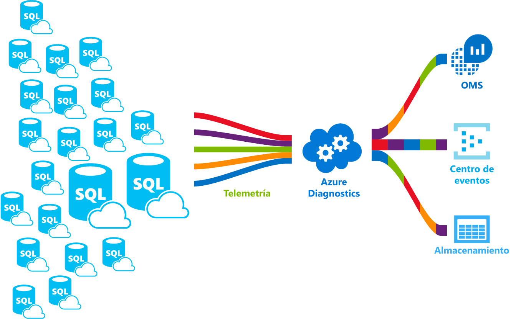

# <a name="azure-sql-database-metrics-and-diagnostics-logging"></a><span data-ttu-id="8e5aa-103">Métricas y registros de diagnóstico de Azure SQL Database</span><span class="sxs-lookup"><span data-stu-id="8e5aa-103">Azure SQL Database metrics and diagnostics logging</span></span> 
<span data-ttu-id="8e5aa-104">Azure SQL Database puede emitir métricas y registros de diagnóstico para facilitar la supervisión.</span><span class="sxs-lookup"><span data-stu-id="8e5aa-104">Azure SQL Database can emit metrics and diagnostic logs for easier monitoring.</span></span> <span data-ttu-id="8e5aa-105">Puede configurar el uso de recursos de base de datos de SQL Azure toostore, los trabajadores y sesiones y conectividad en uno de estos recursos de Azure:</span><span class="sxs-lookup"><span data-stu-id="8e5aa-105">You can configure Azure SQL Database toostore resource usage, workers and sessions, and connectivity into one of these Azure resources:</span></span>
- <span data-ttu-id="8e5aa-106">**Azure Storage**: para archivar grandes cantidades de telemetría a un pequeño precio</span><span class="sxs-lookup"><span data-stu-id="8e5aa-106">**Azure Storage**: For archiving vast amounts of telemetry for a small price</span></span>
- <span data-ttu-id="8e5aa-107">**Centro de eventos de Azure**: para integrar la telemetría de Azure SQL Database con la solución de supervisión personalizada o las canalizaciones activas</span><span class="sxs-lookup"><span data-stu-id="8e5aa-107">**Azure Event Hub**: For integrating Azure SQL Database telemetry with your custom monitoring solution or hot pipelines</span></span>
- <span data-ttu-id="8e5aa-108">**Análisis de registros de Azure**: para fuera del cuadro de hello solución con informes, alertas y mitigar las capacidades de supervisión</span><span class="sxs-lookup"><span data-stu-id="8e5aa-108">**Azure Log Analytics**: For out of hello box monitoring solution with reporting, alerting, and mitigating capabilities</span></span> 

    

## <a name="enable-logging"></a><span data-ttu-id="8e5aa-110">Habilitación del registro</span><span class="sxs-lookup"><span data-stu-id="8e5aa-110">Enable logging</span></span>

<span data-ttu-id="8e5aa-111">Las métricas y los registros de diagnóstico no están habilitados de forma predeterminada.</span><span class="sxs-lookup"><span data-stu-id="8e5aa-111">Metrics and diagnostics logging is not enabled by default.</span></span> <span data-ttu-id="8e5aa-112">Puede habilitar y administrar las métricas y registro de diagnóstico mediante uno de los siguientes métodos de hello:</span><span class="sxs-lookup"><span data-stu-id="8e5aa-112">You can enable and manage metrics and diagnostics logging using one of hello following methods:</span></span>
- <span data-ttu-id="8e5aa-113">Azure Portal</span><span class="sxs-lookup"><span data-stu-id="8e5aa-113">Azure portal</span></span>
- <span data-ttu-id="8e5aa-114">PowerShell</span><span class="sxs-lookup"><span data-stu-id="8e5aa-114">PowerShell</span></span>
- <span data-ttu-id="8e5aa-115">Azure CLI</span><span class="sxs-lookup"><span data-stu-id="8e5aa-115">Azure CLI</span></span>
- <span data-ttu-id="8e5aa-116">API de REST</span><span class="sxs-lookup"><span data-stu-id="8e5aa-116">REST API</span></span> 
- <span data-ttu-id="8e5aa-117">Plantilla de Resource Manager</span><span class="sxs-lookup"><span data-stu-id="8e5aa-117">Resource Manager template</span></span>

<span data-ttu-id="8e5aa-118">Al habilitar las métricas y registro de diagnósticos, deberá toospecify Hola recursos de Azure donde se recopilan los datos seleccionados.</span><span class="sxs-lookup"><span data-stu-id="8e5aa-118">When you enable metrics and diagnostics logging, you need toospecify hello Azure resource where selected data is collected.</span></span> <span data-ttu-id="8e5aa-119">Opciones disponibles:</span><span class="sxs-lookup"><span data-stu-id="8e5aa-119">Options available:</span></span>
- <span data-ttu-id="8e5aa-120">Log Analytics</span><span class="sxs-lookup"><span data-stu-id="8e5aa-120">Log analytics</span></span>
- <span data-ttu-id="8e5aa-121">Centro de eventos</span><span class="sxs-lookup"><span data-stu-id="8e5aa-121">Event Hub</span></span>
- <span data-ttu-id="8e5aa-122">Almacenamiento de Azure</span><span class="sxs-lookup"><span data-stu-id="8e5aa-122">Azure Storage</span></span> 

<span data-ttu-id="8e5aa-123">Puede aprovisionar un nuevo recurso de Azure o seleccionar uno existente.</span><span class="sxs-lookup"><span data-stu-id="8e5aa-123">You can provision a new Azure resource or select an existing resource.</span></span> <span data-ttu-id="8e5aa-124">Después de seleccionar el recurso de almacenamiento de hello, deberá toospecify qué toocollect de datos.</span><span class="sxs-lookup"><span data-stu-id="8e5aa-124">After selecting hello storage resource, you need toospecify which data toocollect.</span></span> <span data-ttu-id="8e5aa-125">Las opciones disponibles incluyen:</span><span class="sxs-lookup"><span data-stu-id="8e5aa-125">Options available include:</span></span>

- <span data-ttu-id="8e5aa-126">**[Métricas de 1 minuto](sql-database-metrics-diag-logging.md#1-minute-metrics)**: contiene porcentaje de DTU; límite de DTU; porcentaje de CPU; porcentaje de lectura de datos físicos; porcentaje de escritura en registro; conexiones correctas, erróneas o bloqueadas por el firewall; porcentaje de sesiones; porcentaje de trabajadores; almacenamiento; porcentaje de almacenamiento y porcentaje de almacenamiento de XTP.</span><span class="sxs-lookup"><span data-stu-id="8e5aa-126">**[1-minute metrics](sql-database-metrics-diag-logging.md#1-minute-metrics)** - contains DTU percentage, DTU limit, CPU percentage, Physical data read percentage, Log write percentage, Successful/Failed/Blocked by firewall connections, sessions percentage, workers percentage, storage, storage percentage, XTP storage percentage</span></span>

<span data-ttu-id="8e5aa-127">Si especifica una cuenta de AzureStorage o concentrador de eventos, puede especificar un toospecify de directiva de retención que los datos que es más antiguos de período de tiempo seleccionada se elimina.</span><span class="sxs-lookup"><span data-stu-id="8e5aa-127">If you specify Event Hub or an AzureStorage account, you can specify a retention policy toospecify that data that is older than a selected time period is deleted.</span></span> <span data-ttu-id="8e5aa-128">Si especifica el análisis de registros, directiva de retención de hello depende de tarifa seleccionado Hola.</span><span class="sxs-lookup"><span data-stu-id="8e5aa-128">If you specify Log Analytics, hello retention policy depends on hello selected pricing tier.</span></span> <span data-ttu-id="8e5aa-129">Más información sobre [Log Analytics Precios](https://azure.microsoft.com/pricing/details/log-analytics/).</span><span class="sxs-lookup"><span data-stu-id="8e5aa-129">Read more about [Log Analytics pricing](https://azure.microsoft.com/pricing/details/log-analytics/).</span></span> 

<span data-ttu-id="8e5aa-130">Le recomendamos que lea ambos hello [información general sobre las métricas en Microsoft Azure](../monitoring-and-diagnostics/monitoring-overview-metrics.md) y [información general de Azure registros de diagnóstico](../monitoring-and-diagnostics/monitoring-overview-of-diagnostic-logs.md) artículos toogain entender no solo cómo tooenable el registro, pero Hola categorías de registro y métricas admiten Hola varios servicios de Azure.</span><span class="sxs-lookup"><span data-stu-id="8e5aa-130">We recommend that you read both hello [Overview of metrics in Microsoft Azure](../monitoring-and-diagnostics/monitoring-overview-metrics.md) and [Overview of Azure Diagnostic Logs](../monitoring-and-diagnostics/monitoring-overview-of-diagnostic-logs.md) articles toogain an understanding of not only how tooenable logging, but hello metrics and log categories supported by hello various Azure services.</span></span>

### <a name="azure-portal"></a><span data-ttu-id="8e5aa-131">Azure Portal</span><span class="sxs-lookup"><span data-stu-id="8e5aa-131">Azure portal</span></span>

<span data-ttu-id="8e5aa-132">las métricas de tooenable colección de registros de diagnóstico en hello portal de Azure, navegue tooyour base de datos de SQL Azure o la página de grupo elástico y, a continuación, haga clic en **configuración de diagnóstico**.</span><span class="sxs-lookup"><span data-stu-id="8e5aa-132">tooenable metrics and diagnostic logs collection in hello Azure portal, navigate tooyour Azure SQL database or elastic pool page, and then click **Diagnostic settings**.</span></span>

   

### <a name="powershell"></a><span data-ttu-id="8e5aa-134">PowerShell</span><span class="sxs-lookup"><span data-stu-id="8e5aa-134">PowerShell</span></span>

<span data-ttu-id="8e5aa-135">tooenable métricas y registro de diagnósticos con PowerShell, usan Hola siguientes comandos:</span><span class="sxs-lookup"><span data-stu-id="8e5aa-135">tooenable metrics and diagnostics logging using PowerShell, use hello following commands:</span></span>

- <span data-ttu-id="8e5aa-136">tooenable almacenamiento de registros de diagnóstico en una cuenta de almacenamiento, use este comando:</span><span class="sxs-lookup"><span data-stu-id="8e5aa-136">tooenable storage of Diagnostic Logs in a Storage Account, use this command:</span></span>

   ```powershell
   Set-AzureRmDiagnosticSetting -ResourceId [your resource id] -StorageAccountId [your storage account id] -Enabled $true
   ```

   <span data-ttu-id="8e5aa-137">Hola Id. de cuenta de almacenamiento es el identificador de recurso de Hola para los registros de hello almacenamiento cuenta toowhich desea toosend Hola de.</span><span class="sxs-lookup"><span data-stu-id="8e5aa-137">hello Storage Account ID is hello resource id for hello storage account toowhich you want toosend hello logs.</span></span>

- <span data-ttu-id="8e5aa-138">tooenable transmisión por secuencias de registros de diagnóstico tooan concentrador de eventos, use este comando:</span><span class="sxs-lookup"><span data-stu-id="8e5aa-138">tooenable streaming of Diagnostic Logs tooan Event Hub, use this command:</span></span>

   ```powershell
   Set-AzureRmDiagnosticSetting -ResourceId [your resource id] -ServiceBusRuleId [your service bus rule id] -Enabled $true
   ```

   <span data-ttu-id="8e5aa-139">Hola Id. de regla de Bus de servicio es una cadena con este formato:</span><span class="sxs-lookup"><span data-stu-id="8e5aa-139">hello Service Bus Rule ID is a string with this format:</span></span>

   ```powershell
   {service bus resource ID}/authorizationrules/{key name}
   ``` 

- <span data-ttu-id="8e5aa-140">enviar tooenable del área de trabajo de análisis de registros de tooa registros de diagnóstico, use este comando:</span><span class="sxs-lookup"><span data-stu-id="8e5aa-140">tooenable sending of Diagnostic Logs tooa Log Analytics workspace, use this command:</span></span>

   ```powershell
   Set-AzureRmDiagnosticSetting -ResourceId [your resource id] -WorkspaceId [resource id of hello log analytics workspace] -Enabled $true
   ```

- <span data-ttu-id="8e5aa-141">Puede obtener el identificador de recurso de Hola de su área de trabajo de análisis de registros mediante Hola siguiente comando:</span><span class="sxs-lookup"><span data-stu-id="8e5aa-141">You can obtain hello resource id of your Log Analytics workspace using hello following command:</span></span>

   ```powershell
   (Get-AzureRmOperationalInsightsWorkspace).ResourceId
   ```

<span data-ttu-id="8e5aa-142">Puede combinar estos parámetros tooenable varias opciones de salida.</span><span class="sxs-lookup"><span data-stu-id="8e5aa-142">You can combine these parameters tooenable multiple output options.</span></span>

### <a name="cli"></a><span data-ttu-id="8e5aa-143">CLI</span><span class="sxs-lookup"><span data-stu-id="8e5aa-143">CLI</span></span>

<span data-ttu-id="8e5aa-144">tooenable métricas y registro de diagnóstico con Hola CLI de Azure, Hola de uso siguientes comandos:</span><span class="sxs-lookup"><span data-stu-id="8e5aa-144">tooenable metrics and diagnostics logging using hello Azure CLI, use hello following commands:</span></span>

- <span data-ttu-id="8e5aa-145">tooenable almacenamiento de registros de diagnóstico en una cuenta de almacenamiento, use este comando:</span><span class="sxs-lookup"><span data-stu-id="8e5aa-145">tooenable storage of Diagnostic Logs in a Storage Account, use this command:</span></span>

   ```azurecli-interactive
   azure insights diagnostic set --resourceId <resourceId> --storageId <storageAccountId> --enabled true
   ```

   <span data-ttu-id="8e5aa-146">Hola Id. de cuenta de almacenamiento es el identificador de recurso de Hola para los registros de hello almacenamiento cuenta toowhich desea toosend Hola de.</span><span class="sxs-lookup"><span data-stu-id="8e5aa-146">hello Storage Account ID is hello resource id for hello storage account toowhich you want toosend hello logs.</span></span>

- <span data-ttu-id="8e5aa-147">tooenable transmisión por secuencias de registros de diagnóstico tooan concentrador de eventos, use este comando:</span><span class="sxs-lookup"><span data-stu-id="8e5aa-147">tooenable streaming of Diagnostic Logs tooan Event Hub, use this command:</span></span>

   ```azurecli-interactive
   azure insights diagnostic set --resourceId <resourceId> --serviceBusRuleId <serviceBusRuleId> --enabled true
   ```

   <span data-ttu-id="8e5aa-148">Hola Id. de regla de Bus de servicio es una cadena con este formato:</span><span class="sxs-lookup"><span data-stu-id="8e5aa-148">hello Service Bus Rule ID is a string with this format:</span></span>

   ```azurecli-interactive
   {service bus resource ID}/authorizationrules/{key name}
   ```

- <span data-ttu-id="8e5aa-149">enviar tooenable del área de trabajo de análisis de registros de tooa registros de diagnóstico, use este comando:</span><span class="sxs-lookup"><span data-stu-id="8e5aa-149">tooenable sending of Diagnostic Logs tooa Log Analytics workspace, use this command:</span></span>

   ```azurecli-interactive
   azure insights diagnostic set --resourceId <resourceId> --workspaceId <resource id of hello log analytics workspace> --enabled true
   ```

<span data-ttu-id="8e5aa-150">Puede combinar estos parámetros tooenable varias opciones de salida.</span><span class="sxs-lookup"><span data-stu-id="8e5aa-150">You can combine these parameters tooenable multiple output options.</span></span>

### <a name="rest-api"></a><span data-ttu-id="8e5aa-151">API de REST</span><span class="sxs-lookup"><span data-stu-id="8e5aa-151">REST API</span></span>

<span data-ttu-id="8e5aa-152">Leer acerca de cómo demasiado[cambiar la configuración de diagnóstico mediante API de REST de Azure Monitor hello](https://msdn.microsoft.com/library/azure/dn931931.aspx).</span><span class="sxs-lookup"><span data-stu-id="8e5aa-152">Read about how too[change Diagnostic settings using hello Azure Monitor REST API](https://msdn.microsoft.com/library/azure/dn931931.aspx).</span></span> 

### <a name="resource-manager-template"></a><span data-ttu-id="8e5aa-153">Plantilla de Resource Manager</span><span class="sxs-lookup"><span data-stu-id="8e5aa-153">Resource Manager template</span></span>

<span data-ttu-id="8e5aa-154">Leer acerca de cómo demasiado[habilitar la configuración de diagnóstico en la creación de recursos mediante el Administrador de recursos plantilla](../monitoring-and-diagnostics/monitoring-enable-diagnostic-logs-using-template.md).</span><span class="sxs-lookup"><span data-stu-id="8e5aa-154">Read about how too[enable Diagnostic settings at resource creation using Resource Manager template](../monitoring-and-diagnostics/monitoring-enable-diagnostic-logs-using-template.md).</span></span> 

## <a name="stream-into-log-analytics"></a><span data-ttu-id="8e5aa-155">Transmisión a Log Analytics</span><span class="sxs-lookup"><span data-stu-id="8e5aa-155">Stream into Log Analytics</span></span> 
<span data-ttu-id="8e5aa-156">Métricas de base de datos de SQL Azure y registros de diagnóstico se pueden transmitir en análisis de registros mediante la opción de "Enviar tooLog análisis" integradas de hello en el portal de Hola o al habilitar el análisis de registros en una configuración de diagnóstico a través de los cmdlets de PowerShell de Azure, CLI de Azure o Azure Monitor REST API.</span><span class="sxs-lookup"><span data-stu-id="8e5aa-156">Azure SQL Database metrics and diagnostic logs can be streamed into Log Analytics using hello built-in “Send tooLog Analytics” option in hello portal, or by enabling Log Analytics in a diagnostic setting via Azure PowerShell cmdlets, Azure CLI, or Azure Monitor REST API.</span></span>

### <a name="installation-overview"></a><span data-ttu-id="8e5aa-157">Introducción a la instalación</span><span class="sxs-lookup"><span data-stu-id="8e5aa-157">Installation overview</span></span>

<span data-ttu-id="8e5aa-158">La supervisión de la línea de Azure SQL Database es sencilla con Log Analytics.</span><span class="sxs-lookup"><span data-stu-id="8e5aa-158">Monitoring Azure SQL Database fleet is simple with Log Analytics.</span></span> <span data-ttu-id="8e5aa-159">Se necesitan tres pasos:</span><span class="sxs-lookup"><span data-stu-id="8e5aa-159">Three steps are required:</span></span>

1.  <span data-ttu-id="8e5aa-160">Crear el recurso Log Analytics</span><span class="sxs-lookup"><span data-stu-id="8e5aa-160">Create Log Analytics resource</span></span>
2.  <span data-ttu-id="8e5aa-161">Configurar las métricas de toorecord de las bases de datos y registros de diagnóstico en hello creado análisis de registros</span><span class="sxs-lookup"><span data-stu-id="8e5aa-161">Configure databases toorecord metrics and diagnostic logs into hello created Log Analytics</span></span>
3.  <span data-ttu-id="8e5aa-162">Instalar la solución **Azure SQL Analytics** desde la galería en Log Analytics</span><span class="sxs-lookup"><span data-stu-id="8e5aa-162">Install **Azure SQL Analytics** solution from gallery in Log Analytics</span></span>

### <a name="create-log-analytics-resource"></a><span data-ttu-id="8e5aa-163">Crear el recurso Log Analytics</span><span class="sxs-lookup"><span data-stu-id="8e5aa-163">Create Log Analytics resource</span></span>

1. <span data-ttu-id="8e5aa-164">Haga clic en **New** en el menú izquierdo Hola.</span><span class="sxs-lookup"><span data-stu-id="8e5aa-164">Click **New** in hello left-hand menu.</span></span>
2. <span data-ttu-id="8e5aa-165">Haga clic en **Supervisión y administración**.</span><span class="sxs-lookup"><span data-stu-id="8e5aa-165">Click **Monitoring + Management**</span></span>
3. <span data-ttu-id="8e5aa-166">Haga clic en **Log Analytics**.</span><span class="sxs-lookup"><span data-stu-id="8e5aa-166">Click **Log Analytics**</span></span>
4. <span data-ttu-id="8e5aa-167">Rellenar en forma de análisis de registros de hello con información adicional de hello necesaria: nombre de área de trabajo, suscripción, grupo de recursos, la ubicación y nivel de precios.</span><span class="sxs-lookup"><span data-stu-id="8e5aa-167">Fill in hello Log Analytics form with hello additional information required: workspace name, subscription, resource group, location, and pricing tier.</span></span>

   

### <a name="configure-databases-toorecord-metrics-and-diagnostic-logs"></a><span data-ttu-id="8e5aa-169">Configurar las métricas de toorecord de las bases de datos y registros de diagnóstico</span><span class="sxs-lookup"><span data-stu-id="8e5aa-169">Configure databases toorecord metrics and diagnostic logs</span></span>

<span data-ttu-id="8e5aa-170">tooconfigure Hola de manera más fácil en las bases de datos registran sus métricas es a través de hello portal de Azure.</span><span class="sxs-lookup"><span data-stu-id="8e5aa-170">hello easiest way tooconfigure where databases record their metrics is through hello Azure portal.</span></span> <span data-ttu-id="8e5aa-171">En Hola portal de Azure, vaya tooyour recursos de base de datos de SQL Azure y haga clic en **configuración de diagnóstico**.</span><span class="sxs-lookup"><span data-stu-id="8e5aa-171">In hello Azure portal, navigate tooyour Azure SQL Database resource and click **Diagnostics settings**.</span></span> 

### <a name="install-hello-azure-sql-analytics-solution-from-gallery"></a><span data-ttu-id="8e5aa-172">Instalar soluciones de análisis de SQL Azure Hola desde la Galería</span><span class="sxs-lookup"><span data-stu-id="8e5aa-172">Install hello Azure SQL Analytics solution from gallery</span></span>  

1. <span data-ttu-id="8e5aa-173">Una vez que se crea Hola recursos de análisis de registros y los datos se envíen en él, instale la solución de análisis de SQL Azure.</span><span class="sxs-lookup"><span data-stu-id="8e5aa-173">Once hello Log Analytics resource is created and your data is flowing into it, install Azure SQL Analytics solution.</span></span> <span data-ttu-id="8e5aa-174">Esto puede realizarse a través de hello **Galería de soluciones** que se puede encontrar en la página principal OMS de Hola y en los menús de lado de Hola.</span><span class="sxs-lookup"><span data-stu-id="8e5aa-174">This can be done through hello **Solutions Gallery** that you can find on hello OMS homepage and in hello side menu.</span></span> <span data-ttu-id="8e5aa-175">En la Galería de hello, busque y haga clic en **el análisis de SQL Azure** solución y haga clic en **agregar**.</span><span class="sxs-lookup"><span data-stu-id="8e5aa-175">In hello gallery, find and click **Azure SQL Analytics** solution and click **Add**.</span></span>

   

2. <span data-ttu-id="8e5aa-177">En la página principal de OMS aparece un nuevo icono llamado **Azure SQL Analytics**.</span><span class="sxs-lookup"><span data-stu-id="8e5aa-177">On your OMS homepage, a new tile called **Azure SQL Analytics** appears.</span></span> <span data-ttu-id="8e5aa-178">Al seleccionar este icono abre el panel de análisis de SQL de Azure de Hola.</span><span class="sxs-lookup"><span data-stu-id="8e5aa-178">Selecting this tile opens hello Azure SQL Analytics dashboard.</span></span>

### <a name="using-azure-sql-analytics-solution"></a><span data-ttu-id="8e5aa-179">Uso de la solución Azure SQL Analytics</span><span class="sxs-lookup"><span data-stu-id="8e5aa-179">Using Azure SQL Analytics Solution</span></span>

<span data-ttu-id="8e5aa-180">Análisis de SQL Azure es un panel jerárquico que permite toonavigate a través de la jerarquía de Hola de recursos de base de datos de SQL Azure.</span><span class="sxs-lookup"><span data-stu-id="8e5aa-180">Azure SQL Analytics is a hierarchical dashboard that allows you toonavigate through hello hierarchy of Azure SQL Database resources.</span></span> <span data-ttu-id="8e5aa-181">Esto permite que capacidad toodo alto nivel de supervisión pero también le permite tooscope su supervisión Hola de toojust derecho conjunto de recursos.</span><span class="sxs-lookup"><span data-stu-id="8e5aa-181">This capability enables you toodo high-level monitoring but it also enables you tooscope your monitoring toojust hello right set of resources.</span></span>
<span data-ttu-id="8e5aa-182">Panel contiene listas de Hola de varios recursos en recursos de hello seleccionado.</span><span class="sxs-lookup"><span data-stu-id="8e5aa-182">Dashboard contains hello lists of different resources under hello selected resource.</span></span> <span data-ttu-id="8e5aa-183">Por ejemplo, para una suscripción seleccionada puede ver Hola todos los servidores, grupos elásticos y las bases de datos que pertenecen toohello seleccionan la suscripción.</span><span class="sxs-lookup"><span data-stu-id="8e5aa-183">For example, for a selected subscription you can see hello all servers, elastic pools and databases that belong toohello selected subscription.</span></span> <span data-ttu-id="8e5aa-184">Además, para los grupos elásticos y bases de datos, puede ver métricas de uso de recursos de Hola de ese recurso.</span><span class="sxs-lookup"><span data-stu-id="8e5aa-184">Additionally, for Elastic Pools and databases, you can see hello resource usage metrics of that resource.</span></span> <span data-ttu-id="8e5aa-185">Esto incluye gráficos de DTU, CPU, E/S, registro, sesiones, trabajadores, conexiones y almacenamiento en GB.</span><span class="sxs-lookup"><span data-stu-id="8e5aa-185">This includes charts for DTU, CPU, IO, LOG, sessions, workers, connections, and storage in GB.</span></span>

## <a name="stream-into-azure-event-hub"></a><span data-ttu-id="8e5aa-186">Transmisión al Centro de eventos de Azure</span><span class="sxs-lookup"><span data-stu-id="8e5aa-186">Stream into Azure Event Hub</span></span>

<span data-ttu-id="8e5aa-187">Métricas de base de datos de SQL Azure y registros de diagnóstico se pueden transmitir en Centro de eventos mediante la opción de integrados "flujo tooan concentrador de eventos" hello en el portal de Hola o habilitando el Id. de regla de Bus de servicio en una configuración de diagnóstico mediante Cmdlets de PowerShell de Azure, CLI de Azure o Azure Monitor REST API.</span><span class="sxs-lookup"><span data-stu-id="8e5aa-187">Azure SQL Database metrics and diagnostic logs can be streamed into Event Hub using hello built-in “Stream tooan event hub” option in hello portal, or by enabling Service Bus Rule Id in a diagnostic setting via Azure PowerShell Cmdlets, Azure CLI, or Azure Monitor REST API.</span></span> 

### <a name="what-toodo-with-metrics-and-diagnostic-logs-in-event-hub"></a><span data-ttu-id="8e5aa-188">¿Qué toodo con métricas y registros de diagnóstico de concentrador de eventos?</span><span class="sxs-lookup"><span data-stu-id="8e5aa-188">What toodo with metrics and diagnostic logs in Event Hub?</span></span>
<span data-ttu-id="8e5aa-189">Una vez que se transmite por secuencias datos Hola seleccionado en el concentrador de eventos, están un paso tooenabling más cerca de escenarios de supervisión avanzados.</span><span class="sxs-lookup"><span data-stu-id="8e5aa-189">Once hello selected data is streamed into Event Hub, you are one step closer tooenabling advanced monitoring scenarios.</span></span> <span data-ttu-id="8e5aa-190">Los concentradores de eventos actúa como Hola "puerta principal" para una canalización de eventos, y una vez que se recopilan los datos en un centro de eventos, se pueden transformar y almacenado con cualquier proveedor de análisis en tiempo real o adaptadores de almacenamiento y procesamiento por lotes.</span><span class="sxs-lookup"><span data-stu-id="8e5aa-190">Event Hubs acts as hello "front door" for an event pipeline, and once data is collected into an Event Hub, it can be transformed and stored using any real-time analytics provider or batching/storage adapters.</span></span> <span data-ttu-id="8e5aa-191">Los concentradores de eventos desacopla producción de hello de una secuencia de eventos de consumo de Hola de esos eventos, para que los consumidores de eventos pueden tener acceso a los eventos de hello en su propia programación.</span><span class="sxs-lookup"><span data-stu-id="8e5aa-191">Event Hubs decouples hello production of a stream of events from hello consumption of those events, so that event consumers can access hello events on their own schedule.</span></span> <span data-ttu-id="8e5aa-192">Para más información sobre el Centro de eventos, vea:</span><span class="sxs-lookup"><span data-stu-id="8e5aa-192">For more information on Event Hub, see:</span></span>

- <span data-ttu-id="8e5aa-193">[¿Qué es Azure Event Hubs?](../event-hubs/event-hubs-what-is-event-hubs.md)</span><span class="sxs-lookup"><span data-stu-id="8e5aa-193">[What are Azure Event Hubs](../event-hubs/event-hubs-what-is-event-hubs.md)?</span></span>
- [<span data-ttu-id="8e5aa-194">Introducción a Event Hubs</span><span class="sxs-lookup"><span data-stu-id="8e5aa-194">Get started with Event Hubs</span></span>](../event-hubs/event-hubs-csharp-ephcs-getstarted.md)


<span data-ttu-id="8e5aa-195">Aquí se muestran unos pocos maneras puede usar Hola capacidad de streaming:</span><span class="sxs-lookup"><span data-stu-id="8e5aa-195">Here are just a few ways you might use hello streaming capability:</span></span>

-   <span data-ttu-id="8e5aa-196">Ver el estado del servicio mediante el streaming de datos "ruta de acceso activa" tooPowerBI - utilizando y centros de eventos, análisis de transmisiones, Power BI, puede transformar fácilmente los datos de métricas y diagnósticos en cerca de la información en tiempo real en los servicios de Azure.</span><span class="sxs-lookup"><span data-stu-id="8e5aa-196">View service health by streaming “hot path” data tooPowerBI - Using Event Hubs, Stream Analytics, and PowerBI, you can easily transform your metrics and diagnostics data into near real-time insights on your Azure services.</span></span> <span data-ttu-id="8e5aa-197">Para obtener información general de cómo procesar datos con análisis de transmisiones tooset seguridad un centros de eventos y usar Power BI como salida, consulte [análisis de transmisiones y Power BI](../stream-analytics/stream-analytics-power-bi-dashboard.md).</span><span class="sxs-lookup"><span data-stu-id="8e5aa-197">For an overview of how tooset up an Event Hubs, process data with Stream Analytics, and use PowerBI as an output, see [Stream Analytics and Power BI](../stream-analytics/stream-analytics-power-bi-dashboard.md).</span></span>
-   <span data-ttu-id="8e5aa-198">Secuencia registros toothird terceros registro y telemetría secuencias: centros de eventos mediante transmisión por secuencias pueden obtener la métrica y registros de diagnóstico en toodifferent soluciones de análisis de registro y supervisión de aplicaciones de terceros.</span><span class="sxs-lookup"><span data-stu-id="8e5aa-198">Stream logs toothird-party logging and telemetry streams – Using Event Hubs streaming you can get your metrics and diagnostic logs in toodifferent third-party monitoring and log analytics solutions.</span></span> 
-   <span data-ttu-id="8e5aa-199">Compilar una telemetría personalizada y una plataforma de registro: si ya dispone de una plataforma de telemetría personalizadas o son solo pensar en uno, Hola altamente escalable publicación / suscripción de edificio naturaleza de los centros de eventos permite tooflexibly recopilar registros de diagnóstico.</span><span class="sxs-lookup"><span data-stu-id="8e5aa-199">Build a custom telemetry and logging platform – If you already have a custom-built telemetry platform or are just thinking about building one, hello highly scalable publish-subscribe nature of Event Hubs allows you tooflexibly ingest diagnostic logs.</span></span> <span data-ttu-id="8e5aa-200">Vea [toousing de guía de Dan Rosanova centros de eventos en una plataforma de telemetría de escala global](https://azure.microsoft.com/documentation/videos/build-2015-designing-and-sizing-a-global-scale-telemetry-platform-on-azure-event-Hubs/).</span><span class="sxs-lookup"><span data-stu-id="8e5aa-200">See [Dan Rosanova’s guide toousing Event Hubs in a global scale telemetry platform](https://azure.microsoft.com/documentation/videos/build-2015-designing-and-sizing-a-global-scale-telemetry-platform-on-azure-event-Hubs/).</span></span>

## <a name="stream-into-azure-storage"></a><span data-ttu-id="8e5aa-201">Transmisión a Azure Storage</span><span class="sxs-lookup"><span data-stu-id="8e5aa-201">Stream into Azure Storage</span></span>

<span data-ttu-id="8e5aa-202">Métricas de base de datos de SQL Azure y registros de diagnóstico que pueden almacenarse en el almacenamiento de Azure con la opción "Archivar la cuenta de almacenamiento tooa" incorporada de Hola Hola portal de Azure, o al habilitar el almacenamiento de Azure en una configuración de diagnóstico mediante Cmdlets de PowerShell de Azure, CLI de Azure o Azure API de REST de monitor.</span><span class="sxs-lookup"><span data-stu-id="8e5aa-202">Azure SQL Database metrics and diagnostic logs can be stored into Azure Storage using hello built-in "Archive tooa storage account” option in hello Azure portal, or by enabling Azure Storage in a diagnostic setting via Azure PowerShell Cmdlets, Azure CLI, or Azure Monitor REST API.</span></span>

### <a name="schema-of-metrics-and-diagnostic-logs-in-hello-storage-account"></a><span data-ttu-id="8e5aa-203">Esquema de las métricas y los registros de diagnóstico de la cuenta de almacenamiento de Hola</span><span class="sxs-lookup"><span data-stu-id="8e5aa-203">Schema of metrics and diagnostic logs in hello storage account</span></span>

<span data-ttu-id="8e5aa-204">Una vez haya configurado las métricas y la colección de registros de diagnóstico, se crea un contenedor de almacenamiento de cuenta de almacenamiento de hello seleccionado cuando están disponibles las primeras filas de Hola de datos.</span><span class="sxs-lookup"><span data-stu-id="8e5aa-204">Once you have set up metrics and diagnostic logs collection, a storage container is created in hello storage account you selected when hello first rows of data are available.</span></span> <span data-ttu-id="8e5aa-205">estructura de Hola de estos blobs es:</span><span class="sxs-lookup"><span data-stu-id="8e5aa-205">hello structure of these blobs is:</span></span>

```powershell
insights-{metrics|logs}-{category name}/resourceId=/SUBSCRIPTIONS/{subscription ID}/ RESOURCEGROUPS/{resource group name}/PROVIDERS/Microsoft.SQL/servers/{resource_server}/ databases/{database_name}/y={four-digit numeric year}/m={two-digit numeric month}/d={two-digit numeric day}/h={two-digit 24-hour clock hour}/m=00/PT1H.json
```
    
<span data-ttu-id="8e5aa-206">O, sencillamente:</span><span class="sxs-lookup"><span data-stu-id="8e5aa-206">Or, more simply:</span></span>

```powershell
insights-{metrics|logs}-{category name}/resourceId=/{resource Id}/y={four-digit numeric year}/m={two-digit numeric month}/d={two-digit numeric day}/h={two-digit 24-hour clock hour}/m=00/PT1H.json
```

<span data-ttu-id="8e5aa-207">Por ejemplo, un nombre de blob para métricas de 1 minuto podría ser:</span><span class="sxs-lookup"><span data-stu-id="8e5aa-207">For example, a blob name for 1-minute metrics might be:</span></span>

```powershell
insights-metrics-minute/resourceId=/SUBSCRIPTIONS/s1id1234-5679-0123-4567-890123456789/RESOURCEGROUPS/TESTRESOURCEGROUP/PROVIDERS/MICROSOFT.SQL/ servers/Server1/databases/database1/y=2016/m=08/d=22/h=18/m=00/PT1H.json
```

<span data-ttu-id="8e5aa-208">En caso de que desee toorecord datos Hola Hola grupo elástico, nombre de blob es un poco diferente:</span><span class="sxs-lookup"><span data-stu-id="8e5aa-208">In case you want toorecord hello data from hello Elastic Pool, blob name is a bit different:</span></span>

```powershell
insights-{metrics|logs}-{category name}/resourceId=/SUBSCRIPTIONS/{subscription ID}/ RESOURCEGROUPS/{resource group name}/PROVIDERS/Microsoft.SQL/servers/{resource_server}/ elasticPools/{elastic_pool_name}/y={four-digit numeric year}/m={two-digit numeric month}/d={two-digit numeric day}/h={two-digit 24-hour clock hour}/m=00/PT1H.json
```

### <a name="download-metrics-and-logs-from-azure-storage"></a><span data-ttu-id="8e5aa-209">Descargar métricas y registros de Azure Storage</span><span class="sxs-lookup"><span data-stu-id="8e5aa-209">Download metrics and logs from Azure storage</span></span>

<span data-ttu-id="8e5aa-210">Vea [Download metrics and diagnostic logs from Azure Storage](../storage/blobs/storage-dotnet-how-to-use-blobs.md#download-blobs) (Descargar métricas y registros de diagnóstico de Azure Storage).</span><span class="sxs-lookup"><span data-stu-id="8e5aa-210">See [Download metrics and diagnostic logs from Azure Storage](../storage/blobs/storage-dotnet-how-to-use-blobs.md#download-blobs)</span></span>

## <a name="1-minute-metrics"></a><span data-ttu-id="8e5aa-211">métricas de 1 minuto</span><span class="sxs-lookup"><span data-stu-id="8e5aa-211">1-minute metrics</span></span>

| |  |
|---|---|
|<span data-ttu-id="8e5aa-212">**Recurso**</span><span class="sxs-lookup"><span data-stu-id="8e5aa-212">**Resource**</span></span>|<span data-ttu-id="8e5aa-213">**Métricas**</span><span class="sxs-lookup"><span data-stu-id="8e5aa-213">**Metrics**</span></span>|
|<span data-ttu-id="8e5aa-214">Base de datos</span><span class="sxs-lookup"><span data-stu-id="8e5aa-214">Database</span></span>|<span data-ttu-id="8e5aa-215">Porcentaje de DTU; DTU usada; límite de DTU; porcentaje de CPU; porcentaje de lectura de datos físicos; porcentaje de escritura en registro; conexiones correctas, erróneas o bloqueadas por el firewall; porcentaje de sesiones; porcentaje de trabajadores; almacenamiento; porcentaje de almacenamiento; porcentaje de almacenamiento de XTP e interbloqueos</span><span class="sxs-lookup"><span data-stu-id="8e5aa-215">DTU percentage, DTU used, DTU limit, CPU percentage, Physical data read percentage, Log write percentage, Successful/Failed/Blocked by firewall connections, sessions percentage, workers percentage, storage, storage percentage, XTP storage percentage, deadlocks</span></span> |
|<span data-ttu-id="8e5aa-216">Grupo elástico</span><span class="sxs-lookup"><span data-stu-id="8e5aa-216">Elastic pool</span></span>|<span data-ttu-id="8e5aa-217">porcentaje de eDTU; eDTUusada; límite de eDTU; porcentaje de CPU; porcentaje de lectura de datos físicos; porcentaje de escritura en registro; porcentaje de sesiones; porcentaje de trabajadores; almacenamiento; porcentaje de almacenamiento; límite de almacenamiento y porcentaje de almacenamiento de XTP</span><span class="sxs-lookup"><span data-stu-id="8e5aa-217">eDTU percentage, eDTU used, eDTU limit, CPU percentage, Physical data read percentage, Log write percentage, sessions percentage, workers percentage, storage, storage percentage, storage limit, XTP storage percentage</span></span> |
|||

## <a name="next-steps"></a><span data-ttu-id="8e5aa-218">Pasos siguientes</span><span class="sxs-lookup"><span data-stu-id="8e5aa-218">Next steps</span></span>

- <span data-ttu-id="8e5aa-219">Leer ambos hello [información general sobre las métricas en Microsoft Azure](../monitoring-and-diagnostics/monitoring-overview-metrics.md) y [información general de Azure registros de diagnóstico](../monitoring-and-diagnostics/monitoring-overview-of-diagnostic-logs.md) toogain la descripción de no sólo la forma tooenable registro, pero las métricas de Hola y categorías de registro de los artículos admite Hola varios servicios de Azure.</span><span class="sxs-lookup"><span data-stu-id="8e5aa-219">Read both hello [Overview of metrics in Microsoft Azure](../monitoring-and-diagnostics/monitoring-overview-metrics.md) and [Overview of Azure Diagnostic Logs](../monitoring-and-diagnostics/monitoring-overview-of-diagnostic-logs.md) articles toogain an understanding of not only how tooenable logging, but hello metrics and log categories supported by hello various Azure services.</span></span>
- <span data-ttu-id="8e5aa-220">Lea estas toolearn artículos acerca de los centros de eventos:</span><span class="sxs-lookup"><span data-stu-id="8e5aa-220">Read these articles toolearn about event hubs:</span></span>
   - <span data-ttu-id="8e5aa-221">[¿Qué es Azure Event Hubs?](../event-hubs/event-hubs-what-is-event-hubs.md)</span><span class="sxs-lookup"><span data-stu-id="8e5aa-221">[What are Azure Event Hubs](../event-hubs/event-hubs-what-is-event-hubs.md)?</span></span>
   - [<span data-ttu-id="8e5aa-222">Introducción a Event Hubs</span><span class="sxs-lookup"><span data-stu-id="8e5aa-222">Get started with Event Hubs</span></span>](../event-hubs/event-hubs-csharp-ephcs-getstarted.md)
- <span data-ttu-id="8e5aa-223">Vea [Download metrics and diagnostic logs from Azure Storage](../storage/blobs/storage-dotnet-how-to-use-blobs.md#download-blobs) (Descargar métricas y registros de diagnóstico de Azure Storage).</span><span class="sxs-lookup"><span data-stu-id="8e5aa-223">See [Download metrics and diagnostic logs from Azure Storage](../storage/blobs/storage-dotnet-how-to-use-blobs.md#download-blobs)</span></span>
