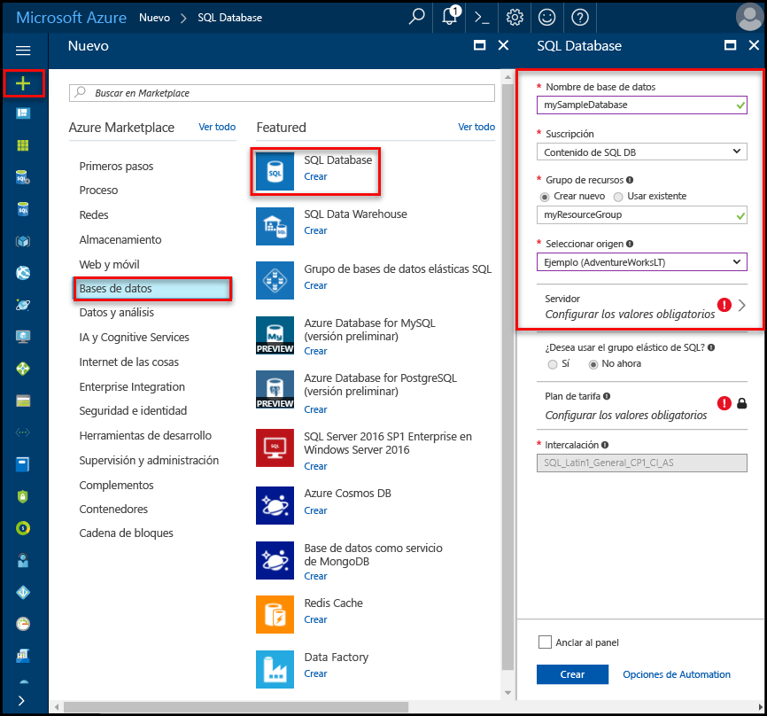

# Creación y administración de servidores y bases de datos de Azure SQL DatabaseCreate and manage Azure SQL Database servers and databases

Una base de datos SQL de Azure es una base de datos administrada de Microsoft Azure creada dentro de un [grupo de recursos de Azure](../azure-resource-manager/resource-group-overview.md) con un conjunto definido de [recursos de proceso y de almacenamiento para diferentes cargas de trabajo](sql-database-service-tiers.md).An Azure SQL database is a managed database in Microsoft Azure that is created within an [Azure resource group](../azure-resource-manager/resource-group-overview.md) with a defined set of [compute and storage resources for different workloads](sql-database-service-tiers.md). Una base de datos SQL de Azure está asociada con un servidor lógico de Azure SQL Database, que se crea dentro de una región específica de Azure.An Azure SQL database is associated with an Azure SQL Database logical server, which is created within a specific Azure region. 

## Una base de datos SQL de Azure puede ser una base de datos única, agrupada o con particionesAn Azure SQL database can be a single, pooled, or partitioned database

Una base de datos SQL de Azure puede ser:An Azure SQL database can be:

- Una base de datos única con su [propio conjunto de recursos](sql-database-what-is-a-dtu.md#what-are-database-transaction-units-dtus) (DTU).A single database with its [own set of resources](sql-database-what-is-a-dtu.md#what-are-database-transaction-units-dtus) (DTUs)
- Parte de un [grupo elástico de SQL](sql-database-elastic-pool.md) que [comparte un conjunto de recursos](sql-database-what-is-a-dtu.md#what-are-elastic-database-transaction-units-edtus) (eDTU).Part of a [SQL elastic pool](sql-database-elastic-pool.md) that [shares a set of resources](sql-database-what-is-a-dtu.md#what-are-elastic-database-transaction-units-edtus) (eDTUs)
- Parte de un [conjunto escalado horizontalmente de bases de datos particionadas](sql-database-elastic-scale-introduction.md#horizontal-and-vertical-scaling), que pueden ser simples o agrupadas.Part of a [scaled-out set of sharded databases](sql-database-elastic-scale-introduction.md#horizontal-and-vertical-scaling), which can be either single or pooled databases
- Parte de un conjunto de bases de datos que participan en un [modelo de diseño de SaaS multiinquilino](sql-database-design-patterns-multi-tenancy-saas-applications.md) y cuyas bases de datos pueden ser simples o agrupadas (o ambas).Part of a set of databases participating in a [multitenant SaaS design pattern](sql-database-design-patterns-multi-tenancy-saas-applications.md), and whose databases can either be single or pooled databases (or both) 

> [!TIP]
> Para conocer los nombres de base de datos válidos, consulte [Database Identifiers](https://docs.microsoft.com/en-us/sql/relational-databases/databases/database-identifiers) (Identificadores de base de datos).For valid database names, see [Database Identifiers](https://docs.microsoft.com/en-us/sql/relational-databases/databases/database-identifiers). 
>
 
- intercalación de base de datos predeterminada de Hello utilizado por la base de datos de SQL de Microsoft Azure es **SQL_LATIN1_GENERAL_CP1_CI_AS**, donde **LATIN1_GENERAL** es inglés (Estados Unidos), **CP1** es la página de códigos 1252, **CI** distingue mayúsculas de minúsculas, y **AS** distingue acentos.hello default database collation used by Microsoft Azure SQL Database is **SQL_LATIN1_GENERAL_CP1_CI_AS**, where **LATIN1_GENERAL** is English (United States), **CP1** is code page 1252, **CI** is case-insensitive, and **AS** is accent-sensitive. Para obtener más información acerca de cómo tooset Hola intercalación, vea [COLLATE (Transact-SQL)](https://msdn.microsoft.com/library/ms184391.aspx).For more information about how tooset hello collation, see [COLLATE (Transact-SQL)](https://msdn.microsoft.com/library/ms184391.aspx).
- La Base de datos SQL de Microsoft Azure admite el cliente de protocolo de secuencia de datos tabular (TDS) en la versión 7.3 o posterior.Microsoft Azure SQL Database supports tabular data stream (TDS) protocol client version 7.3 or later.
- Se permiten únicamente las conexiones TCP/IP.Only TCP/IP connections are allowed.

## ¿Qué es un servidor lógico de Azure SQL?What is an Azure SQL logical server?

Un servidor lógico actúa como punto administrativo central para varias bases de datos, incluidos los [grupos elásticos de SQL](sql-database-elastic-pool.md) , los [inicios de sesión](sql-database-manage-logins.md), las [reglas de firewall](sql-database-firewall-configure.md), las [reglas de auditoría](sql-database-auditing.md), las [directivas de detección de amenazas](sql-database-threat-detection.md) y los [grupos de conmutación por error](sql-database-geo-replication-overview.md).A logical server acts as a central administrative point for multiple databases, including [SQL elastic pools](sql-database-elastic-pool.md) [logins](sql-database-manage-logins.md), [firewall rules](sql-database-firewall-configure.md), [auditing rules](sql-database-auditing.md), [threat detection policies](sql-database-threat-detection.md), and [failover groups](sql-database-geo-replication-overview.md). Un servidor lógico puede estar en una región distinta a la de su grupo de recursos.A logical server can be in a different region than its resource group. servidor lógico Hola debe existir antes de poder crear base de datos de SQL Azure Hola.hello logical server must exist before you can create hello Azure SQL database. Todas las bases de datos en un servidor se crean en hello misma región que el servidor lógico Hola.All databases on a server are created within hello same region as hello logical server. 

> [!IMPORTANT]
> En la base de datos de SQL, un servidor es una construcción lógica que es distinta de una instancia de SQL Server que esté familiarizado con de Hola a todos en local.In SQL Database, a server is a logical construct that is distinct from a SQL Server instance that you may be familiar with in hello on-premises world. En concreto, Hola servicio de base de datos SQL no ofrece ninguna garantía con respecto a la ubicación de las bases de datos de hello relación de los servidores lógicos tootheir y no expone el acceso de nivel de instancia o características.Specifically, hello SQL Database service makes no guarantees regarding location of hello databases in relation tootheir logical servers, and exposes no instance-level access or features.
> 

Cuando se crea un servidor lógico, proporcionar a un servidor de cuenta de inicio de sesión y una contraseña que tenga derechos administrativos toohello base de datos maestra en ese servidor y todas las bases de datos creadas en ese servidor.When you create a logical server, you provide a server login account and password that has administrative rights toohello master database on that server and all databases created on that server. Esta cuenta inicial es una cuenta de inicio de sesión de SQL.This initial account is a SQL login account. Azure SQL Database admite la autenticación de SQL y la autenticación de Azure Active Directory.Azure SQL Database supports SQL authentication and Azure Active Directory Authentication for authentication. Para obtener información sobre inicios de sesión y autenticación, vea [Administrar bases de datos e inicios de sesión en Azure SQL Database](sql-database-manage-logins.md).For information about logins and authentication, see [Managing Databases and Logins in Azure SQL Database](sql-database-manage-logins.md). La autenticación de Windows no es compatible.Windows Authentication is not supported. 

> [!TIP]
> Para conocer cuáles son los nombres de servidor y de grupo de recursos válidos, vea las [reglas y restricciones de nomenclatura](https://docs.microsoft.com/azure/architecture/best-practices/naming-conventions).For valid resource group and server names, see [Naming rules and restrictions](https://docs.microsoft.com/azure/architecture/best-practices/naming-conventions).
>

Un servidor lógico de Azure Database:An Azure Database logical server:

- Se crea dentro de una suscripción de Azure, pero se pueden mover a su suscripción de recursos independiente tooanotherIs created within an Azure subscription, but can be moved with its contained resources tooanother subscription
- Recurso primario de Hola para grupos elásticos, bases de datos y almacenamientos de datosIs hello parent resource for databases, elastic pools, and data warehouses
- Proporciona un espacio de nombres para bases de datos, grupos elásticos y almacenamientos de datos.Provides a namespace for databases, elastic pools, and data warehouses
- Es un contenedor lógico con la semántica de duración seguro - delete Elimina un servidor y lo Hola bases de datos independientes, grupos elásticos y almacenes de datosIs a logical container with strong lifetime semantics - delete a server and it deletes hello contained databases, elastic pools, and data warehouses
- Participa en [control de acceso de Azure basada en roles (RBAC)](/active-directory/role-based-access-control-what-is) -grupos elásticos, bases de datos y almacenamientos de datos dentro de un servidor heredan derechos de acceso del servidor de HolaParticipates in [Azure role-based access control (RBAC)](/active-directory/role-based-access-control-what-is) - databases, elastic pools, and data warehouses within a server inherit access rights from hello server
- Es un elemento de orden superior de identidad de Hola de grupos elásticos, bases de datos y almacenamientos de datos de recursos de Azure con fines de administración (consulte la dirección URL de hello esquema de bases de datos y los grupos)Is a high-order element of hello identity of databases, elastic pools, and data warehouses for Azure resource management purposes (see hello URL scheme for databases and pools)
- Coloca recursos en una región.Collocates resources in a region
- Proporciona un punto de conexión para el acceso a la base de datos (<serverName>. database.windows.net).Provides a connection endpoint for database access (<serverName>.database.windows.net)
- Proporciona acceso toometadata con respecto a los recursos contenidos a través de las DMV por conexión tooa de base de datos maestraProvides access toometadata regarding contained resources via DMVs by connecting tooa master database 
- Proporciona el ámbito de Hola para las directivas de administración que se aplican las bases de datos tooits - inicios de sesión, firewall, auditoría, etcetera, de detección de amenazas.Provides hello scope for management policies that apply tooits databases - logins, firewall, audit, threat detection, etc. 
- Está restringido por una cuota de suscripción de hello primario (seis servidores por suscripción de forma predeterminada, [vea suscripción limita aquí](../azure-subscription-service-limits.md))Is restricted by a quota within hello parent subscription (six servers per subscription by default - [see Subscription limits here](../azure-subscription-service-limits.md))
- Proporciona el ámbito de hello para la cuota de base de datos y la cuota DTU para recursos de Hola que contiene (por ejemplo, DTU 45.000)Provides hello scope for database quota and DTU quota for hello resources it contains (such as 45,000 DTU)
- Es el ámbito de control de versiones de Hola para funciones que se habilitan en recursos independientesIs hello versioning scope for capabilities enabled on contained resources 
- Los inicios de sesión de la entidad de seguridad en el nivel de servidor pueden administrar todas las bases de datos en un servidor.Server-level principal logins can manage all databases on a server
- Puede contener inicios de sesión toothose similar en instancias de SQL Server en su infraestructura local que se les conceda acceso tooone o más bases de datos en el servidor de Hola y puede conceder los derechos administrativos limitados.Can contain logins similar toothose in instances of SQL Server on your premises that are granted access tooone or more databases on hello server, and can be granted limited administrative rights. Para obtener más información, consulte el artículo sobre [inicios de sesión](sql-database-manage-logins.md).For more information, see [Logins](sql-database-manage-logins.md).

## Protección de bases de datos SQL de Azure con el firewall de SQL DatabaseAzure SQL databases protected by SQL Database firewall

toohelp proteger sus datos, un [firewall de base de datos SQL](sql-database-firewall-configure.md) evita que todos los servidores de base de datos de access tooyour o cualquiera de sus bases de datos desde fuera de su servidor de toohello de conexión directamente a través de la conexión de suscripción de Azure.toohelp protect your data, a [SQL Database firewall](sql-database-firewall-configure.md) prevents all access tooyour database server or any of its databases from outside of your connection toohello server directly through your Azure subscription connection. tooenable conectividad adicionales, debe [crear una o varias reglas de firewall](sql-database-firewall-configure.md#creating-and-managing-firewall-rules).tooenable additional connectivity, you must [create one or more firewall rules](sql-database-firewall-configure.md#creating-and-managing-firewall-rules). Para crear y administrar grupos elásticos de SQL, vea [Grupos elásticos](sql-database-elastic-pool.md).For creating and managing SQL elastic pools, see [Elastic pools](sql-database-elastic-pool.md).

## Administrar servidores SQL Azure, las bases de datos y firewalls que usan Hola portal de AzureManage Azure SQL servers, databases, and firewalls using hello Azure portal

Puede crear grupo de recursos de hello Azure base de datos SQL antemano o al crear el propio servidor hello.You can create hello Azure SQL database's resource group ahead of time or while creating hello server itself. Existen varios métodos para obtener el nuevo formato SQL del servidor tooa, mediante la creación de un nuevo servidor de SQL server o como parte de la creación de una base de datos.There are multiple methods for getting tooa new SQL server form, either by creating a new SQL server or as part of creating a new database. 

### Creación de un servidor SQL en blanco (servidor lógico)Create a blank SQL server (logical server)

Hola toocreate un servidor (sin una base de datos) de la base de datos de SQL Azure mediante [portal de Azure](https://portal.azure.com), navegue tooa formulario de servidor (servidor lógico) de SQL en blanco.toocreate an Azure SQL Database server (without a database) using hello [Azure portal](https://portal.azure.com), navigate tooa blank SQL server (logical server) form. Hello captura de pantalla siguiente muestra un método para abrir un formulario toocreate un servidor SQL lógico en blanco.hello following screenshot shows one method for opening a form toocreate a blank logical SQL server. 

   

Si se producen formulario toothis mediante otro método, información de hello en forma de hello es idéntica.If you get toothis form using another method, hello information on hello form is identical.

### Creación de una base de datos SQL de ejemplo o en blancoCreate a blank or sample SQL database

Hola toocreate una base de datos de SQL Azure mediante [portal de Azure](https://portal.azure.com), desplácese tooa formulario de base de datos SQL en blanco y proporcionar Hola la información solicitada.toocreate an Azure SQL database using hello [Azure portal](https://portal.azure.com), navigate tooa blank SQL Database form and provide hello requested information. Puede crear del Hola SQL Azure base de datos grupo de recursos y servidor lógico antes de tiempo o durante la creación de hello propia base de datos.You can create hello Azure SQL database's resource group and logical server ahead of time or while creating hello database itself. Puede crear una base de datos en blanco o de ejemplo basada en Adventure Works LT.You can create a blank database or create a sample database based on Adventure Works LT. 

  

> [IMPORTANTE] Para obtener información sobre la selección de hello tarifa para la base de datos, vea [niveles de servicio](sql-database-service-tiers.md).[IMPORTANT] For information on selecting hello pricing tier for your database, see [Service tiers](sql-database-service-tiers.md).
>

### Administración de un servidor SQL Server existenteManage an existing SQL server

toomanage un servidor existente, navegue a servidor toohello mediante una serie de métodos - como los datos de página de base de datos SQL específica, hello **servidores SQL Server** página o hello **todos los recursos** página.toomanage an existing server, navigate toohello server using a number of methods - such as from specific SQL database page, hello **SQL servers** page, or hello **All resources** page. Hola siguiente captura de pantalla muestra cómo toobegin configurar un firewall de nivel de servidor desde hello **Introducción** página para un servidor.hello following screenshot shows how toobegin setting a server-level firewall from hello **Overview** page for a server. 

   

toomanage una base de datos existente, navegue toohello **bases de datos SQL** página y haga clic en la base de datos de hello desea toomanage.toomanage an existing database, navigate toohello **SQL databases** page and click hello database you wish toomanage. Hola siguiente captura de pantalla muestra cómo toobegin configurar un firewall de nivel de servidor para una base de datos desde hello **Introducción** página para una base de datos.hello following screenshot shows how toobegin setting a server-level firewall for a database from hello **Overview** page for a database. 

    

> [!IMPORTANT]
> propiedades de rendimiento tooconfigure para una base de datos, vea [niveles de servicio](sql-database-service-tiers.md).tooconfigure performance properties for a database, see [Service tiers](sql-database-service-tiers.md).
>

> [!TIP]
> Para obtener un tutorial de inicio rápido de Azure portal, consulte [crear una base de datos de SQL Azure en el portal de Azure hello](sql-database-get-started-portal.md).For an Azure portal quick start tutorial, see [Create an Azure SQL database in hello Azure portal](sql-database-get-started-portal.md).
>

## Administración de servidores, bases de datos y firewalls de Azure SQL con PowerShellManage Azure SQL servers, databases, and firewalls using PowerShell

toocreate y administrar servidores de SQL Azure, las bases de datos y los servidores de seguridad con Azure PowerShell, use Hola siguientes cmdlets de PowerShell.toocreate and manage Azure SQL server, databases, and firewalls with Azure PowerShell, use hello following PowerShell cmdlets. Si necesita tooinstall o actualice PowerShell, consulte [módulo instalar Azure PowerShell](/powershell/azure/install-azurerm-ps).If you need tooinstall or upgrade PowerShell, see [Install Azure PowerShell module](/powershell/azure/install-azurerm-ps). Para crear y administrar grupos elásticos de SQL, vea [Grupos elásticos](sql-database-elastic-pool.md).For creating and managing SQL elastic pools, see [Elastic pools](sql-database-elastic-pool.md).

| CmdletCmdlet | DescripciónDescription |
| --- | --- |
|[New-AzureRmSqlDatabaseNew-AzureRmSqlDatabase](/powershell/module/azurerm.sql/new-azurermsqldatabase)|Crea una base de datos.Creates a database |
|[Get-AzureRmSqlDatabaseGet-AzureRmSqlDatabase](/powershell/module/azurerm.sql/get-azurermsqldatabase)|Obtiene una o más bases de datos.Gets one or more databases|
|[Set-AzureRmSqlDatabaseSet-AzureRmSqlDatabase](/powershell/module/azurerm.sql/set-azurermsqldatabase)|Establece las propiedades de una base de datos, o mueve una base de datos existente en un grupo elástico.Sets properties for a database, or moves an existing database into an elastic pool|
|[Remove-AzureRmSqlDatabaseRemove-AzureRmSqlDatabase](/powershell/module/azurerm.sql/remove-azurermsqldatabase)|Quita una base de datos.Removes a database|
|[New-AzureRmResourceGroupNew-AzureRmResourceGroup](/powershell/module/azurerm.resources/new-azurermresourcegroup)|Crea un grupo de recursos.Creates a resource group]
|[New-AzureRmSqlServerNew-AzureRmSqlServer](/powershell/module/azurerm.sql/new-azurermsqlserver)|Crea un servidor.Creates a  server|
|[Get-AzureRmSqlServerGet-AzureRmSqlServer](/powershell/module/azurerm.sql/get-azurermsqlserver)|Devuelve información sobre los servidores.Returns information about servers|
|[Set-AzureRmSqlServerSet-AzureRmSqlServer](https://docs.microsoft.com/en-us/powershell/module/azurerm.sql/set-azurermsqlserver)|Modifica las propiedades de un servidor.Modifies properties of a server|
|[Remove-AzureRmSqlServerRemove-AzureRmSqlServer](/powershell/module/azurerm.sql/remove-azurermsqlserver)|Quita un servidor.Removes a server|
|[New-AzureRmSqlServerFirewallRuleNew-AzureRmSqlServerFirewallRule](/powershell/module/azurerm.sql/new-azurermsqlserverfirewallrule)|Crea una regla de firewall de nivel de servidor.Creates a server-level firewall rule |
|[Get-AzureRmSqlServerFirewallRuleGet-AzureRmSqlServerFirewallRule](/powershell/module/azurerm.sql/get-azurermsqlserverfirewallrule)|Obtiene reglas de firewall para un servidorGets firewall rules for a server|
|[Set-AzureRmSqlServerFirewallRuleSet-AzureRmSqlServerFirewallRule](/powershell/module/azurerm.sql/set-azurermsqlserverfirewallrule)|Modifica una regla de firewall en un servidor.Modifies a firewall rule in a server|
|[Remove-AzureRmSqlServerFirewallRuleRemove-AzureRmSqlServerFirewallRule](/powershell/module/azurerm.sql/remove-azurermsqlserverfirewallrule)|Obtiene una regla de firewall de un servidor.Deletes a firewall rule from a server.|

> [!TIP]
> Para obtener un tutorial de inicio rápido de PowerShell, vea [Creación de una sola instancia de Azure SQL Database con PowerShell](sql-database-get-started-portal.md).For a PowerShell quick start tutorial, see [Create a single Azure SQL database using PowerShell](sql-database-get-started-portal.md). Para los scripts de ejemplo de PowerShell, consulte [toocreate de PowerShell de usar una instancia única de SQL Azure la base de datos y configurar una regla de firewall](scripts/sql-database-create-and-configure-database-powershell.md) y [Monitor y escala una instancia única de SQL de base de datos mediante PowerShell](scripts/sql-database-monitor-and-scale-database-powershell.md).For PowerShell example scripts, see [Use PowerShell toocreate a single Azure SQL database and configure a firewall rule](scripts/sql-database-create-and-configure-database-powershell.md) and [Monitor and scale a single SQL database using PowerShell](scripts/sql-database-monitor-and-scale-database-powershell.md).
>

## Administrar servidores SQL Azure, las bases de datos y firewalls que usan Hola CLI de AzureManage Azure SQL servers, databases, and firewalls using hello Azure CLI

toocreate y administrar servidores SQL Azure, las bases de datos y los servidores de seguridad con hello [CLI de Azure](/cli/azure/overview), utilice Hola siguiente [base de datos de SQL Azure CLI](/cli/azure/sql/db) comandos.toocreate and manage Azure SQL server, databases, and firewalls with hello [Azure CLI](/cli/azure/overview), use hello following [Azure CLI SQL Database](/cli/azure/sql/db) commands. Hola de uso [Shell en la nube](/azure/cloud-shell/overview) toorun Hola CLI en el explorador, o [instalar](/cli/azure/install-azure-cli) en Windows, Linux o Mac OS.Use hello [Cloud Shell](/azure/cloud-shell/overview) toorun hello CLI in your browser, or [install](/cli/azure/install-azure-cli) it on macOS, Linux, or Windows. Para crear y administrar grupos elásticos de SQL, vea [Grupos elásticos](sql-database-elastic-pool.md).For creating and managing SQL elastic pools, see [Elastic pools](sql-database-elastic-pool.md).

| CmdletCmdlet | DescripciónDescription |
| --- | --- |
|[az sql db createaz sql db create](/cli/azure/sql/db#create) |Crea una base de datos.Creates a database|
|[az sql db listaz sql db list](/cli/azure/sql/db#list)|Enumera todas las bases de datos y almacenes de datos de un servidor, o todas las bases de datos de un grupo elástico.Lists all databases and data warehouses in a server, or all databases in an elastic pool|
|[az sql db list-editionsaz sql db list-editions](/cli/azure/sql/db#list-editions)|Enumera los objetivos de servicio y los límites de almacenamiento disponibles.Lists available service objectives and storage limits|
|[az sql db list-usagesaz sql db list-usages](/cli/azure/sql/db#list-usages)|Devuelve los usos de la base de datos.Returns database usages|
|[az sql db showaz sql db show](/cli/azure/sql/db#show)|Obtiene una base de datos o un almacenamiento de datos.Gets a database or data warehouse|
|[az sql db updateaz sql db update](/cli/azure/sql/db#update)|Actualiza una base de datos.Updates a database|
|[az sql db deleteaz sql db delete](/cli/azure/sql/db#delete)|Quita una base de datos.Removes a database|
|[az group createaz group create](/cli/azure/group#create)|Crea un grupo de recursos.Creates a resource group|
|[az sql server createaz sql server create](/cli/azure/sql/server#create)|Crea un servidor.Creates a server|
|[az sql server listaz sql server list](/cli/azure/sql/server#list)|Enumera los servidores.Lists servers|
|[az sql server list-usagesaz sql server list-usages](/cli/azure/sql/server#list-usages)|Devuelve los usos del servidor.Returns  server usages|
|[az sql server showaz sql server show](/cli/azure/sql/server#show)|Obtiene un servidor.Gets a server|
|[az sql server updateaz sql server update](/cli/azure/sql/server#update)|Actualiza un servidor.Updates a server|
|[az sql server deleteaz sql server delete](/cli/azure/sql/server#delete)|Permite eliminar un servidor.Deletes a server|
|[az sql server firewall-rule createaz sql server firewall-rule create](/cli/azure/sql/server/firewall-rule#create)|Crea una regla de firewall del servidor.Creates a server firewall rule|
|[az sql server firewall-rule listaz sql server firewall-rule list](/cli/azure/sql/server/firewall-rule#list)|Enumera las reglas de firewall de hello en un servidorLists hello firewall rules on a server|
|[az sql server firewall-rule showaz sql server firewall-rule show](/cli/azure/sql/server/firewall-rule#show)|Muestra los detalles de Hola de una regla de firewallShows hello detail of a firewall rule|
|[az sql server firewall-rule updateaz sql server firewall-rule update](/cli/azure/sql/server/firewall-rule#update)|Actualiza una regla de firewall.Updates a firewall rule|
|[az sql server firewall-rule deleteaz sql server firewall-rule delete](/cli/azure/sql/server/firewall-rule#delete)|Elimina una regla de firewall.Deletes a firewall rule|

> [!TIP]
> Para obtener un tutorial de inicio rápido de CLI de Azure, consulte [crear una base de datos de SQL Azure único con hello Azure CLI](sql-database-get-started-cli.md).For an Azure CLI quick start tutorial, see [Create a single Azure SQL database using hello Azure CLI](sql-database-get-started-cli.md). Para los scripts de ejemplo de CLI de Azure, consulte [toocreate de CLI de usar una instancia única de SQL Azure la base de datos y configurar una regla de firewall](scripts/sql-database-create-and-configure-database-cli.md) y [toomonitor de CLI de uso y la escala una sola base de datos SQL](scripts/sql-database-monitor-and-scale-database-cli.md).For Azure CLI example scripts, see [Use CLI toocreate a single Azure SQL database and configure a firewall rule](scripts/sql-database-create-and-configure-database-cli.md) and [Use CLI toomonitor and scale a single SQL database](scripts/sql-database-monitor-and-scale-database-cli.md).
>

## Administración de servidores, bases de datos y firewalls de Azure SQL con Transact-SQLManage Azure SQL servers, databases, and firewalls using Transact-SQL

toocreate y administrar servidores de SQL Azure, las bases de datos y los servidores de seguridad con Transact-SQL, utilice Hola siga los comandos de T-SQL.toocreate and manage Azure SQL server, databases, and firewalls with Transact-SQL, use hello following T-SQL commands. Puede emitir estos comandos mediante el portal de Azure, Hola [SQL Server Management Studio](/sql/ssms/use-sql-server-management-studio), [código de Visual Studio](https://code.visualstudio.com/docs), o cualquier otro programa que se puede conectar el servidor de base de datos de SQL Azure tooan y pasar Transact-SQL comandos.You can issue these commands using hello Azure portal, [SQL Server Management Studio](/sql/ssms/use-sql-server-management-studio), [Visual Studio Code](https://code.visualstudio.com/docs), or any other program that can connect tooan Azure SQL Database server and pass Transact-SQL commands. Para administrar grupos elásticos de SQL, consulte [Grupos elásticos](sql-database-elastic-pool.md).For managing SQL elastic pools, see [Elastic pools](sql-database-elastic-pool.md).

> [!IMPORTANT]
> No se puede crear ni eliminar un servidor mediante Transact-SQL.You cannot create or delete a server using Transact-SQL.
>

| ComandoCommand | DescripciónDescription |
| --- | --- |
|[CREATE DATABASE (Azure SQL Database)CREATE DATABASE (Azure SQL Database)](/sql/t-sql/statements/create-database-azure-sql-database)|Crear una base de datos.Creates a new database. Debe ser toocreate de base de datos maestra toohello conectada una nueva base de datos.You must be connected toohello master database toocreate a new database.|
| [ALTER DATABASE (Base de datos SQL de Azure)ALTER DATABASE (Azure SQL Database)](/sql/t-sql/statements/alter-database-azure-sql-database) |Modifica una base de datos SQL de Azure.Modifies an Azure SQL database. |
|[ALTER DATABASE (Azure SQL Data Warehouse)ALTER DATABASE (Azure SQL Data Warehouse)](/sql/t-sql/statements/alter-database-azure-sql-data-warehouse)|Modifica una instancia de Azure SQL Data Warehouse.Modifies an Azure SQL Data Warehouse.|
|[DROP DATABASE (Transact-SQL)DROP DATABASE (Transact-SQL)](/sql/t-sql/statements/drop-database-transact-sql)|Permite eliminar una base de datos.Deletes a database.|
|[sys.database_service_objectives (Azure SQL Database)sys.database_service_objectives (Azure SQL Database)](/sql/relational-databases/system-catalog-views/sys-database-service-objectives-azure-sql-database)|Devuelve Hola edition (nivel de servicio), el objetivo de servicio (nivel de precios) y el nombre del grupo elástico, si existe, para una base de datos de SQL Azure o un almacén de datos de SQL Azure.Returns hello edition (service tier), service objective (pricing tier), and elastic pool name, if any, for an Azure SQL database or an Azure SQL Data Warehouse. Si una sesión en la base de datos maestra toohello en un servidor de base de datos de SQL Azure, devuelve información sobre todas las bases de datos.If logged on toohello master database in an Azure SQL Database server, returns information on all databases. Para almacenamiento de datos de SQL Azure, debe ser toohello conectado la base de datos maestra.For Azure SQL Data Warehouse, you must be connected toohello master database.|
|[sys.dm_db_resource_stats (Azure SQL Database)sys.dm_db_resource_stats (Azure SQL Database)](/sql/relational-databases/system-dynamic-management-views/sys-dm-db-resource-stats-azure-sql-database)| Devuelve el consumo de CPU, E/S y memoria para una base de datos de Azure SQL Database.Returns CPU, I/O, and memory consumption for an Azure SQL Database database. Hay una fila para cada 15 segundos, incluso si no hay ninguna actividad en la base de datos de Hola.One row exists for every 15 seconds, even if there is no activity in hello database.|
|[sys.resource_stats (Azure SQL Database)sys.resource_stats (Azure SQL Database)](/sql/relational-databases/system-catalog-views/sys-resource-stats-azure-sql-database)|Devuelve datos de almacenamiento y uso de CPU para una instancia de Azure SQL Database.Returns CPU usage and storage data for an Azure SQL Database. datos de Hola se recopilan y se agregan en intervalos de cinco minutos.hello data is collected and aggregated within five-minute intervals.|
|[sys.database_connection_stats (Azure SQL Database)sys.database_connection_stats (Azure SQL Database)](/sql/relational-databases/system-catalog-views/sys-database-connection-stats-azure-sql-database)|Contiene estadísticas de eventos de conectividad de base de datos de SQL Database, que proporcionan una visión general de los aciertos y errores de conexión a la base de datos.Contains statistics for SQL Database database connectivity events, providing an overview of database connection successes and failures. |
|[sys.event_log (Azure SQL Database)sys.event_log (Azure SQL Database)](/sql/relational-databases/system-catalog-views/sys-event-log-azure-sql-database)|Devuelve las conexiones realizadas correctamente a la base de datos de Azure SQL Database, los errores de conexión y los interbloqueos.Returns successful Azure SQL Database database connections, connection failures, and deadlocks. Puede usar este tootrack información o solucionar problemas de la actividad de base de datos con la base de datos SQL.You can use this information tootrack or troubleshoot your database activity with SQL Database.|
|[sp_set_firewall_rule (Azure SQL Database)sp_set_firewall_rule (Azure SQL Database)](/sql/relational-databases/system-stored-procedures/sp-set-firewall-rule-azure-sql-database)|Crea o actualiza la configuración de firewall de nivel de servidor hello para el servidor de base de datos SQL.Creates or updates hello server-level firewall settings for your SQL Database server. Este procedimiento almacenado solo está disponible en hello base de datos maestra toohello nivel de servidor inicio de sesión principal.This stored procedure is only available in hello master database toohello server-level principal login. Solo se puede crear una regla de firewall de nivel de servidor mediante Transact-SQL una vez creada la primera regla de firewall de nivel de servidor hello por un usuario con permisos de nivel de AzureA server-level firewall rule can only be created using Transact-SQL after hello first server-level firewall rule has been created by a user with Azure-level permissions|
|[sys.firewall_rules (Azure SQL Database)sys.firewall_rules (Azure SQL Database)](/sql/relational-databases/system-catalog-views/sys-firewall-rules-azure-sql-database)|Devuelve información sobre la configuración del firewall de nivel de servidor hello asociada con la base de datos de SQL de Microsoft Azure.Returns information about hello server-level firewall settings associated with your Microsoft Azure SQL Database.|
|[sp_delete_firewall_rule (Azure SQL Database)sp_delete_firewall_rule (Azure SQL Database)](/sql/relational-databases/system-stored-procedures/sp-delete-firewall-rule-azure-sql-database)|Quita la configuración del firewall de nivel de servidor del servidor de SQL Database.Removes server-level firewall settings from your SQL Database server. Este procedimiento almacenado solo está disponible en hello base de datos maestra toohello nivel de servidor inicio de sesión principal.This stored procedure is only available in hello master database toohello server-level principal login.|
|[sp_set_database_firewall_rule (Azure SQL Database)sp_set_database_firewall_rule (Azure SQL Database)](/sql/relational-databases/system-stored-procedures/sp-set-database-firewall-rule-azure-sql-database)|Crea o actualiza las reglas de firewall de nivel de base de datos de Hola para su base de datos de SQL Azure o el almacenamiento de datos SQL.Creates or updates hello database-level firewall rules for your Azure SQL Database or SQL Data Warehouse. Las reglas de firewall de base de datos pueden configurarse para la base de datos maestra de Hola y de bases de datos de usuario de base de datos SQL.Database firewall rules can be configured for hello master database, and for user databases on SQL Database. Las reglas de firewall de base de datos son útiles cuando se usan usuarios de base de datos independientes.Database firewall rules are useful when using contained database users. |
|[sys.database_firewall_rules (Azure SQL Database)sys.database_firewall_rules (Azure SQL Database)](/sql/relational-databases/system-catalog-views/sys-database-firewall-rules-azure-sql-database)|Devuelve información acerca de la configuración de firewall de nivel de base de datos de hello asociado a la base de datos de SQL de Microsoft Azure.Returns information about hello database-level firewall settings associated with your Microsoft Azure SQL Database. |
|[sp_delete_database_firewall_rule (Azure SQL Database)sp_delete_database_firewall_rule (Azure SQL Database)](/sql/relational-databases/system-stored-procedures/sp-delete-database-firewall-rule-azure-sql-database)|Quita las reglas de firewall de nivel de base de datos de la instancia de Azure SQL Database o SQL Data Warehouse.Removes database-level firewall setting from your Azure SQL Database or SQL Data Warehouse. |

> [!TIP]
> Para el tutorial de inicio rápido con SQL Server Management Studio en Microsoft Windows, consulte [base de datos de SQL Azure: Use SQL Server Management Studio tooconnect y consultar datos](sql-database-connect-query-ssms.md).For quick start tutorial using SQL Server Management Studio on Microsoft Windows, see [Azure SQL Database: Use SQL Server Management Studio tooconnect and query data](sql-database-connect-query-ssms.md). Para obtener un tutorial de inicio rápido con código de Visual Studio en Windows, Linux o macOS hello, consulte [base de datos de SQL Azure: usar Visual Studio Code tooconnect y consultar datos](sql-database-connect-query-vscode.md).For a quick start tutorial using Visual Studio Code on hello macOS, Linux, or Windows, see [Azure SQL Database: Use Visual Studio Code tooconnect and query data](sql-database-connect-query-vscode.md).

## Administrar servidores SQL Azure, las bases de datos y firewalls con la API de REST de HolaManage Azure SQL servers, databases, and firewalls using hello REST API

toocreate y administrar servidores de SQL Azure, las bases de datos y servidores de seguridad mediante API de REST de hello, consulte [API de REST de base de datos de SQL Azure](/rest/api/sql/).toocreate and manage Azure SQL server, databases, and firewalls using hello REST API, see [Azure SQL Database REST API](/rest/api/sql/).

## Pasos siguientesNext steps

- toolearn sobre la agrupación de bases de datos de uso de grupos elásticos de SQL, consulte [grupos elásticos](sql-database-elastic-pool.md).toolearn about pooling databases using SQL elastic pools, see [Elastic pools](sql-database-elastic-pool.md).
- Para obtener información acerca de hello servicio de base de datos de SQL Azure, consulte [¿qué es la base de datos SQL?](sql-database-technical-overview.md).For information about hello Azure SQL Database service, see [What is SQL Database?](sql-database-technical-overview.md).
- toolearn sobre cómo migrar un tooAzure de base de datos de SQL Server, vea [migrar la base de datos SQL tooAzure](sql-database-cloud-migrate.md).toolearn about migrating a SQL Server database tooAzure, see [Migrate tooAzure SQL Database](sql-database-cloud-migrate.md).
- Para obtener información sobre las características admitidas, consulte el [artículo que trata sobre dicho tema](sql-database-features.md).For information about supported features, see [Features](sql-database-features.md).
