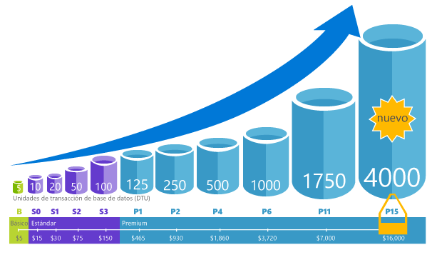
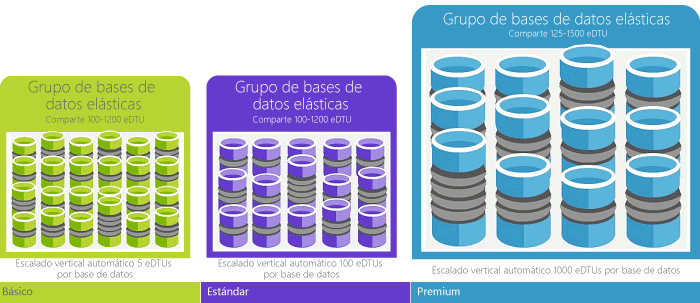

# ¿Qué es el servicio de base de datos de SQL Azure Hola?What is hello Azure SQL Database service? 

SQL Database es un servicio de base de datos relacional de uso general de Microsoft Azure que admite estructuras como datos relacionales, JSON, espacial y XML.SQL Database is a general-purpose relational database service in Microsoft Azure that supports structures such as relational data, JSON, spatial, and XML. Proporciona [un rendimiento escalable dinámicamente](sql-database-service-tiers.md) y opciones como [índices de almacén de columnas](https://docs.microsoft.com/sql/relational-databases/indexes/columnstore-indexes-overview) para realizar un análisis analítico extremo y generar informes, y [OLTP en memoria](sql-database-in-memory.md) para el procesamiento extremo de transacciones.It delivers [dynamically scalable performance](sql-database-service-tiers.md) and provides options such as [columnstore indexes](https://docs.microsoft.com/sql/relational-databases/indexes/columnstore-indexes-overview) for extreme analytic analysis and reporting, and [in-memory OLTP](sql-database-in-memory.md) for extreme transactional processing. Microsoft administra todas las correcciones y actualización de base de código SQL Hola sin problemas y abstrae toda la administración de la infraestructura subyacente de Hola.Microsoft handles all patching and updating of hello SQL code base seamlessly and abstracts away all management of hello underlying infrastructure. 

Base de datos SQL comparte su base de código con hello [el motor de base de datos de Microsoft SQL Server](https://docs.microsoft.com/sql/sql-server/sql-server-technical-documentation).SQL Database shares its code base with hello [Microsoft SQL Server database engine](https://docs.microsoft.com/sql/sql-server/sql-server-technical-documentation). Con la estrategia de primero en la nube de Microsoft, capacidades más recientes de Hola de SQL Server son tooSQL primer lanzamiento base de datos y, a continuación, tooSQL propio servidor.With Microsoft's cloud-first strategy, hello newest capabilities of SQL Server are released first tooSQL Database, and then tooSQL Server itself. Este enfoque proporciona hello las capacidades de SQL Server más recientes con ninguna sobrecarga para aplicar una revisión o actualización - y con estas nuevas características probarse en millones de bases de datos.This approach provides you with hello newest SQL Server capabilities with no overhead for patching or upgrading - and with these new features tested across millions of databases. Para obtener información acerca de las nuevas funcionalidades, consulte:For information about new capabilities as they are announced, see:

- **[Guía básica de Azure de la base de datos SQL](https://azure.microsoft.com/roadmap/?category=databases)**: un toofind lugar ' s new y qué viene a continuación siguiente.**[Azure Roadmap for SQL Database](https://azure.microsoft.com/roadmap/?category=databases)**: A place toofind out what’s new and what’s coming next. 
- **[Blog de Azure SQL Database](https://azure.microsoft.com/blog/topics/database)**: el lugar en el que los miembros del equipo de producto de SQL Server escriben entradas acerca de las noticias y características de SQL Database.**[Azure SQL Database blog](https://azure.microsoft.com/blog/topics/database)**: A place where SQL Server product team members blog about SQL Database news and features. 

SQL Database ofrece un rendimiento predecible en varios niveles de servicio que proporciona escalabilidad dinámica sin tiempo de inactividad, optimización inteligente integrada, escalabilidad y disponibilidad globales, y opciones de seguridad avanzadas (todo ello casi sin necesidad de administración).SQL Database delivers predictable performance at multiple service levels that provides dynamic scalability with no downtime, built-in intelligent optimization, global scalability and availability, and advanced security options — all with near-zero administration. Estas capacidades permiten toofocus en desarrollo de aplicaciones rápida y acelerar su toomarket de tiempo, en lugar de asignar un tiempo muy valioso y máquinas virtuales de toomanaging de recursos y la infraestructura.These capabilities allow you toofocus on rapid app development and accelerating your time toomarket, rather than allocating precious time and resources toomanaging virtual machines and infrastructure. Hola servicio está actualmente en 38 datos de base de datos de SQL centra en Hola a todos, con más centros de datos con regularidad, ponga en línea que le permite toorun la base de datos en un centro de datos cerca de usted.hello SQL Database service is currently in 38 data centers around hello world, with more data centers coming online regularly, which enables you toorun your database in a data center near you.

> [!NOTE]
> Para obtener información acerca de la plataforma de seguridad de Azure, consulte [Centro de confianza de Azure](https://azure.microsoft.com/support/trust-center/security/).See [Azure Trust Center](https://azure.microsoft.com/support/trust-center/security/) for information about Azure's platform security.
>

## Grupos y rendimiento escalableScalable performance and pools

Con SQL Database, cada base de datos está aislada de las demás y es portátil, cada una con su propio [nivel de servicio](sql-database-service-tiers.md) con un nivel de rendimiento garantizado.With SQL Database, each database is isolated from each other and portable, each with its own [service tier](sql-database-service-tiers.md) with a guaranteed performance level. Base de datos SQL proporciona diferentes niveles de rendimiento para distintas necesidades y permite que las bases de datos toobe toomaximize agrupados Hola el uso de recursos y ahorrar dinero.SQL Database provides different performance levels for different needs, and enables databases toobe pooled toomaximize hello use of resources and save money.

### Ajuste del rendimiento y escalabilidad sin tiempo de inactividadAdjust performance and scale without downtime

Base de datos SQL ofrece cuatro niveles de servicio, las cargas de trabajo de base de datos de toosupport tooheavyweight ligera: Basic, Standard, Premium y RS Premium.SQL Database offers four service tiers toosupport lightweight tooheavyweight database workloads: Basic, Standard, Premium, and Premium RS. Puede crear su primera aplicación en una base de datos pequeño, único en un bajo costo por mes y, a continuación, cambiar su nivel de servicio manualmente o mediante programación a cualquier necesidad de hello toomeet de tiempo de la solución.You can build your first app on a small, single database at a low cost per month and then change its service tier manually or programmatically at any time toomeet hello needs of your solution. Puede ajustar el rendimiento sin tiempo de inactividad tooyour aplicación o tooyour los clientes.You can adjust performance without downtime tooyour app or tooyour customers. Habilita la escalabilidad dinámica su base de datos tootransparently responder toorapidly cambiar los requisitos de recursos y habilita tooonly se paga por los recursos de Hola que necesite cuando los necesite.Dynamic scalability enables your database tootransparently respond toorapidly changing resource requirements and enables you tooonly pay for hello resources that you need when you need them.

   

### Utilización de recursos de toomaximize grupos elásticosElastic pools toomaximize resource utilization

Para muchas empresas y aplicaciones, que se pueda toocreate bases de datos únicos y marcado rendimiento hacia arriba o hacia abajo a petición es suficiente, especialmente si los patrones de uso son relativamente predecibles.For many businesses and applications, being able toocreate single databases and dial performance up or down on demand is enough, especially if usage patterns are relatively predictable. Pero si tiene patrones de uso imprevistos, puede hacer los costos de disco duro toomanage y su modelo empresarial.But if you have unpredictable usage patterns, it can make it hard toomanage costs and your business model. [Grupos elásticos](sql-database-elastic-pool.md) está diseñada toosolve este problema.[Elastic pools](sql-database-elastic-pool.md) are designed toosolve this problem. concepto de Hello es sencillo.hello concept is simple. Asignar el grupo de tooa de recursos de rendimiento en lugar de una base de datos individual y pagar para recursos de rendimiento colectivo de Hola de agrupación de hello en lugar de rendimiento de la base de datos único.You allocate performance resources tooa pool rather than an individual database, and pay for hello collective performance resources of hello pool rather than for single database performance. 

   

Con grupos elásticos, no es necesario toofocus para marcar rendimiento de base de datos hacia arriba y abajo a medida que varía la demanda de recursos.With elastic pools, you don’t need toofocus on dialing database performance up and down as demand for resources fluctuates. Hello las bases de datos agrupados consumen recursos de rendimiento de Hola de grupo elástico de Hola según sea necesario.hello pooled databases consume hello performance resources of hello elastic pool as needed. Las bases de datos agrupados consumen pero no superan los límites de hello del bloque de hello, por lo que el costo sigue siendo predecible incluso si no hace uso de la base de datos individuales.Pooled databases consume but don’t exceed hello limits of hello pool, so your cost remains predictable even if individual database usage doesn’t. ¿Qué es más, también puede [agregar y quitar el grupo de servidores de bases de datos toohello](sql-database-elastic-pool-manage-portal.md), ajuste de escala en la aplicación de una serie de toothousands de las bases de datos, todo ello en un presupuesto que usted controla.What’s more, you can [add and remove databases toohello pool](sql-database-elastic-pool-manage-portal.md), scaling your app from a handful of databases toothousands, all within a budget that you control. También puede mínimo de control Hola y Hola de recursos máximos disponibles toodatabases en hello grupo tooensure que ninguna base de datos en bloque de hello usa todos los recursos del grupo y que cada base de datos agrupado tiene una cantidad mínima garantizada de recursos.You can also control hello minimum and maximum resources available toodatabases in hello pool tooensure that no database in hello pool uses all hello pool resources and that every pooled database has a guaranteed minimum amount of resources. toolearn más información acerca de los patrones de diseño para aplicaciones de SaaS con grupos elásticos, consulte [patrones de diseño para aplicaciones de SaaS multiempresa con base de datos de SQL](sql-database-design-patterns-multi-tenancy-saas-applications.md).toolearn more about design patterns for SaaS applications using elastic pools, see [Design Patterns for Multi-tenant SaaS Applications with SQL Database](sql-database-design-patterns-multi-tenancy-saas-applications.md).

### Fusión de bases de datos únicas con bases de datos en gruposBlend single databases with pooled databases

Independientemente de lo que use (bases de datos únicas o grupos elásticos) no se encontrará bloqueado.Either way you go — single databases or elastic pools — you are not locked in. Puede fusionar las bases de datos únicos con grupos elásticos y cambiar los niveles de servicio de Hola de bases de datos únicas y grupos elásticos rápida y fácilmente tooadapt tooyour situación.You can blend single databases with elastic pools, and change hello service tiers of single databases and elastic pools quickly and easily tooadapt tooyour situation. Con power hello y alcance de Azure, es posible a combinación-y-match otro Azure servicios con la aplicación única diseñar sus necesidades, unidad de costo y las eficiencias de recursos de toomeet de base de datos SQL y desbloquear nuevas oportunidades de negocio.With hello power and reach of Azure, you can mix-and-match other Azure services with SQL Database toomeet your unique app design needs, drive cost and resource efficiencies, and unlock new business opportunities.

### Extensas funcionalidades de supervisión y alertaExtensive monitoring and alerting capabilities

Pero, ¿cómo se puede comparar rendimiento relativo de Hola de bases de datos únicas y grupos elásticos?But how can you compare hello relative performance of single databases and elastic pools? ¿Cómo sabrá Hola integral haga clic cuando marque arriba y abajo?How do you know hello right click-stop when you dial up and down? Usar hello [supervisión de rendimiento integrado](sql-database-performance.md) y [alertas](sql-database-insights-alerts-portal.md) herramientas, combinadas con una clasificación de rendimiento Hola tomando como base [unidades de transacción de base de datos (Dtu) para bases de datos únicos y Dtu elásticas (Edtu) para grupos elásticos](sql-database-what-is-a-dtu.md).You use hello [built-in performance monitoring](sql-database-performance.md) and [alerting](sql-database-insights-alerts-portal.md) tools, combined with hello performance ratings based on [Database Transaction Units (DTUs) for single databases and elastic DTUs (eDTUs) for elastic pools](sql-database-what-is-a-dtu.md). Uso de estas herramientas, puede evaluar rápidamente impacto Hola de escalar verticalmente en función de su suscripción actual o se proyecta necesidades de rendimiento.Using these tools, you can quickly assess hello impact of scaling up or down based on your current or project performance needs. Para más detalles, consulte [Opciones y rendimiento de SQL Database: comprender lo que está disponible en cada nivel de servicio](sql-database-service-tiers.md) .See [SQL Database options and performance: Understand what's available in each service tier](sql-database-service-tiers.md) for details.

Además, SQL Database puede [emitir métricas y registros de diagnóstico](sql-database-metrics-diag-logging.md) para facilitar la supervisión.Additionally, SQL Database can [emit metrics and diagnostic logs](sql-database-metrics-diag-logging.md) for easier monitoring. Puede configurar el uso de recursos de base de datos SQL toostore, los trabajadores y sesiones y conectividad en uno de estos recursos de Azure:You can configure SQL Database toostore resource usage, workers and sessions, and connectivity into one of these Azure resources:

- **Azure Storage**: para archivar grandes cantidades de telemetría a un pequeño precio**Azure Storage**: For archiving vast amounts of telemetry for a small price
- **Azure Event Hub**: para integrar la telemetría de SQL Database con una solución de supervisión personalizada o canalizaciones activas**Azure Event Hub**: For integrating SQL Database telemetry with your custom monitoring solution or hot pipelines
- **Azure Log Analytics**: para la solución de supervisión integrada con funcionalidades de generación de informes, alertas y mitigación**Azure Log Analytics**: For built-in monitoring solution with reporting, alerting, and mitigating capabilities

    

## Funcionalidades de disponibilidadAvailability capabilities

El contrato de nivel de servicio [(SLA)](http://azure.microsoft.com/support/legal/sla/)de Azure de disponibilidad del 99,99 %, líder del sector, con la tecnología de una red global de centros de datos administrados por Microsoft, ayuda a mantener las aplicaciones en funcionamiento de forma ininterrumpida.Azure's industry leading 99.99% availability service level agreement [(SLA)](http://azure.microsoft.com/support/legal/sla/), powered by a global network of Microsoft-managed datacenters, helps keep your app running 24/7. Además, SQL Database proporciona características de [continuidad empresarial y escalabilidad global](sql-database-business-continuity.md) integradas, entre las que se incluyen:In addition, SQL Database provides built-in [business continuity and global scalability](sql-database-business-continuity.md) features, including:

- **[Copias de seguridad automáticas](sql-database-automated-backups.md)**: SQL Database realiza automáticamente copias de seguridad completas, diferenciales y del registro de transacciones.**[Automatic backups](sql-database-automated-backups.md)**: SQL Database automatically performs full, differential, and transaction log backups.
- **[Restauraciones en un momento](sql-database-recovery-using-backups.md)**: base de datos SQL es compatible con punto de recuperación tooany en el tiempo en período de retención de copia de seguridad automática de Hola.**[Point-in-time restores](sql-database-recovery-using-backups.md)**: SQL Database supports recovery tooany point in time within hello automatic backup retention period.
- **[Replicación geográfica activa](sql-database-geo-replication-overview.md)**: base de datos SQL permite tooconfigure una secundaria legible toofour bases de datos de cualquier Hola igual o distribuida globalmente centros de datos de Azure.**[Active geo-replication](sql-database-geo-replication-overview.md)**: SQL Database allows you tooconfigure up toofour readable secondary databases in either hello same or globally distributed Azure data centers.  Por ejemplo, si tiene una aplicación de SaaS con una base de datos de catálogo que tiene un gran volumen de transacciones simultáneas de solo lectura, utilice la replicación geográfica activa tooenable global leer escala y quitar cuellos de botella en hello principal debido a las cargas de trabajo tooread.For example, if you have a SaaS application with a catalog database that has a high volume of concurrent read-only transactions, use active geo-replication tooenable global read scale and remove bottlenecks on hello primary that are due tooread workloads. 
- **[Grupos de conmutación por error](sql-database-geo-replication-overview.md)**: base de datos SQL le permite tooenable alta disponibilidad y equilibrio de carga de escala global, incluidos la replicación geográfica transparente y conmutación por error de grandes conjuntos de bases de datos y grupos elásticos.**[Failover groups](sql-database-geo-replication-overview.md)**: SQL Database allows you tooenable high availability and load balancing at global scale, including transparent geo-replication and failover of large sets of databases and elastic pools. Grupos de conmutación por error y la creación de permite de replicación geográfica activa de las aplicaciones de SaaS distribuidas globalmente con muy poca administración sobrecarga dejar todos los Hola complejo supervisión, enrutamiento y conmutación por error orquestación tooSQL base de datos.Failover groups and active geo-replication enables creation of globally distributed SaaS applications with minimal administration overhead leaving all hello complex monitoring, routing, and failover orchestration tooSQL Database.

## Inteligencia integradaBuilt-in intelligence

Con la base de datos de SQL, obtendrá inteligencia incorporada que le ayuda a reducir considerablemente los costos de Hola de ejecutar y administrar las bases de datos y maximiza el rendimiento y seguridad de la aplicación.With SQL Database, you get built-in intelligence that helps you dramatically reduce hello costs of running and managing databases and maximizes both performance and security of your application. Ejecuta millones de clientes en las cargas de trabajo durante las 24 horas, base de datos de SQL recopila y procesa una cantidad masiva de datos de telemetría, que también totalmente respeta la privacidad de los clientes entre bastidores de Hola.Running millions of customer workloads around-the-clock, SQL Database collects and processes a massive amount of telemetry data, while also fully respecting customer privacy behind hello scenes. Varios algoritmos continuamente están evaluando los datos de telemetría de Hola para que pueda obtener información y adaptar con la aplicación de servicio Hola.Various algorithms are continuously evaluating hello telemetry data so that hello service can learn and adapt with your application. En función de este análisis, servicio de hello aparece con rendimiento mejorar las cargas de trabajo de recomendaciones adaptada tooyour concreto.Based on this analysis, hello service comes up with performance improving recommendations tailored tooyour specific workload. 

### Ajuste automático del rendimientoAutomatic performance tuning

Base de datos SQL proporciona una visión detallada de hello las consultas que necesita toomonitor.SQL Database provides detailed insight into hello queries that you need toomonitor. La base de datos de SQL aprende acerca de los patrones de la base de datos y permite tooadapt la carga de trabajo de tooyour de esquema de base de datos.SQL Database's learns about your database patterns and enables you tooadapt your database schema tooyour workload. SQL Database proporciona recomendaciones para el ajuste del rendimiento mediante [SQL Database Advisor](sql-database-advisor.md), donde puede consultar las acciones de optimización y aplicarlas.SQL Database provides performance tuning recommendations using  [SQL Database Advisor](sql-database-advisor.md), where you can review tuning actions and apply them. Sin embargo, supervisar constantemente una base de datos es una tarea ardua y tediosa, sobre todo cuando se trabaja con muchas bases de datos.However, constantly monitoring database is a hard and tedious task, especially when dealing with many databases. Administrar un gran número de bases de datos podría ser eficazmente toodo imposible incluso con todas las herramientas disponibles e informes que proporcionan la base de datos de SQL y el portal de Azure.Managing a huge number of databases might be impossible toodo efficiently even with all available tools and reports that SQL Database and Azure portal provide. En lugar de supervisión y optimización de la base de datos manualmente, considere la posibilidad de delegar algunas de Hola de supervisión y optimización tooSQL de acciones mediante la característica de ajuste automático de la base de datos.Instead of monitoring and tuning your database manually, you might consider delegating some of hello monitoring and tuning actions tooSQL Database using automatic tuning feature. Base de datos SQL aplicar recomendaciones, pruebas y comprueba cada uno de su rendimiento de Hola de optimización acciones tooensure mantiene mejorar automáticamente.SQL Database automatically apply recommendations, tests, and verifies each of its tuning actions tooensure hello performance keeps improving. De esta manera, base de datos SQL se adapta automáticamente tooyour cargas de trabajo de manera controlada y segura.This way, SQL Database automatically adapts tooyour workload in controlled and safe way. El ajuste automático significa que rendimiento hello de la base de datos se supervisa y se comparan antes y después de cada acción de optimización con cuidado, y si no mejora el rendimiento de hello, se revierte la acción para la optimización de Hola.Automatic tuning means that hello performance of your database is carefully monitored and compared before and after every tuning action, and if hello performance doesn’t improve, hello tuning action is reverted.

Hoy en día, muchas de nuestros partners ejecutando [aplicaciones de varios inquilinos de SaaS](sql-database-design-patterns-multi-tenancy-saas-applications.md) encima de la base de datos SQL está confiando en automáticas de rendimiento para la optimización toomake seguro sus aplicaciones siempre tienen un rendimiento estable y predecible.Today, many of our partners running [SaaS multi-tenant apps](sql-database-design-patterns-multi-tenancy-saas-applications.md) on top of SQL Database are relying on automatic performance tuning toomake sure their applications always have stable and predictable performance. Para ellos, esta característica enormemente si reduce el riesgo de Hola de tener un incidente de rendimiento en medio de Hola de noche Hola.For them, this feature tremendously reduces hello risk of having a performance incident in hello middle of hello night. Además, puesto que parte de su base de clientes también utiliza SQL Server, usan Hola mismas recomendaciones de indización proporcionan por base de datos SQL toohelp sus clientes de SQL Server.In addition, since part of their customer base also uses SQL Server, they are using hello same indexing recommendations provided by SQL Database toohelp their SQL Server customers.

Hay dos aspectos del ajuste automático disponibles en SQL Database:There are two automatic tuning aspects that are available in SQL Database:

- **[Administración de índices automática](sql-database-automatic-tuning.md#automatic-index-management)**: identifica tanto los índices que se deben agregar a la base de datos como los que se deben quitar.**[Automatic index management](sql-database-automatic-tuning.md#automatic-index-management)**: Identifies indexes that should be added in your database, and indexes that should be removed.
- **[Corrección automática de planes](sql-database-automatic-tuning.md#automatic-plan-choice-correction)**: identifica planes problemáticos y corrige los problemas de rendimiento de los planes de SQL (próximamente, ya disponible en SQL Server 2017).**[Automatic plan correction](sql-database-automatic-tuning.md#automatic-plan-choice-correction)**: Identifies problematic plans and fixes SQL plan performance problems (coming soon, already available in SQL Server 2017).

### Procesamiento adaptable de consultasAdaptive query processing

También estamos agregando hello [procesamiento de consultas adaptable](/sql/relational-databases/performance/adaptive-query-processing) familia de características tooSQL base de datos, incluida la ejecución intercalada de funciones con valores de tabla de múltiples instrucciones, comentarios de concesión de memoria de modo de lotes y combinaciones adaptable de modo de lotes .We are also adding hello [adaptive query processing](/sql/relational-databases/performance/adaptive-query-processing) family of features tooSQL Database, including interleaved execution for multi-statement table-valued functions, batch mode memory grant feedback, and batch mode adaptive joins. Cada una de estas características de procesamiento de consultas adaptable aplica técnicas similares "aprender y adaptar", ayudando a más problemas de optimización de consulta difíciles de tratar de dirección rendimiento problemas toohistorically relacionados.Each of these adaptive query processing features applies similar “learn and adapt” techniques, helping further address performance issues related toohistorically intractable query optimization problems.

### Detección de amenazas inteligenteIntelligent threat detection

 [Detección de amenazas SQL](sql-database-threat-detection.md) aprovecha [auditoría de base de datos SQL](sql-database-auditing.md) toocontinuously monitor SQL Azure bases de datos para datos confidenciales de intentos potencialmente perjudiciales que tooaccess.[SQL Threat Detection](sql-database-threat-detection.md) leverages [SQL Database auditing](sql-database-auditing.md) toocontinuously monitor Azure SQL databases for potentially harmful attempts tooaccess sensitive data. Detección de amenazas SQL proporciona una nueva capa de seguridad, lo cual permite toodetect de los clientes y responde a amenazas de toopotential cuando se producen al proporcionar alertas de seguridad en actividades anómalas.SQL threat detection provides a new layer of security, which enables customers toodetect and respond toopotential threats as they occur by providing security alerts on anomalous activities. Los usuarios reciben alertas cuando se producen actividades sospechosas en la base de datos, aparecen vulnerabilidades potenciales y ataques de inyección de SQL, y existen patrones anómalos de acceso a la base de datos.Users receive alerts upon suspicious database activities, potential vulnerabilities, and SQL injection attacks, and anomalous database access patterns. Amenaza SQL para alertas de detección proporcionan detalles de actividad sospechosa y recomendarán acción sobre cómo tooinvestigate y mitigar la amenaza de Hola.SQL threat detection alerts provide details of suspicious activity and recommend action on how tooinvestigate and mitigate hello threat. Los usuarios pueden explorar Hola eventos sospechosos toodetermine si los resultados de evento de Hola desde un tooaccess intento, incumplen o vulnerabilidad de seguridad de datos en la base de datos de Hola.Users can explore hello suspicious events toodetermine if hello event results from an attempt tooaccess, breach, or exploit data in hello database. La detección de amenazas resulta sencillo tooaddress posibles amenazas toohello base de datos sin necesidad de hello toobe un experto en seguridad o administrar sistemas de supervisión de seguridad avanzada.Threat detection makes it simple tooaddress potential threats toohello database without hello need toobe a security expert or manage advanced security monitoring systems.

## Conformidad y seguridad avanzadaAdvanced security and compliance

Base de datos SQL proporciona una gama de [características integradas de seguridad y cumplimiento](sql-database-security-overview.md) toohelp la aplicación cumplir distintos requisitos de seguridad y cumplimiento de normas.SQL Database provides a range of [built-in security and compliance features](sql-database-security-overview.md) toohelp your application meet various security and compliance requirements. 

### Auditoría de seguridad y cumplimientoAuditing for compliance and security

[Auditoría de base de datos de SQL](sql-database-auditing.md) realiza un seguimiento de eventos de base de datos y escribe el registro de auditoría tooan en su cuenta de almacenamiento de Azure.[SQL Database Auditing](sql-database-auditing.md) tracks database events and writes them tooan audit log in your Azure storage account. La auditoría puede ayudarle a mantener el cumplimiento de normativas, comprender la actividad de las bases de datos y conocer las discrepancias y anomalías que pueden indicar problemas en el negocio o infracciones de seguridad sospechosas.Auditing can help you maintain regulatory compliance, understand database activity, and gain insight into discrepancies and anomalies that could indicate business concerns or suspected security violations.

### Cifrado de datos en reposoData encryption at rest

Base de datos SQL [cifrado de datos transparente](https://docs.microsoft.com/sql/relational-databases/security/encryption/transparent-data-encryption-with-azure-sql-database) ayuda a protegerse contra amenazas de Hola de actividad malintencionada mediante la realización de cifrado en tiempo real y el descifrado de base de datos de hello, copias de seguridad asociadas y archivos de registro de transacciones en reposo sin necesidad de cambios toohello aplicación.SQL Database [transparent data encryption](https://docs.microsoft.com/sql/relational-databases/security/encryption/transparent-data-encryption-with-azure-sql-database) helps protect against hello threat of malicious activity by performing real-time encryption and decryption of hello database, associated backups, and transaction log files at rest without requiring changes toohello application. Desde mayo de 2017, todas las bases de datos SQL de Azure recién creadas tienen automáticamente la protección del cifrado de datos transparente (TDE).Starting in May 2017, all newly created Azure SQL databases are automatically protected with transparent data encryption (TDE). TDE es SQL cifrado en reposo tecnología probada que requiere muchos tooprotect de estándares de cumplimiento de normas contra el robo de medios de almacenamiento.TDE is SQL’s proven encryption-at-rest technology that is required by many compliance standards tooprotect against theft of storage media. Los clientes pueden administrar las claves de cifrado de TDE hello y otros secretos de forma segura y ser conforme con el almacén de claves de Azure.Customers can manage hello TDE encryption keys and other secrets in a secure and compliant manner using Azure Key Vault.

### Cifrado de datos en movimientoData encryption in motion

Base de datos SQL es Hola única base de datos toooffer protección del sistema de los datos confidenciales en tránsito en reposo y durante el procesamiento de consultas con [Always Encrypted](https://docs.microsoft.com/sql/relational-databases/security/encryption/always-encrypted-database-engine).SQL Database is hello only database system toooffer protection of sensitive data in flight, at rest and during query processing with [Always Encrypted](https://docs.microsoft.com/sql/relational-databases/security/encryption/always-encrypted-database-engine). Always Encrypted es un primer sector que ofrece datos sin parangón seguridad contra violaciones de robo de Hola de datos críticos.Always Encrypted is an industry-first that offers unparalleled data security against breaches involving hello theft of critical data. Por ejemplo, con Always Encrypted, números de tarjeta de crédito de los clientes se almacenan cifrados en la base de datos de hello siempre, incluso durante el procesamiento de consultas, lo que permite el descifrado en el momento de Hola de uso personal autorizado o las aplicaciones que necesitan tooprocess esos datos.For example, with Always Encrypted, customers’ credit card numbers are stored encrypted in hello database always, even during query processing, allowing decryption at hello point of use by authorized staff or applications that need tooprocess that data.

### Enmascaramiento de datos dinámicosDynamic data masking

[Enmascaramiento de datos dinámicos de la base de datos SQL](sql-database-dynamic-data-masking-get-started.md) limita la exposición de información confidencial ocultándolos toonon privilegios a los usuarios.[SQL Database dynamic data masking](sql-database-dynamic-data-masking-get-started.md) limits sensitive data exposure by masking it toonon-privileged users. Enmascaramiento dinámico de datos ayuda a evitar datos toosensitive de acceso no autorizado al habilitar clientes toodesignate cuánto Hola confidencial tooreveal con un impacto mínimo en el nivel de aplicación Hola.Dynamic data masking helps prevent unauthorized access toosensitive data by enabling customers toodesignate how much of hello sensitive data tooreveal with minimal impact on hello application layer. Es una característica de seguridad basada en directivas que oculta los datos confidenciales Hola Hola conjunto de resultados de una consulta de campos de la base de datos designada, Hola datos en la base de datos de hello no cambian.It’s a policy-based security feature that hides hello sensitive data in hello result set of a query over designated database fields, while hello data in hello database is not changed.

### Seguridad de nivel de filaRow-level security

[Seguridad de nivel de fila](https://docs.microsoft.com/sql/relational-databases/security/row-level-security) permite que los clientes toocontrol acceso toorows en una tabla de base de datos basada en características de Hola de usuario de Hola que se ejecuta una consulta (como según el contexto de ejecución o de pertenencia de grupo).[Row-level security](https://docs.microsoft.com/sql/relational-databases/security/row-level-security) enables customers toocontrol access toorows in a database table based on hello characteristics of hello user executing a query (such as by group membership or execution context). Seguridad de nivel de fila (RLS) simplifica el diseño de Hola y codificación de seguridad de la aplicación.Row-level security (RLS) simplifies hello design and coding of security in your application. RLS permite tooimplement restricciones de acceso de la fila de datos.RLS enables you tooimplement restrictions on data row access. Por ejemplo, garantizar que los trabajadores puedan acceder solamente las filas de datos que son pertinentes tootheir departamento o restringir una empresa del cliente con datos acceso tooonly Hola datos tootheir relevante.For example ensuring that workers can access only those data rows that are pertinent tootheir department, or restricting a customer's data access tooonly hello data relevant tootheir company.

### Integración de Azure Active Directory y autenticación multifactorAzure Active Directory integration and multi-factor authentication

Habilita la base de datos SQL se toocentrally administrar identidades de usuario de base de datos y otros servicios de Microsoft con [integración de Azure Active Directory](sql-database-aad-authentication.md).SQL Database enables you toocentrally manage identities of database user and other Microsoft services with [Azure Active Directory integration](sql-database-aad-authentication.md). Esta funcionalidad simplifica la administración de permisos y mejora la seguridad.This capability simplified permission management and enhances security. Azure Active Directory admite [la autenticación multifactor](sql-database-ssms-mfa-authentication.md) seguridad de datos y aplicaciones de tooincrease de (MFA) que un único proceso inicie sesión en la ejecución.Azure Active Directory supports [multi-factor authentication](sql-database-ssms-mfa-authentication.md) (MFA) tooincrease data and application security while supporting a single sing-in process.

### Certificación de cumplimientoCompliance certification

SQL Database participa en auditorías periódicas y se ha certificado con varios estándares de cumplimiento.SQL Database participates in regular audits and has been certified against several compliance standards. Para obtener más información, vea hello [Microsoft Azure Trust Center](https://azure.microsoft.com/support/trust-center/), donde puede encontrar la lista más reciente de Hola de [certificaciones de cumplimiento de la base de datos SQL](https://azure.microsoft.com/support/trust-center/services/).For more information, see hello [Microsoft Azure Trust Center](https://azure.microsoft.com/support/trust-center/), where you can find hello most current list of [SQL Database compliance certifications](https://azure.microsoft.com/support/trust-center/services/).

## Herramientas fáciles de usarEasy-to-use tools

SQL Database facilita la creación y el mantenimiento de aplicaciones y aumenta su productividad.SQL Database makes building and maintaining applications easier and more productive. Base de datos SQL le permite toofocus en lo que hace mejor: crear fantásticas aplicaciones.SQL Database allows you toofocus on what you do best: building great apps. En SQL Database, puede realizar labores de administración y desarrollo mediante las herramientas y los conocimientos que ya posee.You can manage and develop in SQL Database using tools and skills you already have.

- **[Hola portal de Azure](https://portal.azure.com/)**: una aplicación basada en web para administrar todos los servicios de Azure**[hello Azure portal](https://portal.azure.com/)**: A web-based application for managing all Azure services 
- **[SQL Server Management Studio](https://docs.microsoft.com/sql/ssms/download-sql-server-management-studio-ssms)**: una aplicación de cliente gratuita y descargable para administrar cualquier infraestructura de SQL desde tooSQL base de datos de SQL Server**[SQL Server Management Studio](https://docs.microsoft.com/sql/ssms/download-sql-server-management-studio-ssms)**: A free, downloadable client application for managing any SQL infrastructure, from SQL Server tooSQL Database
- **[SQL Server Data Tools en Visual Studio](https://docs.microsoft.com/sql/ssdt/download-sql-server-data-tools-ssdt)**: una aplicación cliente gratuita que se puede descargar para desarrollar bases de datos relacionales de SQL Server, bases de datos de Azure SQL, paquetes de Integration Services, modelos de datos de Analysis Services e informes de Reporting Services.**[SQL Server Data Tools in Visual Studio](https://docs.microsoft.com/sql/ssdt/download-sql-server-data-tools-ssdt)**: A free, downloadable client application for developing SQL Server relational databases, Azure SQL databases, Integration Services packages, Analysis Services data models, and Reporting Services reports.
- **[Código de Visual Studio](https://code.visualstudio.com/docs)**: un, puede descargar código abierto, editor de código para Windows, Mac OS y Linux que admita extensiones, incluidas hello [mssql extensión](https://aka.ms/mssql-marketplace) para realizar consultas en Microsoft SQL Server Base de datos SQL Azure y almacenamiento de datos SQL.**[Visual Studio Code](https://code.visualstudio.com/docs)**: a free, downloadable, open source, code editor for Windows, macOS, and Linux that supports extensions, including hello [mssql extension](https://aka.ms/mssql-marketplace) for querying Microsoft SQL Server, Azure SQL Database, and SQL Data Warehouse.

Base de datos SQL admite la creación de aplicaciones con Python, Java, Node.js, PHP, Ruby y en hello MacOS. NET, Linux y Windows.SQL Database supports building applications with Python, Java, Node.js, PHP, Ruby, and .NET on hello MacOS, Linux, and Windows. Base de datos SQL admite Hola mismo [bibliotecas de conexiones de](sql-database-libraries.md) como SQL Server.SQL Database supports hello same [connection libraries](sql-database-libraries.md) as SQL Server.

## Ponerse en contacto con el equipo de ingeniería de hello SQL ServerEngage with hello SQL Server engineering team

- [Cambio de pila de DBA](https://dba.stackexchange.com/questions/tagged/sql-server): formule preguntas sobre administración de base de datos[DBA Stack Exchange](https://dba.stackexchange.com/questions/tagged/sql-server): Ask database administration questions
- [Desbordamiento de pila](http://stackoverflow.com/questions/tagged/sql-server): formule preguntas sobre desarrollo[Stack Overflow](http://stackoverflow.com/questions/tagged/sql-server): Ask development questions
- [Foros de MSDN](https://social.msdn.microsoft.com/Forums/en-US/home?category=sqlserver): formule preguntas técnicas[MSDN Forums](https://social.msdn.microsoft.com/Forums/en-US/home?category=sqlserver): Ask technical questions
- [Microsoft Connect](https://connect.microsoft.com/SQLServer/Feedback): informe de errores y características de la solicitud[Microsoft Connect](https://connect.microsoft.com/SQLServer/Feedback): Report bugs and request feature
- [Reddit](https://www.reddit.com/r/SQLServer/): analice SQL Server[Reddit](https://www.reddit.com/r/SQLServer/): Discuss SQL Server

## Pasos siguientesNext steps

- Vea hello [página de precios](https://azure.microsoft.com/pricing/details/sql-database/) para comparaciones de costo de grupos elásticos y base de datos única y calculadoras.See hello [pricing page](https://azure.microsoft.com/pricing/details/sql-database/) for single database and elastic pools cost comparisons and calculators.

- Consulte que estos rápida inicia tooget inició:See these quick starts tooget you started:

  - [Crear una base de datos SQL en hello portal de AzureCreate a SQL database in hello Azure portal](sql-database-get-started-portal.md)  
  - [Crear una base de datos SQL con hello CLI de AzureCreate a SQL database with hello Azure CLI](sql-database-get-started-cli.md)
  - [Creación de una base de datos SQL con PowerShellCreate a SQL database using PowerShell](sql-database-get-started-powershell.md)

- Para obtener ejemplos de la CLI de Azure y de PowerShell, consulte:For a set of Azure CLI and PowerShell samples, see:
  - [Ejemplos de la CLI de Azure para SQL DatabaseAzure CLI samples for SQL Database](sql-database-cli-samples.md)
  - [Ejemplos de Azure PowerShell para SQL DatabaseAzure PowerShell samples for SQL Database](sql-database-powershell-samples.md)
