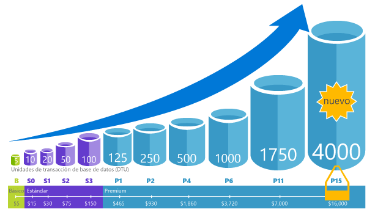

# Descripción de las unidades de transacción de bases de datos (DTU) y de las unidades de transacción de bases de datos elásticas (eDTU)
Este artículo explica las unidades de transacción de base de datos (Dtu) y unidades de transacción de base de datos elásticas (Edtu) y lo que ocurre cuando se alcanza Hola máximo Dtu o Edtu.  

## Qué son las unidades de transacción de base de datos
Para una sola base de datos de SQL Azure en un nivel de rendimiento específicos dentro de un [nivel de servicio](sql-database-service-tiers.md#single-database-service-tiers-and-performance-levels), Microsoft garantiza un cierto nivel de recursos para esa base de datos (independientemente de cualquier otra base de datos en la nube de Azure Hola) y proporcionar un nivel de predicción del rendimiento. Esta cantidad de recursos se calcula como un número de unidades de transacción de base de datos o DTU y es una medida combinada de CPU, memoria y E/S (E/S de datos y de registro de transacciones). proporción de Hello entre estos recursos originalmente se determina mediante un [carga de trabajo OLTP prueba comparativa](sql-database-benchmark-overview.md) diseñado toobe típico de cargas de trabajo OLTP reales. Cuando la carga de trabajo supera la cantidad de Hola de cualquiera de estos recursos, el rendimiento es limitado: resultante en el rendimiento más lento y tiempos de espera. recursos de Hello usados por la carga de trabajo no afecta a bases de datos SQL de tooother disponibles de hello recursos Hola nube de Azure, y recurso de hello usado por otras cargas de trabajo no afecta base de datos SQL de hello recursos tooyour disponible.

Dtu son muy útiles para la cantidad relativa de Hola de descripción de recursos entre bases de datos de SQL de Azure en diferentes niveles de rendimiento y los niveles de servicio. Por ejemplo, lo que duplica hello Dtu aumentando el nivel de rendimiento de Hola de una base de datos equivale toodoubling Hola formado por base de datos de recursos toothat disponible. Por ejemplo, una base de datos Premium P11 con 1750 DTU proporciona una potencia de proceso de DTU 350 veces mayor que una base de datos básica con 5 DTU.  

un conocimiento más profundo en el consumo de recursos (DTU) de saludo de la carga de trabajo, use toogain [información de rendimiento de consulta de base de datos de SQL de Azure](sql-database-query-performance.md) para:

- Identificar las consultas principales de Hola por el número de CPU, duración/ejecución que puede optimizarse para mejorar el rendimiento. Por ejemplo, una consulta de uso intensivo de E/S puede beneficiarse del uso de Hola de [técnicas de optimización en memoria](sql-database-in-memory.md) toomake mejor el uso de memoria disponible de hello en un cierto nivel de rendimiento y de nivel de servicio.
- Profundizar en los detalles de Hola de una consulta, ver su texto y el historial de utilización de recursos.
- Tener acceso a recomendaciones de ajuste del rendimiento que muestran las acciones realizadas por el [SQL Database Advisor](sql-database-advisor.md).

También puede [cambiar los niveles de servicio](sql-database-service-tiers.md) en cualquier momento con la aplicación de tiempo de inactividad mínimo tooyour (generalmente promedio de menos de cuatro segundos). Para muchas empresas y aplicaciones, que se va a las bases de datos pueda toocreate y marcado rendimiento hacia arriba o hacia abajo a petición es suficiente, especialmente si los patrones de uso son relativamente predecibles. Pero si tiene patrones de uso imprevistos, puede hacer los costos de disco duro toomanage y su modelo empresarial. Para este escenario, se usa un grupo elástico con un determinado número de Edtu que se comparte entre varias bases de datos en bloque de Hola.

## Qué son las unidades de transacción de base de datos elástica (eDTU)
En su lugar de proporcionar un conjunto dedicado de recursos (Dtu) tooa base de datos de SQL que está siempre disponible sin tener en cuenta si no necesita, puede colocar las bases de datos en un [grupo elástico](sql-database-elastic-pool.md) en un servidor de base de datos SQL que comparte un grupo de recursos entre las bases de datos. recursos de Hello compartido en un grupo elástico medido por elástico unidades de transacción de base de datos o Edtu. Grupos elásticos proporcionan una solución rentable simple objetivos de rendimiento de hello toomanage para varias bases de datos que tienen muy diferentes y patrones de uso impredecible. En un grupo elástico, puede garantizar que no hay una base de datos usa todos los recursos de hello en el grupo de hello y una cantidad mínima de recursos es siempre disponible tooa base de datos en un grupo elástico. Vea los [grupos elásticos](sql-database-elastic-pool.md) para más información.

A un grupo se le asigna un número fijo de eDTU, por un precio fijo. En el grupo elástico de hello, bases de datos individuales tienen tooauto escala de hello flexibilidad dentro de los límites de hello configurado. Con mucha carga, una base de datos puede consumir más Edtu toomeet demanda mientras que las bases de datos con cargas claros consumen menor, punto toohello que las bases de datos en ninguna carga no consuman Edtu. Mediante el aprovisionamiento de recursos para el grupo completo de hello, en lugar de cada base de datos, las tareas de administración se ha simplificado y tiene un presupuesto de predicción para el grupo de Hola.

Edtu adicionales se puede agregar tooan de bloque existente sin tiempo de inactividad de la base de datos y sin tener impacto en las bases de datos de hello en el grupo de Hola. De igual forma, si las eDTU adicionales dejan de necesitarse, se pueden quitar de cualquier grupo existente en cualquier momento. Puede agregar o restar el grupo de servidores de bases de datos toohello o importe del límite de Hola de Edtu que una base de datos puede utilizar en una carga elevada tooreserve Edtu para otras bases de datos. Si una base de datos es predecible infrautilizan recursos, puede mover fuera del grupo de Hola y configúrelo como una sola base de datos con una cantidad predecible de recursos que necesita.

## ¿Cómo se puede determinar el número de Hola de Dtu que sea necesario mediante la carga de trabajo?
Si desea toomigrate una local existente o tooAzure de carga de trabajo de máquina virtual de SQL Server base de datos SQL, puede usar hello [DTU calculadora](http://dtucalculator.azurewebsites.net/) número de hello tooapproximate de Dtu que sea necesitado. Para una carga de trabajo de base de datos de SQL Azure existente, puede usar [información de rendimiento de consultas de base de datos de SQL](sql-database-query-performance.md) toounderstand la base de datos recursos consumo (Dtu) tooget un poco más información sobre cómo toooptimize la carga de trabajo. También puede usar hello [sys.dm_db_ resource_stats](https://msdn.microsoft.com/library/dn800981.aspx) DMV tooget Hola consumo información de los recursos Hola última hora. Hola o bien, vista de catálogo [sys.resource_stats](http://msdn.microsoft.com/library/dn269979.aspx) también puede consultar tooget Hola mismos datos para hello últimos 14 días, aunque a una menor fidelidad de los promedios de cinco minutos.

## ¿Cómo se puede saber si podría beneficiarme de un grupo elástico de recursos?
Los grupos son apropiados para un amplio número de bases de datos con patrones de utilización específicos. Para una base de datos determinada, este patrón está caracterizado por una utilización media baja con picos de utilización relativamente poco frecuentes. Base de datos SQL automáticamente se evalúa como el uso de recursos histórico Hola de bases de datos en un servidor de base de datos SQL existente y se recomienda configuración de grupo adecuado de Hola Hola portal de Azure. Para más información, consulte [¿Cuándo se debe utilizar un grupo elástico?](sql-database-elastic-pool.md)

## ¿Qué ocurre cuando se alcanza el número máximo de DTU?
Los niveles de rendimiento estén calibrados y hello tooprovide aún se rigen necesario toorun de recursos la carga de trabajo de la base de datos de toohello límites máximo permitido para el nivel de rendimiento de la capa/servicio seleccionado. Si la carga de trabajo es alcanzar los límites de hello en uno de los límites de E/S de datos/CPU, E/S o registro, continuar tooreceive recursos de hello en el nivel máximo permitido de hello, pero son las latencias de toosee probable aumentado para las consultas. Estos límites no dan lugar a errores, pero en su lugar una ralentización de la carga de trabajo de hello, a menos que esté tan grave que las consultas de iniciarán la temporización, ralentización Hola. Si alcanza el límite máximo permitido de sesiones y solicitudes de usuario simultáneas (subprocesos de trabajo), se producirán errores explícitos. Consulte [Límites de recursos de Azure SQL Database](sql-database-resource-limits.md) para obtener información sobre el límite de otros recursos distintos de la CPU, memoria, E/S de datos y registro de transacciones de E/S.

## Pasos siguientes
* Vea [nivel de servicio](sql-database-service-tiers.md) para obtener información sobre la Dtu de Hola y Edtu disponible para las bases de datos únicos y para grupos elásticos.
* Consulte [Límites de recursos de Azure SQL Database](sql-database-resource-limits.md) para obtener información sobre el límite de otros recursos distintos de la CPU, memoria, E/S de datos y registro de transacciones de E/S.
* Vea [información de rendimiento de consultas de base de datos de SQL](sql-database-query-performance.md) toounderstand su consumo (Dtu).
* Vea [información general de criterio de referencia de base de datos SQL](sql-database-benchmark-overview.md) metodología de hello toounderstand detrás de la carga de trabajo de prueba comparativa de hello OLTP usa hello toodetermine DTU de blend.
